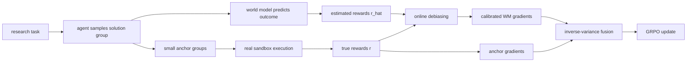

# Scaling Automatic Research Agents via World Models：用世界模型把 AutoResearch RL 的执行瓶颈移出热路径

### 元信息与 TL;DR

| 项目 | 内容 |
| --- | --- |
| 论文 | Scaling Automatic Research Agents via World Models |
| 作者 | Xiyuan Yang, Sheikh Sarwar, Jingru Cheng, Zhan Shi, Duanshun Li, Huiyuan Chen, Haiyang Zhang, Chenlei Guo, Jingrui He, Zhenyu Liao |
| 机构 | UIUC, Amazon |
| 发布 | arXiv:2608.12564v1，2026-08-12 20:11:25 UTC |
| 类型 | 大模型后训练 / AutoResearch Agent / World Model RL |
| 原文 | https://arxiv.org/abs/2608.12564 |

- **一句话结论**：这篇论文不是再做一个会写实验代码的 Agent，而是处理 AutoResearch Agent 后训练里的成本结构问题：生成 trajectory 可以批处理，执行每个候选方案却要独占 sandbox、数据和 GPU，因此真实执行奖励会成为 RL 扩展的硬瓶颈。
- **核心方法**：作者提出 World Model RL，简称 WMRL，让世界模型读取任务、候选解法和执行上下文，预测真实执行结果，再把预测分数作为大部分 RL reward；同时保留约 10% anchor groups 做真实执行，用这些成对分数校正世界模型的偏差和噪声。
- **两步校正**：Online Debiasing 用单调映射把世界模型分数重新标定到真实分数尺度；Inverse-Variance Denoising 按真实执行梯度流与世界模型梯度流的方差倒数做融合，减少更新噪声。
- **理论主张**：若直接用世界模型 reward，收敛误差多出 bias floor 和 variance term；WMRL 把 bias 项变成随训练收缩的项，并把 variance 项压到两条 reward 流的调和方差。
- **实验主证据**：在 MLE-Dojo(test) 和 DSBench 上，4B WMRL 用 286 GPU-hours，平均分达到 16.4 / 28.8，高于同规模真实执行 GRPO 的 15.2 / 25.7；9B WMRL 用 349 GPU-hours，达到 21.6 / 32.8，高于真实执行 GRPO 的 18.8 / 31.2。
- **成本证据**：同规模真实执行 GRPO 分别消耗 883 与 1174 GPU-hours，而 WMRL 分别消耗 286 与 349 GPU-hours，约 3 到 4 倍训练加速；并且 4B/9B WMRL 在平均分上超过 Kimi-48B-A3B 与 Nemotron-120B-A12B 这类更大开源 Agent。
- **跨域证据**：作者把同一思路迁移到 MiniVLA-1B 的 LIBERO-Long 后训练，用 Robometer 预测密集进度 reward、用稀疏环境成功信号作 anchor，整体成功率从 GRPO 的 38.3 提到 41.2。
- **关键局限**：世界模型没有被真正 fine-tune，而是 prompt-only；anchor 比例、单调校正假设、离散分数覆盖、sandbox 任务选择和 VLA 模拟环境都会影响外推；论文证明的是 reward 误差模型下的收敛改进，不等价于证明自动科研 Agent 已能替代真实实验验证。

### 研究问题：为什么 AutoResearch Agent 的 RL 不能只靠更多 rollout？

- AutoResearch Agent 的基本循环是：
  - 输入一个研究或机器学习工程问题；
  - 生成候选方案、代码、实验设置或提交文件；
  - 在真实环境里执行方案；
  - 用执行结果给 reward；
  - 再用 GRPO 之类的 RL 目标更新 Agent。

- 论文的关键观察不是“执行很慢”这么泛泛，而是**生成侧和执行侧的扩展规律不同**：
  - 生成侧可以靠 vLLM、SGLang 这类推理后端批处理；
  - 多条候选 trajectory 共享模型计算；
  - 边际 rollout 的推理成本可以被摊薄；
  - 执行侧却必须逐个 sandbox 运行；
  - 每个候选方案都要加载数据、安装环境、训练模型或跑 evaluator；
  - 每个执行都占用真实机器时间，无法像 token 生成一样被简单合批。


- Figure 1 的作用是把论文主张压成一个成本图：
  - 左侧是传统 RL：Agent 对同一研究问题采样一组方案，真实执行给每个方案打分；
  - 中间强调 trajectory 内部的不对称：generation 能共享算力，execution 要独立沙箱；
  - 右侧给出 WMRL 的替换：真实执行不再是每条 trajectory 的默认热路径，而变成小比例 anchor。

- 这使论文的问题定义非常具体：
  - **不是**怎样让 Agent 想出更聪明的研究 idea；
  - **不是**怎样写一个更强的 Kaggle solver；
  - **而是**怎样在保持 reward 与真实执行相关的前提下，把 RL 训练从“执行受限”变成“生成受限或模型受限”。

### 论文主张与论证路线

| 层次 | Claim | Mechanism | Evidence | Boundary |
| --- | --- | --- | --- | --- |
| 成本 | 真实执行是 AutoResearch RL 的扩展瓶颈 | 用世界模型预测执行结果，替代大部分真实执行 | GPU-hours 从 883/1174 降到 286/349 | 世界模型推理也有成本，但可批处理 |
| 质量 | 纯世界模型 reward 会退化 | 保留 anchor signal，估计偏差和噪声 | 纯 WM 平均分低于 WMRL，也低于真实 GRPO | anchor 覆盖不足会校正失败 |
| 理论 | 偏差和噪声进入收敛上界 | Online Debiasing 收缩 bias，IVD 降低 variance | Theorem 3/4 做逐项比较 | 依赖 smoothness、gradient domination、单调 distortion |
| 实验 | WMRL 能同时降成本和提分 | 在 MLE-Dojo、DSBench、LIBERO-Long 评测 | Table 1、2、3 的主结果与消融 | benchmark 仍是受控 sandbox 和模拟环境 |

- 论文的论证顺序很清楚：
  - 先把 AutoResearch RL 写成 group-based trajectory learning；
  - 再把真实 reward 替换成世界模型 reward；
  - 接着承认替换有代价：reward 里出现 bias 和 noise；
  - 然后用小比例真实执行 anchor 同时估计 bias 与 noise；
  - 最后证明校正项会改善收敛界，并用实验说明这种替换不是只省钱但掉点。

### 方法机制：WMRL 到底替换了哪一部分？

- 标准 AutoResearch GRPO 里，一个 task 会采样一组 trajectory：

```text
输入：任务上下文 x，当前策略 pi_theta
采样：tau_1, ..., tau_n ~ pi_theta(. | x)
执行：在真实 sandbox 中运行每个 tau_i 的最终方案
打分：r(tau_i) in [0, 1]
归一：A_i = r(tau_i) - mean_j r(tau_j)
更新：g_hat = (1/n) * sum_i A_i * grad_theta log pi_theta(tau_i)
```

- WMRL 改动的是“执行与打分”这一段：
  - 对大多数 groups，不再真的运行方案；
  - 世界模型接收同样的 task context 和 agent solution；
  - 它模拟执行过程并输出 predicted outcome；
  - 系统从 predicted outcome 读出估计分数 `r_hat(tau)`；
  - GRPO 仍按 group 内相对分数计算 advantage；
  - 因此 RL 目标从真实 `J(theta)=E[r(tau)]` 变成代理目标 `E[r_hat(tau)]`。



- 这个替换看似简单，但它把问题从“如何跑更多真实实验”变成“如何管住代理 reward 的误差”：
  - 世界模型若系统性高估某类方案，policy 会向假捷径收敛；
  - 世界模型若噪声很大，advantage 排序会被扰动；
  - 只靠世界模型的纯 WM baseline 正是在这两个问题上失分；
  - WMRL 的贡献是把真实执行重新引入为少量、可审计、可估计的 anchor，而不是完全放弃真实环境。

### 公式块：偏差、噪声与两步校正

**1. 世界模型 reward 误差分解**

```text
r_hat(tau) = r(tau) + b(tau) + xi(tau)

r(tau)      : 真实执行分数
r_hat(tau)  : 世界模型预测分数
b(tau)      : 系统性偏差，E[r_hat | tau] - r(tau)
xi(tau)     : 零均值噪声
B           : sup_tau |b(tau)|
sigma       : sup_tau std(xi(tau))
```

- 这一步定义了 WMRL 必须支付的“账单”：
  - bias 是长期方向错误，平均更多样本也不会消失；
  - noise 是随机扰动，会放大梯度估计方差；
  - 如果直接拿 `r_hat` 做 reward，理论上会多出 `O(B^2)` 和 `O(sigma^2)` 类误差。

**2. Online Debiasing**

```text
P = {(r_hat_j, r_j)}  来自 anchor groups
f_hat = argmin_f sum_{(r_hat_j, r_j) in P} (f(r_hat_j) - r_j)^2

约束：f 是单调映射
用途：把世界模型分数重新映射到真实执行分数尺度
```

- 为什么要求单调：
  - leaderboard percentile、成功率和得分天然有顺序；
  - 世界模型可以错估尺度，但若排序信息仍部分有效，单调校正能保留“高分仍应高于低分”的结构；
  - 这比任意函数拟合更保守，降低 anchor 数据少时过拟合的风险。

**3. Inverse-Variance Denoising**

```text
g_E   : anchor groups 产生的真实执行梯度流
g_WM  : 世界模型 groups 产生的校正后梯度流
V_E   : 真实执行梯度估计方差
V_WM  : 世界模型梯度估计方差

g_hat = (V_E^{-1} g_E + V_WM^{-1} g_WM) / (V_E^{-1}|G_E| + V_WM^{-1}|G_WM|)
```

- 直觉解释：
  - 哪条 reward 流更可靠，哪条梯度就被赋予更高权重；
  - 世界模型残差变大时，anchor 权重升高；
  - 世界模型接近真实环境时，大量可批处理的预测梯度承担主要更新；
  - 因此 WMRL 不是固定比例混合，而是用 residual 让训练在“省执行”和“防污染”之间自适应。


### 理论证据：为什么不是简单混合两个 reward？

- Theorem 3 说明纯世界模型 reward 的代价：

```text
J* - E[J(theta_T)]
<= (1 - gamma*mu/4)^T * Delta_0
   + O(M^2 B^2)
   + O(gamma V_WM)
```

- 三项含义分别是：
  - 几何收敛项：标准 RL 也有，训练越久越小；
  - bias floor：来自世界模型系统误差，不随 T 自然消失；
  - variance term：来自 noisy reward，步长和梯度方差越大越明显。

- Theorem 4 给出 WMRL 的改写：

```text
J* - E[J(theta_T)]
<= (1 - gamma*mu/4)^T * Delta_0
   + O_tilde(M^2 B^2 / (1 + T/T0))
   + O(gamma V_WM / (1 + V_WM/V_E))
```

- 这个界限的意义不在常数，而在结构：
  - bias 不再是永久地板，而是随 anchor pairs 累积和单调校正逐步收缩；
  - variance 不再直接使用世界模型流的方差，而是进入 inverse-variance fusion 后的较低方差；
  - 论文把“用少量真实执行监督大量预测 reward”形式化成可比较的两项改进。

- 但理论边界也必须说清：
  - 证明依赖 `J` 的 smoothness 与 gradient domination；
  - score distortion 被假设为单调；
  - true scores 要有足够离散 level coverage；
  - anchor pairs 的覆盖不能长期缺失；
  - 这些条件在 leaderboard percentile 或二值成功率场景较合理，但在开放式科学发现、湿实验或长链工具系统中未必自然成立。

### 实验设置：训练任务、模型和 sandbox

| 维度 | 论文设置 |
| --- | --- |
| AutoResearch 训练 | MLE-Dojo(train)，45 个训练 competitions |
| AutoResearch 测试 | MLE-Dojo(test)，14 个 held-out competitions |
| 迁移测试 | DSBench，数据科学任务，与训练集 disjoint |
| VLA 测试 | LIBERO-Long，模拟长程操作任务 |
| Agent backbone | Qwen3.5-4B 与 Qwen3.5-9B |
| 大模型参考 | Kimi-48B-A3B，Nemotron-120B-A12B |
| 真实 RL baseline | 同规模 Qwen3.5 GRPO |
| 纯代理 baseline | 同规模 Qwen3.5-WM |

- 训练细节值得注意：
  - 两个规模都用 GRPO；
  - 每步 8 个 groups，每组 `n=8` 条 trajectories；
  - 每条 trajectory 最多 4 个交互 turn；
  - 每 turn 最多生成 4096 tokens；
  - observations 截断到 1024 tokens；
  - 学习率 `1e-6`，KL coefficient `0.04`，entropy coefficient `0.002`；
  - 真实执行给每个 solution 一个 1200 秒预算；
  - 世界模型使用同一 agent backbone，prompt-only，不 fine-tune；
  - 世界模型上下文 12k tokens，输出预算 1024 tokens；
  - 每步至少一个 group 用真实执行进入 anchor pool；
  - anchor groups 实践中约占所有 groups 的 10%。

- sandbox 不是玩具环境：
  - Python 3.11 virtual environment；
  - Linux；
  - 单张约 40GB NVIDIA GPU；
  - 预装 122 个包及依赖；
  - 包括 numpy、pandas、scikit-learn、xgboost、lightgbm、catboost、torch、tensorflow、transformers、matplotlib 等；
  - Agent 通过 `DATA_DIR` 读输入，通过 `SUBMISSION_PATH` 写提交。

### 主结果：WMRL 同时省 GPU-hours 和提高平均分

| 方法 | GPU-hours | MLE-Dojo Avg | DSBench Avg | 读法 |
| --- | ---: | ---: | ---: | --- |
| Qwen3.5-4B | -- | 7.3 | 17.1 | 未后训练基线 |
| Qwen3.5-4B-GRPO | 883 | 15.2 | 25.7 | 真实执行 RL |
| Qwen3.5-4B-WM | 269 | 12.9 | 23.1 | 纯世界模型 reward |
| Qwen3.5-4B-Ours | 286 | 16.4 | 28.8 | WMRL，略多于 WM 成本但超过真实 GRPO |
| Qwen3.5-9B | -- | 9.6 | 23.9 | 未后训练基线 |
| Qwen3.5-9B-GRPO | 1174 | 18.8 | 31.2 | 真实执行 RL |
| Qwen3.5-9B-WM | 330 | 16.1 | 28.0 | 纯世界模型 reward |
| Qwen3.5-9B-Ours | 349 | 21.6 | 32.8 | WMRL，3.4x 左右节省且更高分 |

- 关键读法：
  - 纯 WM baseline 已经大幅省成本，但质量不够；
  - WMRL 比纯 WM 只多 17 到 19 GPU-hours，却修复了大量代理 reward 误差；
  - 4B WMRL 相对 4B GRPO，在 MLE-Dojo Avg 增加 1.2，在 DSBench Avg 增加 3.1；
  - 9B WMRL 相对 9B GRPO，在 MLE-Dojo Avg 增加 2.8，在 DSBench Avg 增加 1.6；
  - 9B WMRL 的 MLE-Dojo Avg 21.6 高于 Nemotron-120B-A12B 的 20.5；
  - 4B WMRL 的 DSBench Avg 28.8 高于 Kimi-48B-A3B 的 17.3，也高于 4B GRPO 的 25.7。

- 需要保留的反例：
  - 4B WMRL 在 MLE-Dojo Text 上从 GRPO 的 16.6 降到 16.1；
  - 9B WMRL 在 DSBench Regress 上从 GRPO 的 40.4 降到 39.2；
  - 这说明世界模型替换并非每个子类都严格增益；
  - 论文的更强结论是平均成本-效果前沿改善，而不是每项任务无条件更优。

### 跨域迁移：VLA 结果证明的是“奖励替换模式”，不是 AutoResearch 专属技巧

| 方法 | In-Domain Avg | OOD Avg | Overall |
| --- | ---: | ---: | ---: |
| MiniVLA-1B | 5.6 | 2.9 | 3.8 |
| MiniVLA-1B-SFT | 37.3 | 37.5 | 37.4 |
| MiniVLA-1B-GRPO | 39.3 | 37.8 | 38.3 |
| MiniVLA-1B-WM | 39.1 | 39.3 | 39.2 |
| MiniVLA-1B-Ours | 41.2 | 41.2 | 41.2 |

- VLA 设置里的 reward 形态不同：
  - AutoResearch 用 leaderboard percentile 或数据科学任务得分；
  - VLA 用 Robometer 预测八帧 progress value；
  - 真实环境只在 rollout 末端给稀疏 success；
  - 稀疏成功信号扮演 anchor。

- 这组实验的价值：
  - 它说明 WMRL 不是只会处理 Kaggle-like scoring；
  - 只要存在“便宜但有误差的代理信号”和“昂贵但可信的真实信号”，两步校正就可能迁移；
  - 但 VLA 仍是 LIBERO-Long 模拟环境，不能外推到真实机器人硬件或安全关键操作。

### 消融：OD 和 IVD 为什么是互补而不是重复？

| OD | IVD | 4B MLE | 4B DS | 9B MLE | 9B DS |
| --- | --- | ---: | ---: | ---: | ---: |
| 关闭 | 关闭 | 13.5 | 25.3 | 16.8 | 29.5 |
| 关闭 | 开启 | 14.9 | 26.2 | 18.0 | 31.2 |
| 开启 | 关闭 | 15.7 | 28.1 | 19.4 | 31.7 |
| 开启 | 开启 | 16.4 | 28.8 | 21.6 | 32.8 |

- 消融读法：
  - 只开 IVD，四列分别提升 0.9 到 1.7；
  - 只开 OD，四列分别提升 2.2 到 2.8；
  - 两者都开，提升 2.9 到 4.8；
  - OD 的贡献更大，符合理论里 bias 直接形成误差地板的分析；
  - IVD 仍有必要，因为即便分数尺度校正，随机噪声仍会扰动 group-relative advantage。

- “直接混合真实 reward 和世界模型 reward”不够：
  - 第一行就是两条流都存在但不校正；
  - 它在所有列都低于真实执行 GRPO；
  - 因此 WMRL 的重点不是“加一点真分数”；
  - 重点是用真分数构造可更新的映射与方差权重。

### Figure 与 Table 的证据边界

| 证据 | 支持什么 | 不能证明什么 |
| --- | --- | --- |
| Figure 1 | execution bottleneck 是 RL 扩展瓶颈，WMRL 改变成本路径 | 不能证明预测 reward 永远可靠 |
| Figure 2 | anchor pairs 如何进入 OD 与 IVD | 不能证明 anchor 覆盖所有失败模式 |
| Table 1 | AutoResearch 任务上成本下降且平均性能提升 | 不能保证每个子任务、每个指标都提升 |
| Table 2 | 同一机制能迁移到 VLA reward 融合 | 不能代表真实机器人系统 |
| Table 3 | OD 与 IVD 都有独立贡献 | 不能证明参数选择对所有任务稳健 |
| Appendix D | 给出训练、sandbox、recalibration 细节 | 代码和模型权重若不可得，仍限制复现 |

### 算法流程：把“少量真实执行”变成训练期仪表盘

```text
Input:
  task pool D
  policy pi_theta
  world model W
  anchor fraction alpha ~= 0.1
  group count m, group size n

State:
  anchor pair pool P = {}
  monotone calibrator f_hat = identity
  residual window R = []

Loop for t = 1...T:
  sample m task groups from D
  for each group k:
    sample n trajectories tau_{k,1:n} from pi_theta
    ask W to predict outcomes and scores r_hat_{k,1:n}

  choose anchor groups G_E by fixed balanced rule
  for k in G_E:
    execute tau_{k,1:n} in real sandbox
    observe true scores r_{k,1:n}
    add (r_hat, r) pairs into P and R

  if |P| >= 200 and new_pairs_since_refit >= 64:
    fit monotone f_hat on P

  calibrate non-anchor predicted scores:
    r_tilde = f_hat(r_hat)

  compute group-relative GRPO gradients:
    g_E from true anchor scores
    g_WM from calibrated world-model scores

  estimate residual eta_hat^2 from R
  set rho = 1 + eta_hat^2 / eta_cal^2
  clamp anchor factor into [1, 4]
  update theta with inverse-variance fused gradient

Output:
  post-trained AutoResearch policy pi_theta
```

- 这段流程的研究含义有三层：
  - anchor 不是 validation set，而是训练期在线仪表盘；
  - 世界模型不是离线 reward model，而是每步参与大量 trajectory scoring 的环境替身；
  - 校正器不是一次性标定，而是随 policy drift 反复 refit。

- 为什么 policy drift 重要：
  - 早期 Agent 写出的方案可能很粗糙，世界模型容易判断；
  - 中后期 Agent 会生成更接近可运行提交的方案，错误类型会变细；
  - 如果校正器只在 warmup 时拟合，后续分布变化会让 bias 重新出现；
  - 每 64 个新 anchor pairs refit 的设计，就是为了跟踪这个漂移。

- 这里也能看出论文没有把世界模型神化：
  - 当 residual 大，anchor 权重会上升；
  - 当 residual 小，世界模型流承担更多更新；
  - 当某个任务结果取决于不可从 solution 读出的随机因素，论文认为 WMRL 会退化到更依赖真实执行；
  - 这个退化路径比固定 9:1 或 1:1 混合更合理，因为它由观测到的误差触发。

### 训练数据划分：held-out 更大这一点很关键

- Appendix C 给出的 MLE-Dojo 划分规则不是随便抽样：
  - 在 tabular、text、image 三类里，各选数据规模最小的 20 个 competitions；
  - 每类前 15 个较小任务作为训练；
  - 每类剩余 5 个较大任务作为 held-out；
  - audio competitions 因不适配 sandbox 被排除；
  - 一个 held-out task 因 grader 缺依赖被移除；
  - 最终是 45 个训练任务和 14 个 held-out 任务。

- 这个规则让评测更接近“外推”：
  - held-out 不是同分布随机小任务；
  - 每个 held-out task 都比同类训练任务更大；
  - 因此 Table 1 的 MLE-Dojo(test) 不只是记忆题库；
  - 它更像在问：从较小 Kaggle-style workflows 学到的研究执行策略，能不能迁移到更大的未见任务。

- 但它也留下一个边界：
  - 任务仍来自“最小 20 个”这一受限 pool；
  - 排除 audio 与包不可用任务会使环境更可控；
  - 数据已提前缓存，训练和评测不依赖 Kaggle 在线服务；
  - 这些处理提高复现性，却也削弱了“真实开放科研环境”的复杂度。

### Reward hacking 视角：WMRL 防的不是所有攻击，而是 proxy drift

- 从安全角度看，WMRL 最容易被误解成“世界模型 reward 更便宜，所以可以放心扩大 RL”。

- 更准确的读法是：
  - 论文承认 learned proxy 会错；
  - 它把错误拆成 systematic bias 与 random noise；
  - 它只对这两类可由 anchor pairs 观测到的误差做校正；
  - 它没有解决恶意策略主动攻击 evaluator 的完整问题。

- 可能的 reward hacking 路径包括：
  - Agent 输出符合世界模型偏好的格式，但真实执行失败；
  - Agent 利用 prompt template 的盲点，让世界模型误判执行结果；
  - Agent 学会生成在短摘要里看似合理、但缺少关键依赖的代码；
  - 世界模型与 Agent 同 backbone，二者共享训练语料和推理盲区；
  - anchor groups 采样不到某类罕见失败，于是校正器无法修复该区域。

- 因此后续安全实验不应只看平均分：
  - 要构造 adversarial solutions，让世界模型高估但真实 evaluator 打低分；
  - 要按任务类型报告 residual 分布，而不只给一个总体平均；
  - 要比较同 backbone 世界模型与异构 backbone 世界模型；
  - 要检查 anchor selection 是否会被 policy 分布操控；
  - 要在推理期保留真实执行或静态验证，不能把 WMRL 的训练 proxy 当最终安全证书。

### 与本周已读 world-model 主题的区分

- 近期 Daily Report 已覆盖过多篇 Agent/world-model 或 memory 相关工作，因此这篇论文需要明确区分：
  - Qwen-AgentWorld 关注“训练语言世界模型，让它能作为通用 Agent 环境模拟器”；
  - Self-Evolving World Models 关注“部署期规划时，Agent 如何用记忆修正自己的世界模型预测”；
  - 本文关注“后训练过程中，如何用世界模型替代昂贵 execution reward，并用 anchor 信号防止 reward 误差积累”。

- 三者的核心对象不同：

| 工作类型 | 世界模型角色 | 主要风险 | 评估焦点 |
| --- | --- | --- | --- |
| 通用语言世界模型 | 模拟多个 Agent 环境 | 模拟保真度不足 | world-model benchmark 与 sim RL |
| 部署期规划世界模型 | 帮 Agent 预演行动后果 | 记忆污染、状态幻觉 | planning success 与预测精度 |
| WMRL | 后训练 reward provider | proxy bias/noise 与 reward hacking | GPU-hours、held-out score、校正消融 |

- 这个区分很重要：
  - 如果把本文当成“又一篇 Agent world model”，会错过它真正的系统问题；
  - 它关心的是 RL 数据生产线的吞吐，而不是 Agent 单次决策的认知能力；
  - 它把世界模型放在训练基础设施里，这比把世界模型放在 Agent prompt 里更接近工程瓶颈。

### 还应该补的实验

- 我希望看到四类额外结果：
  - **Anchor fraction sweep**：比较 1%、5%、10%、20% anchor groups 的成本、性能和 residual；
  - **World-model heterogeneity**：比较同 backbone、较小异构模型、较大异构模型作为世界模型；
  - **Adversarial proxy tests**：人工构造真实执行低分但世界模型容易高估的提交；
  - **Per-task residual audit**：把 residual、anchor 权重和最终得分按 competition 展开。

- 如果这些实验成立，论文主张会更强：
  - 可以知道 WMRL 的最小真实执行预算；
  - 可以判断同源世界模型是否会放大共享盲点；
  - 可以把平均分增益拆成“真实能力提升”与“proxy 校正成功”；
  - 可以发现哪些任务仍必须靠真实执行，而不能交给世界模型。

- 如果这些实验失败，也会非常有信息量：
  - 它会说明 WMRL 适合 score structure 清晰的 MLE/VLA 场景；
  - 不一定适合开放式论文构思、化学实验或安全攻防任务；
  - 这不是否定论文，而是明确它作为 reward infrastructure 的使用边界。

### 与相关工作的关系：它改变的是 reward 来源，不是 GRPO 本身

- MLE-Dojo 和 DSBench 提供了论文的现实性：
  - MLE-Dojo 是面向机器学习工程 Agent 的交互环境，覆盖 200+ Kaggle-like challenges；
  - DSBench 覆盖 466 个数据分析任务与 74 个数据建模任务；
  - 这类任务需要长上下文、文件处理、代码执行和指标计算，正好会暴露 execution bottleneck。

- DeepSeekMath 引入的 GRPO 是这里的优化背景：
  - GRPO 通过同一 prompt 下的一组 samples 构造相对 advantage；
  - 它省去 value model；
  - 但它仍需要 reward；
  - WMRL 的贡献不是替换 GRPO，而是替换 reward acquisition 的主要来源。

- 与 AgentWorld 或部署期 world model planning 的差别：
  - 之前许多 Agent/world-model 工作把世界模型用于规划、记忆或 rollout 想象；
  - 本文把世界模型嵌入后训练 reward loop；
  - 目标是扩大 RL 训练吞吐；
  - 所以它更接近“model-based reward infrastructure”，而不是“Agent 推理时多想一步”。

### 失败模式与可复现性追问

- 可能失败的场景：
  - 世界模型对某类方案有强系统性偏见，且 anchor groups 没有覆盖到；
  - benchmark score level 太稀疏或非单调，导致 isotonic recalibration 不稳定；
  - 真实执行本身有高随机性，使 anchor residual 长期很大；
  - Agent 学会写出“看起来会成功”的方案，骗过世界模型但真实执行失败；
  - sandbox 依赖、数据泄漏、leaderboard percentile 计算差异影响分数；
  - VLA 的进度模型把短期 motion progress 当成长期任务成功。

- 复现时最该检查的细节：
  - 45 个 MLE-Dojo training competitions 与 14 个 held-out competitions 是否完全一致；
  - DSBench 与训练集是否实际 disjoint；
  - anchor group 约 10% 的比例是否固定，还是随任务可调；
  - identity map 到 200 anchor pairs 之后再拟合的策略是否影响早期训练；
  - 每 64 个新 pairs refit 一次的频率是否对不同任务稳健；
  - anchor factor `[1, 4]` 的上界是否掩盖了某些高噪声场景；
  - 世界模型 prompt-only 的具体模板是否会显著影响 predicted outcome。

### 研究者视角的结论

- 这篇论文最有价值的地方是把 AutoResearch Agent 的后训练瓶颈从“模型能力不够”转回“reward acquisition 太贵”：
  - 如果 reward 必须来自真实执行，RL 扩展会被 sandbox 和 GPU 机器时间卡住；
  - 如果 reward 完全来自 learned proxy，训练又会被 proxy bias 和 reward hacking 污染；
  - WMRL 给出的是中间路线：大部分用可批处理代理信号，小部分用真实执行作在线校准。

- 对大模型后训练的启发：
  - RLVR、Agent RL、tool-use RL 都可能遇到类似结构；
  - reward 越依赖外部执行、真实评测或长链系统，越需要区分“生成吞吐”和“验证吞吐”；
  - 未来系统可能会把 evaluator、simulator、world model、anchor verifier 设计成一套 reward stack，而不是把 reward 当单一函数。

- 对 AI 安全的保守提醒：
  - WMRL 能降低执行成本，但也会让训练更依赖世界模型判断；
  - 如果世界模型继承了同一 backbone 的盲点，Agent 可能沿着共同盲区优化；
  - anchor signal 是必要防线，但是否足够取决于覆盖、采样策略和真实执行 evaluator 的抗攻击性；
  - 对危险工具、网络环境、真实财务或安全操作，世界模型 reward 不能替代硬约束、权限隔离和最终真实验证。

- 我会把这篇论文放在一句话里：
  - **它把 AutoResearch RL 的核心问题从“如何让 Agent 多试”改写成“如何让昂贵真实执行只在最有信息量的位置出现”。**

- 最后一个判读重点：
  - 这篇论文的贡献不应被简化成“用模拟器省钱”；
  - 它真正提出的是一种训练期责任分工；
  - 世界模型负责扩大 reward 覆盖；
  - 真实执行负责持续校准、审计和兜底；
  - 方差权重负责在二者之间动态分配信任；
  - 只有这三件事同时存在，WMRL 才避免落入纯 proxy reward 的常见陷阱。
