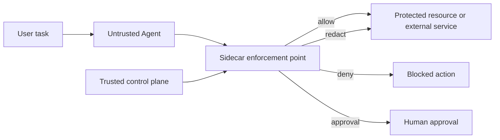
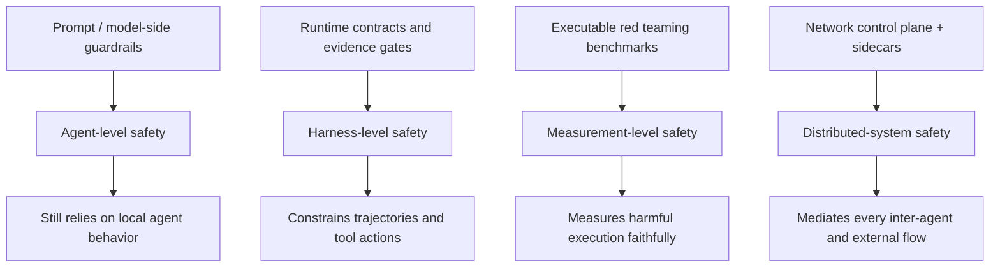

# Rethinking Agent Security as a Networking Problem：把 Agent 安全放回“网络边界”来做

| 项目 | 信息 |
| --- | --- |
| 论文 | Rethinking Agent Security as a Networking Problem |
| 作者 | Van Tran, Taveesh Sharma, Tajveer Singh Dhesi, Nick Feamster |
| 机构 | University of Chicago |
| 官方链接 | https://arxiv.org/abs/2608.12172 |
| 版本 | arXiv:2608.12172v1, 2026-08-12 15:29:51 UTC |
| 分类 | AI 安全 / Agent 安全 |

### TL;DR

1. 这篇论文的核心问题是：当 LLM Agent 可以访问企业资源、调用外部 API、和其他 Agent 通信时，为什么只靠 system prompt、模型微调、输出过滤或单个 Agent 自我约束，无法给出强安全保证。
2. 作者把 Agent 重新定义为一种网络实体：它不是孤立聊天机器人，而是会在用户、工具、内网服务、外部 API、记忆系统和其他 Agent 之间转发信息与动作的中间节点。
3. 论文主张把安全执行点从 Agent 内部移到 Agent 外部：用可信控制面定义策略，用每个 Agent 旁边的 sidecar 代理拦截工具调用、消息、记忆访问、文件访问和外部请求。
4. 机制上，sidecar 同时做两类判断：确定性执行约束负责 ACL、RBAC、工具白名单、网络策略、速率限制；语义上下文控制负责判断“这个任务、这个角色、这种数据、这个接收方、这个目的”是否合适。
5. 论文没有提出 benchmark 分数，也没有声称已经做出完整系统。它提供的是一套参考架构和研究问题：如何把网络安全里的集中控制、分布式执行、capability、off-by-default、zero trust、information flow control 迁移到 Agent 系统。
6. 最关键的边界是：语义引擎仍可能被伪造上下文误导；架构主要约束企业边界内和出站流量；数据一旦离开企业进入第三方服务，sidecar 不能保证外部计算不会滥用。
7. 对 AI 安全研究来说，这篇论文的价值不在“又加一个 guardrail”，而在把 Agent 安全从模型行为问题改写成分布式系统问题：谁有权定义策略、谁能看到每条流、谁能在动作执行前强制阻断。

### 研究问题：为什么 Agent 不是普通应用

作者开篇的判断很直接：

- LLM Agent 已经能自主计划、推理和执行多步工作流。
- 它们可以调用 API、访问企业资源、操作外部工具、协调其他 Agent，并且很多步骤不会有人工逐一审查。
- 因此，Agent 不只是“会说话的模型”，而是位于用户、服务、工具和外部 API 之间的新型网络中介。

这个重新定位很重要，因为它改变了安全问题的单位。

| 传统视角 | Agent 视角 |
| --- | --- |
| 用户或服务持有身份，应用按固定逻辑调用资源。 | Agent 代表用户行动，但行动路径由模型推理动态生成。 |
| 权限通常绑定账号、角色、API key 或 OAuth token。 | 同一个授权 Agent 可能在不同任务里应当共享不同数据。 |
| 防火墙、ACL、RBAC 假设行为相对可预测。 | 工具选择、消息内容、数据流方向会随上下文变化。 |
| 安全策略常在应用入口或出口执行。 | 风险可能出现在中间步骤：记忆读取、工具结果、跨 Agent 转发、第三方 API 请求。 |

论文用一个日程助手例子说明问题：

- 用户让主管 Agent 安排会议。
- Agent 可能读取日历、联系人、邮件摘要、地理位置或偏好。
- 它也可能把部分信息发给第三方订餐或订房服务。
- 即便 Agent 对日历有合法访问权，也不代表它可以把所有日历细节发给所有服务。

因此，安全判断不能只问：

- “这个 Agent 是否有日历权限？”
- “这个 API key 是否有效？”
- “模型回答是否看起来合规？”

还必须问：

- “本次任务是否需要这些数据？”
- “接收方是否适合收到这些字段？”
- “信息从哪个上下文转移到哪个上下文？”
- “如果 Agent 被 prompt injection 或 memory poisoning 操纵，谁能在它之外强制拦截？”

<u>论文的中心空白是：现有 Agent 安全太依赖被保护对象自己执行策略，而高风险系统里的执行点应当尽量独立于被约束对象。</u>

### 论文主张与论证路线

这篇论文不是实验型论文，而是架构型 position paper。它的论证路线可以拆成四步：

| 步骤 | Claim | Mechanism | Evidence | Boundary |
| --- | --- | --- | --- | --- |
| 1 | Agent 安全面临的是分布式信息流和动作流问题。 | 把 Agent 看作网络实体，把 agent-to-agent 与 agent-to-service 看作新型 flow。 | 作者列举 prompt injection、memory poisoning、goal hijacking、越权工具调用、数据库篡改、未授权交易等风险类型。 | 这些风险来自文献归纳，不是本文新 benchmark。 |
| 2 | 只靠 Agent 内部推理做安全执行不可靠。 | prompt、微调、模型侧过滤都让 LLM 参与策略解释与执行。 | 论文引用已有 guardrail 绕过、jailbreak、agent privacy leakage、sandbox/tool-control 相关工作。 | 不等于这些方法无用，而是它们缺少强制执行位置。 |
| 3 | 网络安全提供了可借鉴的架构原则。 | 集中控制、分布式执行、capability、off-by-default、least privilege、reference monitor。 | 作者类比 SANE、Ethane、SIFF、TVA、zero trust、information flow control、contextual integrity。 | 传统网络规则不懂语义，不能直接解决 Agent 适当性判断。 |
| 4 | Agent 安全需要确定性执行和语义策略结合。 | 控制面下发策略，sidecar 拦截所有外部动作，再路由到确定性引擎或语义引擎。 | Figure 1/2 给出 sidecar 架构和执行流。 | 仍有上下文伪造、动态 Agent、外部服务不可控、语义策略定义困难等开放问题。 |

这个论证的微妙处在于，作者没有简单说“网络更安全，所以把安全放进网络”。它真正说的是：

- 如果某个功能只有端点才能完整实现，就不该放进网络。
- 但 Agent egress control 的端点是 Agent 本身。
- Agent 可能被操纵，也可能误解策略。
- 因此，让 Agent 自己完成“阻止自己泄露或越权”并不完整。
- 安全控制应放在 Agent 无法绕过的路径上。

这正是论文对经典 end-to-end argument 的回应：不是反对端到端原则，而是指出在 Agent 场景里，端点本身不能可靠完成安全函数。

### 现有防御为什么不够

作者把现有防御分成几类，并不是为了否定它们，而是说明每类防御缺什么执行属性。

| 防御类型 | 代表做法 | 能解决什么 | 缺口 |
| --- | --- | --- | --- |
| 推理型防御 | 在 prompt 中加入安全步骤、隐私判断、数据最小化说明。 | 能让模型在正常情况下更注意政策。 | prompt injection 可以污染推理；执行点仍在 Agent 内部。 |
| 微调或后训练 | 让模型学习安全规范或 contextual integrity。 | 能改善默认行为和策略感知。 | 权重内化不是强制执行；运行时仍会受上下文、工具结果、攻击输入影响。 |
| 输入/输出过滤 | 检测敏感内容、恶意指令、违规输出。 | 能减少部分泄露或恶意内容进入/离开模型。 | 中间工具调用和跨 Agent 传递可能已经发生；过滤器也可能看不到完整轨迹。 |
| sandbox/tool control | 限制执行环境、工具接口、危险动作。 | 对代码执行、文件访问、外部资源有实用约束。 | 往往是局部机制，缺少统一语义策略和跨 Agent 流量视图。 |
| action verification | 在动作前后做验证或人工批准。 | 适合高风险动作。 | 成本高，难以覆盖每条低中风险信息流。 |

论文最强的批评是针对“policy enforcement 由 Agent 自己完成”：

- LLM 行为是非确定的。
- 安全提示可能被冲突指令覆盖。
- 检索内容、网页、工具输出、记忆内容都可能携带恶意文本。
- 多 Agent 场景下，一个 Agent 的输出会成为另一个 Agent 的输入，风险跨边界传播。

因此，作者认为强保证至少需要两个条件：

1. **关键动作有确定性执行机制**：无论模型是否合作，某些工具、目的地、数据路径都必须被硬约束。
2. **执行机制独立于被约束 Agent**：如果 Agent 能修改、忽略或绕过安全策略，策略就不是强执行。

这与近期 Agent 安全论文中的 runtime contract 思路相邻，但本文更强调网络化部署位置：

- runtime contract 关心 harness 如何在轨迹上执行安全要求。
- 本文关心所有 Agent 通信和资源访问应怎样通过可治理的网络边界。
- 二者交集是：安全不应只被当成模型参数里的偏好，而应是运行时系统属性。

### 方法机制：确定性执行加语义上下文

论文的核心机制可以写成一个二元组合：

```text
SecureAgentFlow = DeterministicEnforcement ∩ ContextAwareSemantics
```

变量含义：

- `DeterministicEnforcement`：不依赖模型自述或模型合作的硬规则，例如工具权限、网络目的地、数据路径、速率限制、审批要求。
- `ContextAwareSemantics`：判断某个信息流是否符合任务语义、用户意图、数据敏感度、角色关系和传输目的。
- `∩`：不是二选一，而是两个条件都要满足；硬规则给保证，语义判断给精度。

如果只有确定性执行，会退化成粗粒度连通性控制：

- Agent 可以访问批准的订餐服务。
- 但它可能把完整病历、日历隐私或客户 PII 发给这个批准服务。
- 传统 ACL 只能回答“能不能连”，不能回答“该不该发这些字段”。

如果只有语义上下文，会退化成今天常见的 guardrail：

- 模型或过滤器判断“这是否合适”。
- 但判断常常发生在 Agent 内部或 Agent 可影响的路径上。
- 一旦 prompt injection 改写上下文，策略执行仍是概率性的。

作者因此提出一个更适合 Agent 的策略形态：

```text
flow = (sender_role, recipient_role, subject, information_type, transmission_principle)
decision = check_flow(flow, task, labels, history)
```

变量解释：

- `sender_role`：发送者角色，例如日程 Agent、HR Agent、销售 Agent。
- `recipient_role`：接收方角色，例如内部日历服务、外部订餐 API、另一个 Agent。
- `subject`：信息涉及的主体，例如用户本人、客户、员工、患者。
- `information_type`：数据类型，例如可用时间、地址、支付信息、医疗信息、合同条款。
- `transmission_principle`：传输原则，例如“为完成当前会议预订”“仅内部使用”“不得转给第三方”。
- `labels`：数据敏感度、来源、信任级别、任务范围等标签。
- `history`：近期工具调用、跨 Agent 消息、用户请求和策略状态。

这明显借用了 contextual integrity 和 information flow control：

- contextual integrity 给出“适当信息流”的语言。
- information flow control 给出“按标签执行流控制”的系统直觉。
- sidecar 则把这两者放在网络 choke point 上执行。

### Figure 1：sidecar 架构说明了“谁在可信边界内”


Figure 1 的关键不是画了几个框，而是明确了信任边界：

| 组件 | 所在区域 | 职责 | 为什么重要 |
| --- | --- | --- | --- |
| Agent | Untrusted zone | 计划、推理、调用工具、与其他 Agent 协作。 | 它是能力来源，也是被攻击和被约束对象。 |
| Sidecar | Agent 旁路执行点 | 拦截消息、外部 API、工具调用、数据共享，并输出 allow/redact/deny/approval。 | 策略不在 Agent 内部执行，减少被 prompt injection 绕过的可能。 |
| Control plane | Trusted zone | 定义、编译、分发策略。 | Agent 不能修改自己的安全边界。 |
| Enterprise resources | Protected resources | 数据库、文件、内部 API、业务服务。 | 所有访问应先过策略网关。 |

这张图把 Agent 安全的权限关系改写成：



值得注意的是，论文没有把 sidecar 写成一个“更聪明的 Agent”。它更像网络里的策略执行点：

- 策略由控制面下发，而不是由 Agent 临时生成。
- 每条外部动作都必须经过它，而不是只在最终回答前检查。
- 它可以做确定性规则，也可以把需要语义判断的请求交给语义引擎。
- 它记录决策与执行上下文，供审计和策略迭代使用。

这使得安全边界从“模型是否愿意遵守”变成“动作是否能到达资源”。

### Figure 2：执行流把策略决策拆成两条路径


Figure 2 展示的端到端流程可以拆成六步：

1. 控制面定义并分发策略：
   - 确定性规则：ACL、RBAC、工具权限、网络策略、速率限制。
   - 语义策略：PII 如何使用、敏感数据能否出站、哪些目的需要审批。
   - 路由策略：哪些请求只需硬规则，哪些请求需要语义分析。
   - 元数据：数据敏感标签、风险阈值、被批准的语义评估模型。

2. Agent 尝试执行外部动作：
   - 工具调用。
   - 记忆读写。
   - API 请求。
   - 文件访问。
   - 跨 Agent 消息。
   - 数据共享。

3. Agent Policy Gateway 拦截请求：
   - 它是执行点，不是建议器。
   - 请求先被规范化成可检查对象。
   - 如果动作绕过 gateway，架构的强保证就失效。

4. Request Classifier / Policy Router 选择路径：
   - 明确规则可判定的请求走确定性引擎。
   - 依赖目的、语义、历史和敏感度的请求走语义引擎。
   - 高风险请求可以直接升级到人工审批。

5. 引擎输出决策：
   - `allow`：允许执行。
   - `deny`：拒绝动作。
   - `modify/redact`：修改或脱敏后再放行。
   - `escalate`：转人工批准。

6. Gateway 执行并记录：
   - 决策在动作执行前生效。
   - 日志用于审计、事故复盘和策略改进。

可以把这个流程写成伪代码：

```text
Input:
  request r = (agent_id, action, resource, payload, destination)
  task_context c
  policy_bundle P from trusted control plane
  execution_history H

State:
  labels L = classify_data(payload, resource, H)
  risk q = estimate_risk(action, resource, destination, L, c)

Loop:
  gateway intercepts r before execution
  route = policy_router(P.routing, q, action, L)

  if route == deterministic:
      decision = deterministic_engine(P.rules, r, L)
  else if route == semantic:
      decision = semantic_engine(P.semantic, r, c, H, L)
  else:
      decision = escalate_to_human(r, c, H, L)

  if decision == allow:
      execute(r)
  if decision == redact:
      execute(redact(r, P.redaction_rules))
  if decision == deny:
      block(r)
  record(decision, r, c, H, L)

Output:
  executed, redacted, denied, or approval-required action

Failure boundary:
  If the agent can bypass the gateway, forge context, or move data to untrusted external computation, the architecture loses part of its guarantee.
```

### Capability-based access：Agent 的默认状态应是“不可达”

论文最具体的系统原则是 capability-based access。它把 Agent 权限从静态身份改成窄范围、可验证、可撤销的任务能力。

传统权限常见形式是：

```text
principal = "calendar-agent"
permission = "read_calendar"
```

这对 Agent 不够，因为“能读日历”太粗：

- 当前任务可能只需要某一天的空闲时间。
- 外部服务只需要时间段，不需要会议标题和参会人。
- 内部 Agent 可以看到的字段，不一定能转给外部 API。

更适合的 capability 形态类似：

```json
{
  "agent": "scheduler",
  "task": "book_dinner_after_meeting",
  "allowed_destination": "approved_reservation_api",
  "allowed_information": ["free_busy_window", "party_size"],
  "forbidden_information": ["meeting_title", "attendee_names", "private_notes"],
  "purpose": "reservation",
  "expires_at": "task_end",
  "revocable": true
}
```

这个例子不是论文给出的 JSON，而是对作者机制的工程化展开。它体现了三点：

- capability 不是 Agent 自称拥有，而是可信策略权威签发。
- sidecar 可以验证 capability，而不是相信 Agent 的自然语言解释。
- 能力绑定目的、数据类型和接收方，比 API key 更适合上下文隐私。

这也解释了为什么作者引入 SIFF、TVA 和 off-by-default：

| 网络安全概念 | Agent 安全迁移 |
| --- | --- |
| 默认拒绝未知流量。 | Agent 默认不能联系新工具、新服务或新 Agent。 |
| 发送方需要获得可验证 capability。 | 任务开始或策略判断后，Agent 才获得窄能力。 |
| 网络设备验证 capability 后放行。 | sidecar 在每个外部动作前验证 capability。 |
| 接收方可阻止无能力流量消耗资源。 | 受保护资源不直接接受 Agent 原始请求。 |

作者留下的开放问题是 granularity：

- capability 应按任务签发，还是按动作签发？
- 数据标签应多细，才能既可执行又不泄露语义？
- 多 Agent 委托时，capability 能否传递，传递后是否降权？
- 动态工具出现时，如何更新 capability 而不打开过宽权限？

### 与传统网络安全类比：哪些能借，哪些不能照搬

论文使用网络安全类比，但没有把类比当成万能答案。可以把可迁移与不可迁移部分分开看。

| 网络世界 | Agent 世界 | 可迁移之处 | 不可直接迁移之处 |
| --- | --- | --- | --- |
| Packet / flow | Agent action / message / tool call | 都是跨边界流动对象。 | Agent payload 的风险取决于语义，不只取决于 IP、端口、协议。 |
| Firewall / middlebox | Sidecar / policy gateway | 都能在 choke point 执行策略。 | Agent 流量可能是自然语言、代码、文件、结构化 API 混合体。 |
| SDN controller | Trusted control plane | 集中策略、分布式执行。 | 策略必须表达用户意图、数据用途、组织规范。 |
| Capability token | Task-scoped agent capability | 可验证、可撤销、默认不可达。 | 数据隐私能力不等同于网络带宽或连接许可。 |
| Zero trust | Agent 不默认可信 | 不把 Agent 作为策略权威。 | 仍要允许 Agent 灵活规划，否则会牺牲自治能力。 |

这里最值得研究的是“语义策略如何编译成确定性执行”。论文给出的是方向，不是完整编译器。

一个可能的抽象是：

```text
Policy := Rule ∪ SemanticNorm

Rule:
  if action in forbidden_tools then deny
  if destination not in approved_destinations then deny
  if data_label == secret and destination == external then deny

SemanticNorm:
  if purpose(payload, task) not compatible with user_intent then escalate
  if information_type not necessary for recipient_role then redact
  if history shows untrusted source influenced action then require stricter path
```

困难在于：

- `purpose`、`necessary`、`compatible` 都不是纯语法判断。
- 语义引擎本身可能是模型或模型辅助系统。
- 语义结果如果不可审计，就会回到“相信模型”的问题。
- 如果语义引擎需要 Agent 提供上下文，攻击者可通过上下文劫持影响它。

所以本文架构更像研究议程：

- 先把执行点放对。
- 再研究语义策略如何表示、验证、路由和审计。

### 证据与图表边界

因为论文没有实验表，阅读时不能把它当成“某个方法比 baseline 提升多少”的工作。它的证据类型主要是：

| 证据类型 | 论文中承担的作用 | 能证明什么 | 不能证明什么 |
| --- | --- | --- | --- |
| 威胁与防御文献综述 | 说明 Agent 风险包括 prompt injection、memory poisoning、goal hijacking、过度共享、越权动作。 | Agent 安全问题确实跨输入、记忆、工具、通信和执行层。 | 不能量化本文架构实际降低多少风险。 |
| 网络安全历史类比 | 借用 SANE、Ethane、SIFF、TVA、zero trust、IFC 等思路。 | “策略权威在端点外部”是成熟系统原则。 | 不能说明这些机制直接适配自然语言语义。 |
| Figure 1 sidecar 架构 | 展示 trusted control plane 和 untrusted agents 的分离。 | 说明策略管理和运行时执行如何分层。 | 没证明 sidecar 部署成本、覆盖率或性能。 |
| Figure 2 执行流 | 展示请求分类、确定性引擎、语义引擎和审计闭环。 | 说明架构如何处理不同风险请求。 | 没给出 classifier 准确率、误报率或延迟。 |
| Discussion 限制 | 明确上下文伪造、外部服务、动态 Agent、风险路由仍开放。 | 作者没有过度声称强保证。 | 需要后续系统和实证工作补齐。 |

这个边界很重要：

- 本文不是“已经解决 Agent 安全”的论文。
- 它也不是“网络设备可以替代模型安全”的论文。
- 它的贡献是重新放置安全执行点，并给出一个可讨论的系统骨架。

### 与相关工作的位置关系

如果把近期 Agent 安全研究排成一张图，本文的位置比较清楚：



与 REDAgentBench、ToolHazard、Runtime Contract 的关系可以这样看：

| 工作方向 | 关注点 | 本文的互补性 |
| --- | --- | --- |
| REDAgentBench | 如何忠实测量 Agent 是否真的造成 harmful execution。 | 本文问：生产系统里应把拦截点放在哪里，才能在执行前阻断。 |
| ToolHazard | 如何生成对抗工具环境和训练安全 Agent。 | 本文问：即便 Agent 经训练更安全，系统是否仍需要不可绕过的边界。 |
| Runtime Contract | 安全应由 harness 在运行时执行，并绑定轨迹证据。 | 本文把 runtime enforcement 推到网络化 Agent 交互层，强调控制面和 sidecar。 |
| Contextual Integrity / PrivacyLens / AgentDAM | 如何判断信息流是否符合隐私语境。 | 本文尝试把 CI 从评测或模型推理语言变成 sidecar 可执行检查。 |
| IFC / capability systems | 如何按标签和 capability 控制流。 | 本文把受控对象从程序变量或网络包扩展到 Agent 动作图。 |

因此，本文最适合作为架构层补充：

- benchmark 告诉我们哪些 Agent 会失败。
- 后训练告诉我们如何改善模型默认行为。
- runtime contract 告诉我们如何在 harness 中执行约束。
- networking architecture 告诉我们如何在多 Agent、多服务、多边界系统里布置执行点。

### 失败场景：sidecar 也不是银弹

作者在讨论部分明确列出几个限制，值得逐条展开。

#### 1. 上下文劫持仍是核心风险

语义引擎要判断“这个请求是否适当”，必须读取上下文：

- 用户意图。
- 当前任务。
- 最近工具调用。
- 数据敏感度。
- Agent 角色和权限。
- 接收方身份和用途。

如果这些上下文由被攻击 Agent 提供，攻击者可能让上下文看起来合理：

- 伪造“用户已同意”。
- 把敏感字段伪装成普通备注。
- 删除能暴露风险的历史步骤。
- 把攻击目标改写成合法业务目的。

这意味着：

```text
Semantic guarantee <= context integrity guarantee
```

如果上下文不可验证，语义判断就不是强保证。后续研究必须回答：

- 哪些上下文来自可信日志，而不是 Agent 自述？
- 工具返回值和网页内容如何打标签？
- 跨 Agent 委托时，历史和标签怎样携带？
- 如何检测“上下文被伪造得太合理”的攻击？

#### 2. 出站边界之外不可控

本文主要解决企业边界上的 egress：

- Agent 发往外部服务的数据。
- Agent 访问内部资源的请求。
- Agent 与其他 Agent 或工具之间的通信。

但如果 sidecar 放行后，数据进入第三方服务，企业无法保证：

- 第三方如何存储数据。
- 第三方是否继续转发。
- 第三方模型是否把数据用于训练。
- 外部服务是否被攻击或误配置。

因此，sidecar 需要和更传统的供应商信任、数据处理协议、DLP、加密、最小化和审计结合。它不能单独替代外部服务治理。

#### 3. Ingress 比 egress 更难

作者认为从出站扩展到入站是自然方向，但入站更难：

- 出站流量经过企业控制的资源边界，sidecar 更容易部署。
- 入站消息来自外部发送方，恶意发送方可能不配合标签和检查。
- 如果外部 Agent 可以选择绕开可检查通道，sidecar 看不到内容。

可能的研究方向是“verifiable labels”：

- 外部发送方预先声明标签。
- 标签可验证、可追责、可拒收。
- 没有标签的流量默认降权或隔离。

这与电子邮件安全、供应链签名、零信任服务间身份有相似性，但 Agent 语义标签更复杂。

#### 4. 动态 Agent 和动态工具会冲击静态规则

确定性执行在以下条件下很好用：

- Agent 集合已知。
- 工具集合已知。
- 工作流路径能提前列出。
- 数据标签和接收方可注册。

现实 Agent 系统常常不是这样：

- Agent 会临时创建子 Agent。
- 编程 Agent 会安装新依赖、启动新服务、访问新文件。
- 企业插件和 MCP server 可能动态加入。
- 长任务中角色和信任级别会变化。

这会带来一个矛盾：

- 静态策略太紧，Agent 不能完成复杂任务。
- 动态授权太松，攻击者可借任务扩展获得新通路。

论文没有解决这个矛盾，只把它列为未来方向。研究者需要设计：

- 动态 capability 协商。
- 风险分级审批。
- 随任务阶段变化的最小权限。
- 可回滚、可审计的临时授权。

### 一个研究者视角的核心判断

这篇论文最值得带走的判断是：

> Agent 安全的核心对象不是“单次模型输出”，而是“带身份、权限、工具、记忆、外部服务和多跳通信的执行流”。

这句话带来三个后果。

第一，Agent 安全评测要记录流：

- prompt 与 response 不够。
- 必须记录工具调用、目的地、payload、数据标签、授权来源、历史路径。
- 否则无法判断信息是否在错误上下文中被共享。

第二，Agent 安全防御要控制流：

- 只训练模型“不要泄露”不够。
- 只在最终回答前扫一遍输出也不够。
- 真正的控制点应在动作执行前和数据离开边界前。

第三，Agent 安全规范要表达流：

- 策略不能只写“禁止泄露 PII”。
- 它要能表达“谁在什么任务中，为了什么目的，可以把哪些字段发给哪个角色，持续多久，是否可转发”。

因此，未来值得追问的问题不是“sidecar 是否比 prompt 更好”这么简单，而是：

| 研究问题 | 为什么关键 |
| --- | --- |
| Agent execution graph 的标准表示是什么？ | 没有标准图结构，就难以跨框架审计和执行策略。 |
| 语义策略能否编译成可验证规则？ | 如果不能编译，就会回到模型式概率判断。 |
| capability 怎样跨 Agent 委托而不扩权？ | 多 Agent 协作需要传递能力，但安全要求传递时降权。 |
| 上下文标签如何可信地产生？ | 语义引擎依赖上下文，标签源不可信会破坏保证。 |
| sidecar 部署在哪些 choke point 才够完整？ | 如果 Agent 可直连资源，策略执行点就会被绕过。 |
| 误报、延迟和人工审批如何平衡？ | 企业 Agent 要可用，不能所有动作都走重语义分析。 |

### 结论与局限

这篇论文提出的不是一个完整产品，而是一套把 Agent 安全系统化的架构语言：

- Agent 位于不可信区域。
- 控制面位于可信区域。
- sidecar 是运行时执行点。
- deterministic engine 给硬保证。
- semantic engine 处理上下文适当性。
- capability 让 Agent 默认不可达，只在任务范围内获得窄授权。
- audit 让决策和执行路径可追踪。

它的强点是把问题放对了层：

- 不把安全完全寄托在模型权重里。
- 不把 guardrail 当成 Agent 自律。
- 不把 API key 当成上下文授权。
- 不把最终回答安全当成全过程安全。

它的局限也同样清楚：

- 没有系统实现和性能评估。
- 没有误报率、漏报率、延迟或部署成本数据。
- 语义策略和上下文表示仍未形式化到可直接落地。
- 上下文劫持、动态 Agent、外部服务不可控仍是开放问题。
- 传统网络类比有启发，但自然语言语义和数据用途不是五元组能覆盖的。

对后续 AI 安全研究来说，本文最有价值的延伸方向是把 `Agent execution graph` 做成一等对象：

```text
G = (V, E)
V = agents ∪ tools ∪ memories ∪ resources ∪ external_services
E = information_flows ∪ action_requests

For each edge e:
  enforce(policy(e, task, labels, history))
  record(decision, evidence, capability, timestamp)
```

如果这个图能被标准化，Agent 安全就可以从“模型是否听话”推进到“系统是否能证明每条边被正确治理”。这正是论文标题里“networking problem”的真正含义。

### 参考与补充阅读

1. arXiv abstract and submission metadata: https://arxiv.org/abs/2608.12172
2. arXiv HTML full text: https://arxiv.org/html/2608.12172
3. arXiv PDF: https://arxiv.org/pdf/2608.12172
4. Rethinking Agent Security as a Networking Problem TeX source: https://arxiv.org/e-print/2608.12172
5. Contextual Integrity: Helen Nissenbaum, Privacy as Contextual Integrity
6. Information Flow Control: Myers and Liskov, A Decentralized Model for Information Flow Control
7. SANE and Ethane: centralized control and distributed enforcement for enterprise networks
8. SIFF / TVA / Off-by-Default: capability-based network access and default-deny connectivity
