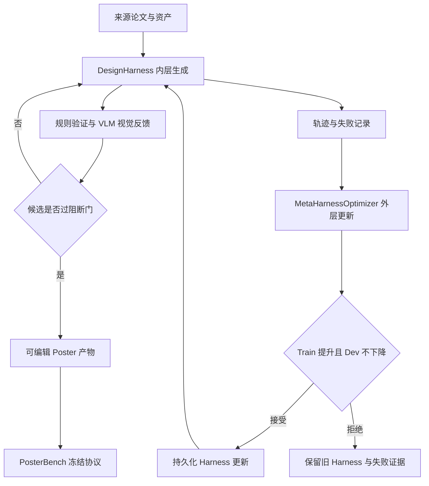

# AutoDesign：把长程 Agent 的 Harness 当成可优化对象

## 元信息与 TL;DR

- 原文：AutoDesign: Meta-Harness Optimization for Long-Horizon Agentic Design
- 类型：论文，arXiv:2608.13560v1，2026-08-13 提交
- 方向：大模型 Agent，long-horizon agentic design，meta-harness optimization
- 代码与数据：作者 GitHub 仓库公开，README 记录 2026-08-14 初始发布、2026-08-15 增加 DeepSeek Harness；HF 页面关联 PosterBench 与 PosterBench-mini 数据集。
- 本文核心问题：长程 Agent 的质量瓶颈不只在模型权重，也在包住模型的 harness。论文问的是，能否让一个外层 meta-harness 从多次 rollout、渲染诊断、评价反馈和人工参考中学习，持续改进内层设计 harness。

### TL;DR

- 论文把“论文转海报”定义为一个长程 agentic design 任务：系统要读论文、抽取证据、规划版面、生成可编辑 HTML、渲染检查、根据 critic 修改，再交付 poster、slides、webpage 或 video 等人类可用产物。
- 作者提出 **AutoDesign**：内层是 `DesignHarness`，负责单个 artifact 的生成与修复；外层是 `MetaHarnessOptimizer`，跨任务分析失败轨迹，并驱动 coding agent 每次只修改一个 harness 组件。
- 关键机制不是训练模型参数，而是优化固定模型周围的系统：context/memory、tools/specifications、execution runtime、orchestration、evaluation/feedback 五类组件被作为可更新对象。
- 形式化目标是最大化 harness 在任务分布上的期望评价 \(J(H)\)，接受门要求候选 harness 同时满足训练集提升、开发集不下降；这把“自改进”从口号变成可审计的 update gate。
- 论文构建 **PosterBench**：100 篇论文主轨，覆盖 AI/ML、生物医学、气候与地球环境、经济政策、物理天文五个学科；另有 10 篇 PosterBench-mini 用于受控消融。
- 主结果：PosterBench Main Track 上，AutoDesign + DesignHarness + Claude Code + Claude 4.8 得分 78.32，超过 Claude Design 7.45 分、OpenDesign 8.87 分；AutoDesign + Codex + GPT-5.5 得 77.97。
- harness attachment 消融显示，在七个模型/代码 Agent 配置上加入 DesignHarness 都提升 PosterBench-mini 分数，平均从 54.99 到 67.39，单项增益 5.01 到 19.56 分。
- 人评不是只看自动分：11 名志愿者做系统盲 pairwise poster 比较，提交 936 次响应，其中 933 次有效排序；AutoDesign 的 Bradley-Terry 胜率估计为 64.0%，95% 区间 55.2%-77.8%。
- 局限同样重要：真正正式验证的是 paper-to-poster；slides、webpage、video 仍是 pilot。PosterBench 与外层 evaluator 也可能被 reward-hack，作者因此强调冻结基准、开发集门控、人工审计和未来的 evaluator versioning。

## 研究问题：为什么要优化 Harness，而不是继续堆 Prompt？

### 作者真正抓住的是“系统层可学习性”

- 长程 Agent 的输出质量通常由三层共同决定：
  - **模型能力**：底层 LLM/MLLM 是否能读懂来源、写代码、做视觉判断。
  - **任务 Harness**：怎样组织上下文、调用工具、保留状态、渲染与验证、把反馈转成下一步修改。
  - **评价与门控**：什么算好输出，哪些错误必须阻断，哪些改动可以进入持久系统。
- 许多设计系统只在 response 级别做迭代：
  - 当前 poster 不好，就让模型再改一次；
  - 当前版面溢出，就局部修一下；
  - 当前图片不清楚，就替换或缩放。
- AutoDesign 关心的是更深一层：
  - 这些失败是否反复出现？
  - 反复出现的失败应不应该改变工具、提示、验证器或编排？
  - 如何防止一次“看似变好”的 harness 更新在新任务上退化？

### 论文把设计任务选得很具体

论文没有从抽象“任意 multimodal output”开始，而是选择 academic paper-to-poster：

| 任务要求 | 为什么对 Agent 难 | 对方法论的作用 |
|---|---|---|
| 读完整论文 | 来源长、包含公式、图表、实验和局限 | 检验 source grounding |
| 压缩成单页海报 | 信息密度与可读性冲突 | 检验规划和取舍 |
| 使用图表证据 | 图像、表格、文字要共同解释 claim | 检验 multimodal evidence |
| 产物可编辑 | 不能只吐一张不可修改图片 | 检验 HTML/CSS/资产管线 |
| 渲染后检查 | 版面溢出、遮挡、占位符、OCR 错误常见 | 检验 runtime 与 validator |
| 人类偏好 | 好海报不等于只满足规则 | 检验 VLM critic 与人评 |

这个选择很合适：它足够窄，能建立 benchmark；又足够长程，能暴露 harness 的状态管理、工具调用和反馈转译问题。

## 论文主张与论证路线

### claim -> mechanism -> evidence -> boundary

| 层次 | 论文怎么做 | 支撑什么 | 仍不能证明什么 |
|---|---|---|---|
| Claim | 长程设计 Agent 的 harness 可以作为优化目标 | 系统层改进不必等同于模型后训练 | 不代表所有 Agent harness 都能同样自改进 |
| Mechanism | 内外双环：内层修 artifact，外层修 harness | 把单次反馈与持久系统更新分开 | 外层 evaluator 自身仍可能有偏 |
| Credit assignment | 每次外层更新限制在五类 harness 组件之一 | 让 gain/regression 可归因 | 组件之间有交互，单组件更新可能低估组合收益 |
| Overfitting guard | train 提升且 dev 不下降才接受 | 避免只适配训练海报 | dev 集规模、分布和 evaluator 质量仍是前提 |
| Evidence | PosterBench 主轨、mini、受控 track、harness attachment、人评 | 覆盖自动分和盲人评两条证据链 | 人评样本只有 11 名志愿者，agreement 也不高 |
| Boundary | 正式验证集中在 paper-to-poster | 结论清楚落在一个可审计任务 | slides/web/video 还只是演示方向 |

### 为什么这篇对 Agent 研究者重要？

- 它把 Agent 系统中的“脚手架”从工程技巧提升到研究对象：
  - context 和 memory 怎么保留；
  - tools 和 specs 怎么约束产物；
  - runtime 怎么把代码、浏览器、渲染、导出连起来；
  - orchestration 怎么决定重试、回退和候选晋级；
  - evaluation/feedback 怎么定位失败。
- 它也给了一个可讨论的 self-improvement 标准：
  - 不是“模型说自己改进了”；
  - 不是“单个例子看起来更好”；
  - 而是 candidate harness 必须在训练任务上更好、开发任务不退化，并留下 checkpoint 与 iteration record。

## 方法机制：两个循环、五类组件、一个接受门

### 1. Design Harness：固定模型周围的可执行系统

论文把 design harness 写成：

\[
y \sim H(\pi_\theta, x, c)
\]

变量解释：

| 符号 | 含义 | 在 AutoDesign 里的对应 |
|---|---|---|
| \(\pi_\theta\) | 固定的 LLM/MLLM | Claude 4.8、GPT-5.5、GLM、Kimi、LongCat、DeepSeek 等 |
| \(x\) | 多模态来源 | 论文 PDF、图表、表格、元信息、来源资产 |
| \(c\) | 设计上下文 | 输出格式、poster 约束、用户要求、模板或参考 |
| \(H\) | design harness | 工具、prompt、运行时、验证器、critic、编排 |
| \(y\) | 生成产物 | 可编辑 HTML poster、slides、webpage 或 video |
| \(\tau\) | 执行轨迹 | 中间动作、状态、渲染、诊断、修改记录 |

论文强调 \(\theta\) 不变，优化目标是 \(H\)。这点非常关键：AutoDesign 不是“把 poster 任务拿来微调模型”，而是在固定模型外面学习一个更可靠的生产系统。

### 2. 五类 Harness 组件

作者把 \(H\) 拆成五类，便于外层做 bounded update：

| 组件 | 负责什么 | 典型失败 |
|---|---|---|
| Context and Memory | 来源管理、prompt、skills、可复用资产、持久状态 | 证据丢失、上下文碎片化、重复犯错 |
| Tools and Specifications | 编辑规格、布局约束、字体、资产、provenance | 产物不可编辑、图表引用不可追踪 |
| Execution Runtime | 工作区、浏览器、渲染、验证、导出 | HTML 能生成但渲染坏、导出丢资产 |
| Orchestration | 路由、尝试预算、循环控制、候选选择、fallback | 无限重试、过早停止、坏候选晋级 |
| Evaluation and Feedback | 规则验证、VLM critique、局部反馈 | 只给泛泛评价，无法指导局部修复 |

外层每次只允许改一个组件。这个限制看似保守，但它让改动有可解释归因：如果同时改 prompt、validator、runtime 和 finalization，分数上升后很难知道真正有效的是哪一部分。

### 3. Inner Loop：修当前 artifact

内层最小结构是 Designer 和 Critic：

\[
\begin{aligned}
y_k &= M_{\mathrm{design}}(y_{k-1}, f_{k-1}; x, c) \\
f_k &= M_{\mathrm{critic}}(y_k; x, c)
\end{aligned}
\]

直观流程：

1. 第一次没有旧 artifact 和反馈，Designer 根据论文与设计上下文生成初稿。
2. Validator 做确定性检查，例如资产缺失、provenance 断裂、严重溢出、遮挡、排版约束违反。
3. 如果阻断检查失败，系统渲染预览图，让 VLM critic 评估布局、可读性、美学和视觉证据。
4. 规则诊断和视觉反馈合并为 \(f_k\)，Designer 只修局部失败区域，而不是重写所有内容。
5. 最多 \(K=12\) 次 refinement；若没有候选完全过关，系统用历史尝试和 fallback 机制选一个可交付候选。

### 4. Outer Loop：修未来会继续用的 Harness

外层目标是优化 harness 的期望质量：

\[
J(H)=\mathbb{E}_{(x,c)\sim p_{\mathrm{task}},\, y\sim H(\pi_\theta,x,c)}
\left[R_{\mathrm{meta}}(y,x,c)\right]
\]

其中 \(R_{\mathrm{meta}}\) 是外层优化用 evaluator。它根据人工标注参考 artifact 的七个维度构造，之后在自主优化中固定。

外层更新可写成：

\[
H'_{t+1}=P(H_t,\boldsymbol{\tau}_t,\boldsymbol{s}_t,\mathcal{L})
\]

解释：

| 符号 | 含义 |
|---|---|
| \(P\) | MetaHarnessOptimizer，实例化为 coding agent |
| \(\boldsymbol{\tau}_t\) | 当前 harness 在训练任务上的多条轨迹 |
| \(\boldsymbol{s}_t\) | evaluator 对这些轨迹产物的分数 |
| \(\mathcal{L}\) | 优化记录，包含历史 checkpoint、计划、代码改动、接受/拒绝结果 |
| \(H'_{t+1}\) | 候选更新 harness |

### 5. 接受门：自改进必须同时过 train 和 dev

\[
\operatorname{Accept}(H'_{t+1})
\iff
J_{\mathrm{train}}(H'_{t+1})>J_{\mathrm{train}}(H_t)
\land
J_{\mathrm{dev}}(H'_{t+1})\ge J_{\mathrm{dev}}(H_t)
\]

这个门控有两个作用：

- **防止训练集过拟合**：只在训练任务涨分不够，开发任务不能下降。
- **保护优化记录的可审计性**：被拒绝的候选不会覆盖当前 harness，但其失败证据会进入 \(\mathcal{L}\)，下一轮可以避免重复尝试。

## 算法流程：从轨迹证据到 Harness 更新

### 伪代码视角

```text
Input:
  fixed model pi_theta
  initial design harness H_0
  meta evaluator R_meta
  train task set D_train
  dev task set D_dev
  outer-loop budget T

State:
  optimization record L
  active harness H_t

for t in 0..T-1:
  roll out H_t on D_train
  collect artifacts, trajectories tau_t, scores s_t

  optimizer P reads:
    - current harness H_t
    - trajectories and scores
    - historical record L

  P identifies recurrent failures
  P selects exactly one harness component
  P writes a bounded update plan
  P edits code/prompts/specs to produce candidate H'_t+1

  evaluate H'_t+1 on D_train and D_dev

  if train improves and dev does not decline:
    accept H'_t+1 as H_t+1
  else:
    keep H_t

  append checkpoint, evidence, plan, diff, decision to L

Output:
  optimized DesignHarness H_T
  complete optimization record L
```

### 论文报告的优化规模

作者在贡献描述里给出一个很重要的执行量级：

| 量级 | 数字 | 含义 |
|---|---:|---|
| 演化时间 | 7 days | 不是一次 prompt search，而是一段持续外层优化 |
| subagents | 224 | 外层 planner 会派并行分析者审阅轨迹和分数 |
| recursive iterations | 至少 123 | 多轮候选 harness 更新与门控 |
| harness updates | 54 | 最终累积到 DesignHarness 的持久改动 |
| 单个 poster 生成 | 253 tool calls、11 editing turns、约 40 分钟、低于 3 美元 | 展示最终 harness 在一个长程任务中的执行成本 |

这里要读得谨慎：这些数字说明系统确实在做多轮外层优化，但不等于每个 update 的因果贡献都被单独证明。真正支撑结论的是后面的受控 track 与 harness attachment 消融。

## PosterBench：自动评价不是一个总分，而是带门控的协议

### 七维评分

PosterBench 对每个 rendered poster 给出七个 \(q_j\in[0,10]\)：

| 维度 | 权重 | 主要评价方式 | 关注点 |
|---|---:|---|---|
| Faithfulness | 10 | 程序检查 + VLM | 数字、实体、claim 与论文一致 |
| Coverage | 10 | VLM | 是否保留问题、方法、证据、结论 |
| Density | 15 | 程序检查 | 信息占用、OCR 文本覆盖、空白、截图滥用 |
| Visual Evidence | 10 | 程序检查 + VLM | 图表是否相关、可读、局部解释 |
| Layout | 20 | 程序检查 | 尺寸、OCR fallback、裁切、重叠、占位符 |
| Readability | 25 | 程序检查 + VLM | 文本尺度、层级、扫描路径、拥挤程度 |
| Aesthetics | 10 | VLM | 学术视觉工艺、字体、配色、构图 |

加权 rubric 分数：

\[
R_{\mathrm{rubric}}(p_i,A_i)=
\sum_{j=1}^{7}\alpha_jq_{i,j}/10,\quad
\boldsymbol{\alpha}=(10,10,15,10,20,25,10)
\]

但最终分不是简单加权均值。它还会套上 record-level ceiling：

\[
R_{\mathrm{poster}}(p_i,A_i)=
\min(R_{\mathrm{rubric}}, C_i^{\mathrm{layout}},
C_i^{\mathrm{viability}}, C_i^{\mathrm{failure}}, C_i^{\mathrm{gate}})
\]

这意味着：

- 某个 poster 维度均分不错，但如果有严重 gate violation，整体会被封顶。
- 表格里的 dimension means 不能直接重算 Overall，因为 ceiling 是逐 poster 先应用、再平均。
- 这个设计防止系统靠高覆盖、高密度掩盖严重渲染失败。

### PosterBench 与外层 evaluator 不同

论文特别区分两类 evaluator：

| Evaluator | 用在哪里 | 是否在优化中变化 | 风险 |
|---|---|---|---|
| \(R_{\mathrm{meta}}\) | 外层 meta-harness 更新 | 构造后在一次优化中固定 | 可能偏向参考样例 |
| PosterBench | 最终系统比较 | 冻结外部协议 | 可能仍与人类偏好不完全一致 |

这个区分很重要。若用同一个 evaluator 既训练 harness 又报告最终成绩，就很容易把 harness 训练成 evaluator exploit。论文用 PosterBench 和人评提供第二条证据链。

## 实验设置与主结果

### Benchmark 轨道

| Track | Papers | 固定因素 | 变化因素 |
|---|---:|---|---|
| PosterBench Main Track | 100 | 来源论文、来源资产、输出契约、冻结协议 | 完整系统配置 |
| PosterBench-mini Main Track | 10 | 10 篇共享论文、输出契约、冻结协议 | 完整系统配置 |
| Design Harness Track | 10 | Claude Code + Claude 4.8 | design harness |
| Coding Harness Track | 10 | AutoDesign + GLM 5.2 | coding harness |
| Model Track | 10 | AutoDesign + Claude Code | model |
| Harness-Attachment Ablation | 10 | model、code agent、论文和协议 | 是否挂载 DesignHarness |

### Main Track：完整系统比较

PosterBench 100-paper Main Track 的关键行：

| System | Design Harness | Coding Agent | Model | Score |
|---|---|---|---|---:|
| AutoDesign | DesignHarness | Claude Code | Claude 4.8 | 78.32 |
| AutoDesign | DesignHarness | Codex | GPT 5.5 | 77.97 |
| Claude Design | Claude Design | Claude Code | Claude 4.8 | 70.87 |
| OpenDesign | OpenDesign | Claude Code | Claude 4.8 | 69.45 |
| Codex baseline | 无 | Codex | GPT 5.5 | 73.37 |
| Claude Code baseline | 无 | Claude Code | Claude 4.8 | 70.01 |
| PosterGen | 无 | 无 | Claude 4.8 | 56.71 |
| Any2Poster | 无 | 无 | Claude 4.8 | 49.09 |
| Paper2Poster | 无 | 无 | Claude 4.8 | 44.61 |

读法：

- AutoDesign 的 top score 不是靠单一模型路线：
  - Claude Code + Claude 4.8 路线得 78.32；
  - Codex + GPT-5.5 路线得 77.97。
- 与 Claude Design 的差距是 7.45 分，与 OpenDesign 的差距是 8.87 分。
- baseline coding agent 本身并不弱：Codex + GPT-5.5 无 DesignHarness 也有 73.37。AutoDesign 的贡献更像是把强 coding agent 的输出变得更稳定、更可交付，而不是从零替代模型能力。

### PosterBench-mini：受控对比

10-paper mini 结果用于更细的控制：

| 配置 | Score | 对应 baseline |
|---|---:|---:|
| AutoDesign + Codex + GPT-5.5 | 81.46 | Codex + GPT-5.5 baseline 75.87 |
| AutoDesign + Claude Code + Claude 4.8 | 74.56 | Claude Code + Claude 4.8 baseline 69.55 |
| OpenDesign + Claude Code + Claude 4.8 | 70.36 | - |
| Claude Design + Claude Code + Claude 4.8 | 66.83 | - |

这组结果支撑一个较窄但更可信的结论：在同一小集合上，DesignHarness 的加入能在固定模型/代码 Agent 时带来稳定增益。

## 消融：DesignHarness 到底带来多少？

### Harness attachment 七组配置

| Model + Coding Agent | Original | AutoDesign | Gain |
|---|---:|---:|---:|
| GPT-5.5 + Codex | 75.87 | 81.46 | +5.59 |
| Claude 4.8 + Claude Code | 69.55 | 74.56 | +5.01 |
| Seed 2.1 Pro + Claude Code | 54.01 | 71.83 | +17.82 |
| Kimi K2.7 + Claude Code | 57.20 | 70.12 | +12.92 |
| GLM 5.2 + Claude Code | 50.32 | 64.33 | +14.01 |
| LongCat 2.0 + Claude Code | 43.26 | 55.13 | +11.87 |
| DeepSeek V4 Pro + Claude Code | 34.73 | 54.29 | +19.56 |

这张表最有价值，因为它把“更强模型导致更好 poster”和“更好 harness 导致更好 poster”拆开了：

- 对强配置，DesignHarness 仍有 5 分左右提升。
- 对弱配置，DesignHarness 带来的修复空间更大，最高接近 20 分。
- 平均从 54.99 到 67.39，说明 harness 不只是某个模型的 prompt trick。

### 成本-性能边界

论文报告了七个 AutoDesign 模型配置的 cost-performance frontier：

| 配置 | PosterBench-mini Score | 成本线索 |
|---|---:|---:|
| LongCat-2.0 | 55.13 | 约 0.27 美元 / poster |
| Doubao Seed 2.1 Pro | 71.83 | 约 2.75 美元 / poster |
| Claude 4.8 | 74.56 | 约 7.63 美元 / poster |
| GPT-5.5 | 81.46 | 约 10.02 美元 / poster |

作者指出 Doubao 达到 GPT-5.5 分数的 88%，成本约为 27%。这不是在证明“便宜模型足够好”，而是在说明 harness 优化后，模型选择可以在质量与成本之间形成可量化 frontier。

## 人类评价：自动分和人偏好是否同向？

### 系统盲 pairwise study

人评设置：

- 11 名志愿 reviewers。
- 100 篇 PosterBench Main Track 论文。
- 比较系统包括 AutoDesign、Claude Code、OpenDesign、Claude Design。
- 每个任务展示同一篇论文生成的两张匿名 poster，不暴露系统、模型和 harness 身份。
- 选择项包括左侧、右侧、大致相同、skip。
- 共 936 响应，其中 933 个 ranking judgments、3 个 skip。

Bradley-Terry 模型：

\[
\Pr(i \succ j)=
\frac{\exp(\beta_i)}{\exp(\beta_i)+\exp(\beta_j)}
\]

结果：

| 指标 | AutoDesign |
|---|---:|
| Bradley-Terry probability of beating uniformly sampled alternative | 64.0% |
| 95% crossed bootstrap interval | 55.2%-77.8% |
| tie-adjusted vs Claude Code | 61.3% |
| tie-adjusted vs OpenDesign | 63.1% |
| tie-adjusted vs Claude Design | 67.6% |

### 自动分和人偏好不是完全相同的东西

论文报告 poster-level PosterBench 分数与人类 tie-adjusted preference 的相关：

| 关系 | 数字 |
|---|---:|
| poster-level correlation \(r\) | 0.34 |
| 95% paper-cluster bootstrap interval | [0.22, 0.44] |
| 0-3 分 PosterBench gap 时，人类同意 benchmark-preferred 的比例 | 51.9% |
| 至少 20 分 gap 时，人类同意比例 | 74.4% |

这个结果比“人评验证自动分完全正确”更可信：

- 小分差时，自动指标几乎不能强判人类偏好。
- 大分差时，自动指标有更强区分力。
- PosterBench 评价的是 faithfulness、coverage、density、visual evidence、layout、readability、aesthetics 的综合协议；人类 pairwise preference 是即时视觉与理解选择，两者不应完全重合。

## Figure / Table 证据逐项解读

### Figure 1：演化轨迹与 Harness 增益

Figure 1 分成两部分：

- **Meta-harness optimization trace**：
  - 展示一个代表论文的 poster 分数随外层迭代变化；
  - 自主优化先提升初始 harness；
  - plateau 后，人工 guidance 重新引导搜索并带来进一步增益。
- **Performance gains from DesignHarness**：
  - 展示加入 DesignHarness 后，所有 coding agent 的 PosterBench 分数都提高；
  - 增益区间是 5.0 到 19.6；
  - 最高 overall score 约 81.5。

这张图支持“harness 可以累积改进”，但也暴露边界：完全自主优化会停滞，human guidance 在当前系统里仍是重要 escape hatch。

### Figure 2：AutoDesign for AutoDesign

论文展示 AutoDesign 为自身论文生成的 poster：

- 它证明最终产物不是纯文本回答，而是完整可视 artifact。
- 作者报告单次生成过程约 40 分钟、253 次 tool calls、11 个 editing turns、低于 3 美元。
- 这更像 execution trace evidence，而不是严格 benchmark evidence；真正比较仍要看 PosterBench 和人评。

### Figure 3 / Method Figure：双层循环

方法图把 AutoDesign 分成：

- 内层：Designer 生成或修改 artifact，Validator 和 VLM critic 给反馈。
- 外层：rollout、evaluation、update proposal、acceptance。
- 可选 human-in-the-loop：给 planner 方向性 guidance，或在 evaluator 偏差被发现时显式调整 evaluator。

这里的关键是职责隔离：

- 内层不改变 harness；
- 外层不直接交付 poster，而是改变未来会反复使用的 harness。

### Table 1：PosterBench Main Track

Table 1 是完整系统比较。它说明 AutoDesign 在 100-paper 主轨上领先，但也显示维度并非全面第一：

- Claude Design 的 Coverage 9.90 高于 AutoDesign 9.40。
- Claude Design 的 Visual Evidence 7.62 高于 AutoDesign 5.97。
- Claude Design 的 Aesthetics 7.36 高于 AutoDesign 5.59。
- AutoDesign 的优势主要体现在 Overall，以及 Density、Readability、Layout 的平衡。

这点很重要：AutoDesign 并不是每个审美或视觉证据维度都赢。它的总体分更像来自可交付性、密度、可读性和 gate 控制的综合提升。

### Table 3 / Harness Attachment

这张表支撑最强机制结论：

- 固定模型和 coding agent；
- 只变“是否挂载 DesignHarness”；
- 七个配置全提升。

如果只看 Main Track，可能怀疑 AutoDesign 赢是因为模型路线不同；这张消融则把 design harness 的贡献单独拿出来。

### Human Evaluation Figures

人评图给两个信号：

- AutoDesign 的 Bradley-Terry 点估计最高；
- PosterBench 与人偏好正相关但不完美。

它们共同给出的边界是：

- PosterBench 可以作为筛选和比较信号；
- 不能把 PosterBench 当成人类偏好的完全替代品；
- 对大分差更可信，对小分差应保留人工审查。

## 失败案例、局限与可复现性边界

### 论文自己承认的边界

- **任务边界**：
  - 正式 benchmark 是 academic paper-to-poster；
  - paper-to-slide、paper-to-webpage、paper-to-video 只是 pilot artifacts；
  - 每种新媒介都需要自己的 source-output 数据、evaluator、render gate 和 objective。
- **Evaluator 风险**：
  - 外层 \(R_{\mathrm{meta}}\) 如果可以被 harness 反复优化，也可能成为 reward hacking 目标；
  - 作者建议 adaptive evaluator 必须版本化，并由 frozen reference tasks、adversarial probes、周期性 human audits 锚定。
- **人评规模**：
  - 11 名 reviewer 不算大；
  - nominal Krippendorff coefficient 只有 0.101，说明 poster 偏好有明显主观性；
  - Bradley-Terry 提供排序估计，但不能消除偏好分歧。
- **开放仓库与复现**：
  - GitHub 公开了代码、启动方式和数据链接；
  - 但完整 7 天 meta-harness 演化、224 subagents、123+ iterations 的成本和环境未必容易独立复现；
  - 结果依赖具体模型版本，如文中控制配置使用 codex-cli v0.142.3、Claude Code v2.1.119，并使用最高可用 thinking effort。

### 最容易被误读的地方

| 误读 | 更准确的读法 |
|---|---|
| AutoDesign 证明 Agent 可以完全自主自改进 | 论文展示的是带 train/dev gate、固定 evaluator、可选 human guidance 的 harness 优化 |
| PosterBench 高分等于海报一定更受人喜欢 | 自动分与人偏好相关但不强，小分差尤其不能强判 |
| DesignHarness 是一个万能 prompt | 它包含上下文、工具、运行时、编排、验证与反馈，不是单一 prompt |
| 外层 evaluator 固定就安全 | 固定只能降低 moving-target 风险，仍可能被优化穿透 |
| 多格式 demo 已经正式验证 | 论文正式验证 poster，多格式只是未来方向 |

## 相关工作位置：它站在 Harness Engineering 的哪一段？

### 与 response-level refinement 的区别

- Self-Refine 一类方法把反馈用于修改当前回答。
- AutoDesign 把失败证据用于修改未来会反复调用的系统。
- 差别在于学习对象：
  - response-level：\(y_k \rightarrow y_{k+1}\)
  - harness-level：\(H_t \rightarrow H_{t+1}\)

### 与记忆/技能型 Agent 的区别

- Reflexion 存 verbal reflections。
- Voyager 存 executable skills。
- ExpeL 从 solved tasks 抽 reusable experience。
- AutoDesign 更进一步：它把经验转成 harness 代码、规格、门控和流程改动，并用 train/dev gate 决定是否持久化。

### 与 Meta-Harness / Auto-Harness 方向的关系

论文把自己放在以下谱系中：

- DSPy、TextGrad、GEPA：优化程序或声明式 pipeline 组件。
- STOP、GPTSwarm、ADAS、AFlow：搜索代码或图结构 workflow。
- Meta-Harness、Self-Harness、HarnessX、Agentic Harness Engineering：把完整 harness 视作可搜索、可组合、可归因的对象。
- Recursive Self-Evolving Agents 和 Adaptive Auto-Harness：强调开发集门控、持续适应、任务流和防退化。

AutoDesign 的独特落点是：把这套系统层自改进思想落到一个多模态、人类可视 artifact 任务，并用 PosterBench + 盲人评给出评测闭环。

## 领域延伸：对长程 Agent 和后训练的启发

### 1. Harness 优化可能成为“执行时后训练”的邻居

AutoDesign 的未来方向中提到，harness optimization 可以补充 model post-training：

- 模型后训练改变 \(\pi_\theta\)；
- harness 优化改变 \(H\)；
- 长程轨迹、修复结果、validator 失败和人类反馈可以成为 execution-time supervision。

一个自然问题是：

\[
\text{哪些失败应该通过改 harness 修，哪些失败应该进入模型训练数据？}
\]

判断标准可能包括：

| 失败类型 | 更适合 Harness | 更适合模型后训练 |
|---|---|---|
| 文件路径、渲染、导出、资产内联 | 是 | 否 |
| 版面 gate、OCR、overlap、裁切 | 是 | 部分 |
| 论文理解、数字推理、实验比较 | 部分 | 是 |
| 稳定遵守 provenance | 是 | 是 |
| 跨任务设计审美 | 部分 | 可能 |

### 2. Agent 安全里的 Harness 也需要类似门控

AutoDesign 的接受门可以迁移到安全场景：

- 改权限策略；
- 改工具调用过滤；
- 改 memory 写入规则；
- 改审计器；
- 改 sandbox recovery。

但安全场景的接受条件不能只写成“平均分不下降”。更合理的是：

```text
Accept security harness update only if:
  task success improves or stays acceptable
  AND no protected adversarial probe regresses
  AND privilege boundary tests pass
  AND audit logs remain complete
  AND human-reviewed high-risk cases do not worsen
```

这和论文未来方向一致：adaptive evaluator 必须被 frozen reference tasks、adversarial probes 和 human audits 锚定。

### 3. Benchmark 大分差可信，小分差要审计

PosterBench 的人评相关性给 Agent 评测一个通用教训：

- 自动 benchmark 可用于发现大差距；
- 小差距不应被过度解释；
- 系统级论文应报告 benchmark-human alignment，而不是只给排行榜。

这对 coding agent、research agent、security agent 都适用。尤其当任务含有人类偏好、可读性、审美、风险判断时，自动分最好被当成 triage signal，而不是最终 truth。

## 结论：这篇论文真正贡献的是“可审计的系统层学习对象”

### 一张流程图概括证据链



- 这张图把论文最重要的边界压缩在一起：
  - 内层循环只修当前产物；
  - 外层循环才改变未来会复用的 harness；
  - PosterBench 是最终比较协议，不是外层优化器直接修改的对象；
  - train/dev 接受门决定一次系统改动是否能持久化。
- 因此，AutoDesign 的研究价值不只来自高分 poster，而来自一整套可追踪的系统学习链路：来源证据、执行轨迹、失败定位、单组件更新、开发集保护、冻结基准和盲人评估。

### 最值得带走的判断

- AutoDesign 的核心不是“能自动做漂亮海报”，而是把长程 Agent 的 harness 变成：
  - 可分解对象；
  - 可执行对象；
  - 可评价对象；
  - 可门控更新对象；
  - 可留下历史记录和 checkpoint 的对象。
- 论文的证据链比较完整：
  - 形式化目标和接受门；
  - PosterBench 主轨；
  - mini 受控 track；
  - harness attachment 消融；
  - cost-performance frontier；
  - 系统盲人评；
  - benchmark-human alignment。
- 但边界也必须保留：
  - 正式验证任务仍是 poster；
  - 外层 evaluator 不是天然安全；
  - 人评规模有限且偏好分歧存在；
  - 完整演化过程的可复现成本不低。

### 对研究者的后续问题

- 能否把 \(\mathcal{L}\) 中的 harness update、失败轨迹和接受/拒绝记录公开成可复现实验日志？
- 能否做 cross-domain transfer：从 poster 学到的 source grounding、render gate、critic feedback，迁移到 slide 或 webpage 时哪些组件保留、哪些必须重训？
- 能否建立 adversarial PosterBench：专门诱导 evaluator 接受高密度但误导、漂亮但不 faithful、视觉证据不可读的 poster？
- 能否把 harness update 的收益拆成短期 task score、长期 future self-improvement potential 和安全边界三个指标？
- 能否在 Agent 安全场景中引入同样的 train/dev gate，并把 protected probes 作为不可退化约束，而不是只看平均任务成功率？

AutoDesign 的价值就在这里：它没有把“自改进 Agent”包装成神秘能力，而是把可学习的系统边界、评价协议、接受门和失败记录摆到台面上。对长程 Agent 研究来说，这比单个 demo 更重要。
