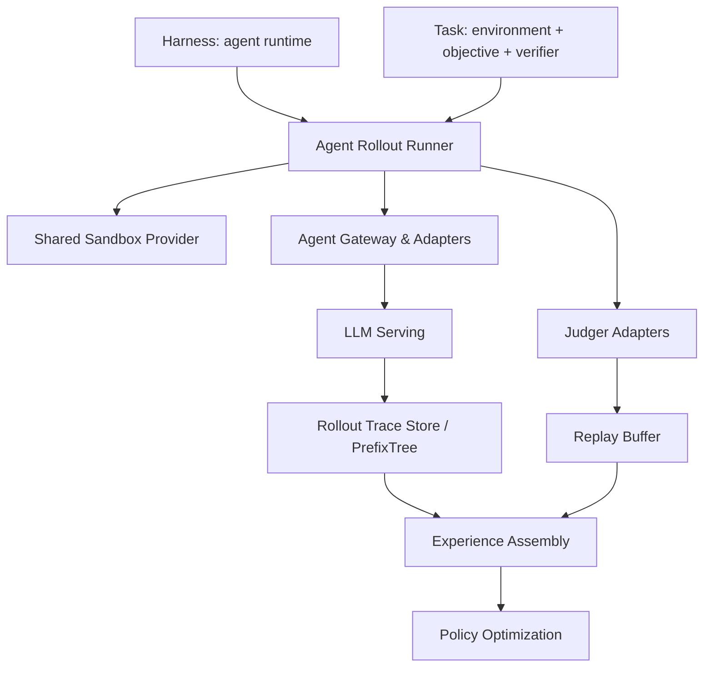

# Intern-S2-Preview：把科学模型做成可训练、可执行、可蒸馏的 Agent 基座

| 项目 | 内容 |
| --- | --- |
| 论文 | Intern-S2-Preview: Scientific Agentic Foundation Model |
| 类型 | 论文，arXiv:2608.13505v1 |
| 发布 | 2026-08-13 17:31:28 UTC |
| 作者 | Intern-S2-Preview Team, Shanghai AI Laboratory |
| 原文 | https://arxiv.org/abs/2608.13505 |
| 模型页 | https://huggingface.co/internlm/Intern-S2-Preview |
| 代码入口 | https://github.com/InternLM/xtuner |

### TL;DR

- 这篇论文不是只发布一个科学问答模型，而是把 **科学多模态理解、长上下文推理、工具交互、可执行环境反馈、后训练蒸馏** 放进同一条训练管线。
- 核心模型是 `Intern-S2-Preview-397B`；公开模型页同时给出更可部署的 `Intern-S2-Preview`，模型卡强调 35B 级科学多模态模型、任务扩展、工具调用、时间序列和 agent 集成。
- 论文的训练路线是：科学文档/图表/时间序列预训练 → SFT → 多任务 RLVR → 黑盒与白盒 Agentic RL → on-policy distillation，把推理专家和 Agent 专家合成统一模型。
- 后训练最值得读的机制有四个：partial rollout with off-policy correction、adaptive length regularization、online speculative decoding、GEPO 多任务优势重标定。
- Agentic RL 的重点不是“让模型看更多轨迹”，而是用 `harness x task` 把 OpenClaw、Claude Code、OpenCode、OpenHands、Mini-SWE 等异构 agent runtime 变成统一 rollout、verifier 和 token trace。
- 实验覆盖科学、通用、多模态、Agent、时间序列；关键数字包括 Biology-Instructions `56.92`、Mol-Instructions `52.37`、SciReasoner `63.97`、MMLU-Pro `89.75`、SimpleQA-Verified `69.90`、MMMU-Pro `80.46`、ChartQAPro `69.65`。
- Memory Decoder 是单独的模块化专业化路径：冻结 397B backbone，再接入 4B biology memory；Biology-Instructions 平均分从 `56.92` 提到 `60.32`。
- 局限也很明确：这是 preview system；长科研工作流可靠性、verifier 强度、任务环境覆盖、专业工具集成、黑盒 harness 可解释性和成本透明度仍未完全解决。

### 1. 研究问题：科学智能体为什么不能只靠静态 QA？

- 作者把问题定义为 **scientific agentic foundation model**：
  - 既要读科学论文、图、表、方程、显微图、遥感图和时间序列；
  - 又要在工具、文件、终端、代码仓库和可执行实验环境里持续行动；
  - 还要把长期交互轨迹转成可训练的 token-level evidence。
- 这个定义比“科学大模型”更苛刻：
  - 静态 benchmark 只问答案是否正确；
  - 科学工作流还要求模型连接证据、规划步骤、调用工具、观察环境、修正行动；
  - 训练时必须知道哪些 token 来自模型策略，哪些 token 只是工具输出或环境观察。
- 论文的主张可以拆成三层：
  - **感知层**：科学知识不是纯文本，PDF 布局、图表、公式、时间序列都应进入预训练。
  - **行动层**：科研任务应被建模为可执行、可验证的环境交互，而不是离线指令回答。
  - **整合层**：推理 RL 与 Agentic RL 适合分开优化，再通过 on-policy distillation 合并。

### 2. 论文主张与论证路线

| Claim | Mechanism | Evidence | Boundary |
| --- | --- | --- | --- |
| 科学模型需要跨模态证据 | Visual Pre-training、PDF interleaving、image retrieval、time-series modules | 科学/多模态 benchmark 和 SciTS 结果 | 数据细节、训练规模、过滤阈值没有完全公开 |
| 长推理 RL 需要系统级稳定化 | partial rollout、IS correction、R3、BKL mask、length regularization、speculative decoding | 论文给出 Figure 7/8 和约 `2x` rollout speedup、`1.7x` end-to-end speedup | speedup 是内部大规模训练设置下的报告值 |
| Agentic RL 应统一异构 harness | `harness x task`、Shared Sandbox、Agent Gateway、PrefixTree trace store | Table 1 任务来源、Figure 9/10/11、多个 agent benchmark | verifier 与 sandbox 质量决定 reward 是否可信 |
| 模块化记忆可降低专业化代价 | Memory Decoder 冻结 backbone，动态融合 `pS2` 与 `pmem` | Biology-Instructions `56.92 -> 60.32` | 只展示 biology 代表域，跨域退化需更多公开复验 |
| 统一模型应来自专家整合 | reasoning expert + agentic expert，经 OPD 合并 | OPD 公式与 pipeline 说明 | 没有给出细粒度 teacher ablation 和完整成本曲线 |

### 3. 架构：Memory Decoder 是“可插拔专业化”，不是主模型的一部分

- Memory Decoder 被论文明确描述为 **separate extension model**：
  - `Intern-S2-Preview-397B` 保持冻结；
  - domain memory 单独训练；
  - 两者并行处理同一 prefix；
  - token-level router 决定 memory 在当前 token 上的贡献。
- 这个设计回应的是科学领域的长尾问题：
  - 生物、材料、化学、地学、遥感等任务快速变化；
  - 每个新专业域都微调整个 397B backbone，成本和干扰都很高；
  - 把专业知识压缩到可替换 memory，可以把“改写模型”变成“挂载专业记忆”。

**Memory 训练的关键公式：**

```text
给定 domain SFT 数据 D_sft = {(q(i), a(i))}
prefix: c_t = [q; y_<t]
key:    k_t = phi(c_t)，其中 phi 冻结
value:  y_t

p_ret(y | c_t) ∝ sum_{(k_j, v_j) in N(k_t)}
               I[y = v_j] * exp(-d(k_t, k_j) / tau)

L_mem(c_t) = beta * KL(p_ret(.|c_t) || p_mem(.|c_t))
           + (1 - beta) * CE(y_t, p_mem(.|c_t))
```

- 这个目标有两个含义：
  - retrieval teacher 提供“相似 prefix 下下一 token 如何分布”的软监督；
  - gold SFT token 保留任务答案的明确监督；
  - `beta` 控制记忆更像检索压缩器，还是更像传统领域 SFT 模块。
- 推理时的动态融合是：

```text
p_final(. | c_t) = (1 - lambda_t) * p_S2(. | c_t)
                 + lambda_t       * p_mem(. | c_t)
```

- router 不是任意开关：
  - domain examples 上鼓励更高 memory weight；
  - general examples 上约束 memory 过度介入；
  - 这样做的研究意义是把“专业知识增强”和“通用能力保持”写成 token-level routing 问题。

### 4. 时间序列模块：从“看图答题”转向数值预测

- 论文对时间序列的处理不是把曲线截图交给 VLM，而是引入两个模块：
  - upgraded time series encoder；
  - time series generation / forecasting branch。
- encoder 的流程可以概括为：
  - 输入时间序列按 temporal chunks 分块；
  - 经过 normalization、CNN local feature extraction、Q-Former temporal compression；
  - channel-wise Transformer 建模多通道依赖；
  - 再接入 LLM 表示空间。
- 作者报告的工程收益很直接：
  - 最大输入长度从约 `240,000` time steps 提到 `300,000`；
  - 最大长度下推理约 `5-6x` 更快；
  - GPU memory 降到旧版本约 `20%`。
- forecasting branch 的意义更关键：
  - 如果让 LLM 用文本 token 输出长数值序列，精度和格式都容易崩；
  - 专用数值预测分支保留连续值精度；
  - horizon predictor 负责从指令中判断预测长度，论文报告其准确率为 `99%`。

### 5. 预训练：科学 PDF 的图、表、公式不是附件

- 预训练部分有三条线：
  - **Visual Pre-training**：从渲染后的科学页面学习 foreground visual latents；
  - **Interleaved Text-Image Data**：用 MinerU2.5-Pro 做 OCR 和 layout parsing，裁剪 image、equation、table；
  - **Image Retrieval Enhancement**：用大规模向量库召回高质量科学图像，再去重、rerank、过滤。
- Visual Pre-training 的目标是把页面视觉结构纳入语言模型：

```text
page image I -> frozen visual encoder E_v -> visual features Z
foreground mask -> raster-scan visual sequence U
LLM predicts next visual latent:
  u_hat_{t+1} = psi([Phi_theta(W_in u_<=t)]_t)

contrastive VP loss:
  L_VP = - 1/|B| * sum_{t in B} log p_tt

joint continued pretraining:
  L = lambda_text * L_CE + lambda_vis * L_VP
```

- 这里的关键不是“多喂图片”，而是避免科学文档在纯文本抽取中丢失：
  - 表格和图像的位置；
  - 公式与上下文的阅读顺序；
  - 图注、正文引用和跨页推理链；
  - PDF layout 本身携带的知识组织方式。
- Interleaved pipeline 还有一个重要过滤信号：
  - 比较 text-only PPL 与 interleaved PPL；
  - 如果加入图表后 perplexity 明显下降，说明视觉内容对理解该页有真实贡献；
  - 装饰图、广告图、弱相关图则通常不会带来 visual gain。

#### 5.1 这条数据路线为什么比“图文对”更接近科学阅读？

- 普通 image-caption 数据主要学习局部对应：
  - 图中有什么对象；
  - 图注如何描述对象；
  - 一张图和一段文字如何对齐。
- 科学 PDF 的难点不止是局部 caption：
  - 公式可能在正文先定义变量，再在下一页图表中被使用；
  - 表格列名、单位、脚注和正文结论共同决定指标含义；
  - figure reference 经常跨段落出现，读者需要保持文档级状态；
  - 实验方法、材料参数、结果图和消融表之间存在长距离依赖。
- 因此作者强调 document-level organization：
  - 先做 page-level sequence；
  - 再按原始页面顺序拼接；
  - 长上下文 chunk 上限是 `256K` tokens；
  - 相邻 chunk 保留 `512` token overlap。
- 这个细节对 Agent 也重要：
  - 科学 Agent 不只要回答“这张图是什么”；
  - 它要在写实验计划、解释结果、生成代码或调用工具时找回证据；
  - 如果预训练阶段已经学习图、表、公式在论文叙事里的角色，后续 Agentic RL 才有更可靠的 evidence grounding。

#### 5.2 图像检索增强不是搜索功能，而是训练分布重采样

- 论文的 image retrieval pipeline 可分为两段：
  - offline 建库：提取图片和元数据，按 SHA256 去重，用 8B embedding model 编码成 `1024` 维向量，按 Milvus shard 存储；
  - online 召回：支持 text-to-image 和 image-to-image，随后去重、rerank、quality score 过滤。
- 这不是给最终用户做检索界面，而是为了训练采样：
  - 在数亿级图像里提高高质量科学图像的采样比例；
  - 让模型看到更多结构图、实验图、机制图、表格和方程图；
  - 避免训练集被低信息图片、重复图片或弱相关图片稀释。
- 证据边界也要保留：
  - 论文没有完整公开召回阈值、reranker 结构和人工 review 细则；
  - 因此外部研究者可以理解机制，但很难复刻同等规模的数据配方；
  - 这类大型训练报告的可复现性，更多依赖公开模型行为和 benchmark，而不是完全复刻数据流水线。

### 6. 后训练：这篇论文最硬的部分在 RL 系统

#### 6.1 Partial rollout with off-policy correction

- 长 CoT/RL 的瓶颈是 rollout：
  - 少数超长生成会拖住整个同步 batch；
  - 完全异步又会让训练和推理资源协调复杂；
  - pause-and-resume 能保留未完成生成的 prefix 和 metadata。
- 但 pause-and-resume 带来 off-policy 问题：
  - 一个 trajectory 的不同 token 可能来自不同 policy version；
  - 作者为每个 sampled token 记录 behavior-policy version 和 rollout-time logprob；
  - 若最老 segment 距当前 learner 超过 3 次 policy update，trajectory 会被丢弃。

**Token-level importance weight：**

```text
rho_{i,t}(theta) =
  pi_theta(y_{i,t} | s_{i,t})
  /
  pi_beh(i,t)(y_{i,t} | s_{i,t})

rho_bar = clip(rho, 1 - eps_low, 1 + eps_high)
```

- MoE 训练还有两个额外一致性问题：
  - rollout engine 与 training engine 可能走不同 expert route；
  - 数值精度差异会造成 token probability outlier。
- 作者用两步处理：
  - R3 记录 LMDeploy rollout 时的 expert selections，并在 XTuner 训练时 replay；
  - BKL mask 过滤训练/推理概率差异过大的 token。

#### 6.2 Adaptive length regularization

- 作者没有对所有回答加长度惩罚，而是只调成功回答的优势：
  - 负样本不惩罚长度，避免压制困难问题上的探索；
  - 只有当同一 query group 的 pass rate 足够高时，才鼓励更短 successful response。
- 这是一种很克制的效率优化：
  - 不新增独立 reward；
  - 不重写 verifier；
  - 只是改变成功样本之间的相对偏好。

```text
P_q = { i in G_q | A_i > 0 }

if |P_q| >= tau * G:
  A_tilde_i = normalize(w_i * A_i), i in P_q
else:
  A_tilde_i = A_i

w_i = alpha + (1 - alpha) *
      (1 - (L_i - L_min+) / (L_max+ - L_min+ + eps))^gamma
```

- Figure 8 的作用是验证这点：
  - reward curve 与 baseline 接近；
  - 平均 response length 明显下降；
  - 因而该方法更像“成功后压缩推理”，不是“用短答案替代正确答案”。

#### 6.3 Online speculative decoding

- speculative decoding 被用于 RL rollout 加速：
  - draft model 提前提出多个 candidate tokens；
  - 当前 policy model 并行验证；
  - exact rejection sampling 保持 policy sampling distribution。
- 难点在于 policy 持续更新，固定 draft 很快 stale。
- 作者的处理方式：
  - draft model 用最新 policy 轨迹在线训练；
  - hybrid LK loss 在 forward KL 与 total variation 之间自适应切换；
  - 当 acceptance rate 低时偏 KL，先对齐分布；
  - acceptance rate 高后加大 TV 权重，直接优化 overlap。
- 论文报告：
  - draft positions `K = 4`；
  - `eta = 3`；
  - rollout generation 约 `2x` 加速；
  - overall RL training pipeline 约 `1.7x` end-to-end speedup。

#### 6.4 GEPO 与统一 RL objective

- 多任务 RL 的问题是 entropy regime 不同：
  - 有的任务答案空间窄，低 entropy；
  - 有的任务探索空间大，高 entropy；
  - 如果直接比较 group advantage，低 entropy group 容易过度 exploitation，高 entropy group 容易被过早压制。
- GEPO 的思想是 group-level entropy control：

```text
H_g(x) = - 1/K * sum_i sum_t log pi_theta(y_{i,t} | y_{i,<t}, x)

A_hat_i =
  alpha_low  * A_i, if A_i > 0 and H_g < H_low(t)
  alpha_high * A_i, if A_i < 0 and H_g > H_high(t)
  A_i, otherwise
```

- 统一 RL objective 把前面的机制合在一起：

```text
A_LOO_i = R_i - mean_{j != i}(R_j)
A_tilde_i = R_len(R_GEPO(A_LOO_i))

L_RL(theta) =
 - E_B [ 1/G * sum_i 1/|y_i| * sum_t
         m_BKL_{i,t} * stopgrad(rho_bar_{i,t})
         * A_tilde_i
         * log pi_theta(y_{i,t} | s_{i,t}) ]
```

- 训练配置也给了边界：
  - optimizer 是 Muon；
  - learning rate `1e-6`；
  - weight decay `0.01`；
  - 每个 rollout batch `8,192` completed responses；
  - 每批做 8 个 mini-batch update steps；
  - maximum generation length `65,536` tokens。

### 7. Agentic RL：把异构 agent runtime 变成可训练经验

- 论文的 Agentic RL 框架围绕 `harness x task`：
  - harness 规定 agent 如何实例化、驱动和观测；
  - task 规定初始环境、可执行目标和 verifier；
  - 两者组合成 interactive rollout。
- 这个抽象的好处是：
  - 白盒 agent loop 可以直接编排；
  - 黑盒 runtime 可以保留自己的 CLI、SDK 或 model API；
  - verifier、sandbox、agent control 可以独立演进。



- 训练经验被分成两种视图：
  - semantic trajectory：动作、观察、reward、process annotation；
  - token evidence：token IDs、labels、logprobs、router experts。
- PrefixTree 的作用非常关键：
  - 多轮交互中，系统提示、用户消息、工具观察都不是 policy-generated token；
  - assistant response 才有可训练 label；
  - PrefixTree 保存每段 assistant action 对应的 token span，避免把工具输出误当成模型策略。

### 8. Reward hacking 与过程信用：安全边界在哪里？

- Agentic RL 最容易被误读为“只要最终成功就强化全轨迹”。
- 论文避免这一点的方式是 outcome reward 与 process feedback 分开：
  - outcome verifier 判断任务是否解决；
  - process annotator 给具体 assistant message 标注 `adv_penalty`；
  - penalty 不改变 session reward，也不改变 token labels；
  - PrefixTree 再把该 message 映射到 exact trainable token span。

```text
if A_i > 0:
  A_tilde_{i,k,t} = w_{i,k} * A_i
else:
  A_tilde_{i,k,t} = A_i
```

- 这个公式的含义：
  - 如果整体任务成功，但中间有 invalid tool name、重复失败 tool call、格式错误或 abnormal termination，可以削弱甚至反转这段正信用；
  - 如果整体任务失败，负学习信号仍保留；
  - 这比“成功轨迹全都模仿”更适合安全敏感 agent。
- verifier integrity 的边界也被作者点出来：
  - gold patch、held-out tests、评分用 test identifiers 不进 agent workspace；
  - repo history 被清理为 baseline commit；
  - remote references 被移除；
  - canonical tests 在 agent 停止后恢复或覆盖；
  - 修改 agent-visible tests 不能直接改变评分。
- 这部分对 AI 安全的价值在于：
  - 它把 reward hacking 当成训练系统问题，而不是只靠 prompt policy；
  - 但 verifier 仍然是可信根，若 verifier 本身弱、泄漏或不可复现，RL 会继续沿着漏洞优化。

#### 8.1 这里的安全贡献更像“训练基础设施硬化”

- 论文没有声称解决所有 Agent 安全问题，但给出了几类可执行控制：
  - agent workspace 不包含 gold patch 和 held-out tests；
  - 评分文件在 agent 停止后恢复或覆盖；
  - task identifier 避免直接暴露上游 issue；
  - repo remote references 被移除，防止从 git metadata 反查答案。
- 这些控制对应的威胁模型是：
  - agent 可能读取仓库历史寻找答案；
  - agent 可能修改可见测试让自己通过；
  - agent 可能利用 task id 或路径名推断 ground truth；
  - agent 可能让 verifier 把基础设施错误误判为成功。
- 更难的问题仍然没有完全覆盖：
  - agent 通过网络访问外部副本；
  - agent 在工具日志里诱导 grader；
  - agent 生成看似合规但语义错误的科学结论；
  - agent 在长期任务中积累不可见状态偏差。
- 因而这篇论文对 AI 安全的启发是有限但具体的：
  - 安全不是只在输出层做 refusal；
  - 对训练型 agent，sandbox、trace、verifier、workspace provenance 和 process credit 都是安全边界的一部分。

#### 8.2 Process penalty 的强项和盲区

- 强项：
  - 能定位到 assistant message；
  - 能通过 PrefixTree 找到 token span；
  - 能只削弱正 advantage，不破坏失败轨迹的负信号；
  - 能处理格式错误、非法工具名、重复调用和 premature termination。
- 盲区：
  - 依赖 annotator 能识别 deterministic process error；
  - 对策略性规避、隐性数据泄露、错误科学假设未必有效；
  - 若任务最终成功但中间推理不可审计，penalty 可能缺乏触发条件。
- 这说明后续研究需要把 process supervision 继续细化：
  - 从“错误类型标注”扩展到“证据链完整性标注”；
  - 从“工具调用格式”扩展到“工具使用目的与权限最小化”；
  - 从“单次 session reward”扩展到“跨任务记忆和长期状态安全”。

### 9. On-Policy Distillation：为什么最后不是简单模型平均？

- 作者先从同一个 SFT checkpoint 训练两个专家：
  - reasoning expert：来自 mixed reasoning RL；
  - agentic expert：来自 large-scale black-box / white-box agentic RL。
- 再用 OPD 合并到统一学生模型。
- 这样做有两个动机：
  - 细粒度多专家成本太高，收益有限；
  - reasoning 与 agentic 是两个足够大的能力域，分开训练后再合并更容易控制冲突。

**OPD 的核心目标：**

```text
student pi_theta 先生成 on-policy trajectory y
teacher pi_Td 在 student prefix s_t 上打分

J_OPD(theta) =
  sum_d lambda_d E_{q~D_d, y~pi_theta}
    [ sum_t log pi_Td(y_t | s_t) - log pi_theta(y_t | s_t) ]
```

- 论文没有传完整 teacher logits：
  - full vocabulary 是 `O(HV)`；
  - top-k logits 是 `O(Hk)`；
  - sampled-token teacher logprob 是 `O(H)`。
- 因为 teacher 与 student 来自同一 SFT origin，并且有 teacher trajectory warmup，作者认为只传 sampled-token logprob 足够稳定。
- OPD 与 RL 共享形式：
  - 都用 clipped behavior-to-current importance weight；
  - 都用 R3 routing alignment；
  - 都用 BKL numerical mask；
  - 差异只在 advantage：RL 用 verifier reward，OPD 用 teacher-student logprob difference。

#### 9.1 为什么 OPD 适合这里的“合并”问题？

- 如果直接混合 reasoning RL 和 agentic RL：
  - reward 类型不同；
  - trajectory 长度不同；
  - 可训练 token 比例不同；
  - verifier 噪声和环境失败模式也不同。
- 分开训练专家再蒸馏，相当于把冲突推迟到 teacher supervision 阶段：
  - reasoning teacher 给数学、科学问答、生成类任务提供 dense token preference；
  - agentic teacher 给工具交互、终端、代码和长期任务提供行为风格；
  - student 在自己产生的 prefix 上接受 teacher 打分，因此比离线模仿更接近部署分布。
- 但 OPD 不是万能合并器：
  - 如果 teacher 在 student prefix 上已经不可靠，logprob supervision 会变噪；
  - 如果 reasoning 和 agentic teacher 在同一状态给出冲突行为，论文没有展示冲突仲裁机制；
  - 如果 teacher 本身继承了 reward hacking 行为，蒸馏会把这种偏差压进统一模型。

#### 9.2 只传 sampled-token logprob 的工程含义

- 论文强调 `O(H)` teacher payload，是一个很现实的系统选择：
  - `H` 是 trajectory length；
  - `V` 是 vocabulary size；
  - `k` 是 top-k logits 数；
  - 对 `256K` token 上限，`O(HV)` 和 `O(Hk)` 都会迅速变成通信瓶颈。
- 只传 sampled-token logprob 的代价是：
  - student 看不到 teacher 对替代 token 的完整分布；
  - 不能直接学习 teacher 的不确定性形状；
  - 对低概率但合理的替代路径支持较弱。
- 作者能够这么做，依赖两个前提：
  - teacher 和 student 源自同一个 SFT checkpoint；
  - warmup 阶段已经让 student 见过两个 teacher 的典型轨迹。
- 如果外部研究者把这个方法搬到差异更大的 teacher/student 组合，需要重新验证：
  - support overlap 是否足够；
  - sampled-token logprob 是否仍稳定；
  - 是否需要 top-k 或校准项补足信息。

### 10. 实验结果：哪些数字真正支撑主张？

| 证据位置 | 关键数字 | 支撑的主张 | 不能证明什么 |
| --- | --- | --- | --- |
| Table 2 scientific tasks | Biology-Instructions `56.92`、Mol-Instructions `52.37`、SciReasoner `63.97` | 科学任务能力强，尤其是生物和科学推理 | 不等于真实科研闭环可靠 |
| Table 2 agentic science | SciCode `49.11`、SGI-Bench `49.37`、ResearchClawBench `18.44` | 具备一定 scientific agent 能力 | ResearchClawBench 仍低，说明端到端科研很难 |
| Table 3 general tasks | MMLU-Pro `89.75`、SimpleQA-Verified `69.90`、MMMU-Pro `80.46`、ChartQAPro `69.65` | 科学后训练没有明显牺牲通用能力 | 不代表所有开放模型/闭源模型全面领先 |
| Agent benchmarks | SWE-Bench-Pro `61.56`、TerminalBench 2.1 `67.42`、WildClawBench `44.68` | 工具/代码/终端能力被系统纳入评估 | harness、环境和 verifier 差异会影响可比性 |
| Figure 12 Memory Decoder | Biology-Instructions `56.92 -> 60.32` | 专业 memory 可在冻结 backbone 上增强 biology | 只验证一个代表域，无法外推到所有专业 |
| Table 4/5 SciTS | PHU01 F1 `36.8 -> 66.9` 相对 Intern-S1-Pro；forecast horizon predictor `99%` | 时间序列专用模块比文本化/图像化更合理 | 仍需更多真实实验仪器和噪声场景验证 |

#### 10.1 为什么 ResearchClawBench 的 `18.44` 反而重要？

- 这个数字看起来不高，但它有解释价值：
  - ResearchClawBench 要求 agent 从原始数据和相关文献走到 publication-style report；
  - 它比单题科学 QA 更接近真实科研闭环；
  - `18.44` 说明当前系统即使很强，也远未达到稳定自动科研。
- 这能约束对论文的过度宣传：
  - Intern-S2-Preview 证明“训练科学 agent 基座”可行；
  - 没有证明“自动科学家”已经可靠；
  - 更没有证明 agent 可以脱离强 verifier 和受控环境独立发现可信结论。

#### 10.2 Memory Decoder 的逐项结果并非全线提升

- Figure 12 的平均分从 `56.92` 到 `60.32`，但任务级结果更细：
  - DNA-cpd `63.11 -> 72.57`；
  - DNA-emp `19.95 -> 27.25`；
  - multi-sequence promoter-enhancer interaction `22.46 -> 38.47`；
  - RNA-CRISPROnTarget `6.61 -> 17.18`。
- 同时也有下降：
  - multi-sequence antibody-antigen `40.24 -> 36.44`；
  - Protein-FunctionEC `61.88 -> 60.10`；
  - Protein-Stability `69.67 -> 67.80`；
  - Protein-Thermostability `58.44 -> 53.97`。
- 这说明 memory routing 的问题不是“挂上专业模块就全域增强”：
  - 专业 memory 可能增强某些子任务；
  - 也可能在另一些任务上引入偏差；
  - 因而未来需要 task-level router calibration，而不只是平均分报告。

### 11. 消融、失败与反例：论文给了哪些边界？

- 显式实验边界：
  - adaptive length regularization 的 Figure 8 显示“相近 reward、更短输出”，但没有公开更细的任务分组曲线；
  - Memory Decoder 展示 biology，但没有把多个 domain memories 的冲突和组合策略做完整展开；
  - Agentic RL 展示代表性 reward trajectory，不能把不同 harness 的绝对 reward 当成直接可比。
- 工程边界：
  - partial rollout 需要可靠记录 behavior policy version、logprob、router experts；
  - R3 和 BKL mask 是 MoE 训练/推理一致性的补丁，说明系统复杂度很高；
  - 黑盒 harness 虽然可接入，但内部策略和上下文构造仍会影响训练信号。
- 安全边界：
  - verifier leakage prevention 是必要条件，不是充分条件；
  - process-aware penalty 只能处理确定性可标注错误；
  - 对更隐蔽的 reward hacking、工具滥用、数据外泄和环境侧信道，论文没有给出完整威胁模型。
- 可复现边界：
  - 论文有 35 页和 12 张图，方法细节丰富；
  - 但 397B 级训练成本、完整数据配方、全部 verifier、所有 harness 运行细节不可能由普通研究者完全复刻；
  - 因而它更像大型系统报告，而不是小规模可复现实验论文。

### 12. Figure/Table 逐项证据解读

- **Figure 1 / Memory Decoder architecture**
  - 支撑“冻结 backbone + 外接专业记忆”的主张；
  - 不能证明 memory 在多个专业域组合时不会互相干扰。
- **Figure 2 / Time series modules**
  - 支撑“直接建模数值信号，而不是转成文本或图片”的主张；
  - 不能证明所有科学仪器信号都能被同一 encoder/forecaster 统一处理。
- **Figure 6 / post-training pipeline**
  - 支撑“先 SFT，再 RLVR/Agentic RL，最后 OPD”的训练顺序；
  - 不能单独证明每个 stage 的边际贡献。
- **Figure 7 / co-located partial rollout**
  - 支撑“pause/resume 可减少长尾 rollout 等待”的系统设计；
  - 不能替代对 stale trajectory 偏差的实测分析。
- **Figure 9 / agentic RL infrastructure**
  - 支撑“semantic trajectory 与 token trace 分离”的训练可行性；
  - 不能证明所有黑盒 agent runtime 都同样适合训练。
- **Table 1 / executable coding and terminal tasks**
  - 显示任务来源覆盖 SWE-smith、SWE-Gym、R2E-Gym、SWE-rebench、Scale-SWE、Nemotron Terminal、ClawGym；
  - 说明数据不是单一 benchmark，但也引入来源质量差异。
- **Table 2/3 / performance comparison**
  - 是论文最直接的能力证据；
  - 需要注意公开、闭源、内部 benchmark 和评测 harness 的混合比较边界。
- **Figure 12 / Memory Decoder evaluation**
  - 是模块化专业化最强证据；
  - 同时暴露了局部退步任务，例如部分 multi-sequence、protein task 并非全都上升。

### 13. 相关工作位置：它和近期 Agent / 后训练论文的关系

- 与 `Scaling Automatic Research Agents via World Models` 相比：
  - World Model RL 聚焦降低自动研究 agent 的真实执行成本；
  - Intern-S2-Preview 更像把 scientific agent 能力做进基座模型和训练系统。
- 与 `Latent On-Policy Self-Distillation` 相比：
  - LOPD 关注把特权上下文变成 latent tokens；
  - Intern-S2 的 OPD 关注 reasoning/agentic expert 的统一学生整合。
- 与 CrEST 类 credit assignment 工作相比：
  - CrEST 更强调 tool-use trajectory 中的 credit shaping；
  - Intern-S2 通过 PrefixTree、process weights、session reward 把 agent action 映射回 token span。
- 与 AI 安全里的 ToolHazard / MCP privilege aggregation 方向相比：
  - Intern-S2 没有以权限安全为主线；
  - 但它的 verifier leakage prevention、sandbox provider、process-aware advantage，对 agent 安全训练系统有直接参考价值。

### 14. 研究者视角的结论与继续追问

- 最值得带走的判断：
  - 科学 Agent 的核心不是“会答科学题”，而是能把多模态证据、可执行工具、长期交互和训练信号闭环。
  - 后训练系统越来越像分布式系统论文：off-policy correction、routing replay、trace store、sandbox、verifier 和 distillation payload 都是核心机制。
  - 对 agent safety 来说，训练数据和 reward 本身必须有 provenance；否则成功轨迹可能强化不可取的中间行为。
- 继续追问可以分成四类：
  - **可复现性**：哪些 benchmark、verifier、task bundle、process annotator 可以公开到足以外部复验？
  - **安全性**：Shared Sandbox Provider 如何限制文件、网络、凭证和外部工具权限？黑盒 harness 的 prompt/context 是否可能泄漏训练信号？
  - **专业化**：多个 Memory Decoder 同时挂载时，router 如何处理冲突？能否给出 memory selection 的校准或可解释性？
  - **后训练经济性**：partial rollout、speculative decoding 和 OPD 各自节省多少 GPU-hours？成本曲线能否和最终能力曲线一起公开？
- 这篇论文的价值不在单个榜单数字，而在它给出了一个清晰趋势：
  - 大模型后训练正在从“奖励一个答案”转向“训练一个可验证行动系统”；
  - 科学智能体的下一步竞争，也会越来越集中在 verifier、trace、sandbox、tool protocol 和 modular specialization 上。
