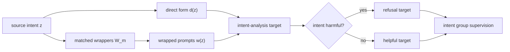

# WIFA / A-GCRT：拒绝意图，而不是拒绝提示词外壳

## 元信息与 TL;DR

| 字段 | 内容 |
|---|---|
| 论文 | Refusing Intent, Not Form: Wrapper-Based Intent-Group Supervision for LLM Safety |
| 版本 | arXiv:2608.13304v1, 2026-08-13 14:33:15 UTC |
| 作者 | Ping Wu, Haibo Tong, Feifei Zhao, Han Shen, Yu Shi, Yilin Zhao, Sicheng Shen, Guobin Shen, Yun Luo, Yi Zeng |
| 机构 | BrainCog Lab, Institute of Automation, Chinese Academy of Sciences, UCAS, Beijing Key Laboratory of Safe AI and Superalignment, Ant Group |
| 类型 | AI safety / safety tuning 论文 |
| 官方链接 | <https://arxiv.org/abs/2608.13304> |
| HTML | <https://arxiv.org/html/2608.13304> |
| PDF | <https://arxiv.org/pdf/2608.13304> |

### TL;DR

1. **这篇论文研究什么**：安全微调常把提示词的表面形式当成拒答信号。攻击者把有害意图包进角色扮演、翻译、学术讨论或格式约束里时，模型可能放行；用户把良性请求写成类似外壳时，模型又可能过度拒答。
2. **核心方法是什么**：作者提出 `WIFA`，把同一底层意图的多种 wrapper 组织成 intent group，并用结构匹配的有害组和良性组训练模型，让 wrapper form 不再能单独预测“拒绝/服从”。
3. **两条训练路线的分工**：`WIFA-Boost` 是 safety-first 两阶段配方，先学 WIFA intent-form 结构，再用有害拒答和少量 plain benign 做校准；`A-GCRT` 是低过拒路线，用 group consistency 和 directional anchor 把同意图 wrapper 的决策分数拉齐，并把有害/良性组推到 margin 两侧。
4. **关键数字是什么**：Qwen 设置中，WIFA-Boost 将 SORRY-Bench mutation-average refusal 从 base 的 `22.1` 提到 `63.7`；A-GCRT-M5 将 OR-Bench over-refusal 从 base 的 `25.7` 降到 `17.4`，同时 SORRY-Bench average refusal 到 `46.7`。
5. **实验覆盖什么**：论文覆盖 Qwen2.5-7B-Instruct 与 Llama-3.1-8B-Instruct，使用 HarmBench、SORRY-Bench、StrongREJECT、OR-Bench-Hard、XSTest、MMLU、GSM8K，以及 15 类 unseen attack family。
6. **最重要的边界是什么**：WIFA-Boost 和 A-GCRT 不是同一个“全局最优点”。WIFA-Boost 更强拒绝改写后的有害请求，但仍有较高 over-refusal；A-GCRT 能塑造低 OR operating point，但在某些 unseen attack families 上弱于 WIFA-Boost。
7. **可信证据来自哪里**：Table 1 给出主结果，Table 2/17 证明 matched benign wrapper 不是可省掉的数据细节，Table 18/19/20/21 排除“只是数据比例、训练顺序或更强 SFT”的解释，Table 22/24 限定 decision score 不是独立 intent classifier。
8. **研究意义是什么**：这篇论文把安全拒答从 prompt-level label 推到 group-level supervision。它提醒安全训练不能只问“这个样本拒不拒”，还要问“同一意图换壳后是否同样处理，异意图同壳时是否仍能分开”。

## 研究问题：为什么“拒绝外壳”会同时带来 jailbreak 和过拒？

### 作者真正要拆的问题

- 安全微调通常把单条 prompt-response pair 当作训练单位。
- 但真实输入里，安全相关信号至少有两层：
  - **intent**：用户底层想完成什么；
  - **form / wrapper**：用户把请求包装成什么样。

如果训练数据只把 wrapped harmful prompt 标成拒绝，模型很容易学到一个更便宜的规则：

> “看到某类外壳就拒绝，没看到外壳就按普通请求处理。”

这个规则在两边都会出错：

| 情况 | 表面形式 | 底层意图 | 错误行为 |
|---|---|---|---|
| Jailbreak | 被 wrapper 改写 | 有害 | 模型把外壳当成新任务，放松拒答边界 |
| Over-refusal | 类似 wrapper | 良性 | 模型把外壳当成危险信号，拒绝本该帮助的请求 |

### 论文的主张

这篇论文的核心 claim 可以压缩成一句话：

**安全训练的监督单位不应只是单个提示词，而应是“同一意图在多个 wrapper 下的一组表现”。**

作者没有声称 wrapper-based augmentation 可以解决全部越狱，也没有把 A-GCRT 描述成通用 intent classifier。它更像是在修正安全微调中的一个 spurious correlation：

- wrapper 是 nuisance variable；
- intent 才是拒绝/服从的依据；
- 训练目标要迫使模型在组内一致、组间分离。

## 论文主张与论证路线

| Claim | Mechanism | Evidence | Boundary |
|---|---|---|---|
| 模型会学到 surface-form shortcut | 普通安全 SFT 把 wrapper 和 refusal label 绑定 | Harmful-only / naive benign augmentation 提升安全指标但 OR 仍高 | 论文不证明所有模型都必然如此，只在两个 7B/8B setting 中测试 |
| matched benign wrapper 是关键数据结构 | WIFA 同时构造 wrapped harmful 和 structurally matched wrapped benign | Table 2/17：WIFA-SFT 的 SB-avg5 到 63.6，高于 harmful-only 38.7 和 naive benign 40.8 | WIFA-SFT 自身 OR 仍 69.7，不是最终低过拒方法 |
| safety-first 和 low-OR 是两个 operating points | WIFA-Boost 两阶段强调拒绝；A-GCRT 用 consistency + anchor 调 margin | Qwen：WIFA-Boost SB-avg5 63.7；A-GCRT-M5 OR 17.4 | A-GCRT-M5 在 unseen attack average ASR 16.8，弱于 WIFA-Boost 9.5 |
| A-GCRT 不只是强一点的 SFT | 用 decision-position score 做组内方差和方向锚定 | Table 3/20：高 LR WIFA-SFT OR 仍 68.1，无法复现 17.4 OR | decision score 与 label-side intent 分离弱，不能当独立分类器 |
| 泛化不是模板记忆的充分证明 | 15-family unseen attack 与训练 wrapper 分开 | Table 13：训练方法显著降低 base 的平均 ASR 48.3 | 不是 adaptive-proof；攻击者仍可针对模型优化 |

## 方法机制：WIFA 如何让 wrapper 失去诊断性？

### 数据构造的基本对象

作者把一个底层意图记作 `z`，直接形式写成 `d(z)`，wrapper 家族写成 `W`。如果某个 wrapper 是 `w`，则被包装后的输入为：

```text
x = w(z)
```

WIFA 的关键不是“多造一些 wrapped harmful”，而是让有害和良性意图共享同一批 wrapper family。这样，模型不能再仅凭 wrapper 判断拒绝。

### 有害组与良性组

论文给出的组构造可以写成：

```text
G_h(z_h) = A_h(z_h) union { w(z_h) : w in W_m }
G_b(z_b) = { w(z_b) : w in W_m }
```

变量解释：

| 符号 | 含义 | 在论证中的作用 |
|---|---|---|
| `z_h` | 有害底层意图 | 需要被拒绝的 intent |
| `z_b` | 良性底层意图 | 需要被帮助的 intent |
| `A_h(z_h)` | direct-form refusal anchors | 给有害组提供明确拒答锚点 |
| `W_m` | matched wrapper families | 让有害/良性共享表面形式 |
| `G_h`, `G_b` | intent groups | 训练和正则化的基本单位 |

### 为什么 target 要包含 intent analysis？

WIFA target 不是只输出最终 answer，而是让模型先显式恢复 underlying direct-form prompt，再给出拒绝或帮助响应。

这个设计有两个作用：

1. **把 wrapper 还原为意图识别任务**：
   - 模型不能只说“这个 prompt 看起来危险”；
   - 它要先识别 wrapper 下面到底是什么请求。
2. **避免依赖外部 teacher 标注每个 wrapper**：
   - wrapper 的底层 intent 来自源样本；
   - direct-form response 可用于生成 harmful refusal 或 benign helpful answer；
   - 不需要人工逐 wrapper 贴 intent label。

论文主设置里，WIFA-SFT 使用 `5750` 个样本：

| 组成 | 数量 | 解释 |
|---|---:|---|
| harmful examples | 2250 | 250 个有害 seed，每个含 7 个 wrapped forms + 2 个 direct anchors |
| matched wrapped benign examples | 3500 | 500 个良性 seed，每个使用 7 个 matched wrappers |
| 总计 | 5750 | WIFA-SFT 的 intent-form data layer |

### Mermaid：WIFA 的数据流



## WIFA-Boost：为什么两阶段顺序重要？

### 两阶段不是随便混合数据

WIFA-Boost 的路线是：

1. **Stage 1**：在完整 WIFA-SFT 数据上训练。
   - 目标是先建立“同一 wrapper 可以对应有害或良性 intent”的表示。
   - 这一步让 wrapper form 从 label shortcut 变成 nuisance variable。
2. **Stage 2**：用 `2750` 个 calibration examples 继续训练。
   - 包含同一批 `2250` harmful refusal examples；
   - 加上 `500` plain benign examples；
   - 目的不是最低 OR，而是强化 harmful refusal boundary，同时补一些 plain benign compliance。

作者明确把 WIFA-Boost 定位为 high-safety operating point，而不是低过拒方法。这个定位很重要，因为它解释了主结果中看似矛盾的数字：

| 方法 | Qwen SB-avg5 | Qwen SB-mis | Qwen OR | 读法 |
|---|---:|---:|---:|---|
| Base | 22.1 | 3.4 | 25.7 | 安全拒答弱，过拒也不算最低 |
| WIFA-SFT | 63.6 | 49.3 | 69.7 | 学到了 wrapped harmful，但非常保守 |
| WIFA-Boost | 63.7 | 59.3 | 56.0 | safety-first；误拒仍高 |
| A-GCRT-M5 | 46.7 | 20.9 | 17.4 | 低 OR；安全拒答较弱 |
| A-GCRT-M10 | 52.0 | 28.9 | 40.7 | margin 更 safety-oriented |

### Stage order 的证据

Table 19 的作用是排除一个替代解释：

> 也许 WIFA-Boost 只是多看了同样样本，不是顺序有用。

作者比较了 joint one-stage 与 reverse order。结果显示，WIFA-Boost 在难 mutation 上明显更稳：

| 对照 | SB-misrepresentation | SB-logical | 说明 |
|---|---:|---:|---|
| WIFA-Boost | 59.3 | 23.2 | 先学 intent-form，再校准 |
| Joint WIFA+Plain SFT | 22.5 | 8.0 | 同时混合，不足以保留难 wrapper 结构 |
| Reverse WIFA-Boost | 0.2 | 0.0 | 先 plain 校准再 WIFA，会在难 mutation 上崩 |

这个结果说明，WIFA-Boost 不是“多加 benign 就好”。顺序本身是机制的一部分：先把 wrapper 和 intent 拆开，再修正普通良性请求的 compliance。

## A-GCRT：如何把同一意图的多个 wrapper 拉到同一决策侧？

### Objective 的核心形式

A-GCRT 在 SFT loss 外增加两个项：

```text
L = L_SFT + lambda_gcr * (L_var + gamma * L_anchor)
```

其中：

| 项 | 作用 | 直觉 |
|---|---|---|
| `L_SFT` | 维持原始监督学习目标 | 仍要学会具体输出格式和答案 |
| `L_var` | 压低同一 intent group 内 decision score 方差 | 同一意图换 wrapper 后，决策应一致 |
| `L_anchor` | 把 harmful / benign group 推到 margin 两侧 | 一致性必须有方向，不能全都一致地拒绝或服从 |
| `lambda_gcr` | 控制 group-consistency 正则强度 | 避免正则项压过 SFT |
| `gamma` | 控制 anchor 相对权重 | 调 safety-over-refusal frontier |

### Decision-position score 是什么？

A-GCRT 使用一个训练时 decision-position score 来近似“模型更倾向拒绝还是服从”。这不是独立分类器，而是基于回答开头 refusal / comply prefix 的概率差。

可以把它理解为：

```text
s(x) = log P(refusal-prefix | x) - log P(compliance-prefix | x)
```

读法：

- `s(x)` 越大，模型越偏向拒绝；
- `s(x)` 越小，模型越偏向服从；
- 同一 `G(z)` 内，不同 wrapper 的 `s(x)` 不应相差太大。

### Anchor loss 的方向

论文的 anchor 逻辑可以写成：

```text
L_anchor =
  [m - mean_s(z)]_+    if z is harmful
  [m + mean_s(z)]_+    if z is benign
```

其中 `[a]_+ = max(0, a)`。

这表示：

- harmful group 的平均分数要推到 `+m` 以上；
- benign group 的平均分数要推到 `-m` 以下；
- margin `m` 是 operating point 控制项，但不是越大越好。

### 为什么 consistency alone 不够？

只做 `L_var` 会让同组 wrapper 决策一致，但它不指定一致到哪一侧。模型可能稳定地拒绝良性组，也可能稳定地服从有害组。

因此，A-GCRT 的关键是两件事同时成立：

1. **组内一致**：
   - 同一 intent 换外壳后，拒绝/服从倾向相近。
2. **组间分离**：
   - harmful intent 被推到拒绝侧；
   - benign intent 被推到服从侧。

## 实验设置：作者如何避免只测一个安全数字？

### 模型与数据

| 设置 | 模型 | harmful seed | 目的 |
|---|---|---|---|
| Qwen | Qwen2.5-7B-Instruct | AdvBench-style 250 seeds | 主实验设置，便于清晰观察 harmful intent |
| Llama | Llama-3.1-8B-Instruct | harmful_harmless_instructions 中的 250 harmful seeds | 检验换模型、换 harmful-source distribution 后是否复现趋势 |

论文使用的 WIFA-SFT 规模固定为 `5750`，WIFA-Boost 第二阶段使用 `2750`。A-GCRT-M5 和 A-GCRT-M10 使用同一 WIFA-SFT prompt pool，但 batch 按 intent group 组织，并使用不同 margin/anchor 设置。

### Benchmark 与指标

| 维度 | Benchmark / 指标 | 高低方向 | 用途 |
|---|---|---|---|
| harmful refusal | HarmBench refusal | 越高越好 | 普通有害请求拒绝 |
| transformed harmful refusal | SORRY-Bench, SB-avg5, SB-mis | 越高越好 | 改写、伪装、变体下是否仍拒绝 |
| adversarial harmful | StrongREJECT, unseen attack ASR | ASR 越低越好 | 对未见攻击族的鲁棒性 |
| over-refusal | OR-Bench-Hard | 越低越好 | 良性但敏感请求是否被误拒 |
| safe prompt refusal | XSTest safe refusal | 越低越好 | 近边界安全提示的误拒 |
| capability | MMLU, GSM8K | 越高越好 | 安全训练是否破坏通用能力 |

这套评测的优点是把安全研究中常被混在一起的三个问题拆开：

1. 对有害请求是否拒绝；
2. 对良性请求是否保持帮助；
3. 对一般能力是否造成副作用。

## 主结果：WIFA-Boost 和 A-GCRT 不是同一个结论

### Qwen 主线

Qwen 结果支持一个 trade-off frontier：

| 方法 | HB | SB-avg5 | SB-mis | OR | MMLU | GSM8K |
|---|---:|---:|---:|---:|---:|---:|
| Base | 88.0 | 22.1 | 3.4 | 25.7 | 70.1 | 89.39 |
| Harmful-Only SFT | 100.0 | 38.7 | 21.1 | 65.6 | 68.2 | 82.79 |
| WIFA-SFT | 99.5 | 63.6 | 49.3 | 69.7 | 68.4 | 82.79 |
| WIFA-Boost | 99.5 | 63.7 | 59.3 | 56.0 | 67.9 | 79.00 |
| A-GCRT-M5 | 98.5 | 46.7 | 20.9 | 17.4 | 69.0 | 83.70 |
| A-GCRT-M10 | 98.5 | 52.0 | 28.9 | 40.7 | 68.5 | 84.61 |

最值得注意的不是某个单项最大值，而是操作点不同：

- **WIFA-Boost**：
  - harmful refusal 和 transformed-harmful refusal 更强；
  - OR 仍高于 base；
  - 适合“宁可多拒也要挡住变形有害请求”的设置。
- **A-GCRT-M5**：
  - OR 从 `25.7` 降到 `17.4`；
  - SB-avg5 从 base `22.1` 提到 `46.7`；
  - 适合“安全要提高，但不能让普通用户明显感到误拒”的 assistant 设置。

### Llama 边界

Llama 结果重复了大方向，但没有完全复制 Qwen 的 below-base OR。

| 方法 | Llama SB-avg5 | Llama OR | Llama MMLU | Llama GSM8K | 读法 |
|---|---:|---:|---:|---:|---|
| Base | 21.3 | 22.6 | 67.4 | 85.52 | 起点 |
| WIFA-SFT | 63.7 | 53.0 | 57.2 | 46.25 | 安全强但能力/OR 代价明显 |
| WIFA-Boost | 52.8 | 39.8 | 61.8 | 54.97 | safety-first 仍有 OR |
| A-GCRT-M5 | 50.8 | 40.1 | 67.2 | 68.16 | MMLU 恢复，GSM8K 仍低 |
| A-GCRT-M10 | 52.8 | 45.3 | 67.6 | 68.16 | 更安全取向 |

这个边界非常重要。论文没有把 Qwen 上的 `OR 17.4` 宣称为普适结论，而是说 Llama 支持 intent-group interpretation，但不声称 universal below-base over-refusal。

## 消融：哪些替代解释被排除了？

### 1. 不是 harmful wrapper exposure alone

Table 2/17 证明，仅训练 wrapped harmful 会增强拒答，但会把模型推向保守：

| 变体 | Benign data | Wrapped benign | Intent analysis | Qwen SB-avg5 | Qwen OR |
|---|---|---|---|---:|---:|
| Harmful-Only SFT | no | no | yes | 38.7 | 65.6 |
| Naive Benign-Augmented SFT | yes | no | yes | 40.8 | 72.7 |
| Wrapped-Benign SFT w/o Intent Analysis | yes | yes | no | 43.6 | 76.0 |
| WIFA-SFT | yes | yes | yes | 63.6 | 69.7 |

结论是：

- 加 benign 数据本身不够；
- benign 也必须被 wrapped；
- target 里显式 intent analysis 有用；
- 但 WIFA-SFT 仍高 OR，所以还需要 WIFA-Boost 或 A-GCRT 来选择 operating point。

### 2. 不是 benign/harmful ratio 单调决定

Table 18 扫描 `b/h` 比例。结果没有出现“benign 越多越好”的单调曲线：

| 变体 | b/h | Harmful | Benign | SB-avg5 | OR |
|---|---:|---:|---:|---:|---:|
| WIFA-r0.25 | 0.25 | 2250 | 562 | 40.8 | 75.0 |
| WIFA-r0.50 | 0.50 | 2250 | 1125 | 47.1 | 49.1 |
| WIFA-r1.00 | 1.00 | 2250 | 2250 | 48.3 | 64.1 |
| WIFA-r1.50 | 1.50 | 2250 | 3375 | 60.3 | 67.1 |
| WIFA-SFT | 1.56 | 2250 | 3500 | 63.6 | 69.7 |
| WIFA-r2.00 | 2.00 | 2250 | 4500 | 48.0 | 58.2 |

这说明 WIFA 不是简单数据比例技巧。比例会移动安全/过拒位置，但不能同时支配所有指标。

### 3. A-GCRT 不是更大 LR 的 WIFA-SFT

作者做了 stronger SFT 对照。一个高学习率一轮 WIFA-SFT 在 SB-mis 上接近 A-GCRT-M5，但 OR 仍是 `68.1`，远高于 A-GCRT-M5 的 `17.4`。

这组证据对应的机制解释是：

- 更强 SFT 可以把模型推向更强拒答；
- 但它没有 group-level decision score 的方差约束；
- 也没有 harmful/benign directional anchor；
- 因此无法塑造低 over-refusal operating point。

### 4. Margin 不是越大越好

Table 21 / Figure 3 显示 margin 是验证集选择的 operating control，不是单调旋钮：

| 设置 | 现象 | 解释 |
|---|---|---|
| A-GCRT-M5 | Qwen OR 最低，17.4 | 低过拒点 |
| m = 2.5 | OR 可降到 29.3 | 仍不如 M5 |
| 更大 margin 且 gamma = 1 | OR 可升到 49.4 或 61.3 | 过强 anchor 让模型变保守 |
| A-GCRT-M10 | SB-avg5 52.0, OR 40.7 | 更 safety-oriented 的折中 |

## Figure / Table 证据逐项解读

| 图表 | 支持什么 | 不能证明什么 |
|---|---|---|
| Figure 1 | WIFA 把有害/良性 intent groups 放在共享 wrapper family 下，WIFA-Boost 和 A-GCRT 是两条路线 | 它是框架图，不是实验结果 |
| Table 1 | 主安全/过拒/能力 frontier，尤其 Qwen WIFA-Boost 与 A-GCRT-M5 的分工 | 不能说明某方法所有场景都最佳 |
| Figure 2 / Table 13 | 15 类 unseen attack family 中，训练方法降低 base ASR；WIFA-Boost 平均 ASR 9.5，A-GCRT-M5 为 16.8 | 不是自适应攻击鲁棒性证明 |
| Table 2 / 17 | matched wrapped benign + intent analysis 是关键数据结构 | WIFA-SFT 自身仍过拒，不能当最终解法 |
| Table 18 | ratio scan 排除“只是 benign 数据量”的解释 | 不给出通用最优 ratio |
| Table 19 | stage order 对 WIFA-Boost 重要 | 不说明所有两阶段训练都有效 |
| Table 20 | full A-GCRT 才能得到低 OR 点 | 不证明 decision score 是准确 intent classifier |
| Table 21 / Figure 3 | margin/anchor 决定 operating point | margin 非单调，必须验证选择 |
| Table 22 / 24 | decision score 与拒答行为相关，cross-judge 支持 OR 方向 | label-side intent separation 弱，不能单独用于推理时安全裁决 |

## 相关工作位置：它和常见安全方法差在哪里？

### 与普通 refusal tuning 的区别

普通 refusal tuning 更像：

```text
prompt -> refuse / comply
```

WIFA/A-GCRT 更像：

```text
intent group under wrappers -> consistent decision side
```

这个差别影响训练信号的粒度：

| 方法家族 | 典型单位 | 风险 | 本文的回应 |
|---|---|---|---|
| Harmful-only SFT | 单条 wrapped harmful | 学到 wrapper=refuse | 加 matched benign wrappers |
| Prompt-time defense | 推理时提醒或 intent analysis prompt | 不更新底层参数，依赖上下文 | 用训练数据和正则让模型内部学组结构 |
| RL / reward safety | reward 或 external judge | reward 设计成本高，可能不覆盖良性误拒 | 先从监督和 group regularization 修正 shortcut |
| Group robustness | nuisance variation 上一致 | 可能缺安全方向 | A-GCRT 加 directional anchors |
| Mechanistic refusal steering | 分析或操控拒答表示 | 可能不解决数据 shortcut | WIFA 在数据层制造反 shortcut 结构 |

### 与 jailbreak benchmark 的关系

论文没有只追 HarmBench 或 SORRY-Bench 最高分，因为这会鼓励“全部拒绝”。它把 OR-Bench-Hard、XSTest safe prompts 和 capability diagnostics 放进同一张表，逼迫方法同时面对：

- 有害拒答；
- 良性帮助；
- 能力保持；
- 未见 wrapper 泛化；
- judge 可靠性。

这也是本文比普通安全 leaderboard 更有研究价值的地方：它不是问“能不能挡住某类 attack”，而是问“挡住 attack 的训练信号是否把 wrapper 本身变成了误拒开关”。

## 证据边界与可复现性

### 明确边界

1. **不是 adaptive-proof**：
   - unseen attack family 与训练 wrapper 分离；
   - 但攻击者仍可针对训练后的模型优化。
2. **不是 universal below-base OR**：
   - Qwen A-GCRT-M5 低于 base OR；
   - Llama 没有复现同样的 below-base OR。
3. **decision score 不是独立安全分类器**：
   - 它适合作为训练时正则；
   - label-side harmful/benign separation 弱；
   - 不能把它直接放到推理时当 guard。
4. **能力不是完全无损**：
   - Qwen A-GCRT-M5 的 MMLU 接近 base，GSM8K 仍下降；
   - Llama GSM8K 从 base 85.52 到 68.16，说明数学推理代价仍明显。
5. **匿名代码链接本轮无法直接审阅**：
   - 论文脚注声明有匿名代码和 sanitized artifacts；
   - 本轮访问匿名仓库返回 401，无法核验仓库结构、脚本和数据生成细节。

### 可复现性要看哪些点？

| 项 | 为什么重要 |
|---|---|
| wrapper family 列表 | 决定是否真的与 benchmark attack family 分离 |
| harmful/benign seed 来源 | 影响 intent 是否清晰，尤其 Qwen 与 Llama harmful-source 不同 |
| intent-analysis target 生成 | 若 target 有噪声，WIFA 可能学到错误意图恢复 |
| decision-prefix token set | A-GCRT score 依赖 refusal/comply prefix 概率 |
| judge 协议 | OR 与 SORRY subtype 对 judge 敏感 |
| margin / gamma 选择 | operating point 非单调，必须报告验证过程 |

## 研究者视角：这篇论文改变了什么问题表述？

### 从“拒答率”转向“条件一致性”

这篇论文最有价值的不是某个数字，而是问题重写：

```text
旧问题：模型看到 unsafe prompt 是否拒绝？
新问题：同一 intent 在不同 wrapper 下是否一致，且不同 intent 在同一 wrapper 下是否分离？
```

这个重写对 AI safety 很关键，因为未来的安全训练会越来越多面对伪装、上下文转换、多语言转写、工具调用描述和代理任务分解。如果模型把某些外壳本身当成安全信号，就会在真实部署中同时造成两类失败：

- 对会改写的攻击者太宽；
- 对正常用户太保守。

### 对后续研究的三个问题

1. **能否把 intent group 扩展到多轮 Agent？**
   - 多轮任务里，同一 intent 可能分散在历史、工具输出和用户补充中；
   - wrapper 不再只是单条 prompt 的表面形式；
   - group consistency 需要跨 turn 和跨工具状态定义。
2. **能否把 A-GCRT 的 score 换成更可靠的过程信号？**
   - 当前 decision-position score 适合训练正则，但不是 intent classifier；
   - 可以考虑 verifier、process reward、contrastive intent encoder 或 human audit signal；
   - 关键是仍要保持“方向由安全目标决定，幅度由组内一致性调节”。
3. **如何避免 matched benign 构造本身引入新 shortcut？**
   - 如果 benign wrappers 太模板化，模型可能学到另一组表面模式；
   - 如果 harmful/benign source 难度不匹配，group learning 会混入能力差异；
   - 更强的实验应报告 wrapper lexical overlap、semantic overlap 和 benchmark overlap。

### 对安全训练的有限启发

WIFA/A-GCRT 给出的不是“多造数据就安全”，而是一个更严格的数据设计准则：

- 有害样本需要 matched benign counterexamples；
- 外壳应在有害/良性两侧共享；
- 训练目标应显式惩罚同 intent 的决策漂移；
- 任何低 OR claim 都要同时报告 transformed harmful refusal 和 capability diagnostics；
- safety-first 和 low-over-refusal 必须作为不同 operating points 被选择，而不是混成一个平均分。

## Detail inventory：把方法、数据、指标和失败边界拆开看

### 方法模块清单

| 模块 | 输入 | 状态/中间量 | 输出 | 失败边界 |
|---|---|---|---|---|
| WIFA construction | source intent, direct form, wrapper family | harmful/benign intent group | wrapped prompt 与 intent-analysis target | wrapper 过窄时会记模板；source intent 含混时会污染组标签 |
| WIFA-SFT | 5750 个 WIFA examples | 参数更新后的基础安全模型 | 强 transformed-harmful refusal | OR 仍高，说明数据层本身不是低过拒解法 |
| WIFA-Boost Stage 1 | 完整 WIFA-SFT 数据 | intent-form 表示 | safety-first 中间模型 | 若 Stage 1 学不稳，Stage 2 校准会覆盖或放大偏差 |
| WIFA-Boost Stage 2 | 2250 harmful + 500 plain benign | 校准后的拒答边界 | 更强 harmful refusal | plain benign 只能缓解部分普通请求，不保证低 OR |
| A-GCRT batching | 同一 intent 下多个 wrappers | group-level score set | 方差项和 anchor 项 | 需要 batch 里能看到同组样本，训练实现更复杂 |
| decision score | refusal/comply prefix 概率 | `s(x)` | 训练时拒答倾向代理 | 不是 intent classifier，label-side 分离弱 |
| margin selection | `m`, `gamma`, validation behavior | operating point | M5 / M10 等配置 | 非单调，需要验证集，不可默认越大越安全 |

### 数据与训练设置清单

| 细节 | 论文报告 | 为什么影响结论 |
|---|---|---|
| Qwen harmful seed | 250 个 AdvBench-style harmful seeds | 意图更清晰，适合主实验，但与 Llama seed 分布不同 |
| Llama harmful seed | harmful_harmless_instructions 中的 250 个 harmful seeds | 检查换模型与换 harmful-source 后趋势是否保留 |
| wrapper family | 主设置 `|W_m| = 7` | wrapper 数量决定组内变化强度，也影响是否只是模板记忆 |
| harmful anchors | 每个 harmful intent 2 个 direct anchors | 给拒答方向提供更清晰锚点 |
| WIFA-SFT example count | 2250 harmful + 3500 benign | benign 数量更多，但 ratio scan 说明数量不是单调主因 |
| WIFA-Boost calibration | 2250 harmful + 500 plain benign | 强化拒答同时补普通良性 compliance |
| capability protocol | MMLU/GSM8K 使用固定 benign intent-analysis prefix | 避免把格式差异误读成能力差异，但仍不能证明真实对话无损 |

### Benchmark 证据清单

| 证据点 | 直接支持 | 需要谨慎的地方 |
|---|---|---|
| Qwen WIFA-Boost SB-avg5 63.7 | safety-first route 能显著提高 transformed-harmful refusal | OR 仍 56.0，不能说它改善用户体验 |
| Qwen A-GCRT-M5 OR 17.4 | group consistency + anchors 能找到低过拒 operating point | SB-avg5 46.7，低于 WIFA-Boost |
| Qwen A-GCRT-M10 SB-avg5 52.0 / OR 40.7 | margin 可移动 frontier | M10 不是 M5 的单调增强，而是换取更多安全 |
| Llama A-GCRT MMLU 67.2/67.6 | A-GCRT 比 WIFA-SFT 更少破坏 MMLU | GSM8K 仍从 85.52 降到 68.16 |
| unseen attack ASR 48.3 -> 9.5 / 16.8 | 不是只背训练 wrapper | 不是 adaptive adversary 证明 |
| cross-judge OR direction | A-GCRT-M5 低 OR 不是单一 judge 偶然 | subtype 数字仍 judge-sensitive |

## 失败案例与反例：哪些结论不能从论文推出？

### 不能推出“越会解释意图越安全”

WIFA target 中的 intent-analysis segment 很有用，但它不等于安全推理能力本身。

需要区分三件事：

1. **格式上写出 intent analysis**：
   - 这是训练目标的一部分；
   - 可以帮助模型把 wrapper 映射回底层请求。
2. **真实理解用户意图**：
   - 需要在模糊、间接、多轮上下文中稳定识别；
   - 本文主要测试固定 wrapper family 和有限 attack families。
3. **安全地采取行动**：
   - 还需要策略、权限、工具边界和输出约束；
   - WIFA/A-GCRT 只处理语言层 refusal/compliance，不覆盖工具执行风险。

所以，本文不能被解读为“让模型先解释意图就能防越狱”。更准确的说法是：**显式 intent target 与 matched wrapper groups 一起，降低了 wrapper shortcut 的可学习性。**

### 不能推出“低 OR 方法更安全”

A-GCRT-M5 的低 OR 很重要，但它不是安全指标的全面胜利。

| 维度 | A-GCRT-M5 的优势 | A-GCRT-M5 的代价 |
|---|---|---|
| 良性用户体验 | OR 低于 Qwen base | 只在 Qwen 主设置中 below-base |
| transformed harmful refusal | 比 base 高很多 | 明显低于 WIFA-Boost |
| unseen attack | 平均 ASR 低于 base | 平均 ASR 16.8，高于 WIFA-Boost 9.5 |
| capability | MMLU 接近 base | GSM8K 仍下降 |

因此，实际使用时要先决定安全策略：

- 高风险接口更可能选择 WIFA-Boost 类 operating point；
- 面向普通助手体验的系统可能偏向 A-GCRT-M5；
- 如果工具调用、代码执行、文件访问等风险存在，语言拒答训练还必须叠加 runtime policy。

### 不能推出“matched benign 一定干净”

matched benign wrapper 是论文最关键的数据结构之一，但它也有潜在风险：

1. **良性样本可能太容易**：
   - 如果 benign intent 比 harmful intent 简单，模型可能学到难度差异，而不是意图差异。
2. **wrapper 改写可能不等价**：
   - 某些 wrapper 会改变语用含义；
   - 同一句话在学术、虚构、翻译语境下可能有不同社会风险。
3. **模板分布可能过窄**：
   - 若 wrapper family 固定，模型仍可能学到“这七类 wrapper 的反 shortcut”；
   - unseen attack 结果缓解这个担忧，但没有完全消除。

这也解释了为什么论文把 overlap check、unseen attack family 和 judge reliability 放进附录。它们不是装饰，而是在回答“是不是只学了新模板”这个核心反驳。

## 安全实践边界：从论文到系统还缺哪几层？

### 语言拒答不是完整安全系统

WIFA/A-GCRT 处理的是模型回答层的 refuse/comply 决策。真实系统还会有：

- tool permission；
- data access scope；
- sandbox execution；
- policy engine；
- audit logging；
- human escalation；
- post-generation filter；
- rate limit 与 abuse monitoring。

如果一个 Agent 有文件系统、浏览器、代码执行或外部 API 权限，拒答训练只是入口层防线。即使模型能正确识别有害 intent，也需要 runtime contract 限制它能实际做什么。

### 对 Agent 安全的类比

可以把 wrapper 看成语言层的“权限混淆”，把 intent group 看成跨表述的一致性检查。

| 语言安全里的对象 | Agent 系统里的类比 | 需要额外研究的问题 |
|---|---|---|
| wrapper | 工具调用上下文、角色指令、历史摘要 | 同一用户目标在不同上下文压缩后是否仍一致 |
| intent group | 多轮任务目标簇 | 如何定义跨 turn 的同一意图 |
| refusal/compliance score | 行动允许/拒绝分数 | 是否能映射到细粒度权限 |
| anchor margin | policy threshold | 不同工具风险等级是否需要不同 margin |
| over-refusal | 任务被无谓阻断 | 如何衡量生产系统中的帮助性损失 |

这篇论文的机制可以启发 Agent 安全训练，但不能直接迁移。Agent 场景里，错误不只是“说了不该说的话”，还包括“调用了不该调用的工具”“读取了不该读取的数据”“把中间状态泄露给外部服务”。这些都需要比 refusal tuning 更强的系统边界。

## 结论

这篇论文的贡献可以概括为三层：

1. **数据层**：WIFA 把 wrapper 从 label shortcut 变成 nuisance variable，用 matched harmful/benign intent groups 修正安全微调的表面形式偏差。
2. **训练层**：WIFA-Boost 与 A-GCRT 分别选择 safety-first 和 low-over-refusal operating point，前者强化变形有害请求拒答，后者用 group consistency + anchor 降低良性误拒。
3. **证据层**：主结果、数据结构消融、ratio scan、stage-order ablation、A-GCRT component/margin scan 和 judge diagnostics 共同支撑“拒绝意图而非形式”的解释，同时也清楚限定了非自适应鲁棒、非普适低 OR、非能力无损这些边界。

对研究者来说，下一步不是把 WIFA 当成模板增强技巧，而是继续追问：在多轮、工具化、跨语言和上下文压缩的真实系统中，我们能否定义更稳定的 intent group，并让模型在不误伤良性用户的前提下，对换壳后的有害意图保持一致拒绝。

## 参考与检索记录

- arXiv abstract and submission metadata: <https://arxiv.org/abs/2608.13304>
- arXiv HTML full text: <https://arxiv.org/html/2608.13304>
- arXiv PDF full text: <https://arxiv.org/pdf/2608.13304>
- Anonymous artifacts link declared by paper, but access returned 401 in this run: <https://anonymous.4open.science/r/WIFA-1C32/>
- 第三方检索词：`"Refusing Intent, Not Form" WIFA A-GCRT`, `"WIFA-Boost" "A-GCRT"`, `"2608.13304" "Refusing Intent"`；结果主要是论文索引、自动综述或日更列表，未发现作者额外博客。
