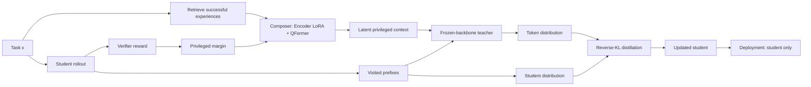

# Latent On-Policy Self-Distillation：把“特权上下文”从手写提示变成可学习的潜变量

### 元信息与 TL;DR

| 项目 | 内容 |
| --- | --- |
| 论文 | Latent On-Policy Self-Distillation |
| 方向 | 大模型后训练；On-Policy Self-Distillation；Agent 工具使用；代码生成 |
| 作者 | Guibin Zhang、Jiayang Lyu、Ran Sun、Xinlei Yu、Haoyu Zhao、Qibing Ren、Shuicheng Yan |
| 官方日期 | arXiv v1 于 2026-08-13 提交；GitHub 仓库 2026-08-14 初始代码发布 |
| 原文 | https://arxiv.org/abs/2608.13040 |
| 代码 | https://github.com/bingreeky/LOPD |

**TL;DR：**

1. 这篇论文讨论的是后训练里的一个具体问题：Agent 或推理模型从自己的 on-policy 轨迹里学习时，教师模型到底应该看到什么“特权上下文”。
2. 传统 OPSD 会把答案、轨迹、反馈、skill summary 或 sibling rollout 作为手写上下文交给 self-teacher；LOPD 的主张是，这个上下文不应再由人预先指定格式，而应由可训练 composer 从经验库里压缩成连续 latent tokens。
3. 方法流程是：学生模型先按当前策略采样轨迹；检索器从成功经验库取相似任务；encoder LoRA 与 QFormer-style compressor 把每条经验压成 K 个 latent token；冻结骨干的 teacher 带着这些 token 重评学生访问过的每个 prefix；学生用 reverse-KL 学 teacher 的 token 分布。
4. 论文的关键稳定项是 privileged-margin objective：只有当 teacher 对成功轨迹上的学生 token 保持足够 log-prob 优势时，composer 才算学到了有用特权上下文；否则约束会惩罚 teacher 向 student 坍缩。
5. 实验覆盖 3 个 backbone、7 个 benchmark：Qwen3-4B、Qwen3-8B、OLMo3-7B；EnvScaler、BFCL-v3、ACEBench、LiveCodeBench v5/v6、HumanEval+、MBPP+。
6. 主结果里，LOPD 在 10 个 backbone-benchmark aggregate 比较中都拿到最好结果；例如 Qwen3-8B 在 EnvScaler/BFCL-v3/ACEBench 上达到 66.4/29.88/62.7，强于最强 baseline 的 60.2/29.00/58.0。
7. 消融显示：冻结 composer 得到 0.573 EnvScaler reward；无 margin 时降到 0.551；m=0.05 时升到 0.637。也就是说，训练 latent context 本身不是自动有效，margin 是防坍缩条件。
8. 局限也很明确：训练代码尚未完整开放；经验库只来自训练 split 的成功轨迹；latent token 的功能难以直接解释；多数证据仍来自作者自建训练管线与固定 benchmark，外部复现还没完成。

### 研究问题：OPSD 真正卡在哪里？

这篇论文不是在问“再设计一个更聪明的 prompt 模板能不能提升 teacher”，而是在问一个更底层的问题：

> 在 on-policy self-distillation 中，特权上下文本身能不能从经验里端到端学出来？

把问题拆开，作者的逻辑是：

1. **on-policy 的好处**  
   学生在训练时访问的状态，就是它按当前策略会真的走到的状态。相比 off-policy imitation，它减少训练分布和推理分布的错位。

2. **distillation 的好处**  
   稀疏 reward 只告诉你整条轨迹成败；token-level teacher distribution 能把监督分散到每个 action prefix，让学习信号更密。

3. **self-teacher 的好处**  
   不需要另一个更强模型；teacher 和 student 来自同一 backbone，只是 teacher 额外看到特权信息。

4. **真正的瓶颈**  
   以往方法把特权信息做成固定 artifact：答案、演示轨迹、环境反馈、成功 sibling、skill summary。问题是这些 artifact 的格式由设计者预设，未必适合当前任务、当前 prefix、当前学生错误模式。

作者因此把 OPSD 的中心问题从：

```text
哪个 teacher 足够强？
```

改写为：

```text
teacher 应该看到什么上下文，才能在学生实际访问过的状态上给出更有用的分布？
```

这一步改写很重要。它把“教师能力”问题变成“经验表示”问题，也把后训练里的人工上下文工程推进到可学习表示学习。

### 论文主张与论证路线

| 层级 | 作者主张 | 机制 | 证据 | 边界 |
| --- | --- | --- | --- | --- |
| 问题层 | 固定特权上下文不是普适解 | 不同 artifact 对不同任务和 prefix 的适配性不同 | SDPO、OPSD 在若干设置中低于 vanilla | 不能证明所有手写 context 都无用，只说明现有代表方法不稳 |
| 方法层 | 特权上下文可以被学成 latent substrate | 检索成功轨迹，再由 composer 压缩成连续 token | LOPD 在工具使用和代码生成上都优于 baseline | 依赖成功轨迹库、检索器和训练管线 |
| 训练层 | 可学习 context 需要防坍缩约束 | privileged-margin 约束 teacher 对成功轨迹保持优势 | m=0 时 reward 0.551，m=0.05 时 0.637 | margin 仍是超参，过大或过小都不一定最好 |
| 行为层 | 学到的指导能被学生内化 | 推理时移除检索器、composer、latent token，只保留 student | LOPD 工具调用更顺序化，重复调用下降 | 行为指标是间接证据，不等同于完全解释 latent token |

用一句话概括：

**LOPD 的贡献不是“把经验塞进 prompt”，而是把经验变成只在训练期存在的、可微的 teacher-side 特权表示，并把它蒸馏进部署时不带上下文的 student。**

### 方法机制：从固定 artifact 到 latent privileged context

#### 1. 标准 OPSD 设定

多轮 Agent 接收任务 \(x\)，在环境里观察与行动。第 \(t\) 轮状态写作：

```math
s_t = (x, o_{\le t}, a_{<t})
```

其中：

| 符号 | 含义 |
| --- | --- |
| \(x\) | 当前任务 |
| \(o_{\le t}\) | 到第 \(t\) 轮为止的环境观察 |
| \(a_{<t}\) | 之前已经执行的动作 |
| \(a_t = (a_{t,1}, ..., a_{t,L_t})\) | 第 \(t\) 轮动作的 token 序列 |
| \(\tau\) | 完整交互轨迹 |

student 从当前状态采样动作：

```math
a_t \sim \pi_\theta^S(\cdot \mid s_t)
```

传统 OPSD 会用一个固定变换 \(\Phi_{\text{fix}}\) 从经验源 \(\mathcal{E}\) 里构造特权上下文：

```math
c_{\text{fix}} = \Phi_{\text{fix}}(x, \mathcal{E})
```

teacher 看到 \(s_t\) 和 \(c_{\text{fix}}\)，student 只看到 \(s_t\)。然后在学生实际访问过的 prefix 上做 token-level distillation。

关键限制就在 \(\Phi_{\text{fix}}\)：  
如果设计者规定 teacher 看到“答案”，那么 teacher 的监督会偏向答案路径；如果规定看到“成功轨迹”，则可能和学生当前 prefix 不匹配；如果规定看到“skill summary”，又可能太粗。

#### 2. LOPD 的改写

LOPD 把固定构造器换成可学习 composer：

```math
c_\phi = \Phi_\phi(x, \mathcal{E}) = \langle e_1 \rangle \oplus \langle e_2 \rangle \oplus \cdots \oplus \langle e_K \rangle
```

这里的核心变化是：

1. \(\Phi_\phi\) 有可训练参数，不再是手写规则。
2. \(\langle e_i\rangle\) 是连续 latent token，不必是自然语言。
3. teacher 使用 latent context，student 在推理时完全不使用它。
4. 训练结束后，检索器、经验库、composer、latent token 都被拿掉，只部署学生策略。

#### 3. 经验检索与 composer

作者没有从复杂经验管线开始，而是用一个最小可运行设定：

| 模块 | 输入 | 输出 | 作用 |
| --- | --- | --- | --- |
| Experience bank | 成功任务与成功轨迹 | \((x_i, \tau_i)\) 条目 | 保存训练 split 内的成功经验 |
| Dense retriever | 当前任务 \(x\) | top-\(n_{\text{ret}}\) 相似经验 | 找到可迁移的历史轨迹 |
| Encoder LoRA | 当前任务与检索经验 | hidden states | 做 task-conditioned encoding |
| QFormer-style compressor | hidden states 与 learned queries | \(K\) 个 latent token | 把可变长经验压成固定 latent context |
| Frozen teacher backbone | \(s_t\) 与 latent context | teacher logits | 在同一 prefix 上提供密集监督 |

附录里的关键工程参数包括：

1. 检索器使用 Qwen3-Embedding-8B，embedding 维度 4096。
2. 每个任务默认检索 \(n_{\text{ret}}=3\) 条经验。
3. 每条经验压缩成 \(K=32\) 个 latent token，因此默认 teacher context 里有 96 个 latent token。
4. compressor 是 QFormer-style perceiver，8 层 cross-attention，共享权重。
5. composer 的 encoder LoRA 和 QFormer 在 cold-start 与 joint optimization 中都可训练；backbone 保持冻结。

### 训练目标：为什么需要 privileged margin？

如果只让 teacher 和 student 的分布靠近，会出现一个低阻力坏解：

```text
composer 学会让 teacher 变得像 student，
而不是让 teacher 变得更有信息量。
```

作者把这个问题称为 teacher 向 student 坍缩。LOPD 用两层机制避免它：

1. **cold-start**  
   先用成功轨迹做监督微调，让 composer 起步时能把经验压成可用 latent context。

2. **privileged-margin constraint**  
   在 joint optimization 时，要求 teacher 对成功轨迹上的学生 token 保持可验证优势。

单个 token 的 privilege 写作：

```math
\delta_{t,n}(\phi)
= \log \pi^T_{\bar{\theta},\phi}(a_{t,n}\mid s_t,c_\phi,a_{t,<n})
- \operatorname{sg}[\log \pi^S_\theta(a_{t,n}\mid s_t,a_{t,<n})]
```

变量解释：

| 变量 | 解释 |
| --- | --- |
| \(a_{t,n}\) | 学生在第 \(t\) 轮、第 \(n\) 个位置采样出的 token |
| \(\pi^T\) | 带 latent context 的 teacher |
| \(\pi^S\) | 不带 latent context 的 student |
| \(\operatorname{sg}\) | stop-gradient，避免这条路径更新 student |
| \(\delta_{t,n}\) | teacher 相对 student 对该 token 的 log-prob 优势 |

轨迹级 reward \(r(\tau)\in[0,1]\) 被转换为：

```math
A(\tau) = 2r(\tau) - 1
```

于是成功轨迹会鼓励 teacher 在学生 token 上保持更高概率；失败轨迹则不应强化这种优势。整体 privilege margin 为：

```math
\Delta(\phi)
= \mathbb{E}_{\tau}\left[
\frac{\sum_{t,n}\omega_{t,n} A(\tau)\delta_{t,n}(\phi)}
{\sum_{t,n}\omega_{t,n}}
\right]
```

最终目标是：

```math
\min_{\theta,\phi}\max_{\beta\ge0}
\mathcal{L}_{distill}(\theta,\phi)
+ \beta(m-\Delta(\phi))
+ \lambda\|c_\phi-\operatorname{sg}[c_{\phi_0}]\|_2^2
```

这条公式的作用可以拆成三句：

1. \(\mathcal{L}_{distill}\)：让 student 学 teacher 的 token distribution。
2. \(\beta(m-\Delta)\)：当 teacher 优势不足时，提高惩罚，防止 latent context 失去特权信息。
3. anchor term：把 context 拉回 cold-start 初始化附近，防止 latent 表示漂移过大。

### 算法流程：LOPD 训练循环

```text
Input:
  student policy πθ^S
  frozen teacher backbone πθbar
  composer Φφ initialized from φ0
  experience bank B
  verifier V: τ -> [0, 1]
  margin m and dual step ηβ

State:
  dual variable β
  cached cold-start latent context cφ0

Loop:
  1. Sample tasks from training distribution.
  2. Student rolls out τ under πθ^S.
  3. Verifier returns reward r(τ), then A(τ)=2r(τ)-1.
  4. Retriever selects top-nret successful experiences for each task.
  5. Composer Φφ compresses retrieved experiences into latent context cφ.
  6. Teacher re-evaluates every visited prefix with cφ.
  7. Student logits and teacher logits are truncated into top-M plus tail bucket.
  8. Accumulate reverse-KL distillation loss.
  9. Compute token-level privilege δ and trajectory-weighted margin Δ.
 10. Update θ and φ by the LOPD objective.
 11. Update β = [β + ηβ(m - Δ)]+.

Output:
  Deploy πθ^S only; remove retriever, composer, experience bank and latent context.
```

用 Mermaid 看，训练期和部署期的边界是这样的：



### 实验设置：任务、模型、baseline

| 维度 | 设置 |
| --- | --- |
| 训练域 | Agentic tool-use 与 code generation |
| Agentic 训练数据 | EnvScaler-derived tool-interactive corpus，2,349 个任务 |
| Coding 训练数据 | TACO subset of DeepCoder，约 7,000 个 Python 问题 |
| Backbone | Qwen3-4B、Qwen3-8B、OLMo3-7B |
| Tool-use 评测 | EnvScaler 200 个 held-out 任务；BFCL-v3 四个子集；ACEBench 50 个任务 |
| Coding 评测 | LiveCodeBench v5/v6；HumanEval+ 164 题；MBPP+ 378 题 |
| Baseline | Vanilla、GRPO、SDFT、OPSD、SDPO、Skill-SD |
| 共同训练条件 | 同一 backbone、同一训练 split、同一评测协议；on-policy rollout budget 每步 32 条 |

baseline 的差异在于 teacher 的上下文来源：

| 方法 | 监督来源 | 特权上下文形态 | 主要边界 |
| --- | --- | --- | --- |
| GRPO | 环境 outcome reward | 无 teacher，无 privileged context | 信号稀疏，依赖 reward 可验证性 |
| SDFT | oracle demonstration | 文本演示追加到 user message | 依赖 demonstration 覆盖与匹配 |
| OPSD | oracle trajectory | 系统消息里的 reference plan | 可能与学生当前 prefix 或路径不一致 |
| SDPO | successful sibling trajectory | 当前 rollout group 中成功 sibling | 当前策略成功率低时信号稀薄 |
| Skill-SD | skill bank | 结构化 skill summary | summary 可能过粗或选错 skill |
| LOPD | retrieved successful trajectories | 连续 latent tokens | 依赖 composer、检索器和 margin 稳定训练 |

### 主结果：不是某个 benchmark 的局部胜利

#### Tool-use 结果

| Backbone | 方法 | EnvScaler | BFCL-v3 Avg | ACEBench Avg |
| --- | --- | ---: | ---: | ---: |
| Qwen3-4B | Vanilla | 48.6 | 22.88 | 50.6 |
| Qwen3-4B | GRPO | 61.8 | 25.25 | 56.0 |
| Qwen3-4B | Skill-SD | 59.1 | 24.63 | 56.0 |
| Qwen3-4B | OPSD | 51.2 | 25.13 | 48.6 |
| Qwen3-4B | SDPO | 50.6 | 15.75 | 38.0 |
| Qwen3-4B | SDFT | 50.3 | 21.75 | 50.0 |
| Qwen3-4B | **LOPD** | **63.7** | **27.38** | **60.6** |
| Qwen3-8B | Vanilla | 49.2 | 28.38 | 54.6 |
| Qwen3-8B | GRPO | 57.3 | 29.00 | 58.0 |
| Qwen3-8B | Skill-SD | 60.2 | 27.38 | 56.0 |
| Qwen3-8B | OPSD | 52.0 | 25.75 | 52.7 |
| Qwen3-8B | SDPO | 55.3 | 25.00 | 52.0 |
| Qwen3-8B | SDFT | 56.2 | 26.88 | 54.7 |
| Qwen3-8B | **LOPD** | **66.4** | **29.88** | **62.7** |

这张表支持两个判断：

1. LOPD 不只是比某个弱 baseline 强。  
   在 Qwen3-4B 上，它分别超过最强竞争方法：EnvScaler 63.7 vs 61.8，BFCL-v3 27.38 vs 25.25，ACEBench 60.6 vs 56.0。

2. 固定上下文确实不稳定。  
   SDPO 在 Qwen3-4B 的 BFCL-v3 上只有 15.75，低于 vanilla 的 22.88；ACEBench 上 38.0，也低于 vanilla 的 50.6。OPSD 在 LiveCodeBench 上也显著低于 vanilla。

#### Code 结果

| Backbone | 方法 | LiveCodeBench Avg | HumanEval+ | MBPP+ | EvalPlus Avg |
| --- | --- | ---: | ---: | ---: | ---: |
| Qwen3-4B | Vanilla | 45.61 | 85.37 | 75.93 | 78.79 |
| Qwen3-4B | GRPO | 48.29 | 86.59 | 76.19 | 79.34 |
| Qwen3-4B | Skill-SD | 47.32 | 85.98 | 76.98 | 79.70 |
| Qwen3-4B | OPSD | 40.24 | 85.36 | 76.72 | 79.33 |
| Qwen3-4B | SDPO | 38.78 | 84.76 | 74.87 | 77.86 |
| Qwen3-4B | SDFT | 47.07 | 87.20 | 76.98 | 80.07 |
| Qwen3-4B | **LOPD** | **48.78** | **87.80** | **78.57** | **81.36** |
| OLMo3-7B | Vanilla | 46.34 | 86.59 | 70.37 | 75.28 |
| OLMo3-7B | GRPO | 48.29 | 89.02 | 72.75 | 77.67 |
| OLMo3-7B | Skill-SD | 47.80 | 87.20 | 72.22 | 76.75 |
| OLMo3-7B | OPSD | 44.39 | 87.80 | 71.96 | 76.75 |
| OLMo3-7B | SDPO | 47.80 | 88.41 | 72.75 | 77.49 |
| OLMo3-7B | SDFT | 46.58 | 89.02 | 73.02 | 77.86 |
| OLMo3-7B | **LOPD** | **50.98** | **90.24** | **73.28** | **78.41** |

代码生成部分的意义在于：  
LOPD 不是只适合多轮工具调用。它同样能在单轮或近单轮代码生成任务里，把历史成功解法压成训练期 teacher guidance，再让部署 student 内化。

但这里也要注意边界：

1. LOPD 在 EvalPlus 上的提升比 EnvScaler 小得多，例如 OLMo3-7B 的 EvalPlus Avg 是 78.41，只比 SDFT 的 77.86 高 0.55。
2. 这说明 latent context 对交互式工具任务的收益更显著，对已经较高分的短代码 benchmark，空间更有限。
3. 作者没有证明 LOPD 对所有后训练任务都有效；证据集中在工具使用与 Python 代码生成。

### 消融与失败案例：论文最有价值的部分

#### 1. joint optimization 不是越自由越好

Figure 3 的 ablation 直接回答“composer 可训练是否真的有用”：

| 设置 | EnvScaler mean reward |
| --- | ---: |
| Frozen \(\phi_0\) | 0.573 |
| \(m=0\) | 0.551 |
| \(m=0.01\) | 0.566 |
| \(m=0.02\) | 0.603 |
| \(m=0.05\) | **0.637** |
| \(m=0.10\) | 0.626 |
| \(m=0.20\) | 0.613 |

这组结果的读法是：

1. 只把 composer 解冻并不会自动提升。  
   \(m=0\) 反而从 frozen 的 0.573 掉到 0.551，说明 distillation loss 可能把 teacher 拉向 student。

2. margin 太弱也不够。  
   \(m=0.01\) 只有 0.566，仍低于 frozen composer。

3. 中等 margin 最好。  
   \(m=0.05\) 达到 0.637，但 \(m=0.20\) 又回落到 0.613，说明“teacher 必须强过 student”的约束也不能无限加大。

这比主结果更能支撑论文机制：  
**LOPD 的收益来自有约束的 context learning，而不是多加了一组参数。**

#### 2. sample efficiency：少于 30% rollout budget 的含义

Figure 4 跟踪同一 1,600 generation budget 下的 EnvScaler mean reward：

1. LOPD 在 320 generations 后超过 0.61。
2. LOPD 在 576 generations 达到 0.637。
3. 后续到 1,600 generations 基本保持在 0.63-0.64。
4. GRPO 和 Skill-SD 最终约为 0.611 与 0.588。

“少于 30% rollout budget”指的是：  
LOPD 用 576/1600 = 36% 附近的 generation 已经超过 baseline 最终表现；论文摘要里用更广义的 rollout budget 对比称其少于 GRPO 和 Skill-SD 的 30% 预算即可取得更好表现。这里的关键不是节省推理时成本，因为部署时确实更轻；关键是训练期每条 on-policy 轨迹被 teacher 转换成了更密集的 prefix-level 信号。

#### 3. latent token 容量不是越大越好

Figure 5(a) 的容量实验：

| 每条经验 latent tokens \(K\) | EnvScaler reward |
| --- | ---: |
| 8 | 56.5 |
| 16 | 56.3 |
| 32 | **63.7** |
| 64 | 60.6 |
| 128 | 62.9 |

这说明：

1. \(K=8\) 与 \(K=16\) 太窄，经验信息压不进去。
2. \(K=32\) 是最小有效容量，刚好跨过 bottleneck。
3. \(K=64\) 与 \(K=128\) 没有单调收益，说明更多 latent token 可能增加优化难度或冗余。

#### 4. 检索数量也不是越多越好

作者固定 \(K=32\)、\(m=0.05\)，把训练期检索条数 \(n_{\text{ret}}\) 从 1 扫到 10：

1. EnvScaler 从 1 条检索的 0.605 提升到 3 条检索的 0.637。
2. 超过 3 条后没有单调改善。
3. 默认 \(n_{\text{ret}}=3\) 时，ACEBench M-Step/M-Turn/Avg 为 56.6/63.3/60.6。

这给 Agent memory 与 experience replay 一个很实际的提示：

**经验检索不是召回越多越好，而是要给 composer 足够但不过载的相关证据。**

### 行为内化：student 到底学到了什么？

Table 3 不看总 reward，而看 EnvScaler 交互行为：

| 指标 | Vanilla | Base + Composer | LOPD |
| --- | ---: | ---: | ---: |
| Reward | 0.486 | 0.631 | 0.637 |
| Interaction steps | 11.12 | 16.31 | 17.04 |
| Tool calls / step | 3.50 | 1.21 | 1.11 |
| First-step length | 9,937 | 6,695 | 6,210 |
| Reward / tool call | 0.038 | 0.053 | 0.050 |
| Repeated tool calls | 8.89 | 4.49 | 5.25 |

这个表比“reward 变高”更有解释力：

1. Vanilla 倾向于每步打很多工具调用，像是在并行试探。
2. LOPD 走更多环境步，但每步工具调用从 3.50 降到 1.11。
3. 首步输出长度从 9,937 降到 6,210，说明模型不再用冗长首轮计划覆盖不确定性。
4. 重复工具调用从 8.89 降到 5.25，reward/tool call 从 0.038 升到 0.050。
5. Base + Composer 和最终 LOPD 呈现相似模式，支持“latent teacher 的过程指导被 student 内化”的解释。

不过，这仍然是间接证据。作者在 case study 里把 latent token 投影回词表，发现投影结果是多语言和代码 token 的碎片混合，不能直接读成清晰规则。因此：

1. 行为统计说明 student 变得更像受 latent context 指导的 agent。
2. 词表投影不能证明 latent token 的因果功能。
3. 真正的机制解释还需要 activation-level 或 causal intervention 证据。

### Figure 与 Table 逐项证据解读

| 图表 | 支持什么 | 不能证明什么 |
| --- | --- | --- |
| Figure 1 | 把固定 privileged context 与 learnable latent context 做概念对比 | 只是动机图，不是实验 |
| Figure 2 | 展示 student rollout、retrieval、composer、teacher evaluation、reverse-KL 与 margin 的训练闭环 | 不能单独证明每个模块都必要 |
| Table 1 | LOPD 在工具使用三类评测上整体领先 | 不能排除特定未测任务里固定 context 更强 |
| Table 2 | LOPD 在代码生成上也有迁移收益 | 提升幅度较小，不能说明所有代码任务都显著收益 |
| Figure 3 | margin 是防坍缩关键；m=0 失败 | margin 最优值可能随模型和任务变 |
| Figure 4 | LOPD 学得更快，训练早期就超过 GRPO/Skill-SD | 曲线只覆盖 EnvScaler 与 Qwen3-4B 分析设置 |
| Figure 5 | K=32、nret=3 是有效容量与检索折中 | 没有证明该配置能迁移到更大模型或更长 horizon |
| Table 3 | LOPD 改变工具调用行为，学生推理时不需要 latent context 仍保留模式 | 行为模式不等于 latent token 可解释性 |
| Figure 6 | latent token 投影显示其不像复制文本轨迹 | 词表投影只是弱解释工具，不能确认功能特征 |

### 相关工作位置：LOPD 放在什么谱系里？

可以把这篇论文放在三个交叉谱系里看：

1. **on-policy distillation 谱系**  
   它继承了“在学生实际访问状态上做 teacher supervision”的思路，核心收益是缓解 off-policy mismatch。

2. **self-distillation / OPSD 谱系**  
   它不依赖外部更强 teacher，而是让同一 backbone 在 teacher role 中看到额外信息。

3. **latent computation / latent memory 谱系**  
   它使用连续 token 承载经验，但不是推理期 memory augmentation；latent context 只在训练期服务 teacher，最后被蒸馏进 student。

这使 LOPD 和常见 RAG-memory agent 有明显区别：

| 对比项 | RAG / memory-augmented inference | LOPD |
| --- | --- | --- |
| 经验使用阶段 | 推理期 |
| 经验呈现形式 | 通常是文本 chunk 或工具检索结果 |
| 部署依赖 | 检索器、索引、上下文窗口 |
| 主要风险 | 检索污染、上下文注入、延迟 |
| LOPD 的对应做法 | 训练期使用经验；部署期移除 |
| LOPD 的表示形式 | 连续 latent token |
| LOPD 的部署依赖 | 只保留 student |
| LOPD 的风险 | 训练复杂、latent 不可解释、复现门槛高 |

### 证据边界与可复现性

这篇论文的结论值得认真看，但边界也要一起带走：

1. **代码开放不完整**  
   GitHub README 标注 2026-08-14 初始代码发布，同时说明训练代码仍在整合，后续单独发布。这意味着外部目前更容易复现 inference 和结构，而不是完整复现 LOPD 训练。

2. **经验库依赖成功轨迹**  
   LOPD 的 experience bank 来自训练 split 的成功 rollouts，评测任务被排除。这个设定避免 evaluation leakage，但也意味着方法依赖足够成功样本；在极低成功率任务上，cold-start 与检索质量会成为瓶颈。

3. **验证器必须可信**  
   margin 里的 \(A(\tau)=2r(\tau)-1\) 依赖 reward。EnvScaler 和代码测试有较清晰 reward；开放式任务、偏好任务或安全任务上，reward 质量会直接影响 teacher 优势方向。

4. **latent token 难解释**  
   作者的投影案例显示 latent token 不等同于可读规则或复制轨迹。它们可能确实编码过程信息，但还缺少因果解释。

5. **scale 与 horizon 未完全覆盖**  
   当前 backbone 是 4B、8B、7B 量级；Agent 任务步数有限。更大模型、更长 horizon、更复杂工具权限下，训练稳定性和收益曲线仍需验证。

6. **安全边界未展开**  
   LOPD 会让学生内化从历史轨迹提炼出的程序性策略。如果经验库里有不良或越权轨迹，训练期 latent context 可能把坏策略也蒸馏进 student。论文主要讨论性能，没有系统处理经验库审计、权限隔离或安全过滤。

### 对后训练研究的启发

从研究者视角看，LOPD 最值得带走的不是“又一个 distillation loss”，而是三条更可迁移的思路：

#### 1. 经验表示应被优化，而不是被命名

很多后训练方法把经验格式命名为：

1. reflection
2. skill
3. trace
4. critique
5. demonstration
6. retrieved document

LOPD 的提醒是：  
这些命名只是人类可读 artifact，未必是 teacher 最需要的表示。对于 dense supervision，teacher 需要的是能在当前 prefix 上改变分布的上下文，而不是看起来像知识卡片的文本。

#### 2. 训练期 memory 与推理期 memory 可以分离

推理期 memory 会带来工程和安全成本：

1. 检索延迟。
2. 上下文窗口占用。
3. 检索污染。
4. prompt injection。
5. 权限边界复杂化。

LOPD 选择训练期使用 memory、部署期移除 memory。这并不能消除训练数据风险，但它把运行时攻击面变小了。对 Agent 安全来说，这是一个值得进一步研究的方向：

```text
Can we distill safe procedural memory into a policy,
while auditing and constraining the training-time memory bank?
```

#### 3. 防坍缩约束比“加参数”更关键

Figure 3 明确显示：  
可训练 composer 在无 margin 时比 frozen composer 更差。这对后训练方法是一个很强的警示：

1. 如果 teacher 和 student 共用 backbone，teacher-side adapter 可能学会迎合 student。
2. 如果 reward 只在轨迹级，token-level teacher advantage 可能没有真实语义。
3. 如果不约束 teacher 优势，dense supervision 可能只是更密集地传播错误。

因此，未来 OPSD 类方法可能需要把“teacher 为什么比 student 更值得学”写成显式可检验条件，而不是只默认 privileged context 有用。

### 继续追问

1. **更低成功率任务怎么办？**  
   如果训练初期几乎没有成功轨迹，experience bank 如何冷启动？是否需要 curriculum、synthetic success 或 verifier-guided exploration？

2. **安全过滤如何进入 composer？**  
   如果经验库中混入越权工具调用、隐私泄露或 prompt injection 轨迹，latent token 是否会把这些模式蒸馏进 student？能否对 latent context 加安全约束或反事实删除测试？

3. **margin 能否自适应？**  
   当前 \(m=0.05\) 来自经验设置。不同任务、不同 reward 噪声、不同模型规模下，固定 margin 可能不稳。是否能按 uncertainty、reward calibration 或 teacher entropy 自适应？

4. **latent context 的因果解释如何做？**  
   词表投影只能说明 token 不可读。更强的证据需要 intervention：遮掉某些 latent token、替换检索经验、改变 reward sign，观察 teacher logits 和 student 学习轨迹。

5. **和 RLVR 的组合空间在哪里？**  
   LOPD 把 sparse reward 变成 dense distillation，但仍然依赖 reward。未来可以研究 GRPO/RLVR 与 LOPD 的 staged training：先用 RL 提高成功覆盖，再用 latent OPSD 提升 sample efficiency。

### 复现实验该怎么设计？

如果后续训练代码完整开放，最小复现不应只重跑最终表格，而应围绕“latent context 是否真的承担特权监督”拆成几组可审计实验：

| 复现问题 | 最小实验 | 预期观察 | 失败解释 |
| --- | --- | --- | --- |
| 检索是否重要 | 固定 composer，把 top-3 检索改成随机成功轨迹 | 如果 reward 明显下降，说明相似经验确实有用 | 如果不下降，可能 composer 只学到通用先验 |
| latent 是否必要 | 把 latent token 替换成同等长度文本 summary | 若 latent 胜出，说明连续表示有额外收益 | 若文本接近，方法贡献可能主要来自更好检索 |
| margin 是否稳健 | 在多个 reward 噪声水平下扫 \(m\) | 合理 margin 应在噪声升高时更敏感 | 如果曲线不稳定，说明 verifier calibration 是瓶颈 |
| student 是否内化 | 推理时完全移除检索器和 composer | 指标与行为模式应保持 LOPD 风格 | 如果掉回 vanilla，说明只是 inference-time context 效应 |
| 安全过滤是否有效 | 从经验库注入少量越权轨迹并做审计 | 安全过滤应降低坏行为迁移 | 如果模型内化坏轨迹，训练期 memory 需要权限边界 |

这类复现比单纯复刻 Table 1 更关键，因为 LOPD 的核心 claim 是机制 claim：

1. 不是“多训练一会儿更好”。
2. 不是“检索几条成功轨迹更好”。
3. 不是“teacher 看到更多上下文更好”。
4. 而是“可学习 latent context 在 margin 约束下提供了更适配学生当前 prefix 的 teacher distribution”。

因此，复现实验需要同时报告三类证据：

1. **性能证据**  
   复现 EnvScaler、BFCL-v3、ACEBench、LiveCodeBench、EvalPlus 的 aggregate 与子集指标，尤其是那些 fixed-context baseline 低于 vanilla 的反例。

2. **机制证据**  
   报告 frozen composer、m=0、不同 \(K\)、不同 \(n_{\text{ret}}\)、随机检索、文本 summary 替代等 ablation，确认收益不是来自额外参数或数据泄漏。

3. **行为证据**  
   报告工具调用步数、每步调用数、重复调用、首步长度、reward per tool call，确认 student 不是只在 benchmark 指标上提升，而是交互策略发生了可观察变化。

### 安全视角：训练期 memory 也需要边界

LOPD 对 Agent 安全有一个微妙启发：  
它把 memory 从推理期移到训练期，降低了部署时检索注入和权限扩散风险；但这不等于 memory 风险消失。

训练期经验库至少需要四层控制：

1. **来源控制**  
   只允许来自可信环境、可验证任务和明确授权工具范围内的轨迹进入 experience bank。

2. **结果控制**  
   不能只看 reward 是否高，还要看轨迹是否通过权限、隐私、合规和副作用检查。一个高 reward 轨迹可能通过越权调用完成任务。

3. **表示控制**  
   latent token 不可读，所以需要对输入经验、teacher 行为和最终 student 行为做外部审计，不能把“不可解释”当成“无风险”。

4. **回归控制**  
   每次更新经验库或 composer 后，都应运行行为安全回归：禁止工具、敏感参数、越权 API、重复调用、异常长首步输出和不必要的信息收集。

这一点会影响 LOPD 在真实 Agent 系统中的落地方式。一个合理的训练流水线不应是：

```text
成功轨迹 -> 经验库 -> latent composer -> student
```

而应是：

```text
成功轨迹
  -> 权限审计
  -> 数据最小化
  -> 反注入检查
  -> latent composer
  -> student
  -> 行为安全回归
```

换句话说，LOPD 给出了“训练期内化经验”的有效路径，但安全版本的 LOPD 还需要把 experience bank 当成高权限数据资产管理。

### 结论

LOPD 的核心价值在于把 OPSD 的“特权上下文”从人工选择的文本 artifact 改写成可学习 latent substrate。它的证据链比较完整：

1. 方法上，有检索、composer、latent teacher、reverse-KL、privileged margin 的闭环。
2. 实验上，覆盖工具使用和代码生成，主结果在 10 个 aggregate 比较中领先。
3. 消融上，证明 margin 与 joint optimization 的作用，而不是只展示最终分数。
4. 行为上，显示 student 在无 privileged context 推理时仍保留更顺序、更少重复调用的工具使用模式。

最需要保留的边界是：  
训练代码尚未完整释放，latent 表示仍难解释，经验库质量和 reward/verifier 质量会决定方法是否安全可靠。对于后训练研究，它提出了一个有分量的问题：下一代 self-improving agent 也许不应继续堆 hand-crafted reflection，而应学习一种训练期可审计、部署期可移除的经验表示。
