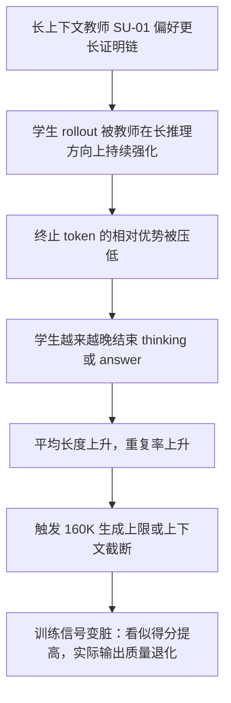

# SimpleOPD：把长上下文证明推理蒸馏给短上下文学生，真正难点不是“会不会学”，而是“别学到停不下来”

### 元信息

| 项目 | 内容 |
| --- | --- |
| 论文 | SimpleOPD: Simple Tokenizer-Agnostic On-Policy Distillation for Long-Context Reasoning |
| 作者 | Haonan He、Haodi Lei、Yun Luo、Haoran Zhang、Shunkai Zhang、Yizhuo Li、Shengji Tang、Zhilin Wang、Runzhe Zhan、Lei Bai、Ganqu Cui、Fangchen Yu、Yafu Li、Peng Ye、Ning Ding、Yu Cheng |
| 机构 | SU-01 Team, Shanghai Artificial Intelligence Laboratory |
| 原文 | [arXiv:2608.14277](https://arxiv.org/abs/2608.14277) |
| 发现入口 | [Hugging Face Papers: 2608.14277](https://huggingface.co/papers/2608.14277)，页面显示 arXiv 8 月 14 日发布、8 月 17 日提交到 HF Papers |
| 项目材料 | [SimpleOPD project page](https://hhnqqq.github.io/SimpleOPD-project-page/) 与 [GitHub: hhnqqq/SimpleOPD](https://github.com/hhnqqq/SimpleOPD) |
| 方向 | 大模型后训练、on-policy distillation、长上下文推理迁移 |

### TL;DR

- 这篇论文研究一个很具体但重要的后训练问题：如何把长上下文教师模型 SU-01 的数学证明推理能力，迁移到上下文更短、tokenizer 也可能不同的学生模型。
- 作者没有走“先采教师长轨迹再 SFT”的离线路线，而是做 OPD：学生先按自己的策略生成轨迹，教师再在这些学生轨迹上给 token 级监督。
- 第一处难点是 tokenizer mismatch：教师和学生对同一段文字的切分不同，无法直接逐 token 比 KL；SimpleOPD 改在共享文本空间对齐，只监督双方 token 占据完全相同文本 span 的位置。
- 第二处难点更像训练事故：长上下文教师会偏好很长的证明链，直接 OPD 会让学生越来越冗长，丢失终止能力，出现 truncation、重复、自检循环。
- 稳定化设计很克制：一是屏蔽 `</think>`、`<|im_end|>` 等结构终止 token 的 OPD advantage，二是加 student-reference KL，把学生拉回初始策略附近。
- 关键数字很强：Intern-S2-Preview 在 ProofBench 上从 34.0 提到 55.2，增幅 21.2 分；用 DeepSeek-V4-Flash judge 的主表中，Intern-S2 从 21.70 到 44.50，几乎追平 SU-01 的 45.00。
- 跨模型也有效：Qwen3、Qwen3.5、Intern-S2、GLM-4.7、Gemma-4 多个学生都有证明推理提升；但 Gemma 在 AnswerBench 上下降，说明 tokenizer/架构差异仍然会限制迁移。
- 局限也明确：教师 SU-01 本身未完全公开，训练数据以数学证明为主，ProofBench 依赖模型 judge；论文证明的是“稳定跨 tokenizer OPD 可行”，不是“所有长推理能力都可低成本复制”。

### 这篇论文真正回答什么问题？

#### 不是一般蒸馏，而是长上下文教师到短上下文学生

- 普通知识蒸馏常见设置是：
  - 教师生成样本；
  - 学生在固定数据上模仿；
  - 训练分布由教师或离线数据决定。
- OPD 的设置不同：
  - 学生先产生自己的 rollout；
  - 教师在学生已经走到的状态上打分；
  - 学生学到的是“在自己会访问的状态上，教师更偏好的 token 行为”。
- 这篇论文把 OPD 放进更困难的场景：
  - 教师是长上下文证明模型 SU-01，可以维持超过 100K token 的自然语言推理；
  - 学生是短上下文模型，来自 Qwen3、Qwen3.5、Intern-S2、GLM、Gemma 等不同族系；
  - 教师和学生可能使用不同 tokenizer、不同 chat template、不同容量和不同终止习惯。

#### 论文的主张可以拆成四层

| 层次 | claim | mechanism | evidence | boundary |
| --- | --- | --- | --- | --- |
| 对齐 | 跨 tokenizer OPD 不必要求完整 token 对应 | 在共享 response string 上只匹配完全同 span token | lexical overlap 曲线显示可匹配比例高且随训练上升 | 未对齐位置不接收教师监督，信息会损失 |
| 稳定 | 直接 OPD 会产生长度爆炸 | 长上下文教师压制学生终止，学生分布漂移 | Figure 3/4 显示 truncation、repetition、平均长度上升 | 这是数学证明场景下观测，不等同所有任务 |
| 修复 | 终止 token masking + reference KL 可稳定训练 | 不让教师直接惩罚学生终止，同时约束学生别离初始策略太远 | Table 1：Ref KL 把 Intern-S2 ProofBench 从 21.70 提到 38.50 | KL 系数需调；太小不稳，太大限制学习 |
| 效果 | 长推理能力能迁移到短上下文学生 | 学生轨迹上做密集 token 级教师监督 | Table 2：Intern-S2-OPD ProofBench@4 44.50，Qwen3-30B-A3B +22.67 | 教师、评测、数据域仍限制结论外推 |

### 方法机制：共享文本空间如何替代共享 tokenizer？

#### 基本设置

- 输入对话记为 `x`。
- 学生 chat template 是 `C_theta`，教师 chat template 是 `C_phi`。
- 学生 rollout policy 产生 response token：

```text
y_1:n ~ pi_theta_roll(. | c_theta)
c_theta = C_theta(x)
s = D_theta(y_1:n)
```

- 关键是 `s`：
  - 它不是学生 token 序列本身；
  - 它是学生 token decode 后的表面文本；
  - 教师不会被迫接受学生 tokenizer，而是在自己的 template 和 tokenizer 下评估同一段文本。

```text
c_phi = C_phi(x)
u_phi = c_phi concat s
z_1:m = E_phi(s | c_phi)
```

#### 为什么只对齐完全相同 span？

- 对学生第 `t` 个 token，定义它贡献的文本片段为 `tau_theta(y_t)`。
- 对教师第 `i` 个 token，定义它贡献的文本片段为 `tau_phi(z_i)`。
- 论文要求两边在同一个 response string 中：
  - 前缀消费量一致；
  - 当前 token 的文本片段完全一致。

```text
M = { (i, t) :
      P_phi(i) = P_theta(t)
      and tau_phi(z_i) = tau_theta(y_t) }
```

- 这比“把多个教师 token 合并给一个学生 token”更保守：
  - 部分重叠时，教师 log-prob 无法唯一分摊；
  - 多对一或一对多会引入人为归因；
  - 论文宁愿少用信号，也不把不可比的概率硬拼在一起。

#### teacher target 的构造

| 学生位置 | 是否对齐 | 目标 log-prob |
| --- | --- | --- |
| `a_t = 1` | 找到某个教师 token 与学生 token 同 span | 使用教师 `log pi_phi(z_i | c_phi, z_<i)` |
| `a_t = 0` | 没有完全对齐 token | 回退到学生自己的 `log pi_theta(y_t | c_theta, y_<t)` |

```text
tilde_l_t^phi =
  teacher_logprob(z_i), if aligned
  student_logprob(y_t), if unaligned
```

- 这个定义有一个重要含义：
  - 对齐位置提供教师监督；
  - 未对齐位置不会被错误监督；
  - 未对齐位置也不会被随机噪声拖动。

### OPD 目标：它为什么是 reverse KL 的 surrogate？

#### 同 tokenizer 时的退化情况

- 如果教师和学生 tokenizer 完全相同：
  - 每个学生 token 都能对齐；
  - `z_t = y_t`；
  - 目标可化成标准 reverse KL。

```text
L_Distill(theta)
  = E_{y ~ pi_theta} [ log pi_theta(y | c_theta) - log pi_phi(y | c_phi) ]
  = D_KL( pi_theta(. | c_theta) || pi_phi(. | c_phi) )
```

#### 不同 tokenizer 时的实际做法

- exact token-level KL 不可直接计算。
- SimpleOPD 只在局部文本切分一致的 token 上比较概率。
- 为了在同一 rollout batch 上多次 policy update，作者用 pre-update student log-prob 固定 unmatched 位置，并构造 PPO 风格 advantage：

```text
A_hat_t = tilde_l_t^phi - log pi_theta_old(y_t | c_theta, y_<t)
r_t = pi_theta(y_t | c_theta, y_<t) / pi_theta_old(y_t | c_theta, y_<t)

L_theta = - E sum_t min(
  r_t * A_hat_t,
  clip(r_t, 1 - epsilon, 1 + epsilon) * A_hat_t
)
```

- 这里的设计意义是：
  - OPD 仍然是 on-policy，因为 rollout 来自学生；
  - 教师信号仍然是 dense token-level，而不是只给最终答案 reward；
  - PPO clipping 控制同一批 rollout 上多次更新时的策略漂移。

### 稳定化：为什么学生会“学到停不下来”？

#### 直接 OPD 的失败链条



- Figure 3 对 Intern-S2-Preview 展示了直接 OPD 的症状：
  - AIME25 与 AnswerBench 上分数有阶段性改善；
  - truncation rate 和 repetition rate 同时上升；
  - 平均输出长度快速增大。
- Figure 4 对 Qwen3.5-35B-A3B 更明显：
  - 任务性能甚至出现退化；
  - truncation rate 长期处在高位；
  - 长度增长不再是“更多推理”，而是训练不稳。

#### failure case 不只是曲线异常

| 附录案例 | 场景 | 模型行为 | 为什么重要 |
| --- | --- | --- | --- |
| Case A | AIME25，可正确算出 279 | 正确答案之后重复 10 句自检模板 972 次 | 说明“已经会做题”不等于“会停止输出” |
| Case B | AnswerBench，数论定义题 | 陷入 `2?` 的单 token 循环 34000 多次 | 说明退化可变成原子级 token loop |

- 这两个案例把论文的核心风险说清楚：
  - 如果只看最终判题，模型可能已经得到正确答案；
  - 如果看完整输出，它其实把大量预算浪费在重复或循环；
  - 后训练的目标函数如果不约束长度和终止，就可能奖励错误的推理形态。

### 两个修复：mask 终止 token，reference KL 拉住学生

#### Special-token masking

- 被屏蔽的是结构终止 token，例如：
  - `</think>`；
  - `<|im_end|>`。
- 论文的解释是：
  - 这些 token 控制格式和结束；
  - 它们不需要和教师分布完全一致；
  - 长上下文教师对“继续想”的偏好，不应直接惩罚短上下文学生的终止行为。

| 设置 | ProofBench@4 | AnswerBench@8 | AIME25@8 |
| --- | ---: | ---: | ---: |
| SU-01 | 45.00 | 77.50 | 94.60 |
| Intern-S2-Preview | 21.70 | 76.03 | 88.33 |
| OPD + Spec Mask | 38.10 | 77.60 | 95.00 |

- masking 单独有效：
  - ProofBench +16.40；
  - AIME25 +6.67。
- 但 Figure 5 显示后期 truncation 仍会上升：
  - 它缓解终止 token 的直接惩罚；
  - 但没有全面限制学生策略向长输出分布漂移。

#### Student-reference KL

- reference KL 的目标是把学生限制在初始策略附近。
- 直观理解：
  - 教师提供“该学什么”；
  - reference KL 提供“别变得不像自己”；
  - 这对跨模型、跨 tokenizer 的场景尤其重要，因为教师和学生的容量、上下文预算、输出习惯都不同。

| 设置 | ProofBench@4 | AnswerBench@8 | AIME25@8 |
| --- | ---: | ---: | ---: |
| Intern-S2-Preview | 21.70 | 76.03 | 88.33 |
| OPD + Ref KL | 38.50 | 79.10 | 95.80 |

- Figure 6 的关键信息：
  - truncation rate 接近归零；
  - AIME25 和 AnswerBench 持续提升；
  - 说明长度稳定不是牺牲能力，而是让有效蒸馏信号更干净。

### 实验设置：数据、模型、评测协议

#### 训练数据

| 数据来源 | 数量 | 作用 |
| --- | ---: | --- |
| Open Proof Corpus | 63 | 高质量证明题 |
| AoPS | 2,948 | 社区竞赛数学问题 |
| Books | 900 | 竞赛训练书材料 |
| Shuzhimi + Evan Chen materials | 617 | 中文数学论坛和奥赛材料 |

- 数据全部是数学证明问题。
- 这点很重要：
  - 主结论是 proof reasoning 迁移；
  - 科学 benchmark 的提升属于 out-of-domain 泛化证据；
  - 不能把它解读成通用任务全域提升。

#### 训练细节

| 参数 | 设置 |
| --- | --- |
| 教师 | SU-01，基于 Qwen3-30B-A3B 的 30B-A3B 长上下文推理模型 |
| 学生 | Qwen3-4B、Qwen3-30B-A3B、Qwen3.5-4B、Qwen3.5-35B-A3B、Intern-S2-Preview、GLM-4.7-Flash、Gemma-4-26B-A4B |
| 框架 | Slime 做 OPD，SGLang 做 evaluation rollout |
| rollout iterations | 100 |
| learning rate | `1e-6` |
| rollout batch size | 64 |
| samples per prompt | 4 |
| policy updates per step | 4 |
| PPO clip | 0.2 |
| max rollout length | Qwen 系列 32K；GLM 与 Gemma 6K |
| KL coefficient | Qwen/Intern 0.5；GLM 实验中更高 |

#### 评测协议

- ProofBench：
  - 非完全可验证；
  - 使用 DeepSeek-V4-Flash 作为 cost-efficient judge；
  - 每个 proof rollout 评 4 次，取平均。
- AnswerBench、AIME25、AMOBench：
  - 先用 rule-based verifier；
  - 若答案错误，再用 GPT-OSS-120B 评估；
  - 汇报 8 次 rollout 平均。
- generation 设置：
  - temperature 1.0；
  - top-p 0.95；
  - repetition penalty 1.0；
  - 最大 response length 160,000 tokens。

### 主结果：跨 tokenizer 和跨模型族都能提升，但提升形态不同

#### Table 2 的核心结果

| 模型 | ProofBench@4 | AnswerBench@8 | AIME25@8 | AMOBench@8 |
| --- | ---: | ---: | ---: | ---: |
| SU-01 | 45.00 | 77.50 | 94.60 | 61.75 |
| Qwen3-4B | 11.42 | 47.50 | 71.25 | 23.00 |
| Qwen3-4B-OPD | 23.72 (+12.30) | 64.50 (+17.00) | 90.83 (+19.58) | 35.00 (+12.00) |
| Qwen3-30B-A3B | 13.80 | 59.13 | 88.33 | 36.50 |
| Qwen3-30B-A3B-OPD | 36.47 (+22.67) | 74.46 (+15.33) | 93.75 (+5.42) | 52.75 (+16.25) |
| Qwen3.5-35B-A3B | 26.78 | 73.16 | 94.60 | 57.25 |
| Qwen3.5-35B-A3B-OPD | 42.39 (+15.61) | 80.15 (+6.99) | 96.66 (+2.06) | 61.25 (+4.00) |
| Intern-S2-Preview | 21.70 | 76.03 | 88.33 | 58.00 |
| Intern-S2-OPD | 44.50 (+22.80) | 80.10 (+4.07) | 95.00 (+6.67) | 59.50 (+1.50) |

#### 读表时要注意三点

- 第一，ProofBench 的提升最大：
  - 这符合训练数据以证明题为主的设定；
  - 也说明 OPD 的主要迁移对象是长链自然语言证明能力。
- 第二，AnswerBench 与 AIME25 的提升更像“保留并增强”：
  - Intern-S2 的 AnswerBench 从 76.03 到 80.10；
  - AIME25 从 88.33 到 95.00；
  - 这些不是单纯变长能解释的，因为 reference KL 同时降低了 truncation。
- 第三，不同 tokenizer 差异仍然重要：
  - GLM 使用 BPE，虽然词表不同，但受益较稳定；
  - Gemma 使用 SentencePiece，分词行为差异更大，ProofBench 上升但 AnswerBench 下降；
  - 这说明 SimpleOPD 的“只用完全同 span token”是稳健但保守的。

#### Figure 1 的强证据

- 论文还用 Gemini-2.5-Pro 作为 ProofBench judge 复评。
- Intern-S2-Preview：
  - base：34.0；
  - OPD：55.2；
  - gain：+21.2。
- 作者强调它超过 Gemini-2.5-Pro 与 GPT-5，并接近 SU-01、DeepSeek-V3.2-Speciale。
- 这条证据的边界是：
  - 它仍然是模型 judge 评测；
  - 证明能力是否转化为人类可审证明质量，需要更细的人工或形式化验证；
  - 但它足够说明 SimpleOPD 不只是刷了某个内部表格。

### 消融与分析：SimpleOPD 为什么不是单一技巧？

#### 与 OPD baseline 的比较

| 方法 | ProofBench@4 | AnswerBench@8 | AIME25@8 | AMOBench@8 |
| --- | ---: | ---: | ---: | ---: |
| Intern-S2 | 21.70 | 76.03 | 88.33 | 58.00 |
| EOPD | 41.80 | 78.85 | 95.33 | 57.00 |
| G-OPD | 36.31 | 75.50 | 94.66 | 56.00 |
| SimpleOPD | 44.50 | 80.10 | 95.00 | 59.50 |

- SimpleOPD 在 4 个 benchmark 中赢 3 个。
- AIME25 上 EOPD 比 SimpleOPD 高 0.33 分。
- 这个结果说明：
  - termination masking、reference KL、shared-text alignment 的组合不是孤立补丁；
  - 它在 proof-oriented benchmark 上尤其有效；
  - 但在可验证短答案类 benchmark 上，优势不是绝对。

#### lexical overlap：保守对齐为什么还能工作？

- Figure 9 显示 Qwen3.5-35B-A3B、Intern-S2、GLM-4.7 在训练中已有较高 aligned-token ratio。
- 这支持一个机制判断：
  - 即使 tokenizer 不同，自然语言证明中的大量片段仍会形成相同表面 span；
  - 这些位置足以提供大量 teacher log-prob 信号；
  - 随着学生靠近教师风格，重合率还会上升。
- 但这也暴露 SimpleOPD 的上限：
  - 它不恢复 partial overlap 中的信号；
  - 对 tokenizer 差异更大的模型，可能丢掉更多监督；
  - SimCT 等相邻工作正是从“恢复 tokenizer mismatch 下丢失监督”切入。

#### out-of-domain 泛化

| 模型 | FrontierScience Olympiad | FrontierScience Research | HLE text-only | HiPhO |
| --- | ---: | ---: | ---: | ---: |
| SU-01 | 61.5 | 11.7 | 20.7 | 35.0 |
| Intern-S2-Preview | 60.6 | 1.7 | 19.6 | 38.6 |
| Intern-S2-OPD | 60.9 (+0.3) | 5.0 (+3.3) | 20.5 (+0.9) | 41.1 (+2.5) |

- 训练只用数学证明数据。
- OPD 后：
  - FrontierScience Research 从 1.7 到 5.0；
  - HiPhO 从 38.6 到 41.1；
  - HLE 只小幅增加。
- 研究意义是：
  - 学生没有明显丢失原有科学推理；
  - 某些物理/科学推理可能受益于更强的 proof-style reasoning；
  - 但提升幅度不如 ProofBench，不能宣称通用科学能力大幅迁移。

### 训练数据与长度：更长、更专注，才更像证明迁移

#### 数据组成消融

- 论文比较了：
  - 只用 proof data；
  - proof data + verifiable math data。
- 结果显示：
  - proof-only 在 ProofBench@4 上最好：Intern-S2 从 21.70 到 44.50；
  - 加 verifiable data 后，AnswerBench@8 从 80.10 到 81.10，有 1.00 分收益；
  - 但 ProofBench@4 从 44.50 降到 38.50。

| 解释角度 | 含义 |
| --- | --- |
| 能力目标 | 自然语言证明不是短答案数学的副产品 |
| 数据形态 | proof data 更接近教师长链论证结构 |
| 训练风险 | 混入可验证数据可能稀释 proof-style transfer |

#### distillation length 消融

| 模型 | 长度 | ProofBench@4 | AnswerBench@8 | AIME25@8 |
| --- | ---: | ---: | ---: | ---: |
| Intern-S2-OPD | 6K | 38.80 | 77.25 | 95.00 |
| Intern-S2-OPD | 32K | 44.50 | 80.10 | 95.00 |
| Qwen3.5-35B-A3B-OPD | 6K | 40.07 | 77.97 | 96.25 |
| Qwen3.5-35B-A3B-OPD | 32K | 42.39 | 80.16 | 96.67 |

- 结论很直接：
  - 长证明迁移需要足够长的 distillation sequence；
  - 6K 可以学到一部分；
  - 32K 对 ProofBench 和 AnswerBench 更好。
- 这不是“越长越好”的无条件结论：
  - 前提是训练已经由 masking 和 reference KL 稳定；
  - 如果不稳定，更长只会给模型更多空间重复和截断。

### 相关工作位置：SimpleOPD 是保守接口，不是最强 tokenizer 桥

#### 与 OPD 背景的关系

- Thinking Machines 的 OPD 讨论强调一个核心动机：
  - 离线蒸馏只在固定数据分布上训练；
  - 学生推理时会访问自己的中间状态；
  - 因而需要在学生自己的轨迹上向教师学习。
- SimpleOPD 正是沿这个方向推进：
  - 不是模仿教师生成的固定长证明；
  - 而是让教师评估学生自己已经写出的证明文本。

#### 与 cross-tokenizer 工作的关系

- SimCT 指出 tokenizer mismatch 会在两层丢失监督：
  - vocabulary level；
  - sequence boundary level。
- SimpleOPD 的选择更保守：
  - 只用完全相同 span；
  - 不构造 minimal aligned units；
  - 不做 optimal transport；
  - 不加额外 projection。
- 这使它的工程优点很明显：
  - 实现简单；
  - 概率归因清楚；
  - 不引入额外可训练桥接模块。
- 但它的研究边界也很清楚：
  - 如果可对齐 span 比例低，它会丢失大量教师信号；
  - 如果 tokenizer 差异极端，Gemma 式现象可能更普遍；
  - 未来工作需要比较“保守对齐的稳定性”和“恢复更多监督的效率”。

### 证据边界与可复现性问题

#### 已经被论文较好支持的结论

- 跨 tokenizer OPD 可以不依赖完整 token-level 对齐。
- 长上下文教师到短上下文学生的迁移会触发长度和终止问题。
- 终止 token masking 与 student-reference KL 是有效稳定器。
- 在数学证明数据上，SimpleOPD 能显著提升多个学生模型的 ProofBench 表现。
- 长 distillation sequence 在稳定训练前提下有助于迁移长证明行为。

#### 仍然需要谨慎的结论

| 问题 | 为什么谨慎 |
| --- | --- |
| SU-01 教师能力 | 教师模型与完整训练流程不是完全开放可复现对象 |
| ProofBench judge | 模型 judge 能扩展评测，但仍可能偏好特定证明风格 |
| 数据域 | 训练数据集中在数学证明，不能直接外推到代码、Agent、法律、医学 |
| tokenizer 差异 | Gemma 的混合结果提示更大差异会削弱迁移 |
| 成本 | 论文报告训练参数，但没有完整给出端到端算力成本与失败重试成本 |

### 给后训练研究者的延伸问题

#### 问题一：能否把“终止能力”作为独立后训练目标？

- SimpleOPD 的失败案例提示：
  - 正确性；
  - 长推理；
  - 终止；
  - 非重复；
  - 格式收束；
  这些不是同一个目标。
- 后续可以考虑：
  - 对 termination behavior 建显式 reward；
  - 对 repetition run 做 online penalty；
  - 对“正确答案后继续生成”的样本做失败分类；
  - 把 truncation 作为训练期 gating，而不是只在评测时记录。

#### 问题二：OPD 的 teacher-student mismatch 是否需要任务自适应 KL？

- GLM ablation 显示 KL 系数不是越大越好。
- 可能的下一步：
  - 按 lexical overlap 动态调 KL；
  - 按 truncation rate 调 KL；
  - 按 answer correctness 与 length growth 联合调 KL；
  - 对 proof、short-answer、code、agent planning 使用不同 KL schedule。

#### 问题三：跨 tokenizer 的“少用监督”与“恢复监督”如何取舍？

- SimpleOPD 的哲学是：
  - 概率归因不清楚时宁可不监督。
- SimCT 式路线的哲学是：
  - 构造更细的共同监督空间，尽量恢复丢失信号。
- 真正值得比较的是：
  - 同等算力下谁提升更大；
  - 谁更不容易长度爆炸；
  - 谁在 tokenizer 差异大的模型上更稳；
  - 谁更容易被工程系统接入。

### Figure 与 Table 逐项证据解读

#### Figure 1：最有传播力，但不是最完整的证据

- Figure 1 用 Gemini-2.5-Pro 作为 judge，展示 Intern-S2-OPD 的 ProofBench 分数达到 55.2。
- 它的论证功能是：
  - 证明 SimpleOPD 不是只在 DeepSeek-V4-Flash judge 下有效；
  - 证明增益足够大，能把一个开源学生推到强闭源模型附近；
  - 证明 proof reasoning 的迁移不是微小调参收益。
- 但它不能单独承担全部结论：
  - 只覆盖 Intern-S2 这一个学生；
  - 只覆盖 ProofBench 这一个证明评测；
  - 仍然是模型 judge，不是形式化证明校验。

#### Figure 2：关键不是“教师更强”，而是“同一文本、不同 tokenizer”

- Figure 2 说明了 SimpleOPD 的核心数据流：
  - 学生用自己的 tokenizer 采样；
  - decode 成共享表面文本；
  - 教师用自己的 tokenizer 重新编码并打分；
  - 只有完全同 span token 接收教师监督。
- 这张图的研究价值在于：
  - 它把 cross-tokenizer 问题从 vocabulary 对齐改写成 text-span 对齐；
  - 它避免了把教师 token 概率强行映射到学生 token 概率；
  - 它让 OPD 可以在不同模型族之间运行，而不是被“同词表”假设卡住。

#### Figure 3/4：失败证据比成功曲线更重要

- Intern-S2 的 Figure 3 展示了一个常见误判：
  - 分数曲线可能在变好；
  - truncation、repetition、average length 同时恶化；
  - 如果只看最终答案正确率，就会把退化训练误判为能力提升。
- Qwen3.5-35B-A3B 的 Figure 4 更尖锐：
  - 直接 OPD 让任务性能也开始退化；
  - 高 truncation 不是输出风格，而是训练目标失控；
  - 教师长上下文能力越强，学生越可能被推向超出自身预算的行为。

#### Figure 5/6：两个修复承担不同功能

| 图 | 修复 | 主要作用 | 仍未解决的问题 |
| --- | --- | --- | --- |
| Figure 5 | special-token masking | 减少终止 token 被教师长输出压制 | 后期 truncation 仍会上升 |
| Figure 6 | student-reference KL | 抑制整体策略漂移，truncation 近零 | 需要选择合适 KL 系数 |

- 这两张图合在一起给出机制解释：
  - masking 是局部修复，针对“不会结束”；
  - reference KL 是全局修复，针对“变得不像原学生”；
  - 二者叠加才构成稳定 OPD recipe。

#### Table 1：证明“稳定化不是牺牲能力”

- Table 1 的关键不是单纯分数上升，而是 Ref KL 同时提高三个指标：
  - ProofBench@4：21.70 到 38.50；
  - AnswerBench@8：76.03 到 79.10；
  - AIME25@8：88.33 到 95.80。
- 这反驳了一个可能疑问：
  - 如果 reference KL 只是让学生少输出，它可能会牺牲推理深度；
  - 但表中结果显示，约束策略漂移反而让训练更有效。

#### Table 2：主表支持“跨族可行”，也暴露“跨族不均匀”

- Qwen3-30B-A3B 与 Intern-S2 的 ProofBench 提升最大，说明：
  - 长证明能力可以通过 OPD 密集监督迁移；
  - 学生规模与原有能力会影响吸收程度；
  - 相近或可对齐 tokenizer 能提高收益稳定性。
- Gemma 的混合结果提醒：
  - ProofBench 提升不代表所有数学评测都提升；
  - SentencePiece 与 BPE 的差异可能让 exact span matching 丢失更多信号；
  - cross-family OPD 的成功条件仍需系统化建模。

#### Table 3：域外泛化是加分项，不是主结论

- Intern-S2-OPD 在 HiPhO 上从 38.6 到 41.1。
- FrontierScience Research 从 1.7 到 5.0。
- 这说明 proof-style long reasoning 可能帮助科学推理。
- 但提升幅度有限，且训练数据没有覆盖广泛科学任务。
- 因此更准确的表述是：
  - SimpleOPD 没有明显破坏学生原有科学推理；
  - 部分科学任务受益；
  - 还不能宣称“数学证明蒸馏带来通用科学智能跃迁”。

#### Table 4/5/6：三组边界条件

| 表 | 问题 | 结论 |
| --- | --- | --- |
| Table 4 | distillation length 要多长 | 32K 比 6K 更能迁移长证明，前提是训练稳定 |
| Table 5 | 换强教师是否有效 | DeepSeek-V4-Flash 到 Intern-S2 也有效，6K 下 ProofBench +18.01 |
| Table 6 | KL 系数怎么选 | GLM 上 1.0 最均衡，0.5 不够约束，1.2 可能限制吸收 |

- 这三张表把 recipe 的适用范围说得更清楚：
  - 教师可替换；
  - 长度有收益；
  - KL 需要按 teacher-student 差距调。

### 更细的机制判断

#### 为什么 proof reasoning 特别适合检验 OPD？

- 数学证明有三个特点：
  - 中间过程长；
  - 局部 token 选择影响后续逻辑；
  - 最终答案正确不代表证明过程可靠。
- 离线 SFT 容易学到教师轨迹的表面风格。
- OPD 更适合检验学生自己的推理分布：
  - 学生走错路时，教师仍能在该状态附近给局部偏好；
  - 学生走对路但表达不同，教师也能评价同一表面文本；
  - 这比只学习 teacher-written proof 更贴近部署时状态。

#### 为什么 termination token 不能简单蒸馏？

- 终止 token 与普通内容 token 不同：
  - 普通 token 承载数学论证；
  - 终止 token 承载流程控制；
  - 长上下文教师的“继续推理”偏好不一定适合短上下文学生。
- 如果教师在终止位置给出低概率，学生会学到：
  - 再检查一次；
  - 再展开一步；
  - 再验证一遍；
  - 直到超过生成预算。
- 因此 masking 的意义不是忽略格式，而是区分：
  - 内容知识迁移；
  - 控制行为迁移；
  - 两者不应共享同一监督权重。

#### 为什么 reference KL 比简单 length penalty 更干净？

- length penalty 会直接惩罚长输出。
- 但证明题有时确实需要长推理。
- reference KL 的约束对象不是长度本身，而是策略偏移：
  - 学生可以在有证据时变长；
  - 但不能整体漂向教师的超长分布；
  - 也不能牺牲原本的短答案、终止和格式能力。
- 这解释了为什么 Table 1 中 Ref KL 同时改善 ProofBench、AnswerBench 和 AIME25：
  - 它保留了有效长推理；
  - 过滤了无效长度膨胀。

### 复现者最该盯住的检查项

| 检查项 | 失败信号 | 为什么要盯 |
| --- | --- | --- |
| aligned-token ratio | 低且不随训练上升 | 教师监督太少，SimpleOPD 会变成弱信号训练 |
| truncation rate | 早期快速上升 | 学生正在学习超预算输出 |
| repetition rate | 自检模板或单 token loop | 最终答案正确率会掩盖输出退化 |
| termination token 行为 | 长时间不结束 thinking | 教师长上下文偏好被错误迁移 |
| KL coefficient | 太小不稳，太大不学 | 不同模型族需要不同约束 |
| proof-only vs mixed data | ProofBench 下降 | 数据混合可能稀释证明能力迁移 |

### 对后训练安全性的间接启发

- 这篇论文不是 AI safety 论文，但它对后训练安全有直接启发：
  - 模型可能在“能力增强”的同时学到不良控制行为；
  - 正确答案指标可能掩盖重复、拖延、不可终止输出；
  - 长上下文教师的行为偏好不一定适合短上下文学生。
- 对安全评测而言，应把以下指标放进训练日志：
  - 是否能在正确答案后停止；
  - 是否出现自我验证循环；
  - 是否把推理预算耗尽；
  - 是否在跨域任务上保留原能力；
  - 是否对格式/终止 token 过度模仿教师。
- 这也提示 Agent 后训练：
  - 如果教师 Agent 能执行长链工具调用；
  - 学生 Agent 直接模仿可能学到“继续调用工具”而不是“完成任务”；
  - 因此工具终止、handoff、错误恢复也应像 termination token 一样单独建模。

### 结论

- SimpleOPD 的贡献不是提出复杂的新蒸馏框架，而是把长上下文证明教师迁移中的两个硬问题同时落地：
  - tokenizer 不同，概率怎么比；
  - 教师太长，学生怎么不崩。
- 它的答案很克制：
  - 在文本 span 上只对齐可比 token；
  - 对终止 token 不盲目模仿教师；
  - 用 reference KL 把学生拉在可控分布内。
- 实验证据支持它是一个强后训练 recipe：
  - Intern-S2 在 ProofBench 上接近 SU-01；
  - 多模型族都有提升；
  - 长度、数据和 KL 消融解释了为什么有效。
- 但最重要的研究启发是：
  - 长推理迁移不是“把老师的长答案塞给学生”；
  - 真正困难的是让学生在自己的轨迹上学到教师的证明偏好，同时保留停止、简洁和不重复的基本行为。
