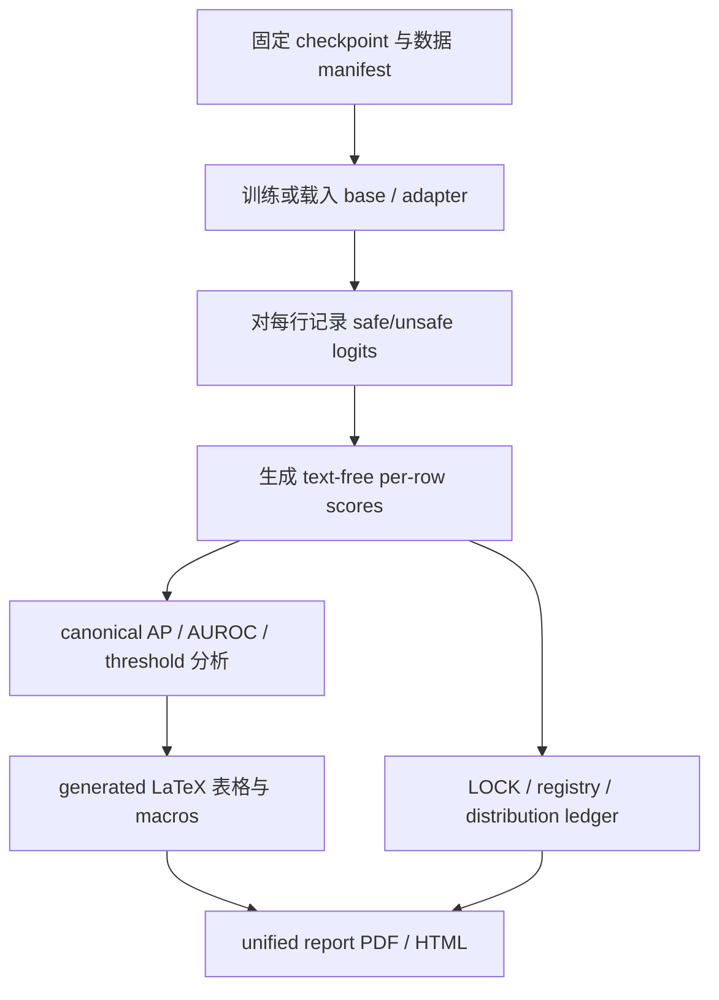

# Safety Benchmark Gains Do Not Guarantee Safety Transfer：小型安全 Guard 微调为什么会“涨分但不迁移”

## 元信息与 TL;DR

- **项目**：Safety-Guard Dynamics
- **标题**：Safety Benchmark Gains Do Not Guarantee Safety Transfer: A Comprehensive Study of Fine-Tuning Small Language Model Safety Guards for High-Compliance and General Safety Domains
- **作者/仓库**：Reza Rahimi，`rrahimi-uci/safety-guard-dynamics`
- **类型**：AI 安全研究仓库与统一报告
- **本轮日期证据**：GitHub commit `e9883b6a8fd0b0e2da564e12992314984b93517f`，author/committer 时间均为 `2026-08-17T00:03:37Z`
- **研究对象**：小型语言模型 safety guard，即在助手行动前判断输入请求 `safe` / `unsafe` 的二分类防线
- **核心问题**：对 guard 做 LoRA-SFT 后，代表性 benchmark 分数变高，是否意味着跨数据源、跨高合规领域、跨安全场景的迁移能力也提高？

### TL;DR

- 这份仓库把“安全 guard 的分数”从一个静态榜单数字，拆成了 **checkpoint、训练目标、benchmark、阈值、领域分布** 共同生产的结果。
- Act I 用同一组四个 instruction checkpoint 做 paired same-checkpoint 设计：Qwen2.5-1.5B、SmolLM2-1.7B、SmolLM3-3B、Qwen3-4B。
- 普通 LoRA-SFT 在 represented-source macro-AP 上平均提升 **+0.3234**，但在 held-out transfer macro-AP 上平均下降 **-0.0589**。
- 阈值层面更尖锐：在同等 pooled transfer false-alarm budget 下，transfer recall 从 **0.517** 掉到 **0.185**，HarmBench recall 从 **0.780** 掉到 **0.171**。
- KL-SFT 不是免费午餐：`beta=0.5` 通常能保住更多 transfer macro-AP，但 represented macro-AP 会下降；仓库明确把 beta 写成 tradeoff dial。
- 领域验证不是只看 jailbreak：ExpGuard 覆盖 finance、health、law 共 **2275** 行，mortgage benchmark 的 public_test 有 **146** 行，并且区分一般安全标签 `G` 与领域政策标签 `D`。
- 关键局限很重要：主报告中的多项结论是 retrospective estimation，不是盲法 prospective 证据；starting-type adaptation 的 registry 还标记了 contract drift。
- 对研究者最有价值的不是某个 guard 谁赢，而是它给了一个可审计范式：同一模型微调前后配对、text-free row score、生成表格可重算、失败判据也保留。

## 研究问题：为什么“安全 benchmark 涨分”不是结论本身？

### 作者实际反对什么？

- 作者反对的不是微调 safety guard。
- 作者反对的是把下面这个推理链当成默认成立：

```text
某个 safety benchmark 分数上升
=> guard 更安全
=> 部署到未见数据源和高合规领域也更安全
```

- 这个链条的问题在于，guard 的输出不是单独由模型能力决定。
- 它至少同时依赖：

| 因素 | 对分数的影响 | 为什么会误导 |
|---|---:|---|
| 训练目标 | 改变 margin 与排序 | 可能只强化已见来源的标签边界 |
| benchmark 来源 | 决定正负样本形态 | 来源相似时容易高估泛化 |
| 阈值规则 | 决定报警率 | recall 可用更多误报买出来 |
| 领域标签 | 决定什么叫 unsafe | 礼貌文本也可能违反金融/医疗/法律政策 |
| 计分实现 | 决定 tie 处理 | tied scores 若被顺序打散会产生假差异 |

### 这篇工作重新定义的问题

- 它不问“哪个模型榜单分最高”。
- 它问一个更可检验的问题：

> 对同一个 checkpoint，fine-tune 前后的变化是什么？这种变化在训练来源代表的数据上成立后，是否还能迁移到 held-out 数据源和高合规领域？

- 这也是仓库名 `safety-guard-dynamics` 的含义。
- 它关注的是 guard 在训练、组合、阈值和领域迁移中的 **动态变化**，而不是一次性的排行榜。

## 论证路线：三幕结构加两个控制

### 三个 Act 各自承担什么功能？

| 部分 | 研究动作 | 试图回答的问题 |
|---|---|---|
| Act I Specialize | 对四个 instruction checkpoint 做 LoRA-SFT | SFT 让同一模型在哪些来源上更好，在哪些迁移集上变差 |
| Act II Compose | 做 base 与 adapter 的 output-space average | 不重新训练时，能否用组合恢复 transfer |
| Act III Domains | mortgage + ExpGuard 高合规领域评测 | 通用安全 guard 能否看见领域政策违规 |

- 这个结构的好处是避免把一个 benchmark 结果过度解释。
- Act I 看微调效应。
- Act II 看能否不用重新训练而恢复迁移。
- Act III 把“unsafe”从越狱/有害请求扩展到金融、医疗、法律、抵押贷款这类合规语境。

### 两个控制为什么关键？

- **recipe control**：base-anchored KL-SFT。
  - 它问的是：迁移损失到底来自 fine-tuning 本身，还是来自无正则的 SFT recipe？
  - 结论不是“KL 一定更好”，而是 KL 能保留一部分 transfer，但牺牲 represented gain。
- **starting-type adaptation**：已经是 purpose-built guard 的模型是否也会进一步 specialized？
  - 仓库 registry 显示这是 analysis-preregistered，但存在 contract drift。
  - 因此它能提供谨慎的报告性证据，但不能被包装成完美冻结的盲法确认。

## 方法机制：paired same-checkpoint 设计

### 为什么必须 same-checkpoint paired？

- 如果比较 A 模型的 base 和 B 模型的 fine-tuned guard，无法区分：
  - 模型架构差异；
  - tokenizer 差异；
  - 预训练语料差异；
  - 微调 recipe 差异；
  - benchmark 偏好差异。
- 作者固定四个 checkpoint，并对每个 checkpoint 比较 base 与自己的 SFT adapter。
- 这样 delta 更接近“同一模型经过该 recipe 后发生了什么”。

### 基本评分对象是什么？

- guard 对输入请求 `x` 输出两个 verdict token 的 logit。
- 仓库使用 raw decision margin：

```text
s_theta(x) = z_theta(unsafe | x) - z_theta(safe | x)
```

- 变量解释：
  - `z_theta(unsafe | x)`：模型在 unsafe verdict token 上的 logit；
  - `z_theta(safe | x)`：模型在 safe verdict token 上的 logit；
  - `s_theta(x)` 越大，请求越偏 unsafe；
  - ranking metric 用这个 margin 排序，而不是只看生成文本。

### 为什么 AP 要 tie-aware？

- 仓库把 `average_precision` 收口到 `sklearn.metrics.average_precision_score`。
- 注释明确指出，顺序相关的自写 AP loop 会在 tied rows 被重新排列时改变结果。
- 这不是实现洁癖，而是安全评测里的实质风险：

| 计分细节 | 错误做法 | 可能造成的假象 |
|---|---|---|
| tied scores | 用行顺序打破 tie | 同一分数表换顺序就换名次 |
| one-class split | 强行算 AP/AUROC | 把未定义指标写成数字 |
| threshold selection | 在不同误报率下比 recall | 把误报膨胀误读为安全提升 |

## Act I：微调确实会 specialization，但迁移不自动成立

### 主结果如何读？

| Checkpoint | Rep base | Rep SFT | Delta Rep | Tr base | Tr SFT | Delta Tr |
|---|---:|---:|---:|---:|---:|---:|
| Qwen2.5-1.5B | 0.6334 | 0.9878 | +0.3544 | 0.8187 | 0.7798 | -0.0389 |
| SmolLM2-1.7B | 0.4524 | 0.9806 | +0.5282 | 0.7904 | 0.8304 | +0.0400 |
| SmolLM3-3B | 0.6621 | 0.9751 | +0.3130 | 0.9102 | 0.8234 | -0.0869 |
| Qwen3-4B | 0.8855 | 0.9837 | +0.0981 | 0.9438 | 0.7939 | -0.1499 |
| Fixed-panel aggregate | -- | -- | **+0.3234** | -- | -- | **-0.0589** |

- 这张表支撑的 claim 很清楚：
  - SFT 在 represented-source 上几乎把四个模型都推到很高 AP；
  - transfer 方向却不是一致收益；
  - panel aggregate 在 transfer 上是负的。
- 注意 SmolLM2-1.7B 是反例：它 transfer 也上升。
- 因此作者的结论不是“微调必然伤害迁移”，而是“benchmark gain 不足以推出 transfer gain”。

### 为什么 Qwen3-4B 尤其值得看？

- Qwen3-4B base 的 transfer macro-AP 是 **0.9438**。
- SFT 后 transfer macro-AP 到 **0.7939**，下降 **-0.1499**。
- 同时 represented macro-AP 从 **0.8855** 到 **0.9837**。
- 这说明较强 base guard 的原始迁移排序能力，可能被一个强调已见来源标签边界的 recipe 拉窄。

## 阈值证据：recall 不能脱离 false-alarm budget

### 为什么同等误报预算更有说服力？

- 如果一个 guard 只是更爱报警，它的 recall 很容易变高。
- 但部署者实际关心的是：
  - 在同样能承受的误报率下；
  - 哪个 guard 能抓住更多真正 unsafe 请求。
- 仓库用 pooled transfer false-alarm budget 做再阈值化。

| 指标 | Base | SFT own threshold | SFT matched budget |
|---|---:|---:|---:|
| Panel mean transfer recall | 0.517 | 0.581 | **0.185** |
| Panel mean HarmBench recall | 0.780 | 0.600 | **0.171** |
| Pooled transfer FPR 背景 | 4.3% | 17.0% | 不高于 base budget |

- 这个结果非常尖锐：
  - 用 SFT 自己的阈值看，transfer recall 似乎从 0.517 到 0.581；
  - 但那伴随更高误报；
  - 把误报预算压回 base 水平后，SFT recall 下降到 0.185。

### 这不是部署阈值

- 作者也明确提醒：matched-FPR 是 retrospective ROC point。
- 它使用同一批带标签 negatives 来读阈值。
- 生产系统没有这些实时标签，因此不能把它直接当部署阈值。
- 它的价值是揭示：
  - “分数更高”可能来自 ranking 改变；
  - “recall 更高”可能来自 threshold policy；
  - 两者都不能自动等于更好的 safety guard。

## KL-SFT 控制：保迁移，但不是免费

### KL 目标在这里的直觉

- 普通 SFT 只要求模型更贴合安全标签。
- base-anchored KL-SFT 额外惩罚微调后分布偏离 base。
- 直觉公式可以写成：

```text
L = L_SFT + beta * KL(pi_theta(. | x) || pi_base(. | x))
```

- 变量解释：
  - `L_SFT`：安全 verdict 的监督损失；
  - `pi_theta`：微调后模型分布；
  - `pi_base`：同一 checkpoint 的 base 分布；
  - `beta`：保持原模型行为的约束强度。

### 表格说明了什么？

| Checkpoint | Base transfer | SFT transfer | KL .5 transfer | SFT represented | KL .5 represented |
|---|---:|---:|---:|---:|---:|
| Qwen2.5-1.5B | 0.819 | 0.794 | 0.850 | 0.987 | 0.979 |
| SmolLM2-1.7B | 0.790 | 0.839 | 0.859 | 0.980 | 0.928 |
| SmolLM3-3B | 0.910 | 0.814 | 0.903 | 0.980 | 0.924 |
| Qwen3-4B | 0.944 | 0.823 | 0.904 | 0.987 | 0.965 |

- KL `.5` 在多个 checkpoint 上把 transfer 拉回去。
- 但 represented AP 往往低于普通 SFT。
- 这正好支持作者对 beta 的定位：它是 tradeoff dial，不是默认安全开关。

### 为什么这对后训练研究也重要？

- 对安全 guard 的微调，本质上也是一种小模型后训练。
- 如果只报告目标 benchmark 上的 AP，研究者会错过：
  - base ranking 能力是否被破坏；
  - threshold 迁移是否改变；
  - low-FPR 区间是否变差；
  - 是否只在 seen-source label grammar 上过拟合。
- 这类问题同样会出现在 SFT、DPO、GRPO 等对齐方法上。

## 领域验证：高合规领域不是一般 jailbreak 的同义词

### ExpGuard 的作用

- ExpGuard 是外部验证，覆盖 finance、health、law 三个领域。
- 表格说明它有 **2275** 行 expert-annotated 输入。
- 作者用与 Act I byte-parity 的 raw margin `z_unsafe - z_safe` 做 ranking。

| Guard | AP all | AUROC | Finance AP | Health AP | Law AP |
|---|---:|---:|---:|---:|---:|
| Qwen2.5-1.5B | 0.921 | 0.895 | 0.938 | 0.906 | 0.918 |
| SmolLM2-1.7B | 0.883 | 0.840 | 0.887 | 0.892 | 0.868 |
| SmolLM3-3B | 0.956 | 0.935 | 0.958 | 0.955 | 0.958 |
| Qwen3-4B | 0.951 | 0.927 | 0.957 | 0.938 | 0.957 |

- 这个结果说明通用 base guard 在部分高合规领域上有很强排序能力。
- 但它也没有把任务简化成单一 winner：
  - top two marginal CI 有重叠；
  - paired comparison 在 health 上 SmolLM3-3B 相对 Qwen3-4B 的差异为 `+0.0168`，CI 排除零；
  - finance 和 law 则基本并列。

### Mortgage benchmark 的作用

- Mortgage benchmark 的 public_test 有 **146** 行。
- 它区分：
  - `G`：一般安全违规；
  - `D`：抵押贷款政策违规；
  - protected-pair gap：受保护属性上下文变化时输出是否稳定。
- 表格特别指出：`G1/D0` cell 为空，因此 `G` 嵌套在 `D` 内。
- 这限制了结论范围：
  - 可以用来研究 measurement；
  - 不能直接声称某 guard 产生公平贷款结论；
  - `n=3` protected pairs 只能读方向，不能读成校准公平性估计。

## 代码与证据结构：它为什么比普通 benchmark repo 更可审计？

### 目录边界很清晰

| 目录 | 功能 | 审计意义 |
|---|---|---|
| `guard_research/` | canonical metrics、thresholds、prompts、provenance | 把关键计分逻辑集中 |
| `experiments/` | Act I、composition、KL-SFT、ExpGuard、adaptation 分析脚本 | 让表格来源可追踪 |
| `artifacts/` | locks、manifests、text-free per-row scores | 避免直接重发布受限文本 |
| `studies/registry.yaml` | normative study state | 不让 README 单方面改 claim 状态 |
| `benchmarks/registry/` | redistribution decision ledger | 区分可公开文本与 local-only 数据 |
| `papers/unified-report/generated/` | 自动生成的 LaTeX 表格和 macros | 降低手抄数字漂移 |

### 证据链可以画成这样



- 这条链路的核心不是“有很多文件”。
- 核心是每个 claim-bearing 数字都应能追到：
  - 哪个 score artifact；
  - 哪个 manifest；
  - 哪个 metric 实现；
  - 哪个 registry 状态；
  - 哪个 verification command。

### 失败和漂移没有被藏起来

- `studies/registry.yaml` 把 `claim_authorization`、`evidence_state`、`expected_verification_status`、`verification_failure_reason` 分开写。
- `starting_type_adaptation_v1` 甚至写明：
  - 没有 final LOCK；
  - normative contract 是 `dev_nonfinal`；
  - authoring-config hash 已不匹配；
  - claim 可以报告，但 drift 必须先解决才能产生新 claim。
- 这种写法对 AI 安全研究尤其重要。
- 它防止“跑出来的结果”在迁移、重命名、重新验证后被误当成更高等级证据。

## Figure / Table 证据逐项解读

### Table：Act I primary

- 支持的结论：
  - represented gain 很强；
  - transfer effect 平均为负；
  - 每个 checkpoint 的方向不完全相同。
- 不能支持的结论：
  - 不能说所有 SFT 都伤害 transfer；
  - 不能说所有 safety guard 都不该微调；
  - 不能推出封闭域部署一定失败。

### Table：matched FPR

- 支持的结论：
  - 自有阈值下 recall 不能与 base 直接比较；
  - 同等误报预算暴露了 SFT 的 recall 坍缩。
- 不能支持的结论：
  - 不能把 retrospective matched threshold 当生产阈值；
  - 不能据此直接得到某个业务系统的告警率。

### Table：KL-SFT

- 支持的结论：
  - base-anchored regularization 可以缓和迁移损失；
  - 它带来 represented AP 成本。
- 不能支持的结论：
  - 不能把 KL-SFT 当无代价默认 recipe；
  - 不能从四模型面板推出所有模型规模的规律。

### Table：ExpGuard 与 Mortgage

- 支持的结论：
  - 高合规领域提供了和通用 jailbreak 不同的测量压力；
  - 某些 base guard 在 finance/health/law 上排序能力很强。
- 不能支持的结论：
  - Mortgage 的 protected-pair 样本太少，不能变成公平性认证；
  - gated/local-only 数据限制了复现实验的开放程度。

## 相关工作位置：它和一般 guard 论文差在哪里？

### 它不是又一个 guard 模型发布

- 仓库关注的是测量与证据边界。
- 它并没有把一个新 guard 放上榜单后宣称解决安全问题。
- 它把已有 checkpoint、SFT adapter、KL-SFT、composition 和领域 benchmark 放在同一个审计框架里。

### 它和 DPO / GRPO guard 研究的关系

- 文档中的 Paper C preregistration 明确提到 GuardReasoner、AIMS、DT-Guard 等相关方向。
- 作者把 DPO 在二分类 one-token guard 设置中重写为 reference-centered margin loss：

```text
y(x)       = +1 for unsafe, -1 for safe
m_theta(x) = y(x) * s_theta(x)
PairCE     = softplus(-beta * m_theta)
DPO        = softplus(-beta * (m_theta - m_ref))
```

- 这里的关键不是“DPO 这个名字”。
- 关键是把：
  - pairwise normalization；
  - frozen-reference centering；
  - uncertainty-based example selection；
  - update magnitude；
  - transfer metric；
  分离成可测试因素。

### 对 Agent 安全的含义

- Agent 系统常把 guard 放在工具调用、文件写入、网络访问或外部动作之前。
- 如果 guard 在 benchmark 上变强但迁移和 low-FPR recall 变差，风险会在 agent 场景被放大。
- 因为 agent 的错误不是只生成一句坏话，而可能是：
  - 泄露数据；
  - 调错工具；
  - 发送不可撤回请求；
  - 改写数据库；
  - 在多步轨迹中累积错误。

## 局限与证据边界

### 日期边界

- 本轮采集采用 GitHub `pushed_at` 和 commit 时间作为 UTC 2026-08-17 窗口证据。
- `CITATION.cff` 的 release date 是 `2026-08-01`。
- 因此本文把它写作 **8 月 17 日更新并强化证据的研究仓库**，不是 8 月 17 日新 arXiv 论文。

### 研究边界

- Act I 是 retrospective fixed-panel estimation。
- ExpGuard 是 expert-annotated 外部验证，但 gated dataset 不能完整公开文本。
- Mortgage benchmark 的 label 是 LLM-judge 与 policy-card-consistent，不是 SME-adjudicated。
- Starting-type adaptation 虽有 preregistered analysis，但 registry 明确记录 contract drift。
- 这些边界不削弱仓库价值，反而说明作者没有把开发态证据包装成已冻结证明。

### 可复现边界

- 标准环境中 unified report 的生成输入有 **28/32** 可 byte-check。
- 剩余 **4** 个 Act I 表格/macros 需要 lock-pinned analysis environment。
- 这意味着普通读者可以复算大量二级分析，但完整 release verification 仍依赖指定 Python 3.12 与锁定环境。

## 研究者视角：下一步该追问什么？

### 问题一：guard 的目标函数应该如何暴露迁移风险？

- 只看 represented AP 不够。
- 最少应同时报告：
  - represented macro-AP；
  - held-out transfer macro-AP；
  - low-FPR recall；
  - OR-Bench benign FPR；
  - HarmBench recall；
  - domain-specific policy AP；
  - threshold rule。

### 问题二：安全 guard 是否需要“训练目标 + 运行时契约”共同设计？

- 如果训练能改变 ranking，但部署风险由阈值和动作上下文决定，那么只训练模型是不完整的。
- 更合理的设计是：
  - 训练侧提供保守的 ranking；
  - 运行时提供可审计阈值、升级、拒绝和证据链；
  - 领域策略提供可解释标签；
  - 监控侧追踪误报和漏报。

### 问题三：high-compliance benchmark 需要什么样的公开协议？

- Mortgage benchmark 的优势是把领域政策违规从一般 unsafe 中分离出来。
- 它的限制也很明显：
  - 领域专家标注成本高；
  - 许可决定复杂；
  - protected-pair 样本很少；
  - text-free scores 牺牲了部分可读性。
- 未来更强的 benchmark 需要在隐私、版权、可复核性之间做更精细的协议设计。

### 问题四：Agent 场景应该怎样使用这类 guard？

- 不应把 guard 当成一个能独立保证安全的模型。
- 更适合把它放进分层控制：

| 层级 | 作用 | 与本文证据的关系 |
|---|---|---|
| Model guard | 输入/动作前的 unsafe ranking | 需要报告迁移与阈值 |
| Policy engine | 领域规则与权限约束 | 需要 domain label |
| Runtime monitor | 多步轨迹审计 | 需要 evidence chain |
| Escalation gate | 不确定时升级人工 | 需要 low-FPR/precision 曲线 |
| Audit log | 事后复查与改进 | 需要 row score 与 provenance |

## 算法流程：如果复现实验，最小闭环是什么？

### Act I 的可执行骨架

- 这份仓库的复现逻辑可以抽象成一个闭环。
- 它不是先挑最好模型，而是先锁住模型、数据、prompt、score schema，再比较 base 与 adapter。

```text
Input:
  checkpoint panel C = {qwen25_15b, smollm2_17b, smollm3_3b, qwen3_4b}
  seeds S = {42, 43, 44, 45, 46}
  locked manifests M = {calibration, id_test, transfer_test, OR-Bench, HarmBench}
  scoring rule r(x) = z_unsafe(x) - z_safe(x)

State:
  release lock L
  text-free score table T
  canonical metric module G

Loop:
  for each checkpoint c in C:
    score base(c) on every row in M
    for each seed s in S:
      train LoRA-SFT adapter a(c, s)
      score adapter a(c, s) on every row in M
      store row identity, content hash, logits, margin, threshold metadata

Analysis:
  join scores back to locked manifests
  compute tie-aware AP per benchmark
  macro-average represented and transfer groups
  bootstrap paired deltas within checkpoint and seed
  rerun threshold analysis at matched false-alarm budgets

Output:
  generated tables/macros
  registry state
  audit-visible evidence boundaries

Failure boundary:
  if row identities, source hashes, tokenizer revisions, prompt hashes, or software lock mismatch:
    stop and mark the run invalid; do not silently replace cells
```

- 这个流程的研究价值在于，它把“训练”和“证明”拆开。
- 训练可以复杂，但证明必须回到固定的行、固定的分数、固定的计分器。

### 为什么 row-level identity 是安全评测的底座？

- 安全 benchmark 经常有两个难点：
  - prompt 文本可能受许可限制；
  - 安全标签和来源容易被重新切分。
- 作者使用 text-free per-row scores，并保留 `sample_id`、`content_sha256`、`source`、`split`、`gold`、`family_id` 等身份字段。
- 这让复核者即使不能看到所有受限文本，也能检查：
  - 同一批行是否参与了比较；
  - base 与 SFT 是否在同一行上配对；
  - bootstrap 是否按 family_id 保留相关性；
  - generated table 是否来自同一 score table。

## 失败案例：这篇工作真正暴露了哪些误读？

### 误读一：represented AP 高就代表 guard 更稳

- represented AP 的确可以接近 0.98。
- 但如果迁移 AP 同时下降，说明模型可能学到了训练来源的标签语法。
- 这种 specialization 在封闭场景可能有用，在开放 agent 场景却危险。
- 因为 agent 输入来自用户、网页、文件、工具返回和多轮上下文，分布漂移是默认情况。

### 误读二：recall 上升就是安全提升

- SFT own threshold 下的 transfer recall 可能看起来更高。
- 但它伴随 pooled transfer FPR 从 base 的约 4.3% 膨胀到约 17.0%。
- 在实际系统中，过高误报会导致：
  - 用户请求被过度拦截；
  - 人工审核队列爆炸；
  - 开发者调低阈值；
  - 最终反而形成更大的漏报窗口。
- 因此 recall 必须和 false-alarm budget 一起读。

### 误读三：purpose-built guard 天然不会被继续微调拉偏

- starting-type adaptation 的表格显示，多数 purpose-built guard 也出现 represented 上升、transfer 下降的方向。
- 例如 Granite-Guard-2B 的 SFT delta 是 represented `+0.139`、transfer `-0.134`。
- Qwen3Guard-0.6B 是 represented `+0.082`、transfer `-0.116`。
- 但这组研究存在 contract drift，因此最稳妥的说法是：
  - 它提供了警示性证据；
  - 不能把它当作完全冻结协议下的确认性证明。

## 部署边界：如何把这个研究放进真实安全系统？

### 不要把 guard 当成最后裁判

- 一个小型 guard 更适合做排序器或初筛器。
- 它可以说“这个请求看起来更像 unsafe”。
- 它不应独自决定所有高风险动作。
- 尤其在高合规领域，最终决策还需要：
  - 领域政策；
  - 法规解释；
  - 操作上下文；
  - 用户授权；
  - 审计证据。

### 更合理的决策函数

```text
decision(x, action, context) =
  if policy_forbids(action, context):
      block
  else if guard_score(x) >= tau_block:
      block_or_escalate
  else if guard_score(x) >= tau_review:
      ask_for_confirmation_or_human_review
  else:
      allow_with_logging
```

- `tau_block` 和 `tau_review` 不应只从 represented benchmark 读出。
- 它们至少需要：
  - transfer negative set；
  - domain-specific false positive set；
  - high-severity positive set；
  - production shadow traffic；
  - 定期漂移审计。

### Agent 工具调用的特殊风险

- 对普通聊天模型，误判可能只是一次拒答或一次有害回答。
- 对 agent，误判会进入工具层。
- 因此同一个 guard 分数应被动作类型重新加权：

| 动作类型 | 风险形态 | guard 之外还需要什么 |
|---|---|---|
| 读文件 | 隐私和越权读取 | capability label、path allowlist |
| 写文件 | 数据破坏 | diff preview、rollback |
| 发邮件/消息 | 不可撤回外发 | recipient verification、human approval |
| 调 MCP 工具 | 间接提示注入 | tool schema trust label、egress control |
| 执行代码 | 沙箱逃逸和副作用 | sandbox、network policy、artifact gate |

- 这也是本文和 runtime safety contract 方向相互呼应的地方：
  - 模型 guard 给风险排序；
  - runtime contract 限制能做什么；
  - evidence chain 证明做过什么。

## 可复现性：哪些验证最值得优先跑？

### 轻量验证

- `make check-registry`
  - 检查研究 registry 与生成索引是否一致。
- `make check-links`
  - 检查 Markdown 相对链接是否仍能解析。
- `make check-fast`
  - 跑 hermetic tier 与快速测试。

### 报告验证

- `make -C papers/unified-report regenerate`
  - 从 committed per-row scores 重写生成表格和 figures。
- `make -C papers/unified-report verify`
  - 在 scratch 中重算并做 byte identity check。

### 重训练验证

- 从零训练需要 GPU、网络和 gated data access。
- 仓库明确要求不要覆盖 released namespace。
- 这点很重要：
  - 复现实验应写入新的 artifact root；
  - 不应改写已经发布的 release evidence；
  - 否则就会把新运行和旧结论混在一起。

## 对中文读者的实践提醒

### 读安全论文时，先问四个问题

1. **分数在哪个来源上涨了？**
   - seen-source、held-out-source、sealed cohort 是三种不同证据。
2. **阈值怎么选？**
   - calibration threshold、own threshold、matched-FPR threshold 不能混读。
3. **标签是什么？**
   - harmful request、policy violation、domain compliance、protected-pair invariance 不是同一个标签。
4. **证据状态是什么？**
   - retrospective、preregistered、claim-authorized、contract-drifted 要分开。

### 做自己的 guard 实验时，最低报告清单

- 固定模型 revision 和 tokenizer revision。
- 公布训练样本选择规则。
- 报告 base 与 fine-tuned 的 paired delta。
- 同时报告 represented 与 transfer。
- 报告低误报预算下的 recall。
- 报告 benign false positive。
- 写清 metric 实现和 tie 处理。
- 把失败 run、缺失 cell、dirty checkout 写出来。
- 不把开发集结果改名为 sealed 结果。

## 和常见安全评测写法的差异

### 差异一：它把“模型能力”降级为一个可分解变量

- 很多安全评测会把 guard 的分数写成模型能力本身。
- 这份仓库更接近实验科学写法：
  - 模型只是一个 starting checkpoint；
  - 微调 recipe 是处理变量；
  - benchmark 来源是观测环境；
  - 阈值规则是决策制度；
  - registry 是证据授权层。
- 这样写会让结论更啰嗦，但也更难被误用。
- 例如“Qwen3-4B SFT 后 represented AP 很高”只是局部事实。
- 更完整的事实是：
  - 它的 represented AP 从 0.8855 到 0.9837；
  - transfer AP 从 0.9438 到 0.7939；
  - matched-FPR transfer recall 只有 0.172；
  - HarmBench matched recall 只有 0.114。

### 差异二：它不把失败状态从叙事里删掉

- AI 安全研究很容易出现一种叙事偏差：
  - 成功的表格进入论文；
  - 失败的 lock、漂移的配置、无效的 pilot 只留在 commit 历史里。
- 这个仓库反而把失败状态前置。
- Paper C predecessor 被标成 stopped。
- Paper C matched-DPO scaffold 被标成 never executed。
- Starting-type adaptation 被标成 contract drift。
- 这些状态让读者知道：
  - 哪些结果可以引用；
  - 哪些只能作为研究设计参考；
  - 哪些需要重新锁定后才能产生新 claim。

### 差异三：它对“公开数据”保持克制

- 安全 benchmark 常有敏感文本、受限许可或攻击提示。
- 直接公开全部文本能提高可读性，但也可能违反许可或扩散风险。
- 这份仓库用 distribution ledger 区分：
  - 可发布文本；
  - text-free score；
  - local-only 数据；
  - gated dataset。
- 这种克制使复现更麻烦，却更符合安全研究的现实约束。

## 可证伪预测：后续研究应该如何挑战它？

### 预测一：更强 sealed cohort 会削弱还是放大 specialization？

- 如果未来使用真正封闭、训练前未见、来源独立的 sealed cohort，可能出现两种结果：
  - specialization 更明显，说明现有 transfer 仍偏乐观；
  - specialization 变弱，说明当前 held-out set 与训练来源差异过大。
- 两种结果都能推进研究。
- 关键是 sealed cohort 不能在结果出来后再被定义。

### 预测二：多目标训练能否同时保住 represented 与 transfer？

- KL-SFT 证明正则能保住一些 transfer，但要付出 represented 成本。
- 下一步可以测试：
  - KL + hard negative mining；
  - DPO reference centering；
  - uncertainty selection；
  - domain-balanced sampling；
  - threshold-aware objective。
- 但每个方法都必须在同一 false-alarm budget 和同一 transfer set 下比较。
- 否则“更安全”仍可能只是更爱报警。

### 预测三：Agent 轨迹级标签会不会改变 guard 排名？

- 当前 guard 主要读单条输入请求。
- Agent 风险经常出现在轨迹中：
  - 第一步读取网页；
  - 第二步吸收间接提示；
  - 第三步调用工具；
  - 第四步外发数据。
- 如果 benchmark 从单输入标签变成轨迹标签，guard 排名可能改变。
- 这会逼迫研究者把 input guard、tool policy、trajectory monitor 放在同一个实验设计里。

## 结论

- 这份仓库最值得带走的一句话是：**安全 benchmark gain 不保证 safety transfer**。
- 它用 paired same-checkpoint 设计展示了一个常见陷阱：
  - SFT 可以把 represented-source 分数推得很高；
  - 但 transfer、HarmBench、同等误报预算、领域政策评测会给出不同答案。
- 对 AI 安全研究来说，它的贡献不是一个最终 guard，而是一套可审计的测量纪律。
- 对后训练研究来说，它提醒我们：目标函数、正则、样本选择和阈值规则必须一起报告。
- 对 Agent 安全来说，它进一步说明：guard 只是防线的一层，真正的安全性必须落在模型、策略、运行时和证据链的组合上。
