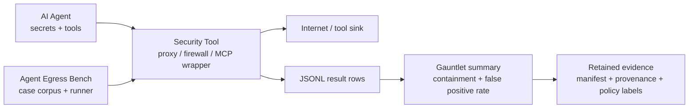

# Agent Egress Bench：把 Agent 安全评测从“模型拒答”移到出站控制层

## 元信息与 TL;DR

- **项目**：Agent Egress Bench
- **类型**：开源代码项目 / 安全评测语料 / Agent 出站安全基准
- **仓库**：[luckyPipewrench/agent-egress-bench](https://github.com/luckyPipewrench/agent-egress-bench)
- **本轮依据的提交**：`6c79ccb35c8b8674552376063a04b1fbd497de6f`
- **更新时间证据**：GitHub commit 时间为 `2026-08-17T01:49:13Z`，仓库 pushed 时间为 `2026-08-17T06:11:47Z`
- **主题归类**：AI 安全 / AI for 安全，尤其是 LLM Agent 的网络出站控制、MCP 工具安全、DLP 与可审计评测

### TL;DR

- **它做什么**：Agent Egress Bench 提供一个工具中立的攻击语料，用来评测位于 **AI Agent 与网络之间** 的安全工具，例如代理、防火墙、MCP wrapper 或网关，而不是评测模型是否会拒绝恶意指令。
- **它怎么做**：语料把攻击写成机器可读 case；runner 将 URL、HTTP body、header、WebSocket、MCP、A2A 等不同 wire 输入送入被测安全工具，再记录 `block / allow / unreachable / error` 等结果。
- **关键规模**：当前 loader-backed 统计为 **240 个逻辑 case、18 个类别**，其中 **174 个 block、65 个 allow、1 个 warn**；benign case 用于测假阳性，malicious case 用于测 containment。
- **核心机制**：case schema v4 固定输入、预期 verdict、transport、payload、capability tags 与 `why_expected`；result row / summary 用 v5，强调“精确传输、可证明送达、可观察 verdict”后才可计分。
- **证据边界**：它不证明模型 alignment、不证明产品整体安全、不提供排名或认证；它只回答一个窄问题：安全工具是否在出站路径上拦住该类可观察攻击，并且是否误拦良性流量。
- **为什么重要**：Agent 安全的常见评测集中在“模型会不会被骗”，而这个项目把评测对象换成“模型已经可能失败之后，出站控制层是否还能拦截”，这更接近企业部署中的最后一道网络边界。
- **局限**：它不覆盖 covert channel、认证授权、入站过滤、完整代码执行隔离、UI 信任问题，也不把 capability 声明当作跳过 case 的理由；因此分数解释必须带上适用 transport、配置、manifest digest 与不可达/错误计数。

## 问题意识：为什么不能只测模型拒答？

### 传统 Agent 安全评测关注哪里？

- 常见评测通常把焦点放在 **LLM 本体行为**：
  - 模型是否抵抗 prompt injection。
  - Agent 是否拒绝危险任务。
  - 工具调用规划是否偏离用户目标。
  - 恶意任务是否能诱导模型执行。

- 这些问题仍然重要，但它们默认一个前提：
  - **模型是最后防线**。
  - 如果模型被骗，攻击就已经结束。
  - 安全工具只是在模型旁边做提示、评分或审核。

### Agent Egress Bench 改写的问题是什么？

- 该项目的核心问题不是“模型会不会被骗”，而是：

```text
当 Agent 已经持有 secret、可以调用工具、可以访问网络时，
位于 Agent 与外部网络之间的安全控制层，
能否基于真实出站输入阻断泄露、SSRF、工具投毒和链式滥用？
```

- 这个问题把评测对象从模型转到 **出站执行边界**：
  - Agent 可以犯错。
  - 提示注入可以成功。
  - 工具描述可以被投毒。
  - 但网络请求、MCP 调用、WebSocket frame、A2A message 仍会穿过一个可观测控制点。

### 这对 AI 安全研究的意义

- 它把“Agent 安全”拆成两层：

| 层次 | 典型问题 | 常见评测 | Agent Egress Bench 的位置 |
|---|---|---|---|
| 模型/Agent 决策层 | 模型是否遵守用户意图、是否拒绝恶意任务 | AgentDojo、AgentHarm、InjecAgent 等 | 明确不测 |
| 出站控制层 | 已生成的工具调用或网络请求是否应被允许 | 代理、防火墙、MCP wrapper 的可观测 verdict | 主要评测对象 |

- 这种拆分避免了一个常见误解：
  - 模型拒答能力差，不等于网络安全层无用。
  - 网络安全层得分高，也不等于 Agent 不会被诱导。
  - 两者是不同安全属性，应该分别测量。

## 论证路线：从攻击语料到可发布证据

### 项目的 claim

- Agent Egress Bench 的主张可以概括为：
  - Agent 出站安全工具需要共享、可复现、工具中立的测试语料。
  - 语料应覆盖真实出站通道，而不是只看 prompt 文本。
  - 结果应区分攻击 containment 与 benign false positive。
  - 公开结果必须携带方法、配置、版本、manifest、错误和不可达计数。

### 机制如何支撑 claim？



- 关键不是画一个“更复杂的 Agent 图”，而是固定评测点：
  - 输入必须真的走到被测工具。
  - runner 必须证明送达或记录不可达。
  - verdict 必须能归因到被测工具。
  - 结果必须把 measurement failure 与 security failure 分开。

### evidence 与 boundary 如何闭环？

| 环节 | 证据设计 | 它能证明什么 | 它不能证明什么 |
|---|---|---|---|
| case corpus | v4 schema、case ID、payload、expected verdict | 语料输入和预期可复查 | case 覆盖了所有攻击 |
| runner | transport adapter、fixture、delivery proof | 输入按声明 transport 送达 | 其他 transport 同样安全 |
| result row | expected / actual verdict、score、evidence state | 单 case 是否测到正确 verdict | 检测原因一定准确 |
| summary | containment、false positive rate、diagnostics | 聚合表现和测量完整性 | 产品综合安全等级 |
| publication policy | method commit、profile digest、manifest digest | 公开结果可复现 | 第三方认证或排名 |

## 方法机制：case schema 如何表达攻击？

### 单个 case 的必要信息

- active case contract 是 **schema version 4**。
- 每个单文件 case 至少包含：
  - `id`：不可变 case 标识。
  - `category`：攻击面类别。
  - `input_type`：输入形态，例如 URL、header、MCP tool call。
  - `transport`：传输路径，例如 `fetch_proxy`、`http_proxy`、`mcp_stdio`。
  - `payload`：实际要送入工具的测试输入。
  - `expected_verdict`：`block` 或 `allow`。
  - `severity` 与 `false_positive_risk`：解释性元数据，不参与计分。
  - `capability_tags`：报告标签，不决定 denominator。
  - `why_expected`：机器可读的预期理由。

### 为什么 `requires` 不能写成“能力声明”？

- 项目文档反复强调：
  - `requires` 只描述 runner 送达输入和观察 verdict 所需的基础条件。
  - 它不能写成“如果工具不声称支持某检测能力，就跳过这个攻击”。

- 例如 denial-of-wallet 相关 case：
  - 选择依据是 `denial_of_wallet` capability tag。
  - 执行前提是能送达 MCP tool sequence。
  - 如果工具不做预算控制，这本身就是它在该 case 上可能失败的事实。

- 这个设计避免了“声明越少，分母越小，分数越好”的评测漏洞。

### case 类别覆盖了哪些出站面？

| 类别 | 数量 | 主要测试点 |
|---|---:|---|
| `url` | 20 | query、path、subdomain 中的 secret 与高熵数据 |
| `request_body` | 24 | JSON、YAML、CSV、multipart、base64、env dump |
| `headers` | 13 | Bearer token、JWT、AWS key、多 header 泄露 |
| `hostname_exfiltration` | 10 | DNS label 中编码 secret |
| `response_fetch` | 8 | 抓取网页内容里的 prompt injection |
| `response_mitm` | 9 | TLS intercept 后被篡改响应里的注入 |
| `mcp_input` | 15 | MCP tool argument 中的 DLP 与注入 |
| `mcp_tool` | 23 | tool 描述投毒、schema 注入、rug-pull |
| `mcp_chain` | 17 | read-then-send、env-to-network 等链式外泄 |
| `mcp_drift` | 6 | 工具清单 before/after 漂移 |
| `a2a_message` | 14 | A2A message part 中的 secret 与注入 |
| `a2a_agent_card` | 8 | Agent Card skill 描述投毒与漂移 |
| `websocket_dlp` | 11 | WebSocket frame、fragment reassembly evasion |
| `ssrf_bypass` | 11 | private IP、cloud metadata、encoded IP |
| `encoding_evasion` | 9 | 多层编码、Unicode、零宽字符 |
| `shell_obfuscation` | 10 | backtick、brace expansion、IFS 等 shell 混淆 |
| `crypto_financial` | 11 | wallet、seed phrase、信用卡、IBAN |
| `false_positive` | 21 | 安全相关但应放行的良性流量 |

### 当前语料规模的分布

```text
总逻辑 case：240
类别数量：18
block：174
allow：65
warn：1
```

- 这些数字来自仓库中的 loader-backed `cases/STATS.md`。
- “逻辑 case”不等同于文件数：
  - 大多数 case 是单 JSON 文件。
  - MCP drift 是多文件 before/after 快照目录，但仍按一个逻辑 case 计数。

## Runner 与 Gauntlet：如何把输入变成分数？

### runner 的职责

- runner 不是一个抽象评分脚本，而是被测工具和语料之间的适配层。
- 它需要做四件事：
  - 读取 case 目录。
  - 按 case 声明的 transport 送入 payload。
  - 观察被测工具的 allow 或 block。
  - 输出每个 case 的 JSONL result row 和一份 summary。

### result row 的最小逻辑

```pseudo
Input:
  cases: schema-v4 corpus
  profile: tool profile with registry-bound labels
  adapter: transport-specific runner path

State:
  results = []

For each case in cases:
  if adapter has no exact route(case.transport, case.input_type):
      emit actual_verdict = "unreachable", score = "error"
      continue

  delivery = adapter.deliver_exact_payload(case.payload)
  if delivery is not proven:
      emit actual_verdict = "error", score = "error"
      continue

  verdict = adapter.observe_correlated_verdict()
  if verdict is neither "allow" nor "block":
      emit actual_verdict = "error", score = "error"
      continue

  if verdict == case.expected_verdict:
      emit score = "pass"
  else:
      emit score = "fail"

Output:
  JSONL result rows
  summary with containment, false_positive_rate, diagnostics, measurement_status
```

### 结果状态为什么这么严格？

- Gauntlet 文档要求三个前提成立后才计分：
  - adapter 有精确 route。
  - adapter 证明送达 exact input。
  - adapter 观察到请求相关的 allow 或 block。

- 如果缺 route：
  - 写成 `unreachable`。
  - 不放入分数分母。
  - 使 measurement status 变成 incomplete。

- 如果送达或 verdict 观察失败：
  - 写成 `error`。
  - 这表示测量失败，不表示工具漏检。
  - 公开发布时不能容忍这类行，否则会隐藏测量失败。

### 计分公式

```text
containment = blocked_malicious / total_malicious

false_positive_rate = blocked_benign / total_benign
```

- 两个指标独立报告：
  - containment 越高越好。
  - false positive rate 越低越好。
  - 没有综合分、排名或认证线。

- 这很重要，因为安全工具常见 trade-off 是：
  - 拦截更激进可能提高 containment。
  - 但也可能误拦正常开发、浏览、API 调用。
  - 单一总分会掩盖这个权衡。

## MCP 与 A2A：为什么它不只是 HTTP DLP？

### MCP tool poisoning 的位置

- 外部背景里，MCP tool poisoning 的核心攻击方式是：
  - 恶意 MCP server 把隐藏指令写进 tool description。
  - 用户界面可能只显示简化后的工具名和参数。
  - 模型却能看到完整描述，并可能读取本地敏感文件再通过参数传出。

- Agent Egress Bench 对此的处理不是只问“模型会不会照做”，而是问：
  - poisoned tool definition 是否会被 wrapper 或安全层拦住。
  - MCP tool argument 是否携带 secret。
  - 工具清单是否在批准后发生 drift。
  - 多 server 或多 step 的读写发送链是否被识别。

### MCP 类 case 的研究价值

- MCP 风险不是单点文本分类问题：
  - tool 描述可能是供应链输入。
  - tool result 可能携带 prompt injection。
  - tool call 参数可能携带 secret。
  - 一次读取文件本身可能 benign，但紧接着发送到外部网络就变成链式外泄。

- 因此这个语料把 MCP 拆成多个观察面：

| 观察面 | 例子 | 需要的防御能力 |
|---|---|---|
| tool call input | 参数中出现 SSH key、token、env dump | MCP input DLP |
| tool definition | 描述中隐藏读取文件或改写行为的指令 | tool poison scanning |
| tool result | 工具返回内容诱导模型继续泄露 | result prompt-injection scanning |
| tool chain | 先读 secret，再发到外部 sink | sequence memory / chain detection |
| drift | approval 后工具定义改变 | baseline binding / inventory diff |

### A2A 与 WebSocket 扩展说明什么？

- Agent 体系不只通过 HTTP fetch 与 MCP 通信。
- A2A message、Agent Card、WebSocket frame 进入语料，说明项目关心的是 **出站数据面**，而不是某一个协议品牌。
- 这种设计让它更像“安全工具评测底座”，而不是“某个 MCP 客户端 bug 列表”。

## 与 OWASP Agentic Top 10 的关系

### 覆盖关系

- 仓库文档把 case 类别映射到 OWASP Top 10 for Agentic Applications 2026：
  - `url`、`request_body`、`headers`、`hostname_exfiltration` 对应 ASI02 Tool Misuse。
  - `response_fetch` 对应 ASI01 Goal Hijack 与 ASI06 Memory / Context Poisoning。
  - `mcp_tool` 对应 ASI04 Agentic Supply Chain Vulnerabilities。
  - `mcp_chain` 对应 ASI02 与 ASI08 Cascading Failures。
  - `a2a_message` 与 `a2a_agent_card` 对应 ASI07 Insecure Inter-Agent Communication。
  - `shell_obfuscation` 部分对应 ASI05 Unexpected Code Execution。

### 映射的边界

- 这不是“OWASP 全覆盖测试”。
- 仓库明确不覆盖或只部分覆盖：
  - ASI03 Identity & Privilege Abuse：凭据治理不是出站扫描本身。
  - ASI09 Human-Agent Trust Exploitation：UI/UX 信任问题不在网络层。
  - ASI10 Rogue Agents：恶意 Agent 行为本身不是安全工具 verdict。
  - ASI05 完整代码执行防护：语料能测 shell 混淆检测，不能证明 sandbox enforcement。

- 因此，合理说法是：
  - 它把多个 OWASP agentic risk 转换为可发送、可观察、可计分的出站 case。
  - 它不是 OWASP 风险清单的完整实施评估。

## 证据发布：为什么它拒绝排行榜？

### 公开结果必须携带什么？

- Results Use 文档要求公开分数旁边带上：
  - method repository 与 exact commit。
  - corpus / scoring version。
  - `benchmark_manifest_sha256`。
  - capability profile、`tool_profile_sha256` 与 registry reference。
  - 实际 exercised transports 与 categories。
  - adapter identity 与 owner。
  - target product、version、configuration。
  - applicable、unreachable、not-applicable、error 计数。
  - containment 与 false-positive rate 分开报告。

### 为什么这些字段不是形式主义？

- 如果没有 method commit：
  - 无法知道 case 是否已经变更。
- 如果没有 manifest digest：
  - 无法知道跑的是完整语料还是删减版本。
- 如果没有 target configuration：
  - 无法复现工具策略。
- 如果没有 unreachable / error：
  - 分母可能被静默缩小。
- 如果没有 adapter identity：
  - 无法判断测量路径是否由供应商定制，或者是否只是 scan API 替代真实 proxy。

### 不给排行榜的研究判断

- 项目维护者同时也是 Pipelock 作者，因此 governance 明确披露利益冲突。
- 它的处理方式不是声称“完全中立”，而是用制度约束：
  - case 关注 wire-level observable behavior。
  - 不排名。
  - 不给第三方验证徽章。
  - 不禁止不利于 Pipelock 的公开结果。
  - Pipelock lane 只作为 first-party regression evidence。

- 这种做法比“匿名排行榜”更保守：
  - 它牺牲传播性。
  - 换来结果解释的可审计性。

## 关键工程设计细读

### 设计一：case ID 不可变

- Governance 规定已合并 case ID 不改名、不重用、不静默改变语义。
- 如果攻击语义需要调整，应新增 case，并用 supersession 记录关系。
- 原 case 仍保留在语料里，因为删除会改变历史 denominator。

- 研究含义：
  - 这是把 benchmark 当成可审计测量仪器，而不是随时整理的测试集。
  - 对安全评测尤其重要，因为“删掉尴尬 case”会直接改变分数。

### 设计二：transport 不可替换

- RUNNER 文档强调：
  - `mcp_http` case 不能用普通 HTTP forward proxy 结果冒充。
  - scan API 结果不能证明 fetch proxy、WebSocket、MCP 或 A2A 上的执行行为。
  - adapter 必须执行 case 声明的 transport。

- 研究含义：
  - 这是防止“语义相似但执行面不同”的测量偷换。
  - Agent 安全里很多漏洞只在真实协议生命周期中出现，例如 MCP session、tool inventory drift、WebSocket frame 重组。

### 设计三：denial 必须可归因

- 对 HTTP-shaped case，项目不把裸 403 自动算作工具拦截。
- 原因很直接：
  - 403 可能来自源站。
  - 可能来自 fixture。
  - 可能来自代理。
  - 如果没有 deny marker，就无法归因到被测工具。

- 因此，一个工具要让 block 被计入，最好提供结构化标记：
  - `blocked: true`
  - `block_reason`
  - `scanner`

- 研究含义：
  - 它区分了“请求没出去”和“安全工具证明自己拦了”。
  - 这对审计、采购、事故复盘都有实际价值。

### 设计四：receipt axis 另算，不混进 detection score

- Receipt-Scoring 文档提出另一条轴：
  - 是否阻断。
  - 是否解释。
  - 是否产生结构化 receipt。
  - receipt 是否可由第三方离线验证。
  - 是否误拦 benign case。

- 它没有把 receipt 质量混进 containment。
- 这说明项目把两个问题拆开：
  - 工具有没有拦住攻击。
  - 工具有没有留下可信证据。

- 对企业 Agent 安全，这个拆分很实用：
  - 开发环境可能只需要即时阻断。
  - 高合规场景需要离线可验证 receipt。
  - 两者不能互相替代。

## 实验设置与可复现路径

### 官方给出的本地路径

- 验证语料：

```bash
cd validate
go build -o aeb-validate .
./aeb-validate ../cases
```

- 运行 reference Pipelock lane：

```bash
./scripts/run-pipelock-gauntlet.sh --doctor
./scripts/run-pipelock-gauntlet.sh
```

### `--doctor` 的边界

- README 说明 `--doctor` 会检查：
  - 平台。
  - 必要命令。
  - MCP stdio bridge。
  - 工作目录。
  - reviewed release pin。

- 但它不检查：
  - 已安装 Go 版本。
  - `origin` remote。
  - checkout 是否 clean。
  - 网络可达性。

- 因此 `doctor` 通过不是“运行一定成功”，而是“部分前置条件满足”。

### 可发布 run 的条件

- Gauntlet methodology 对有效 run 的要求包括：
  - 每个 corpus case 都有 outcome。
  - 没有 `error` row。
  - 结果可复现。
  - 使用官方 runner 或兼容 runner。

- 其中 `error` 与 `unreachable` 的处理尤其关键：
  - 它们不是工具漏检。
  - 它们是测量失败。
  - 允许它们混进发布会缩小分母并抬高表观分数。

## 与相关工作的区别

### 与 AgentDojo / AgentHarm / InjecAgent 的区别

- AgentDojo、AgentHarm、InjecAgent 等工作更接近模型或 Agent 行为评测。
- 它们回答的问题通常是：
  - 模型是否受 prompt injection 影响。
  - Agent 是否执行 harmful task。
  - 攻击成功率是多少。

- Agent Egress Bench 回答的是：
  - 当 Agent 已经产生危险出站行为，安全控制层是否拦截。
  - 安全层是否也会误拦正常流量。
  - 结果是否可由 manifest、profile 与 runner contract 复查。

### 与 MCP tool poisoning 研究的关系

- Invariant 的 MCP tool poisoning 报告展示了：
  - 恶意 tool description 可以把隐藏指令暴露给模型。
  - 用户界面可能看不到完整恶意上下文。
  - 多 server 场景下，恶意 server 甚至能 shadow 可信工具行为。

- Agent Egress Bench 没有停留在攻击展示，而是把此类风险变成多个可测 surface：
  - `mcp_tool` 测 tool description 与 schema 投毒。
  - `mcp_chain` 测跨步骤数据外泄。
  - `mcp_drift` 测批准后的工具清单变化。
  - `false_positive` 测安全语言或 benign 工具描述是否被误杀。

## 失败案例与证据边界

### 它主动不测什么？

- 文档明确列出 out-of-scope：
  - covert channel，例如 timing、header ordering、HTTP/2 差异、steganography。
  - 模型 alignment、refusal、语义操纵、多轮 context poisoning。
  - 入站流量过滤。
  - 认证与授权。

### 这意味着哪些结论不能写？

- 不能写：
  - 某工具通过 Agent Egress Bench 就“证明安全”。
  - 某工具 containment 高就“没有 bypass”。
  - 某结果就是认证、合规或保险依据。
  - Pipelock reference lane 是独立第三方验证。

- 可以写：
  - 在给定 commit、corpus、runner、profile、transport、target configuration 下，该工具对这些出站 case 的 observed verdict 如何。
  - 该结果是否完整、是否存在 unreachable / error。
  - containment 与 false-positive rate 分别是多少。

### 对研究复现的提醒

- 如果要复现或比较结果，至少固定：
  - corpus commit。
  - runner version。
  - scoring version。
  - manifest digest。
  - tool profile digest。
  - capability registry snapshot。
  - target version 与配置。
  - adapter owner 与命令。

- 少任何一项，结果仍可作为工程日志，但不适合作为严肃横向比较。

## Detail inventory：本轮可提取的结构化细节

### 方法、输入与输出

- **方法名**：
  - Agent Egress Bench。
  - Gauntlet runner。
  - receipt-scoring axis。
  - registry-bound capability vocabulary。

- **输入对象**：
  - v4 case JSON。
  - MCP drift 的多文件 `case.yaml` 与 before/after snapshots。
  - tool profile v4。
  - capability registry snapshot。
  - 被测工具的实际监听入口或 managed command。

- **输出对象**：
  - v5 JSONL result rows。
  - v5 summary JSON。
  - 可选 receipt profile。
  - retained evidence bundle。
  - digest-addressed publication record。

### 关键变量解释

| 变量 | 含义 | 研究解释 |
|---|---|---|
| `expected_verdict` | case 预期结果 | 是语料作者给出的 oracle，不由工具声明决定 |
| `actual_verdict` | runner 观察到的结果 | 必须来自请求相关的 allow/block/unreachable/error |
| `score` | pass/fail/error | pass/fail 是安全结果，error 是测量失败 |
| `result_state` | 证据状态 | 说明是 observed、unreachable、delivery unavailable 还是 verdict unobservable |
| `capability_tags` | 报告标签 | 描述 case 触达能力，不选择 denominator |
| `requires` | 送达前提 | 只能写 transport、fixture、基础观察面，不能写攻击能力豁免 |
| `benchmark_manifest_sha256` | 精确语料身份 | 绑定 case 路径、边界和原始字节，比 legacy corpus hash 更强 |
| `measurement_status` | 测量完整性 | 不判断好坏，只指出是否有 error、unreachable 或 synthetic calibration |

### Benchmark 与 baseline

- **benchmark**：
  - 240 个逻辑 case。
  - 18 个类别。
  - 174 个应阻断样本。
  - 65 个应放行样本。
  - 1 个 warn 语义，主要出现在多文件 drift 的 operator review 边界。

- **baseline 的含义**：
  - 这里没有单一“人类 baseline”或“模型 baseline”。
  - false-positive case 是可用性 baseline。
  - allow-expected case 证明工具不会把所有安全相关文本都粗暴拦掉。
  - Pipelock reference lane 是 first-party regression baseline，不是第三方基准线。

### 消融式理解：去掉某个规则会怎样？

| 被移除的规则 | 会出现的问题 | 对结论的影响 |
|---|---|---|
| case ID immutability | 历史 case 可被改写或删除 | 旧分数无法复现，denominator 被移动 |
| exact transport requirement | scan API 可冒充真实 proxy/MCP/WebSocket | 测到的是分类器，不是执行边界 |
| delivery proof | 请求是否真的到达工具不可知 | allow/block 可能只是 harness 假象 |
| observable verdict | 无法区分源站 403、fixture 失败和工具阻断 | containment 会被错误抬高 |
| error/unreachable disclosure | 测量失败从分母里消失 | 分数看似更好但证据更差 |
| separate false-positive rate | 激进全拦策略可能获得漂亮总分 | 可用性损失被隐藏 |

### 失败场景如何被表达？

- **工具没有对应 transport**：
  - 结果写 `unreachable`。
  - 分数不把它当作漏检。
  - summary 必须暴露不可达计数。

- **工具执行失败或 runner 无法证明送达**：
  - 结果写 `error`。
  - 这不是安全失败，而是测量失败。
  - 公开发布应被阻止或标为 incomplete。

- **工具阻断了 benign case**：
  - `expected_verdict = allow`。
  - `actual_verdict = block`。
  - `score = fail`。
  - 进入 false-positive rate。

- **工具放行了 malicious case**：
  - `expected_verdict = block`。
  - `actual_verdict = allow`。
  - `score = fail`。
  - 进入 containment 的未拦截部分。

- **drift 需要 operator review**：
  - 多文件 MCP drift case 里仍保留 warn 语义。
  - 它表达的是“变化应被显式呈现给操作者”，不一定要求立即阻断。
  - runner 在 active binary result row 中会把这类边界归一到可计分语义。
  - 这提醒读者：Agent 安全里并非所有风险都只有放行或拦截两种治理动作，很多供应链变化首先需要可见、可追踪、可复审。

### 图表证据如何阅读？

- README 的 ASCII 流程图只有一个关键信息：
  - Agent、security tool、Internet 三者之间，bench 指向中间层。
  - 它不是新的 Agent 架构，而是一个测量坐标。

- `cases/STATS.md` 的计数表是本轮最硬的量化证据：
  - 它不是宣传页上的旧数字。
  - 它由 loader 生成，随当前 commit 的 case corpus 变化。
  - 因此正文采用 240 / 18 / 174 / 65 / 1，而不是作者博客早期 72 case 的历史描述。

- Gauntlet summary schema 是第二个硬证据：
  - 它把 `scores` 与 `diagnostics` 分离。
  - 它让 classification 字段存在率不再伪装成检测正确率。
  - 这对安全 benchmark 很重要，因为“有标签”不等于“标签正确”。

### 可复现性边界的研究判断

- 该项目的可复现性更偏 **证据链复现**，不是单纯 `go test` 复现。
- 一个严肃结果需要同时复现：
  - case corpus。
  - runner 行为。
  - target binary。
  - target configuration。
  - tool profile。
  - capability registry。
  - fixture 与 adapter。
  - summary 与 retained artifacts。

- 这比普通机器学习 benchmark 更繁琐，但也更符合安全工具评测：
  - 安全工具经常依赖部署形态。
  - 代理、网关、MCP wrapper 的位置不同，观察到的行为就不同。
  - 如果只记录最终百分比，最关键的安全边界反而丢失。

## 领域延伸：Agent 安全评测该怎么分层？

### 一个更清晰的分层框架

| 层 | 要问的问题 | 典型证据 |
|---|---|---|
| 模型层 | 模型是否拒绝恶意目标或隐藏指令 | prompt injection benchmark、harmful task refusal |
| 规划层 | Agent 是否把任务拆成危险 tool chain | trajectory、tool-call trace、planner ablation |
| 出站控制层 | 危险请求是否在离开环境前被拦截 | Agent Egress Bench 类 corpus、proxy/MCP verdict |
| 证据层 | 拦截是否可审计、可复验、可追责 | signed receipt、manifest、provenance bundle |
| 治理层 | 结果如何公开、纠错、复现 | policy label、dispute process、case immutability |

### 继续追问一：如何测“链式语义”？

- 现有 `mcp_chain` 已经把单次请求扩展到序列。
- 但真实 Agent 攻击可能跨：
  - 多轮 conversation。
  - 多个 MCP server。
  - 浏览器状态与文件系统状态。
  - 人类确认窗口。

- 后续难点是：
  - 如何定义序列窗口。
  - 如何避免把 benign 多步骤任务误判为 exfil chain。
  - 如何让 runner 证明“前一步状态影响了后一步 verdict”。

### 继续追问二：false positive suite 是否足够代表真实开发？

- 当前 65 个 allow 与 21 个 false-positive category case 是必要开始。
- 但企业开发环境里的 benign 流量更复杂：
  - 真实 secret 示例文档。
  - 安全培训材料。
  - red team 报告。
  - 代码扫描工具输出。
  - 合成测试 credential。

- 对安全工具而言，误拦这些内容会直接影响可用性。
- 因此 false-positive corpus 的扩展价值不低于攻击 case 增长。

### 继续追问三：receipt 是否会成为 Agent 安全的第二分数？

- 如果 Agent 进入高权限业务流程，单纯“拦住了”可能不够。
- 审计人员会追问：
  - 哪个 principal 发起。
  - 目标是什么。
  - 为什么被拦。
  - 签名证据能否离线验证。
  - 证据链是否被 vendor dashboard 垄断。

- Receipt axis 的意义正在这里：
  - 它让“检测能力”和“证明能力”分开演进。
  - 未来可能形成 Agent 安全评测中与 containment 并列的证据维度。

## 结论

- Agent Egress Bench 最值得关注的不是 case 数量本身，而是它提出的测量边界：
  - **评测安全工具，不评测模型。**
  - **执行真实 transport，不用相似 API 冒充。**
  - **错误和不可达不进分母，但必须暴露。**
  - **containment 与 false positive 分开。**
  - **公开结果必须能被 commit、manifest、profile、配置和证据复查。**

- 对 AI 安全研究者来说，它提供了一个实用转向：
  - Agent 风险不只来自模型不听话。
  - 还来自工具链、协议、出站网络、证据保全和结果发布制度。
  - 只有把这些层次拆开，才可能知道某个系统到底是哪一层失效。

## 参考链接

- [Agent Egress Bench GitHub 仓库](https://github.com/luckyPipewrench/agent-egress-bench)
- [本轮提交 `6c79ccb`](https://github.com/luckyPipewrench/agent-egress-bench/commit/6c79ccb35c8b8674552376063a04b1fbd497de6f)
- [SPEC.md](https://github.com/luckyPipewrench/agent-egress-bench/blob/main/docs/SPEC.md)
- [RUNNER.md](https://github.com/luckyPipewrench/agent-egress-bench/blob/main/docs/RUNNER.md)
- [Gauntlet methodology](https://github.com/luckyPipewrench/agent-egress-bench/blob/main/docs/gauntlet.md)
- [Results Use and Attribution](https://github.com/luckyPipewrench/agent-egress-bench/blob/main/docs/RESULTS-USE.md)
- [OWASP Top 10 for Agentic Applications 2026](https://genai.owasp.org/resource/owasp-top-10-for-agentic-applications-for-2026/)
- [Invariant Labs: MCP Tool Poisoning Attacks](https://invariantlabs.ai/blog/mcp-security-notification-tool-poisoning-attacks)
