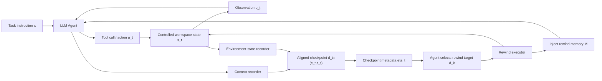
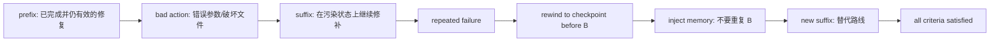

# AgentRewind：长程 LLM Agent 失败后，能不能回到可恢复的执行状态

## 元信息与 TL;DR

| 项目 | 内容 |
|---|---|
| 论文 | AgentRewind: Recoverable Execution for Long-Horizon LLM Agents |
| 类型 | 论文，arXiv:2608.14380v1 |
| 作者 | Yu Zhuang, Kefei Chen, Yitong Duan, Shuxin Zheng, Jian Li, Xu-Yao Zhang |
| 机构 | UCAS, Tsinghua IIIS, Zhongguancun Academy, CAS Institute of Automation |
| 官方链接 | https://arxiv.org/abs/2608.14380 |
| 代码 | https://github.com/Futuresis/replay-agent-recorder |
| 数据集 | https://github.com/Kelvin-Coffee/MettleBench |
| 日期证据 | arXiv 单篇页提交于 2026-08-14；arXiv cs.AI new list 标记在 2026-08-17；source 包 last-modified 为 2026-08-17 |

### TL;DR

- **研究问题**：长程 LLM Agent 在工具调用、文件修改、测试反馈和上下文累积中会犯早期错误。现有方法多在执行前改计划，或在执行中做安全拦截，但一旦错误已经污染上下文和工作区，就很难只靠继续修补恢复。
- **核心方法**：AgentRewind 在每个 LLM 决策边界记录对齐 checkpoint `d_t=(c_t,s_t)`，其中 `c_t` 是 agent 上下文，`s_t` 是受控工作区状态。触发 rewind 时，系统恢复上下文和环境，并把失败轨迹总结成 rewind memory 注入到恢复后的上下文。
- **评测构造**：作者提出 MettleBench，包含 82 个长程工程任务、640 条隐藏有序验收标准，来自 Terminal-Bench 2.0、ProgramBench、SWE-bench、ProjectEval 和 GitTaskBench。每次提交只返回第一个未满足标准的自然语言反馈。
- **主结果**：在 MettleBench 上，GPT-5.4 + mini-SWE-agent 的 Continue 为 `62.2%` 成功率、`81.4%` checklist progress；AgentRewind 提升到 `87.8%` 和 `94.3%`。GPT-5.4 mini 从 `33.7%/64.6%` 提升到 `51.2%/73.5%`。
- **机制证据**：从 50 条已经重复失败的 Continue 轨迹出发，AgentRewind 的 recovery rate 是 `30.0%`，Continue 只有 `8.0%`；组件消融显示去掉环境 rewind 后成功率降到 `43.9%`，去掉上下文 rewind 为 `65.9%`，去掉 rewind memory 为 `51.2%`。
- **跨 harness 证据**：在 GPT-5.4 固定下，AgentRewind 对 mini-SWE-agent、Qwen-Agent 的 FnCallAgent、smolagents 的 CodeAgent 都提升成功率，分别是 `+25.6`、`+23.2`、`+15.8` 个百分点。
- **关键局限**：它只恢复受控工作区文件树，不能回滚网络请求、外部服务、进程内存或不可控运行时状态；触发 rewind 仍依赖外部验证反馈和 agent 自己判断，不等于拥有内生的失败诊断能力。

## 研究问题：为什么“继续修补”不够？

### 论文真正反对的是什么？

作者反对的不是普通的自我反思，而是一个隐含假设：

- 只要 agent 看到失败反馈，就能在当前上下文和当前工作区上继续修补；
- 只要加计划、加 guardrail、加经验总结，就能把长程错误压低到可接受水平；
- 环境里的破坏性动作可以被后续动作等价撤销。

论文认为这个假设在长程工程任务里经常不成立：

| 失败类型 | 表面现象 | 为什么继续修补会失效 |
|---|---|---|
| 早期错误计划 | 后续步骤沿错误方向展开 | 后续上下文持续强化错误假设 |
| 文件破坏 | 删除、覆盖、迁移、重写历史 | 工作区状态已经不含原始证据 |
| 配置污染 | 依赖、数据库、生成物互相覆盖 | 新动作继续作用在退化状态上 |
| 反馈陷阱 | 同一个验收项连续失败 | agent 知道失败，但不知道该回到哪里 |

### 这和 ScienceFlow 的差异在哪里？

同样是长程 Agent，ScienceFlow 关注“科研状态如何保存和重锚”，AgentRewind 更窄，也更工程化：

| 维度 | ScienceFlow | AgentRewind |
|---|---|---|
| 核心对象 | 可恢复科研执行状态 | LLM 决策边界的上下文与环境 checkpoint |
| 触发逻辑 | 研究片段边界、状态重锚、资源控制 | agent 判断当前轨迹卡住后选择历史 checkpoint |
| 证据场景 | MLE-bench、KTTSP、SciModelingBench | MettleBench、Terminal-Bench 2.0、工程任务 case |
| 主要失败 | 研究方向、资源、实验轨迹不稳 | 早期错误污染上下文和工作区，后续无法撤销 |

这篇论文的增量不在“保存状态”四个字，而在把恢复拆成三件必须同时成立的事：

- `c_t`：恢复 agent 上下文，避免坏轨迹继续污染推理；
- `s_t`：恢复工作区状态，避免破坏性文件动作留在环境里；
- `M`：保留失败经验，避免回到过去以后重复同一个错误。

## 方法机制：AgentRewind 如何定义可恢复执行？

### 标准执行循环

论文先把普通 agent 执行写成一个状态转移：

```text
u_t ~ pi(c_t)
(s_{t+1}, o_{t+1}) = T(s_t, u_t)
c_{t+1} = U(c_t, u_t, o_{t+1})
```

变量含义如下：

| 变量 | 含义 |
|---|---|
| `c_t` | 第 `t` 步的 agent 上下文，包括任务、历史消息、工具结果和反馈 |
| `s_t` | 第 `t` 步的外部环境状态，在论文实现里主要是工作区文件树 |
| `u_t` | LLM 基于上下文生成的动作或工具调用 |
| `o_{t+1}` | 环境对动作的观察结果，例如命令输出、测试反馈、验证失败 |
| `T` | 环境状态转移函数 |
| `U` | 上下文更新函数 |

标准执行只会产生不断增长的轨迹：

```text
tau = ((c_0,s_0), u_0, o_1, (c_1,s_1), ..., (c_T,s_T))
```

问题在于：

- 如果 `u_k` 是错误动作，`c_{k+1}` 会记录错误观察；
- 如果 `u_k` 改坏了文件树，`s_{k+1}` 会成为受污染状态；
- 后续所有动作都从污染后的 `(c,s)` 出发；
- 即使 agent 后来意识到错误，也只能在坏状态上追加修复。

### AgentRewind 的 checkpoint

AgentRewind 在每个 LLM 决策边界记录：

```text
d_t = (c_t, s_t)
```

它还为相邻 checkpoint 之间的片段生成 metadata：

```text
eta_t = summary(d_t -> d_{t+1})
```

这些 metadata 不是给人看的审计日志，而是给 agent 选择回滚点用的候选说明：

- 这一段 LLM 输出了什么；
- 调用了哪些工具；
- 工作区发生了什么变化；
- 环境反馈是什么；
- 这一段是否可能是错误源头。

### rewind 触发后的状态变换

当 agent 判断当前轨迹无法继续推进时，它选择历史 checkpoint `d_k`，并从失败轨迹里生成一段 rewind memory `m`：

```text
M <- M union {m}
s'_k <- s_k
c'_k <- Inject(c_k, M)
tau' = ((c'_k, s'_k), u'_k, o'_{k+1}, ...)
```

这表示：

- 工作区恢复到 `s_k`；
- 上下文恢复到 `c_k`；
- 但失败经验不丢失，而是作为 `M` 注入；
- agent 不是失忆重启，而是带着“这条路哪里错了”的信息重新生成后缀。

### 伪代码视角

```text
Input:
  task instruction x
  initial context c_0
  initial workspace state s_0
  max repeated failure threshold r = 5

State:
  checkpoints D = []
  rewind memories M = []
  current trajectory tau = []

Loop:
  record checkpoint d_t = (c_t, s_t)
  append metadata eta_t for last segment

  sample agent action u_t from pi(c_t)
  execute u_t in controlled workspace
  update environment state s_{t+1}
  update context c_{t+1}

  if verifier reports success:
      Output success trajectory

  if agent decides progress is stuck:
      show checkpoint metadata list to agent
      agent chooses checkpoint d_k
      agent writes rewind memory m
      M <- M union {m}
      restore workspace to s_k
      restore context to c_k
      inject M into restored context
      continue from restored state

  if same first failure appears five times:
      Output unsuccessful trajectory
```

### 架构图用文字重建



## 恢复边界：它能回滚什么，不能回滚什么？

论文在边界上比较克制。AgentRewind 恢复的是受控工作区目录树：

- 记录文件级变化；
- rewind 时撤销后续修改；
- 恢复被删除文件；
- 移除 rewind 目标之后新建的文件；
- 保留前缀日志，不重新执行前缀工具调用。

但它明确不能撤销这些影响：

| 不可回滚对象 | 为什么重要 |
|---|---|
| 网络请求 | 外部服务可能已经收到请求 |
| 外部服务调用 | 数据库、API、支付、工单等状态不在 workspace 内 |
| 进程内存 | 论文实现不是完整 VM snapshot |
| 外部 runtime state | 容器外副作用无法从文件树恢复 |
| 安全后果 | 恢复本地状态不等于抹掉外部泄露或破坏 |

这也是它和“真正全系统 checkpoint”不同的地方。AgentRewind 更像 agent runtime 里的可恢复执行层，而不是完整操作系统级时间旅行。

## MettleBench：为什么需要新的 benchmark？

### 任务定义

作者认为许多长程工程任务不是一个单点要求，而是一组有顺序依赖的验收标准。MettleBench 把任务形式化为：

```text
T = (x, s_0, U, G)
G = (g_1, ..., g_n)
```

其中：

| 符号 | 含义 |
|---|---|
| `x` | 自然语言任务说明 |
| `s_0` | 初始工作区状态 |
| `U` | agent 可执行动作空间 |
| `G` | 有序验收标准列表 |
| `g_i(s)` | 第 `i` 条标准对最终状态 `s` 的二值检查 |

任务成功定义为所有标准同时满足：

```text
Succ(s_T) = AND_i (g_i(s_T)=1)
```

部分进度不是任意通过率，而是最长满足前缀：

```text
rho(s_T) = ell / n
```

这里 `ell` 是从 `g_1` 开始连续满足的最长前缀长度。这个设计很关键：

- 如果 agent 跳过早期依赖，后面即使碰巧通过也不算完整进度；
- 如果后续动作破坏早期成果，前缀进度会回退；
- 它更接近真实交付链路，而不是零散单元测试通过率。

### 数据构成

MettleBench 包含：

| 指标 | 数值 |
|---|---:|
| 任务数 | 82 |
| 总验收标准 | 640 |
| 每任务标准均值 | 7.80 |
| 每任务标准中位数 | 7 |
| 每任务标准范围 | 5 到 12 |
| 带 failure feedback 的标准 | 640 / 640 |
| evaluator 类型 | 普通 Python 程序，不用 LLM 判断 |

来源分布按任务数是：

| 来源 benchmark | 任务数 |
|---|---:|
| Terminal-Bench 2.0 | 28 |
| ProgramBench | 22 |
| SWE-bench | 18 |
| ProjectEval | 7 |
| GitTaskBench | 7 |
| 总计 | 82 |

附录还给出按验收标准计的分布：

| 来源 benchmark | Criteria | Share | Per task |
|---|---:|---:|---:|
| Terminal-Bench 2.0 | 208 | 32.5% | 7.43 |
| ProgramBench | 168 | 26.2% | 7.64 |
| SWE-Bench | 158 | 24.7% | 8.78 |
| ProjectEval | 56 | 8.8% | 8.00 |
| GitTaskBench | 50 | 7.8% | 7.14 |

### 质量控制

MettleBench 的构造不是简单拼任务。作者给每个任务准备：

- 自然语言 prompt；
- 初始 workspace；
- 隐藏有序 checklist；
- 每条 checklist 对应的 executable check；
- forward-only reference solution；
- order-violating reference run。

三道入选门槛是：

- reference solution 必须一次线性通过所有标准；
- order-violating run 必须在被破坏依赖对应的标准上失败；
- shipped workspace 必须初始失败，不能拿到任务时已经解决。

这个设计的含义是：

- benchmark 不要求必须有 rewind 才能解；
- 但它能暴露“错误顺序会破坏后续交付”的长程性质；
- agent 每次只看到第一个失败标准的反馈，不看到完整 checklist。

## 实验设置：比较哪些策略？

### 主指标

论文使用两个主指标：

| 指标 | 定义 | 为什么需要 |
|---|---|---|
| Task success rate | 最终状态满足全部验收标准的任务比例 | 判断是否真正完成 |
| Average checklist progress | 平均最长前缀通过率 `rho(s_T)` | 衡量失败时走到哪里 |

运行终止规则也很重要：

- 没有预设 wall-clock limit；
- 没有 step limit；
- 没有总 token limit；
- 如果同一个 first unsatisfied criterion 连续出现 5 次，则记录为失败并终止；
- 除特别说明外，主实验用 GPT-5.4 和 mini-SWE-agent。

### 四种策略

| 策略 | 失败后怎么做 |
|---|---|
| Continue | 在当前上下文和当前工作区继续 |
| Restart with Experiences | 重置环境，重启新尝试，只保留失败经验文件 |
| Safety Review | Continue 加 AgentDoG 对每个工具动作做安全审查 |
| AgentRewind | 恢复 agent 上下文和工作区 checkpoint，并注入 rewind memory |

### Continue 基线表明什么？

七个模型在 MettleBench 上的 Continue 结果如下：

| Model | SR | Avg. checklist progress | Avg. trace length |
|---|---:|---:|---:|
| GPT-5.4 | 62.2 | 81.4 | 50.5 |
| GPT-5.4 mini | 33.7 | 64.6 | 72.4 |
| Qwen3.7-Max | 73.2 | 84.8 | 126.3 |
| Qwen3.5-27B | 56.1 | 79.1 | 211.6 |
| Kimi K2.5 | 28.0 | 61.3 | 312.4 |
| DeepSeek-V4-Flash | 37.8 | 63.6 | 337.2 |
| GLM-5.1 | 59.8 | 75.1 | 324.8 |

这里有两个值得注意的信号：

- trace 更长不等于更强。DeepSeek-V4-Flash 和 GLM-5.1 平均轨迹超过 300，但不稳定领先。
- success 和 progress 不等价。GPT-5.4 与 GLM-5.1 成功率接近，但 GPT-5.4 的失败任务前缀进度更高。

## 主结果：AgentRewind 的收益在哪里？

### 执行策略精确结果

附录给出了 Figure 3 背后的终止值：

| Model | Strategy | Task success | Avg. checklist progress |
|---|---|---:|---:|
| GPT-5.4 | Continue | 62.2 ± 2.1 | 81.4 ± 1.0 |
| GPT-5.4 | Restart with Experiences | 78.0 ± 2.4 | 88.8 ± 1.2 |
| GPT-5.4 | Safety Review | 34.1 ± 1.2 | 54.4 ± 2.1 |
| GPT-5.4 | AgentRewind | 87.8 ± 1.2 | 94.3 ± 0.5 |
| GPT-5.4 mini | Continue | 33.7 ± 0.7 | 64.6 ± 1.1 |
| GPT-5.4 mini | Restart with Experiences | 43.1 ± 1.4 | 64.5 ± 1.3 |
| GPT-5.4 mini | Safety Review | 36.2 ± 1.9 | 64.5 ± 0.8 |
| GPT-5.4 mini | AgentRewind | 51.2 ± 4.2 | 73.5 ± 3.0 |

直接读数：

- GPT-5.4 上，AgentRewind 相比 Continue 成功率提升 `25.6` 个百分点；
- 相比最强 baseline Restart with Experiences，仍提升 `9.8` 个百分点；
- GPT-5.4 mini 上，AgentRewind 相比 Continue 提升 `17.5` 个百分点；
- Safety Review 没有稳定收益，GPT-5.4 下甚至明显下降。

### 为什么 Restart with Experiences 不够？

Restart 的优势是能拿回干净初始状态，但它也丢掉了已经完成的正确工作：

- 代码修复、迁移产物、文档、测试中间成果全部丢弃；
- 后一次尝试必须从头再做；
- 失败经验只能作为文本带入，而不是保留一段已验证的执行前缀。

AgentRewind 则允许“保留正确前缀，抛弃错误后缀”：



### Terminal-Bench 2.0 外部验证

论文还在完整 Terminal-Bench 2.0 的 89 个任务上比较：

| Strategy | Success rate | Avg. criteria passed |
|---|---:|---:|
| Continue | 78.7 | 88.7 |
| Restart with Experiences | 70.8 | 79.2 |
| AgentRewind | 83.1 | 90.2 |

这说明收益不只来自 MettleBench 的有序 checklist 设计。Terminal-Bench 2.0 的验收标准不是语义有序的，所以 partial completion 改用每任务 criteria satisfied fraction。

## Case Study：Astropy FITS 任务说明了什么？

### 任务结构

论文挑了一个 GPT-5.4 mini 下的 Astropy FITS handoff 任务：

- 修复 FITS library 缺陷；
- 生成覆盖有效图像和 6 个故意 malformed fixture 的 catalog；
- 保持 malformed fixture 不变；
- 确保修复后的 library 仍然拒绝这些 malformed 输入；
- 完成 catalog、reconciliation ledger、attestation，并通过 34 个测试。

### 三种策略的轨迹差异

| 策略 | 关键失败 | 结果 |
|---|---|---|
| Continue | 用错误 mode 运行 catalog generator，导致 6 个 unreadable fixtures 被覆盖为 valid FITS images | 后续重建 malformed 文件，但内容不匹配原始文件，停在 9/10 |
| Restart with Experiences | 每次重启恢复原始 fixtures，但也丢掉已经完成的 library repairs 和 artifacts | 26 次重启仍未通过，最终 8/10 |
| AgentRewind | 先也用错 mode，到 8/10 后回到 catalog 前 checkpoint | 保留已验证修复，恢复原始 fixtures，记录错误 mode 后果，换正确 mode 后到 10/10 |

这个 case 的价值在于它同时验证三件事：

- 单纯继续修补不能恢复原始 fixture 内容；
- 单纯重启会丢掉昂贵正确前缀；
- 对齐恢复上下文和工作区，才能保留“做对的部分”并撤销“做错的后缀”。

## 跨 harness：不是 mini-SWE-agent 专属技巧

作者把 GPT-5.4 固定，换三个 agent harness：

| Harness | Continue SR | AgentRewind SR | SR gain | Continue progress | AgentRewind progress | Progress gain |
|---|---:|---:|---:|---:|---:|---:|
| mini-SWE-agent | 62.2 | 87.8 | +25.6 | 81.4 | 94.3 | +12.9 |
| FnCallAgent | 58.5 | 81.7 | +23.2 | 77.9 | 91.4 | +13.5 |
| CodeAgent | 67.1 | 82.9 | +15.8 | 83.0 | 89.7 | +6.7 |

这组证据支持一个较强判断：

- AgentRewind 的收益不只是某个 harness prompt 写得更好；
- 不同 tool interface 和 control loop 下，只要能插入 recorder、checkpoint selector 和 rewind tools，就能复用机制；
- 但收益幅度会受 harness 原本能力影响，CodeAgent 的 Continue 已经更高，所以增益较小。

附录里还说明每个 harness 需要 150 到 300 行左右的适配代码，把 rewind 工具用该 harness 接受的形式暴露出来。这是工程成本，不是零成本挂件。

## Recovery 与消融：哪个组件最关键？

### 从相同失败状态恢复

作者收集 50 条已经在 Continue 下触发 repeated-failure termination 的轨迹。然后从同一个失败端点启动 paired recovery：

| Method | Recovery rate | Checklist progress change |
|---|---:|---:|
| Continue | 8.0 | +5.1 pp |
| AgentRewind | 30.0 | +12.2 pp |

这个实验比主表更接近机制验证：

- 起点是同一个失败上下文和环境；
- 两边都收到相同 recovery prompt；
- 区别在于 AgentRewind 能选择历史 checkpoint；
- 因而更能说明收益来自“从错误前状态重新分叉”，而不是只是 prompt 更长。

### 组件消融

| Variant | Success rate | Avg. checklist progress |
|---|---:|---:|
| Full AgentRewind | 87.8 | 94.3 |
| w/o Env. Rewind | 43.9 | 63.5 |
| w/o Context Rewind | 65.9 | 77.9 |
| w/o Rewind Memory | 51.2 | 69.4 |

解读如下：

- **环境 rewind 最关键**：去掉后成功率直接从 `87.8` 掉到 `43.9`。这说明很多失败不是“想错了”而已，而是文件树已经被破坏。
- **context rewind 也必要**：去掉后 agent 仍会看见被抛弃分支里的动作、观察和中间结论，容易重复或被污染。
- **rewind memory 不是装饰**：去掉后虽然能回到过去，但缺少“这条路为什么错”的记忆，失败路线容易再次出现。

### 统计检验

论文用任务级配对 Wilcoxon signed-rank test：

- pairing unit 是任务，`n=82`；
- 先聚合同一任务的重复运行，再比较策略；
- Holm correction 覆盖 12 个检验；
- 12 个比较都 favor AgentRewind；
- 其中 11 个在 `alpha=0.05` 后仍显著；
- 例外是 GPT-5.4 mini 对 Restart with Experiences 的 task success，Holm 校正后 `p=0.102`；
- 但对应 checklist progress 仍显著。

这让结论更稳健：

- 不是只看平均表格；
- 不是把重复运行当独立样本来夸大显著性；
- 也承认较弱模型对最强 restart baseline 的成功率差异没有完全过显著门槛。

## Figure/Table 证据逐项解读

| 证据 | 支持什么 | 不能证明什么 |
|---|---|---|
| Figure 1 | AgentRewind 是 context recorder、environment-state recorder、checkpoint metadata、rewind executor 的运行时层 | 不能证明外部服务和网络副作用可恢复 |
| Figure 2 | MettleBench 的 82 个任务来自五类工程 benchmark，不是单一来源 | 不能证明它覆盖全部企业工程任务 |
| Table 1 | 七个模型 Continue 差异明显，且长 trace 不等于高成功率 | 不能排除更强未来模型降低 rewind 需求 |
| Figure 3 / Appendix exact table | AgentRewind 在 GPT-5.4 与 mini 上均优于 Continue、Restart、Safety Review | 主图曲线横轴截断在 1000 trace records，精确终止值需看附录 |
| Figure 4 | medium/long horizon 分组里 rewind 优势更大 | tertile 是按各模型 Continue trace length 切的，不是固定全局分组 |
| Table 2 | Terminal-Bench 2.0 上也有外部收益 | 不能证明所有 benchmark 都会收益 |
| Figure 5 | Astropy case 展示“保留正确前缀，撤销破坏后缀”的具体机制 | 单个 case 不能替代表格统计 |
| Table 3 | 三个 harness 都有收益 | 每个 harness 仍需要适配层，不能直接无改动运行 |
| Table 4 | 相同失败端点下 AgentRewind 更能恢复 | 50 个失败端点仍来自该实验设置 |
| Table 5 | 环境、上下文、memory 三组件互补 | 未拆解 checkpoint 选择质量的单独影响 |

## 相关工作位置：它补了哪块空白？

### 长程 Agent benchmark

论文把自己放在 ALFWorld、ScienceWorld、WebShop、InterCode、SWE-bench、Spider 2.0、CoSQL、BIRD-INTERACT、TheAgentCompany、Odysseys 等工作之后。

它不是再证明“agent 会失败”，而是强调：

- 很多 benchmark 只有单一主要求；
- 真实工程任务常是有顺序依赖的 checklist；
- 部分完成也要看是否按前缀推进；
- 后续动作可能破坏早期已满足条件。

### Agent reliability

相关方法包括：

- ReAct、SayCan、LATS 等通过 reasoning、planning、search 或 environment model 改进行为；
- AgentSpec、GuardAgent、AgentDoG 等做安全监控；
- Self-Refine、Reflexion、ExpeL 等利用前次失败经验；
- AgentDebug、AgentRx 等做失败轨迹诊断。

AgentRewind 的位置是：

- 它不只把经验写进下一次 prompt；
- 它也不只在动作前拦截风险；
- 它把“恢复到哪一个上下文和环境状态”变成运行时动作。

### Rollback 相关工作

论文提到 GA-Rollback、WebRollback、DART、DMTCP、CRIU、DeltaBox。

区别可以这样看：

| 方向 | 特点 | AgentRewind 的差异 |
|---|---|---|
| Web/navigation rollback | 适合浏览器路径 | AgentRewind 面向开放工程轨迹 |
| 结构化工具 agent rollback | 依赖显式控制流边界 | AgentRewind 在 LLM 决策边界建 checkpoint |
| 系统 checkpoint | 恢复低层 process 或 sandbox 状态 | AgentRewind 加入 agent-level memory 和 checkpoint 选择 |
| Sandbox rollback | 关注文件和进程状态 | AgentRewind 同时恢复上下文与工作区 |

## 代码和数据源补充核验

### 代码仓库

官方代码链接指向 `Futuresis/replay-agent-recorder`：

- GitHub API 显示仓库创建于 `2026-05-24`；
- 最近 pushed_at 为 `2026-08-13T05:26:42Z`；
- README 定位为 local-first time-travel debugging for LLM agents；
- 能力包括 Record、Replay、Fork、Backtrack、Git workspaces、Sandbox、Visualize、Integrate；
- README 明确标记状态为 alpha；
- sandbox 说明强调它不是完整 VM snapshot 或安全边界。

这和论文边界一致：

- 它强调本地 trace、replay、fork 和工作区文件副作用；
- 它不承诺完全恢复进程内存或外部副作用；
- 代码仓库更像论文机制的工程基础，而不是已经成熟的生产平台。

### 数据集仓库

MettleBench 仓库说明：

- benchmark 是 82 个长程工程任务；
- 每个任务含 `prompt.md`、`workspace/`、隐藏有序 checklist；
- 640 条 acceptance criteria 由 executable checks 支持；
- evaluator 是 deterministic Python；
- 每次只返回第一个未满足标准；
- workspaces 分发在 Hugging Face，因为含 git repo、符号链接和权限位；
- reference runs 是 gated access，避免方案直接进入公开爬取语料。

这个设计有两个研究价值：

- 它把长程任务失败从“看最终测试”推进到“看交付链条前缀”；
- 它也承认公开 benchmark 和训练污染之间的张力，用 gated reference 降低泄露风险。

## 证据边界与可复现性问题

### 已证明得比较强的部分

- 在 MettleBench、Terminal-Bench 2.0、多个 harness 上，AgentRewind 都提升成功率或部分进度；
- 组件消融清楚显示环境 rewind、上下文 rewind、rewind memory 都有贡献；
- paired failed-endpoint 实验证明它能从相同失败状态恢复得更好；
- evaluator 是普通 Python，并且相同 final state 返回相同 verdict。

### 仍需谨慎的部分

| 边界 | 解释 |
|---|---|
| 模型版本 | 主模型是 GPT-5.4 和 GPT-5.4 mini，并含 Qwen、Kimi、DeepSeek、GLM Continue 表；未来模型能力变化会改变收益空间 |
| 任务范围 | MettleBench 是工程任务，不代表网页、移动端、真实企业 SaaS 全部场景 |
| 外部副作用 | 网络、数据库、外部服务不能回滚，因此安全敏感场景仍需权限隔离 |
| 触发机制 | rewind 依赖 agent 判断卡住和选择 checkpoint，论文未证明模型能总是选对 |
| reference access | MettleBench reference runs gated，公开复现需要额外申请 |
| 适配成本 | 不同 harness 需要 wrapper 和工具暴露，论文附录给出 150 到 300 行适配量级 |
| 运行成本 | 没有固定 step、wall-clock、token limit，工程部署时必须另设预算和限额 |

### 对安全和权限设计的含义

AgentRewind 对安全不是万能药，但它提供一个很重要的工程信号：

- 可恢复性必须跟权限边界绑定；
- 只有在受控 workspace 内的动作，才适合交给 rewind 机制撤销；
- 对外部世界的动作仍需要前置许可、dry-run、审计和 human approval；
- 否则 agent 可以“本地回滚”，但外部系统已经被改过。

因此，AgentRewind 更适合作为 agent runtime 的可靠性层，而不是替代 sandbox、policy、capability gating 或事务系统。

## 研究者视角的延伸问题

### 1. checkpoint 选择能否学习？

当前论文让 agent 依据 metadata 选择 checkpoint。后续可以问：

- 是否能训练一个 checkpoint value model；
- 是否能预测哪个历史状态最可能让后缀成功；
- 是否能把 `eta_t` 做成可比较的 causal trace；
- 是否能从失败任务聚合出常见错误边界。

### 2. rewind memory 该如何约束？

rewind memory 很有用，但也可能污染新分支：

- 它可能把错误结论写成经验；
- 它可能过度约束探索；
- 它可能泄漏本不该跨分支保留的信息；
- 它可能让 agent 规避 verifier，而不是修复真实问题。

更严格的版本应该区分：

| memory 类型 | 应保留吗 |
|---|---|
| 被证伪假设 | 应保留 |
| 破坏性动作后果 | 应保留 |
| verifier 反馈摘要 | 应保留 |
| 未验证猜测 | 需要降权 |
| 敏感外部信息 | 需要权限过滤 |

### 3. 与事务系统如何结合？

如果外部系统支持事务，AgentRewind 可以从文件树恢复扩展到多资源恢复：

```text
checkpoint = {
  context_snapshot,
  workspace_snapshot,
  database_transaction_marker,
  external_api_dry_run_log,
  permission_scope,
  rollback_plan
}
```

但这要求环境本身提供可恢复语义。论文当前没有解决这一层。

### 4. benchmark 是否应该奖励恢复质量？

MettleBench 现在主要看最终成功和前缀进度。可以继续设计：

- 恢复动作次数；
- 回到错误前最小距离；
- 是否保留已验证正确前缀；
- 是否避免重复同类错误；
- 是否能解释 checkpoint 选择理由；
- 是否在预算内完成恢复。

这些指标会让“长程 Agent 可靠性”从最终结果推进到可审计过程。

## 结论

AgentRewind 的核心贡献是把长程 Agent 的失败恢复从“文本经验”推进到“可恢复执行状态”：

- 它承认上下文和环境会一起被污染；
- 它用 `d_t=(c_t,s_t)` 让二者在决策边界对齐；
- 它用 rewind memory 保留失败经验，而不是简单失忆重启；
- 它用 MettleBench 让有序工程交付成为可测对象；
- 它用主结果、跨 harness、failed-endpoint recovery 和消融证明机制有效。

最值得带走的判断是：

- 长程 Agent 的可靠性不能只靠更强模型和更长上下文；
- 也不能只靠 action-level safety review；
- 真正难的是在失败发生后，把“该保留的正确前缀”和“该抛弃的错误后缀”分开；
- AgentRewind 给出了一个可执行、可评测、边界也相对清楚的系统化答案。
