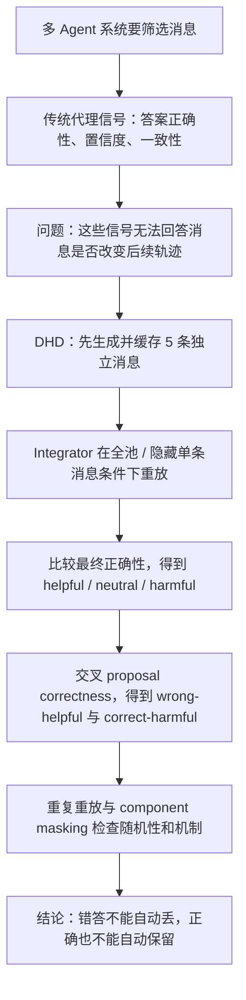

# Wrong but Useful：多智能体消息的价值，不能只看它自己的答案对不对

## 元信息与 TL;DR

- **标题**：Wrong but Useful: Trajectory Value Beyond Answer Correctness in Multi-Agent Messages
- **类别**：大模型 Agent
- **原文**：https://arxiv.org/abs/2608.14375
- **官方日期证据**：
  - arXiv `cs.AI` recent list 将它列在 **Mon, 17 Aug 2026** 的条目中。
  - arXiv 版本页同时显示 `v1` 原始提交时间为 **Fri, 14 Aug 2026 15:16:57 UTC**。
  - 本文按契约采用官方当前列表日期进入本周窗口，同时保留原始提交时间，避免把“列表日”和“投稿日”混成同一个事实。
- **作者**：Chih-Hsuan Yang, Anjir Ahmed Chowdhury, Cheng-Hau Yang, Weijian Zheng, Fernando Llorente, Xiaolong Ma, Xinyang Li, Eliu A. Huerta, Ian T. Foster, Rajeev Thakur
- **材料**：24 页、9 个图、附录、arXiv ancillary reproducibility artifact。

### TL;DR

- 这篇论文问的是一个很具体的 Agent 通信问题：一个消息自己的答案错了，是否就应该在多智能体推理中被丢掉？
- 作者把“消息答案是否正确”和“消息进入下游 integrator 后是否让最终答案变好”拆开，后者定义为 **trajectory value**。
- 方法叫 **Diverse Hypothesis Deliberation, DHD**：先缓存 5 个独立 hypothesizer 产出的结构化消息，再让同一个 integrator 在“看到该消息”和“隐藏该消息”的匹配重放中比较最终正确性。
- 实验覆盖 5 个数学/科学 benchmark：Omni-MATH-2、JEEBench、SciBench、LAB-Bench、MaScQA；两类开放模型族：`gpt-oss-120b` 与 `gemma-4-31B-it`。
- 主结果不是“多 Agent 一定更准”。K=0 独立求解到 K=5 全池集成的宏平均提升只有 OSS **+1.6** 个点、Gemma **+0.3** 个点；真正有价值的是消息级正负效应被拆开了。
- 在 in-pool LOO 中，错答消息一旦改变最终正确性，其中 **41.9%** 的 OSS 事件、**45.3%** 的 Gemma 事件是 helpful，而不是 harmful。
- 控制重复重放显示，观测到的可重复消息效应不太可能只来自随机输出波动，add-one permutation 给出 **p=0.0002**。
- component masking 的小样本诊断显示：在 10 个 repeatable wrong-helpful anchor 中，完整消息成功率 **82%**；隐藏 wrong answer 后仍有 **64%**；隐藏 reasoning 后降到 **44%**；直接移除只有 **26%**。
- 局限同样清楚：trajectory value 是消息、消息池、integrator、任务上下文共同定义的，不是文本自身的内禀分数；LOO 隐藏的是整个消息，也会改变 prompt 长度和位置；component masking 只是 22 个 Gemma 消息的诊断样本，不是总体比例估计。

## 研究问题：为什么“答案正确性”不够？

### 作者反对的默认假设是什么？

很多多智能体或多候选推理系统会用下面几类信号来决定保留哪条消息：

- 多数一致：哪条答案和其他候选更一致。
- 置信度或自评：哪条路径看起来更确定。
- reward model 或 process score：哪条过程更像正确解。
- 通信剪枝：哪条消息冗余、噪声大或可能干扰合成。

这些做法背后的隐含判断是：

> 一个消息如果更可能答对，它就更值得给最终求解器看。

论文指出，这个判断把两个问题混在一起了：

| 判断对象 | 问题 | 论文中的角色 |
|---|---|---|
| proposal correctness | 消息自己给出的 answer 对不对？ | 局部标签 |
| trajectory value | 把整条消息交给下游 integrator，会让最终答案更好还是更差？ | 上下文标签 |

### “错但有用”到底是什么意思？

错答消息可能包含有用的中间结构：

- 对数学题，它可能找到了关键分解，但漏掉边界条件。
- 对科学题，它可能列出了正确物理量，却在最后选项上失误。
- 对材料题，它可能抓住了单位换算，但被一个错误 convention 带偏。

反过来，正确答案也可能搭配有害 reasoning：

- 正确选项旁边写了一个误导性 caveat。
- 过程里强调了错误的二次修正。
- integrator 看到这些过程后，反而更容易被错误路线吸走。

所以本文真正研究的不是“错答案也能作为数据增强”这种泛化说法，而是：

> 在固定消息池和固定下游求解器中，一条完整 agent message 的可见性，是否改变后续推理轨迹？

## 论文主张与论证路线

### 主张

作者的核心主张可以拆成四层：

1. **Correctness is informative**：消息自己的答案是否正确，对 trajectory value 有统计相关性。
2. **Correctness is not determinative**：相关性不等于决定性；错答消息可以 helpful，正确消息也可以 harmful。
3. **Trajectory value is contextual**：一条消息的价值属于某个 pool 和 integrator 上下文，不是脱离环境的文本分数。
4. **Replay can produce labels**：固定消息后做 available-versus-hidden replay，可以生成训练“什么时候应该听某个 agent”的标签。

### 论证路线



这条路线的关键是 **固定消息池**。

如果 agent 在每轮 debate 或 reflection 里重新生成文本，就很难判断是哪条旧消息带来了影响；DHD 则先缓存 5 条消息，再只改变 integrator 是否可见某一条目标消息，把“生成阶段变化”从“集成阶段影响”里剥离出来。

## 方法机制：DHD 如何测 trajectory value？

### 对象与符号

设一个任务实例为：

```text
x: 题目或问题
y: 标准答案
E(x, a, y): 固定 evaluator，判断答案 a 是否等价于 y
h_i: 第 i 个 hypothesizer 生成的完整消息
a_i: h_i 里的 proposed answer
c_i = E(x, a_i, y): proposal correctness
```

这里的 `h_i` 不是只有 answer，而是包含：

- reasoning direction
- key idea
- critical assumption
- what to check
- proposed answer
- confidence 或类似结构字段

### Trajectory value 的定义

对一个消息集合 `S`，设 integrator 在看到 `S` 后输出 `A_S`，最终正确性为：

```text
Y_S = E(x, A_S, y)
```

如果目标消息在 K 条前缀池 `H_K` 中，那么期望 LOO trajectory value 是：

```text
tau_{i,K} = Pr(Y_{H_K}=1) - Pr(Y_{H_K \ {h_i}}=1)
```

变量解释：

| 变量 | 含义 |
|---|---|
| `H_K` | 从同一个 5 消息池取出的 K 条 nested prefix |
| `h_i` | 被测试是否隐藏的目标消息 |
| `Y_{H_K}` | integrator 看到完整 K 条消息时是否答对 |
| `Y_{H_K \ {h_i}}` | integrator 看不到目标消息时是否答对 |
| `tau > 0` | 目标消息平均上提高成功概率 |
| `tau < 0` | 目标消息平均上降低成功概率 |

单次重放只能得到一个观测标签：

| 全池结果 | 移除目标消息结果 | 观测 effect |
|---|---|---|
| 正确 | 错误 | helpful |
| 错误 | 正确 | harmful |
| 相同 | 相同 | neutral |

再把这个 effect 与 `c_i` 交叉，就得到六格分类：

| proposal correctness | helpful | neutral | harmful |
|---|---|---|---|
| wrong | wrong-helpful | wrong-neutral | wrong-harmful |
| correct | correct-helpful | correct-neutral | correct-harmful |

### DHD 的执行流程

```text
Input:
  problem x, ground truth y, model family M, benchmark B

State:
  roles R_1...R_5
  cached messages H_5 = {h_1...h_5}
  evaluator E

Procedure:
  1. recruiter 只看 problem x，分配 5 个互补角色
  2. 5 个 hypothesizer 独立生成结构化消息 h_i
  3. 对 K = 0:
       integrator 独立解题，得到 baseline answer
  4. 对 K = 1...5:
       integrator 看到 H_K 并输出 full answer
  5. 对每个 h_i in H_K:
       integrator 看到 H_K \ {h_i} 并输出 reduced answer
  6. evaluator 只看最终答案和标准答案，不看 reasoning
  7. 比较 full / reduced correctness，标注 helpful、neutral、harmful

Output:
  proposal correctness c_i
  replay effect Delta_{i,K}
  correctness x trajectory-value taxonomy

Failure boundary:
  缺失或不可渲染消息不强行当作 neutral；
  operational failure 与 scientific outcome 分开记录；
  LOO 只测完整消息可见性，不单独证明每个 token 的因果作用。
```

这个协议不像一个部署时 selector；它更像测量仪器。

部署时你不可能为了每条消息做全量重放，但研究阶段可以用重放生成标签，进而训练更便宜的“该听谁”预测器。

## 实验设置：数据、模型、评测协议

### Benchmark 覆盖

论文使用 5 个数学与科学 benchmark：

| Benchmark | 领域与格式 | 问题数 |
|---|---:|---:|
| Omni-MATH-2 | 竞赛数学，开放精确答案 | 4,181 |
| JEEBench | 物理、化学、数学混合考试，单选/多选/整数/数值 | 515 |
| SciBench | 大学科学计算，数值或短答案 | 580 |
| LAB-Bench | 生物研究长证据多选题 | 741 |
| MaScQA | 材料科学混合格式问答 | 649 |

这组 benchmark 的意义在于：

- 既有严格数学答案，也有科学单位、实验语境和多选结构。
- 有些任务候选答案容易验证，有些任务的 reasoning 可用性更依赖上下文。
- 可以观察 wrong-helpful 是否只出现在数学边界条件，还是跨科学问答也出现。

### 模型与解码

| 角色 | 设置 |
|---|---|
| recruiter | 同一模型族，temperature 0 |
| hypothesizer | 同一模型族，temperature 0.7，用来生成互补路径 |
| integrator | 同一模型族，temperature 0 |
| evaluator | 独立 `gpt-oss-120b` evaluator，做答案等价判断 |
| 两个模型族 | `openai/gpt-oss-120b` 与 `google/gemma-4-31B-it` |

作者选择两类开放模型族，是为了让 prompt、重复调用、导出的记录可以在同一套设置下审计。论文也明确说托管 endpoint 没有暴露权重 revision hash，因此复现材料记录的是模型标识、prompt 配置、解码设置和 provenance，而不是不可得的 checkpoint hash。

### 规模与缺失处理

主 LOO 分析包含：

| 模型族 | eligible LOO messages |
|---|---:|
| OSS | 91,740 |
| Gemma | 83,020 |

缺失处理很重要：

- protocol accuracy 把缺失或 non-answer 输出算作 incorrect。
- message-level 结果要求消息可渲染、matched comparison 完整。
- 缺失重放不被强行补成 neutral。

这避免了一个常见错误：如果把缺失都当 neutral，消息级 effect 会被系统性稀释。

## 主结果一：最终准确率增长很小，但消息级影响很大

### K=0 到 K=5 的宏平均变化

Table 1 显示，从独立求解到看到 5 条消息后，最终准确率并没有单调大幅提升：

| Benchmark | OSS K=0 | OSS K=5 | Δ | Gemma K=0 | Gemma K=5 | Δ |
|---|---:|---:|---:|---:|---:|---:|
| Omni-MATH-2 | 74.2 | 78.3 | +4.1 | 76.8 | 75.0 | -1.8 |
| JEEBench | 84.1 | 86.0 | +1.9 | 88.9 | 88.5 | -0.4 |
| SciBench | 75.7 | 79.3 | +3.6 | 73.1 | 73.6 | +0.5 |
| LAB-Bench | 41.6 | 39.8 | -1.8 | 56.5 | 61.7 | +5.2 |
| MaScQA | 90.8 | 91.2 | +0.5 | 95.1 | 93.4 | -1.7 |
| Macro average | 73.3 | 74.9 | +1.6 | 78.1 | 78.4 | +0.3 |

这张表支持的不是“DHD 是一个更强推理系统”，而是：

- 有些 benchmark 的集成有增益。
- 有些 benchmark 的集成会退化。
- 正负消息效应在最终准确率里会互相抵消。

如果只看系统最终分数，我们看不到哪条消息帮忙，哪条消息添乱。

### 候选答案可得，并不等于被成功集成

OSS 的验证矩阵中，5 条消息里至少一条 proposed answer 正确的比例在 **76.0% 到 95.4%** 之间；但 K=5 最终准确率低于这个 availability。

论文给出一个特别直观的诊断：

- Gemma 完整池中，只有 **36.9%** 有正确多数。
- 但 full-pool accuracy 是 **78.7%**。
- 同一个 integrator 用一条消息能答对、用五条消息反而答错的情况，OSS 是 **9.8%**，Gemma 是 **6.9%**。
- 反向情况只有 OSS **0.5%**、Gemma **0.2%**。

这说明 integrator 不是简单投票器。

它可能从少数路线里综合出正确答案，也可能在信息过多时被错误过程带偏。

## 主结果二：错答消息不只会害人，也会帮忙

### In-pool LOO 的 headline 结果

Figure 4 的源数据可以压成下面这张表：

| 模型 | proposal correctness | helpful | neutral | harmful | eligible | flip rate | helpful share among flips |
|---|---|---:|---:|---:|---:|---:|---:|
| OSS | wrong | 1,623 | 21,963 | 2,251 | 25,837 | 15.0% | 41.9% |
| OSS | correct | 2,461 | 62,131 | 1,311 | 65,903 | 5.7% | 65.2% |
| Gemma | wrong | 1,601 | 45,894 | 1,930 | 49,425 | 7.1% | 45.3% |
| Gemma | correct | 455 | 33,008 | 132 | 33,595 | 1.7% | 77.5% |

这张表的读法要小心：

- 错答消息总体上仍然更危险，因为 harmful 数高于 helpful。
- 但在“它确实改变最终正确性”的事件里，helpful 占比不是零，也不是偶然小数。
- OSS wrong flips 里 **41.9%** helpful；Gemma wrong flips 里 **45.3%** helpful。
- 正确消息也不是绝对安全：OSS correct-harmful 有 **1,311** 次，Gemma 有 **132** 次。

这正是标题里的 “Wrong but Useful”。

错并不充分证明“应该隐藏”，对并不充分证明“应该保留”。

### 跨 benchmark 描述性差异

Figure 7 的源表显示，wrong-helpful share 在 benchmark 间不均匀：

| Benchmark | OSS wrong helpful share among flips | Gemma wrong helpful share among flips |
|---|---:|---:|
| Omni-MATH-2 | 44.1% | 48.6% |
| JEEBench | 39.2% | 49.6% |
| SciBench | 37.0% | 38.5% |
| LAB-Bench | 35.4% | 29.3% |
| MaScQA | 26.9% | 23.6% |

作者没有把这个表解释成 benchmark 之间的因果比较，因为任务分布、答案格式和基线难度不同。

但它给出一个研究提示：

- 数学与考试题中，错答消息更可能携带可复用的分解、约束或边界思路。
- 生物与材料科学任务里，错误过程可能更像误导性证据或错误 convention，wrong-helpful 比例较低。
- 这要求后续 selector 不只学习“答案对错”，还要学习任务类型和 integrator 对某类中间结构的利用方式。

## 主结果三：重复重放排除了一部分随机性解释

### 为什么需要 controlled repeated replay？

单次 matched replay 仍然有噪声。

即使用同一个 prompt、同一个输入、同一个模型 endpoint，语言模型输出也可能变，特别是服务端实现、采样、解码和 evaluator 判断都可能引入波动。

作者因此在每个模型族上抽取：

- 每个 benchmark 200 个问题。
- 共 1,000 个问题/模型族。
- 在 K=5 条件下，做 5 个 matched blocks。
- 每个问题有 35 个 observation：重复 full-pool、5 个 one-message removals，以及 identical-input variation 检查。

### 关键统计结果

| 检查 | OSS | Gemma |
|---|---:|---:|
| identical full-pool correctness disagreement | 7.3% | 2.1% |
| add-one permutation p-value | 0.0002 | 0.0002 级别的 pooled evidence |
| BH screen 后 wrong-helpful problems | 0 | 11，覆盖五个 benchmark |

这里的逻辑是：

1. 如果 full pool 与 one-message-removed 的标签没有系统差异，那么在同一个 matched block 内交换标签应该不改变总体 effect 数。
2. 作者构造 5,000 个 null datasets。
3. 没有一个 null dataset 达到观测到的 aggregate effect count。
4. add-one permutation 计算为 `(0+1)/(5000+1)=0.0002`。

边界也要保留：

- OSS 在 multiplicity-controlled wrong-helpful problem 层面没有保留下来。
- Gemma 保留了 11 个 wrong-helpful problem。
- correct-harmful 的重复证据较弱，论文把它当作 secondary whole-message diagnostic。

所以重复重放支持的是“现象超过 ordinary replay variation”，不是“所有单次 LOO 标签都稳定可靠”。

## 主结果四：有用的往往是 reasoning，不是错答案本身

### Component masking 设计

LOO 隐藏整条消息，无法区分是 reasoning、answer、位置、长度还是上下文提示带来的影响。

论文在一个小诊断样本上做 component masking：

- 样本：22 个 Gemma 消息。
- 来源：controlled repeated replay 先确定 effect category，再做 masking。
- 覆盖：10 个 repeatable wrong-helpful anchors、3 个 correct-helpful、3 个 wrong-harmful、2 个 exploratory correct-harmful、4 个 indeterminate controls。
- 条件：full、byte-identical repeat、remove、same-position same-length neutral replacement、hide answer、hide reasoning。
- 重复：每例 5 次；总共 `22 x 5 x 8 = 880` 个 valid outcomes。

### 诊断结果

| Diagnostic sample | Full | Repeat | Remove | Neutral replacement | Hide answer | Hide reasoning |
|---|---:|---:|---:|---:|---:|---:|
| Wrong-helpful (n=10) | 82 | 81 | 26 | 46 | 64 | 44 |
| Correct-helpful (n=3) | 100 | 100 | 7 | 67 | 87 | 100 |
| Wrong-harmful (n=3) | 0 | 0 | 100 | 67 | 27 | 47 |
| Correct-harmful (n=2) | 100 | 100 | 100 | 100 | 100 | 70 |
| Indeterminate (n=4) | 50 | 53 | 50 | 50 | 55 | 50 |

对 wrong-helpful anchors：

- 完整消息成功率是 **82%**。
- 移除目标消息后降到 **26%**。
- 用同位置、近似同长度 neutral text 替换后是 **46%**。
- 只隐藏 wrong answer 后仍有 **64%**。
- 隐藏 reasoning 后只有 **44%**。

这个结果更支持：

> 错答消息之所以 helpful，主要不是因为它的错误 answer 被看到了，而是因为 reasoning 字段里有可复用的结构。

但作者没有把它夸大成完整因果分解：

- neutral replacement 只是近似 footprint control。
- n=10 的 wrong-helpful anchor 很小。
- 样本是诊断性选择，不估计总体流行率。

## 图表证据逐项解读

### Figure 1：两个 trace 说明 off-diagonal category

Figure 1 选择了两个真实 OSS trace：

| 类型 | 例子 | 支撑的判断 |
|---|---|---|
| wrong-helpful | Omni-MATH-2 数论题：消息漏掉 `L=1`，但提供偶奇分解 | 错答消息仍可提供 integrator 需要的结构 |
| correct-harmful | MaScQA 橡胶交联题：答案约 43% 正确，但过程强调可能翻倍 | 正确答案旁边的 misleading reasoning 会带偏合成 |

这张图不是总体统计，而是解释分类语义：

- replay effect 是 measured label。
- plausible mechanism 是作者对周围消息池的解释。
- 两者不能混同；真正定义 helpful/harmful 的是 matched replay 结果。

### Figure 2 与 Figure 3：协议边界

Figure 2 展示 DHD：

- recruiter 只看题目，分配 5 个 problem-specific roles。
- hypothesizers 互相不可见，也看不到 ground truth。
- integrator 只看到被选中的 cached messages。
- evaluator 只看最终答案与 ground truth，不看 agent reasoning。

Figure 3 展示两种 replay：

| replay 类型 | 比较对象 | 回答的问题 |
|---|---|---|
| single-message replay | 只看 `h_i` vs 独立求解 | 单条消息是否能从无消息状态创造成功路径 |
| in-pool LOO replay | `H_K` vs `H_K \ {h_i}` | 在已有其他消息时，该消息是否仍有边际价值 |

这两个标签不要求逐例一致，因为 trajectory value 依赖周围信息集。

### Figure 4：答案正确性与 trajectory value 分离

Figure 4 的核心贡献是把两个 denominator 分开：

- flip rate：在所有 eligible messages 中，隐藏/保留是否改变最终正确性。
- helpful share among flips：在已经发生 correctness flip 的事件中，方向是 helpful 还是 harmful。

如果不分 denominator，很容易得出错误结论：

- “错答 helpful 数少，所以不重要”忽略了 flip 条件下方向比例。
- “正确消息更常 helpful，所以答案正确性足够”忽略了 correct-harmful 的存在。

### Figure 6：候选可用性不等于最终集成

Figure 6 把三条曲线放一起：

- independent K=0 accuracy
- full K=5 accuracy
- at least one correct proposal availability

它支持一个对 Agent 系统很关键的区分：

| 失败类型 | 表面症状 | 需要的诊断 |
|---|---|---|
| generation failure | 池中没有正确候选 | 提高探索、采样或 role diversity |
| integration failure | 池中有正确候选但最终没用上 | 改进消息筛选、引用、冲突处理与 verifier |
| interference failure | 加更多消息后更差 | 识别 harmful reasoning 与过载上下文 |

这也是本文对 Agent 研究的价值所在：它把“多生成几个候选”之后最容易被忽略的集成失败显性化。

## 与相关工作的关系

### 它不是 process reward model

Process reward model 关心的是某一步是否像正确解的一部分。

DHD 关心的是：

- 这整条消息被另一个 agent 看到后，是否改变最终结果。
- 判断单位是 message-in-context，而不是 step-in-solution。
- 同一个 reasoning 片段在不同 pool 里可能有不同 value。

### 它不是 self-consistency 或多数投票

Self-consistency 聚合多个路径，用答案一致性提高最终答案。

DHD 的重点不同：

- 它固定多条路径。
- 不让 integrator 知道谁对谁错。
- 不把多数当作真值。
- 测每条消息的边际影响。

这解释了为什么 Gemma 只有 36.9% 完整池有正确多数，但 full-pool accuracy 可以达到 78.7%：integrator 不只是数票。

### 它接近 replay attribution，但配对了 correctness

已有 replay attribution 或 removal-based contribution 会看移除某个 agent 后性能变化。

本文额外做的一步是把 removal effect 与消息自己的答案正确性配对：

- 没有这个配对，就只能说“这条消息有贡献”。
- 有了这个配对，才能看到“错答也有贡献”“正确也会有害”。

这个交叉标签对训练通信 selector 更有用，因为它直接挑战了按答案过滤的策略。

## 复现材料与数据边界

### Artifact 提供了什么？

arXiv ancillary artifact 包括：

- `ARTIFACT_MANIFEST.json`
- `figures/*_source.csv`
- `data/derived/*.json`
- `data/derived/signal_labels/*.csv`
- `analysis/*.py`
- `scripts/reproduce_analysis.sh`
- `scripts/run_smoke_test.sh`
- `src/dhd/`
- `configs/paper/dhd_config.yaml`
- `tests/`

artifact 明确区分两种复现：

| 复现类型 | 是否需要模型调用 | 能复现什么 | 不能保证什么 |
|---|---|---|---|
| analysis reproduction | 否 | 论文列出的 6 个数据驱动图、headline taxonomy counts、robustness tables | 不重算所有附录表 |
| protocol smoke test | 可选，需要兼容 API | prompt、pool rendering、full/removal 条件、labeling procedure | 不保证生成文本字节一致 |

### 为什么没有原始 benchmark 文本？

artifact 的 DATA.md 明确说不重新分发第三方 benchmark question text。

原因包括：

- LAB-Bench 是 CC-BY-SA-4.0，带 canary 与 share-alike 约束。
- MaScQA 是 CC-BY-NC-SA-4.0，非商业与 share-alike 不适合并入通用 artifact。
- MIT 许可的 JEEBench/SciBench 即使可分发，分析复现也不需要原题文本。

这让 artifact 的复现边界很清楚：

- 可以检查 aggregate counts、rates、confidence intervals。
- 可以跑 synthetic fixture smoke test。
- 如果要跑真实 benchmark protocol，需要用户自己按上游许可取得数据。

## 局限与失败案例

### Trajectory value 不是文本内禀属性

同一条消息在不同上下文里可能改变方向：

- 周围 pool 有互补线索时，它可能 helpful。
- 周围 pool 已经有相同线索时，它可能 redundant。
- 周围 pool 里有相互强化的错误路线时，它可能 harmful。

因此不能把 `tau_{i,K}` 当作类似“这段文字质量分”的静态标注。

它更像：

```text
value(message, pool, integrator, task, evaluator)
```

缺少任何一个上下文变量，标签含义都会改变。

### LOO 不隔离语义 token

隐藏一整条消息会同时改变：

- integrator 可见的 reasoning 内容；
- proposed answer；
- prompt 长度；
- 消息位置；
- 与其他消息的相互引用机会。

component masking 试图进一步拆分，但论文自己也把它限定为小样本机制诊断。

### Benchmark 依赖 ground truth

DHD 依赖 evaluator 和标准答案。

这使它适合数学、科学问答和可验证任务；对开放式规划、长期工具使用、真实软件工程 agent，它需要改造：

- 最终答案未必有单一 ground truth。
- harmful 可能表现为成本增加、风险暴露或工具副作用。
- Helpful reasoning 可能不立即改变 final correctness，却提升可审计性或降低后续搜索成本。

### 模型族与交互设置有限

论文没有覆盖：

- 异构 agent 模型；
- 真实交互式 debate；
- frontier closed models 的完整权重可追踪复现；
- 多轮工具调用与环境状态变化；
- 没有稳定答案等价函数的任务。

所以结论应限于：

> 在固定 benchmark、固定消息池、固定 integrator 和答案等价评测下，proposal correctness 不能决定 trajectory value。

## 研究者视角：这篇论文改变了什么？

### 对 Agent 评测的启发

很多 Agent benchmark 仍以最终任务成功率为主。

这篇论文提醒我们，最终分数会隐藏至少三类变量：

| 被隐藏变量 | 现象 | 需要的新指标 |
|---|---|---|
| 候选生成质量 | 是否有人提出正确答案或关键约束 | candidate availability |
| 消息集成质量 | integrator 是否利用了可用线索 | trajectory value / uptake audit |
| 通信干扰 | 多消息是否让正确路线被冲掉 | harmful replay rate |

这对多 Agent 系统尤其重要。

如果一个系统“多 Agent 后分数没涨”，可能不是 agent 没产生好想法，而是 integrator 没能正确筛选、引用和冲突消解。

### 对 Agent 通信选择器的启发

一个实际 selector 不应该只学：

```text
keep if proposed_answer_is_correct
drop if proposed_answer_is_wrong
```

更合理的训练目标是：

```text
predict Pr(Y_with_message=1) - Pr(Y_without_message=1)
given:
  message fields
  pool state
  task type
  integrator profile
  uncertainty / evaluator reliability
```

DHD 给这种目标提供了 label 生成方式。

但部署时要控制成本：

- 全量 replay 太贵，适合作离线标注。
- 在线可以训练轻量 selector 或 verifier。
- 对高风险任务，可以只对争议消息或低置信池做局部 replay。

### 对后训练的延伸问题

这篇文章虽然属于 Agent 方向，但它自然连接到后训练：

- 如果 wrong-helpful 消息中有可复用 reasoning，能否把它作为 positive process signal？
- 如果 correct-harmful 消息含有 misleading reasoning，能否把它作为 negative reasoning signal？
- 训练 reward model 时，是否应该把“答案正确”与“对 integrator 有帮助”拆成两个 head？
- 在 RLVR 或 process supervision 中，是否可以加入 message-level counterfactual value？

一个可能的训练目标是：

```text
L = L_answer + lambda * L_trajectory

其中：
  L_answer     约束本地答案等价
  L_trajectory 约束消息进入下游系统后的边际影响
  lambda       控制局部正确性与系统级可用性的权重
```

这会让后训练从“单条解答质量”走向“协作上下文中的可用性”。

### 对 AI 安全的延伸问题

安全场景下，correct-harmful 尤其值得关注。

一条表面正确的安全分析如果包含误导性 caveat，可能让后续 agent：

- 高估某个错误攻击路径；
- 忽略边界条件；
- 在审计报告中放大无效证据；
- 对真实风险产生错误优先级。

反过来，wrong-helpful 也提醒我们：

- 红队 agent 的错误 exploit 可能仍包含真实前置条件。
- 防御 agent 的错误拒绝也可能携带正确 policy 线索。
- 安全审计不应只按最终结论过滤中间消息，还应检查 reasoning 中的可迁移证据。

这并不意味着保留所有错消息。

更合理的安全策略是：

| 消息类型 | 默认处理 | 额外检查 |
|---|---|---|
| wrong-helpful candidate | 不直接丢弃 | 抽取约束、前置条件、局部证明 |
| wrong-harmful candidate | 降权或隔离 | 检查是否会诱导工具误用 |
| correct-harmful candidate | 保留答案但审计 reasoning | 防止错误机制被传播 |
| correct-helpful candidate | 高优先级保留 | 检查是否与其他证据一致 |

## 结论

这篇论文最重要的地方，不是证明“错答案也有价值”这个口号，而是把它做成了可测对象。

它给了 Agent 研究一个清晰分解：

- `proposal correctness`：消息自己的答案对不对。
- `trajectory value`：消息被下游 integrator 看见后，对最终正确性有什么边际影响。
- `DHD replay`：固定消息池后，用 available-versus-hidden matched replay 生成标签。
- `component masking`：在小样本上初步检查 value 更可能来自 reasoning 还是 proposed answer。

证据层面，5 个 benchmark、两个模型族、174,760 条 headline eligible LOO messages、重复重放、component masking、artifact source CSV/JSON 共同支持一个结论：

> 答案正确性有用，但不足以决定一条多智能体消息是否应该被听见。

边界同样不能省略：

- 这不是低成本部署算法。
- 单次 replay 标签有噪声。
- component masking 不是总体估计。
- 真实长程 Agent、工具调用、开放式任务还需要新的 outcome 定义。

但作为研究工具，DHD 提供了一种更细的显微镜：把“多 Agent 到底谁帮了忙、谁添了乱、谁虽然错但贡献了关键结构”从最终准确率里拆出来。
