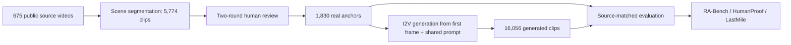

# RA-Bench：AI 生成危机视频检测器在真实传播链路里失效在哪里

### 元信息

| 字段 | 内容 |
| --- | --- |
| 论文 | Can We Defend Against AI-Generated Video Attacks on Real-World Crisis Events? A Systematic Evaluation of Detectors, Generators and Social Dissemination |
| 方向 | AI 安全 / AI for Security / 多模态取证评测 |
| 官方来源 | https://arxiv.org/abs/2608.14391 |
| 官方日期证据 | arXiv v1 于 2026-08-14 15:32:56 UTC 提交；Hugging Face Daily Papers 于 2026-08-17 收录 |
| 项目与数据 | Project page、GitHub `24029100313/RA-Bench`、Hugging Face dataset `liangshuo0111/RA-Bench` |
| 本文判断 | 这篇论文的价值不是又给视频检测器报一个总分，而是把“真实危机场景、生成源泛化、人类误判、平台传播处理”放进同一条评测链路，逼迫检测方法回答它在部署前必须回答的问题。 |

### TL;DR

- **问题**：现有 AI 生成视频检测评测多看通用视频或单一生成源，不能说明检测器能否处理战争、灾害、公共卫生、事故等真实危机素材被生成模型伪造后的风险。
- **方法**：作者构造 **RA-Bench**，用真实公开视频作为 anchor，再用 4 个开源和 5 个闭源 image-to-video 生成器生成配对视频，形成 **17,886** 条视频：**1,830** 个真实锚点和 **16,056** 条生成片段。
- **评测对象**：论文同时评测 7 个传统检测器、10 个 zero-shot 多模态模型在 3 种提示设置下的表现，以及 2 类专门细调过的 MLLM 检测器；指标按生成源做 source-matched、source-equal 聚合。
- **核心证据 1**：传统检测器从公开参考 AUC **67.6-98.6%** 掉到 RA-Bench 源级均值 **43.9-57.3%**；63 个 detector-source 组合里有 26 个 AUC 低于 50%。
- **核心证据 2**：人类评审对闭源生成视频更容易误判，闭源生成源平均 FakeR 只有 **52.9%**；论文进一步筛出 **633** 条被 5 名评审全部判为真实的生成视频，形成 RA-Bench-HumanProof。
- **核心证据 3**：社交传播模拟 RA-Bench-LastMile 中，完整处理链让 5 个细调 MLLM 配置的平均 FakeR 从 **46.0%** 跌到 **1.4%**，模型几乎改为预测“真实”。
- **局限**：RA-Bench 仍是视觉检测、I2V 生成和受控传播模拟；它没有覆盖音频伪造、字幕叙事、重复转发、多阶段人工编辑，也不能代表未来生成器和水印机制的全部难度。

### 研究问题：为什么“危机视频”不能用普通生成视频评测替代？

- 论文关心的不是一般视觉真实性，而是**公共风险场景中的可验证性**：
  - 战争、灾害、公共安全、公共卫生、政治治理等视频一旦被伪造，影响的是事实判断、救援响应和社会恐慌。
  - 这类素材本身常常低清、抖动、压缩严重、带现场混乱；检测器若把“低质量真实视频”误判为生成，或者把“高保真生成视频”判为真实，都会造成安全问题。
  - 生成模型若用真实第一帧作为条件，画面布局、光照、拍摄风格会天然贴近真实事件，检测器不能只靠内容不匹配或粗糙伪影。

- 作者把研究问题拆成三问：
  - **泛化问题**：检测器在一个公开视频 benchmark 上表现好，能不能迁移到真实危机场景和新生成源？
  - **难度来源问题**：检测难度来自生成质量、条件保真、动态程度、随机种子，还是检测器自身的输入协议？
  - **部署链路问题**：视频经过人类观看和社交平台处理后，检测器还能不能保留“生成”证据？

### 论文主张与论证路线

| Claim | Mechanism | Evidence | Boundary |
| --- | --- | --- | --- |
| 当前检测器不能用单一总分概括可靠性 | 将每个生成源与同一真实锚点配对，按源等权汇总，避免大源样本数掩盖小源失败 | 传统检测器源级均值 AUC 只有 43.9-57.3%；公开参考排名与 RA-Bench 排名 Spearman 仅 0.26 | 这说明迁移失败，但不等价于所有未来检测器都会失败 |
| “生成质量越高越难检”不是单轴关系 | 用 VBench++ 的质量、条件保真、动态程度分解生成属性 | Condition Fidelity 每四分位增加与 Gemini Diagnostic FakeR 下降 14.4 点相关；Dynamic Degree 反而让 Gemini fake evidence 增加 5.5-8.4 点 | 这些是 RA-Bench 内部关联，不是因果实验 |
| 人类误判和机器失败会重叠 | 两阶段人类评审筛出 5/5 都判为真实的生成视频，再评测检测器 | HumanProof 633 条；Gemini Binary/Diagnostic BAcc 约 54.7/54.5；七个传统检测器平均 AUC 47.5 | 人类评审是在受控界面，不包含真实社交语境 |
| 社交传播处理会系统性削弱检测 | 对同一真实/生成配对施加转码、降采样、降帧率、新闻角标和完整链路 | Full condition 下细调 MLLM 平均 FakeR 从 46.0% 到 1.4%；传统检测器均值 AUC 从 51.4 到 47.3 | 传播模拟是受控代理，不覆盖所有平台和反复转发 |

### RA-Bench 是怎么构造的？

作者没有先收集一堆生成视频再找真实对照，而是反过来做：

1. **收集真实源视频**：
   - 先收集 **675** 个公开视频源，覆盖真实危机和社会重要事件。
   - 10 个 L1 社会风险域包括自然灾害、战争冲突、政治治理、公共安全、事故和基础设施故障、经济与社会恐慌、公共卫生、技术、太空探索、大型公共事件。
   - 44 个 L2 子类保留更细粒度事件范围。

2. **切分与去重**：
   - 用 PySceneDetect 和 FFmpeg 从 675 个源视频切出 **5,774** 个可审核场景片段。
   - 用 ResNet-18 表征做近重复预筛，再把重复提示交给人工审核。

3. **两轮人工审核**：
   - 第一轮 7 名志愿者按视觉质量、语义匹配、时长、重复、来源风险判断保留或拒绝。
   - 不一致和不确定样本进入第二轮，由 4 名裁决者做最终决定。
   - 2,426 个片段进入标准候选池，3,348 个片段被拒绝。

4. **发布前后处理**：
   - 将片段约束在 3-15 秒，统一 H.264 编码，降低检测器利用 codec 差异作弊的机会。
   - 对同一源视频的冗余场景做同质性剪枝。
   - 做 rights review：最终 **1,319** 个真实锚点可作为媒体再分发，**511** 个真实锚点仅以 URL-only 记录保留。

5. **生成配对视频**：
   - 每个真实锚点的第一帧作为 I2V 条件，配合同一提示管线生成后续事件。
   - 4 个开源源：Wan2.2 dynamic、Wan2.2-Lightning、LTX、OmniWeaving。
   - 5 个闭源源：HappyHorse、Runway、Kling、Seedance2.0、Hailuo。
   - 主 benchmark 不纳入额外种子、T2V ablation、first+last-frame ablation 和 Wan2.2 fixed-duration 辅助控制。



### 评测协议：为什么 source-equal 很关键？

RA-Bench 的核心指标不是把所有视频混在一起算一个池化 AUC，而是：

```text
对每个生成源 s：
  用该源生成视频 G_s
  找到共享 norm_clip_id 的真实锚点 R_s
  在 (G_s, R_s) 上计算 AUC / TPR@5%FPR / BAcc / FakeR

Benchmark score = mean_s(metric_s)
```

- 这样做有两个原因：
  - 闭源 API 返回的成功生成数量不同，池化会让样本更多的源获得更大权重。
  - 实际安全部署中，一个生成源失效就足够产生风险，不能让其他源的好成绩稀释。

- 三个 track 的评测边界也不同：

| Track | 规模 | 主用途 | 可复现边界 |
| --- | ---: | --- | --- |
| RA-Bench main | 16,056 生成配对；public-media 为 11,579 对 | 生成源泛化与主检测表现 | full 需要 URL-only 真实锚点访问权；public-media 可直接从公开媒体复现 |
| RA-Bench-HumanProof | 633 对；public-media 为 430 对 | 只看人类反复误判为真实的生成视频 | 真实锚点可能复用，评估按 pair-level 规则处理 |
| RA-Bench-LastMile | 每条件 1,350 对；public-media 为 990 对 | 社交传播处理后的鲁棒性 | T0-T5 六个条件必须分开报告，不应混成一个指标 |

### 实验对象：三类检测器各自暴露什么问题？

| 检测器家族 | 代表配置 | 输出形态 | 暴露的问题 |
| --- | --- | --- | --- |
| 传统检测器 | CNNSpot、NPR、UnivFD、ForgeLens、DeCoF、D3、ReStraV | continuous fake score | 公开参考高分不能迁移到真实危机场景；低 FPR 下召回极弱 |
| Zero-shot 多模态模型 | Qwen3.5/3.7、Gemini-3.1-Pro-Preview、GPT-5.5 等 | Binary / Diagnostic / Rating prompts | 模型规模不能消除 prompt 和生成源敏感性 |
| 细调 MLLM 检测器 | Skyra-SFT、Skyra-RL、BusterX++ | BAcc、FakeR、Macro-F1 | Skyra 依赖 timestamp 表达，BusterX++ 强烈偏向 Real 类 |

### 主结果一：公开 benchmark 排名不能迁移

- 传统检测器的公开参考 AUC 范围是 **67.6-98.6%**。
- 到 RA-Bench 后：
  - 开源生成源上的七检测器均值 AUC 是 **50.9-57.3%**。
  - 闭源生成源上的七检测器均值 AUC 是 **43.9-54.0%**。
  - 低误报工作点更差，T@5% 多数只有个位数。

| 观察 | 具体数字 | 含义 |
| --- | --- | --- |
| 均值下滑 | 七检测器闭源源均值最低到 43.9% | 不是“稍微退化”，而是接近或低于随机排序 |
| 反向排序 | 63 个 detector-source 对里 26 个 AUC < 50% | 生成视频常比真实锚点更像“真实” |
| 排名漂移 | 公开排名与 RA-Bench 排名 Spearman 0.26 | 旧 benchmark 上第一名不保证在危机场景仍强 |
| 稀疏帧补救有限 | Global-Local-8 只比 Uniform-8 平均提升 0.99 点 | 问题不是多取几帧即可解决 |

### 主结果二：zero-shot MLLM 不是天然可靠的“审稿人”

- Zero-shot 多模态模型的失败更像**提示协议和类别偏置问题**：
  - Binary、Diagnostic、Rating 三种提示会改变模型的类召回和分数分布。
  - Qwen 系列随规模增大没有稳定单调提升。
  - Gemini 在若干源上更强，但在 HumanProof 上仍明显掉分。
  - GPT-5.5 在某些 prompt 中持续偏向 Real，Macro-F1 受类不平衡和判别阈值影响很大。

- 这给 AI 安全评测一个提醒：
  - MLLM 能给解释，不等于解释忠实。
  - 如果 prompt 让模型把“像新闻素材”当作真实证据，那么传播阶段的新闻角标会放大这个偏差。
  - 未来需要评测的不只是 verdict，还包括证据句是否真的对应视频中的时空线索。

### 主结果三：细调检测器学到的可能是协议捷径

Skyra 的 timestamp 控制是论文里最值得注意的负例之一：

- Skyra official timestamp 和 frame index 接收同样 16 帧。
- 只把时间戳 token 改成帧编号，Skyra 的均值 BAcc 会明显下降到约 **54.4-54.9%**。
- 论文附录进一步显示，exact 5-second 标签会造成大幅 fake-recall gap；换成 frame index 后这个 gap 从几十点降到约 1-2 点。

这说明：

- 细调检测器可能把**采样协议、时间标签、生成时长分布**当作生成证据。
- 在真实部署中，平台转码、裁剪、截屏、重传会改变这些表面线索。
- 如果模型没有学到稳定的时空取证机制，fine-tuning 只会把 benchmark artifact 固化进检测器。

### 生成属性：质量、条件保真和动态程度不是同一件事

作者用 VBench++ 对全部 **16,056** 条生成视频打分，并把生成属性拆成：

- **VBench-I2V Quality Score**：综合时序一致性、运动和逐帧质量。
- **Condition Fidelity**：视频与输入第一帧在主体和背景上的一致性。
- **Combined Quality**：质量和条件保真的等权组合。
- **Dynamic Degree**：运动幅度，不等于“更真实”，也不等于“更难检”。

关键发现：

| 属性变化 | Gemini Diagnostic | 传统检测器均值 | 解释 |
| --- | ---: | ---: | --- |
| VBench-I2V Quality 四分位增加 | FakeR -9.6 点 | fake-score percentile -11.5 点 | 更高综合质量通常削弱生成证据 |
| Condition Fidelity 四分位增加 | FakeR -14.4 点 | -9.5 点 | 越贴近真实第一帧，越容易像真实延续 |
| Dynamic Degree 增加 | FakeR +8.4 点 | +0.1 点，置信区间跨 0 | 动态内容对 Gemini 更像生成线索，对传统 detector 不明显 |
| Imaging Quality 增加 | Diagnostic 约 +0.6 点 | -9.4 点 | 不同 detector 家族看的是不同视觉线索 |

因此，论文没有把“高质量视频更难检”写成简单口号，而是指出：

```text
检测难度 = f(生成源, 条件保真, 时序一致性, 动态幅度, 检测器家族, prompt/输入协议)
```

### 条件信息实验：更多真实帧不一定让检测更容易

论文用 Wan2.2 做三种生成设置对照：

| 设置 | 传统七检测器 mean AUC | 细调 MLLM mean FakeR | 含义 |
| --- | ---: | ---: | --- |
| T2V | 33.4 | 70.5 |
| First-frame I2V，也就是 RA-Bench 主设置 | 50.9 | 42.7 |
| First+last-frame I2V | 44.6 | 28.3 |

- 对传统检测器，T2V 反而很难，因为它可能不保留与真实锚点可比的局部线索。
- 对细调 MLLM，加入真实帧条件后 FakeR 持续下降，说明它们更容易把高保真条件延续判为真实。
- 对安全部署而言，这比“哪个生成器更强”更重要：攻击者会倾向使用真实图像或视频帧作为条件，而不是从纯文本生成孤立素材。

### 人类评估：HumanProof 把“会骗人”的样本单独拿出来

人类评审协议不是让人看几张 demo，而是源不可见、顺序随机、真实和生成混排：

- 20 名评审参与。
- 主分析流每个视频有 3 个独立判断。
- 选择项是 Real、Uncertain、Generated。

结果：

| 视频来源 | 判 Real | Uncertain | 判 Generated |
| --- | ---: | ---: | ---: |
| 真实视频 | 71.9 | 5.3 | 22.8 |
| 生成总计 | 33.9 | 5.8 | 60.3 |
| 开源生成器平均 | 26.3 | 5.0 | 68.6 |
| 闭源生成器平均 | 40.6 | 6.5 | 52.9 |
| Seedance2.0 | 51.9 | 7.4 | 40.7 |
| Kling | 47.7 | 7.3 | 45.1 |

两个安全含义很直接：

- 真实危机视频本身也会被误判为生成，22.8% 的真实判断被标成 Generated，这会带来“真实证据被错杀”的风险。
- 闭源生成源更容易混过人类判断，Seedance2.0 和 Kling 的人类 FakeR 低到 40.7% 与 45.1%。

HumanProof 的构造更严格：

1. Stage 1 从 16,038 条生成视频中找出 **1,080** 条被 3/3 评审判为 Real 的样本。
2. Stage 2 再让 2 名新评审复核。
3. 只有 5/5 都判为 Real 的样本进入最终集合。
4. 最终 **633** 条生成视频保留，其中 **514** 条来自闭源生成器，Kling 160 条、Seedance2.0 159 条。

### HumanProof 上机器也很难

| 检测器配置 | HumanProof 指标 | source-matched RA-Bench 参考 | 解读 |
| --- | ---: | ---: | --- |
| 七个传统检测器均值 | AUC 47.5 / T@5% 4.4 | AUC 49.5 / T@5% 4.6 | 不是 HumanProof 才失败，而是原本就接近随机 |
| Gemini Binary | BAcc 54.7 / FakeR 34.3 | BAcc 61.2 / FakeR 49.9 | 人类难样本让 Gemini 假类证据明显下降 |
| Gemini Diagnostic | BAcc 54.5 / FakeR 30.0 | BAcc 61.0 / FakeR 47.3 | 解释式 prompt 仍不能保住 fake recall |
| Gemini Rating | AUC 54.9 / T@5% 4.3 | AUC 61.5 / T@5% 5.6 | 连续分数分离度也下降 |
| BusterX++ | BAcc 49.4 / FakeR 3.9 / RealR 94.9 | 接近强 Real 偏置 | 不是保守，而是几乎不抓生成类 |

这说明 HumanProof 的价值不是“找最难视频炫技”，而是把社会风险里最重要的一类样本隔离出来：

- 人类已经倾向相信。
- 机器也没有稳定证据。
- 场景又是危机事件，错误传播的社会代价高。

### LastMile：传播链路如何抹掉检测信号？

RA-Bench-LastMile 模拟视频在社交传播中的顺序处理：

| 条件 | 操作 |
| --- | --- |
| Original | 标准化输入，不额外处理 |
| T1 | VP9 编码再 H.264 转码 |
| T1+T2 | 0.5 倍空间降采样，再 T1 |
| T1+T3 | 转为 8 fps，再 T1 |
| T1+T4 | 添加合成新闻角标，再 T1 |
| Full | 降采样、8 fps、新闻角标和转码完整链路 |

论文强调：这些操作对真实和生成视频都一样施加，所以不是人为偏向生成类，而是在问检测器是否能在真实传播条件下保持证据。

### LastMile 结果：MLLM 往 Real 坍缩

| 家族 | Original | Full | 变化 |
| --- | ---: | ---: | --- |
| 七个传统检测器均值 | AUC 51.4 / T@5% 5.7 | AUC 47.3 / T@5% 2.8 | 排名漂移，ForgeLens 从 61.6 掉到 35.6，DeCoF 反而到 62.3 |
| Skyra-SFT timestamp | BAcc 67.6 / FakeR 50.4 | BAcc 49.3 / FakeR 1.2 | 生成召回几乎归零 |
| Skyra-SFT frame index | BAcc 55.9 / FakeR 55.2 | BAcc 44.4 / FakeR 1.4 | 换 frame index 也挡不住完整链 |
| Skyra-RL timestamp | BAcc 68.6 / FakeR 55.8 | BAcc 48.5 / FakeR 1.7 | 同样向 Real 偏置 |
| BusterX++ | BAcc 49.1 / FakeR 6.9 | BAcc 50.1 / FakeR 0.2 | 本来就几乎不召回生成类 |

平均看：

- 细调 MLLM 的平均 BAcc 从 **59.5%** 到 **47.1%**。
- 平均 FakeR 从 **46.0%** 到 **1.4%**。
- Full-condition 的置信区间显示，Skyra-SFT timestamp BAcc 下降 **18.3** 点，Skyra-RL timestamp 下降 **20.0** 点。

这部分最像真实安全部署里的“最后一公里”：

- 内容仍是同一事件。
- 人眼仍能理解场景。
- 平台处理却改变了检测器依赖的低层和格式线索。
- 若 moderation pipeline 在上传后或转发后检测，模型可能已经失去生成证据。

### 指标解释：为什么只看 accuracy 会误导？

- 论文反复使用 AUC、T@5%、BAcc、FakeR，而不是单独报告 accuracy，原因在于危机视频检测存在明显的安全不对称：
  - **AUC** 看连续 fake score 能否把生成视频排在真实视频之前，适合衡量排序分离度。
  - **T@5%** 固定低误报率，只问在 5% 真实视频被误伤的约束下能抓到多少生成视频；对真实危机视频尤其重要，因为真实现场证据不能被大量错杀。
  - **BAcc** 平均真实召回和生成召回，避免模型靠总是预测 Real 拿到表面高分。
  - **FakeR** 直接看生成视频被判为生成的比例，是 LastMile 中最能暴露 Real 坍缩的指标。

- 这组指标共同说明一个事实：
  - 如果检测器 AUC 接近 50%，它没有稳定排序能力。
  - 如果 T@5% 只有个位数，它在低误报部署点几乎抓不到生成视频。
  - 如果 BAcc 接近 50% 但 FakeR 接近 0，模型不是稳健，而是在把生成视频全部当真。
  - 因此，RA-Bench 的负面结论不是由某一个指标偶然造成，而是跨排序、低误报、离散决策和生成召回同时出现。

### Figure 与 Table 证据解读

| 图表 | 支撑的结论 | 不能证明什么 |
| --- | --- | --- |
| Figure 2 | RA-Bench 是从真实源视频到真实锚点再到生成配对的五阶段构造，不是任意抓取生成视频 | 不能证明源视频分布覆盖所有现实危机 |
| Figure 3 | 10 个社会风险域和 9 个生成源共同定义 benchmark 组成 | 不能证明类别比例就是现实世界事件先验 |
| Figure 5 | 传统检测器在不同生成源上的 AUC profile 交叉，公开参考外圈与 RA-Bench 内圈差距大 | 不能说明某个 detector 永久无效，只说明当前协议下不稳 |
| Figure 9 | 质量、条件保真、动态程度对检测家族影响不同 | 相关性不是因果；VBench++ 本身也是评价模型 |
| Figure 11 | LastMile 每个传播操作都会改变检测表现，Full 最严重 | 不能覆盖全部平台处理和多次转发链路 |
| Table 2 | 传统 detector 的源级 AUC/T@5% 失效最直接 | 公开参考不是同域 baseline，只是上下文参照 |
| Table 5 | T2V、first-frame、first+last-frame 设置改变检测难度 | 只覆盖 Wan2.2 设置，不代表所有生成器 |
| Table 7/8 | 人类误判与机器失败重叠，HumanProof 是高风险子集 | 人类判断来自受控实验，不包含社交关系和标题语境 |
| Table 31/32 | Full 传播链让细调 MLLM FakeR 接近 0 | 传播模拟不是实际平台日志 |

### 相关工作位置：RA-Bench 补的是哪块空白？

- 传统 AI-generated video detection benchmark 已经覆盖：
  - 多生成器。
  - 真实/生成配对。
  - 二分类检测器。
  - 部分 MLLM 解释式检测。

- RA-Bench 的新增点在于组合四个维度：
  - **real-event source**：真实危机和社会重要事件，而不是泛化 web video。
  - **real-anchor conditioning**：生成视频从真实第一帧延续，保留事件上下文。
  - **human deception subset**：不只看机器分数，还抽出人类反复误判样本。
  - **social dissemination simulation**：把平台转码、降采样、降帧率、新闻角标放进评测。

### 可复现性与数据边界

- 官方 GitHub 给出：
  - metadata manifest：main、humanproof、lastmile 的 CSV/JSONL。
  - `scripts/evaluate_predictions.py` 作为参考评测器。
  - `EVALUATION.md` 说明指标、coverage、pairing、重复 ID 和缺失预测如何处理。

- 官方 Hugging Face dataset 状态：
  - public dataset `liangshuo0111/RA-Bench`。
  - release inventory 记录 **25,575** 个 public media 文件，约 **93.8 GB**。
  - 真实锚点中 **511** 个是 URL-only，不应在 public-media 评测里被静默替代。

- 因此外部复现时必须标明：
  - 使用 `public-media` 还是 `full`。
  - 是否包含 Wan2.2 fixed-duration auxiliary control。
  - 是否评测 LastMile 的 T0-T5 每个条件。
  - 是否对 continuous 和 discrete 输出分别给指标。

### 局限与失败边界

- **生成管线边界**：
  - 主 benchmark 聚焦 I2V，攻击者可能使用 T2V、视频到视频、局部编辑、剪辑拼接、字幕叙事和音频合成。
  - 论文的 conditioning ablation 有助于理解机制，但不是完整攻击模拟。

- **检测模态边界**：
  - 当前重点是视觉检测。
  - 现实危机视频常伴随音频、文字、水印、平台上下文和发布账号历史，这些没有统一进入模型输入。

- **人类实验边界**：
  - 受控界面能隔离视觉真实性，但不能代表社交媒体上的转发者信誉、评论区、标题诱导和群体压力。
  - 真实视频被误判为生成的 22.8% 同样重要，因为过度怀疑也会伤害事实核查。

- **动态更新边界**：
  - 生成器、检测器和平台处理都会快速变化。
  - RA-Bench 应被看作可版本化评测框架，而不是一次性排行榜。

### 研究者视角的延伸问题

- **检测器设计**：
  - 单检测器二分类不够，需要把时序一致性、光照几何、物体运动、压缩链、来源元数据和主动水印联合建模。
  - MLLM 检测器需要被评估“解释是否忠实”，否则文字解释只会包装类偏置。

- **AI 安全评测**：
  - 对生成内容风险，benchmark 不应只看模型输出质量，还要看输出如何被人类和平台处理。
  - HumanProof/LastMile 这种“风险子集 + 传播扰动”设计，也可迁移到文本谣言、音频伪造和 agent 生成操作记录审计。

- **后训练与水印**：
  - 如果 detector 分数被用作视频生成模型的 reward，必须避免把 benchmark artifact 变成可优化目标。
  - 主动水印需要纳入 LastMile 式传播模拟，否则水印在上传后失效仍然无法部署。

- **现实部署**：
  - 最值得上线监控的不是一个平均 AUC，而是低 FPR 下的 fake recall、source-specific failure、HumanProof-like subset 和传播后表现。
  - 对危机视频，检测系统还应输出“不确定但需要溯源”的状态，而不是强行 Real/Generated 二分。

### 核心结论

- RA-Bench 把 AI 生成视频检测从“模型能不能看出假视频”推进到更接近安全问题的问法：**当假视频锚定真实事件、能骗过人、又经过传播处理后，检测器还剩多少证据？**
- 论文给出的答案偏悲观：
  - 公开 benchmark 排名迁移弱。
  - 人类最容易被骗的样本机器也难。
  - 社交传播会把细调 MLLM 推向 Real 类坍缩。
- 但它也给出了清楚的研究接口：
  - 用真实锚点构造配对评测。
  - 明确 source-equal 聚合。
  - 把 HumanProof 和 LastMile 作为独立 stress test。
  - 把检测器的成功拆成来源泛化、提示鲁棒、低误报召回、传播鲁棒和解释忠实，而不是合成一个好看的总分。
