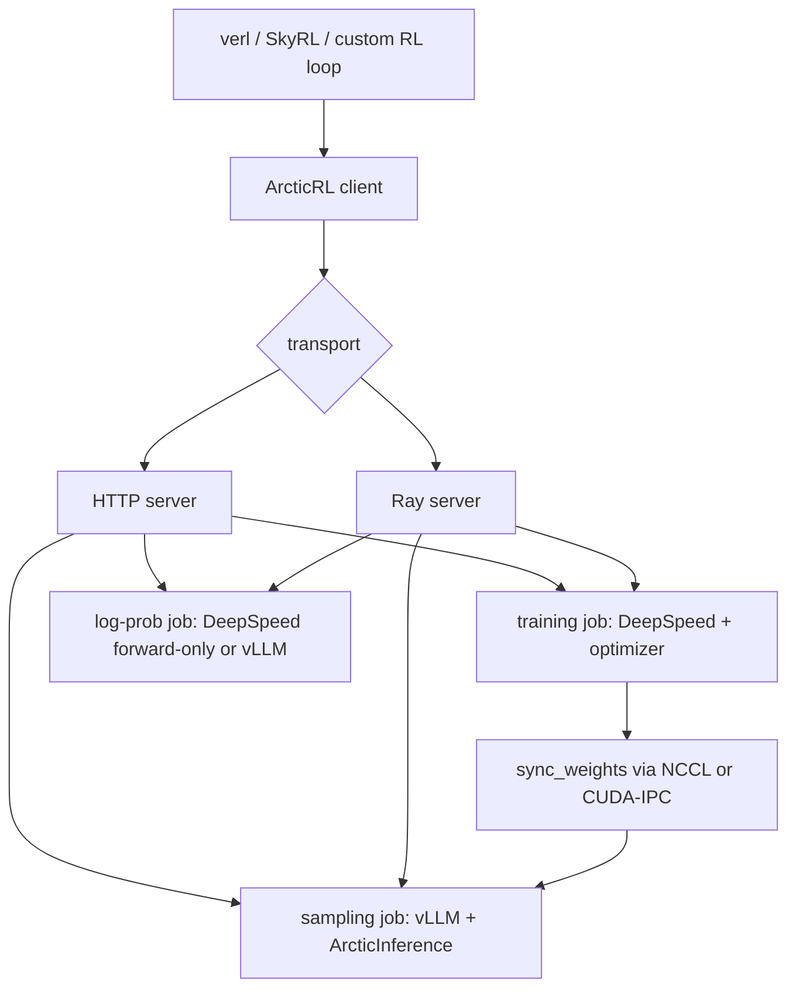

# Snowflake Arctic Platform：把后训练的重计算问题拆成可复用 GPU 后端

## 元信息

| 字段 | 内容 |
|---|---|
| 主题 | Snowflake Arctic Platform |
| 类型 | 开源代码项目深读 |
| 方向 | 大模型后训练 |
| 官方链接 | https://github.com/Snowflake-AI-Research/Arctic-Platform |
| 本周证据 | GitHub commit `c185b13920dcafd329bd67eefa65d3780693d29f`，committer 时间 `2026-08-17T17:57:24Z` |
| 主要阅读材料 | `README.md`、`docs/rl.md`、`docs/common.md`、`arctic_platform/rl/zorro_train/README.md`、`arctic_platform/integrations/verl/README.md`、`recipes/rl/verl/*`、`recipes/rl/skyrl/*` |

## TL;DR

1. **Arctic Platform 不是又一个完整 RLHF 框架**，它把后训练系统里最重的训练、采样、log-prob 和权重同步抽成 GPU 后端，让 verl、SkyRL 或自定义 loop 继续负责 rollout、reward、advantage 和 PPO/GRPO 调度。
2. **当前真正落地的是 Arctic RL**：训练引擎用 DeepSpeed，采样引擎用 vLLM + ArcticInference，log-prob 引擎可用 DeepSpeed forward-only 或 vLLM；三类 job 通过 Ray 或 HTTP 暴露同一组操作。
3. **ZoRRo Train 处理 RL 训练中的 prompt 冗余**：PPO/GRPO 往往对同一 prompt 采多条 response，README 给出的典型区间是 80-95% token 是重复 prompt；10K prompt × 10 条 1K response 的例子里，总 token 为 110K，唯一 token 只有 20K，冗余约 82%。
4. **ZoRRo Inference 处理 rollout decode 的 KV cache 重读**：Forest Cascade Attention 将共享前缀按组读一次，再把共享前缀注意力与每个样本自己的 suffix 注意力合成，目标是在数学等价前提下降低 memory bandwidth 浪费。
5. **证据不只来自口号**：verl 集成 README 给出两个 smoke test。GSM8K 的 4-step 单 H200 run 从 5164 tok/s 升到 6478 tok/s；BIRD text-to-SQL 的 20-step run 中 reward 窗口均值从 0.335 到 0.415，response 长度从 1116 到 920。
6. **边界同样明确**：仓库文档说 full post-training stack 仍在增量建设，SFT/distillation、合成数据生成与清洗属于 upcoming；`docs/rl.md` 也标注双 client 栈、batch/response schema 统一、on-prem `save_weights` 磁盘路径还在 WIP。
7. **研究价值在系统分层**：它把“算法论文里的 GRPO/PPO”与“真实后训练系统里的 GPU 后端、权重同步、长上下文重复计算、Ray 资源放置、vLLM 采样和框架适配”放在同一张图上，适合作为后训练基础设施的样本来读。

## 为什么这个项目值得看？

### 它回应的不是“缺少训练算法”，而是“训练系统不可移植”

Arctic Platform 的 README 把问题说得很具体：

1. 现有 post-training 框架往往各自实现后端。
2. 系统优化被绑在某个框架内部。
3. 性能经验很难从一个框架迁移到另一个框架。
4. 长上下文 RL 里，采样、log-prob、训练和权重同步之间的工程成本越来越高。

所以 Arctic 的主张不是替代 verl、SkyRL、TRL 或 Axolotl，而是提供一组可被这些框架调用的 heavy compute engines。

| 传统一体化框架 | Arctic Platform 的拆法 |
|---|---|
| 训练 loop、reward、advantage、模型执行、采样后端都塞在一个框架里 | 外部框架保留 loop；Arctic 接管训练、采样、log-prob、sync_weights |
| 优化通常和框架内部 batch 格式绑定 | 通过 client、server、registry 和 adapter 隔离格式 |
| 换框架时性能优化很难复用 | 同一套 DeepSpeed/vLLM/Ray/weight-sync 后端接到不同框架 |
| 长 prompt 多 response 的重复计算被动承受 | ZoRRo Train 和 ZoRRo Inference 分别处理训练与 decode 冗余 |

### 它的当前范围要读得很窄

项目标题说的是“full post-training stack”，但当前可验证的已落地范围更窄：

1. **已可用**：Arctic Reinforcement Learning。
2. **已可用**：ZoRRo Train prompt deduplication。
3. **已可用但依赖匹配构建**：ZoRRo Inference / Forest Cascade Attention。
4. **已在文档中规划**：SFT、distillation、合成数据生成与清洗。
5. **还不是稳定承诺**：统一 client 栈、batch schema、on-prem 权重保存磁盘路径。

这个边界很重要。它避免把一个活跃工程仓库误读成完整产品，也让我们能把深读重点放在已经有代码、文档、recipe 和测试数字支撑的部分。

## 系统结构：三类 GPU job 加一层薄 client

### 谁拥有 RL 循环？

`docs/rl.md` 的核心分工可以概括成一句话：

> RL 框架继续拥有 rollout、reward、advantage 和训练循环；Arctic 负责重计算。

为了避免长段描述，可以把调用链写成下面的 Mermaid：



这张图里有两个容易被忽略的设计点：

1. **transport 是实现细节**：HTTP 和 Ray 暴露的是同一组操作面。
2. **job 是资源边界**：training、sampling、log-prob 可以分开占 GPU，也可以 colocate 到同一组 GPU 上。

### Client API 暴露了哪些后训练操作？

`ArcticRLClientConfig` 和 `docs/rl.md` 给出一组很实用的操作面：

| 方法 | 作用 | 在后训练 loop 中的位置 |
|---|---|---|
| `generate()` | 采样 rollout | actor 生成 response |
| `log_probs()` | 算 old/ref log-prob | PPO/GRPO 比率或 reference 约束 |
| `fwd_bwd()` | 训练 forward/backward | policy update |
| `step()` | optimizer step | 参数更新 |
| `sync_weights()` | trainer 到 sampler 权重同步 | 更新采样引擎 |
| `sleep_inference()` / `wake_inference()` | vLLM VRAM time-sharing | colocate 时释放/恢复采样侧显存 |
| `weight_norm()` | 同步后调试 | 检查权重传输是否异常 |
| `reconnect_config()` | Ray handoff/reconnect | 长任务恢复 |

这个 API 的价值在于，它把后训练里容易散落在脚本和集群 glue code 里的动作变成了明确 contract。

### 配置为什么暴露这么多 GPU 与通信参数？

`ArcticRLClientConfig` 的字段看起来很多，但基本围绕四个问题：

| 配置簇 | 典型字段 | 它回答的问题 |
|---|---|---|
| 后端与通信 | `backend`、`comm_protocol`、`host`、`port` | 本地还是平台后端，用 HTTP 还是 Ray |
| 资源分配 | `training_gpus`、`sampling_gpus`、`log_prob_gpus`、`colocate` | 哪个 job 占多少 GPU，是否共享 GPU |
| 训练/推理引擎 | `ds_config`、`vllm_config`、`training_config`、`log_prob_engine` | DeepSpeed、vLLM、optimizer 和 log-prob 如何初始化 |
| 权重与复现 | `cuda_ipc`、`low_memory`、`checkpoint_path`、`full_determinism`、`seed` | 怎么同步、怎么恢复、怎么控制随机性 |

这不是为了把配置复杂化，而是因为真实 RL 后训练的瓶颈常常就在这些连接处。

## ZoRRo Train：为什么 prompt dedup 能改变长上下文 RL 成本？

### 问题形式

PPO/GRPO 中常见的采样方式是：

1. 对同一个 prompt 采样 `N` 条 response。
2. 对每条 response 评分。
3. 对每个 prompt-response pair 算 log-prob、entropy、policy loss。

如果 prompt 很长，重复处理 prompt 会变成主要成本。

可以用一个简单公式表示：

```text
Total tokens = N * prompt_len + N * response_len
Unique tokens = prompt_len + N * response_len
Redundancy = 1 - Unique tokens / Total tokens
```

代入 README 的例子：

```text
N = 10
prompt_len = 10,000
response_len = 1,000

Total = 10 * 10,000 + 10 * 1,000 = 110,000
Unique = 10,000 + 10 * 1,000 = 20,000
Redundancy = 1 - 20,000 / 110,000 ≈ 81.8%
```

这解释了为什么文档会强调典型 RL 训练中 80-95% token 可能是重复 prompt token。

### 机制不是“少算一点 token”，而是“保持梯度等价”

ZoRRo Train 的关键难点不在于发现重复 prompt，而在于不破坏训练语义。

| 阶段 | 做什么 | 为什么重要 |
|---|---|---|
| Prompt detection | 找出共享 prompt 的序列组 | 明确哪些 token 可以只算一次 |
| Deduplicated packing | 每个 unique prompt 只保留一次，把 response 接到对应 prompt 后 | 降低 attention 与 activation 重复 |
| Split attention | prompt-to-prompt 只对 unique prompt 算，response-to-full 保留每条 response 的上下文 | 避免把 response 间信息混在一起 |
| Reconstruction | 输出 log-prob / entropy 回到原始样本顺序 | 让外部 loss 仍按原始 rollout 使用 |
| Backward | patcher 保持梯度流可回传 | 不能只优化 forward，否则 policy update 会错 |

文档声称它在支持模型上与 naive forward/backward 数学等价，测试覆盖 dense、MoE、hybrid Qwen3 系列，含 eager、Flash Attention 2、padding/unpadding 和三种 logits optimization 模式。

### 支持模型边界也很清楚

当前 README 写出的支持模型族是：

1. `qwen3`
2. `qwen3-moe`
3. `qwen3-next-moe`
4. `qwen3.6`
5. `qwen3.6-moe`

这意味着 ZoRRo Train 还不是任意 Hugging Face causal LM 的通用加速器。它依赖模型 patcher 和 attention patcher，适配新模型需要理解该模型的 attention、position id、MoE 路径和 logits 计算方式。

### 性能预期应按 dedup ratio 读

文档给出的预期不是固定倍数，而是随共享 prompt 程度变化：

| 场景 | batch | unique prompts | prompt len | response len | 预期加速 |
|---|---:|---:|---:|---:|---:|
| 高 dedup | 16 | 1 | 8K | 1K | 约 2-4x |
| 中 dedup | 16 | 4 | 8K | 1K | 约 1.5-2x |
| 低 dedup | 16 | 16 | 8K | 1K | 约 1x |

这张表提示了一个研究边界：

1. 如果任务 prompt 很短，收益会被 response 和框架 overhead 稀释。
2. 如果每条样本 prompt 都不同，ZoRRo Train 基本不会带来收益。
3. 如果任务是长上下文、多采样、共享 prompt，比如 BIRD-SQL schema-heavy prompt，它的系统意义会更大。

## ZoRRo Inference：decode 侧的共享前缀重读

### 训练和推理的冗余位置不同

ZoRRo Train 处理 forward/backward 的重复 prompt。

ZoRRo Inference 处理 rollout decode 中的 KV cache 读取：

1. 多个 request 从同一个 prompt 开始。
2. 每个 request 生成自己的 suffix。
3. 标准 attention 在 decode 时会对每个 request 重新读取共享前缀 KV。
4. 当 prompt 很长、request 很多时，memory bandwidth 被共享前缀重复读取吃掉。

### Forest Cascade Attention 的核心拆法

可以把一次 attention 写成：

```text
Attention(q, K, V) = softmax(qK^T / sqrt(d)) V
```

如果 `K,V` 由共享 prefix 与样本自己的 suffix 组成：

```text
K = [K_shared, K_private]
V = [V_shared, V_private]
```

FCA 的直觉是：

1. 对一组共享 prefix 的请求，只读取一次 `K_shared,V_shared`。
2. 对每条请求各自读取 `K_private,V_private`。
3. 分别计算共享部分与私有部分的注意力统计量。
4. 用严格权重把两部分结果合成，保持与标准 attention 等价。

这不是近似 cache trick，而是把同一注意力计算重排成更少的共享前缀读。

## verl 与 SkyRL：为什么集成方式本身值得读？

### verl 插件化而不是 fork 内嵌

`arctic_platform/integrations/verl/README.md` 说明，Arctic backend 通过 `VERL_USE_EXTERNAL_MODULES=arctic_platform.integrations.verl.register` 注册到 verl。

注册项包括：

| 注册项 | Arctic 文件 | 功能 |
|---|---|---|
| `RemoteBackendRegistry("arctic")` | `adapter.py` | 把 ArcticRLClientWrapper 暴露成 verl RemoteBackend |
| actor-rollout worker slot | `worker.py` | 让 verl worker 调用 Arctic 后端 |
| `RolloutReplicaRegistry("arctic")` | `rollout.py` | 让 Arctic 的 vLLM engine 成为 rollout replica |
| `verl_grpo` loss | `grpo_loss.py` | 在 server 侧执行 verl-shaped GRPO loss |

这个设计有一个明显优点：

1. verl core 只需要通用 RemoteBackend 与 registry hook。
2. Arctic 维护自己的 runtime 与适配层。
3. 用户通过 Hydra search path 和 plugin hook 选择 `remote_backend=arctic`。

### Smoke test 数字证明“路径跑通”，不是证明最终 SOTA

verl integration README 给了两个 Golden Run。

| Run | 设置 | 关键数字 | 应该如何解读 |
|---|---|---|---|
| GSM8K | Qwen3-1.7B，single H200，4 steps | tok/s 从 5164 到 6478，step time 从 48.4s 到 38.4s | 确认单 GPU GRPO、eval path 和吞吐指标跑通 |
| BIRD | Qwen3-0.6B，single H200，20 steps | reward 窗口均值 0.335 到 0.415，response 长度 1116 到 920 | 说明模型开始学更短且更常正确的 SQL，不只是格式奖励 |
| BIRD validation | plugin + verl PR-B vs pre-plugin reference | reward 0.279 vs 0.294，execution success 0.531 vs 0.522，format correct 0.960 vs 0.943 | 与参考路径大致同量级，证明适配没有明显破坏评测 |

这里的边界要讲清：

1. 4-step GSM8K 的准确率接近零是预期，因为 run 太短。
2. 单 H200 0.6B BIRD 不是最终能力 benchmark。
3. 这些数字更像工程 smoke test，而不是论文式 SOTA 声明。

### SkyRL recipe 暴露了真正吃系统的任务形态

SkyRL BIRD recipe 对研究者更有启发：

1. BIRD prompt 是 schema-heavy，长尾可以接近 14K token。
2. 8K prompt cap 会把数据过滤到几乎不可用，所以 recipe 默认 16K。
3. 4-node 32B run 使用 32K prompt、4K response、128 prompts × 16 samples，也就是每 step 2048 trajectories。
4. 这种形态正好放大 shared prompt、长上下文、rollout engine、weight sync 和 Ray data placement 的系统成本。

这说明 Arctic 的目标任务不是短 prompt 玩具 RL，而是长上下文、多采样、多 GPU 的后训练工作负载。

## 用一个伪代码复原 Arctic RL 的控制流

下面不是仓库原代码，而是对 `docs/rl.md`、verl adapter 和 recipe 的概念化整理：

```python
Input:
    prompts, policy_model, reward_fn, grpo_config
State:
    client = create_arctic_rl_client(
        training_gpus=T,
        sampling_gpus=S,
        log_prob_gpus=L,
        colocate=True,
        ds_worker_config={"zorro_train_enable": True},
        arctic_inference_config={"zorro_inference": {"enable": maybe}},
    )

for step in range(training_horizon):
    responses = client.generate(prompts, sampling_params)
    rewards = reward_fn(prompts, responses)
    advantages = compute_group_advantages(rewards, grpo_config)

    old_log_probs = client.log_probs(prompts, responses)
    batch = build_grpo_wire_batch(
        prompts=prompts,
        responses=responses,
        old_log_probs=old_log_probs,
        advantages=advantages,
    )

    metrics = client.fwd_bwd(
        batch,
        processing={"loss_fn": "verl_grpo", "config": grpo_config},
    )
    client.step()

    if step % sync_interval == 0:
        client.sync_weights(cuda_ipc=True, low_memory=True)

Output:
    checkpoints, rollout metrics, validation metrics
Failure boundaries:
    unsupported model patcher, mismatched vLLM/ArcticInference build,
    stale Ray cluster, non-routable host, missing checkpoint_path,
    prompt distribution with low dedup ratio
```

这个伪代码把 Arctic 的重点显出来：

1. 它不定义 reward。
2. 它不替用户选择 GRPO 是否加 KL。
3. 它不替代外部 trainer。
4. 它把最贵的 compute 和同步路径稳定成可复用服务。

## 代码结构中的几个关键边界

### `common` 是未来 SFT 与当前 RL 共用的地基

`docs/common.md` 把 shared server infrastructure 放在 `arctic_platform.common`：

| 模块 | 角色 |
|---|---|
| `deepspeed_worker.py` | DeepSpeed train / log-prob Ray actor |
| `http_server.py` | FastAPI HTTP server |
| `ray_server.py` | in-process Ray server |
| `registry.py` | loss 与 post-processor registry |
| `utils/weight_sync.py` | 权重同步工具 |
| `utils/ray_pg.py` | colocate placement group |
| `utils/record_replay.py` | 可选 record/replay harness |

这说明项目正在把 RL 专有逻辑往上层收，底层 server、registry、batch、metric aggregation 会成为后续 SFT 的复用层。

### Metric 聚合有 token mean 的明确语义

文档说明 worker 会发出 `{name}.sum` 和 `{name}.tokens`，再按：

```text
metrics["loss"] = Σ(loss.sum) / Σ(loss.tokens)
```

做全局 token mean。

这个细节很实际。分布式训练里，如果不同 rank 或 microbatch 的有效 token 数不同，简单平均 loss 会给短序列或 padding 多的 shard 错误权重。Arctic 把 metric 聚合写成 token-weighted mean，说明它在处理变长后训练 batch。

### Gotchas 列表比宣传更有信息量

`docs/common.md` 的 gotchas 很适合判断项目成熟度：

1. 多节点必须绑定 routable host，不能默认 `localhost`。
2. 并发 job 要区分 `MASTER_PORT` 与 `ARL_WEIGHT_SYNC_PORT`。
3. training-only server 不应误开 sampling GPUs，除非 inference deps 已安装。
4. 新 training job 必须有 `checkpoint_path`。
5. HTTP standalone 默认端口 7000，统一 client 默认 8000，SFT demo 又可能自选端口。

这些不是缺点，而是暴露了当前工程 still-you-need-to-know 的地方。

## 逐文件证据：这个项目怎样把“后训练系统”落到代码上？

### `config.py`：把资源拓扑写进类型

`ArcticRLClientConfig` 不是普通配置文件，而是把后训练工作负载的资源拓扑显式化。

| 字段 | 直接含义 | 研究者应关注的隐含假设 |
|---|---|---|
| `training_gpus` | DeepSpeed training job 的 GPU 数 | policy update 的吞吐与显存主要由它决定 |
| `sampling_gpus` | vLLM sampling job 的 GPU 数 | rollout 速度是否跟得上训练 |
| `log_prob_gpus` | old/ref log-prob job 的 GPU 数 | 是否需要单独 reference path |
| `log_prob_engine` | `vllm` 或 `deepspeed` | log-prob 是走推理栈还是训练栈 |
| `colocate` | training/sampling/log-prob 是否共享 GPU | 省机器还是隔离资源 |
| `cuda_ipc` | colocate 权重同步是否走 CUDA-IPC | 减少 CPU-file path 代价，但约束更强 |
| `low_memory` | CUDA-IPC 是否逐参数流式同步 | 降峰值显存，可能增加同步时间 |

这个设计传递了一个判断：后训练性能不是一个单一 “tokens per second” 数字，而是由 rollout、log-prob、backward、optimizer step、weight sync 和 idle gap 共同决定。

### `adapter.py`：verl 侧只保留 forwarder

verl adapter 中 `requires_single_forwarder()` 返回 `True`，这个小细节很关键。

它说明 Arctic 的并行语义不是让 verl 创建一堆 actor worker 后各自做模型执行，而是：

1. verl 侧保留一个 forwarder 作为控制入口。
2. Arctic 内部拥有 training/sampling/log-prob 并行。
3. 真正的 GPU job、Ray actor、vLLM replica 由 Arctic server 组织。

这会改变调试方式：

| 常规 verl 调试 | Arctic backend 调试 |
|---|---|
| 看 actor worker group 是否每个 rank 都正常 | 看 Arctic server job 是否 initialized/running |
| 看 FSDP worker 的显存与 step time | 看 training/sampling/log-prob job 的资源分配 |
| 看 rollout worker 是否阻塞 | 看 vLLM replica、prefix cache、sleep/wake |
| 看 trainer 是否能读写 checkpoint | 看 checkpoint_path 与 reconnect_config |

### `grpo_loss.py`：token 对齐不是实现细节

`grpo_loss.py` 里有一个很值得注意的修正：`shift_log_probs_left()` 的注释说明，旧路径曾经用 roll 来模拟 predict-next convention，但这会让 advantage `A[k]` 的梯度落到 `log P(response_token[k-1])` 上。

换句话说，系统优化不能只保证 shape 对齐，还必须保证“奖励、优势、log-prob 和 token”语义对齐。

可以把 GRPO/PPO 的核心比率写成：

```text
ratio_t = exp(logπ_new(a_t | s_t) - logπ_old(a_t | s_t))
loss_t = - min(ratio_t * A_t, clip(ratio_t, 1-eps, 1+eps) * A_t)
```

如果 `logπ_new(a_t)` 实际错位到 `a_{t-1}`，第一次迭代可能因为 old/new 同错而看起来正常，但 policy gradient 已经更新到错误 token。

这正是后训练系统容易出隐蔽 bug 的地方：

1. tensor shape 全部正确。
2. loss 数值不会立刻爆炸。
3. 评测早期可能还在噪声范围内。
4. 但 token-level credit assignment 已经偏移。

Arctic 把这类逻辑放在 server-side loss 与 adapter 注释中，是工程质量上的强信号。

## 从 BIRD recipe 看长上下文 RL 的真实成本

### BIRD 为什么比 GSM8K 更能暴露系统问题？

GSM8K 的问题通常短，reward 是 final answer exact match。它适合 smoke test，但不会充分暴露长上下文冗余。

BIRD text-to-SQL 不同：

1. prompt 包含数据库 schema。
2. recipe 会把 foreign key、sample rows、column examples、BIRD column description 都塞进 prompt。
3. 长尾 schema-heavy prompt 可以接近 14K tokens。
4. reward 需要执行 SQL 并比较结果集。
5. 多 response 采样会把同一个 schema 重复展开很多次。

这刚好构成 Arctic 的压力测试：

| BIRD 特征 | 系统压力 | Arctic 机制 |
|---|---|---|
| schema 长 | attention cost 高 | ZoRRo Train prompt dedup |
| 同一题多采样 | prompt 重复率高 | rollout group 级 dedup |
| SQL 执行 reward | trainer loop 不能被后端替代 | 外部框架继续控制 reward |
| 32B + 多节点 | 权重同步成本高 | NCCL / CUDA-IPC sync |
| vLLM rollout | sampling 与 training 需要频繁切换 | colocate + sleep/wake |

### 为什么 recipe 里的 prompt cap 是证据？

SkyRL recipe 说 8K cap 会把 BIRD 数据过滤到零，默认 16K；4-node 32B run 需要 32K prompt 与 4K response。

这不是普通使用说明，而是对任务分布的证据：

1. 如果 benchmark prompt 已经超过 8K，短上下文优化结论不能直接迁移。
2. 如果每个 prompt 要采 16 条 response，重复 prompt 不是边角情况。
3. 如果每 step 有 2048 trajectories，权重同步和采样后端不是可忽略 overhead。

因此 Arctic 的研究问题可以更精确地说成：

```text
给定长 prompt、多 response、多 GPU、频繁 policy update 的 RL 后训练，
怎样把 shared context 的重复计算从训练和采样路径中拿掉，
同时不破坏 PPO/GRPO 的 token-level credit assignment？
```

## 复现实验应该怎样设计？

### 不要只跑一个端到端分数

端到端 reward 或 accuracy 容易被数据、模型初值、reward noise、sampling temperature、KL 设置和 prompt 模板影响。

更好的实验应该拆成四层：

| 层级 | 指标 | 目的 |
|---|---|---|
| 算子等价 | log-prob diff、gradient norm diff | 验证 ZoRRo 与 naive path 是否等价 |
| 单 step 系统 | fwd_bwd time、generate time、sync time | 找出瓶颈到底在哪 |
| 训练轨迹 | reward、response length、format correct | 看学习是否正常 |
| 端到端资源 | GPU hours、失败率、restart 成功率 | 判断系统是否真的省钱且稳定 |

### A/B baseline 要控制什么？

如果比较 Arctic backend 与原生 FSDP 或 stock verl，至少要控制：

1. 同一模型 checkpoint。
2. 同一 prompt 模板与 token cap。
3. 同一 `rollout_n` / `N_SAMPLES`。
4. 同一 global batch、mini batch、response length。
5. 同一 reward 函数与执行环境。
6. 同一 GPU 型号、节点数、网络拓扑。
7. 同一 vLLM、Flash Attention、CUDA、PyTorch 版本或明确记录差异。

否则很容易把环境差异误读成 ZoRRo 或 Arctic 后端收益。

### 最小可解释实验矩阵

一个研究者可以从下面的矩阵开始：

| 变量 | 取值 | 预期观察 |
|---|---|---|
| prompt length | 1K / 8K / 16K / 32K | prompt 越长，dedup 收益越明显 |
| rollout samples | 1 / 4 / 8 / 16 | 共享 prompt 越多，ZoRRo Train 越有效 |
| unique prompt ratio | 1.0 / 0.5 / 0.25 / 0.0625 | ratio 越低，冗余越高 |
| sync mode | CPU-file / NCCL / CUDA-IPC / low-memory CUDA-IPC | 比较 step gap 与显存峰值 |
| backend | native FSDP / Arctic RL | 看系统拆分是否抵消或放大收益 |

这组实验比单个 headline speedup 更能解释机制。

## 和安全/可靠性相关的边界

### 这不是安全沙箱

Arctic Platform 处理的是训练与推理后端效率，不是 agent sandbox 或恶意代码隔离。

研究者不要把下面这些能力误当成安全保证：

1. Ray job 隔离不等于安全隔离。
2. vLLM rollout replica 不等于工具执行沙箱。
3. record/replay harness 不等于攻击回放防护。
4. checkpoint_path 和 shared filesystem 不等于供应链可信边界。

如果把 Arctic 用到 coding agent 或 tool-use agent RL，环境执行仍应由专门 sandbox、权限模型和审计系统承担。

### 后训练系统自己的可靠性问题

这个项目对可靠性的启发反而在系统层：

| 风险 | 可能表现 | 需要的证据 |
|---|---|---|
| 权重同步不一致 | sampler 用旧 policy 生成 rollout | `weight_norm()`、sync validation logs |
| log-prob 错位 | loss 正常但学习方向错 | token-level alignment tests |
| Ray cluster 状态残留 | job 启动失败或挂到旧集群 | `ray_auto_attach=False` 对照 |
| 端口冲突 | HTTP server 或 NCCL rendezvous 卡死 | 明确 `MASTER_PORT` / `ARL_WEIGHT_SYNC_PORT` |
| dependency mismatch | vLLM/ArcticInference/Fa2/Fa3 不兼容 | pinned requirements 与 smoke test |

这些风险解释了为什么仓库文档反复强调 pinned deps、hostfile、routable IP、checkpoint path 和 smoke test。

## 与近期后训练工作的关系

### 它和 SimpleOPD / LOPD 的层级不同

近期很多后训练工作关心“如何构造 teacher-student、on-policy distillation、reward 或 policy update”。

Arctic Platform 更像回答另一个问题：

| 问题层 | 代表问题 | Arctic 的位置 |
|---|---|---|
| 算法层 | OPD、GRPO、PPO、SFT 怎么设计目标函数 | 不主打新目标函数 |
| 数据层 | prompt、response、reward、synthetic data 怎么构造 | 当前只部分涉及，更多在 roadmap |
| 系统层 | 多 GPU 长上下文 rollout 如何降低重计算 | Arctic 的核心 |
| 框架层 | verl、SkyRL、未来 TRL 如何共享后端 | Arctic 的 adapter 与 client |

这也解释了为什么它适合放在“大模型后训练”方向，而不是单纯“工程工具”。

### 它对 Agent 后训练也有潜在影响

Agent RL 往往有以下特征：

1. prompt 长，包含工具说明、历史轨迹、环境状态。
2. 同一任务会采样多条行动轨迹。
3. reward 可能来自环境执行结果。
4. rollout 和训练之间需要频繁同步策略。

这些特征会放大 Arctic 关心的系统问题：

| Agent RL 特征 | 对应 Arctic 机制 |
|---|---|
| 同一初始任务多 trajectory | ZoRRo Train 的 prompt dedup |
| 长工具说明和环境状态 | ZoRRo Inference 的共享 KV 读取 |
| 环境执行 reward 慢 | 需要外部框架保留 reward loop |
| 策略频繁更新 | `sync_weights()`、CUDA-IPC、low-memory sync |
| 多框架实验 | adapter + plugin hook |

所以 Arctic Platform 的后续影响可能不只在数学题或 text-to-SQL，也可能在 coding agent、browser agent、tool-use agent 的大规模 RL 训练。

## 证据边界与失败模式

### 主张、机制、证据、边界

| 主张 | 机制 | 证据 | 边界 |
|---|---|---|---|
| 后训练系统优化应从框架内部抽离 | Arctic 把 training、sampling、log-prob、sync_weights 做成独立 GPU job | README 的项目范围与 `docs/rl.md` 的三引擎图一致 | 外部 trainer 仍要处理 rollout、reward、advantage 和数据 |
| 长上下文 RL 的 prompt 重复是主要浪费 | ZoRRo Train 对共享 prompt 去重、重排 attention、再恢复 log-prob/entropy 顺序 | README 给出 80-95% 重复 token 区间和 10K prompt × 10 response 的 82% 冗余例子 | 低 dedup ratio 或短 prompt 任务收益有限 |
| rollout decode 也有共享前缀浪费 | ZoRRo Inference / FCA 对共享 KV prefix 分组读取 | README 与 `docs/rl.md` 写明它接到 ArcticInference/vLLM，并由 `zorro_inference.enable` 打开 | 需要匹配的 vLLM + ArcticInference 构建，本文没有实测 |
| verl 适配不是把 Arctic 代码塞进 verl | plugin hook 注册 RemoteBackend、worker、rollout replica 和 server-side GRPO loss | integration README 与 `adapter.py` 的注册路径互相印证 | 上游 verl 的 paired registry hook 仍是前提 |
| smoke test 证明执行链路，不证明最终能力 | 单 H200 GSM8K、BIRD text-to-SQL 运行给出吞吐、reward、format、execution success | integration README 的 Golden Run 表格 | 训练步数短、模型小、任务单一，不能外推到所有 workload |

这张表给出本文的判断边界：Arctic Platform 的可信之处在于把后训练的系统问题拆成可观察接口，并给了足够多的 recipe 与 smoke-test 证据；它尚不能被读成“所有 RLHF 任务通用提速”的结论。

### 为什么本文没有引用图片？

这次深读没有下载本地图片，是有意选择：

1. 项目关键证据不是截图，而是 README、docs、配置字段、adapter 代码和 recipe 表格。
2. `docs/rl.md` 的系统图可以用 Mermaid 更准确重写，避免把仓库 SVG 当成证据。
3. ZoRRo Train 的冗余问题更适合用公式、token 计算和表格解释。
4. smoke-test 结果已经是结构化数字，直接转成 Markdown 表格比贴图更便于审计。
5. 不引用图片也能保持正文自包含，读者不打开外部页面即可理解主张、机制、证据和边界。

### 当前证据能说明什么？

1. 仓库在本周内仍活跃更新，最新确认 commit 是 2026-08-17。
2. README 和 docs 给出了清晰的工程分层。
3. ZoRRo Train 有具体冗余模型、支持模型列表、测试路径和预期加速区间。
4. verl integration 有 smoke-test 表格，说明插件路径、weight sync 和 eval path 至少跑通过。
5. recipes 给出单 GPU GSM8K、多节点 BIRD、SkyRL A/B baseline 等可复现实验骨架。

### 当前证据不能说明什么？

1. 不能证明 Arctic 在所有后训练任务上都比原生 verl 或 SkyRL 更快。
2. 不能证明 ZoRRo 对低 dedup ratio 任务有明显收益。
3. 不能证明所有模型族都能直接支持，当前 patcher 明确偏 Qwen3 系列。
4. 不能证明 SFT、distillation、synthetic data pipeline 已经完整可用。
5. 不能证明 on-prem production 运行已经消除了所有 Ray、端口、checkpoint、schema 和 dependency 风险。

### 研究者复现时最该先检查什么？

| 检查项 | 原因 |
|---|---|
| prompt dedup ratio | 决定 ZoRRo Train 是否有收益 |
| 模型是否在支持列表 | patcher 不支持时不能强行推论 |
| vLLM + ArcticInference 版本 | ZoRRo Inference 依赖匹配构建 |
| Ray cluster 与 hostfile | 多节点最容易死在通信层 |
| `checkpoint_path` 与共享文件系统 | resume、sync 和多节点权重路径依赖它 |
| baseline 是否同超参 | A/B 必须控制 batch、prompt len、response len、samples、GPU |

## 结论

Arctic Platform 最值得带走的判断是：

1. **后训练瓶颈正在从“有没有 RL 算法”转向“算法如何在长上下文、多采样、多 GPU 上可承受地运行”。**
2. **prompt dedup 与 KV prefix dedup 把 RL 里的一个隐性事实显式化了：多 response 采样并不是独立样本，它们共享大量上下文。**
3. **可复用后端比单框架优化更有外溢价值**，因为 verl、SkyRL、未来 TRL/Axolotl/PrimeRL 都可能面对同样的训练、采样、log-prob 和权重同步问题。
4. **当前项目还应被读作活跃工程栈，而不是已闭环平台**：RL 部分已经有实质实现和 smoke-test 证据，SFT/蒸馏/数据管线仍需要后续 PR 与真实 recipe 验证。

继续追问时，最有价值的不是“它快不快”这个单点问题，而是下面三组实验：

1. 在相同 verl/SkyRL 超参下，按 prompt length 与 rollout_n 扫描 ZoRRo Train 的收益曲线。
2. 在 coding agent 或 tool-use agent 任务上测 shared system prompt / trajectory prefix 是否产生同类冗余。
3. 用相同硬件比较 NCCL、CUDA-IPC、low-memory sync 对 step time、显存峰值和失败率的影响。

如果这些实验成立，Arctic Platform 会成为后训练系统研究里一个很好的参照点：它把论文中常被一笔带过的“rollout 很贵”“log-prob 很贵”“sync 很贵”，拆成了可测、可替换、可复用的工程部件。
