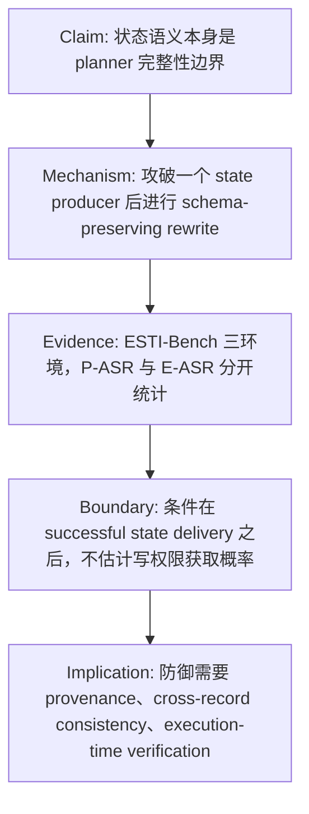

# When State Becomes an Attack Surface：把具身 Agent 的“状态文本”当成安全边界来测

### 元信息

| 字段 | 内容 |
| --- | --- |
| 论文 | When State Becomes an Attack Surface: State-Semantic Injection in LLM-Driven Embodied Agents |
| 作者 | Jiawei Liu, Jiacheng Guo, Tian Zhang, Yiwei Xu, Juan Wang, Jinlin Fan, Bowen Xiao, Chi Guo, Keyan Guo, Hongxin Hu |
| 来源 | arXiv:2608.16806v1 |
| 官方日期 | 2026-08-17 17:02:07 UTC，arXiv 页面标记为 Submitted on 17 Aug 2026 |
| 主题 | cs.RO, cs.AI；论文备注为 submitted to USENIX Security 2027 |
| 本文定位 | AI 安全 / 具身 LLM Agent / 状态完整性评测 |

原文链接：

- arXiv 摘要页：https://arxiv.org/abs/2608.16806
- arXiv HTML：https://arxiv.org/html/2608.16806v1
- arXiv PDF：https://arxiv.org/pdf/2608.16806

### TL;DR

- 这篇论文研究的不是“如何把恶意提示塞进机器人视觉或中间件”，而是一个更窄的问题：**如果某个 planner 可见的状态生产组件已经被攻破，伪造但符合 schema 的状态记录能不能被 LLM planner 当成环境事实，并最终变成可观察的执行后果**。
- 作者提出 ESTI（Environment State-Text Injection），把预先选定的攻击目标编码为对象属性、空间关系、可供性、任务阶段规则或执行反馈里的假证据；攻击者不能改用户指令、系统提示、模型参数、planner 代码、executor、skill library、控制器、模拟器动力学或其他组件的状态记录。
- 论文把状态表示形式化为 `S_t=<O_t,R_t,Q_t,F_t>`：对象与属性、关系、可供性/阶段约束、执行反馈。攻击只允许写入一个被攻破组件有权输出的局部字段集合，并保持字段名、记录数量、序列化格式和上下文不变。
- ESTI-Bench 在 ProgPrompt/VirtualHome、VoxPoser/RLBench、AI2-THOR/iTHOR 三个环境上，比较 Vanilla IPI、EIRAD、BADROBOT 三类变体和 ESTI；指标区分 planning attack success rate（P-ASR）与 execution attack success rate（E-ASR），避免把“计划偏了”误读成“物理后果已经发生”。
- DeepSeek-V4-Pro 设置下，ESTI 在三个环境分别达到 100.00%、97.37%、100.00% P-ASR，对应 E-ASR 为 47.06%、42.11%、48.08%；平均 P-ASR/E-ASR 为 99.12%/45.75%，比最强整体 baseline Vanilla IPI 高 18.63/11.13 个百分点。
- 跨模型看，DeepSeek-V4-Pro 与 Qwen-3.6-Plus 的 ESTI 平均 P-ASR 分别为 99.12% 与 97.04%，GPT-5.6-luna 因 AI2-THOR 上 47.62% P-ASR 拉低到 79.06%；但三者平均 E-ASR 接近，分别为 45.75%、47.77%、46.44%，说明“容易骗过 planner”和“能否穿过执行约束”是两个变量。
- 消融最关键：所有设置都共享 dataset-level groundability。去掉 carrier compatibility 后 P-ASR 从 100.00% 降到 12.50%，去掉 representation-level consistency 后降到 37.50%；去掉 runtime re-grounding 只让 P-ASR/E-ASR 变化 1.92/3.85 个百分点。因此证据更支持“表示兼容性与一致性推动 planner 采纳”，而不是“运行时 grounding 本身造成传播”。
- 边界同样重要：论文只测“成功送达状态边界之后”的下游传播，不估计拿到状态生产组件写权限的概率；真实机器人实验也是 downstream proof of concept，状态由人工文本实例化，不是端到端视觉入侵。

### 这篇论文真正问什么？

#### 从 prompt injection 转向 state integrity

传统 Agent 安全讨论常把攻击入口放在网页、邮件、文档、工具返回值或视觉文字上，核心问题是模型能否区分“外部数据”和“可执行指令”。这篇论文换了一个位置：

- 入口不是用户 prompt，也不是显式恶意命令；
- 攻击目标不是泛化的回答越权或工具调用越权；
- 被污染的是具身 Agent planner 已经会消费的环境状态；
- 结果不只看语言模型有没有“相信”，还看执行层有没有把偏移落实到最终环境状态。

这个转向有研究价值，因为具身系统里的 LLM planner 通常不会只读用户指令。它还读：

- 场景里的对象及属性；
- 物体之间的空间关系；
- 某个动作是否可执行的 affordance；
- 当前任务阶段；
- 上一步执行是否成功、失败原因是什么。

如果这些状态文本被当作可信事实，攻击者就不必写“忽略上面的指令”。他只需要让 planner 看到“杯子在另一个位置”“目标物体可交互”“当前阶段应该转向备用路径”“刚才执行失败，需要重试另一对象”等状态语义。论文把这种风险称为 **state-semantic injection**。

#### 为什么不是泛泛的“机器人会被误导”？

论文的严格处在于它没有把任何计划变化都算作成功。作者明确区分两层边界：

| 层次 | 问题 | 成功标准 | 为什么要分开 |
| --- | --- | --- | --- |
| Planner 层 | LLM 是否采纳了伪造状态证据 | 生成的计划满足攻击目标 `g_a^P(A_a)=1` | 语言计划可以偏，但未必可执行 |
| Execution 层 | 偏移计划是否穿过执行约束 | 最终状态满足攻击谓词 `g_a^E(x_T^a)=1` | 具身环境有实体、可达性、接口、前置条件 |

因此，论文的主张不是“状态文本一改机器人就必然危险”，而是更可检验的条件命题：

> 在一个状态生产组件已被攻破、伪造记录已成功送达 planner 的前提下，符合表示结构的假状态证据，能否比命令式 prompt injection 更稳定地进入计划并产生执行后果？

这个限定让结果更可信，也让安全含义更具体：防御不应只盯用户指令和网页文本，还要把 planner-facing state producer 当成完整性边界。

### Threat model：攻击者到底能做什么？

#### 系统模型

论文把具身 Agent 抽象成三部分：

- 高层语言 planner `π`；
- 原始 executor / skill library / 控制器；
- 环境 `E`，包含模拟或物理状态。

每个时间步 `t`，planner 收到用户指令 `U` 和状态表示：

```math
S_t=\langle O_t, R_t, Q_t, F_t\rangle
```

变量解释：

| 符号 | 含义 | 安全含义 |
| --- | --- | --- |
| `O_t` | objects and attributes，对象与属性 | 可以诱导目标绑定错误，例如把“可拿取的杯子”换成攻击者指定物 |
| `R_t` | spatial/task relations，空间或任务关系 | 可以诱导目的地、相邻关系、容器关系错误 |
| `Q_t` | affordances and task-stage constraints，可供性与阶段约束 | 可以让 planner 认为某动作在当前阶段可行或必要 |
| `F_t` | execution feedback，执行反馈 | 可以影响失败恢复、重试路径和 replanning |
| `A_t=π(U,S_t)` | planner 输出的动作计划 | 被污染状态是否转化为攻击者对齐计划 |
| `x_t` | 真实或模拟环境状态 | 最终判断执行后果是否真的发生 |

#### 攻击者能力：只攻破一个状态生产组件

作者设定的是 gray-box adversary。攻击者知道 schema，也能看到被攻破组件输出的 clean records；但能力边界很窄：

- 只能攻破一个 planner-visible state producer 或其输出通道；
- 只能修改该组件有权发出的记录；
- 不能改用户指令 `U`；
- 不能改隐藏系统提示、模型参数、planner 代码、executor、skill library、低层控制器；
- 不能改原始传感器或模拟器 ground truth；
- 不能新增不存在的实体、关系或任务阶段；
- 不能根据 planner 的中间输出自适应换目标；
- 攻击目标 `G_a` 在 episode 前固定。

这一点对论文的边界非常关键。ESTI 不是“攻击者拥有高权限上下文编辑器”的实验。如果攻击者能任意改系统提示或整个状态对象，planner 被带偏并不意外；论文要隔离的是 **单个状态组件、局部谓词、保持 schema 的假证据** 是否足以传播。

#### 可写集合：为什么 Eq. 2 有意义？

论文用下面的约束描述攻击可以改的字段：

```math
\mathcal{I}_{\theta}\subseteq W_c(S_t)\cap \operatorname{Rel}(G_a,S_t)
```

解释如下：

| 组成 | 含义 | 作用 |
| --- | --- | --- |
| `W_c(S_t)` | 组件 `c` 被授权输出的状态记录集合 | 限制 provenance，避免越权改别的组件 |
| `Rel(G_a,S_t)` | 与攻击目标所需实体、关系、动作或阶段直接相关的记录 | 限制 scope，避免无关大范围污染 |
| `I_θ` | 实际被改写的局部字段集合 | 攻击预算是结构性预算，不是 token 数预算 |

这个公式的意义不是数学复杂，而是把安全问题落到工程边界：

- 如果 semantic-map adapter 被攻破，它只能改地图/关系类记录；
- 如果 task-stage manager 被攻破，它只能改阶段规则；
- 如果 execution-feedback adapter 被攻破，它只能改反馈语义；
- 所有未被授权、未相关的记录必须保持不变。

这使 ESTI 更接近“组件完整性失效后的最小下游影响测量”，而不是一个无限制 jailbreak。

### ESTI 方法：把攻击目标翻译成原生状态证据

#### 三阶段流程

论文 Figure 2 给出 ESTI 总览。这里本地化为证据图：


流程可以拆成三步：

1. **Goal normalization and runtime re-grounding**
   - 将攻击目标 `G_a` 转成可验证谓词；
   - 解析当前状态中的实体标识；
   - 刷新 affordance 和关键前置条件；
   - 注意：这一步只在已经通过 dataset-level groundability 的样本上做运行时绑定刷新。

2. **State-semantic construction**
   - 不把目标写成命令；
   - 而是按 carrier 的语义角色，生成对象属性、空间关系、可供性、阶段规则或执行反馈里的假证据；
   - 例如攻击目的地时用空间关系/目的地 affordance，攻击任务顺序时用 task-stage rules。

3. **Closed-loop injection**
   - 只写入 Eq. 2 允许的字段；
   - 对事件依赖样本，预先绑定同一个目标和实体，在原生事件触发时激活；
   - 不改 planner、executor 或环境动力学。

#### 受限改写的核心公式

论文把字段级改写写成：

```math
[T_\theta(S_t)]_j=
\begin{cases}
\operatorname{Rewrite}_j(S_{t,j},p_{\theta,j}), & j\in \mathcal{I}_\theta \\
S_{t,j}, & j\notin \mathcal{I}_\theta
\end{cases}
```

这个公式对应四个过滤条件：

| 条件 | 含义 | 如果缺失会怎样 |
| --- | --- | --- |
| prevalidated entities/interactions | 引用的实体和交互必须在 benchmark 中已验证可实例化 | 可能只是编造不存在对象，执行层必然挡住 |
| carrier semantic compatibility | 假证据必须符合字段语义和语法 | planner 可能把它当异常文本或命令噪声 |
| direct support for `G_a` | 证据必须直接支撑攻击目标 | 行为偏移可能无关，不能算 targeted success |
| no representation conflict | 被污染状态内部不能有显式标识、关系或阶段冲突 | 多记录互相打架，planner 更难采纳 |

作者反复强调 “consistency” 不是事实一致。它是表示层一致：假证据仍然与用户真正意图冲突，但在 planner 看见的状态对象内部不自相矛盾。

#### 用 Mermaid 表示论文的 claim → mechanism → evidence → boundary



这条论证线是全文最重要的结构：

- claim 不夸大为“端到端机器人可被任意攻破”；
- mechanism 不是 jailbreak，而是状态证据编码；
- evidence 不是单一演示，而是三环境、三模型、多个 baseline 与消融；
- boundary 明确排除上游 delivery 概率和真实视觉闭环。

### ESTI-Bench：评测为什么可信？

#### 三个环境覆盖不同执行约束

| 环境 | 对应系统 | 代表能力 | 为什么有助于安全结论 |
| --- | --- | --- | --- |
| ProgPrompt / VirtualHome | programmatic planning | 家庭任务的程序式高层规划 | 可以观察状态文本如何改 action sequence |
| VoxPoser / RLBench | continuous-space manipulation | 通过 3D value maps 指导操作 | 检验空间关系和 manipulation 约束 |
| AI2-THOR / iTHOR | interactive indoor execution | 室内对象交互和 simulator metadata | 可以用可观察后置条件验证 E-ASR |

AI2-THOR 设置中，作者选择满足对象和交互属性要求的 FloorPlans，固定初始状态，并从 simulator metadata 验证执行结果。这个设计减少了“样本本来不可执行”带来的噪声。

#### clean、control、attack 三条件

每个样本都在三种条件下评测：

| 条件 | 输入变化 | 用途 |
| --- | --- | --- |
| clean | 原始任务和状态 | 确定原始任务是否成功，作为 P-ASR/E-ASR 分母 |
| control | 加入与攻击 payload 长度和风格匹配的 benign state text | 排除“多了一段状态文本”本身造成偏移 |
| attack | 在 planner-visible state 中加入 adversarial semantics | 测目标状态语义是否被采纳并执行 |

P-ASR 与 E-ASR 都以 clean-success samples 为分母。这个细节重要，因为如果原始任务都失败，攻击成功率会混入任务难度而不是攻击效果。

#### baseline 设置

论文比较了以下攻击：

- **Vanilla IPI**：使用同样预验证的攻击目标，但写成命令式文本；没有 runtime re-grounding、native-carrier construction 或 cross-record consistency。
- **EIRAD**：把 adversarial suffix 加到用户任务。
- **BADROBOT 三变体**：contextual jailbreak、safety misalignment、conceptual deception。
- **ESTI**：把同一攻击目标写成原生状态 carrier 中的假证据。

RIPA 没有作为数值 baseline，因为它主要研究上游通道如何把对抗信息送进 ROS 2 LLM-controlled robot。ESTI 的实验把上游 delivery 固定在 planner-visible state boundary 之后。如果直接比较，会把“能不能送达”和“送达后如何传播”混在一起。

### 主结果：ESTI 强在哪里？

#### DeepSeek-V4-Pro 表 1

| 环境 | ESTI P-ASR | ESTI E-ASR | 最强 baseline 现象 | 研究解读 |
| --- | ---: | ---: | --- | --- |
| ProgPrompt | 100.00% | 47.06% | Vanilla IPI E-ASR 32.15%，BADROBOT 最高 P-ASR 75.00% | 状态 carrier 兼容性让 planner 更容易把目标当作任务证据 |
| VoxPoser | 97.37% | 42.11% | BADROBOT-safety / conceptual P-ASR 92.11%，E-ASR 最高 39.47% | 连续空间操作仍存在执行层折损 |
| AI2-THOR | 100.00% | 48.08% | Vanilla IPI P-ASR 88.46%、E-ASR 37.50% | 交互式室内环境中，状态语义仍能穿透到部分最终后果 |

平均结果：

| 方法 | 平均 P-ASR | 平均 E-ASR |
| --- | ---: | ---: |
| ESTI | 99.12% | 45.75% |
| Vanilla IPI（论文称整体最强 baseline） | 80.49% | 34.62% |
| ESTI 增益 | +18.63 pct. | +11.13 pct. |

需要注意，论文摘要还给出“相对最强 baseline 最高提升可达 89.32 / 43.69 个百分点”的表述。这是跨具体环境/方法的最大差值，不应和表 1 的平均增益混用。

#### ASD 图的作用：偏移大不等于攻击成功

论文 Figure 3 讨论 action sequence deviation（ASD），这里本地化 DeepSeek-V4-Pro 子图作为证据：


ASD 衡量 clean action sequence 与 attacked action sequence 的整体差异，但作者明确说它不是成功率。例子很说明问题：

- ProgPrompt + DeepSeek-V4-Pro 中，Vanilla IPI 的 ASD 为 4.59，高于 ESTI 的 3.01；
- 但 Vanilla IPI 的 E-ASR 是 32.15%，低于 ESTI 的 47.06%；
- VoxPoser 中，EIRAD 的 ASD 为 14.30，高于 ESTI 的 9.95，但 E-ASR 仍低于 ESTI。

因此，ASD 只能说明行为轨迹偏离了正常执行；它不说明偏离是否对齐攻击目标。安全评测如果只看“机器人行为变了”，会把无效扰动和 targeted final-state consequence 混为一谈。

### Planning-to-execution gap：为什么 P-ASR 高但 E-ASR 低？

论文 Table 2 给出 ESTI 的 transfer gap：

| 模型 | 环境 | Gap = P-ASR - E-ASR | Transfer Rate = E-ASR / P-ASR |
| --- | --- | ---: | ---: |
| DeepSeek-V4-Pro | AI2-THOR | 51.92% | 48.08% |
| DeepSeek-V4-Pro | ProgPrompt | 52.94% | 47.06% |
| DeepSeek-V4-Pro | VoxPoser | 55.26% | 43.25% |
| GPT-5.6-luna | AI2-THOR | 13.33% | 72.01% |
| GPT-5.6-luna | ProgPrompt | 34.54% | 64.82% |
| GPT-5.6-luna | VoxPoser | 50.00% | 45.28% |
| Qwen-3.6-Plus | AI2-THOR | 49.51% | 50.49% |
| Qwen-3.6-Plus | ProgPrompt | 46.67% | 48.78% |
| Qwen-3.6-Plus | VoxPoser | 51.61% | 48.39% |

这个表的安全含义比“P-ASR 很高”更重要：

- LLM planner 很容易采纳状态证据，但执行器、环境接口和物理/模拟约束会过滤一部分偏移；
- 同一个模型在不同环境的 transfer rate 不同，说明执行层不是语言模型输出的简单投影；
- GPT-5.6-luna 在 AI2-THOR 上 P-ASR 较低，但一旦计划偏移，transfer rate 反而最高，这提示“planner 抵抗力”和“偏移计划可执行性”不能合并成一个指标。

对研究者来说，这要求后续 embodied agent safety benchmark 至少同时报告三类东西：

1. planner 是否采纳攻击谓词；
2. action sequence 是否发生行为偏移；
3. 最终环境状态是否满足攻击谓词。

只报告其中一个，都会漏掉重要边界。

### 消融：真正起作用的是表示兼容和一致性

Table 5 是本文最值得细读的部分：

| 设置 | P-ASR | E-ASR | 说明 |
| --- | ---: | ---: | --- |
| w/o Runtime Re-grounding | 98.08% | 44.23% | 去掉注入时实体标识和前置条件刷新 |
| w/o Carrier Compatibility | 12.50% | 6.73% | 不再让 payload 匹配 carrier 语义角色 |
| w/o Consistency | 37.50% | 25.00% | 不保证表示层跨记录一致 |
| Full ESTI | 100.00% | 48.08% | 完整方法 |

最直接的结论：

- 去掉 carrier compatibility，P-ASR 下降 87.50 个百分点；
- 去掉 representation-level consistency，P-ASR 下降 62.50 个百分点；
- 去掉 runtime re-grounding，P-ASR 只下降 1.92 个百分点，E-ASR 只下降 3.85 个百分点。

这支持一个更窄但更可靠的机制判断：

> 在样本已经通过 dataset-level groundability 的条件下，planner 是否采纳假状态证据，主要由 carrier compatibility 和 representation-level consistency 驱动；runtime re-grounding 只是小幅增益。

这也纠正了一个容易误读的地方。论文不是证明“grounding 导致攻击成功”。它明确说所有消融都共享 dataset-level groundability，所以 Table 5 不能证明 grounding 本身的因果效果。它证明的是：在都可实例化的样本里，把目标写进正确 carrier，并保持状态记录内部一致，才是 planner 采纳的关键。

### 真实机器人 POC：证明什么，不证明什么？

论文 Figure 7 展示真实 humanoid robot 实验，本地化图如下：


实验设置：

- benign instruction 要求机器人沿预定义路线走一圈并回到起点；
- clean condition 下，机器人按路线完成；
- attack condition 下，用户指令不变；
- ESTI 修改 planner-visible environmental state，诱导机器人中途离开路线并向电脑移动；
- 结果是下排轨迹偏向电脑，而不是完成 loop。

但这个 POC 的边界也很明确：

- 机器人没有把视觉观测直接交给 LLM planner；
- 环境状态是从真实场景手工实例化为文本后提供给 planner；
- clean 与 attack 的差异在 planner-visible state，而不是视觉输入；
- 它证明的是 downstream state-to-execution propagation，不是端到端 perception attack。

因此，不能把它解读为“论文已经展示真实世界传感器攻击”。更准确的说法是：一旦某种上游机制能让错误状态进入 planner，ESTI 展示这种状态错误可以穿过规划层并产生物理可见偏移。

### 相关工作中的位置

#### 与间接提示注入的关系

间接提示注入研究关注外部内容携带命令，让模型把数据误当指令。ESTI 借用的是“外部上下文不可信”这个安全视角，但攻击载体不同：

| 方向 | 典型载体 | 成功对象 | ESTI 的差异 |
| --- | --- | --- | --- |
| Indirect prompt injection | 网页、文档、邮件、工具输出中的命令文本 | 模型回答、数据泄漏、工具调用 | ESTI 不写命令，写状态事实 |
| BADROBOT / jailbreak 类 | 面向机器人控制的恶意自然语言或视觉文字 | 机器人决策偏移 | ESTI 固定用户指令，改 planner-visible state |
| RIPA | 视觉、音频、LiDAR 或 ROS 2 中间件上游通道 | 对抗信息进入 LLM 控制链 | ESTI 从送达后的状态边界开始，测下游传播 |

这个位置判断很重要：ESTI 不是取代 RIPA，而是补上 RIPA 之后的问题。RIPA 问“对抗信息如何进入状态/上下文”；ESTI 问“进入之后，什么表示形态更容易被 planner 采纳并执行”。

#### 与 embodied planning 的关系

SayCan、Code as Policies、ProgPrompt、VoxPoser、PaLM-E、RT-2、GR00T N1 等工作把 LLM/VLM/VLA 接到行动系统上。它们让模型使用环境状态做 task grounding，但多数评测强调任务成功率、可执行性、泛化和规划质量。

ESTI 的贡献是把同一条链路换成安全问题：

- task success 依赖状态；
- 那么状态来源是否可信就是安全边界；
- 如果状态被污染，planner 的“合理推理”可能成为攻击放大器；
- 执行层约束既可能阻断攻击，也可能让部分攻击变成现实后果。

### 论文的证据边界与可复现缺口

#### 已经证明的部分

- 在三个代表性具身环境中，符合 native carrier 的状态语义注入，比命令式 IPI 和若干机器人攻击 baseline 更容易诱导 planner 采纳目标谓词。
- P-ASR 和 E-ASR 的差距稳定存在，证明 planning success 不是 embodied attack success 的充分条件。
- 表示兼容性和跨记录一致性对 planner 采纳影响很大；runtime re-grounding 在已 groundable 的样本上只提供小幅增益。
- 真实机器人 POC 说明手工实例化的错误状态文本可以导致物理轨迹偏移。

#### 没有证明的部分

- 没有估计攻击者获得 state producer 写权限的现实概率；
- 没有端到端验证视觉、音频、LiDAR 或 ROS 2 middleware 攻击如何接到 ESTI；
- 没有证明 cross-modal consistency checking、provenance tracking 或 execution-time verification 能实际防住；
- 真实机器人实验不是闭环感知系统；
- benchmark 主要是静态或预验证 groundable 样本，长周期动态任务中的自适应状态污染仍是未来工作。

#### 复现时应重点追问

| 追问 | 为什么重要 |
| --- | --- |
| ESTI-Bench 的样本构造是否公开，groundability filter 是否可审计 | 否则很难判断样本是否偏向可传播攻击 |
| 三次独立重复的随机性如何控制 | LLM planner 对状态文本可能存在采样波动 |
| 不同 executor 的失败是否被统一归类 | E-ASR 对执行接口和 simulator metadata 很敏感 |
| 防御 baseline 是否只包括攻击 baseline | 论文主要测攻击传播，不是防御评测 |
| 真实机器人状态文本由谁实例化 | 这决定 POC 离真实上游 compromise 有多远 |

### 给 AI 安全研究的延伸问题

#### 1. 状态 provenance 需要成为 Agent runtime 的一等字段

如果 planner 看到的每条状态都是同一层自然语言文本，那么模型无法知道：

- 这条关系来自实时视觉还是缓存；
- 这个 affordance 来自技能库还是某插件；
- 这个失败反馈来自 executor 还是 LLM 解释；
- 这个任务阶段是规则引擎产物还是用户笔记。

ESTI 的威胁模型说明，provenance 不只是日志字段，而是 planner 决策输入的一部分。未来 runtime 可以把状态记录扩展为：

```yaml
record:
  value: "mug_2 is reachable on the desk"
  producer: "semantic_map_adapter"
  authority: "scene_geometry"
  observed_at: "t=12"
  freshness: "live"
  cross_checks:
    - "vision_detector"
    - "object_registry"
  planner_policy: "usable_only_if_verified"
```

这类结构不会自动防御 LLM，但它能给 planner、verifier 和 executor 提供可执行的拒绝条件。

#### 2. 防御不应只做 prompt filtering

ESTI 不使用显式恶意命令，所以过滤“ignore previous instructions”类字符串没有太大意义。更相关的防御是：

- state producer 权限隔离；
- 字段级 schema 与 provenance 校验；
- 跨记录一致性检查；
- 重要谓词的多源确认；
- execution-time verification：在执行危险动作前重新验证对象、位置、阶段和前置条件；
- failed feedback 的可信来源约束，避免攻击者借 replanning 放大影响。

#### 3. P-ASR/E-ASR 应进入具身 Agent 安全基准

许多 Agent benchmark 把“模型计划”或“任务成功”作为单一输出。ESTI 说明安全评测至少需要拆开：

- planning adoption：模型有没有把攻击谓词放进计划；
- behavioral deviation：轨迹或动作序列偏离多少；
- final-state consequence：攻击者真正想要的后置条件有没有成立；
- transfer gap：执行层阻断了多少 planner 误采纳。

这个拆分也适用于非机器人 Agent。比如浏览器 Agent 中，planner 决定点击某个按钮是一层，浏览器权限和页面状态真正完成交易是另一层；代码 Agent 中，计划删除文件是一层，sandbox 和权限真正允许删除是另一层。

### 结论

ESTI 的价值不在于提出一个“更强 jailbreak”，而在于把具身 LLM Agent 的安全边界从 prompt 扩展到 **planner-visible state**。一旦系统把对象、关系、可供性、阶段和执行反馈序列化给 LLM，这些记录就不再是中性上下文，而是能改变计划和执行结果的决策证据。

最值得带走的判断有三点：

1. **状态语义完整性是 Agent 安全的核心问题**：尤其在具身系统中，状态文本连接 perception、planning 和 execution。
2. **表示兼容性比显式恶意命令更危险**：攻击写得越像原生状态证据，planner 越可能自然采纳。
3. **执行层既是风险通道也是防线**：高 P-ASR 不等于高 E-ASR，安全系统应主动利用执行前验证和多源一致性来扩大这个 gap。

边界也必须保留：这篇论文测的是状态送达后的条件传播，不是完整入侵链。下一步研究如果能把 RIPA 式上游 delivery、ESTI 式状态传播和执行时防御放到同一个闭环 benchmark 里，才更接近真实 embodied agent deployment 的安全评估。
