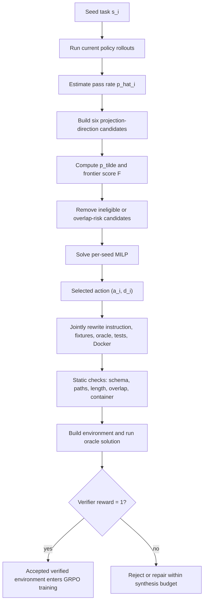

# Envs-FORGE：让终端 Agent 的 RL 环境合成围绕“学习前沿”移动

## 元信息与 TL;DR

| 项目 | 内容 |
|---|---|
| 论文 | Envs-FORGE: Frontier-Optimized Reward-Grounded Environment Synthesis for Agent RL |
| 类型 | 论文，arXiv:2608.14312v1 |
| 作者 | Xiaojun Wu, Cehao Yang, Honghao Liu, Xueyuan Lin, Zhichao Shi, Hao Zhou, Xuhui Jiang, Chengjin Xu, Jia Li, Jian Guo |
| 官方链接 | https://arxiv.org/abs/2608.14312 |
| 代码链接 | https://github.com/DataArcTech/DataArc-SynData-Toolkit/ |
| 日期证据 | arXiv 单篇页提交于 2026-08-14；arXiv cs.CL new list 在 Monday, 17 August 2026 将其列为新条目 |
| 研究对象 | 终端 Agent 的可执行训练环境合成、GRPO 后训练、验证器奖励与难度控制 |

### TL;DR

- **研究问题**：终端 Agent 的 RL 训练不只需要“更多任务”，还需要能运行、有可靠测试奖励、并且难度贴近当前策略的环境。固定 few-shot、Self-Instruct、Evol-Instruct 会对所有 seed 使用同一种改写策略，容易把简单任务继续变简单，或把过难任务推得更不可学。
- **核心方法**：Envs-FORGE 把每个 seed task 表示成 `(instruction, fixtures, oracle solution, tests, Docker environment)`，先用当前 policy 的 verifier reward 估计通过率 `p_hat`，再在 `increase / reduce / diversify` 与 `in_depth / in_breadth` 的六个动作中选择一个。
- **优化机制**：论文用一个 per-seed MILP 选择投影方向。候选动作先用固定 transfer prior 预测改写后的通过率 `p_tilde`，再用高斯形 frontier score 衡量它离目标通过率 `tau=0.5` 有多近；目标函数最大化 frontier value，同时惩罚无意义 optional skill 激活和覆盖 slack。
- **环境合成边界**：被选动作不是只改一句 instruction，而是同步改写 instruction、fixture/data、oracle solution、test suite 和 Docker environment。只有 schema、路径安全、Docker、测试和 oracle reward 都通过的 gold-verified bundle 才能进入 RL 训练。
- **主要证据**：在 Qwen 3.5 35B + GRPO 上，Base 在 tb-core/tb-2.0 的 Pass@1 是 `40.0%/23.0%`；Envs-FORGE 达到 `49.2%/29.4%`，分别提升 `+9.2/+6.4` 个百分点，并超过最强固定 recipe `+2.4/+2.1` 点。
- **泛化证据**：benchmark ablation 中，Envs-FORGE 在 SWE-bench Verified 达到 `77.1%`，高于 Base `73.4%` 和最强固定 recipe `75.8%`；model-size ablation 中，Qwen 3.5 4B/9B/27B/35B 在 tb-core 上分别有 `+6.8/+7.2/+8.1/+9.2` 点提升。
- **成本边界**：所有 synthesis 方法都导出恰好 `100` 个 verified environments；总 token 为 `2.27M-2.88M`，任务目录为 `194-210`。Envs-FORGE 使用 `2.881M` token、`291` 次 attempts、`203` 个 task dirs，成本略高但处于同一量级。
- **关键局限**：MILP 的 transfer prior 不是经验定律，论文没有完整做 solver-off、prior sensitivity、portfolio skill quota 或 Evol-Instruct depth/breadth 分离消融；gold verification 证明环境内部一致，不证明训练出的 Agent 在开放终端里安全。

## 研究问题：为什么终端 Agent 的训练环境不能只靠固定 recipe？

### 论文真正要优化的对象是什么？

Envs-FORGE 研究的不是普通问答数据增强，而是终端 Agent 的可执行 RL 环境：

- 一个任务要有自然语言 instruction；
- 要有 fixture、文件、目录、输入数据和容器环境；
- 要有 oracle solution，可以证明任务可解；
- 要有 tests/reward logic，可以给 RL rollout 返回奖励；
- 这些组件必须同步，否则 reward 会变成噪声。

论文把一个 seed 写成：

```text
s_i = (I_i, D_i, S_i, T_i, E_i)

I_i: instruction
D_i: fixture / data bundle
S_i: oracle solution
T_i: test suite
E_i: executable environment
```

这个建模很关键：

| 普通 synthetic instruction | 终端 Agent environment synthesis |
|---|---|
| 主要改写文本 | 必须同步改写文本、文件、测试、解法和容器 |
| 质量常由模型或人工判断 | 质量至少要通过 executable verifier |
| 难度多是经验描述 | 难度可由当前 policy 的 test reward 估计 |
| 失败常是语义偏差 | 失败可能是路径不安全、Docker 不可建、oracle 与 tests 不一致 |

因此，论文的问题不是“怎样生成看起来更复杂的任务”，而是：

- 给定一个 seed 和当前 policy；
- 先判断这个 seed 对当前 policy 是太简单、太难，还是接近学习前沿；
- 再决定应该增加复杂度、降低复杂度，还是横向多样化；
- 最后生成一个可运行、可验证、可用于 GRPO 的 environment bundle。

### 固定 recipe 的盲点在哪里？

论文把 few-shot、Self-Instruct、Evol-Instruct 放在同一层比较：它们都是 prompting policy。

| 固定 recipe | 近似动作 | 盲点 |
|---|---|---|
| few-shot | close variant / in-depth diversify | 容易保留原任务结构，难以处理太难 seed |
| Self-Instruct | same-domain breadth invention | 可能生成相关但难度漂移的任务 |
| Evol-Instruct depth | 固定深挖 | 对已经过难的 seed 继续加难 |
| Evol-Instruct breadth | 固定扩展 | 可能改变技能族而不是构造学习阶梯 |

作者的核心批评是：

- RL 数据的价值取决于“相对于当前 policy 的难度”；
- 同一个 seed 对 4B、9B、27B、35B 模型的价值可能不同；
- 固定 recipe 不能利用当前 policy 的 verifier reward；
- 因此它不能稳定把合成环境放到 learning frontier 附近。

## 方法主张：把环境合成改成 reward-grounded action selection

### 六个动作从哪里来？

Envs-FORGE 拆开两个维度：

```text
projection A = {increase, reduce, diversify}
direction   D = {in_depth, in_breadth}
candidate   c_{i,a,d} = (s_i, a, d)
```

三种 projection 的含义如下：

| Projection | 适用状态 | 允许移动 | 必须保持的边界 |
---|---|---|---|
| `increase` | seed 太容易 | 增加约束、边界案例、更大 fixture、更严格输出 | 保留核心 skill subgraph，并同步更新 solution/tests |
| `reduce` | seed 太难 | 删除次要系统，或构造更小的 bridge task | 保留目标技能路径，不能退化成无关问题 |
| `diversify` | seed 接近 frontier | 换 fixture、相邻需求或场景 | 保持相似难度，避免无控制的横向跳跃 |

两个 direction 的差别更细：

- `in_depth`：沿同一技能链加深或压缩，适合保留核心结构；
- `in_breadth`：移动到相邻技能或相邻任务类型，适合扩展覆盖面；
- 六个组合构成每个 seed 的候选 action set。

### 难度估计如何进入选择？

论文先从当前 policy 的 rollout reward 估计 seed 通过率：

```text
p_hat_i = (1 / n_i) * sum_t r_{i,t}

r_{i,t} in [0, 1]
```

解释：

- 如果 reward 是二值，`p_hat_i` 就是经验成功率；
- 如果 reward 是部分分数，它按比例贡献；
- 这个估计在候选构造前完成，优化时视为常数。

然后，论文用固定 transfer prior 估计动作后的通过率：

```text
p_tilde_{i,a,d} = clip(p_hat_i + Delta_a * gamma_d, 0, 1)

Delta_increase  = -0.25
Delta_reduce    = +0.25
Delta_diversify = 0

gamma_in_depth  = 1
gamma_in_breadth = 0.65
```

这组数字不是说“每个任务一定移动 0.25”，而是一个排序先验：

- 对容易 seed，`increase` 预期降低通过率，使它更有学习信号；
- 对困难 seed，`reduce` 预期提高通过率，使它成为桥接任务；
- 对 frontier seed，`diversify` 尽量保持难度，只换实例；
- `in_breadth` 的影响被 `0.65` 衰减，因为横向变化不一定等价于难度大幅移动。

### frontier score 的形状是什么？

论文把目标学习前沿设为 `tau=0.5`，并用高斯形评分：

```text
F_{i,a,d} = exp(-((p_tilde_{i,a,d} - tau)^2) / (2 * sigma^2))

tau = 0.5
sigma = 0.2
```

直觉是：

- `p_tilde` 接近 `0.5`：任务既不是白送，也不是完全不可解；
- `p_tilde` 太高：训练信号弱，容易只复制已会技能；
- `p_tilde` 太低：rollout 大多失败，reward 稀疏，学习效率差；
- `sigma=0.2` 控制 frontier 周围多宽的区域被认为有价值。

## MILP：为什么需要一个优化器？

### 变量与目标函数

论文的 per-seed MILP 选择一个 `(projection, direction)`。在 indexed 写法中，它定义：

```text
x_{i,a,d} in {0,1}
u_{i,a,d,v} in {0,1}
0 <= xi_v <= xi_bar
```

变量解释如下：

| 变量 | 含义 |
|---|---|
| `x_{i,a,d}` | seed `i` 是否选择动作 `(a,d)` |
| `u_{i,a,d,v}` | 该候选是否激活 skill node `v` |
| `xi_v` | skill coverage target 的 slack |
| `F_{i,a,d}` | 候选动作的 frontier score，优化前已计算 |
| `epsilon=1e-6` | 避免 optional skill 被无意义激活 |
| `lambda=0.25` | 覆盖目标不足的惩罚 |

目标函数是：

```text
maximize
  sum_{i,a,d} x_{i,a,d} * F_{i,a,d}
  - epsilon * sum_{i,a,d} sum_{v in O_{i,a,d}} u_{i,a,d,v}
  - lambda * sum_v xi_v
```

它的含义分三层：

- 第一项：选 frontier value 最高的动作；
- 第二项：不要为了凑 coverage 激活没有必要的 optional skill；
- 第三项：如果启用 portfolio skill coverage，就尽量减少覆盖缺口；
- 主实验使用 per-seed 模式，但 indexed form 可以堆叠 100 个 seed，并记录 coverage slack。

### 约束如何保证选择可审计？

核心约束如下：

```text
sum_{a,d} x_{i,a,d} <= 1                 for all i
sum_{i,a,d} x_{i,a,d} = N

u_{i,a,d,v} = x_{i,a,d}                 for v in R_{i,a,d}
u_{i,a,d,v} <= x_{i,a,d}                for v in O_{i,a,d}
u_{i,a,d,v} = 0                         for forbidden skill nodes

sum_{i,a,d} u_{i,a,d,v} + xi_v >= m_v   for active coverage targets
0 <= xi_v <= xi_bar
```

这套约束带来几个工程性质：

- 每个 seed 最多选一个动作，主实验中 `N=|S|=100`，即每个 seed 选一次；
- required skills 必须随动作一起激活；
- forbidden skills 必须为零，避免生成器无界扩展；
- optional skills 可以激活，但有极小惩罚；
- coverage slack 上限是 `0.2`，用于记录有界缺口；
- 候选如果 prompt 太长、split 不合格、已知 overlap 风险高，会在求解前被移出可行集。

### 固定 recipe 如何变成 action mask？

论文还用同一 action space 表达 baseline：

```text
x_{i,a,d} <= rho_{b,a,d}
```

也就是给 baseline 一个 action mask：

| Baseline | Mask | 解释 |
|---|---|---|
| few-shot | `(diversify, in_depth)` | 保持 seed 结构，生成近邻变体 |
| Self-Instruct | `(diversify, in_breadth)` | 在同域中发明相关任务 |
| Evol-Instruct depth | `d=in_depth` | 固定向深度演化 |
| Evol-Instruct breadth | `d=in_breadth` | 固定向广度演化 |
| Envs-FORGE | full feasible set | 同时选择 projection 和 direction |

这个写法的价值在于：

- 它不是把 baseline 当作完全不可比的 prompt trick；
- 它说明 Envs-FORGE 的优势来自“按 seed 选择动作”；
- 也暴露了一个待补实验：应该做 solver-off 或 mask-level ablation，单独拆出优化器贡献。

## 合成流程：动作选择之后，怎样保证任务真的能训练？

### Mermaid：从 seed 到 verified bundle



### 为什么强调“同步改写”？

论文多次强调，动作选择只是第一层。真正的数据定义还要靠 artifact-consistency contract：

- 新增要求必须出现在 instruction 中；
- 新增要求必须被 tests 检查；
- oracle solution 必须满足改写后的 tests；
- 删除的复杂度不能继续藏在 oracle 或 hidden requirement 里；
- container 可以暴露任务 fixture，但不能把 oracle solution 或隐藏测试打包给 agent。

这对终端 Agent 尤其重要：

| 不一致位置 | 可能后果 |
|---|---|
| instruction 改了，tests 没改 | Agent 学到不可验证的文本目标 |
| tests 改了，oracle 没改 | gold verification 失败，任务不可用 |
| fixture 改了，Docker 没改 | 环境无法 build 或路径不存在 |
| reduce 只删文字，不删测试 | 桥接任务仍然过难 |
| diversify 改了数据，不改 expected output | reward 变成随机惩罚 |

### 伪代码：论文流程的可执行含义

```text
Input:
  seed tasks S
  current policy pi

State:
  verified batch B = empty

For each seed s_i in S:
  estimate p_hat_i from verifier rewards under pi

  For each action (a, d) in A x D:
    derive required skills R_{i,a,d}
    derive optional skills O_{i,a,d}
    compute p_tilde_{i,a,d}
    compute frontier score F_{i,a,d}
    drop candidate if it fails eligibility, overlap, or prompt-length checks

  solve six-action MILP
  select action (a_i, d_i)

  jointly materialize:
    instruction
    fixtures/data
    oracle solution
    executable tests
    Docker environment

  run static checks and container checks
  run oracle solution and generated tests

  if reward == 1:
    add environment to B

Output:
  verified environment batch B

Failure boundary:
  solver optimality only certifies the discrete action-selection problem;
  executable verification separately certifies internal environment consistency.
```

## 实验设置：比较的是完整 prompting policy，而不是更多训练样本

### 训练源与验证端点

论文比较四种 synthetic training source：

| Training source | 方法含义 | 训练集端点 |
|---|---|---|
| few-shot | 固定 seed-conditioned prompting | 100 accepted bundles |
| Self-Instruct | 固定自生成任务 | 100 accepted bundles |
| Evol-Instruct | in-depth + in-breadth evolution | 100 accepted bundles |
| Envs-FORGE | MILP action selection | 100 accepted bundles |

关键控制：

- 每种 synthesis 方法最终都导出恰好 `100` 个 gold-verified environments；
- rejected records、repair attempts、中间 directories 不进入 RL 训练；
- Base 不使用 synthetic training data；
- 主比较使用 Qwen 3.5 35B；
- 训练算法是 GRPO；
- rollout 由 vLLM 生成；
- reward 来自任务测试，不使用 separate learned reward model；
- 评测指标是 Pass@1。

### 资源规模是否可比？

主表给出的 synthesis 成本如下：

| 方法 | Records | Accepted | Task dirs | Attempts | Total tokens | tb-core | tb-2.0 |
|---|---:|---:|---:|---:|---:|---:|---:|
| Base | - | - | - | - | - | 40.0% | 23.0% |
| few-shot | 121 | 100 | 210 | 226 | 2,443,065 | 43.2% | 24.1% |
| Self-Instruct | 113 | 100 | 194 | 190 | 2,272,275 | 45.6% | 27.3% |
| Evol-Instruct | 112 | 100 | 195 | 207 | 2,517,746 | 46.8% | 25.6% |
| Envs-FORGE | 120 | 100 | 203 | 291 | 2,881,056 | 49.2% | 29.4% |

可读出的边界是：

- Envs-FORGE 不是靠更多 accepted training environments 获胜；
- 它的 attempts 最多，说明 action-conditioned 合成和验证更折腾；
- 它的 token 总量最高，但仍在同一量级；
- tokens per accepted 为 `28,811`，高于 Self-Instruct 的 `22,723`；
- tokens per attempt 为 `9,901`，反而低于固定 recipe 的 `10,810-12,163`。

## 主结果：frontier-aware selection 带来多大提升？

### tb-core 与 tb-2.0

论文主结果可以压缩成下面的差值表：

| 对比 | tb-core Pass@1 | tb-2.0 Pass@1 |
|---|---:|---:|
| Base | 40.0% | 23.0% |
| 最强固定 recipe | Evol-Instruct 46.8% | Self-Instruct 27.3% |
| Envs-FORGE | 49.2% | 29.4% |
| 相对 Base | +9.2 点 | +6.4 点 |
| 相对最强固定 recipe | +2.4 点 | +2.1 点 |

这个结果支持的 claim 是有限但清楚的：

- 在同样导出 `100` 个 verified environments 的条件下；
- 对 Qwen 3.5 35B + GRPO；
- action selection 比单一固定 recipe 更有效；
- 增益不是来自完全不同的后训练算法，而来自训练环境的选择与合成策略。

### SWE-bench Verified 额外证据

benchmark ablation 加入 SWE-bench Verified：

| Benchmark | Base | few-shot | Self-Instruct | Evol-Instruct | Envs-FORGE |
|---|---:|---:|---:|---:|---:|
| tb-core | 40.0% | 43.2% | 45.6% | 46.8% | 49.2% |
| tb-2.0 | 23.0% | 24.1% | 27.3% | 25.6% | 29.4% |
| SWE-bench Verified | 73.4% | 74.6% | 75.2% | 75.8% | 77.1% |

解读：

- SWE-bench Verified 的提升只有 `+3.7` 点，相比 tb-core 的 `+9.2` 点更小；
- 这可能说明环境合成最直接改善的是 Terminal-Bench 风格任务；
- 但它没有在 SWE-bench Verified 上牺牲性能，反而也超过固定 recipe；
- 因而论文可主张“改写策略有跨 benchmark 正迁移”，但不能主张“所有软件工程任务都大幅提升”。

### 模型尺寸消融

tb-core 上的 Qwen 3.5 尺寸消融如下：

| 模型 | Base | Envs-FORGE | 提升 |
|---|---:|---:|---:|
| Qwen 3.5 4B | 24.8% | 31.6% | +6.8 |
| Qwen 3.5 9B | 31.7% | 38.9% | +7.2 |
| Qwen 3.5 27B | 38.6% | 46.7% | +8.1 |
| Qwen 3.5 35B | 40.0% | 49.2% | +9.2 |

这里最值得注意的不是“模型越大越强”这个常识，而是：

- Envs-FORGE 对所有尺寸都有正收益；
- 提升随尺寸略增，说明更强 policy 可能更能利用 frontier-matched environments；
- 但论文只报告 Qwen 3.5 系列，不能外推到 Claude、GPT、DeepSeek 或开源 MoE；
- 也没有报告不同 seed pool 规模下增益是否稳定。

## Figure/Table 证据逐项解读

### Figure 1：固定 recipe 与 frontier-aware 的动机对比

Figure 1 的功能是建立问题，而不是证明结果：

- 固定 recipe 对每个 seed 使用同一改写策略；
- Envs-FORGE 先估计 seed pass rate；
- 再选择 increase、reduce、diversify；
- 目标是把 materialized task 放到 learning frontier 附近。

它支持的结论：

- 论文关注的是 policy-relative synthesis；
- seed 的绝对内容不够，当前模型能力必须进入合成决策。

它不能证明的结论：

- transfer prior 的数值一定正确；
- MILP 比简单规则一定更好；
- frontier target `0.5` 对所有训练阶段都最优。

### Figure 2：pipeline 图的证据意义

Figure 2 展示：

- pass-rate estimator；
- MILP action selection；
- synthesis model；
- static/gold verification；
- GRPO training。

它的重要性在于划清两个验证层：

| 层级 | 验证内容 | 不验证什么 |
|---|---|---|
| MILP optimality | 给定 score/constraints 后的离散动作选择 | 生成环境是否语义一致 |
| Gold verification | oracle solution 在 tests 下 reward=1 | 任务是否覆盖真实世界全部失败模式 |
| Downstream Pass@1 | RL 后 policy 在 benchmark 上表现 | 开放终端部署安全性 |

### Table 1：主结果与成本表

Table 1 同时给性能和 synthesis cost，避免一个常见误读：

- 如果只看 Pass@1，可能以为 Envs-FORGE 靠更多数据；
- 表中 `Accepted=100` 排除了这个解释；
- 但 `Attempts=291` 和 `2.881M tokens` 说明它确实用了更多合成努力；
- 因此更严谨的说法是：在固定 accepted training-set size 下，它用同量级但偏高的 synthesis cost 换来更好的训练环境质量。

### Figure 3 / Table 2：消融不是组件拆解，而是覆盖范围测试

论文称其为 ablation，但主要是两类覆盖测试：

- benchmark coverage：tb-core、tb-2.0、SWE-bench Verified；
- model coverage：Qwen 3.5 4B、9B、27B、35B。

它还缺少的组件级消融包括：

- 不用 MILP、只用规则选择；
- 改变 `tau` 或 `sigma`；
- 改变 `Delta` 和 `gamma`；
- 关闭 `reduce` projection；
- 关闭 skill coverage slack；
- 固定同一候选池比较 solver 与 heuristic。

### Figure 4：五个 qualitative frontier cases

五个 case 说明 action semantics：

| Case | seed 状态 | 选择动作 | 机制含义 |
|---|---:|---|---|
| Bash logs | `p_hat=0.747` | increase / in_depth | 稍容易，增加 JSON、排序、锁、原子写 |
| Data merger | `p_hat=1.000` | increase / in_depth | 已饱和，增加精确 union、quoting、顺序 |
| Systemd logs | `p_hat=0.000` | reduce / in_depth | 太难，移除 live service，保留日志推理 |
| Token service | `p_hat=0.000` | reduce / in_depth | 移除 web/db/race，保留 token 状态推理 |
| PGN repair | `p_hat=0.533` | diversify / in_breadth | 已近 frontier，换棋局实例而保留技能族 |

这组 case 支持一个机制判断：

- `reduce` 不是偷懒变简单，而是从过难系统里抽出可学 bridge skill；
- `increase` 不是堆长 prompt，而是把边界条件变成可测试要求；
- `diversify` 不是换题材，而是在相近难度上换 fixture。

## 与后训练研究的关系：它改变了 RL 数据的“难度控制层”

### 和普通 GRPO 数据构造的差别

许多后训练工作把重点放在：

- reward 设计；
- advantage estimator；
- rollout 长度；
- KL / entropy；
- verifier 可靠性；
- 数据过滤。

Envs-FORGE 的入口更早：

- 在环境被生成之前；
- 用当前 policy 的 reward 估计 seed 难度；
- 选择合成动作；
- 让生成器围绕动作重写完整环境；
- 再进入 GRPO。

可以把它看成下面这条链：

```text
seed pool
  -> policy-relative difficulty estimation
  -> action-conditioned environment synthesis
  -> executable verification
  -> GRPO training
  -> benchmark evaluation
```

这使它与 DART-Math、targeted tabular synthesis 的关系更清楚：

| 工作类型 | 决策对象 | Envs-FORGE 的差异 |
|---|---|---|
| 难题多采样 | 在哪些 query 上花更多生成预算 | 决定对 seed 做哪种环境 transformation |
| 指令扩增 | 生成更多类似或更复杂指令 | 生成完整 executable environment |
| verifier filtering | 过滤坏样本 | verifier reward 还参与难度估计 |
| curriculum learning | 安排训练顺序 | 合成前就把任务推向 frontier |

### 复现协议里有哪些容易被忽略的细节？

论文附录把训练与 rollout 配置写得比较具体，这些细节决定了结果该怎样被复查：

| 环节 | 论文设置 | 为什么重要 |
|---|---|---|
| rollout sampling | 每个 prompt 采样 `8` 条 rollout，temperature `1.0`，top-p `0.9` | 保证 GRPO 能看到组内差异，而不是单轨迹监督学习 |
| interaction limit | 最多 `50` 个 agent-environment steps，trajectory timeout `900s` | 终端任务可能卡在工具循环或容器执行，必须限制预算 |
| reward | Terminal-Bench test outcome，test reward weight `1`，judge reward weight `0` | 主实验不依赖额外 LLM judge，奖励来源更可审计 |
| sequence budget | prompt/response 最大长度设为 `8192`，vLLM max model length 与 batched tokens 为 `32k` | 过滤超长任务，避免 silently truncate 导致 reward 含义变化 |
| 训练资源 | 2 张 H800 80GB，FSDP2、activation offload、gradient checkpointing、bf16、KV cache FP8 | 说明 35B setting 的成本门槛，不应把它误解成轻量数据清洗实验 |

这些配置带来一个研究边界：

- 如果复现实验使用更短 response cap，复杂终端任务会被截断；
- 如果减少 rollout samples，`p_hat` 和 GRPO 组内优势都会更噪；
- 如果换成 learned reward model，结论就不再只关于 executable tests；
- 如果不重跑 oracle-plus-test preflight，坏环境可能进入训练并污染比较。

### 失败案例如何帮助理解 projection？

论文的 qualitative cases 不是漂亮示例，而是解释为什么同一个 seed pool 需要三种 projection：

- 对 `p_hat=1.0` 的 data merger，继续做近邻改写没有价值；`increase` 把缺失值、CSV quoting、header schema、排序要求写进测试，才让 saturated seed 重新产生学习信号。
- 对 `p_hat=0.0` 的 systemd seed，完整服务部署、rsyslog、logrotate、journal monitoring 叠在一起会让 agent 学不到核心错误；`reduce` 把它变成 deterministic log analyzer，保留 restart-loop、severity count 和 malformed-field reasoning。
- 对 `p_hat=0.533` 的 PGN repair，seed 已接近 frontier；`diversify` 只换棋局 fixture 和非法 move，保留 chess parsing、legal-move validation 和 structured repair，避免难度被无谓改变。

这三个例子说明：

```text
projection is not style transfer
projection is a policy-relative intervention on learnability
```

也就是说，动作标签的意义不是“prompt 里写得更难/更简单/更多样”，而是对当前 policy 的 reward distribution 做一个可验证移动。

### 为什么这对 Agent RL 特别重要？

终端 Agent 的训练信号有三个特点：

- reward 通常稀疏，任务失败就是 0；
- 失败可能来自环境工程，而不只是推理错误；
- 相同 instruction 在不同模型能力阶段价值不同。

Envs-FORGE 的贡献是把这些因素变成一个可审计选择问题：

- 当前 policy 会不会做；
- 该 seed 的目标技能是否值得保留；
- 应该加难、降难，还是换实例；
- 合成后的环境是否真的可运行；
- 最终是否提升 benchmark Pass@1。

## 局限与证据边界

### transfer prior 是强假设

论文使用：

```text
Delta_increase = -0.25
Delta_reduce = +0.25
Delta_diversify = 0
gamma_in_breadth = 0.65
```

这组数值带来可解释性，但也带来风险：

- 不同任务族的难度移动可能不是线性的；
- `reduce` 可能移除真正关键技能；
- `increase` 可能引入无关工程噪声；
- `diversify` 可能在语义上跳出原技能族；
- 没有 prior sensitivity 实验时，无法判断结果对这些超参数多敏感。

### MILP optimality 不等于环境语义正确

求解器只证明：

- 给定候选分数；
- 给定 required/optional/forbidden skills；
- 给定 coverage/slack；
- 它选到目标函数最优的动作集合。

它不证明：

- LLM materialization 没有隐藏 requirement；
- generated tests 覆盖所有 edge cases；
- oracle solution 不是过拟合测试；
- Docker 环境没有泄漏答案；
- benchmark 没有与 seed pool 出现语义重叠。

论文用 static checks、overlap checks、gold verification 缓解这些问题，但不能完全消除。

### 评测规模仍偏有限

最重要的边界：

- accepted environments 只有 `100`；
- 主实验是 Qwen 3.5 35B；
- model ablation 仍在 Qwen 3.5 家族内；
- 论文没有报告多随机种子置信区间；
- 对更大 seed pool、更长训练、多轮 curriculum 的扩展还未证明；
- 官方代码链接指向 DataArc SynData Toolkit，README 展示的是通用 synthetic data / SFT / GRPO 平台，单从 README 还看不到论文中 Envs-FORGE 选择器的完整复现实验脚本。

### 代码与论文之间还有什么落差？

arXiv 摘要和 API 都给出官方代码链接：`DataArcTech/DataArc-SynData-Toolkit`。我额外检查了仓库 README，它当前展示的是一个通用 synthetic data generation platform：

- 支持本地语料、Hugging Face 数据、model distillation；
- 有 FastAPI backend、React frontend、CLI 和 GUI；
- 集成 SFT、GRPO 与 DeepEval 评测；
- README 的 changelog 最近公开到 2026-01-26，GitHub API 显示仓库在 2026-08-17 有更新活动。

但从 README 顶层信息看，仍有复现缺口：

| 论文需要的复现对象 | README 是否直接暴露 |
|---|---|
| per-seed MILP selector | 顶层 README 未直接展开 |
| six-action projection-direction policy | 顶层 README 未直接展开 |
| Terminal-Bench-style environment export | 顶层 README 未直接展开 |
| 100 verified bundle 记录 | 顶层 README 未直接展开 |
| GRPO pipeline | README 说明 toolkit 支持 GRPO |

这不等于代码不存在，只说明研究者复现时不能只读 README：

- 需要定位具体配置、实验记录和 selector 实现；
- 需要确认 paper 中的 token/attempt/task-dir 统计如何生成；
- 需要检查 overlap filter 与 held-out benchmark split；
- 需要确认 oracle solution、tests、Docker 是否全部随 artifact contract 保存。

因此，本文把代码链接作为官方来源记录，但对“开箱即复现 Envs-FORGE 全实验”保持保守判断。

### 如果要做下一步反事实实验，应该先拆哪里？

最直接的反事实不是“再生成更多环境”，而是把论文的三层选择拆开：

| 反事实 | 能回答的问题 | 预期风险 |
|---|---|---|
| 固定 `tau=0.5` vs 动态 `tau` | 学习前沿是否应随训练阶段变化 | 动态阈值可能让任务分布不稳定 |
| MILP selector vs greedy frontier selector | 求解器是否带来真实增益 | 如果候选只有六个，简单规则可能已经足够 |
| full action space vs no-`reduce` | 桥接任务是否贡献最大 | 去掉 `reduce` 可能让困难 seed 全部被浪费 |
| gold tests only vs hidden/property tests | oracle verification 是否过拟合 | 更强测试会提高合成失败率和成本 |

这些实验会让结论从“完整系统有效”推进到“哪个组件最关键”。当前论文已经证明完整 pipeline 在三个 benchmark 上有收益，但还没有充分证明 MILP、transfer prior、coverage slack 与 artifact contract 各自贡献的份额。

### 安全边界：更强终端 Agent 也更需要权限控制

论文 ethical considerations 提到：

- 更有效的 environment synthesis 会提高命令行 Agent 能力；
- 这可能减少软件工程失败；
- 也可能增强 agent 在终端设置中的持续执行能力；
- 部署仍需要权限、sandbox、logging 和 human oversight。

从 AI 安全角度看，Envs-FORGE 的正面是：

- 每个环境有 solver trace、verification outcome 和 artifact contract；
- 训练数据比纯 prompt 扩增更可审计；
- 难度移动有显式动作标签；
- rejected artifacts 不进入训练。

但风险也很直接：

- 如果任务域转向网络、渗透、系统管理，环境合成可能强化危险操作能力；
- gold verification 只保证任务内部通过，不保证现实权限边界；
- skill coverage 目标如果设置不当，可能系统性偏向高风险技能；
- 因此它更适合在隔离容器、受控任务集和明确权限模型下使用。

## 结论：值得带走的研究判断

### 这篇论文真正贡献了什么？

我会把 Envs-FORGE 的贡献概括为三点：

- **问题重定义**：终端 Agent RL 的数据构造不只是生成 task，而是生成与当前 policy 难度匹配的 executable environment。
- **机制实现**：用 verifier reward 估计 seed pass rate，再用 MILP 在六个合成动作中选择，使每个 seed 向 learning frontier 移动。
- **证据闭环**：同步改写五类 artifact，经 static/gold verification 后进入 GRPO，并在 tb-core、tb-2.0、SWE-bench Verified 上展示 Pass@1 提升。

### 对后续研究最值得追问的点

后续工作可以优先问：

- 如果把 `tau` 从固定 `0.5` 改成训练阶段自适应，会不会更稳定？
- 如果不用 MILP，而用 learned selector 或 bandit selector，是否能减少 attempts？
- `reduce` projection 是否真的保留了目标技能，还是部分任务变成了捷径学习？
- coverage slack 在大规模 curriculum 中是否会改变技能分布？
- synthesis token 更高的成本，在多轮训练和多模型复用下是否划算？
- gold verification 能否加入隐藏测试、多 oracle、property-based tests，降低过拟合风险？

### 一个谨慎的领域判断

Envs-FORGE 最有价值的地方，是把“合成什么训练环境”从 prompt engineering 变成了一个带 reward、约束、求解器和验证器的选择问题。

这不是终端 Agent 后训练的完整答案：

- 它没有解决开放世界权限；
- 没有证明长期安全；
- 没有覆盖所有模型和任务域；
- 也没有拆完所有组件消融。

但它给了一个可操作的方向：

- 先用当前 policy 读 seed 的难度；
- 再决定该往哪里改；
- 再用 executable verifier 拦住不一致环境；
- 最后让 RL 看到更接近学习前沿的任务。

对研究者而言，这比“生成更多任务”更具体，也更可审计。
