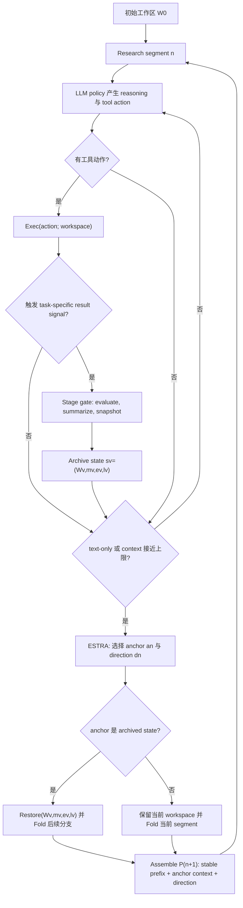

# ScienceFlow：把长程科研 Agent 的“记忆”落到可恢复工作区

## 元信息

- 论文：ScienceFlow: A Long-horizon Agent for ML Research, Scientific Discovery and Beyond
- 链接：https://arxiv.org/abs/2608.14354
- 版本：arXiv:2608.14354v1
- 官方日期证据：arXiv cs.AI new listings 标记为 Monday, 17 August 2026；单篇提交历史为 2026-08-14 14:54:01 UTC
- 方向：大模型 Agent，尤其是长程科研 Agent、机器学习工程 Agent、自动科学发现系统
- 作者团队：ScienceFlow Team, Noah's Ark Lab, Huawei
- 项目页：https://huawei-noah.github.io/noah-research/ScienceFlow/website/

## TL;DR

- **这篇论文解决的问题**：长程科研 Agent 不只是“多跑几轮工具调用”。当任务持续 12 小时、24 小时甚至 10 天时，Agent 会同时面对代码、数据、缓存特征、模型 checkpoint、验证记录、资源账本和失败分支；单靠对话摘要无法可靠恢复这些可执行状态。
- **核心方法**：ScienceFlow 把研究进展表示为可恢复的 executable state，并用 ESTRA（Executable-State Transition through Re-Anchoring）在研究片段边界选择“从当前状态还是历史归档状态继续/重定向”。同时，一个 evidence-aware execution controller 独立管理作业准入、设备租约、在线观察和停止重规划。
- **关键机制**：论文把科研任务形式化为 `T=(G,U_G,V_G,B,W_0)`，其中 `U_G` 是最终目标效用，`V_G` 是执行期间可观察的验证信号，`B` 是预算，`W_0` 是初始工作区。Agent 追求的是在预算约束下找到验证值最高的可恢复状态，而不是最长对话或最多工具调用。
- **主要证据**：在完整 75 题 MLE-bench 上，ScienceFlow 使用 DeepSeek-V4-Flash-Preview、24 小时预算、最多 2 GPU，达到 `70.22±1.18%` Any-Medal，比作者列出的最强已报告基线高 4.92 个百分点；三次独立运行分别在 54、53、51 个任务拿到 medal。
- **机制消融**：在 22 题 MLE-bench Lite 上，完整系统 24 小时 Any-Medal 为 `80.30±2.62%`；去掉 ESTRA 后降到 `66.67±2.62%`，去掉执行控制后为 `69.70±5.25%`。这说明状态重锚和资源控制都不是装饰性模块。
- **跨域结果**：在数学优化中，它在 Circle Packing 达到 `2.6359830849`，在 Ratio Minimization 达到 `3.590157365311`，在 Hermite-Gaussian 不确定性上界任务把最强已发表 Hermite-based bound 降低 2.5%；在 KTTSP-hard 公开榜排第 3；在 SciModelingBench group-balanced score 达到 54.41，优于对比 Agent。
- **主要局限**：证据很强但不是完全因果闭环。KTTSP 的 10 天轨迹是单运行描述；SciModelingBench 每个 system-task pair 只跑一次；部分遥测只覆盖 54/75 个 MLE-bench 任务；不同基线的预算和硬件不完全一致，因此不能把所有差距都解释为 ScienceFlow 架构本身。

## 研究问题：长程科研 Agent 的瓶颈到底在哪里？

### 不是“上下文够长就行”

- 作者把问题切在一个很具体的位置：
  - 短程工具 Agent 的核心风险是计划、调用工具、解释观察。
  - 长程科研 Agent 的核心风险是 **可执行研究状态失真**。
  - 一旦 Agent 运行数小时，状态就不再是聊天记录，而是包含代码、数据、特征、模型权重、验证结果、提交文件、运行日志和资源使用情况的工作区。

- 这意味着普通摘要会丢失关键能力：
  - 不能精确恢复某个历史分支的代码和缓存。
  - 不能判断一个失败方向是否只是短期验证噪声。
  - 不能把“继续跑”“回滚”“开新分支”“停止昂贵作业”绑定到同一份证据。

### 作者重新定义了长程任务对象

论文中的任务定义是：

```text
T = (G, U_G, V_G, B, W_0)
```

| 符号 | 含义 | 在 Agent 系统里的作用 |
|---|---|---|
| `G` | 研究目标和成功标准 | 规定最终要优化什么，例如 Kaggle medal、科学设计分数、优化目标 |
| `U_G(.)` | 最终任务效用 | 最终评估才可见，运行中通常不可直接访问 |
| `V_G(.)` | 运行中验证信号 | Agent 用它指导搜索，例如 validation loss、内部 scorer、可验证候选分数 |
| `B` | 资源预算向量 | 包含 wall-clock、compute、storage 等多个维度 |
| `W_0` | 初始可执行工作区 | 任务开始时的代码、数据、环境和工具入口 |

作者的关键转向是：

```text
在预算 B 内，不是最大化对话长度，而是选择 archive A_T 中验证值最高的可恢复状态：

s_hat_T = argmax_{s_v in A_T} V_G(s_v)
subject to C_T = sum_{t=1..T} rho_t <= B
```

- `s_v` 是归档状态，不是文本摘要。
- `rho_t` 是第 `t` 步资源消耗向量。
- `C_T` 是累计资源消耗。
- 这个公式把 Agent 运行看成受预算约束的状态搜索。

## 论文主张与论证路线

| Claim | Mechanism | Evidence | Boundary |
|---|---|---|---|
| 长程科研需要可恢复的执行状态 | 每个 checkpoint 保存 workspace snapshot、structured memory、validation evidence、resource records | Statoil case study 中从 `S59`、`S112` 恢复并复用 CNN 特征、LightGBM、wide assets | 不能证明所有任务都需要完整快照；有些短任务可能只需要轻量记忆 |
| 轨迹选择需要显式“重锚” | ESTRA 在 segment 边界选择 current/archive anchor 和 extend/redirect direction | 7 个历史 ESTRA 点的 state-matched replay 中，历史选择在 5/7 个点达到最佳均值或并列最佳 | replay 只有 7 个点，每点 3 seeds、4 小时预算；不是完整策略学习证明 |
| 资源控制应从科研路线选择中分离 | controller 负责 Admit、lease、Review、TIMEBOX、STOP AND REPLAN | Lite 消融中去掉执行控制，24h Any-Medal 从 `80.30±2.62%` 降到 `69.70±5.25%` | 控制器仍依赖 worker advisory；不同任务的资源瓶颈差异很大 |
| 机制能跨不同研究任务迁移 | 同一抽象用于 MLE-bench、数学优化、KTTSP、SciModelingBench | MLE-bench `70.22±1.18%`；KTTSP-hard 第 3；SciModelingBench 54.41 | 基线预算/硬件不完全统一，跨域结论应读成“强经验证据”而非严格统一 benchmark |

## 方法机制：ScienceFlow 的三个核心层

### 1. 可恢复研究状态

每个研究状态写成：

```text
s_v = (W_v, m_v, e_v, l_v)
```

| 组件 | 论文定义 | 为什么重要 |
|---|---|---|
| `W_v` | workspace snapshot | 保存代码、数据处理脚本、模型 checkpoint、缓存特征、validation 输出、submission、环境元数据 |
| `m_v` | structured research memory | 保存跨 segment 的紧凑研究记忆，不等同于全部对话 |
| `e_v` | validation evidence | 保存 `V_G(s_v)` 相关证据，是继续、回滚、比较分支的依据 |
| `l_v` | resource records | 保存资源账本，让恢复历史状态时仍能保留累计预算约束 |

这个设计的意义在于：

- “回到某个想法”不再是让模型读一段总结后重写代码。
- 回滚的对象是包含文件、缓存和验证证据的具体状态。
- 即使选择 archived anchor，资源消耗也不会被重置；这避免了“时间旅行式预算作弊”。

### 2. ESTRA：在片段边界做 route-level 决策

ESTRA 的触发条件有两个：

- worker 输出 text-only response，没有产生工具动作；
- 当前上下文接近容量阈值。

触发后，Agent 不只是总结历史，而是选择两个轴：

```text
anchor in {current_state} union archive
direction in {extend, redirect}
```

因此有四类动作：

| Anchor | Direction | 解释 | 适用情形 |
|---|---|---|---|
| current | extend | 继续当前路线 | 验证信号仍改善，剩余预算足够 |
| current | redirect | 保留当前工作区但换思路 | 当前代码资产有用，但路线已饱和 |
| archived | extend | 恢复历史状态并沿原路线推进 | 旧状态有强验证证据，后续分支偏离 |
| archived | redirect | 恢复历史状态并开新分支 | 当前分支失败，旧状态是更好的起点 |

ESTRA 使用的证据包括：

- 当前状态的 workspace summary 和最新 result card。
- archived anchors 的工作区摘要与 validation evidence。
- Fold 后的 memory view，以及可通过 Unfold 找回的 indexed evidence。
- 可选 peer evidence，例如其他 worker 的验证分数和方法摘要。
- 剩余 wall-clock 和执行约束。

### 3. 证据感知执行控制

论文特别强调：

- 科学路线选择仍由 research worker 决定。
- 物理执行控制由 controller 决定。
- controller 不替 Agent 选科研方向，但能拒绝、排队、限时或终止作业。

作业启动前：

```text
delta_adm_b = Admit(b; R_t, B_t)
delta_adm_b in {RUN NOW, OBSERVE THEN RUN, PENDING, REPLAN}
```

在线观察时：

```text
c_t = Review(y_0:t, g_t; B_t)
c_t in {CONTINUE, TIMEBOX, STOP AND REPLAN}
```

| 信号 | 倾向决策 | 研究含义 |
|---|---|---|
| 新 checkpoint、metric 改善、ETA 在预算内 | continue / timebox | 慢但可能有价值，应给证明窗口 |
| 长时间无日志增长、低 GPU 利用、无可恢复 artifact | stop and replan | 继续烧资源难以产生验证证据 |
| 资源不足但路线有价值 | pending / observe then run | 先保留机会，避免抢占更高价值作业 |
| worker 无法说明下一产物 | replan | 路线价值不清，需要回到研究层改计划 |

## 算法流程：从 forward loop 到 re-anchoring



### 伪代码视角

```text
Input:
  task T=(G,U_G,V_G,B,W0)
  worker policy pi_LLM
  archive A = empty
  active workspace W = W0

State:
  persistent memory m
  resource ledger C_t
  segment-local history h

Loop while remaining budget B_t is available:
  1. worker proposes reasoning r and action alpha from stable context + local history
  2. if alpha is executable:
       controller runs Admit before launch
       controller applies Review during execution
       update workspace W with observations and artifacts
  3. if task adapter detects result signal:
       compute validation evidence e = V_G(W)
       ask worker for compact result card q
       snapshot state s_v=(W_v,m_v,e_v,l_v)
       add s_v to archive A
  4. if text-only response or context threshold reached:
       Fold memory into compact view
       ESTRA selects anchor a_n and direction d_n
       if a_n is archived:
           restore exact workspace and state components
       assemble next segment context

Output:
  state s_hat_T in archive with best observed validation evidence under budget

Failure boundary:
  If V_G is noisy, leaked, or weakly correlated with U_G, the archive may preserve and re-anchor around misleading states.
```

## 实验设置：三类长程任务

### MLE-bench

- 任务：完整 75 个 Kaggle 风格机器学习工程任务。
- 层级：Lite、Medium、High。
- 指标：Any-Medal，达到 Bronze、Silver 或 Gold 阈值即成功。
- 模型：DeepSeek-V4-Flash-Preview。
- 预算：每任务 24 小时，最多 2 GPUs，16-32 logical CPU cores，256 GB RAM。
- 隔离：held-out test labels 和 test-derived feedback 不暴露给 Agent。

### 数学与工程优化

- Circle Packing：在单位正方形中最大化 26 个不相交圆半径和。
- Ratio Minimization：16 个平面点中最小化 `d_max/d_min`。
- Uncertainty Inequality：搜索 Hermite-Gaussian construction，收紧 Fourier sign-uncertainty constant `C_4` 上界。
- KTTSP：ESA SpOC4 月球轨道访问任务，联合优化访问顺序、出发时刻和飞行时长。

### SciModelingBench

- 任务：12 个科学建模/设计任务，覆盖 DNA binding、RNA/protein design、superconducting materials、preclinical toxicology、embodied control。
- 反馈：候选批次得分，而不是每个候选的 individual label。
- 预算：2 小时；每任务 8-20 个 batch submissions。
- 对比：OpenCode、Pi、Codex、Claude Code。

## 主结果：强项集中在长程状态管理

### MLE-bench 主表

| 系统 | Backbone | Lite | Medium | High | All |
|---|---|---:|---:|---:|---:|
| ScienceFlow | DeepSeek-V4-Flash-Preview | `80.30±1.52` | `74.56±0.88` | `44.44±2.22` | `70.22±1.18` |
| MLEvolve | Gemini-3.1-Pro-Preview | `80.30±1.50` | `64.00±0.90` | `46.70±0.00` | `65.30±0.80` |
| Iris | Claude-Opus-4.6 | `80.30±1.50` | `64.00±0.90` | `44.40±2.20` | `64.90±0.40` |
| Famou-Agent 2.0 | Gemini-3-Pro-Preview | `80.30±1.52` | `64.04±2.32` | `42.22±2.22` | `64.44±1.18` |
| AIBuildAI | Claude-Opus-4.6 | `77.27±0.00` | `61.40±0.88` | `46.67±0.00` | `63.11±0.44` |

读表时要注意：

- ScienceFlow 的最大优势在 Medium：`74.56±0.88%`，比最接近的已报告结果高约 10.52 个百分点。
- Lite 已经接近饱和，多个系统都在 `80.30%` 附近。
- High 上 ScienceFlow 不是最高，说明它不是简单全面碾压，而是对中等复杂、需要持续调参和状态复用的任务收益更明显。

### Statoil case study：为什么状态恢复有用？

论文用 Statoil Iceberg Classifier Challenge 展示 24 小时轨迹：

- `S02` 验证 log loss 为 `0.1100`。
- 后续 CNN-only 探索没有改善后，ScienceFlow 恢复 `S59`，转向基于保存 CNN features 的 tree models。
- stacking 分支不理想后，又回到 `S112`，继续探索新路线。
- `S123` 组合了 `S53/S55` 的 wide-64 和 wide-96 assets。
- 最终验证 loss 到 `0.0597`。

这里的关键不是“模型想到 LightGBM 很聪明”，而是：

- CNN checkpoint、logits、angle features、wide assets 都是可执行状态的一部分。
- 回到 `S59` 或 `S112` 不是凭文字回忆，而是恢复可以继续训练/组合的真实工作区。
- 失败分支没有丢掉，而是作为后续 ESTRA 判断的负证据。

## 消融与机制证据

### ESTRA replay：历史决策是否只是运气？

作者对 Tabular Playground Series May 2022 做了 state-matched counterfactual replay：

- 选择 7 个历史 ESTRA 决策点。
- 每个点交叉比较 4 个动作：current/archive anchor 与 extend/redirect direction。
- 每个动作 3 个 replay seeds。
- 每个分支匹配 4 小时资源预算。
- 总共 84 个 replay branches。

结果：

- 历史 ESTRA action 在 5/7 个决策点达到最佳均值或并列最佳。
- 相对 oracle best-of-four，历史策略 median regret 为 0。
- mean regret 为 `1.725e-3` AUROC。
- 最大 regret 为 `11.572e-3`，发生在 `P07`。

这个结果支持的结论：

- ESTRA 不是纯粹的流程包装，它确实能在可比较决策上下文里选到合理动作。

它不能支持的结论：

- 不能说 ESTRA 已经是最优重锚策略。
- replay 点数有限，且四小时 replay 可能错过延迟收益。
- `P04` 的历史 archived-redirect 在四小时内表现差，但原始长轨迹 5.26 小时后变强，说明短 horizon replay 本身也会低估某些路线。

### Lite 消融：去掉模块后的损失

| 设置 | 24h Any-Medal | 12h Any-Medal | 关键解释 |
|---|---:|---:|---|
| 完整 ScienceFlow | `80.30±2.62%` | `77.27±4.55%` | 状态重锚和执行控制同时工作 |
| w/o ESTRA | `66.67±2.62%` | `66.67±2.62%` | medal 获取变慢，Jigsaw median first-medal 从 2.12h 变 5.17h |
| w/o execution control | `69.70±5.25%` | `69.70±5.25%` | 长作业控制变差，APTOS median first-medal 从 5.18h 变 8.05h |

更细的任务证据：

- Jigsaw Toxic Comment：去掉 ESTRA 主要拖慢 first-medal time。
- APTOS 2019 Blindness Detection：去掉执行控制导致 median first-medal 延迟 2.87 小时。
- Leaf Classification：完整系统三次都成功，两个消融三次都失败，说明有些任务依赖两个机制共同作用。

### 系统遥测：机制是否真的被用到？

| 机制 | 数字 | 解释 |
|---|---:|---|
| ESTRA decisions | 561 total | 469 次 continue，92 次 switch |
| Post-ESTRA completions | 71 completed points | ESTRA 后确实产生完成点 |
| Comparable improvements | 19/70, `27.1%` | 重锚后有一部分带来可比改善 |
| Checkpoint reuse | 436/437, `99.8%` | 工作区 checkpoint 基本都可复用 |
| Snapshot object reuse | 177,234/221,925, `79.9%` | snapshot dedup 起作用 |
| Storage footprint | 2204.6 GiB -> 189.2 GiB | delta states 降低 91.4% |
| Guard terminations | 202 stops | controller 确实终止了作业 |
| Low-value early stops | 157 stops | 资源控制不只是记录，而是干预 |

边界要说清楚：

- 这些遥测只覆盖 54/75 个 MLE-bench 任务。
- 缺失 21 个任务不是评价子集，而是缺少完整 ESTRA-event 与 snapshot telemetry。
- 因此它支持“机制在大量任务中被实际调用”，但不支持“每个任务都由该机制直接带来同等收益”。

## Figure/Table 证据逐项解读

### Figure 1：总体性能与能力画像

- Figure 1(a) 展示完整 75 题 MLE-bench Any-Medal。
- ScienceFlow 为 `70.22±1.18%`，与最强基线差距是 4.92 pp。
- Figure 1(b) 把能力拆为 Search、Storage、Compute、Model Adaptation、Time。
- 这张图服务于论文的主 claim：长程 Agent 的收益来自状态、时间、资源和搜索的联合组织。

### Table 1 / Table A3：完整 MLE-bench 排名

- Table 1 是主文摘要表。
- Table A3 给出更完整的系统列表和预算注释。
- 关键细节是 ScienceFlow 使用 DeepSeek-V4-Flash-Preview，在 Medium tier 明显领先。
- 但一些 baseline 用 12h 或 36h，不同系统也可能使用不同模型与工程栈；所以 Table A3 更像当前公开结果横截面，而非严格统一硬件评测。

### Figure 3：Statoil 轨迹

- 图中验证 loss 和 retrospective test loss 同步改善。
- retrospective test 只用于分析，不暴露给 Agent。
- 这点重要：如果 test 结果进入搜索，案例就会变成泄漏；论文明确将其作为后验解释证据。

### Figure 4：state-matched replay

- 它是全文最接近因果归因的设计之一。
- 同一 captured state、同一预算、同一四动作集合，让 ESTRA 选择可比较。
- 但它只覆盖 7 个点，因此更像机制 sanity check，而不是完整策略评测。

### Figure 5：机制消融曲线

- 完整系统在 12h 已接近 24h 终点。
- 去掉 ESTRA 和去掉执行控制都降低 final medal rate。
- 曲线证明“速度”同样重要，因为 MLE-bench 是固定 24h 预算，不只是最终可达性能。

### Table 2：系统遥测

- 它把抽象模块落到实际事件数。
- `561` 次 ESTRA、`202` 次 guard termination、`91.4%` storage saving 是强工程证据。
- 但 Table 2 是 retrospective telemetry，不是随机对照实验。

### Table 3 / Table 4：优化任务

- Table 3 说明 ScienceFlow 不只会 Kaggle 式 MLE。
- Circle Packing 的提升只有 `7.5e-9` 量级，应该读成 numerical near tie。
- Uncertainty Inequality 的 2.5% 改善更有实际含义。
- Table 4 的 KTTSP-hard 第 3 强调长程工作流能支撑 10 天任务，但 leaderboard 不是 compute-normalized。

### Table 5 / Table 6 / Figure 9：SciModelingBench

- ScienceFlow 在 12 个任务里 5 个第一、6 个第二。
- group-balanced score 为 54.41，平均 rank 1.55。
- Figure 9 显示 ScienceFlow 在 25% query budget 后跃升并保持领先。
- 但每个 system-task pair 只跑一次，因此不能把小差距过度解读为稳定统计优势。

## 相关工作中的位置

### 与 AIDE、MLEvolve、Iris、MARS 的区别

- AIDE 类系统强调在代码空间中搜索。
- MLEvolve 用 Monte Carlo graph search 让不同分支互相引用。
- Iris 强调 inquiry 与 revisable information state。
- MARS 强调 budget-aware MCTS、模块化 pipeline 和 reflective memory。

ScienceFlow 的不同点是：

- 它没有把“节点”定义成脚本、对话、候选解或计划。
- 它把节点定义为 **recoverable executable research state**。
- 同一个状态对象同时服务于持久化、重锚、资源控制和证据归档。

### 与 memory-as-execution-state 的关系

论文承认相邻工作已经分别做过：

- typed project artifacts；
- execution-state tree；
- restored boundary revision；
- trajectory verification；
- admission control 与 runtime telemetry。

ScienceFlow 的增量不在单个部件的新奇性，而在系统对象统一：

- memory 不只是摘要；
- checkpoint 不只是保存文件；
- resource controller 不只是任务调度器；
- 三者都围绕可恢复研究状态形成闭环。

## 证据边界、失败案例与可复现性

### 验证信号仍可能误导

论文的目标函数依赖 `V_G` 指导搜索，但最终评价是 `U_G`。如果 `V_G` 有噪声、泄漏或弱相关，ScienceFlow 会很认真地保存、恢复和扩展一个错误方向。

Statoil case study 中 validation 与 retrospective test 同步改善，这是好证据；但它不能保证所有任务的 validation 都同样可靠。

### 部分跨系统比较不是严格同预算

需要特别注意：

- MLE-bench baseline 来自公开 leaderboard 和论文报告。
- 有些系统用 12h 或 36h，而 ScienceFlow 主评测是 24h。
- 不同系统的模型、缓存、并发、硬件和工程实现不完全一致。
- 作者使用 wall-clock，而不是 normalized accelerator-hours。

因此，`70.22%` 的主结果很重要，但解释时应说：

- 它证明 ScienceFlow 是当前报告结果中非常强的系统。
- 它不单独证明每个组件在完全统一硬件下都贡献相同幅度。

### KTTSP 与 SciModelingBench 的统计强度有限

- KTTSP-hard 的 10 天 trace 很有说服力，但主要是单 campaign 过程证据。
- peer-guided search 展示 W00 如何通过 compact evidence 影响 W01，但不是协调机制的随机对照。
- SciModelingBench 每个 system-task pair 一次运行；这适合横向展示，但对稳定 ranking 的统计支撑较弱。

### 遥测覆盖不是完整总体

- Table 2 的机制遥测覆盖 54/75 个任务。
- 论文解释缺失来自 ESTRA-event records 与 checkpoint/snapshot telemetry 不完整。
- 这不是选择性评分，但确实限制了机制分析的覆盖面。

## 外部参考与审慎对照

### 官方项目页能补什么？

- 论文在 arXiv 页面给出项目页，项目页承担的是发布入口和材料汇总角色。
- 这类页面通常有助于确认团队是否把论文、榜单、图示和后续代码/数据入口放在同一个公开位置。
- 本文正文没有把项目页当作独立实验来源，因为关键数字仍以论文主文、附录表格和 arXiv 页面为准。

### 华为诺亚中文稿能补什么？

- 华为诺亚公开中文稿把 ScienceFlow 放在 MLE-bench 榜单语境中解释，强调 24 小时、75 项任务、DeepSeek-V4-Flash 底座和 `70.22±1.18%` Any-Medal。
- 它还用更直观的中文方式说明 Statoil case：从历史 Workspace 恢复，复用 CNN checkpoint、OOF 预测、角度特征、LightGBM 与宽网络 logits。
- 这能帮助中文读者理解“状态恢复”不是单纯保存对话，而是保存能继续计算的工程资产。
- 但它是团队传播稿，不是额外独立复现实验；因此不能把“成本 65.5 美金”等传播口径直接等同于可审计的完整成本模型。

### 聚合页和论文索引能补什么？

- ChatPaper、papers.cool、academ.us 等聚合页都把 ScienceFlow 标在 2026-08-17 的 cs.AI 新文语境中，并复述摘要中的核心数字。
- 这些页面有利于核对题名、作者、摘要和日期标签，尤其是 arXiv API 单篇提交时间为 2026-08-14、但 new listings 页面标记为 2026-08-17 时。
- 它们不能替代论文原文，因为聚合页通常只是摘要镜像，缺少 Table 1、Table 2、附录遥测和方法细节。

### 与本文深读的关系

| 来源 | 本文如何使用 | 不做什么 |
|---|---|---|
| arXiv abstract / HTML / PDF | 作为主证据，读取方法、实验、附录和提交历史 | 不把摘要当作全文替代 |
| arXiv cs.AI new listings | 核对本周窗口内官方标记 | 不把 API 提交日误写成唯一准入理由 |
| ScienceFlow 项目页 | 确认作者提供的公开材料入口 | 不从项目宣传倒推出论文未写的实验 |
| 华为诺亚中文稿 | 辅助理解状态恢复案例和中文传播口径 | 不把传播性表述当成独立 peer review |
| ChatPaper / papers.cool / academ.us | 日期和摘要交叉核验 | 不把聚合页当作第三方复现 |

### 为什么仍然选择 ScienceFlow？

- 这一轮 Scout 候选里，ScienceFlow、AgentRewind、Envs-FORGE 都切中长程 Agent 的“执行过程”问题。
- ScienceFlow 的优势在于证据密度更高：
  - 有完整 75 题 MLE-bench 主表。
  - 有 Lite 消融曲线。
  - 有 54/75 任务机制遥测。
  - 有数学优化、KTTSP、SciModelingBench 三类外推任务。
  - 有附录解释 telemetry denominator、four-hour archival cutoff 和基线预算差异。
- AgentRewind 更适合聚焦错误恢复机制；Envs-FORGE 更适合聚焦后训练环境合成。
- 但本轮只深读 1 篇时，ScienceFlow 对“长程 Agent 如何把状态、证据、资源和预算统一为系统对象”的覆盖最完整。

### 还不能回答的问题

- 作者没有给出开箱即用的完整复现实验脚本，因此外部研究者很难立刻复现 75 题全量结果。
- 执行控制器中 isolated admission LLM 的具体 prompt、阈值和稳定性仍需要更多公开实现细节。
- 多 worker 只交换 compact validated progress，这降低干扰，但也留下一个问题：peer evidence 的错误摘要会不会让另一个 worker 误重锚？
- `V_G` 与 `U_G` 的错配风险在 MLE、科学设计和优化任务中形态不同；论文展示了泄漏控制，但还没有把 validation signal risk 做成统一安全评测。
- 这些问题不削弱论文的系统价值，但决定了它更像一个强技术报告和架构样板，而不是已经完全标准化的可复现 benchmark 套件。

## 研究者视角的领域延伸

### 1. Agent 评测应从 outcome 走向 process

ScienceFlow 的重要性不只在分数，而在它把 process 变成可检查对象：

- 哪个 checkpoint 被重用？
- 哪次 ESTRA 选择了 archived redirect？
- 哪个 job 被 guard termination？
- 哪些结果卡被 Fold，哪些记录可 Unfold？

这对 Agent 安全和可靠性评测很有启发：

- 只看最终成功率无法解释风险。
- 长程 Agent 的安全边界应该审计状态恢复、资源控制、失败分支保存和 peer evidence 注入。

### 2. “可恢复状态”可能成为长程 Agent 的最小审计单元

如果 Agent 能修改文件、训练模型、调用 evaluator、提交结果，那么审计对象不应只是 prompt 和 completion。

更合理的审计单元是：

```text
state = workspace snapshot + memory + validation evidence + resource ledger
```

安全研究可以沿这个对象追问：

- 恶意或污染 artifact 是否进入 snapshot？
- validation evidence 是否被 prompt injection 或数据泄漏污染？
- archived state 恢复后，权限和资源 lease 是否也被错误恢复？
- Fold 摘要是否隐藏了关键失败证据？

### 3. ESTRA 暴露了长程 Agent 的策略接口

ESTRA 的 anchor/direction 二维决策很适合变成可评测 benchmark：

- 给定 captured state。
- 给定候选 archived anchors。
- 给定剩余 budget。
- 比较不同模型或策略选择 current/archive 与 extend/redirect 的质量。

这比直接评测整条 24h 轨迹便宜，也更容易做反事实分析。

### 4. 资源控制是 Agent 对齐的一部分

ScienceFlow 把资源控制放到 worker 外部，这是一个重要安全信号：

- Agent 可以提出作业，但不能无限占用 GPU。
- controller 可以要求 measurable commitment。
- controller 可以在低价值、低利用、无 artifact 的情况下停止作业。

这类设计把“不会浪费资源、不会无限执行、不会凭空延长失败路线”变成系统级约束，而不是希望模型自觉。

### 5. 下一步问题

- 如何把 ESTRA decision 做成可学习策略，而不是主要依赖当前 worker 的 prompt 判断？
- 如何验证 `V_G` 与 `U_G` 的相关性，避免 Agent 围绕错误 validation signal 重锚？
- 如何在多 worker peer evidence 中防止错误方法摘要扩散？
- 如何把 workspace snapshot 做成可复现、可审计、可最小化的 artifact，而不是不可管理的大文件堆？
- 如何在安全敏感任务中限制 archived state 恢复时的权限、secret、网络能力和外部工具状态？

## 结论

- ScienceFlow 这篇论文把长程科研 Agent 的关键对象从“对话轨迹”推进到“可恢复执行状态”。
- ESTRA 让 Agent 能在当前状态与历史归档状态之间显式重锚，并区分继续与重定向。
- evidence-aware execution controller 把科学路线与物理资源控制分离，给长程运行加入预算和停止机制。
- 实验结果覆盖 MLE-bench、数学优化、KTTSP 和 SciModelingBench，显示该抽象不是单一任务技巧。
- 最值得保留的判断是：长程 Agent 的能力上限越来越取决于状态、证据、资源和恢复语义是否被系统化，而不是单轮模型能力或上下文长度本身。
