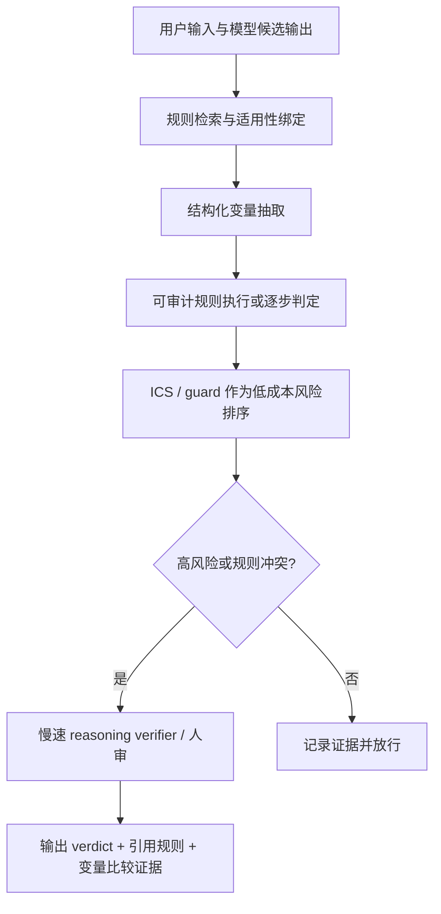

# What Do Compliance Detectors Read?：合规检测器到底读的是规则，还是场景气味？

## 元信息

| 字段 | 内容 |
|---|---|
| 论文 | What Do Compliance Detectors Read? An Audit of Activation Probes and Guard Models |
| 作者 | Saisab Sadhu, Aadit Sengupta, Vinay Kumar Sankarapu, Pratinav Seth |
| 机构 | Lexsi Labs |
| 链接 | [arXiv:2608.16852](https://arxiv.org/abs/2608.16852) |
| 官方日期证据 | arXiv `cs.AI/recent` 列在 `Tue, 18 Aug 2026` 批次；abs submission history 为 `Mon, 17 Aug 2026 17:37:07 UTC` |
| 类型 | AI 安全 / 合规监控 / 激活探针审计 |

## TL;DR

1. 这篇论文问一个非常具体的问题：合规检测器判断模型输出是否违规时，究竟有没有把“当前适用的书面规则”读进去，还是只是在识别场景文本里常见的违规气味。
2. 作者把这种失败命名为 **rule blindness**：删除规则、打乱规则、替换成错误领域规则，检测准确率几乎不变；即便是带 policy channel 的 Latent Policy Guard，也会引用到正确条款位置，却很少因为条款内容变化而改变 verdict。
3. 方法上，论文提出 **Internal Compliance Score, ICS**：从被监控模型自身 residual stream 的最后 token 激活中，用十对合规/违规样本估计一个均值差方向，再用一次点积给新 case 打分，不训练新模型。
4. ICS 的主结果是双面的：在 outcome-ablated OmniCompliance 上，in-domain AUROC 达到 `0.952`，高于 Llama Guard 3、WildGuard、HarmBench、Qwen3Guard 等 guard；但预注册 trivial-floor gate 只过 `11/20` 个领域，没达到作者自己设定的 `12/20` 门槛。
5. 评测有效性是论文最强的一层：七个公开 compliance benchmark 中有四个被 policy-blind bag-of-words floor 解决或压住，说明很多数据集不能证明“规则条件化理解”，只能证明表面文本可分。
6. 最关键的反证来自 crossed rule-scenario benchmark：`200` 个模板、`8` 个领域、`800` 行，把两条规则和两个场景交叉成四格，使单看规则或单看场景都不能预测标签；cheap detector 基本在 chance 附近，只有允许逐步推理的 judge 在 `40` 个 quadruple 子样本上到 `0.849` AUROC 和 `74.4%` 四格全对。
7. 实用价值不在“替代合规裁判”，而在低成本排序：ICS-guided selection 在 IFEval 的机械验证 pass rate 上提升 `+5.2` 个百分点，在六个监管 advisory 域的 LLM judge 任务上提升 `+11.5` 个百分点。
8. 安全边界很硬：ICS 需要一方激活访问，跨 compliance/safety family 会塌到约 `0.55/0.48`，阈值不能跨域直接搬，序列化顺序会影响结果，白盒 GCG 后缀攻击能把 ICS-guided verified pass 从 `0.70` 打到 `0.00`。

---

### 1. 论文真正要排除什么误解？

这篇文章不是在问“能不能训练一个更高分的合规分类器”。它先把一个更基础的审计问题放到台面上：

| 常见说法 | 作者要拆开的部分 |
|---|---|
| guard 准确率高，所以能做合规控制 | 准确率可能来自场景词汇，而不是规则-场景组合 |
| activation probe 读到了合规概念 | probe 可能只读到“违规口吻、风险语域、负面结果”的 broad signal |
| policy-conditioned guard 会看规则 | 它可能会引用条款，但 verdict 不受条款内容控制 |
| benchmark 分数能代表合规理解 | 如果标签写进文本或由文本模板泄露，benchmark 只能测 lexical shortcut |

作者举的核心场景很直观：

1. GDPR 存储限制原则被操作化为“个人数据应在九十天内删除”。
2. 场景写某公司保留数据四百天，因此在这条规则下应当违规。
3. 如果把规则换成无关规则或 permissive counterpart，检测器仍然判违规。
4. 那么检测器读到的不是“这条规则要求什么”，而是“这个场景看起来像隐私违规”。

这就是 **rule blindness** 的定义。它不等于模型完全没合规知识，也不等于输出一定错；它指的是：当 verdict 应该依赖当前书面规则时，detector 的判定对规则干预不敏感。

### 2. ICS 的机制：十对样本，一个方向，一次点积

ICS 的设计刻意保持简单，因为作者要用它做大规模审计，而不是把失败归因到复杂训练过程。

公式核心如下：

```text
给定模型 M，层 l，文本 x：

a_l(x) = 文本 x 在第 l 层最后 token 的 residual-stream 激活

给定 n 对校准样本：
  x_i^+ = 遵守规则的文本
  x_i^- = 违反规则的文本

正负类均值：
  ā_l^+ = (1/n) Σ_i a_l(x_i^+)
  ā_l^- = (1/n) Σ_i a_l(x_i^-)

合规方向：
  d_l = (ā_l^+ - ā_l^-) / (||ā_l^+ - ā_l^-|| + ε)

新样本得分：
  ICS_l(x) = <a_l(x), d_l>

约定：
  分数越高，越接近 adherent / compliant。
```

这里有几个容易被忽略的细节：

1. **不是 zero-supervision**：作者常用十对校准样本估计方向，但还要用两个 disjoint validation slices 选层 `l*` 和阈值 `τ`。
2. **不是训练-free 就等于无参数**：方向本身是一个由标签样本估计出来的读出向量，只是没有梯度下降、没有新分类器训练。
3. **不是阈值天然可迁移**：AUROC 衡量 ranking direction，真正部署时的 threshold 仍需要按领域校准。
4. **不是 norm trick**：作者检查了 cosine 版本，`||a||` 单独接近 chance，长度 alone 是 `0.566`，说明分数不能简单解释成文本长短。

流程可以这样看：


这条流水线的工程价值很明确：校准成本大约是 `2n` 次 forward pass，线上打分是一轮 forward、一次激活抽取、一次点积。对需要频繁换模型或微调后重测的组织来说，它比外置 guard 便宜得多。

但这也埋下论文的核心张力：便宜的一维方向到底读到了什么？

### 3. 为什么作者先审计 benchmark，而不是直接报分？

论文第三节很重要，因为它决定后面所有数字有没有解释权。

作者指出 OmniCompliance 的原始样本包含 `Rule`、`Scenario` 和 `Outcome` 字段；如果 `Outcome` 直接叙述监管结果，那么任何 probe 的 AUROC 都可能只是读到了答案。更麻烦的是，删除 `Outcome` 后，20-domain mean 只从 `0.968` 降到 `0.952`，说明标签不只在显式结果字段中，也被场景措辞冗余编码了。

作者给出的诊断不是“数据污染”这么窄，而是 **degeneracy**：

```text
如果标签 Y 几乎可以由文本表面 S(x) 决定，
那么 I(a(x); Y | S(x)) 没有空间体现。

也就是说：
  高 AUROC 不能证明激活携带了规则理解；
  它可能只是复制了文本表面已经泄露的可分结构。
```

公开 compliance benchmark 的审计结果如下：

| Benchmark | policy-blind lexical floor | ICS | budget null | 结论 |
|---|---:|---:|---:|---|
| OmniCompliance | `0.896` | `0.952` | `0.714` | degenerate |
| DynaBench | `0.982` | `0.784` | `0.576` | degenerate |
| SafePyramid | `0.90+` | `0.871` | `0.673` | degenerate |
| AIReg-Bench | `0.957` | `0.943` | `0.708` | degenerate |
| CompliBench | `0.879` | `0.700` | `0.549` | borderline |
| FlexBench | `0.802` | `0.832` | `0.603` | clean |
| IFEval | `0.574` | `0.628` | `0.530` | clean |

这个表的意义不是说这些数据集“没用”，而是说它们不能承载某一种 claim：

1. 可以测 detector 是否能识别某类文本风险。
2. 可以测 benchmark 本身是否有明显 surface shortcut。
3. 不能直接证明 detector 在组合“当前规则 + 当前场景”。

对 AI 安全评测来说，这一节的价值很大：作者不是把 baseline 当作可有可无的附录，而是把 lexical floor 作为 claim 的边界。

### 4. Guard 对比：ICS 分数高，但高分不等于读规则

在 outcome-ablated OmniCompliance 的 in-domain 设置里，ICS 的 AUROC 很强：

| Arm | AUROC | Native F1 | 10-pair recal. F1 |
|---|---:|---:|---:|
| ICS | `0.952` | `0.897` | `0.895` |
| Qwen3Guard-Gen 8B | `0.908` | `0.158` | `0.804` |
| 8B zero-shot LLM judge | `0.901` | `0.831` | `0.817` |
| WildGuard 7B | `0.875` | `0.124` | `0.715` |
| HarmBench classifier 7B | `0.735` | `0.094` | `0.656` |
| Llama Guard 3 1B | `0.749` | `0.265` | `0.580` |

这个表要分三层读：

1. **ranking 层面**：ICS 的 AUROC 高，说明它能把同域合规风险排得比较靠前。
2. **threshold 层面**：许多 guard 原生阈值在监管违规上 recall 很低；给它们十对目标域样本重新校准后，F1 明显恢复。
3. **claim 层面**：高 AUROC 仍然只说明“能排序”，不能说明“按规则判断”。

作者还做了 calibrate-once leave-one-distribution-out：

| 指标 | 数字 | 解释 |
|---|---:|---|
| LODO mean ICS AUROC | `0.728` | held-out distribution 未进入校准，仍有可用信号 |
| LODO budget null | `0.557` | 随机方向经同等选择预算后的基线 |
| per-distribution calibration upper bound | `0.849` | 同分布校准更强 |
| TF-IDF LODO mean | `0.728` | pooled mean 上与 ICS 持平 |
| OmniCompliance held out | `0.783` | 只用 TRIDENT + safety 校准仍能读到监管合规 |
| TRIDENT-law held out | `0.549` | 明显弱点，接近 chance |

这里最关键的一句是：**ICS 的 claim 是结构性的，不是“准确率统治”。** 它读被监控模型自身激活、可低成本重校准、适合做 triage 和 ranking；但 pooled generalisation 被 bag-of-words 追平，说明它不是 magically semantic。

### 5. 预注册门禁：作者自己把绝对探针 claim 压低

这篇论文比很多 probe 文章严格的一点，是它提前定义了一个 floor gate：

```text
目标：
  ablated ICS 必须超过 trivial floor。

trivial floor pool：
  TF-IDF
  keyword
  length
  VADER
  same-model Yes/No verdict logit
  SST-2 sentiment direction
  refusal direction

判定规则：
  20 个 domain 中至少 12 个，
  paired-bootstrap 95% CI 必须排除 0，
  Benjamini-Hochberg corrected。
```

实际结果是：

| 项目 | 数字 | 解释 |
|---|---:|---|
| ICS mean AUROC | `0.952` | outcome-ablated 20 域平均 |
| max trivial floor mean | `0.925` | 每域取最强 trivial baseline |
| mean margin | `+0.027` | 正但不大 |
| gate pass | `11/20` | 没达到预注册 `12/20` |
| 最强 floor | SST-2 sentiment direction | `14/20` 域中是最大 floor |
| TF-IDF mean | `0.896` | 仍然很强 |

这个失败很重要，因为它把论文从“我们有一个强 compliance probe”改写成更可信的命题：

1. ICS 确实能从激活里读到额外风险信号。
2. 这个信号的 absolute margin 并不总能压过廉价表面 baseline。
3. 部署价值主要来自 low-cost ranking、recalibration 和自我监控，不来自“probe 已证明理解规则”。
4. 当研究结论靠近阈值时，BH correction、浮点比较、baseline 命名过滤这类工程细节都足以改变 verdict。

作者还报告了失败模式：

| 失败类型 | 含义 |
|---|---|
| 小样本域 | `n <= 36` 时统计 power 不足 |
| ceiling floor | trivial floor 已经接近 `0.98`，probe 很难证明额外信息 |
| sentiment floor 追平 | 说明很多违规文本携带负面语气 |
| GDPR / foundational rights 仍失败 | 不是所有失败都能归因于低 power 或高 floor |

这一节对研究写作的启发是：如果一个安全 probe 没有预先列出 trivial floor pool，它的高 AUROC 至少应被降级为“候选信号”，而不是机制结论。

### 6. 数据与计算协议：为什么它是审计工具，而不是大训练项目？

作者的实验协议刻意压低训练成本，同时扩大审计覆盖。

| 维度 | 设定 |
|---|---|
| 主模型 | Llama-3.2-1B-Instruct |
| 模型族复验 | Llama、Qwen、Mistral、Gemma |
| 尺度 | 1B 到 72B |
| 激活位点 | 最后 token residual stream |
| dtype | 多数为 `bfloat16`，70B/72B 使用 int8 |
| 主 split | `40/20/20/20` train / val-layer / val-thresh / test |
| seed | `42`，并保证 grouped split 不跨边界共享文本 |
| 校准规模 | 每域十到两百对样本 |
| 统计 | paired bootstrap `B=2000`，BH correction，Clopper-Pearson bound |
| 最贵组件 | 白盒 GCG 攻击，20 个 prompt，每个 40 步 |

这个协议有两个研究含义：

1. **它适合做反复审计**：一个组织可以在模型微调后重新抽十对样本估计方向，快速检查风险信号是否漂移。
2. **它不适合做最终合规证明**：因为标签、阈值、序列化和 threat model 都会影响结果，probe 只能成为证据链的一段。

可以把 ICS 的角色写成：

```text
不是：
  legal compliance oracle
  adversarially robust guard
  rule-conditioned reasoner

更像：
  first-party activation-based risk sensor
  cheap candidate ranker
  benchmark degeneracy audit tool
  drift triage signal
```

这也解释了作者为什么反复把“方向”和“阈值”分开：

1. 方向回答“这个样本在风险轴上排在哪里”。
2. 阈值回答“这个业务域里到哪里开始拦截”。
3. 跨域时方向可能还能排序，阈值却可能让 false positive tail 暴涨。

### 7. 规则盲视：规则删除后，分数甚至略升

论文最强的实验证据是 rule intervention。

作者把规则块做四类干预：

1. 保留正确规则。
2. 完全删除规则。
3. 打乱规则。
4. 替换成错误领域规则。
5. 只保留规则、删掉场景，作为 positive control。

结果如下：

| 条件 | ICS 1B AUROC | null | 相对 correct rule 的变化 | 显著下降领域 |
|---|---:|---:|---:|---:|
| Correct rule | `0.9519` | `0.714` | baseline | - |
| No rule at all | `0.9549` | `0.719` | `+0.003` | `0/20` |
| Shuffled rule | `0.9548` | `0.713` | `+0.003` | `0/20` |
| Wrong-domain rule | `0.9554` | `0.712` | `+0.003` | `0/20` |
| Rule only, no scenario | `0.5627` | `0.527` | `-0.389` | `19/20` |

这组结果很难被轻轻带过：

1. 如果删除规则没有损失，detector 的主要信号不在规则。
2. 如果 wrong-domain rule 没有损失，detector 也不是简单读“有没有规则块”。
3. 如果 rule-only 会塌，test 有 power，说明不是干预太弱。
4. 如果 TF-IDF 在 no-rule 也涨，场景文本本身确实携带强表面信号。

作者又做了 cross-model 复验：

| 模型 | correct | no-rule | 显著下降 |
|---|---:|---:|---:|
| Llama-3.2-1B | `0.9519` | `0.9549` | `0/20` |
| Llama-3.2-3B | `0.9580` | `0.9565` | `0/20` |
| Llama-3.1-8B | `0.9624` | `0.9604` | `0/20` |
| Qwen2.5-7B | `0.9631` | `0.9604` | `2/20` |
| Qwen3-8B | `0.9528` | `0.9493` | `2/20` |

因此它不是单一 checkpoint 的偶然现象。

### 8. Crossed benchmark：把规则和场景都变成不能偷看的变量

固定场景、翻转规则的 counterfactual 有一个隐藏问题：如果所有标签变化都由 permissive / prohibitive rule polarity 决定，那么 detector 可能只学规则极性，不学规则-场景组合。作者用 crossed design 解决这个 confound。

构造如下：

```text
每个模板有：
  两条规则：R0, R1
  两个场景：Sa, Sb

交叉成四格：
  R0 + Sa -> violation
  R0 + Sb -> compliant
  R1 + Sa -> compliant
  R1 + Sb -> violation

约束：
  同一条规则出现两次，一次正例一次负例；
  同一个场景出现两次，一次正例一次负例；
  rule-only、scenario-only、rule+scenario TF-IDF 都是 0.500 AUROC；
  200 个模板，8 个监管领域，共 800 行。
```

一个金融例子是：

| 元素 | 内容 |
|---|---|
| R0 | dormant retail 账户阈值 `1000`，institutional 阈值 `5000` |
| R1 | 两个阈值交换 |
| Sa | retail 账户余额 `2500` |
| Sb | institutional 账户余额 `2500` |

要做对四格，detector 必须执行组合：

```text
读取场景账户类型 -> 找到规则中该类型阈值 -> 比较 2500 与阈值 -> 输出 verdict
```

结果是：

| Detector | AUROC | quadruple exact |
|---|---:|---:|
| TF-IDF rule/scenario/both | `0.500` | `0.0%` |
| frozen ICS 1B/8B/Qwen3-8B | `0.50-0.54` | `0.0-3.5%` |
| best refit Qwen3-8B MLP | `0.670` | `11.0%` |
| Llama Guard 3 / Qwen3Guard | `0.50-0.52` | `0.0-0.5%` |
| LPG-4B custom policy | `0.535` | `1.0%` |
| Rachmil whitening detector | `0.498` | `0.0%` |
| forced-choice judge, one token | `0.507` | `0.0%` |
| same judge with step-by-step reasoning | `0.849` | `74.4%` |

这个表把论文的主张钉得很牢：

1. benchmark 不是不可解，因为逐步推理 judge 能明显解。
2. cheap one-pass detector 没有学到组合关系。
3. 直接在 crossed data 上 refit 会有一点信号，但远未解决。
4. policy-conditioned guard 也没有逃出 rule blindness。

这也解释了为什么作者强调 **one-pass detector**。规则合规本质上像小型程序执行：选择适用条款、绑定场景变量、比较阈值、处理例外。一个局部激活方向可以读 broad risk register，但很难保证读到了这段程序。

### 9. LPG 的细节：引用条款和按条款裁判是两回事

Latent Policy Guard 是本文里最值得单独看的一类对照，因为它不是 fixed-taxonomy guard，而是接收 policy channel 的 guard。按直觉，它最应该避免“没读规则”的批评。

作者的 replication 结果却很尖锐：

| 干预 | 现象 |
|---|---|
| 移除 violated policy | 只有 `44.5%` 已判 unsafe 的样本翻到 safe |
| 保留 decoy，只移除 violated policy | 同样只有 `44.5%` 翻转 |
| 用 permissive counterpart 替换 violated policy | 只有 `7.1%` 翻转 |
| 打乱 policy 顺序 | verdict consistency `92.5%` |
| 添加更多无关 policy | 错误翻转只有 `2.7%` |
| 让模型引用条款位置 | `91-95%` 情况能引用正确 violated rule 的 list position |

这里最值得带走的是区分：

1. **citation fidelity**：模型能指到正确条款。
2. **adjudication dependence**：verdict 是否真的依赖条款内容。

LPG 在第一项上看起来不错，在第二项上失败。对合规系统而言，这比普通分类器错判更危险，因为审计日志会给人一种“系统看过规则”的感觉。

### 10. 实用结果：ICS 更像排序器，而不是裁判

尽管 rule blindness 限制很强，ICS 仍有一个合理用途：对多个候选输出做低成本排序。

作者做了两类 selection 实验：

| 场景 | 结果 | 解释 |
|---|---:|---|
| IFEval 机械 verifier，`541` cases | `+5.2` percentage points | 用 ICS 排候选响应，提高机械通过率 |
| 六个 regulatory advisory domain，LLM judge | `+11.5` percentage points | 在非机械但监管相关输出中也有提升 |
| OmniCompliance best-of-5 sanity check | 1B 从 random `0.541` 到 ICS-guided `0.872` | 验证 direction 确实能做 menu verdict selection |

OmniCompliance 的 best-of-5 表更适合看机制：

| Generator | blind | random | ICS-guided | oracle | headroom |
|---|---:|---:|---:|---:|---:|
| Llama-3.2-1B | `0.569` | `0.541` | `0.872` | `0.961` | `78.8%` |
| Llama-3.2-3B | `0.771` | `0.773` | `0.889` | `0.946` | `66.7%` |
| Mistral-7B | `0.775` | `0.770` | `0.795` | `0.805` | `71.8%` |
| Llama-3.1-8B | `0.783` | `0.781` | `0.889` | `0.945` | `66.1%` |
| Gemma-2-9B | `0.797` | `0.793` | `0.832` | `0.848` | `70.4%` |
| Qwen2.5-7B | `0.843` | `0.842` | `0.862` | `0.873` | `63.9%` |

但作者非常谨慎：这只是 selection，不是 adversarial enforcement。只要攻击者知道方向并能优化后缀，安全性就会塌。

白盒攻击结果如下：

```text
攻击：12-token GCG suffix
步骤：40 steps
样本：20 个 stratified attackable IFEval prompts
效果：
  fixed suffix 对 faithful ICS 的移动：+0.10
  adaptive white-box suffix 的移动：+1.66，约 16 倍
  official verifier：52/53 poisoned responses 仍失败
  ICS-guided verified pass：0.70 -> 0.00
```

这说明 ICS 可以帮助可信候选池排序，但不能作为开放对抗场景的独立 gate。

### 11. 消融和失败案例：作者把“便宜”与“准确”分开

论文在附录里做了大量 sanity check，几个最重要的如下：

| 问题 | 证据 | 含义 |
|---|---|---|
| 是不是哪十对 calibration pair 特别幸运？ | 50 个随机 10-pair draw，跨域 `σ≈0.014` | 小样本方向较稳定 |
| 多给样本是否持续提升？ | `n=20` 已在 full-data value 1% 内 | 数据效率高，但不是无监督 |
| logistic probe 会不会更好？ | `n=10` 时 15/20 域 logistic tie/beat ICS，均值 `+0.003` | ICS 的优势是闭式低成本，不是最高精度 |
| pooling/site 是否关键？ | mean-over-all-tokens 代价 `-0.099`，15/20 显著损失 | last-token residual 是当前配置核心 |
| 是否跨模型成立？ | 12 个模型、4 个架构族、1B 到 72B，margin 在 `+0.053` 到 `+0.068` | broad risk direction 可复现 |
| 是否读最近语域？ | 追加一句 compliant-register sentence 会翻转 `72.4%` 已抓到违规 | probe 对序列末端语气非常敏感 |
| 阈值能不能跨域搬？ | within-domain ECE `0.023`，cross-domain ECE `0.156`；FPR@95 从 `27.7%` 到 cross-domain mean `34.7%`，p95 可到 `77-94%` | 方向可迁移，operating point 不可盲搬 |

这些结果把 ICS 的位置校准得很清楚：

1. 它接近 regularized linear probe 的小样本闭式近似。
2. 它不是神奇解释器。
3. 它非常依赖文本序列化和读出位置。
4. 它能跨模型复现 broad signal，但不能自动跨任务 family。

### 12. Figure 与 Table 证据怎么读？

原文有多张图，但本文没有本地化图片，因为关键证据都可以用表格和公式重建。更重要的是理解每张图表在论证中的位置。

| 原文证据 | 支撑的 claim | 不能支撑什么 |
|---|---|---|
| Figure 1 pipeline | ICS 的 offline calibration 和 online scoring 很便宜 | 不能证明规则理解 |
| Table benchmark degeneracy | 公开 compliance set 常被 lexical floor 压住 | 不能说这些数据集完全无价值 |
| Table LODO | pooled direction 在未见 distribution 上有信号 | 不能说 threshold 可跨域部署 |
| Table detector comparison | ICS ranking 高于多种 deployed guard | 不能说 guard 在合理校准下完全无用 |
| Table rule intervention | no-rule / wrong-rule 不降分 | 强力支持 rule blindness |
| Table crossed benchmark | cheap detector 在无捷径四格任务上近 chance | 说明 one-pass signal 没有完成组合推理 |
| Figure headroom | selection gain 随 oracle headroom 增大 | 不能推出对抗环境稳健 |
| Figure calibration sensitivity | 十对样本方向相对稳定 | 不能推出无标签或无验证集 |

这组证据的排列顺序很讲究：

1. 先证明方法便宜。
2. 再证明常规 benchmark 分数可能无效。
3. 然后给出高分对比，但马上收束 claim。
4. 接着用规则干预和 crossed benchmark 证明 detector 没读规则。
5. 最后只留下一个窄用途：非对抗候选排序。

这种写法避免了“先卖方法、再把局限藏到最后”的常见问题。局限不是附录装饰，而是主结论的一部分。

### 13. 读法转换：从合规检测推广到 Agent policy enforcement

虽然论文写的是合规 monitor，但它对 Agent 安全也有直接关系。原因是 Agent policy enforcement 也常常长这样：

```text
Policy:
  不能访问某类文件；
  不能向外部域名发送敏感数据；
  预算超过阈值需要升级审批；
  工具调用必须满足来源和目的约束。

Scenario:
  agent 读取文件、调用工具、转写摘要、提交网络请求。

Verdict:
  allow / warn / block / escalate。
```

这和论文里的合规任务共享一个结构：verdict 不是只看场景，也不是只看规则，而是看二者的组合。

如果把本文的 crossed design 移到 Agent 场景，可以得到更强的安全评测：

| 评测变量 | 合规论文中的形式 | Agent policy 中的对应物 |
|---|---|---|
| rule R0/R1 | 不同阈值、不同主体、不同例外 | 不同文件域、网络域、工具权限、预算 |
| scenario Sa/Sb | 同一个数值落在不同主体上 | 同一工具调用落在不同数据类别或目的上 |
| label flip | 规则和场景交叉后翻转 | policy exception 或 boundary condition 翻转 |
| shortcut control | rule-only / scenario-only chance | 单看工具名或文件名不能预测 verdict |
| positive control | step-by-step judge 可解 | 显式 policy interpreter 可解 |

这会避免一种常见假象：

1. detector 看见 `secret`、`credential`、`exfiltrate` 就拦截。
2. benchmark 因为这些词和违规高度相关，所以分数很好。
3. 但真实 policy 可能允许读取 secret 并禁止外传，或允许内部域传输而禁止第三方域。
4. 如果不做 crossed control，就无法知道 detector 是否理解了权限边界。

因此，这篇论文对后续 Agent 安全评测的直接建议是：

```text
每个 policy claim 至少提供：
  no-policy 条件
  wrong-policy 条件
  permissive counterpart
  policy-only baseline
  scenario-only baseline
  crossed policy-scenario quadruples
  slow reasoner positive control
  white-box / adaptive attack condition
```

这比单纯扩充 benchmark 数量更重要。更多样本只能降低方差，不能自动修复 construct validity。

### 14. 相关工作位置：这篇论文真正推进了什么？

作者把 ICS 放在 representation engineering、refusal direction、mass-mean probing、activation-space policy detection 这条线上。最近邻包括：

1. safety hidden-state probes：用内部表示检测 harmful content。
2. whitening-style policy violation detection：用 activation-space OOD score 读政策违反。
3. dynamic policy-conditioned guards：在 inference 时接收新 policy，而不是重新训练。
4. lexical shortcut / hypothesis-only baseline：在 NLI、jailbreak、hallucination benchmark 中用表面线索拆穿伪高分。

本文真正推进的不是又发明一个 probe，而是把 probe claim 做了三层约束：

| 层级 | 作者做法 | 贡献 |
|---|---|---|
| 评测层 | lexical floor、budget null、pre-registered gate | 防止把 shortcut 当成机制 |
| 干预层 | no-rule、wrong-rule、rule-only、crossed rule-scenario | 直接测 detector 是否依赖规则 |
| 部署层 | candidate selection + white-box attack | 区分非对抗排序和对抗 enforcement |

这套结构对 AI 安全研究很有参考价值。很多安全 probe 论文会停在“AUROC 很高”，但本文追问的是：

```text
高分来自哪里？
如果删掉被声称使用的输入，分数还在吗？
如果 benchmark 本身泄露标签，分数还能支持原 claim 吗？
如果攻击者知道 probe，部署收益是否还存在？
```

### 15. 结论与局限

论文最后的结论可以压缩成四句话：

1. ICS 是一个低成本 compliance-risk readout：十对样本、一次均值差方向、一次点积。
2. 它在同域 ranking 上强，在 leave-one-distribution-out 中仍有信号，也能在候选选择里提高 verified pass。
3. 它和现有 guard / probe 一样，不可靠地读取当前规则；更准确说，它读的是 broad compliance-risk register。
4. 真正需要规则组合推理的任务，仍要显式 reasoning、结构化执行或更强的 policy-grounded adjudication。

边界必须一并带走：

| 边界 | 为什么重要 |
|---|---|
| 需要 activation access | 适合 first-party monitoring，不适合第三方黑盒审计 |
| family transfer 弱 | compliance 和 safety 不能互相无痛迁移 |
| threshold 不可直接跨域 | AUROC 好不等于部署 operating point 稳定 |
| rule blindness 未解决 | 只能读 broad risk，不能保证按当前规则判案 |
| 序列化敏感 | 文本结尾位置和 register 会影响读数 |
| 白盒攻击可破 | 不能作为 standalone adversarial guard |
| benchmark 退化常见 | 很多公开合规集不能验证规则条件化 claim |

### 16. 研究者视角的继续追问

这篇论文最值得沿用的不是 ICS 本身，而是它的审计方式。

后续问题可以拆成三条线：

1. **机制线**：如果 one-pass activation readout 只读 broad risk register，那么规则组合到底发生在哪些计算步骤里？是需要显式 scratchpad、工具执行、检索 grounding，还是需要多步 verifier？
2. **评测线**：合规、安全和 agent policy benchmark 应默认提供 rule-only、scenario-only、wrong-rule、no-rule、crossed-design floor；否则任何高分都可能只是表面可分。
3. **部署线**：低成本 probe 可以做 triage、排序、监控漂移，但真正的 enforcement 应当把 probe 当作信号源之一，而不是最终裁判。

一个更稳的系统形态可能是：



这篇文章对 AI 安全的提醒很朴素但尖锐：**一个系统能指出规则，不代表它的裁判依赖规则；一个 probe 能读到风险，不代表它读到了规则条件。** 对合规监控、agent policy enforcement、后训练安全评测来说，这个区分比单个 AUROC 更重要。

## 参考与检索说明

1. 官方论文页：[arXiv:2608.16852](https://arxiv.org/abs/2608.16852)。
2. 官方 HTML 正文：[arXiv HTML](https://arxiv.org/html/2608.16852)。
3. 官方列表日期证据：[cs.AI recent](https://arxiv.org/list/cs.AI/recent)，该论文列在 `Tue, 18 Aug 2026` 批次。
4. 第三方检索词：`"What Do Compliance Detectors Read" "Activation Probes"`、`"2608.16852" "Internal Compliance Score"`、`"Internal Compliance Score" "rule blindness"`。当前只找到 arXiv 镜像、论文聚合页和自动摘要页，未找到作者博客、代码仓库或可审计的独立复现实验。
