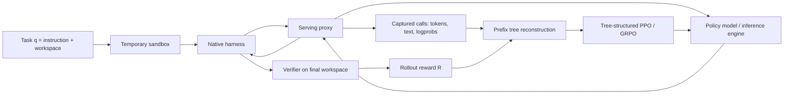

# ClawGym II：把黑盒 Agent Harness 变成可训练的 RL 环境

## 元信息与 TL;DR

| 项目 | 内容 |
|---|---|
| 论文 | ClawGym II: Exploring Black-Box RL on Agent Harness |
| 类型 | 论文，arXiv:2608.16798v1 |
| 作者 | Huatong Song, Fei Bai, Ming Yang, Renyuan Li, Jia Deng, Jujie He, Zhange Zhang, Daixuan Cheng, Yan Xing, Qi Yun, Xuxing Chen, Danyang Li, Feng Chang, Chuan Hao, Ran Tao, Jian Yang, Bryan Dai, Wayne Xin Zhao, Mingjie Tang, Ji-Rong Wen |
| 官方链接 | https://arxiv.org/abs/2608.16798 |
| 日期证据 | arXiv 单篇页显示 Submitted on 17 Aug 2026；arXiv API 的 published/updated 均为 2026-08-17T16:53:03Z；arXiv cs.CL recent 在 Tue, 18 Aug 2026 列出该条目 |
| 研究对象 | 复杂 Agent harness 下的黑盒强化学习、prefix tree 轨迹恢复、PPO/GRPO 后训练、mix-harness 统一训练 |

### TL;DR

- **研究问题**：Claude Code、OpenClaw、Codex 这类 harness 已经把工具编排、上下文管理、重试、恢复和子代理封装成复杂运行时；但 RL 训练通常看不见 harness 内部控制流，只能看到一串被代理边界打散的模型调用。
- **核心方法**：ClawGym II 把 harness 当成不改动的黑盒 rollout engine，在模型服务边界放置 serving proxy，捕获每次模型调用、采样 token、logprob 和最终 reward，再把碎片化调用恢复成 rollout-level prefix tree。
- **优化机制**：论文把 GRPO 和 PPO 改造成“树上优化”。GRPO 在同一 task 的 rollout group 内归一化 reward，并把同一 rollout 的 advantage 分配给保留下来的训练 token；PPO 用简化的 `gamma=1, lambda=1` 处理 forked trajectory。
- **一致性机制**：为了避免 harness 重新序列化 tool call 后改变训练序列，作者采用 token-in-token-out 纪律：训练只读 rollout 时真实采样的 token；harness 看到的结构化文本只是从这些 token 解码而来，不再反向重编码。
- **关键数字**：在 Qwen3-30A3B 上，黑盒 RL 通过 OpenClaw 和 Claude Code 分别让 ClawGym-Bench Pass@1 提升 `+9.98` 与 `+14.81` 点，让 PinchBench 提升 `+11.71` 与 `+17.28` 点；训练曲线在约 `200-400` 步内保持稳定上升。
- **跨 harness 证据**：mix-harness 训练把 OpenClaw 与 Claude Code 的 task-harness pair 混入同一训练批次；优势归一化仍按 pair 分组，最终单个模型可以同时服务两种运行时，而不是只记住一种 harness 的交互习惯。
- **扩展证据**：在更难的 JobBench-style 与 OfficeQA-style 任务上，Claude Code rollout 下的黑盒 RL 把 JobBench-Easy 从 `20.46` 提到 `27.20`，把 OfficeQA-Full 从 `8.53` 提到 `21.54`。
- **边界与局限**：prefix tree 过滤会丢弃 dead leaves、过度分支任务和辅助轨迹，因此没有解决 subagent/compaction 的精确信用分配；PPO 的树上处理仍是简化近似，闭源 harness 的可复现实验也依赖服务接口、评测器和模型版本稳定。

## 研究问题：为什么“能跑的 Agent harness”还不能直接成为 RL 环境？

### 作者重新定义了 Agent 训练对象

论文的切入点不是“再做一个 Agent benchmark”，而是把现代 Agent 的运行方式重新写成训练问题：

```text
q = (u, W_0)

u   : 用户指令
W_0 : 初始工作区，包含文件、目录、服务、文档或代码库
E_q : 由 W_0 初始化出的可执行环境
```

在一次任务中，Agent 会产生多轮交互：

```text
tau = (o_1, a_1, ..., o_T, a_T)

o_t : 第 t 步观察
a_t : 第 t 步模型动作
W_T : 最终工作区状态
R   : 基于最终状态计算出的 rollout-level reward
```

这个定义有两个含义：

- reward 通常来自最终 workspace，而不是每个 token 的即时反馈；
- 训练信号必须回传到长轨迹里的模型 token，否则 RL 只能看到“这个任务最后成了或没成”。

### Harness 让问题变复杂，也让训练更现实

现代 harness 不只是一个 ReAct loop。论文把 harness 抽象为：

```text
(W_{t+1}, o_{t+1}, c_{t+1}) = H(W_t, c_t, a_t)

H   : harness 运行时
W_t : 工作区状态
c_t : harness 维护的上下文
a_t : 模型输出的动作
o_t : 返回给模型的观察
```

这说明模型并不直接控制环境：

- harness 可能重写工具调用格式；
- harness 可能压缩上下文；
- harness 可能重试一次 malformed tool call；
- harness 可能启动 subagent；
- harness 可能在隐藏逻辑中恢复失败状态。

因此，RL 面临的不是普通文本环境，而是一个“不透明但强大的执行层”。

| 训练设定 | 可见内容 | 难点 | 论文立场 |
|---|---|---|---|
| 单轮文本 RL | prompt、response、reward | 信用分配较短 | 已有 PPO/GRPO 可直接使用 |
| 白盒 agent loop | 显式状态转移与工具结果 | 需要手写 loop，和真实 harness 可能不同 | 可训练，但迁移到外部 harness 有落差 |
| 黑盒 harness RL | 模型服务边界的调用记录与最终 reward | 轨迹碎片化、分支、重试、序列不一致 | ClawGym II 的目标 |

### 三个核心挑战

论文把问题压成三个挑战，而每个挑战都对应后文的一个机制：

| 挑战 | 具体表现 | 对应设计 |
|---|---|---|
| 可扩展执行 | 每个 rollout 都会改文件、跑工具、启动服务，失败会污染状态 | sandbox-based execution infrastructure |
| 碎片轨迹优化 | harness 暴露的是多次模型调用，不是干净的单条 episode | serving proxy + prefix tree |
| 多 harness 泛化 | OpenClaw、Claude Code 的协议和上下文策略不同 | mix-harness training |

## 论文主张与论证路线

| Claim | Mechanism | Evidence | Boundary |
|---|---|---|---|
| 黑盒 harness 可以成为 RL rollout engine | 不改 harness，只在模型边界加 proxy，捕获 token/logprob/reward | OpenClaw 与 Claude Code 两种结构不同的 harness 都能训练 | 依赖 harness 能被接到同一模型服务边界；闭源运行细节仍不可审计 |
| 碎片化调用可以恢复为可训练轨迹 | rollout-level prefix tree，保留共享前缀、过滤 dead leaves 和辅助轨迹 | Table 1 的 ClawII-OC/CC 在 ClawGym-Bench 和 PinchBench 上均提升 | 对 subagent 与 compaction 的信用分配被暂时排除 |
| PPO/GRPO 能适配树结构 | GRPO 按 rollout group 估计 advantage，PPO 用 `gamma=lambda=1` 简化 GAE | Figure 2/3 报告 200-400 步内 reward、entropy、eval score 稳定 | PPO 的树上 credit assignment 不是完整解 |
| 一个模型能跨 harness 联合优化 | 每个 `(task, environment, harness)` 是一个 task-harness pair，pair 内独立归一化 advantage | Figure 4 显示 mix-harness reward 与单 harness 训练接近或追平 | 论文只覆盖 OpenClaw 与 Claude Code，未证明任意 harness 组合都可行 |
| 方法能扩展到更难任务 | 用 instruction、workspace、verifier 三元组接入新任务 | JobBench-Easy `20.46 -> 27.20`；OfficeQA-Full `8.53 -> 21.54` | 任务仍需要可靠 verifier，开放世界任务不一定满足 |

## 方法机制：从黑盒调用到树上 RL

### 1. Sandbox 承载状态ful rollout

黑盒 RL 的第一层是执行基础设施。每个任务启动独立临时 sandbox：

- sandbox 初始化 `W_0`；
- harness 在 sandbox 内运行；
- 常见工具和任务专属工具通过 MCP server 暴露；
- rollout 结束后，verifier 检查最终 workspace；
- sandbox 被释放，避免状态污染后续任务。

这一层的意义很具体：

- **隔离性**：并发 rollout 不共享文件和服务状态；
- **忠实性**：harness 以原生方式运行，不需要把内部逻辑改写成训练框架；
- **可扩展性**：训练引擎只调度 rollout 与收集记录，不承担工具执行细节；
- **可插拔性**：OpenClaw、Claude Code 这类不同 harness 可以接入同一训练边界。

### 2. Serving proxy 只抓模型边界

论文的关键工程决策是把训练系统放在“模型服务边界”，而不是“harness 内部”：



这带来一个重要取舍：

- 好处：无需复刻 harness 的内部状态机；
- 代价：训练系统看到的是被调用边界切开的局部记录，必须重新恢复轨迹结构。

### 3. Prefix tree 恢复长程结构

一次黑盒 rollout 暴露出一组模型调用：

```text
C = {(x_i, y_i)}_{i=1}^m

x_i : 第 i 次模型调用的输入上下文
y_i : 第 i 次模型响应
```

如果直接把每个 `(x_i, y_i)` 当独立样本训练，会出两个问题：

- 长程历史被切碎，模型学不到一个任务内的状态推进；
- 多个调用共享的前缀会被重复训练，带来偏置。

论文的 prefix tree 规则如下：

```text
Input:
  captured calls C = {(x_i, y_i)}
  initial task prompt root

State:
  rollout-level tree T
  each node stores generated tokens or harness-introduced observations

Loop:
  for each call (x_i, y_i):
    1. find node p whose accumulated history is the longest prefix of x_i
    2. attach y_i as a child continuation of p
    3. recover non-model content between parent history and x_i
    4. append tool outputs / observations as environment nodes

Output:
  root-to-leaf candidate trajectories
```

这不是形式主义。它直接对应现代 harness 的三类现象：

| Harness 行为 | 在 prefix tree 中的表现 | 为什么不能忽略 |
|---|---|---|
| tool call retry | 同一历史下出现短 dead leaf | 错误尝试不应继承最终成功 reward |
| context compaction | 从压缩上下文启动新分支 | 不能简单拼接成一条原始历史 |
| subagent 调用 | 辅助分支与主任务轨迹并存 | rollout reward 未必能归因给辅助轨迹 |

### 4. 过滤：宁可少训练，也不要把错分支当正例

论文过滤三类轨迹：

| 过滤项 | 触发原因 | 训练风险 |
|---|---|---|
| dead leaves | malformed tool call 或 inference retry 产生的短分支 | 把失败重试当成有效策略 |
| over-branching tasks | 一个 rollout 产生过多叶子 | 常意味着生成反复失败或控制流异常 |
| auxiliary trajectories | subagent 或 compaction 分支 | 同一最终 reward 无法清晰分配给辅助过程 |

这个选择很保守：

- 它优先保证训练信号干净；
- 它牺牲了一部分 harness 能力；
- 它把“如何给 subagent 和 compaction 分配 credit”留给后续工作。

## 算法流程、公式与伪代码

### GRPO：rollout-level reward，tree-level token loss

GRPO 的优势估计按同一任务的 `n` 个 rollout 做归一化：

```text
A_i = (R_i - mu_q) / (sigma_q + epsilon)

mu_q    = (1/n) * sum_j R_j
sigma_q = sqrt((1/n) * sum_j (R_j - mu_q)^2)
```

变量解释：

| 变量 | 含义 |
|---|---|
| `q` | 当前任务 |
| `g_i` | 第 `i` 个 rollout |
| `R_i` | 第 `i` 个 rollout 的最终 reward |
| `A_i` | 第 `i` 个 rollout 的 advantage |
| `tau_{i,j}` | 从 prefix tree 里保留的第 `j` 条 root-to-leaf 轨迹 |

关键点是：

- `A_i` 只按 rollout 算一次；
- 同一 rollout 中多个保留轨迹共享这个 advantage；
- 共享前缀 token 在一个 rollout 内只计算一次，防止分支多的 rollout 权重过大。

### PPO：简化处理 forked trajectory

PPO 需要 value model，因此树上 credit assignment 更难。论文采用简化设定：

```text
gamma = 1
lambda = 1

A_t = R_i - V_phi(s_t)
```

这个公式的含义是：

- 每条保留轨迹在自己的 final token 处收到 rollout reward；
- 不在兄弟分支之间传播 advantage；
- value model 必须从中间状态估计长程回报；
- 方差可能更大，作者明确把更原则化的树上 PPO 留作未来工作。

### Token-in-token-out：训练序列必须等于采样序列

黑盒 harness 会改写模型输出：

- 工具调用可能被规范化；
- assistant message 可能被重新序列化；
- 后续上下文可能包含 harness 修订后的文本。

如果训练时重新 tokenize 这些“harness 处理后的文本”，训练序列就不等于 rollout 时真实采样序列。论文的纪律是：

```text
generated tokens from inference engine
  -> graft directly onto prefix tree
  -> used as the only training sequence

decoded structured text
  -> consumed by harness
  -> may be normalized or reformatted
  -> never re-encoded as training target
```

剩下的 mismatch 是概率层面的：

```text
pi_rollout(a_t | s_t) != pi_old(a_t | s_t)
```

原因是 rollout engine 与 training engine 可能使用不同精度、kernel 或并行策略。论文用 token-level importance correction：

```text
w_t = min(
  exp(log pi_old(a_t | s_t) - log pi_rollout(a_t | s_t)),
  c_bar
)
```

这不是无偏的完整 sequence-level correction，而是一个低方差近似：

- sequence-level ratio 理论上更干净；
- 长程 Agent trajectory 会让 variance 爆炸；
- token-level 截断权重在工程上更稳。

### 端到端伪代码

```text
Input:
  task distribution D
  harness set H = {OpenClaw, Claude Code, ...}
  policy pi_theta
  verifier V

State:
  replay buffer of captured model calls
  rollout-level prefix trees
  optimizer state for PPO or GRPO

For each optimization step:
  1. sample task q = (u, W_0) from D
  2. choose one harness h or a mix-harness task-harness pair
  3. launch temporary sandbox with W_0 and h
  4. route every model call through serving proxy
  5. record sampled tokens, decoded text, log pi_rollout, and call context
  6. after harness terminates, run verifier V on final workspace W_T
  7. build prefix tree from captured calls
  8. remove dead leaves, over-branching rollouts, and auxiliary trajectories
  9. compute rollout-level advantage:
       if GRPO: normalize R_i inside task or task-harness group
       if PPO: use value model with gamma = lambda = 1 simplification
 10. apply token-in-token-out training sequence and importance correction
 11. update pi_theta and sync it back to inference engine

Output:
  harness-trained agent model

Failure boundaries:
  discard rollout if sandbox fails, verifier is unreliable, or tree branches excessively
  do not assign final task reward to subagent/compaction trajectories
```

## 实验设置：作者到底验证了什么？

### Harness 与模型

论文使用两个代表性 harness：

| Harness | 定位 | 为什么适合作对照 |
|---|---|---|
| OpenClaw | 面向个人助手与 workspace-grounded tasks 的通用 harness | 覆盖文档、文件、工具、工作区状态 |
| Claude Code | 面向长程 coding 和 terminal interaction 的成熟 harness | 代表封闭、复杂、工程化更强的代码运行时 |

模型与训练族：

| 模型族 | 初始化 | 训练方式 |
|---|---|---|
| Qwen3-8B / Qwen3-30A3B | base model | 作为黑盒 RL 起点 |
| ClawGym-Agents | SFT baseline | 来自前作 ClawGym 的轨迹训练 |
| ClawII-OC | OpenClaw rollout | OpenClaw 下黑盒 RL |
| ClawII-CC | Claude Code rollout | Claude Code 下黑盒 RL |
| ClawII-Cold | lightweight cold start | OpenClaw 因数据可用性先使用 cold start |

### 数据、指标与评测协议

评测核心是 Pass@1：

- **ClawGym-Bench**：代码 verifier 任务直接用 verifier；代码 + rubric 混合任务按 `0.7` 代码检查与 `0.3` rubric judgment 加权；
- **PinchBench**：使用 2026-04-10 发布的任务集，去掉 multimodal tasks，保留 `30` 个任务；
- rubric-based judgment 使用 GPT-5.4 和附录中的评测 prompt；
- 最大上下文窗口设为 `64K` tokens，更长轨迹交给对应 harness 的 context management。

训练动态实验：

| 算法 | batch 设置 | 直觉 |
|---|---|---|
| GRPO | `32` tasks，每个 task `8` rollouts | 每个任务有 group reward，可做相对优势估计 |
| PPO | `256` tasks，每个 task `1` rollout | rollout budget 相同，但覆盖更多独立任务 |

这个对照很关键：作者不是只展示“GRPO 能跑”，而是把 PPO 与 GRPO 放在相同 rollout budget 下比较稳定性。

## 主结果：黑盒 RL 是否真的提升了 harness 内表现？

### Table 1 的核心数字

| 训练 / 评测设置 | 初始模型 | 训练后模型 | ClawGym-Bench Avg. | 提升 |
|---|---:|---:|---:|---:|
| OpenClaw harness | Qwen3-30A3B `45.11` | ClawII-OC-30A3B `55.09` | `55.09` | `+9.98` |
| Claude Code harness | Qwen3-30A3B `45.05` | ClawII-CC-30A3B `59.86` | `59.86` | `+14.81` |
| OpenClaw PinchBench | Qwen3-30A3B `55.60` | ClawII-OC-30A3B `67.31` | `67.31` | `+11.71` |
| Claude Code PinchBench | Qwen3-30A3B `48.00` | ClawII-CC-30A3B `65.28` | `65.28` | `+17.28` |

这些数字支撑的 claim 是：

- 复杂 harness 下的黑盒 RL 不是只会 overfit 一个 evaluator；
- OpenClaw 与 Claude Code 两种 harness 都能训练出更高 Pass@1；
- PinchBench 作为外部 benchmark 也有提升，说明不是只记住 ClawGym-SynData 的任务分布。

### 与强基线的关系

Table 1 还有两个更强的比较点：

| 比较 | 结果 | 解读 |
|---|---|---|
| ClawII-OC-30A3B vs ClawGym-30A3B SFT | OpenClaw 下 ClawGym-Bench 高 `+5.80` 点 | RL 在同类 harness 数据上超过纯 SFT |
| ClawII 30A3B vs Qwen3-235A23B | 两个 harness 设置下分别高 `+8.14` 和 `+6.28` 点 | harness 内训练可弥补部分参数规模差距 |

边界也要同时读出来：

- 这不是证明 30A3B 全面超过 235A23B；
- 只是在这些 harness、任务和 verifier 下，训练后模型更会使用该执行系统；
- 因此结论更准确地说是“harness-native training can beat larger untuned policies under the same harness protocol”。

## 消融、失败与反例：哪些地方最值得警惕？

### 训练动态：PPO 与 GRPO 都稳，但熵行为不同

Figure 2 和 Figure 3 展示 OpenClaw 与 Claude Code 下 PPO/GRPO 的训练曲线。论文总结为：

- 两种算法在约 `200-400` 步内都保持稳定；
- training reward 与 downstream evaluation performance 有清晰上升；
- PPO 的 entropy 曲线更平滑；
- GRPO 在 OpenClaw 后期出现更明显 entropy decline；
- Claude Code 下 entropy 整体更高，作者提示这可能与没有 cold start 初始化有关，而不能简单归因于 harness 本身。

研究意义：

- 稳定曲线支持“prefix tree + token consistency + correction”没有把训练搞崩；
- entropy 差异提醒我们，harness、初始化和算法三者耦合，不能只看最终 Pass@1。

### Mix-harness：联合训练不是把 reward 混在一起

mix-harness 的实验从 Qwen3-30A3B 直接开始，用 GRPO 同时训练 OpenClaw 与 Claude Code：

```text
training instance = (q, E_q, H_k)

q   : 任务
E_q : 任务环境
H_k : harness
```

优势归一化的关键边界：

- 同一任务通过不同 harness 执行，会产生不同交互协议；
- 这些 rollout 可以进同一个 batch；
- 但 GRPO group 必须按 task-harness pair 分开；
- 否则 OpenClaw 与 Claude Code 的 reward 分布会互相污染 advantage baseline。

Figure 4 的结论是：

- mixed model 的 reward 与对应 single-harness models 接近；
- OpenClaw 下混合模型逐步缩小早期差距；
- Claude Code 下混合模型与 Claude-Code-only 模型持平或更高；
- 这支持“统一训练管线”而不是“为每个 harness 写一套 RL”。

### 更难任务：JobBench 与 OfficeQA 的扩展

作者把新任务接入定义为三元组：

```text
task = instruction + initialized workspace + verifier
```

扩展结果：

| 任务 | 起点 | 黑盒 RL 后 | 提升 |
|---|---:|---:|---:|
| JobBench-Easy | `20.46` | `27.20` | `+6.74` |
| OfficeQA-Full | `8.53` | `21.54` | `+13.01` |

这说明框架不是只能处理 ClawGym 原任务。更重要的是，两类任务代表不同 Agent 能力：

- JobBench 偏 artifact-oriented workspace execution，需要处理图片、数据库、Office 文件等异构资料；
- OfficeQA 偏 document-grounded analytical reasoning，需要检索证据、多步分析和可验证答案；
- 两者都需要 verifier，否则 rollout reward 无法进入训练。

### Cold start：不是必需，但会改变训练曲线

Figure 7 比较 OpenClaw + GRPO 下是否使用 lightweight supervised cold start：

- 两种初始化都能从 RL 中受益；
- cold-started model 训练动态更有利；
- direct base model 也可训练，但早期行为更不稳或更低效。

这给后训练实践一个细分结论：

- 如果有高质量 harness trajectory，冷启动能降低探索难度；
- 如果没有，也不是完全不能做黑盒 RL；
- 但论文没有把 cold start 数据质量、规模和多样性展开成完整消融。

### 白盒 AgentLoop 对照：真正的反例在哪里？

Table 2 是整篇论文最值得认真看的边界证据。

| 训练方式 | 评测 harness | Avg. | 结论 |
|---|---|---:|---|
| WhiteBox-30A3B | White-Box AgentLoop | `59.90` | 在同一白盒 loop 内最强 |
| ClawII-OC-30A3B | White-Box AgentLoop | `51.37` | 黑盒 OpenClaw 训练可迁移一部分能力 |
| WhiteBox-30A3B | OpenClaw | `50.33` | 白盒训练能转移到 OpenClaw，但不足 |
| ClawII-OC-30A3B | OpenClaw | `62.62` | 直接在 OpenClaw 下训练最匹配 OpenClaw |

这个结果把论文的主张收窄得更精确：

- 白盒 loop 不是无效；在自己的 loop 内非常有效；
- 白盒能力可以转移到黑盒 harness；
- 但如果目标部署就是 OpenClaw，直接穿过 OpenClaw 训练更强；
- 因此黑盒 RL 的价值不是“白盒 RL 做不到”，而是“部署 harness 本身包含必须学习的交互模式”。

## Figure / Table 逐项证据解读

| 证据 | 支撑什么 | 不能证明什么 |
|---|---|---|
| Figure 1：黑盒 RL 框架图 | sandbox、harness、serving proxy、verifier、prefix tree、policy update 的闭环 | 不证明任意商业 harness 都能无摩擦接入 |
| Table 1：ClawGym-Bench / PinchBench | OpenClaw 和 Claude Code 下 Pass@1 均提升，且 30A3B 训练后超过部分大模型基线 | 不证明开放互联网任务或安全约束任务同样提升 |
| Figure 2/3：训练动态 | PPO/GRPO 在 200-400 步内稳定，reward 和 evaluation 上升 | 不区分稳定来自算法、过滤、冷启动还是任务分布 |
| Figure 4：mix-harness training | 一个模型可联合吃入不同 harness 的 rollout | 只覆盖两个 harness，不能推出无限扩展 |
| Figure 5/6：JobBench / OfficeQA | 新任务格式可通过 verifier 接入框架 | 合成任务与真实企业任务之间仍有分布差 |
| Figure 7：cold start | 轻量 SFT 初始化改善训练动态 | 未给出 cold-start 数据规模敏感性 |
| Table 2：白盒 vs 黑盒 | 训练环境与部署 harness 匹配非常重要 | 不说明黑盒训练一定比所有白盒设计更好 |
| Figure 8：白盒 AgentLoop 动态 | 白盒 PPO/GRPO 也能稳定优化 | 不解决迁移到复杂黑盒 harness 的落差 |

## 相关工作与位置判断

### 与 ClawGym 前作的关系

前作 ClawGym 解决的是：

- 合成可验证的 Claw-style 任务；
- 收集高质量黑盒 rollout 轨迹；
- 做 SFT 训练 ClawGym-Agents；
- 构建 ClawGym-Bench 评测。

ClawGym II 进一步追问：

- 如果已经有 harness 和 verifier，能不能直接做 RL？
- 如果 harness 是黑盒，怎么恢复训练轨迹？
- 如果有多个 harness，能不能统一训练同一个 policy？

因此它更像是把 ClawGym 从“数据与 SFT 框架”推进到“harness-native RL 框架”。

### 与 OpenForgeRL / Polar 类工作的关系

近期 harness RL 方向已经出现几个相邻思路：

| 方向 | 共同点 | ClawGym II 的差异点 |
|---|---|---|
| OpenForgeRL | 用 proxy / orchestrator 连接真实 harness 与 RL 训练 | ClawGym II 更强调 prefix tree、tree-structured PPO/GRPO 与 mix-harness |
| Polar | 把 arbitrary harness 当黑盒并恢复 token-faithful trajectory | ClawGym II 在 OpenClaw / Claude Code 上做了更贴近 ClawGym 任务族的系统实验 |
| 白盒 AgentLoop RL | 显式构造训练 loop，优化更直接 | ClawGym II 显示白盒能力可迁移但不等价于目标 harness 内训练 |

位置判断：

- 这篇论文不是第一个说“用 proxy 连 RL 与 harness”；
- 它的重要性在于把黑盒调用恢复、token 一致性、树结构优化和多 harness 训练放进同一个可实验系统；
- 对 Agent 后训练而言，它把“训练模型”与“训练模型如何使用运行时”真正绑在一起。

## 证据边界、局限与可复现性

### 已经证明的部分

- 两种不同 harness 下，黑盒 RL 可以稳定优化；
- prefix tree 表示足以承载主要训练轨迹；
- PPO 和 GRPO 都能在树结构上运行；
- 同一模型可以通过 mix-harness 接受异构 harness 的训练信号；
- 评测不只覆盖 ClawGym-Bench，也扩展到 PinchBench、JobBench-style 和 OfficeQA-style。

### 细节清单：哪些机制不能在复现时省略？

| 机制 | 如果省略会怎样 | 复现时应记录什么 |
|---|---|---|
| sampled token 与 logprob | 只能训练 harness 改写后的文本，无法做 rollout correction | inference engine 版本、采样参数、tokenizer、每步 logprob |
| final workspace verifier | reward 会退化成主观打分，难以定位失败状态 | verifier 代码、rubric 权重、判分模型、失败样例 |
| prefix tree leaf filtering | retry 分支和辅助分支会继承错误 reward | dead leaf 规则、over-branching 阈值、被丢弃比例 |
| token-in-token-out | tool call 规范化会改变训练目标 | 原始 token 序列、decoded text、harness reserialization diff |
| task-harness pair 分组 | mix-harness 下不同 reward 分布会互相污染 | pair ID、group 内 rollout 数、advantage 归一化统计 |

这份清单说明论文的“稳定”不是单个公式带来的，而是多个边界共同成立后的结果：

- verifier 先定义什么叫任务完成；
- sandbox 保证不同 rollout 的环境状态不会互相影响；
- proxy 保证训练系统能看到模型真实采样；
- prefix tree 把碎片调用恢复成可训练结构；
- 过滤规则把信用分配不清的分支挡在优化之外；
- importance correction 再修正 rollout engine 与 training engine 的概率差异。

如果迁移到别的 Agent 系统，最容易出问题的不是 PPO 或 GRPO 本身，而是前三步：

- 工具执行日志不完整，导致 prefix tree 无法恢复环境反馈；
- verifier 只能评估最终文本，不能评估工作区副作用；
- harness 把模型输出重写得太多，导致 token-in-token-out 难以保持。

### 仍然有限的部分

- subagent、compaction 和辅助轨迹被排除，真正多代理信用分配还没解决；
- PPO 的 forked trajectory 处理是简化近似，不是完整树上 value learning；
- importance correction 是 token-level 截断近似，牺牲一部分无偏性换稳定性；
- OpenClaw 与 Claude Code 只是两个 harness，不能代表全部 Agent 运行时；
- GPT-5.4 rubric judgment 和闭源 harness 行为会带来复现漂移；
- sandbox 隔离保证训练环境不互相污染，但不等于解决工具权限、数据外泄或恶意任务安全。

### 可复现性要看哪些材料？

研究者如果要复现或迁移这篇工作，不能只看论文结果表，至少要追问：

- harness 的模型服务接口能否完整记录 sampled tokens 与 logprobs；
- verifier 是否能稳定评价最终 workspace；
- sandbox 是否能提供一致依赖、文件系统和网络边界；
- prefix tree 的 longest-prefix matching 如何处理压缩上下文；
- dead leaves、over-branching threshold 和 auxiliary trajectory 过滤阈值是多少；
- PPO/GRPO 的 batch、rollout 数、KL、clip、entropy 监控是否完整公开；
- mix-harness 下不同 harness 的 reward 分布是否可比。

## 领域延伸：Agent 后训练的关键单位可能不是“对话”，而是“运行时”

### 为什么这篇论文对 Agent 研究重要？

ClawGym II 的核心提醒是：

- Agent 能力不是只存在于模型参数里；
- 它也存在于 harness 的上下文策略、工具协议、错误恢复和工作区状态管理中；
- 如果训练只在简化 loop 中进行，模型学到的行为可能不能完全迁移到真实部署 harness；
- 因此后训练的最小单位应从 `prompt -> response` 扩展到 `task -> harness execution -> final workspace reward`。

这对大模型 Agent 研究有一个直接影响：

- 评测 benchmark 不应只报告裸模型能力；
- 训练数据也不应只保存消息文本；
- 更有价值的是可回放的 harness trace、token-level provenance、最终状态 verifier 和运行时版本。

### 对 AI 安全的启发不是“更强 Agent”，而是“更可审计的训练边界”

这篇论文不是安全论文，但它触及安全训练基础设施：

- sandbox 隔离是能力训练需求，也是权限边界需求；
- serving proxy 是优化数据入口，也是审计入口；
- prefix tree 能揭示 retry、分支、compaction 和 subagent 行为；
- token-in-token-out 能避免训练日志被 harness 重写污染。

如果把它放到安全研究里看，后续问题会变成：

- 能否在 prefix tree 中标记敏感工具调用、权限升级和外部网络访问？
- 能否把安全约束 reward 与任务 reward 同时放入 tree-structured RL？
- 能否对 subagent 分支做单独信用分配，而不是简单丢弃？
- 能否让 mix-harness 不只混合能力 harness，也混合安全 harness 与攻击 harness？

### 最值得继续追问的三个研究问题

| 问题 | 为什么重要 | 可能方向 |
|---|---|---|
| 树上 credit assignment 如何更原则化？ | 复杂 Agent 的分支、重试和子代理越来越多 | tree value function、branch-level reward model、counterfactual trajectory pruning |
| Harness-native RL 是否会过拟合运行时习惯？ | 模型可能学会某个 harness 的提示格式而非通用能力 | cross-harness heldout、protocol randomization、tool schema perturbation |
| 安全约束如何进入黑盒 RL？ | 强化工具使用能力可能同时强化越权能力 | capability reward + safety penalty、多 verifier、权限最小化 sandbox |

## 结论

ClawGym II 的价值在于把一个看似工程化的问题变成清晰的训练问题：

- harness 是现代 Agent 的真实执行环境；
- 黑盒 harness 不必被重写成白盒 loop；
- 只要模型边界、token 记录、最终 verifier 和 prefix tree 连接得足够严谨，就可以做稳定 RL；
- 但这种稳定性来自一组保守边界：丢弃异常分支、暂不训练辅助轨迹、使用近似 correction、依赖可验证任务。

因此，这篇论文最强的结论不是“黑盒 RL 已经解决 Agent 训练”，而是：

- 复杂 harness 可以被纳入后训练闭环；
- 部署运行时本身包含可学习的交互模式；
- 下一阶段 Agent 研究需要同时报告模型、harness、verifier、sandbox 和 trace reconstruction，而不能只报告一个模型名和一个 Pass@1。
