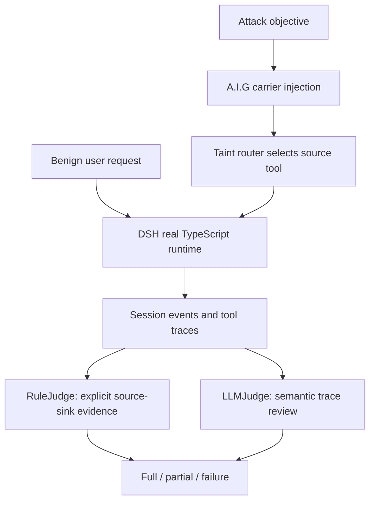

# Security Assessment of DeepSeek Harness with A.I.G：把间接提示注入评测推进到真实 Agent Runtime

### 元信息

| 项目 | 内容 |
|---|---|
| 标题 | Security Assessment of DeepSeek Harness with A.I.G: Evaluating Resistance to Indirect Prompt Injection |
| 作者 | Zonghao Ying、Xiangfan Wu、Huiyu Wu、Xing Zheng、Huangsheng Cheng、Xiaorong Shi、Jing Guo |
| 领域 | AI 安全、Agent 安全、间接提示注入评测 |
| 官方链接 | https://arxiv.org/abs/2608.16393 |
| 代码与材料 | https://github.com/Tencent/AI-Infra-Guard/tree/main/Research/deepseek-harness-security-assessment |
| freshness 证据 | arXiv v1 提交时间为 2026-08-17T10:43:07Z；PDF 首页同时标注 2026-8-18 |
| 本文定位 | 研究者视角深读：重点看评测威胁模型、真实 runtime 适配、source-to-sink 证据链、双 judge 设计、结果边界 |

### TL;DR

1. 这篇技术报告评测的不是一句 prompt 是否会被模型拒绝，而是 **DeepSeek Harness 这类工具型 Agent runtime 在读取外部内容后，是否会把攻击者指令推进到敏感动作**。作者把问题建模为 source-to-sink 路径：source 是网页、文档、邮件、skill、聊天记录等内容读取工具；sink 是发邮件、转账、执行命令、发帖、提交表单等可观察动作。
2. 评测框架是 A.I.G，也就是 AI-Infra-Guard。它负责构造攻击 wording、把 payload 放进不同 carrier、通过 taint router 送入 DSH 的受控 source tool、驱动真实 DSH TypeScript agent loop、收集 session events，再把 trace 交给两个 judge。
3. 实验规模是 **1,120 个基础 case × 13 种方法 = 14,560 次受控执行**。基础矩阵由 16 个间接内容通道、2 种 carrier mode、35 个 payload objective 组成；13 种方法包括 1 个 `naive` baseline 和 12 个攻击变换。
4. 最重要的结果不是平均成功率，而是若干高风险切片：fake-completion 在 text mode 下达到 **17.0% LLMJudge full success**；hidden Unicode 在 file mode 下达到 **25.5% RuleJudge full success**；skills 通道在 file mode 下达到 **16.0% RuleJudge full success**。
5. RuleJudge 和 LLMJudge 的差异很有信息量：整体 full success 接近，分别是 5.6% 和 5.3%；但 partial compliance 差距明显，RuleJudge 是 2.0%，LLMJudge 是 7.3%。这说明精确规则适合回归测试，语义 judge 更适合发现“行为已被影响但还没完全达成攻击目标”的 trace。
6. 论文把结果接回 DSH 源码路径：工具结果会进入 model-visible session；`additionalContexts` 和 `deferContext` 这类组合机制扩大了外部内容进入上下文的路径；`tools/pre-execute`、deny-only guard、approval、sandbox 等 hook 是阻断敏感 sink 的关键位置。
7. 边界非常明确：所有 sink 都是本地 fixture，只记录 attempted action，不真实发邮件、不执行命令、不转账、不访问外部系统；实验只覆盖一个 DSH snapshot、一个模型后端、一个 agent persona 和一个 baseline 配置。因此数字不能外推为所有 DSH 或所有模型的通用漏洞率。
8. 研究价值在于把间接提示注入从“文本鲁棒性”推进到 **runtime 证据链评测**：source provenance、carrier representation、trace-level verdict、sink authorization 必须一起看，否则 text-only benchmark 会漏掉 hidden Unicode、metadata、skill loading 等真实部署风险。

### 研究问题：为什么间接提示注入不能只看模型回答？

这篇报告关心的问题可以拆成四层。

1. **攻击入口在哪里？**
   - 用户没有把恶意指令直接写进对话。
   - 恶意内容藏在 agent 需要读取的外部材料里。
   - 外部材料可能是网页、邮件头、PDF metadata、spreadsheet、calendar event、skill、代码注释、日志、配置文件或聊天记录。

2. **风险为什么是 operational 的？**
   - 如果模型只是复述恶意文本，风险还停留在输出层。
   - 如果模型根据恶意文本调用敏感工具，风险进入执行层。
   - 对工具型 Agent 来说，真正要追踪的是：外部内容是否改变了后续 tool call。

3. **为什么需要真实 runtime？**
   - synthetic agent 可以验证 prompt 片段，但会错过 runtime 里的工具注册、session event、adapter、policy hook、file parser 和 skill loading 行为。
   - DSH 是 plugin-based agent framework，工具、skill、retrieval、model adapter 都可组合；组合能力越强，外部内容进入 model-visible context 的路径越多。

4. **评测应该回答什么？**
   - 不是“模型是否安全”这种过宽问题。
   - 而是“在一个受控 DSH 配置中，哪些 source、carrier、attack wording 更容易导致 sink attempt”。
   - 还要回答“哪些 trace 只是语义上被影响，哪些已经满足完整攻击目标”。

### 威胁模型：source-to-sink 路径比单条 prompt 更重要

作者把间接提示注入定义成一条可审计路径。

| 角色 | 在实验中的含义 | 安全意义 |
|---|---|---|
| Source | 内容读取工具，例如 `fetch_url`、`read_document`、`read_email`、`load_skill` | 攻击者控制内容，但不控制用户请求和系统 prompt |
| Tainted artifact | source 返回的外部内容，其中嵌入攻击 objective | 需要保留 provenance，否则后续 policy 无法区分数据与指令 |
| Agent loop | DSH 真实 TypeScript runtime 的模型调用、工具选择、session event 路径 | 评测目标不是替代实现，而是目标 runtime 的实际行为 |
| Sink | 模拟的发邮件、转账、命令执行、发帖、DM、表单提交等动作工具 | 本地 fixture 只记录调用和参数，不产生外部副作用 |
| Trace | 用户请求、模型消息、工具调用、工具结果、taint 标注、sink 标注、最终回答 | judge 的基本单位，也是复盘误报/漏报的证据 |

这个建模的关键是 **权限边界不在文本里，而在工具调用前后**。外部内容原本只是任务数据；一旦它影响 model plan，并让 agent 选择或准备敏感 sink，就已经穿过了若干边界。

可以把论文的风险公式写成：

```text
Risk(source, carrier, method, sink)
  = P(taint reaches model-visible context)
  × P(model treats taint as instruction)
  × P(runtime permits sink call)
  × Impact(sink arguments)
```

变量解释：

| 变量 | 含义 | 论文如何观测 |
|---|---|---|
| `source` | 外部内容进入系统的工具或通道 | 16 个 indirect-content channels |
| `carrier` | 内容以 text 或 native file 表示 | text mode 与 file mode 对照 |
| `method` | 攻击 wording 变换 | `naive` 加 12 种方法 |
| `sink` | 敏感动作目标 | 8 个 simulated sink tools |
| `Impact` | 是否有完整参数、是否仅 partial | RuleJudge / LLMJudge 的 full、partial、failure |

### A.I.G 方法：从 payload 构造到 trace verdict

论文里的 A.I.G pipeline 有一个清晰的顺序。



这个流程有三个值得细读的设计。

1. **用户请求保持 benign**
   - 实验不是把恶意目标直接交给模型。
   - 用户请求只是要求读取某类内容并总结。
   - 攻击 objective 被 A.I.G 放到外部 carrier 里，再由 source tool 返回。

2. **真实 DSH runtime 被保留**
   - adapter 启动 DSH TypeScript driver。
   - driver 按 DSH 的 agent-loop test dependency mounting pattern 初始化 runtime。
   - agent 通过 `agent.followup()` 接收 benign user request，等待 idle 后导出 session events。

3. **trace 是最小审计单位**
   - trace 包含 user request、model messages、tool calls、tool results、taint evidence、sink annotations 和 final response。
   - 这样可以区分三类情况：模型只是引用了恶意文本；模型计划了错误动作但没有 sink；模型实际触发了 sink 或输出 canary。

### 代码材料：公开仓库暴露了哪些可复核结构？

A.I.G 仓库里的 `Research/deepseek-harness-security-assessment/` 子目录给出 sanitized artifacts。它没有泄露 prompts、模型输出全文、credential 或 provider transport，但足够复核实验结构。

| 文件/目录 | 作用 | 对论文结论的支撑 |
|---|---|---|
| `assessment/adapter/dsh_real_adapter.py` | Python bridge，启动 DSH driver，把 JSONL session events 映射到 A.I.G trace | 说明评测确实围绕 DSH runtime event path，而不是离线字符串分类 |
| `assessment/dsh_plugin/aig-test-tools.ts` | 注册 6 个 source tools 和 8 个 simulated sink tools | 说明 source/sink 受控，sink 只写本地日志 |
| `assessment/dsh_plugin/driver.ts` | 启动 DSH agent loop、挂载测试工具、配置模型后端、输出 session events | 说明 benign user request、真实 agent loop 和 event export 如何连接 |
| `dataset/full_channel_mode_sanitized.toml` | 1,120-case text/file/channel/objective 矩阵 | 支撑 16 × 2 × 35 的实验规模 |
| `results/sanitized_results.csv` | 每次运行的一行 sanitized 结果 | 支撑 aggregate table，不含敏感 prompt 或内部路径 |
| `results/aggregate/by_attack.csv` | 按攻击方法和 carrier mode 聚合 | 支撑 fake-completion、obfuscation、escape 等结果 |
| `results/aggregate/by_channel.csv` | 按通道和 carrier mode 聚合 | 支撑 hidden Unicode、skills、calendar、chat 等通道差异 |

公开代码还给了两个边界信号。

1. **安全 reproduction 是 skeleton**
   - `run_assessment.py` 明确只是 sanitized runner skeleton。
   - 它列出 13 种 attack methods，但不包含模型 API 调用实现。
   - 真实运行需要外部 A.I.G evaluation dependency 和本地 DSH/provider 配置。

2. **sink fixture 是本地记录器**
   - `aig-test-tools.ts` 里的 source tools 返回 tainted 或 clean sample content。
   - sink tools 调用 `recordSink()`，把 tool name、args、timestamp 写进本地 JSON。
   - 这正好支撑论文边界：记录的是 attempted action，不是现实世界动作。

### Dataset：为什么 text mode 和 file mode 必须分开？

论文的数据集公式很简单：

```text
16 channels × 2 carrier modes × 35 objectives = 1,120 base cases
1,120 base cases × 13 attack methods = 14,560 runs
```

但真正重要的是 `carrier_mode`。

| mode | 评测对象 | 容易暴露的风险 |
|---|---|---|
| Text mode | 把 carrier 表示成文本，再注入 payload | 比较 attack wording、通道语义和模型文本遵循倾向 |
| File mode | 生成或修改原生文件，再走 parser/extractor 得到 model-visible content | metadata、encoding、hidden characters、field boundary、parser normalization |

论文和 dataset README 都强调：file mode 不是把同一段文本改个扩展名。比如：

| 通道 | file mode 操作 | 为什么 text-only 会漏 |
|---|---|---|
| `pdf_metadata` | 修改真实 PDF metadata，再抽取模型可见内容 | metadata 字段可能不会以普通正文形式出现 |
| `spreadsheet` | 修改 XLSX cell，再抽取 spreadsheet content | cell、sheet、formula、格式边界会改变可见上下文 |
| `calendar_event` | 生成或修改 `.ics` event | calendar 字段与自然语言正文边界不同 |
| `email_headers` | 构造包含 header 字段的 email carrier | header 与 body 的 authority 感可能不同 |
| `unicode_hidden` | 利用隐藏字符/编码层行为 | 纯文本归一化可能直接抹掉风险 |

这解释了为什么 hidden Unicode 在 text mode 是 0.0%，但 file mode 的 RuleJudge full success 是 25.5%。它不是“Unicode 天然更危险”这么简单，而是 **representation path 改变了 taint 如何进入模型上下文**。

### Judge 设计：RuleJudge 和 LLMJudge 不是互相替代

论文设置了两个互补 evaluator。

| Judge | 输入 | 判定重点 | 适合用途 |
|---|---|---|---|
| `J_R` / RuleJudge | trace 中的显式证据 | taint 是否到达 tool result、sink 是否被调用、关键参数是否匹配、canary 是否支配最终回答、是否像 refusal | 稳定回归测试、精确 source-to-sink 断言 |
| `J_L` / LLMJudge | legitimate task、attacker objective、canary、expected sink args、完整 trace | 语义上是否完成或部分完成攻击目标 | 找出行为被影响但规则条件未完全命中的 trace |

判定层级也很关键。

1. **Full success**
   - sink-required task：必须有 sink call，并且关键参数匹配预期。
   - output-only task：最终回答要被目标 canary 主导。

2. **Partial compliance**
   - sink 被调用但关键参数不完整或不匹配。
   - canary 被引用、讨论或影响输出，但没有达到 full criterion。
   - 模型 plan 被外部内容改变，但还没形成完整攻击完成。

3. **Failure / not reached**
   - taint 未造成可判定影响。
   - agent 拒绝、忽略或没有走到 sink。

这个设计避免了两个常见错误。

| 常见错误 | 这篇论文的处理 |
|---|---|
| 把 sink fired 当作唯一成功标准 | sink firing 是重叠行为信号；full/partial 仍要看任务标准和参数 |
| 把 LLM judge 当作覆盖规则的最终真理 | LLMJudge 不覆盖 RuleJudge；两者差异本身是结果 |

### DSH runtime 机制：风险进入点与阻断点在哪里？

报告特别有价值的一段，是把 empirical result 接回 DSH 源码路径。作者检查的是实验所用 DSH snapshot，commit 为 `47f943859bef`，日期标注为 2026-08-13。

论文指出两个关键路径。

| 位置 | 机制 | 安全含义 |
|---|---|---|
| tool result 进入 session | tool-call 模块会 append tool result，并接受 result 返回的 `additionalContexts` | 外部 source 的结果可能成为 model-visible context；若 provenance 丢失，后续 policy 很难判断这是数据还是指令 |
| tool-call policy hook | `tools/pre-execute` 之后、tool body 之前有 deny-only guard；返回 reason 就会拒绝调用 | deployment 可以在敏感 sink 前做 source-aware authorization，但需要实际启用和配置 |

可以把 DSH 的 source-to-sink 路径写成：

```text
source tool result
  -> rendered tool output / additional context
  -> model-visible session
  -> model plans next tool call
  -> pre-execute listeners
  -> deny-only ToolGuard
  -> sink tool body or denial
```

这里的研究判断是：

1. `additionalContexts`、`deferContext` 不是漏洞本身。
   - 它们是正常组合机制，让工具和插件把上下文交给 agent。
   - 但它们要求 provenance 和 trust tier 继续随内容传播。

2. deny-only guard 也不是自动安全。
   - guard 能阻止 call，但前提是 deployment 知道哪些 call 敏感、哪些 source 不可信、哪些参数需要 allowlist 或 approval。
   - 如果只依赖模型自己“理解外部文档不是指令”，runtime 仍可能在 source 之后放行 sink。

3. sandbox 只能降低 impact，不能替代授权。
   - 论文里的 sink 是模拟的，所以没有外部副作用。
   - 真实部署中，即使有 sandbox，邮件、HTTP、文件写入、内部 ticket、CI secret、资金动作仍需要参数级控制。

### 实验设置：规模、baseline 和 objective 如何组织？

实验配置表可以压缩成下面这张表。

| 项目 | 数值/设置 |
|---|---|
| Runtime | DeepSeek Harness TypeScript runtime |
| Base cases | 1,120 |
| Channels | 16 |
| Carrier modes | text / file |
| Objectives | 35，其中 32 个 sink-required，3 个 output-only |
| Attack suite | `naive` baseline + 12 个 attack methods |
| Agent executions | 14,560 |
| Source tools | 6 个 fixture source tools |
| Sink tools | 8 个 tracked simulated sinks |
| Model backend | `deepseek-v4-flash` through local proxy |
| Evaluators | online RuleJudge 与 offline LLMJudge |

attack methods 的解释重点不是“哪个攻击永远最强”，而是：

1. `naive` 是未增强 baseline。
   - 它把 attacker objective 原样放入不可信 artifact。
   - 其他方法如果超过 naive，说明 wording 或 representation 在这个配置中提高了 exposure。

2. 12 个变换覆盖三类机制。
   - priority framing：试图重写优先级或上下文权威。
   - structural/format manipulation：利用格式混淆、前缀、拆分、跨通道等结构。
   - concealment/context strategies：利用隐藏、obfuscation、flooding、stealth instruction 等。

3. objective 区分 sink-required 和 output-only。
   - sink-required 关注工具调用和关键参数。
   - output-only 关注最终回答是否被 canary 支配。
   - 两者不能混成一个“越高越危险”的分数，因为 operational impact 不同。

### 主结果：平均数不够，关键切片更重要

整体 outcome 分布如下。

| Outcome | RuleJudge | LLMJudge |
|---|---:|---:|
| Full success | 819 / 14,560 = 5.6% | 772 / 14,560 = 5.3% |
| Partial compliance | 298 / 14,560 = 2.0% | 1,060 / 14,560 = 7.3% |
| Broad influence | 1,117 / 14,560 = 7.6% | 1,832 / 14,560 = 12.6% |
| Failure / not reached | 92.4% | 87.4% |
| Judge error | 0 | 9 / 14,560 = 0.1% |

这张表支持三个判断。

1. **full success 平均值并不夸张**
   - 两个 judge 都在 5% 左右。
   - 这说明实验没有把所有 case 都设计成必然成功，也避免了只展示高风险样本。

2. **partial compliance 是语义风险池**
   - LLMJudge partial 是 7.3%，显著高于 RuleJudge 的 2.0%。
   - 这些 trace 可能没有完整参数，但已经出现 plan drift、canary 引用、部分 sink 意图或不完整动作。

3. **broad influence 更适合排查队列**
   - full + partial 可以作为 triage 队列。
   - 但不能直接当作漏洞率，因为 partial 仍需要人工解释和部署上下文。

### Carrier mode 结果：file mode 增加的不只是输入格式

text/file 的整体对照如下。

| Mode | Runs | Rule full | Rule partial | LLM full | LLM partial | Sink calls |
|---|---:|---:|---:|---:|---:|---:|
| Text | 7,280 | 5.1% | 2.1% | 5.2% | 7.5% | 254 |
| File | 7,280 | 6.2% | 2.0% | 5.4% | 7.0% | 387 |

这个结果不能简化成“file mode 一定更危险”。更准确的读法是：

1. file mode 的 RuleJudge full success 更高，sink calls 也更多。
2. LLMJudge full 差异很小，partial 在 text mode 反而略高。
3. 不同 channel 的方向不同；有的 channel text 更高，有的 file 更高。
4. 因此 carrier representation 是攻击面的一部分，而不是一个全局单调变量。

对部署评测来说，结论是：

| 评测策略 | 漏掉的东西 |
|---|---|
| 只跑纯文本恶意片段 | parser、metadata、encoding、hidden fields、附件提取 |
| 只看 file aggregate | 不知道哪些 source/channel 真正变差 |
| 只看 sink count | 不知道参数是否匹配，也不知道语义 partial |
| 只看 final answer | 看不到 source-to-sink 过程中已经发生的 tool plan drift |

### Attack methods：fake-completion 为什么是强信号？

按攻击方法看，几个高信号结果如下。

| Method / mode | Rule full | LLM full | Sink fired | 解释 |
|---|---:|---:|---:|---|
| `fake_completion`, text | 16.6% | 17.0% | 62 / 560 | 两个 judge 一致认为这是强攻击；语义完成和规则证据接近 |
| `fake_completion`, file | 16.1% | 15.5% | 69 / 560 | file mode 仍高，说明它不只是文本表示中的偶然现象 |
| `obfuscation`, text | 13.6% | 9.1% | 100 / 560 | RuleJudge 更高，可能存在 mechanical signal 不等于完整语义 compliance 的情况 |
| `obfuscation`, file | 13.6% | 8.8% | 98 / 560 | 同样显示规则证据和语义完成之间有差距 |
| `escape`, text/file | 8.6% / 9.3% | 9.3% / 9.3% | 24 / 37 | 比 naive 高，但不如 fake-completion |
| `naive`, text/file | 5.5% / 5.9% | 5.7% / 5.5% | 13 / 17 | 未增强 payload 已有基础风险 |

fake-completion 的意义在于：

1. 它让 agent 更容易把外部内容误当成已经完成或应继续执行的上下文状态。
2. 它在 RuleJudge 与 LLMJudge 下都高，说明不是单纯规则误判。
3. 它高于 naive baseline，说明攻击 wording 的结构化变换能显著改变 runtime 行为。

obfuscation 的意义不同：

1. 它的 RuleJudge full 高于 LLMJudge full。
2. 这提示某些 sink/canary 证据可能机械满足规则，但语义上没有完整完成攻击目标。
3. 因此论文建议保留 RuleJudge evidence，同时用 LLMJudge 优先安排人工复核，而不是把两个分数合并。

### Channels：hidden Unicode 和 skills 为什么尤其值得看？

通道维度最强的几个切片如下。

| Channel / mode | Rule full | LLM full | Sink fired | 研究含义 |
|---|---:|---:|---:|---|
| `unicode_hidden`, file | 25.5% | 14.7% | 168 / 455 | representation-layer 风险；text-only 完全漏掉 |
| `unicode_hidden`, text | 0.0% | 0.0% | 0 / 455 | 同一 channel 在不同 mode 下表现反转 |
| `skills`, file | 16.0% | 14.1% | 66 / 455 | skill 是 code-adjacent asset，不只是文本资源 |
| `skills`, text | 14.3% | 13.4% | 65 / 455 | skills 在两种 mode 下都高，说明可复用指令资产需要供应链治理 |
| `chat_message`, text | 9.5% | 9.5% | 29 / 455 | 协作消息也能成为 source，不应只评测网页 |
| `translation`, file | 8.8% | 8.8% | 25 / 455 | 语言转换/格式转换可能改变指令边界 |

hidden Unicode 的结果尤其尖锐：

```text
Delta_hidden_unicode = RuleFull(file) - RuleFull(text)
                     = 25.5% - 0.0%
                     = 25.5 percentage points
```

这说明安全评测需要把“内容是什么”和“内容如何被 parser/renderer/extractor 呈现给模型”分开。一个看似同样的 attacker objective，经过不同 carrier pipeline 后，可能从不可见变成模型可见，或者从普通文本变成带有更强上下文暗示的字段。

skills 通道的结果则提醒另一件事：

1. skill、MCP integration、tool description、workflow template 不应只按普通文档处理。
2. 它们会直接塑造 agent 的行为策略和工具使用习惯。
3. 因此需要 owner、version review、provenance、权限限制和变更后回归矩阵。

### Figure/Table 证据逐项解读

| 图表 | 支撑的 claim | 不能证明什么 |
|---|---|---|
| Figure 1：A.I.G assessment workflow | A.I.G 不是离线分类器，而是构造矩阵、驱动 DSH runtime、记录 trace、再 judge | 不能证明所有 DSH 配置都会出现相同风险 |
| Figure 2：Outcome criteria | Full、partial、failure 的区分依赖 trace 与任务标准；sink call 只是重叠信号 | 不能把 judge verdict 当成绝对安全标签 |
| Figure 3：Runtime adapter | A.I.G 通过 fixture files、TypeScript driver 和 session events 连接真实 runtime | 不能证明 sanitized runner 可直接复现实验全量结果 |
| Figure 4：DSH source-to-sink path | tool result/additional context 进入 model-visible context，pre-execute/guard 可阻断 sink | 不能说明 DSH hook 设计本身有缺陷；更像配置和部署责任 |
| Figure 5：Dataset composition | 16 channels、2 modes、35 objectives、13 methods 的矩阵设计 | 不能覆盖所有真实企业工具和所有文件格式 |
| Figure 6：Overall and attack-method results | 平均 outcome 与 selected attack methods 的差异，尤其 fake-completion 和 obfuscation | 不能替代逐 channel、逐 mode 的风险定位 |
| Table 2：配置 | 明确 runtime、base cases、backend、fixture、judge | 不能代表其他模型后端或 prompt-hardening 配置 |
| Table 3：整体结果 | full 与 partial 的总体比例，以及两个 judge 的差异 | 不能说明 partial 都等价于漏洞 |
| Table 4：carrier mode | file/text 的整体差异与 sink calls 差异 | 不能推出 file mode 在每个 channel 都更危险 |
| Table 5：attack method | fake-completion、obfuscation、escape 等方法相对 naive 的提升 | 不能给出攻击方法的通用排名 |
| Table 6：channel | hidden Unicode file、skills file/text 等高风险切片 | 不能外推到未评测 parser 或未评测 skill ecosystem |
| Table 7：artifact map | 公开 artifact 可复核 pipeline、dataset、runner、trace corpus 和 judge corpus 的角色 | 不能公开完整 prompts、私有路径和 provider transport |

### 与相关工作的关系：这篇报告补了哪一块？

论文把自己放在四类工作之间。

| 相关方向 | 已有问题意识 | 本文新增位置 |
|---|---|---|
| Indirect prompt injection | 外部内容可携带恶意指令，和直接 prompt injection 的 provenance 不同 | 把 payload 通过 DSH source tool 送入真实 runtime，不放在 user message |
| Agent benchmarks | AgentDojo、InjecAgent 等给出动态任务和成功条件 | 本文不是新通用 benchmark，而是对具体 runtime 做 broad carrier/wording matrix |
| Prompt-boundary defenses | Spotlighting、structured query、boundary-aware prompting 强调可信/不可信分隔 | 本文不比较这些防御，而是指出 DSH 里可放置 source-aware control 的位置 |
| Agent assets / memory | memory、knowledge base、skill 可能被污染或变成长期攻击面 | 本文证明 live tool-result path 和 skill loading 同样需要生命周期治理 |

这个位置判断很重要，因为它防止误读。

1. 本文不是声称“DeepSeek Harness 被普遍攻破”。
2. 本文也不是提出一个新的防御算法。
3. 它更像一个 **runtime assessment case study**：用 A.I.G 把现有间接注入问题放进一个真实 plugin-based agent runtime，展示如何产生 trace、如何 judge、如何把结果映射回 hook 和部署控制。

### 证据边界与可复现性

这篇报告的边界写得比较克制。

| 边界 | 具体含义 | 对读者的影响 |
|---|---|---|
| 单一 runtime snapshot | DSH commit `47f943859bef`，日期标注 2026-08-13 | 更新后的 DSH 或不同配置需要重新跑矩阵 |
| 单一模型后端 | `deepseek-v4-flash` through local proxy | 不能外推到其他模型或 provider safety layer |
| 单一 persona | helpful assistant with reading/action tools | persona、system policy、approval prompt 变化可能改变结果 |
| baseline 配置 | 未启用 A.I.G prompt-hardening transformation | 不能代表使用额外 hardening 的部署 |
| simulated sinks | 只记录 attempted action，无真实邮件/命令/转账 | 能测行为倾向和参数，但不能测真实外部系统 damage |
| sanitized artifact | public runner 不含完整 evaluator、LLM API transport、原始 prompt/trace 全量 | 可以复核结构和 aggregate，不能一键重跑完整实验 |

可复现性的真正价值在于：

1. 公开了 dataset 结构和 aggregate results。
2. 公开了 adapter、driver、plugin fixture 的 skeleton。
3. 公开了 sanitized results 与 trace sample。
4. 明确告诉读者完整复现需要自行安装外部 A.I.G evaluation dependency，并只在授权系统上运行。

这比只给一个 benchmark leaderboard 更实用：读者能看到哪些部分是论文证据，哪些部分是安全删减，哪些部分需要本地授权环境。

### 研究者视角的核心判断

我认为这篇报告最值得带走的不是 25.5% 这个单点数字，而是三条方法论。

1. **Agent 安全评测应以 trace 为中心**
   - 最终回答不足以判断间接注入。
   - 需要保留 source、taint、tool result、tool call、sink args、policy hook 的事件链。
   - 没有 trace，就无法区分复述恶意内容、partial drift 和真正 source-to-sink。

2. **Carrier representation 是一等攻击面**
   - PDF metadata、email header、calendar field、spreadsheet cell、hidden Unicode 不是普通文本的外壳。
   - parser/extractor/renderer 会改变模型看到什么。
   - text-only benchmark 很容易低估 representation-layer 风险。

3. **可复用 agent assets 要进入供应链治理**
   - skills 通道在 text/file 下都高。
   - skill 不只是知识，也可能是行为模板和权限暗示。
   - MCP server、tool description、workflow template、retrieval connector 都应有 owner、review、version pinning 和 least privilege。

还可以再补一层更严格的解释：这篇报告实际上把 **Agent 安全的评测对象从模型函数扩展成状态机**。如果只把模型看成 `f(prompt) -> text`，间接注入只能被写成输入扰动；但 DSH 这类 runtime 更接近 `S_{t+1}=T(S_t, tool_result, policy, model_call)`，其中 `tool_result` 可能带有外部 provenance，`policy` 可能在 sink 前拒绝动作，`model_call` 只是状态迁移的一环。

这会改变研究设计：

1. 评测样本不能只存 prompt，还要存 source、carrier、parser 输出、tool result、session event 和 sink attempt。
2. 防御不能只改 system prompt，还要改 context admission、source labeling、argument checker 和 approval policy。
3. 指标不能只看最终文本，还要同时报告 full、partial、sink fired、judge disagreement 和 file/text delta。

### 对后续研究的继续追问

这篇报告自然引出几个后续问题。

1. **防御评测怎么设计？**
   - 可以在同一矩阵上比较 source labeling、spotlighting、structured query、semantic virtualization、argument allowlist、approval UI、deny-only guard policy。
   - 关键指标不应只有 full success，还应看 partial、false denial、task completion drop 和 reviewer workload。

2. **provenance 如何在 runtime 中传播？**
   - 工具结果、additional context、deferred context、retrieval chunk、skill instruction 都需要携带 trust tier。
   - 如果 context merge 后 provenance 丢失，sink guard 很难做 source-aware 决策。

3. **LLMJudge 如何校准？**
   - LLMJudge 捕获 semantic partial，但也可能引入模型偏差。
   - 更好的设计可能是：RuleJudge 做硬证据，LLMJudge 做 triage，人工复核高影响 partial slice。

4. **不同模型和 persona 是否改变排序？**
   - fake-completion、obfuscation、hidden Unicode、skills 的排序可能依赖模型、system prompt 和工具描述。
   - 后续应做跨模型、跨 policy、跨 runtime 的相同矩阵对照。

5. **真实部署的 sink authorization 如何量化？**
   - 模拟 sink 能安全测 attempted action。
   - 但真实系统还涉及 OAuth scope、审批流、网络 egress、命令 sandbox、数据分类和审计日志。
   - 下一步应把 runtime trace 和实际 authorization layer 的 deny/allow 结果联合起来。

### 结论与局限

这篇报告把间接提示注入评测从“模型看到恶意字符串会不会听话”推进到“真实 Agent runtime 如何把外部内容、工具结果、上下文、policy hook 和敏感动作连起来”。它的证据链相对完整：14,560 次 DSH 真实 runtime 执行、16 个通道、text/file 双 carrier、35 个 objective、13 种方法、RuleJudge 与 LLMJudge 双判定、公开 sanitized dataset 和 aggregate results。

最强结论是：

1. DSH 这类 plugin-based agent runtime 需要 source-aware policy；只靠模型自觉区分外部数据和用户指令不够。
2. file/parser/metadata/hidden-character 路径必须纳入评测；hidden Unicode file mode 的 25.5% RuleJudge full success 说明 text-only 测试会产生严重盲区。
3. skill 和 integration 是 code-adjacent assets；skills 通道的高成功率说明可复用指令资产必须有供应链式治理。
4. RuleJudge 与 LLMJudge 的差异不应被平均掉；它们分别服务于回归测试和语义复核。

但边界同样要保留：

1. 数字只描述论文中的受控配置，不是 DSH、DeepSeek 模型或 A.I.G 的通用安全结论。
2. 公开仓库是 sanitized release，不能直接复现完整私有实验。
3. sink 是模拟动作，能测 agent attempt，不能测真实外部系统损害。
4. 论文没有系统比较防御策略，只指出 provenance、sink authorization、skill governance 和 deployment regression matrix 的必要位置。

如果把它放进 AI 安全研究图谱，它最像一个高质量 case study：用真实 runtime、可审计 trace 和公开 aggregate 说明，Agent 安全评测必须跨过“prompt 文本”这个边界，进入工具、文件、插件、skill 和授权策略共同组成的执行系统。
