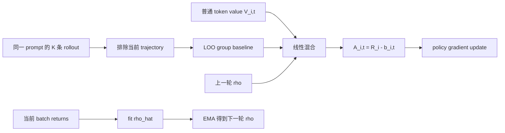
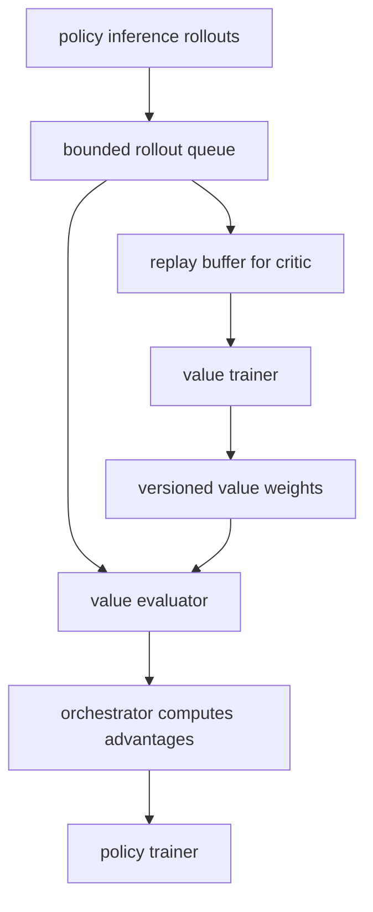

# Le Critique：重新把 Critic 带回 LLM 强化学习

| 项目 | 内容 |
| --- | --- |
| 论文 | Le Critique: Privileged Value Functions for LLM Reinforcement Learning |
| 类型 | 论文，arXiv:2608.16739v1 |
| 作者 | Siddarth Venkatraman, Matthieu Dinot, Laurence Aitchison |
| 机构 | Mistral AI, Mila - Quebec AI Institute, Universite de Montreal |
| 官方日期 | arXiv 页面标记 Submitted on 17 Aug 2026；API 与 submission history 给出的 v1 时间为 2026-08-17T15:49:36Z |
| 原文 | https://arxiv.org/abs/2608.16739 |
| 代码 | https://github.com/HyperPotatoNeo/prime-values |
| 方向 | 大模型后训练，LLM RL，value function，GRPO，PPO |

### TL;DR

- **这篇论文解决什么问题**：当前 LLM 后训练越来越依赖 GRPO / RLOO 这类 critic-free 方法，用同一 prompt 的多条 rollout 做 group-relative baseline；它省掉 critic 工程，但代价是 token-level credit assignment 弱、长响应只能把同一个序列级 advantage 贴到每个 token 上，而且异步采样会被慢 rollout 拖住。
- **作者的主张**：value function 不是过时组件，而是被“critic 难训、工程复杂、GRPO 足够好”暂时遮住了价值；如果让 critic 只在训练时访问可允许的 privileged information，就能更好预测 return、降低 advantage 方差，同时不把这些信息暴露给 policy。
- **核心方法 1：PVF**：Privileged Value Function 写成 `V_phi(h_i,t, z_i,t)`，其中 `h_i,t` 是 policy 真实可见的 token history，`z_i,t` 是训练时 critic 可见但 policy 不可见的信息，例如标准答案、完整 Sudoku 解、其他 `K-1` 条 sibling response 及其 reward。
- **核心方法 2：TETHER**：TETHER 不直接相信 group baseline，也不直接相信 value baseline，而是用一个 EMA 平滑的系数 `rho` 自适应混合二者；`rho=0` 退化为 leave-one-out group baseline，`rho=1` 退化为 token-level value baseline。
- **关键证据**：作者在 Reasoning Gym、CodeIO、Sudoku 和 MiniF2F 等 reasoning 任务上做实验；PVF 在四个 PVF 设置里均优于普通 value function，TETHER 在四个 TETHER 设置里均优于普通 value function，并在 Reasoning Gym、MiniF2F 超过 group-mean baseline，在 CodeIO 接近 group mean，在 Sudoku 缩小普通 value function 的退化。
- **关键数字**：主实验使用 `Qwen3-4B-Instruct-2507`，MiniF2F 使用 `Qwen3.5-4B`；Reasoning Gym 训练 `800` policy steps，CodeIO `650` steps，Sudoku `600` steps，MiniF2F `500` steps；Sudoku 用 `5,000` 个 hard puzzle，最长轨迹到 `32,768` tokens；TETHER 使用 `d=0.95` 的 EMA 系数。
- **局限**：value function 需要额外 accelerator allocation，作者没有严格 compute-match group-mean 与 value-function baseline，只匹配 inference trajectories；实验停留在 `4B` 模型和最长 `32k` token 级任务，还没有证明能直接扩展到更长程 agentic training。

### 研究问题：为什么 critic-free 路线不一定是终点？

论文的开场不是简单说“GRPO 不好”，而是把 LLM RL 的算法差异压缩到一个核心变量：

- 策略梯度本身的形状相似；
- 真正区分算法的是 advantage 如何估计；
- advantage 的估计质量决定了更新信号是细粒度还是粗粒度、低方差还是高方差、同步友好还是异步友好。

作者用一个 token-normalized policy-gradient estimator 作为共同起点：

```text
grad J_hat =
  1 / sum_i T_i *
  sum_i sum_t w_i,t * A_hat_i,t * grad_theta log pi_theta(y_i,t | h_i,t)
```

变量含义：

| 变量 | 含义 | 对 LLM RL 的意义 |
| --- | --- | --- |
| `x_i` | 第 `i` 个 prompt / task | group 方法通常围绕同一 prompt 采多条 response |
| `y_i,t` | 第 `i` 条 response 的第 `t` 个 token | policy 更新最终发生在 token logprob 上 |
| `h_i,t` | `x_i` 加上此前 token `y_i,<t` | policy 当下真实可见的状态 |
| `A_hat_i,t` | 给 token 的 advantage | 决定该 token 概率上调还是下调 |
| `w_i,t` | clipping、importance ratio、mask 等稳定项 | 不同 PPO/GRPO 实现会改变它 |

这里的关键是：

- 如果 `A_hat_i,t` 来自整条 response 的终局 reward，那么同一条 response 的许多 token 会共享近似相同的信号；
- 如果 `A_hat_i,t` 来自 value function，那么不同 token prefix 可以拿到不同的 return prediction residual；
- 如果 critic 预测差，token-level 信号会变成噪声；
- 如果 critic 预测好，它能减少方差、减少对大 group 的依赖，并支持更早利用部分轨迹。

因此，论文真正追问的是：

> 在 GRPO 已经工程上流行的前提下，怎样让 value function 的收益重新超过它的工程成本？

### 背景：Mean、RLOO 和 value baseline 的分工

论文把 group-relative baseline 写得很清楚。对同一 prompt 采样 `K` 条 response，每条 response 有一个 scalar return `R_i`。

GRPO 风格的 mean baseline 是：

```text
R_bar = (1 / K) * sum_j R_j
A_i^GRPO = R_i - R_bar
```

RLOO / leave-one-out baseline 则排除当前 response 自己：

```text
b_i^LOO = (1 / (K - 1)) * sum_{j != i} R_j
A_i^LOO = R_i - b_i^LOO
```

这两个式子的差异不是形式细节，而关系到 bias：

| 方法 | baseline 是否看当前 trajectory 自己的 return | 优点 | 问题 |
| --- | --- | --- | --- |
| GRPO mean | 看到了 `R_i` | 简单、稳定、无需 critic | 严格说 baseline 与当前样本相关 |
| RLOO | 不看 `R_i` | 更干净地满足 baseline 条件 | 仍是 sequence-level signal |
| Value baseline | 不直接用同组均值 | token-level credit assignment | 需要训练 critic，且 critic 错会害训练 |

作者给 baseline 保持无偏 policy gradient 的充分条件：

```text
E[ b(h_i,t, z_i,t) * grad_theta log pi_theta(y_i,t | h_i,t) | h_i,t ] = 0
z_i,t independent of y_i,t given h_i,t
```

这句话的研究含义是：

- `z_i,t` 可以包含与当前 token 条件独立的训练辅助信息；
- `z_i,t` 不可以包含当前 response 未来 token、当前 trajectory 的 realized reward、后续 verifier feedback；
- 因此“把答案给 policy 看”不行，但“把答案给 critic 预测 baseline”在条件满足时可以；
- 这就是 PVF 的可行空间。

### 方法一：Privileged Value Function 到底“特权”在哪里？

PVF 的基本写法是：

```text
V_i,t^PVF = V_phi(h_i,t, z_i,t)
A_i,t = R_i - V_phi(h_i,t, z_i,t)
```

其中：

- `h_i,t` 是 policy 也能看到的上下文；
- `z_i,t` 是只给 critic 的训练时信息；
- policy 采样和部署时不拿 `z_i,t`；
- value model 的输出只作为 baseline / control variate，不改变原始 reward objective。

论文给了三类 privileged information：

| privileged 信息 | 例子 | 为什么可用 | 风险边界 |
| --- | --- | --- | --- |
| Reference solution | Reasoning Gym 的标准答案、Sudoku 完整解 | 它帮助 critic 判断当前 prefix 离成功有多远 | 不能直接喂给 policy，否则变成训练-推理不一致 |
| Leave-one-out group | 其他 `K-1` 条 response 与 reward | 它们独立采样，不依赖当前 token | 不能包含当前 trajectory 自己的 reward |
| Miscellaneous task context | rubric、环境 latent state、oracle 信息 | 只要满足条件独立，就能降低 baseline 噪声 | 需要逐任务审查是否泄漏未来信息 |

这和 on-policy self-distillation 的区别很重要：

| 路线 | privileged 信息进入哪里 | 是否改变 policy objective | 典型风险 |
| --- | --- | --- | --- |
| Self-distillation | 进入 teacher distribution，再训练 student 模仿 | 会引入额外 distribution matching 目标 | teacher 可能利用 student 推理时不可得的信息 |
| PVF | 只进入 value baseline | 在 `lambda_GAE=1` 且条件满足时不改变期望梯度 | critic 工程成本高、信息 admissibility 需要审计 |

作者的判断是：

- self-distillation 更强，因为它能使用 retrospective feedback；
- PVF 更保守，因为它只改 baseline，不直接规定 policy 应该输出什么；
- 对后训练系统而言，PVF 更像“把特权信息变成方差降低器”，而不是“把特权信息变成答案老师”。

### 方法二：TETHER 如何在 group baseline 和 value baseline 之间切换？

TETHER 针对的是一个现实问题：

- 训练初期 value function 通常很差；
- group baseline 虽粗，但稳定；
- value function 后期如果变准，就应该释放 token-level credit assignment；
- 人手调一个固定混合权重会变成任务级超参。

TETHER 的核心公式是：

```text
b_i,t^TETHER = (1 - rho) * b_i^LOO + rho * V_i,t
A_i,t^TETHER = R_i - b_i,t^TETHER
```

其中：

- `rho = 0`：完全使用 LOO group baseline；
- `rho = 1`：完全使用 learned token-level value baseline；
- `0 < rho < 1`：用 group baseline 抑制 critic 误差，同时保留 token-level variation。

作者不是把 `rho` 当固定超参，而是在每个 batch 后拟合它：

```text
rho_hat_k =
  argmin_rho sum_{(i,t) in B_k}
    (R_i - b_i,t^TETHER(rho))^2

rho_k = d * rho_{k-1} + (1 - d) * rho_hat_k
```

重要的工程细节：

- 当前 batch `B_k` 的 advantage 使用上一轮的 `rho_{k-1}`；
- 当前 batch 的 return 只用于拟合下一轮的 `rho_k`；
- 这样避免 baseline 依赖同一 batch 自己的 return，从而破坏无偏条件；
- 主实验中 EMA decay 取 `d=0.95`。

可以把 TETHER 看成一个极简 PVF：



TETHER 的巧妙之处在于：

- 它承认 GRPO/RLOO 的强工程基线地位；
- 它不要求一开始就信任 critic；
- 它把“critic 是否值得用”变成可在线估计的 return-prediction 问题；
- 它给已有 GRPO pipeline 一个低风险接入 critic 的接口。

### 实验设置：作者到底测了什么？

PVF 实验覆盖三个环境、四个设置：

| 环境 | 任务形态 | group size | privileged 信息 | 模型与训练 |
| --- | --- | --- | --- | --- |
| Reasoning Gym | procedural single-turn reasoning mixture | `K=1` 和 `K=8` | ground-truth answer | `Qwen3-4B-Instruct-2507`，`800` policy steps，batch `128` |
| CodeIO | 输入输出互推的程序推理 | `K=4` | 其他 `K-1=3` 条 response 与 reward | `Qwen3-4B-Instruct-2507`，`650` policy steps，batch `128` |
| Sudoku | 多轮填格，每轮填一个缺失 cell | `K=4` | 完整 solved grid | `Qwen3-4B-Instruct-2507`，`600` policy steps，batch `64`，`5,000` hard puzzles |

TETHER 实验复用这些任务，并增加 MiniF2F：

| 环境 | 任务形态 | 模型 | 训练设置 |
| --- | --- | --- | --- |
| Reasoning Gym | single-turn reasoning | `Qwen3-4B-Instruct-2507` | group size `K=8`，`800` steps |
| CodeIO | program reasoning | `Qwen3-4B-Instruct-2507` | group size `K=4`，`650` steps |
| Sudoku | multi-turn puzzle | `Qwen3-4B-Instruct-2507` | group size `K=4`，`600` steps，最长 `32,768` tokens |
| MiniF2F | Lean formal math，多轮 compiler feedback | `Qwen3.5-4B` | `500` steps，batch `128`，最多 `3` 次 proof attempt，每次 `4,096` generated tokens |

作者还给了一个重要的 compute 注释：

- value-function baseline 和 PVF/TETHER 使用相同 value-training 配置；
- value runs 额外需要 value trainer 与 dedicated value evaluator；
- 附录中所有 node 都是 `8 x H200 GPUs`；
- 因而结果不能解读成“同等总算力下 value function 一定赢”，只能解读成“在匹配 inference trajectory 的设定下，额外 critic 组件能带来更好的学习信号”。

### 主结果：PVF 为什么能赢普通 value function？

Figure 3 和 Figure 7 给出 PVF 的训练曲线与最终窗口 reward。论文没有把核心结论押在一个单点数字上，而是强调跨任务模式：

- PVF 在所有四个 PVF 设置里都是最好方法；
- Reasoning Gym 中，`K=1` 时普通 VF 和 PVF 前期都提升，但 VF 更早 plateau；
- Reasoning Gym 的 `K=8` 中，PVF 的额外收益变小，因为 group 信息已经减少了一部分 prompt-level 方差；
- CodeIO 中，PVF 没拿标准答案，只拿 sibling responses 和 returns，仍能超过普通 VF 和 Mean；
- Sudoku 中收益最大，因为普通 value function 必须从局部 grid prefix 推断全局可解性，而 PVF 直接看到完整 solved grid，critic 预测问题被大幅简化。

这组结果支持一个机制判断：

| claim | mechanism | evidence | boundary |
| --- | --- | --- | --- |
| PVF 能改进 value baseline | critic 条件化在合法 privileged 信息上，更好预测 return | Figure 3/7：四个 PVF 设置均优于 VF | 没证明 privileged 信息随处可得 |
| PVF 的收益与任务结构有关 | long-horizon / latent-state 任务中，critic 难度更高 | Sudoku 中提升最大 | Sudoku 不是通用 agent benchmark |
| sibling rollout 本身可作为信息 | 其他 `K-1` 条 response 与 reward 形成 in-context aggregation signal | CodeIO 的 PVF 超过 Mean 和普通 VF | 需要保证不包含当前 trajectory 自己的 future/reward |

### Explained variance：论文如何证明“critic 真的更懂 return”？

作者没有只看 policy reward，还测了 explained variance：

```text
EV_hat = 1 - Var_B(R_i - V_hat_i,t) / Var_B(R_i)
```

解释：

- `EV = 1` 表示 value prediction 完美解释 return；
- `EV = 0` 表示 critic 不比常数 baseline 更好；
- 在 `lambda_GAE=1` 时，`R_i - V_hat_i,t` 就是 policy advantage；
- 因而 EV 越高，advantage 方差降低越明显。

Figure 4 的含义是：

- PVF 在每个环境中都比普通 VF 解释更多 return variance；
- EV gap 与最终 reward gap 方向一致；
- Reasoning Gym `K=8` 的 EV gap 较小，对应 reward 差距也较小；
- Sudoku 的 EV gap 最大，对应 PVF 的收益也最明显。

这让论文的论证更完整：

1. 不是只看到训练 reward 偶然上涨；
2. 而是先观察到 critic 的 return prediction 更好；
3. 再看到更好的 prediction 对应更低 advantage 方差；
4. 最后体现为 policy reward 改进。

### TETHER 结果：为什么它是“低风险接 critic”的路线？

Figure 5、Figure 6 和 Figure 7 支持 TETHER 的三点结论：

- TETHER 在 Reasoning Gym、CodeIO、Sudoku、MiniF2F 四个设置中都超过普通 VF；
- TETHER 在 Reasoning Gym 和 MiniF2F 超过 Mean，在 CodeIO 约等于 Mean，在 Sudoku 虽未完全追回 Mean，但显著缓解了 VF 的退化；
- `rho` 从 `0` 起步，然后根据任务逐步离开 group baseline，说明它没有塌缩成固定 endpoint。

这和作者的动机严格对齐：

| 训练阶段 | 普通 VF 的风险 | TETHER 的处理 |
| --- | --- | --- |
| 早期 | critic 刚随机 value head 起步，预测不准 | `rho=0` 先靠 LOO baseline |
| 中期 | critic 开始解释 return，但误差仍波动 | EMA 平滑 `rho`，缓慢引入 value |
| 后期 | token-level value 可能比 group baseline 更有信息 | `rho` 向 value 侧移动 |
| 任务不适合 value | critic 仍弱 | `rho` 可保持较低，避免强行依赖 VF |

Appendix C 给了 TETHER 的统计直觉。对固定的 group baseline `B` 和 value baseline `V`，定义：

```text
b_rho = (1 - rho) * B + rho * V
A_rho = R - b_rho
L(rho) = E[(R - b_rho)^2] = E[A_rho^2]
```

由于 `rho` 的搜索区间 `[0,1]` 同时包含 `0` 和 `1`：

```text
E[A_{rho*}^2] <= min{ E[(R - B)^2], E[(R - V)^2] }
```

这不是说有限 batch 中 TETHER 永远赢，而是说：

- 如果能稳定估计 population-level 最优混合；
- 且两个 baseline 的误差有互补性；
- 那么软混合不会比两个 endpoint 中更好的那个更差；
- interior optimum 存在时，还会严格好于两端。

作者也主动写出边界：

- TETHER 没有考虑 score norm `||grad log pi||^2`，所以它不是理论最优 policy-gradient baseline；
- EVPO 这类方法做 hard endpoint choice，TETHER 做 continuous mixture；
- batch 太小、critic 变化太快、最优点接近端点时，TETHER 的平滑系数可能不如更简单的选择。

### 机制细读：为什么“只给 critic 看答案”不是作弊？

这篇论文最容易被误读的地方，是把 PVF 看成“训练时偷偷看答案”。更准确的理解是：

- policy 的采样分布仍然只由 `pi_theta(y_t | h_t)` 决定；
- privileged 信息不进入 action distribution；
- critic 的预测只作为 baseline，从 return 中扣掉可预测部分；
- 被 policy 梯度真正放大的，仍然是 reward 中超出 baseline 的 residual。

用一个更直观的分解看：

```text
R_i = predictable_part(h_i,t, z_i,t) + residual_i,t
A_i,t = R_i - V_phi(h_i,t, z_i,t)
```

如果 `V_phi` 很好，那么：

- prompt 难度、题目答案结构、其他 rollout 暗示出的任务难度，会被 baseline 吸收；
- policy 不必从这些全局差异里学习错误的 token 偏好；
- 剩下的 residual 更接近“当前 token 或当前推理路径相对好坏”；
- 这就是 control variate 的价值。

但它不等于无限制 oracle：

| 信息类型 | 能否给 PVF | 原因 |
| --- | --- | --- |
| 当前题目的静态标准答案 | 通常可以 | 它不由当前 token 生成 |
| 其他独立 rollout 的 reward | 可以，但要 leave-one-out | 它不包含当前 response 自己的结果 |
| 当前 response 的最终 verifier feedback | 当前 token baseline 中不能直接用 | 它依赖后续 token 和最终动作 |
| teacher 根据答案生成的理想推理 token | 不属于 PVF baseline | 这会变成 distillation objective |

这个边界对安全和 agent 训练尤其关键。很多系统有丰富的训练后审计信号，例如隐藏测试、运行日志、人工 rubric、sandbox trace、工具调用违规标签。PVF 提醒我们：

- 这些信号并非只能丢弃；
- 也不应无条件蒸馏进 policy；
- 更合适的中间层可能是 value model；
- 但每一种信号都要问清楚：它是否依赖当前 trajectory 的未来结果？

### 训练基础设施：为什么 value function 成本不只是多一个 head？

传统 RLHF 里说 value function，很多人会想到“复制一个模型，加 scalar value head”。Le Critique 的附录和代码仓库说明，LLM RL 的 critic 成本更复杂：

- policy inference 在持续产生 rollout；
- value evaluator 要对 rollout 中的 causal states 做预测；
- orchestrator 要把 value prediction 转换成 per-token GAE 或 MC advantage；
- value trainer 要用 replay buffer 独立更新 critic；
- policy trainer 不能被 critic 训练速度完全阻塞。

因此，value function 的工程问题不是一行公式，而是一个异步系统问题：



这也解释了为什么 critic-free 方法会流行：

- 省掉 value evaluator；
- 省掉 critic replay；
- 省掉 value-policy version mismatch；
- 只要 group reward 可以稳定估计，就能快速形成可用后训练 pipeline。

Le Critique 的价值在于承认这些现实成本，然后提出两个降低风险的入口：

| 成本问题 | PVF/TETHER 的回应 |
| --- | --- |
| critic 预测不准 | PVF 给 critic 更多合法信息 |
| 训练早期 critic 不稳 | TETHER 从 group baseline 起步 |
| 异步系统 off-policy | value infra 用 bounded replay 和 versioned weights 控制复用 |
| 额外 GPU 不划算 | 论文把它列为局限，建议研究 value scaling laws |

### 为什么 Sudoku 是一个有用但有限的压力测试？

Sudoku 在论文中不是玩具任务，而是用来暴露普通 value function 的困难。

一个多轮 Sudoku policy 每次只填一个格子。对 policy 来说：

- 当前 observation 是局部盘面；
- action 是填写一个 cell；
- reward 往往在整局结束时才明确；
- 早期一步是否正确，要看它是否与某个完整解一致。

普通 value function 要从当前 partial grid 估计最终成功概率，本质上要隐式完成一部分解题搜索。PVF 拿到 complete solved grid 后，critic 的问题变成：

- 当前 partial grid 是否仍与标准解兼容；
- 已填内容离完成还有多远；
- 哪些错误会导致不可恢复失败。

这解释了为什么作者说 Sudoku 中 privileged conditioning 的收益最大。它支持的是一个机制命题：

> 当任务的中间状态价值依赖隐藏全局结构时，给 critic 合法访问该结构可以显著降低 value prediction 难度。

但这个证据也有限：

- Sudoku 的 hidden structure 是干净、静态、可验证的；
- 真实 agent 任务的 hidden structure 常常是动态 workspace、用户意图、权限边界和工具副作用；
- 这些信息哪些能给 critic、哪些会泄漏 future feedback，需要比 Sudoku 更严格的数据契约。

因此，Sudoku 是对 PVF 机制的好压力测试，不是对真实 agent 后训练的完整证明。

### 与安全对齐的关系：PVF 可能降低 reward hacking，也可能制造新风险

从 AI 安全角度看，PVF 有双重含义。

积极面：

- policy 不直接看到 privileged signal，降低了把 oracle 答案背进推理分布的风险；
- critic 可以利用隐藏评测信息降低方差，让 policy 不必靠大 group 反复试错；
- 对有权限约束的 agent 任务，critic 可用审计标签学习“哪些局部状态接近违规”，而不把攻击细节直接塞给 policy。

风险面：

- 如果 privileged 信息边界写错，critic baseline 会依赖当前 trajectory 的 future outcome，policy gradient 可能被 bias；
- 如果训练日志里混入敏感 oracle，value model 本身也可能成为需要隔离的模型资产；
- 如果 PVF 后续用于 inference-time scaling，训练时辅助信息与推理时可用信息的边界会再次变复杂。

更严格的 agentic RL 系统可能需要把 PVF 输入分成几类：

| 类别 | 例子 | 默认处理 |
| --- | --- | --- |
| 静态任务 oracle | 标准答案、目标 diff、rubric template | 可进入 critic，但不可进入 policy |
| sibling rollout evidence | 其他独立尝试的 reward 与摘要 | 用 leave-one-out 规则隔离当前样本 |
| 当前 trajectory future | 最终 reward、后续 verifier trace | 不能作为同一 trajectory 当前 token baseline 条件 |
| 敏感安全标签 | exploit detail、hidden policy rule | 需要访问控制、脱敏和审计 |

这也是本文对安全研究的间接启发：后训练数据结构里，应该明确记录“某个字段能否被 policy、critic、judge、debugger 分别读取”，而不是只标注一个笼统的 training metadata。

### 失败与消融：论文最值得保留的负面信息

这篇论文的局限不是附录里的客套话，而直接影响该方法能否用于大规模 post-training。

| 问题 | 原文证据 | 对方法的影响 |
| --- | --- | --- |
| value functions add infra cost | 需要 dedicated value trainer / evaluator；论文没有严格 compute-match Mean 与 value runs | 结果不能直接说“单位算力更优” |
| small-scale experiments | 模型是 `4B` 级，最长 response setting 是 Sudoku 的 `32k` tokens | 还没覆盖 30B/70B 级、复杂工具 agent、真实长程环境 |
| `lambda` 极敏感 | `lambda_GAE=0.999888` 与 `1.0` 的小差异会显著影响 reward | value function 研究不能只做粗粒度 lambda sweep |
| MiniF2F 模型替换 | `Qwen3-4B-Instruct-2507` 在 MiniF2F 没拿到训练信号，改用 `Qwen3.5-4B` | formal proof 任务上结果依赖 base model 可学性 |
| privileged 信息 admissibility | 不能使用当前 trajectory 的未来 token、reward 或后续 verifier feedback | 实际任务要逐个审查信息是否泄漏 |

尤其是 `lambda` 这一点值得展开。作者在 future work 中给了一个非常具体的例子：

```text
lambda = 0.4^(1 / 8192) ≈ 0.999888
```

含义是：

- 对 `8192` token 长响应，希望第一个 token 的 terminal reward signal 仍保留约 `40%`；
- 即使 `0.999888` 看起来几乎等于 `1.0`，训练表现仍会明显不同；
- 如果研究者只比较 `0.95` 和 `1.0`，可能误判 value function 的可用性；
- 长序列 RL 中，`lambda` 应按 sequence length 校准，而不是沿用短 horizon RL 的直觉。

### Figure / Table 逐项证据解读

| 图表 | 支持什么 | 不能证明什么 |
| --- | --- | --- |
| Figure 1：PVF 示意 | critic 可看 reference answer 或 sibling trajectory，policy 不看 | 不说明任意 privileged 信息都 admissible |
| Figure 2：TETHER 示意 | `rho` 在 group baseline 与 value baseline 间插值 | 不保证有限 batch 下每步都优于两端 |
| Figure 3：PVF 曲线 | PVF 在 Reasoning Gym、CodeIO、Sudoku 的多设置中训练 reward 更好 | 不等同 compute-matched 胜利 |
| Figure 4：Explained variance | PVF 比普通 VF 更能解释 return variance | EV 高不自动代表部署任务成功率高 |
| Figure 5：TETHER 曲线 | TETHER 在四任务中均优于普通 VF | Sudoku 上仍未完全追上 Mean |
| Figure 6：`rho` 动态 | 系数从 group baseline 起步并按任务变化 | `rho` 的任务依赖性说明还需研究更细 token bucket |
| Figure 7：最终 50 步 reward | 汇总 PVF/TETHER 的最终训练窗口 | 不是独立 held-out benchmark 的完整泛化表 |
| Figure 8：`lambda` ablation | 接近 1 的 `lambda_GAE` 微调会显著影响 VF/PVF reward | 只在 Reasoning Gym 上展示，不构成通用最优 lambda |

### 相关工作位置：它和 OPD、GRPO、self-distillation 的关系

这篇论文可以放在最近 LLM 后训练讨论的一个分叉点上看：

| 路线 | 核心做法 | 与 Le Critique 的关系 |
| --- | --- | --- |
| GRPO / RLOO | 用同 prompt 多 rollout 的 reward 差估计 advantage | Le Critique 接受其工程价值，但指出 sequence-level credit 不够 |
| PPO with value head | 用 learned critic 估计 token-level advantage | Le Critique 想修复 critic 难训与早期不稳问题 |
| On-policy distillation | 用带特权信息的 teacher 分布给 token-level 监督 | PVF 更保守，只把特权信息给 baseline |
| SWEET-RL 等 privileged advantage | 用 reward-ranked pair 或 action-conditioned advantage | Le Critique 强调 token-level value baseline 与 policy-gradient 无偏条件 |
| EVPO / value-baseline selection | 根据 critic 是否有效来决定用不用 value | TETHER 从 hard choice 改成软混合 |

我认为它最重要的定位是：

- 它不是反对 GRPO；
- 它是在问 GRPO 成功之后，critic 是否还有重新进入大规模后训练系统的方式；
- 它给出的答案是“可以，但 critic 必须拥有更好的信息接口和更稳的接入策略”。

### 研究者视角：这篇论文改变了什么判断？

这篇论文让 value function 的讨论从“要不要 critic”变成了三个更细的问题：

1. **critic 看什么**：
   - 普通 value function 只看 policy history；
   - PVF 让 critic 看合法 privileged 信息；
   - 这相当于把 reward 稀疏性转移成 critic conditioning 问题。

2. **critic 什么时候可信**：
   - 普通 VF 默认每一步都相信 learned value；
   - TETHER 用 `rho` 估计 value 与 group baseline 的相对可靠性；
   - 这更符合训练早期 critic 未校准的现实。

3. **critic 的成本怎样摊销**：
   - 当前实验需要额外 H200 node；
   - 作者提出 future work 可以做 diverse-policy value pretraining；
   - 如果 pretrained critic 可跨 RL runs 重用，工程成本才可能真正下降。

### 对 Agent 后训练的延伸

虽然本文实验主要是 reasoning tasks，不是完整桌面 agent 或 web agent，但它对 agentic RL 有直接启发。

长程 agent 任务通常有这些特点：

- rollout 时间长；
- reward 稀疏；
- 中间状态多；
- tool latency 与 straggler 问题明显；
- 有大量 policy 不应直接看到、但 critic 可用于训练的辅助信息。

这些信息包括：

| Agent 场景 | policy 不应直接依赖的信息 | critic 可能合法使用的训练信号 |
| --- | --- | --- |
| 编程 agent | 隐藏测试答案 | 测试失败类别、patch 之后的 verifier summary |
| 浏览器 agent | 目标网页答案 | replay 中其他尝试的成功/失败标签 |
| Office agent | 标准化验收表 | 文档最终 diff、rubric score |
| 安全约束 agent | 攻击 payload ground truth | sandbox audit、policy violation label |

这里必须谨慎：

- 如果这些信号依赖当前 trajectory 的未来动作，就不能直接作为同一 token baseline 的条件；
- 如果它们来自独立 sibling rollout 或任务静态 oracle，就更接近 PVF 可用区域；
- 实际 agent 训练需要把 admissibility 写进数据结构，而不能靠论文概念临场判断。

### 可复现性与工程状态

论文链接的代码仓库是 `HyperPotatoNeo/prime-values`。仓库说明它扩展 PRIME-RL，加入 asynchronous value functions 与 rollout replay：

- value evaluator 给 rollout 的 causal states 打分；
- orchestrator 把 value prediction 转成 per-token GAE 与 value targets；
- policy trainer 接收 value advantage，但不持有 critic model 或 value loss；
- completed rollouts 进入 bounded nonblocking queue 和 rollout-granular replay buffer；
- value trainer 独立采样 critic batch，并发布单调版本化权重。

这说明论文不是只停留在数学式：

- 它确实处理了异步 RL 中 critic 训练与 policy 更新解耦的问题；
- 它也暴露了 value function 重回 LLM RL 的主要工程成本；
- 但代码仓库状态只能说明 infra 可访问，不能替代对实验脚本、数据、seed 和硬件配额的完整复现。

### 结论与边界

Le Critique 的核心贡献可以压缩成一句话：

> LLM RL 不必在 group-relative baseline 和 learned value baseline 之间二选一；critic 如果只作为 control variate，并且能访问合法 privileged information，就可能在不改变 policy objective 的情况下提供更强的 token-level advantage。

我会把它的结论分成三层：

| 层级 | 可以相信的结论 | 仍需验证的部分 |
| --- | --- | --- |
| 方法层 | PVF 是一种把 privileged information 安全放进 critic 的清晰形式 | 每类任务的 admissible 信息边界要单独证明 |
| 实验层 | 4B reasoning tasks 上，PVF/TETHER 都比普通 VF 更稳定 | 大模型、长程 agent、真实工具环境仍缺验证 |
| 工程层 | asynchronous value infra 可以把 critic 从 policy trainer 解耦 | 额外 GPU 成本、compute matching、pretrained critic 复用还没解决 |

对后训练研究来说，最值得继续追问的是：

- 能不能为 agent rollout 定义一套可审计的 privileged signal schema？
- 能不能训练跨任务复用的 value model，让 critic 成本不必每次重付？
- TETHER 的 `rho` 是否应该按 token position、trajectory phase、工具调用类型或 uncertainty bucket 分层？
- 在长程 agent 任务里，value function 是否能在 episode 尚未结束时提供 partial learning signal，从而缓解 straggler 与 off-policyness？
- privileged critic 与安全评测之间如何隔离，避免把评测 oracle 变成 policy 可利用的捷径？

这篇论文的边界也同样清楚：

- 它没有证明 critic-free 方法应该被替代；
- 它没有给出严格 compute-matched 的大规模胜利；
- 它没有覆盖真实复杂 agent harness；
- 它证明的是：critic 路线还有一个值得重新打开的设计空间，而且这个空间比“普通 value head + PPO”更精细。
