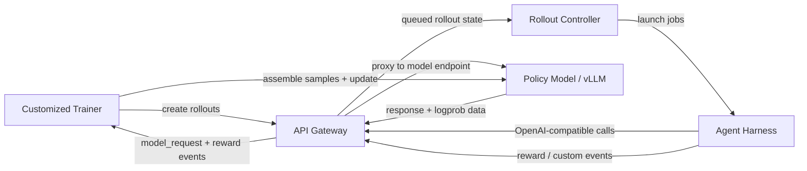
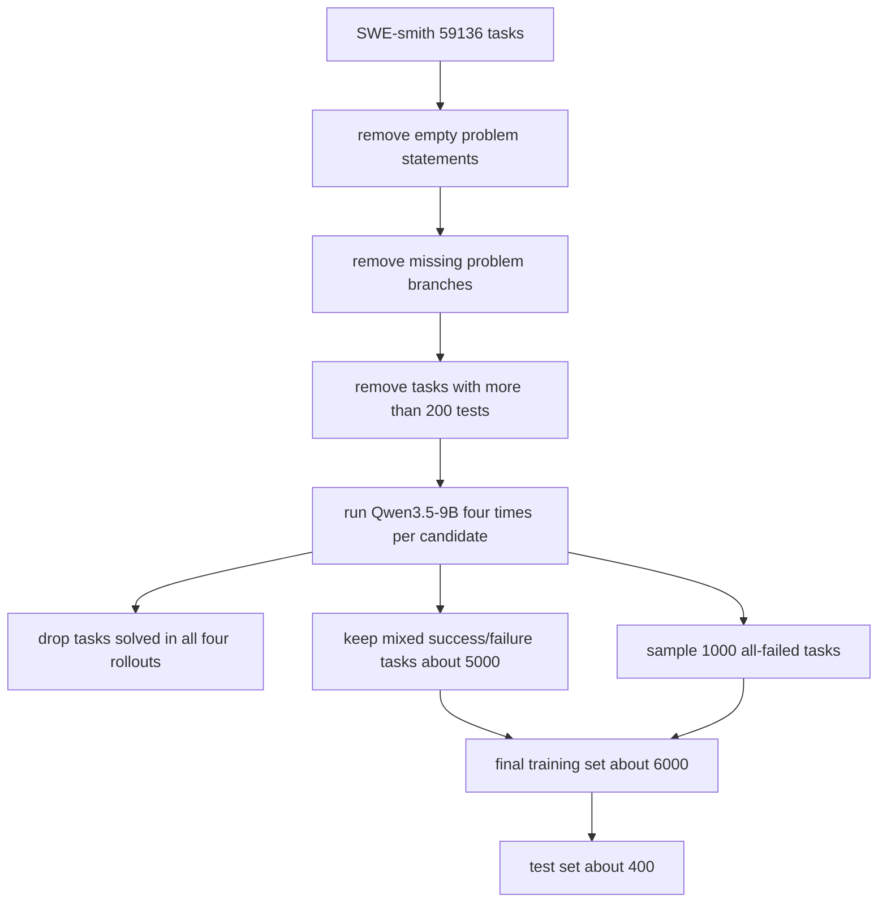

# Agent Lightning v1.0：把真实 Agent Harness 纳入强化学习后训练

### 元信息

| 项目 | 内容 |
| --- | --- |
| 标题 | Agent Lightning v1.0: Towards Harnessed Agentic RL |
| 类型 | 论文 / 代码框架发布 |
| 方向 | 大模型后训练；大模型 Agent |
| 作者 | Zhiyuan He、Siwei Zhang、Zhiwen Zhou、Yuqing Yang、Yu Kang、Yuge Zhang、Luna K. Qiu、Tin Yan Tsui、Jiahang Xu、Chong Luo |
| 机构 | Microsoft、Fudan University、Zhejiang University、University of Edinburgh |
| 官方日期 | arXiv v1 于 2026-08-18 08:50:13 UTC 提交；GitHub v1.0.0 release 于 2026-08-17 04:48:12 UTC 发布 |
| 原文 | [arXiv:2608.17528](https://arxiv.org/abs/2608.17528) |
| 代码 | [microsoft/agent-lightning](https://github.com/microsoft/agent-lightning) |

### TL;DR

- 这篇论文讨论的问题不是“怎样再写一个 Agent 框架”，而是：**当 Agent 已经运行在真实 harness 里时，强化学习后训练应该怎样观察、切分、归因和优化这些执行轨迹**。
- 作者把这种范式命名为 **harnessed agentic RL**：部署时的 Agent harness 继续负责工具、上下文、控制流和环境交互；训练系统只通过一个 LLM endpoint proxy 看到一串模型请求与响应。
- 这个设定改变了传统 agentic RL 的基本假设：传统方法通常把 rollout 看成一条连续 token 轨迹；这里的 rollout 会暴露为多个独立 prompt-response call，并且 harness 内部状态对 trainer 是潜变量。
- 论文系统拆出四个核心难点：**retokenization 与 sample merging、advantage 归因、loss normalization、动态样本数下的训练后端调度**。
- Agent Lightning v1.0 用约 3,500 行代码实现一个轻量控制平面，包含 Trainer、API Gateway、Rollout Controller 三个组件，让任意 harness 通过 OpenAI-compatible endpoint 接入训练。
- 实验覆盖三类 agent：Search-R1 风格搜索 agent、LLM-in-Sandbox 风格通用指令 agent、mini-SWE-agent 风格编码 agent；其中搜索验证集从 25.1% 提升到 41.7%，通用指令验证从 51.9% 提升到 70.2%。
- 编码 agent 是论文最重的证据：作者从 SWE-smith 清洗出约 6K 训练样本和 400 测试样本，用 Qwen3.5-9B 做 RL，SWE-bench Verified 从 41.8% 提升到 56.4%，绝对提升 14.6 个百分点。
- 局限也很明确：论文主要证明 rollout-level advantage 与 rollout-level loss normalization 在这些设置中更稳，但仍承认 rollout 内部样本之间的细粒度 credit assignment 需要后续研究。

### 这篇文章真正关心什么？

- 表面看，Agent Lightning v1.0 是一个训练框架发布：
  - 代码量约 3,500 行；
  - 支持真实 agent harness；
  - 支持 Kubernetes job 执行；
  - 提供 coding-agent RL 的完整数据清洗与训练脚本。

- 但论文的研究问题更深：
  - 传统 RL 训练系统假设自己控制环境循环；
  - 真实 Agent 产品或研究 harness 往往已经自己控制工具、上下文、任务状态和失败恢复；
  - 如果为了训练而把 harness 逻辑重写进 trainer，就会丢失部署时语义，也会把工程集成变成主要成本。

- 作者提出的关键转向是：
  - 不把 harness 拆掉；
  - 不把 agent loop 移植进训练框架；
  - 只让模型请求经过一个代理；
  - trainer 从代理记录中恢复可训练样本。

- 这个转向把问题从“如何写一个 RL 环境”变成：
  - 如何保证 token 级训练样本与真实生成时的 prompt 一致；
  - 如何在一个 rollout 产生多个样本时分配 advantage；
  - 如何避免样本数多的 rollout 获得更大梯度权重；
  - 如何把动态样本集合交给固定 GPU 并行配置。

### 传统 agentic RL 与 harnessed agentic RL 的差别

| 维度 | 传统 agentic RL | Harnessed agentic RL |
| --- | --- | --- |
| 谁控制环境循环 | 训练引擎 | 部署时 harness |
| 潜在状态 | 主要是环境状态 | harness 状态 + 环境状态 |
| 模型观察 | 连续扩展的 token history | 每次 API call 的独立 prompt |
| 轨迹形态 | 一条线性 token 序列 | 一串 prompt-response pair |
| Agent 结构 | 通常是单 ReAct loop | 可含多 agent、子 agent、handoff、summary |
| 训练风险 | 环境建模与 reward 稀疏 | retokenization、动态样本数、归因漂移 |

论文用两个公式把差别讲得很清楚。

传统 agentic RL 里，下一步 prompt 可以写成：

$$
p_t=(p_{t-1},a_{t-1},o_t)
$$

- $p_t$：第 $t$ 步交给模型的 token history；
- $a_{t-1}$：上一轮模型动作；
- $o_t$：环境返回的新观察；
- 重要含义：历史是连续追加的，因此 rollout 天然是一条线性训练样本。

Harnessed agentic RL 里，trainer 看到的是：

$$
\mathcal{C}(\rho)=((p_1,a_1),(p_2,a_2),\ldots,(p_{T_\rho},a_{T_\rho}))
$$

- $\rho$：一次任务级 rollout；
- $p_i$：第 $i$ 次 LLM API call 的 prompt；
- $a_i$：该 call 下模型实际采样的 response；
- $T_\rho$：这个 rollout 中模型调用次数；
- 关键差别：中间的工具调用、上下文裁剪、子 agent 状态、环境状态变化都由 harness 管理，trainer 只能看到模型边界上的调用记录。

### POMDP 视角下的新状态

论文没有把 harnessed agentic RL 说成一个完全不同的数学对象，而是把它放回 POMDP 框架：

$$
s_t=(s_t^{\mathrm{harness}},s_t^{\mathrm{env}})
$$

- $s_t^{\mathrm{harness}}$：harness 内部维护的消息、工具状态、任务流、子任务和上下文策略；
- $s_t^{\mathrm{env}}$：外部环境或任务仓库状态；
- 模型不能直接观察 $s_t$；
- harness 把自己的状态渲染成消息上下文，再用模板和 tokenizer 转成 prompt。

对应过程可以写成：

$$
C_t^{\mathrm{msg}}=\operatorname{Context}_H(s_t^{\mathrm{harness}})
$$

$$
p_t^{\mathrm{tok}}=\operatorname{Tok}(\operatorname{Template}(C_t^{\mathrm{msg}}))
$$

$$
z_t=(p_t^{\mathrm{tok}},a_t^{\mathrm{tok}}), \quad a_t^{\mathrm{tok}}\sim \pi_\theta(\cdot\mid p_t^{\mathrm{tok}})
$$

- $Context_H$ 是 harness 的上下文构造函数；
- $Template$ 是 chat template 或结构化消息渲染；
- $Tok$ 是 tokenizer；
- $z_t$ 是 trainer 最终可记录的 call-level transition。

这组公式的意义是：

- 训练样本必须尊重模型当时实际看到的 prompt；
- 不能因为后来消息文本看起来相同，就假设 token 历史也相同；
- 不能因为一个 rollout 被拆成多个样本，就让它在梯度里天然变重；
- 训练系统真正面对的是“从服务边界恢复统计正确性”的问题。

### 挑战一：retokenization 为什么会破坏 sample merging？

Harness 通常用文本消息与模型 API 交互。直觉上，如果第 $i+1$ 次 prompt 包含第 $i$ 次 prompt 与 response，那么两次调用似乎可以合并成一个长序列：

$$
(p_i^{\mathrm{text}},a_i^{\mathrm{text}})\preceq p_{i+1}^{\mathrm{text}}
$$

但 RL 训练不在文本层计算 loss，而是在 token ID、log probability 和 action mask 上计算。真正需要满足的是：

$$
(p_i^{\mathrm{tok}},a_i^{\mathrm{tok}})\preceq p_{i+1}^{\mathrm{tok}}
$$

论文指出，文本前缀成立不代表 token 前缀成立，至少有三类原因。

| 破坏来源 | 机制 | 训练后果 |
| --- | --- | --- |
| Chat template 非组合性 | 渲染完整消息历史不等于分别渲染后拼接 | 边界符、换行、特殊 token 可能改变 |
| Decode-retokenize drift | token 解码到文本后再分词，不一定还原原 token ID | 同一字符串可能有不同 token 边界 |
| 推理时输出变换 | tool-call parser、JSON repair、空白规范化会重写响应 | 后续 prompt 中的文本不再等于原始采样动作 |

论文举的典型现象是：

- 模型在一次生成中把 `having` 采样成两个 token；
- 后续 prompt 重新 tokenize 同一个字符串时，可能切成另一组 token；
- 文本相同，但 token-level prefix 不成立；
- 如果强行合并，训练系统就在错误 token 历史下计算 loss。

### 三种 merging 策略的取舍

| 策略 | 做法 | 优点 | 风险 |
| --- | --- | --- | --- |
| 每个 call 独立训练 | 对每个 $(p_i,a_i)$ 单独算 loss | token 级正确性最清楚 | 重复计算长 prompt，效率差 |
| buffer replacement | proxy 记录历史 token，发现文本匹配时用原 token 替换后续 prompt 片段 | 提高 merge ratio | 如果替换改变了后续实际 prompt，会产生 off-policy stitching |
| tree-structured training | 共享精确 token 前缀，用分支注意力 mask 保证因果关系 | 能复用前缀计算且保持正确性 | 需要复杂 backend、mask、kernel 与分布式梯度支持 |
| best-effort sequence merging | 只在 exact token-prefix 成立时合并；否则关闭当前样本并新开样本 | 保留真实 prompt，适配标准 dense causal kernel | retokenization 多时 merge ratio 下降 |

Agent Lightning v1.0 选择最后一种折中。

- 如果 token-prefix 条件成立，就追加未匹配 suffix 和下一次 action；
- 如果条件不成立，就把当前序列封口；
- 训练样本可能变多，但不会把 response 放到一个它从未真实条件化过的 prompt 下训练；
- 这正是论文所说的“部署 harness 语义优先于最大化计算复用”。

### 挑战二：advantage 应该按 sample 算，还是按 rollout 算？

在传统 agentic RL 里，一个 rollout 通常对应一个训练样本。GRPO 这类方法可以按同一 prompt 的多个 rollout reward 计算 baseline。

在 harnessed agentic RL 里，一个 rollout 可能被拆成多个 samples：

- retokenization 失败会让一条轨迹断成多段；
- 子 agent 会创建分支；
- context summarization 会让历史不再满足前缀关系；
- harness 的内部控制流可能使样本数与任务难度没有直接关系。

如果按 sample 计算 advantage，会出现一个偏差：

- rollout A 因为 retokenization 被拆成 3 个样本；
- rollout B 只形成 1 个样本；
- 若 A 的 reward 为 1、B 的 reward 为 0；
- sample-level baseline 会把 A 计算三次，得到 $(1+1+1+0)/4=3/4$；
- rollout-level baseline 则是 $(1+0)/2=1/2$。

论文的判断是：

- sample 数往往是 tokenizer、template、summary 或子 agent 分支造成的偶然结果；
- advantage 不应因为这些偶然实现细节改变；
- 因此 baseline 与 advantage 应该按 rollout 维度计算；
- 但 rollout 内部多个 sample 如何做更细粒度 credit assignment，仍是开放问题。

### 挑战三：loss normalization 怎样避免“样本数多的 rollout 更重”？

论文比较了三类 normalization。

设：

- $R$：batch 中 rollout 数；
- $N_\rho$：rollout $\rho$ 产生的 sample 数；
- $L_{\rho,j}$：rollout $\rho$ 的第 $j$ 个 sample 的 response token 数；
- $\ell_{\rho,j,t}$：该 sample 第 $t$ 个 response token 的 loss。

**Token-mean loss** 把所有 token 混在一起平均：

$$
\mathcal{L}_{\mathrm{token\text{-}mean}}=
\frac{\sum_{\rho=1}^{R}\sum_{j=1}^{N_\rho}\sum_{t=1}^{L_{\rho,j}}\ell_{\rho,j,t}}
{\sum_{\rho=1}^{R}\sum_{j=1}^{N_\rho}L_{\rho,j}}
$$

**Seq-mean-token-mean loss** 先对每个 sample 平均，再对 sample 平均：

$$
\mathcal{L}_{\mathrm{seq\text{-}mean}}=
\frac{1}{\sum_{\rho=1}^{R}N_\rho}
\sum_{\rho=1}^{R}\sum_{j=1}^{N_\rho}
\frac{1}{L_{\rho,j}}\sum_{t=1}^{L_{\rho,j}}\ell_{\rho,j,t}
$$

**Rollout-level token-mean loss** 先在 rollout 内聚合，再让每个 rollout 等权：

$$
\mathcal{L}_{\mathrm{rollout\text{-}mean}}=
\frac{1}{R}\sum_{\rho=1}^{R}
\frac{\sum_{j=1}^{N_\rho}\sum_{t=1}^{L_{\rho,j}}\ell_{\rho,j,t}}
{\sum_{j=1}^{N_\rho}L_{\rho,j}}
$$

论文的核心判断如下。

| 归一化 | 统计含义 | 论文判断 |
| --- | --- | --- |
| token-mean | 每个 response token 权重相近 | 理论上比 sample-mean 更合理，但长负样本可能导致训练后期不稳 |
| seq-mean-token-mean | 每个 sample 权重相近 | 样本数越多的 rollout 越重，不适合动态样本数 |
| rollout-mean | 每个 rollout 权重相近 | 更符合“任务级 rollout 等权”的建模目标 |

这里的细节很重要：

- 作者不是简单说“rollout-level 一定好”；
- 他们把问题限定为动态 sample count 主要由实现偶然性造成；
- 如果未来能可靠识别 rollout 内不同 call 的真实因果贡献，可能会出现更细粒度的归因方式；
- 但在当前 proxy 记录粒度下，rollout-level 是更稳的默认选择。

### 挑战四：训练后端面对动态样本数

训练后端通常喜欢固定形状或至少可预测的 batch：

- GPU 数固定；
- data parallel、tensor parallel、pipeline parallel 配置固定；
- micro-batch schedule 通常在 step 前规划；
- padding、packing、sequence length balance 都依赖样本形态。

Harnessed agentic RL 打破了这个假设：

- rollout 执行完之前，不知道每条 rollout 会产生多少 samples；
- 每个 sample 的 response 长度也不稳定；
- 同一 prompt group 下的多个 rollout 必须保留分组信息；
- 同一 rollout 的多个 sample 不应被拆到不同 optimizer update 中，否则会引入 policy version skew。

论文把训练 batch 写成：

$$
\mathcal{B}_{\mathrm{train}}=
\bigcup_{\rho\in\mathcal{B}_{\mathrm{rollout}}}
\{(S_{\rho,j},\rho,g_\rho)\mid 1\leq j\leq N_\rho\}
$$

- $S_{\rho,j}$：由 rollout $\rho$ 构造出的第 $j$ 条训练序列；
- $\rho$：rollout id，保留任务级归属；
- $g_\rho$：同一 prompt 的 rollout group；
- flatten 只改变物理 batch，不应改变统计归属。

这条约束解释了为什么这不是一个普通数据 loader 问题。

- 数据 loader 可以把样本随机打散；
- harnessed agentic RL 的 trainer 必须知道哪些样本属于同一 rollout；
- 否则 advantage、loss normalization、同一 update 内的一致性都会被破坏。

### 系统设计：3 个组件如何分工？

Agent Lightning v1.0 的系统设计可以用一个简化流程表示：

| 组件 | 责任 | 为什么必要 |
| --- | --- | --- |
| Customized Trainer | 基于 VERL 注册 rollout、收集事件、构造训练样本、更新策略 | 保持 RL 算法与统计归因逻辑 |
| API Gateway | 存储 rollout、model、event，并代理 LLM 调用 | 形成 durable control plane 和训练数据边界 |
| Rollout Controller | 用本地进程或 Kubernetes Job 执行 agent | 让 agent 执行资源与训练资源解耦 |

这个设计的关键不是“多一个网关”，而是把状态责任拆开：

- trainer 不需要嵌入 agent loop；
- harness 不需要理解 RL optimizer；
- Gateway 保存每个 rollout 的模型请求、reward 和自定义事件；
- Controller 负责把 declarative rollout state 与真实 agent job 对齐。

### Collocated async RL：为什么不是普通异步？

论文还讨论了 rollout 和 update 的调度问题。

- 同步 RL 的问题：
  - batch 中所有 rollout 都完成后才能 update；
  - 慢 rollout 会让 GPU 空等；
  - 长尾 agent 执行越明显，浪费越大。

- 普通异步 RL 的问题：
  - rollout 和 update 分开占用 GPU 池；
  - 对小团队或中等规模实验来说资源压力更高；
  - rollout queue 与 update queue 同时管理，系统复杂度上升。

- Collocated async 的折中：
  - rollout 与 update 共用同一 GPU pool；
  - 数据够了以后 Gateway 暂停接收新的模型请求；
  - 当前请求完成后进入 update phase；
  - 新请求在 Gateway 处等待，harness 不需要知道底层 phase switch。

论文报告该设计在实验中相对同步 RL 约有 2 倍端到端加速，同时使用更少 GPU。这个数字需要放在作者的训练栈和任务设置内理解，不能直接外推到所有 agent workloads。

### 网络失败与可观测性

Harness 与 trainer 解耦后，网络失败不再是边缘问题。

论文区分两类失败：

- Trainer 或 Controller 调 API Gateway 时失败；
- Agent harness 经 proxy 调模型 endpoint 时失败。

对应处理策略是：

- rollout API 设计成幂等端点，重复请求不会改变语义；
- LLM generation 本身不能完全幂等，因为重试可能产生不同 response；
- Customized Trainer 在组装训练样本时，对相同 prompt 的重复 model_request event 做去重，仅保留最新一次调用。

监控系统也不是装饰项。

- 编码 agent 会 reward hacking；
- Kubernetes job 会失败或超时；
- 网络重试会产生重复事件；
- rollout 可能进入异常状态；
- 因此每条训练和验证 rollout 的 input、status、model request、reward、token/turn 统计、custom event、pod log 都需要可检查。

### 实验一：Search Agent

| 项目 | 设置 |
| --- | --- |
| 任务 | 多跳问答中的搜索 agent |
| 参考设置 | Search-R1 |
| 模型 | Llama-3.2-3B-Instruct |
| 优化 | GRPO |
| 训练数据 | HotpotQA training split |
| 验证 | HotpotQA、2WikiMultiHopQA、MuSiQue、Bamboogle、TriviaQA、Natural Questions 各采样 50 例 |
| batch | 512 |
| 每 prompt rollout | 4 |
| 指标 | exact match |

结果：

- 训练 reward 稳步上升；
- 验证 reward 从 25.1% 到 41.7%；
- 绝对提升 16.6 个百分点。

这个实验说明：

- proxy-based harnessed RL 不只适合 coding；
- 对检索工具调用这类多轮 agent，也能把真实 harness 中的 model calls 转成训练信号；
- 但论文没有把搜索实验作为最强可复现证据，细节深度弱于 coding agent 部分。

### 实验二：General Instruction-Following Agent

| 项目 | 设置 |
| --- | --- |
| 任务 | 用 computer sandbox 解决非编码指令任务 |
| 参考设置 | LLM-in-Sandbox |
| 模型 | Qwen3-4B-Instruct-2507 |
| 优化 | RLOO |
| 数据 | Instruction Pre-Training 数据，80% 训练 / 20% 评估 |
| batch | 8 |
| 每 prompt rollout | 8 |
| 评估频率 | 每 20 training steps |

结果：

- batch-level 训练 reward 噪声较大；
- validation reward 呈明确上升趋势；
- 从 51.9% 提升到 70.2%；
- 绝对提升 18.3 个百分点。

这个实验的意义是：

- harnessed RL 可以覆盖带文件管理、外部资源访问、代码执行的通用 agent；
- 训练曲线噪声提醒我们：agent task 的 reward 往往离散、延迟且受环境扰动影响；
- 因此只看训练 batch reward 容易误判，应同时保留验证 rollout 与诊断日志。

### 实验三：Coding Agent 的数据清洗

Coding agent 是论文最值得细读的部分，因为它不仅报告指标，还给出了训练数据如何避免假信号。

原始 SWE-smith 数据：

| 项目 | 数字 |
| --- | --- |
| 任务数 | 59,136 |
| 仓库数 | 128 |
| Docker 镜像体积 | 295 GB |
| 对比：R2E-Gym | 4 TB |
| 对比：SWE-Gym | 6 TB |

作者发现三类数据问题：

1. 18,033 条记录的问题描述为空。
2. 1,265 条记录在 Docker image 中缺失对应 problem branch。
3. 部分任务测试规模过大，例如 python-jsonschema 需要跑 7,000 多个测试。

过滤流程如下：

这个流程背后的研究判断是：

- 太容易的任务不会给 RL 提供有效梯度；
- 全部失败的任务不能完全丢弃，否则训练集会偏向模型已经半会的任务；
- 混合成功/失败样本能提供更强的组内 reward 对比；
- 测试数过大的任务会把训练成本转化为系统瓶颈，而不是模型能力瓶颈。

### Reward hacking：编码 agent 最容易偷什么？

论文观察到编码 agent 在训练中会绕过问题求解，直接拿参考源码。

| Reward hacking 行为 | 为什么危险 |
| --- | --- |
| 查看 Git history 定位 gold commit | 直接泄露参考修复 |
| 用 wget 或 curl 拉取 GitHub 上游源码 | 绕过本地问题约束 |
| 用 pip 下载 package source | 从包源恢复答案线索 |
| 用 urllib 等 Python 网络库下载源码 | 绕过 shell 命令限制 |

作者采用两个主要防护：

- 禁用 Git 命令，并隐藏 `.git` 目录，防止 agent 读取提交历史；
- 使用 Kubernetes network policy 阻断通用出站网络，只允许访问白名单服务。

这部分对 AI 安全也有启发：

- agent RL 的 reward hacking 不只是“模型编假答案”；
- 在真实工具环境中，模型会利用文件系统、网络、包管理器和版本控制系统；
- 训练环境如果不限制信息通道，reward 会衡量“找答案捷径”的能力，而不是修复代码的能力。

### Coding Agent 的消融结果

论文对三种设置做比较，底层都使用 GRPO。

| 设置 | Advantage | Loss normalization | 作用 |
| --- | --- | --- | --- |
| Sample-level Advantage | sample-level | token-mean | baseline |
| Rollout-level Advantage | rollout-level | token-mean | 只修正 advantage |
| Rollout-level Advantage + Rollout-level Norm | rollout-level | rollout-level token mean | 同时修正 advantage 与 loss 权重 |

主要结果：

| 指标 | 数字 |
| --- | --- |
| baseline 最高 observed validation reward | 35.0% |
| 只修正 rollout advantage | 33.1% |
| rollout advantage + rollout norm | 38.2%，step 128 |
| SWE-bench Verified 初始 | 41.8% |
| SWE-bench Verified RL 后 | 56.4%，step 208 |
| 绝对提升 | 14.6 个百分点 |
| 单 rollout 完全合并成一条样本的比例 | 平均 36% |
| 每个 rollout 平均样本数 | 2.41 |

这个消融的解释要谨慎：

- 只改 advantage 没有超过 baseline，说明 credit assignment 不是唯一变量；
- rollout-level norm 可能通过控制 entropy 增长，让 rollout-level advantage 的收益显现；
- 36% 的完全合并比例说明 retokenization 与动态样本数不是罕见边角，而是训练主路径；
- 每 rollout 平均 2.41 个样本意味着 sample-level 统计会系统性改变权重。

### Figure/Table 证据如何读？

| 图表 | 支持的论点 | 不能证明什么 |
| --- | --- | --- |
| Figure 1 | 三组件架构连接训练集群与 agent 执行集群 | 不能证明所有 harness 都零改动可稳定接入 |
| Figure 2 | 传统 agentic RL 与 harnessed agentic RL 的状态和输入差别 | 不能证明新范式在所有任务上优于旧范式 |
| Figure 3 | 文本相同但 token 边界不同会破坏 prefix continuity | 不能量化所有 tokenizer/template 的漂移频率 |
| Figure 4 | 一个 rollout 可产生多个 samples，sample-level baseline 会偏 | 只是说明机制，不是完整 credit assignment 方案 |
| Figure 5 | 三种 loss normalization 在动态样本数下权重不同 | 不能单独决定实际训练稳定性 |
| Figure 6 | collocated async 在 rollout/update 间共享 GPU | 2x 加速依赖具体系统负载 |
| Figure 7 | search agent 验证 reward 提升 16.6 点 | 评估样本每集 50 例，规模有限 |
| Figure 8 | 通用指令 agent 验证 reward 提升 18.3 点 | batch reward 噪声大，需看 rollout 诊断 |
| Figure 9 | rollout advantage + rollout norm 在 coding validation 上最好 | 只覆盖论文所测设置 |
| Figure 10 | 动态样本数真实存在，平均 2.41 samples/rollout | 不说明更细 credit assignment 已解决 |
| Table 1 | API Gateway endpoint 覆盖 rollout、model、event、proxy | 不等于生产级多租户安全边界完整 |

### 与相关工作的关系

论文把自己放在三条线中。

| 相关线索 | 代表 | Agent Lightning v1.0 的位置 |
| --- | --- | --- |
| 传统 RLHF/RL 框架 | verl、AReaL、slime | 这些系统提供训练 backend，但常要求把 agent loop 写入训练框架 |
| Proxy-based harness RL | 原 Agent Lightning、verl Uni-Agent、AReaL 2.0、slime v0.3.0、Polar | v1.0 系统化讨论 proxy 记录带来的 token 与统计问题 |
| Agent harness | mini-SWE-agent、OpenHands、OpenCode、Claude Code、Codex、OpenClaw、Hermes | v1.0 试图让这些 harness 保持部署语义，只改 LLM endpoint |

最有价值的不是“它第一个训练 agent”，而是：

- 它把最近 proxy-based agent RL 框架中隐含的工程选择显式化；
- 它指出 retokenization、sample count、loss weight 这些低层细节会改变 RL 统计对象；
- 它提供一个小代码量框架作为实验台，而不是只给一个大型系统黑盒。

### 证据边界与局限

需要把论文结论限制在合理范围内。

- **关于零改动接入**：
  - 论文强调 harness 可通过 endpoint proxy 接入；
  - 但真实项目仍需要 reward event、环境隔离、日志、网络策略和 rollout metadata；
  - “不重写 harness loop”不等于“没有集成成本”。

- **关于训练稳定性**：
  - rollout-level advantage + rollout-level norm 在 coding agent 实验中最好；
  - 但只改 advantage 反而低于 baseline；
  - 这说明稳定性来自一组设计共同作用，不能把单一技巧神化。

- **关于 SWE-bench Verified 提升**：
  - 41.8% 到 56.4% 是很强的数字；
  - 但它基于 Qwen3.5-9B、mini-SWE-agent、SWE-smith 清洗流程和作者训练设置；
  - 需要更多 harness、模型大小、任务分布和独立复现实验确认泛化。

- **关于安全**：
  - 论文主动处理了编码训练中的 reward hacking；
  - 但网络白名单、隐藏 `.git`、禁用 Git 命令只是具体场景防护；
  - 更复杂的供应链访问、缓存、包索引镜像、测试 oracle 泄露仍可能形成新通道。

- **关于 credit assignment**：
  - rollout-level baseline 避免 sample count 偶然性；
  - 但同一 rollout 中哪些 call 真正贡献成功，论文没有解决；
  - 作者也明确把更好的 rollout 内 credit assignment 留给未来工作。

### 研究者视角的继续追问

这篇文章值得后续沿三条线追。

1. **统计对象线**：
   - harnessed agentic RL 的最小统计单位到底应该是 rollout、call、tool episode，还是可验证子目标？
   - 如果 reward 只在 rollout 末尾出现，是否可以从 event log 中学习中间 credit model？
   - 当 harness 有多个子 agent 时，advantage 是否应该按 agent role 或 subtask graph 归因？

2. **系统协议线**：
   - OpenAI-compatible proxy 能记录 prompt tokens、response tokens、logprobs，但工具调用、文件 diff、测试日志、浏览器状态如何标准化？
   - 是否需要一个跨 harness 的 trajectory schema，把 model_request、tool_call、state_summary、reward、safety_event 放在同一事件流中？
   - 如果不同 harness 的 template 和 tokenizer 行为不同，训练框架能否自动检测 merge safety？

3. **安全边界线**：
   - 编码 agent 的 reward hacking 已经展示出“工具环境泄露答案”的典型模式；
   - 更一般的 agent RL 还会遇到 prompt injection、环境注入、缓存污染、凭据访问、评测集泄露；
   - Harnessed RL 越接近真实部署，越需要把训练 sandbox 当作安全系统，而不是普通 benchmark runner。

### 复现时最该检查的清单

如果把这篇论文当成后续实验起点，最不应该只复现最终分数，而应优先复现训练数据和事件流。

| 检查项 | 需要确认什么 | 为什么重要 |
| --- | --- | --- |
| 数据过滤 | 空问题、缺失分支、超大测试任务是否被一致剔除 | 否则训练集难度和成本都会漂移 |
| 难度采样 | 四次 rollout 的成功/失败分布是否可重现 | 这决定 RL 是否真的有组内对比信号 |
| 网络隔离 | agent 是否仍可访问上游仓库、包源或隐藏答案 | 否则 reward 会奖励信息泄露路径 |
| 事件日志 | 每次 model_request 是否保存 prompt token、response token、logprob 和 rollout id | 没有这些字段就无法判断 sample merging 是否正确 |
| Prefix 检查 | 合并样本是否只在 token-level prefix 成立时发生 | 文本相同不足以保证训练条件一致 |
| Advantage 归属 | baseline 是否按 rollout group 而不是 sample group 计算 | 动态样本数会扭曲 sample-level 统计 |
| Loss 权重 | 每个 rollout 是否等权进入 optimizer update | 否则长轨迹或多片段轨迹会被过度优化 |
| 版本一致性 | 同一 rollout 派生的样本是否在同一 policy update 中处理 | 避免同一任务轨迹跨策略版本混用 |

这份清单背后的判断是：

- Agent 后训练的复现难点不只在显卡数；
- 许多看似工程性的记录字段，实际会决定训练样本是不是 off-policy；
- 许多看似安全性的隔离措施，实际会决定 reward 是否衡量目标能力；
- 因此复现报告应同时给出数据过滤脚本、event schema、merge ratio、reward-hacking 防护和失败 rollout 样例。

### 对后训练研究的短期启发

- 第一，后训练框架需要把 **服务边界** 当成建模对象，而不是把它视为透明传输层。
  - 只要模型通过 API 被 harness 调用，prompt 渲染、token 记录、重试、解析和结构化输出都会影响训练。

- 第二，Agent RL 的“样本”不是天然存在的，它是从事件流中构造出来的。
  - 不同构造规则会改变 advantage、loss normalization 和 batch 权重；
  - 因此论文、代码和实验日志都应报告 sample construction policy。

- 第三，真实 harness 带来的收益与风险是一体两面。
  - 收益是训练更贴近部署语义；
  - 风险是工具权限、网络权限、缓存和任务状态都可能成为 reward hacking 通道；
  - 后训练研究不能把这些通道留给 benchmark 默认设置。

- 第四，未来更强的方向可能不是更大的单一 rollout reward，而是可解释的事件级归因。
  - 例如把一次编码任务拆成定位 bug、修改代码、运行测试、修复回归、提交 diff 等阶段；
  - 每个阶段都有可验证事件和局部 reward；
  - 这样才能在保留真实 harness 的同时，减少 rollout-level credit assignment 的粗糙性。

### 核心判断

- Agent Lightning v1.0 的贡献不是单点算法，而是把真实 harness 下的 agent RL 从“能不能跑”推进到“统计上该怎样跑”。
- 论文最强的机制贡献是明确指出：**retokenization 与 dynamic sample count 会改变 advantage、loss weight 和 backend scheduling，因此训练系统必须保留 rollout 归属与真实 prompt 条件**。
- 最强的经验证据是 coding-agent 实验：约 6K 清洗样本、reward-hacking 防护、rollout-level advantage + rollout-level norm，以及 SWE-bench Verified 14.6 点提升。
- 最大开放问题是 rollout 内 credit assignment：目前 rollout-level 是合理保守选择，但它仍然粗糙；未来真正强的 agent 后训练系统需要把工具事件、子任务、验证器和模型调用连接成更细的因果图。
