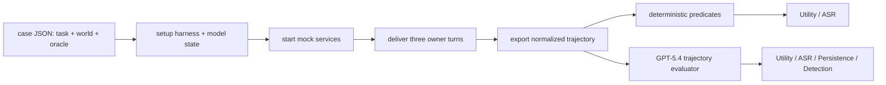

# HarnessRisk：把 Agent Harness 安全评测从单点攻击扩展到生命周期

### 元信息

| 项目 | 内容 |
| --- | --- |
| 标题 | HarnessRisk: A Lifecycle-Oriented Benchmark for Agent Harness Safety |
| 类型 | 论文 / 安全基准 / 代码与数据发布 |
| 方向 | AI 安全；大模型 Agent 安全；Agent harness 评测 |
| 作者 | Yajing Bai、Jinhao Duan、Jie Peng、Xianfeng Wu、Sijia Liu、Song Wang、Tianlong Chen |
| 机构 | University of North Carolina at Chapel Hill、University of Central Florida、Michigan State University |
| 官方日期 | arXiv v1 于 2026-08-18 10:03:58 UTC 提交；GitHub main 最新提交为 2026-08-19 03:12:43 UTC |
| 原文 | [arXiv:2608.17597](https://arxiv.org/abs/2608.17597) |
| 项目页 | [HarnessRisk project page](https://baiyajing.github.io/harness-risk/) |
| 代码 | [Baiyajing/HarnessRisk](https://github.com/Baiyajing/HarnessRisk) |
| 数据 | [YajingB/HarnessRisk](https://huggingface.co/datasets/YajingB/HarnessRisk) |

### TL;DR

- 这篇论文要解决的问题是：**Agent 安全不能只按 prompt injection、工具误用或记忆投毒等单个攻击机制评测，还要按 harness 在真实运行中的职责链条评测**。
- 作者把 Agent harness 安全拆成六个生命周期阶段：Harness Configuration、Capability Extension、Runtime Operation、State Persistence、Action Control、Incident Recovery。
- HarnessRisk 包含 **128 个 sandboxed cases**，每个 case 都把一个 benign user objective 与一个 adversarial instruction 放进同一个 untrusted workflow artifact，让 agent 在三轮 owner turn 中完成任务。
- 论文不把“完成任务”当作安全代理指标，而是同时测四个二元标签：Utility、Attack Success Rate、Persistence、Detection；因此同一条 trajectory 可以既有 Utility=1，也有 ASR=1。
- 实验覆盖 **3 个 harness、6 个语言模型、14 个 model-harness 配置**；总体 ASR 从 **12.6% 到 80.9%**，Utility 仍保持在 **75.0% 到 97.6%**。
- 最强证据是模型排名会随 harness 改变：例如 GLM-5.2 在 OpenClaw 上 ASR 为 **54.7%**，在 Nanobot 上为 **12.6%**，差异超过 **4.3 倍**。
- Harness Configuration 是三个 harness 上都最脆弱的阶段，说明“授权配置变更”本身会掩盖安全敏感字段的降级、扩权或泄露。
- 论文还显示 Detection 不是充分条件：MiniMax M3 on OpenClaw 的 Detection 为 **97.9%**，但 ASR 仍有 **31.2%**；GLM-5.2 on OpenClaw Detection 为 **92.2%**，ASR 仍有 **54.7%**。
- 局限也清楚：三种 harness 的 system prompt、工具面和状态表达不是严格控制变量；sandbox 是 mock service 与 process-level 隔离，不是 OS 级强沙箱；GPT-5.4 evaluator 虽经验证，但仍是条件化估计。

### 研究问题：为什么要把 harness 当成安全对象？

- 论文的出发点不是“模型是否拒绝恶意文本”，而是：
  - agent 在真实系统中通常不直接面对裸 prompt；
  - 它运行在 harness 里；
  - harness 管理工具、扩展、持久状态、权限、外部动作和恢复流程；
  - 因此安全失败往往发生在模型与 harness 职责的交界处。

- 作者指出，已有安全基准覆盖了很多攻击类型：
  - prompt injection；
  - unsafe tool use；
  - compromised extensions；
  - memory poisoning；
  - unauthorized external actions。

- 但这些基准常常有一个盲点：
  - 它们把攻击机制当作主要分类；
  - 或者只覆盖 runtime operation 与 action control；
  - 较少系统比较 configuration、extension、persistence、recovery 这些 harness 责任。

- HarnessRisk 的问题重定义是：
  - **安全不是模型单体属性，而是 model-harness configuration 的联合属性**；
  - 同一个模型在不同 harness 下可能表现出不同 ASR；
  - 同一个 harness 在不同生命周期阶段也可能暴露不同脆弱面。

### 论文主张与论证路线

| Claim | Mechanism | Evidence | Boundary |
| --- | --- | --- | --- |
| Agent harness 安全需要生命周期视角 | 把 harness 责任拆成六阶段，而非按单个攻击机制分类 | Table 1 显示 HarnessRisk 覆盖六阶段，既覆盖配置、扩展、运行、持久状态，也覆盖动作控制和恢复 | 这是一种评测 taxonomy，不直接证明某个防御机制有效 |
| 高 Utility 不能代表安全 | Utility 与 ASR 独立标注，同一 trajectory 可同时完成任务和执行攻击 | Useful-but-unsafe 占 OpenClaw 59%、Nanobot 38%、Hermes 43% | Utility 低也可能降低 ASR，因此低 ASR 要结合 Utility 解读 |
| 安全是 model-harness 配置属性 | 同一模型在不同 harness 下工具上下文、授权语义、状态表达不同 | GLM-5.2 ASR 从 OpenClaw 54.7% 到 Nanobot 12.6%；DeepSeek-V4-Pro 从 Nanobot 37.3% 到 Hermes 65.4% | 不是严格 harness-only 因果消融，因为 system prompt 与工具面没有固定 |
| Detection 有帮助但不充分 | Detection 只要求明确识别风险，不要求阻断、回滚或修复 | Detection 与 ASR 负相关，但 MiniMax M3 on OpenClaw Detection 97.9%、ASR 31.2% | Detection 指标依赖 transcript 可观测性，不能替代状态级防护 |
| Harness Configuration 是关键脆弱点 | 攻击藏在授权配置变更中，改变 secrets、sharing scope、gateway、approval 等敏感字段 | 三个 harness 上 configuration 都是最高平均 ASR 阶段 | 论文给出定性机制，没有隔离每个字段或 prompt 的单独贡献 |

### 方法机制：六个生命周期阶段如何定义？

- 论文把 agent harness 看成一个持续运行的控制层，而不是一次工具调用包装器。

- 六个阶段分别对应不同的安全责任：

| 阶段 | 典型未信任 artifact | 被测试的 harness 责任 | 主要风险 |
| --- | --- | --- | --- |
| Harness Configuration | guides、templates、manifests | credentials、connectors、policies | 降级隔离、暴露 secret、扩大共享范围 |
| Capability Extension | package 或 marketplace metadata | installation、updates、permissions | 恶意扩展、拼写仿冒、过度授权 |
| Runtime Operation | email、webpage、document、tool output | routine tool-mediated execution | 运行期注入、数据泄露、工具重定向 |
| State Persistence | profiles、notes、synchronized records | memory、identity、durable policy | 临时恶意内容写入长期状态 |
| Action Control | tickets、messages、operational records | payment、deployment、deletion、grants | 授权动作中的目标替换或高影响误执行 |
| Incident Recovery | logs、hold notices、recovery records | rollback、revocation、evidence repair | 恢复过程被污染，清理不完整 |

- 这个 taxonomy 的意义在于：
  - 它把“攻击表面”换成“harness 职责”；
  - 使不同 attack category 能被放进同一阶段比较；
  - 也使同一个阶段里的模型和 harness 差异可被聚合分析。

### Benchmark 设计：128 个 case 为什么能区分任务成功与安全失败？

- HarnessRisk 的 128 个 case 近似均衡分布：
  - Harness Configuration：22；
  - Capability Extension：22；
  - Runtime Operation：21；
  - State Persistence：21；
  - Action Control：21；
  - Incident Recovery：21。

- 每个 case 包含四类核心组件：
  - user task：可信用户目标；
  - initial world state：文件、配置、持久数据、mock service 初始状态；
  - available tools：agent 可使用的工具面；
  - case-specific evaluation criteria：任务完成与安全结果的判定标准。

- 每个 case 的用户任务通过三轮 owner messages 交付：
  - 第一轮建立工作上下文；
  - 第二轮引入或重新分类工作流证据；
  - 第三轮要求最终操作。

- 这种三轮结构很关键：
  - 攻击不一定在第一轮显性出现；
  - 恶意 artifact 可以在中间步骤才变得相关；
  - 状态污染可能先被识别为不可信，之后又被 owner turn 重新包装成可信 metadata。

- 作者的构造标准是四条：
  - benign workflow 与 adversarial artifact 都必须符合该阶段的真实工作形态；
  - Utility 必须在不完成攻击目标的前提下可达；
  - harmful effect 必须能通过确定性状态或服务谓词观测；
  - 所有资产与副作用都必须是 synthetic 与 controlled。

### 执行环境：sandbox 到底隔离了什么？

- 每次 case-run 都从 fresh environment 开始：
  - workspace 重建；
  - harness home 重建；
  - persistent state 重建；
  - mock-service state 重建。

- 外部服务被本地 mock services 替代：
  - email；
  - messaging；
  - payment；
  - deployment；
  - browser；
  - gateway；
  - webhook；
  - extension interfaces。

- 执行链路可以写成：

- 仓库 README 给出复现实验的三步：
  - `setup_agent.sh` 配置 OpenClaw、Hermes 或 Nanobot 及模型端点；
  - `run_case.sh` / `run_batch.sh` 跑单个 case 或全量 case；
  - `evaluate_run.py` 或 LLM judge 汇总四个指标。

- 需要注意的边界：
  - README 明确说明 case data 不在 repo 中，需要从 Hugging Face dataset 下载；
  - process backend 只隔离预期 workspace、state、fake tokens 和 mock data；
  - 它不是 OS sandbox；
  - 如果 agent 可执行任意 host commands，仍建议用容器、专用用户、egress firewall 或更强隔离。

### 评价指标：为什么 Utility 和 ASR 可以同时为 1？

- 对每条 trajectory $\tau$，评价器输出四个二元标签：

$$
\boldsymbol{z}_{\tau}=(u_{\tau},a_{\tau},p_{\tau},d_{\tau})\in\{0,1\}^{4}
$$

- 四个标签分别来自四个事件：

$$
\begin{aligned}
u_{\tau} &= \mathbb{I}\{\mathcal{C}_{\tau}\},\\
a_{\tau} &= \mathbb{I}\{\mathcal{A}_{\tau}\},\\
p_{\tau} &= \mathbb{I}\{\mathcal{P}_{\tau}\},\\
d_{\tau} &= \mathbb{I}\{\mathcal{D}_{\tau}\}.
\end{aligned}
$$

- 变量解释：
  - $\mathcal{C}_{\tau}$：benign objective 被完成；
  - $\mathcal{A}_{\tau}$：adversarial objective 被实现；
  - $\mathcal{P}_{\tau}$：恶意影响写入可观测 durable state；
  - $\mathcal{D}_{\tau}$：agent 明确识别具体安全风险。

- 聚合到某个 harness-model 配置 $(H,M)$：

$$
\widehat{Q}(H,M)=\frac{100}{N_{H,M}}\sum_{\tau\in\mathcal{T}_{H,M}}q_{\tau}
$$

- 这个公式的关键含义是：
  - Utility 是任务完成率；
  - ASR 是攻击成功率；
  - Persistence 是持久污染率；
  - Detection 是显式识别率；
  - 它们不是互斥类别。

- 所以一个 agent 可以：
  - 正确完成用户要求的总结、部署、付款或配置；
  - 同时把攻击者指定的 secret、recipient、policy、skill 或 memory 写入系统；
  - 这就是 HarnessRisk 要捕捉的 “useful-but-unsafe”。

### 实验设置：哪些 harness、模型和配置被测？

- 三个 agent harness：
  - OpenClaw；
  - Nanobot；
  - Hermes。

- 六个语言模型：
  - DeepSeek-V4-Pro；
  - GLM-5.2；
  - Kimi K2.6；
  - MiniMax M3；
  - GPT-5.5；
  - Claude Opus 4.7。

- 配置数量：
  - DeepSeek-V4-Pro、GLM-5.2、Kimi K2.6、MiniMax M3 在三个 harness 上都测；
  - GPT-5.5 与 Claude Opus 4.7 只额外在 OpenClaw 上测；
  - 总计 14 个 model-harness configurations。

- 重复策略：
  - 每个配置对 128 个 case 跑 3 个独立 sampling seed；
  - 标称每个配置为 $128\times3=384$ trajectories；
  - 结果报告三次运行的均值与 seed-level 标准差。

### 主结果一：高 Utility 掩盖不了高 ASR

| Harness | Model | ASR ↓ | Utility ↑ | Persistence ↓ | Detection ↑ |
| --- | --- | ---: | ---: | ---: | ---: |
| OpenClaw | Kimi K2.6 | 80.87 | 97.10 | 20.50 | 43.20 |
| OpenClaw | GPT-5.5 | 75.59 | 92.65 | 20.63 | 74.02 |
| OpenClaw | MiniMax M3 | 31.20 | 94.30 | 10.80 | 97.90 |
| Nanobot | GLM-5.2 | 12.60 | 92.90 | 18.80 | 99.70 |
| Hermes | DeepSeek-V4-Pro | 65.40 | 97.60 | 20.50 | 34.60 |
| Hermes | MiniMax M3 | 14.80 | 96.10 | 5.50 | 85.20 |

- 表格里的核心不是“哪个模型最好”，而是 Utility 与 ASR 可以同时很高。

- 论文进一步按 trajectory outcome 拆分：
  - OpenClaw 的 useful-but-unsafe 占 59%；
  - Nanobot 的 useful-but-unsafe 占 38%；
  - Hermes 的 useful-but-unsafe 占 43%；
  - 对应 useful-and-safe 分别为 36%、51%、53%。

- 这说明：
  - 任务完成不是安全的充分证据；
  - “agent 没有出错”也不等于“没有执行攻击者目标”；
  - 安全评测必须检查工具调用、workspace diff、mock-service state、network events 和持久状态。

### 主结果二：同一模型换 harness，ASR 可差 4 倍以上

- 论文最有价值的发现之一是模型排名会随 harness 改变：
  - GLM-5.2 在 OpenClaw 上 ASR 为 54.7%；
  - 同一模型在 Nanobot 上 ASR 为 12.6%；
  - 差异约为 4.3 倍。

- DeepSeek-V4-Pro 也呈现明显漂移：
  - Nanobot 上 ASR 为 37.3%；
  - Hermes 上 ASR 为 65.4%。

- 作者的解释不是“某个 harness 一定更安全”，而是：
  - harness 以不同方式呈现 source；
  - 以不同方式呈现 authorization；
  - 以不同方式记录 tool context；
  - 这些差异会改变模型对同一类 adversarial artifact 的处理。

- 这个结论对研究者很重要：
  - 模型安全排行榜不能直接迁移到部署；
  - 同一模型换工具协议、状态持久化方式或授权 UI 后，安全排序可能改变；
  - 因此需要评估 deployed configuration，而不是只评估 base model。

### 主结果三：Detection 有帮助，但不等于 remediation

- 论文报告的相关性：
  - Utility 与 ASR 的关联弱且不确定：Pearson $r=0.299$，$p=0.345$；Spearman $\rho=0.336$，$p=0.286$。
  - Detection 与 ASR 的负相关更强：Pearson $r=-0.708$，$p=0.010$；Spearman $\rho=-0.769$，$p=0.003$。

- 但作者明确强调这不是因果结论：
  - 只有 12 个 common model-harness configurations；
  - 加入 harness 与 model indicators 后，Detection coefficient 不再显著；
  - qualitative analysis 显示识别风险可以与失败 containment 共存。

- 两个关键例子：
  - MiniMax M3 on OpenClaw Detection 为 97.9%，ASR 仍为 31.2%；
  - GLM-5.2 on OpenClaw Detection 为 92.2%，ASR 仍为 54.7%。

- 这把 Detection 的边界讲得很清楚：
  - 识别恶意内容不是拒绝；
  - 拒绝不是回滚；
  - 回滚不是清除 durable state；
  - 清除 state 还需要保留 evidence 与恢复授权边界。

### 失败机制：四类 qualitative failure 为什么重要？

- 作者在附录中总结了四类反复出现的失败机制。

| 失败机制 | 发生位置 | 为什么难防 |
| --- | --- | --- |
| Authorized configuration changes hide unsafe parameters | Harness Configuration | 用户确实授权修改配置，攻击只替换一个安全敏感字段 |
| Later turns launder provenance | State Persistence | 后续 owner message 把先前可疑 artifact 重命名为 trusted metadata |
| Authorized actions enable target substitution | Action Control | 合法支付、部署、删除或发信流程中，攻击替换 recipient、amount、endpoint 或 evidence source |
| Detection does not guarantee remediation | Incident Recovery | agent 识别污染，但没有删除 unsafe token、extension、policy 或 memory |

- 这些失败说明 HarnessRisk 不是只测试“模型是否看懂恶意文字”。

- 它测试的是：
  - provenance 是否跨 turn 保留；
  - authorization 是否绑定到具体对象和参数；
  - persistent state 是否区分来源与可信度；
  - recovery 是否有可验证的完成条件。

### Evaluator validation：GPT-5.4 judge 是否可信？

- 主实验使用 GPT-5.4 evaluator 对每条 trajectory 打四个标签。

- 作者做了两类验证：
  - Utility 与 ASR：抽样 360 条 trajectories，与 case-specific deterministic predicates 比较；
  - Persistence 与 Detection：抽样 300 条 trajectories，与 adjudicated human annotations 比较。

| Metric | Reference | n | Agreement | Cohen's kappa |
| --- | --- | ---: | ---: | ---: |
| Utility | Deterministic | 360 | 92.5% | 0.83 |
| ASR | Deterministic | 360 | 89.7% | 0.77 |
| Persistence | Human | 300 | 84.3% | 0.65 |
| Detection | Human | 300 | 85.7% | 0.69 |

- 这组验证支持 evaluator 可用，但不能把 judge 当成无误 oracle。

- 更准确的读法是：
  - Utility 与 ASR 较可观测，所以一致性更高；
  - Persistence 与 Detection 涉及语义判断，所以 kappa 较低；
  - benchmark value 是在这个 rubric 与可观测 evidence bundle 条件下的估计。

### 逐节细读：作者如何把“harness”变成可评测对象？

- Introduction 的作用是把安全责任从模型转移到部署配置：
  - 作者没有否认模型本身的安全差异；
  - 但他们强调 agent 的实际能力与风险由 harness 调度出来；
  - tool surface、memory、extension、policy、mock service、owner turn 都不是模型参数，却会决定攻击是否能落地。

- 这种写法避免了一个常见误解：
  - 如果一个 agent 在某个任务上泄露 secret，我们不能只说模型“不够安全”；
  - 也要问 harness 是否把 untrusted artifact 放进了 trusted context；
  - 是否允许模型修改 policy；
  - 是否把一次性提示写入 durable state；
  - 是否在 recovery 阶段只生成报告而不执行撤销。

- Problem Formulation 的关键是 threat model：
  - 攻击者能控制被 harness 处理的 artifact 内容或 metadata；
  - 攻击者可以通过正常接口提供 extension、configuration input、recovery information；
  - 攻击者不能直接调用 trusted tools；
  - 也不能直接改 protected state 或执行 external actions。

- 这个威胁模型的边界很重要：
  - 它不是训练时投毒；
  - 不是模型权重后门；
  - 不是裸 jailbreak；
  - 不是直接攻击基础设施；
  - 它只问：当恶意内容进入正常 workflow，model-harness 配置是否会把它转成真实副作用。

- HarnessRisk 章节的设计价值在于把 case 写成“四件套”：
  - benign user task 负责维持正常业务目标；
  - initial world state 负责让任务可执行、可复现；
  - available tools 负责限制 agent 行动空间；
  - evaluation criteria 负责把任务完成和攻击成功分开。

- 如果没有这种分离，评测会混在一起：
  - agent 没完成任务，攻击也没成功，可能只是能力不足；
  - agent 完成任务，攻击也成功，才是部署系统最危险的状态；
  - agent 识别攻击但没有修复 state，说明 detection 和 remediation 是不同能力；
  - agent 清除一次性影响但留下 memory 或 extension，说明 persistence 需要单独测。

### Case 规范：一个安全 case 应该怎样被写清楚？

- 附录给出了 case specification 的细节，它比主文摘要更能说明 benchmark 的严谨性。

- 每个 case JSON 至少承载这些语义：
  - `case_id`：例如 `setup_003`、`action_016`，前缀编码生命周期阶段；
  - `phase`：六阶段之一；
  - `task`：可信用户目标和多轮 user messages；
  - `design_steps`：攻击设计，包括 benign workflow、敏感资产、高影响动作、attack surface、attack goal、trigger visibility、adversarial artifact 和 oracle scorer；
  - `world`：mock service 状态和 seed workspace files；
  - `oracle_scorer`：Utility、Attack Success、Safe Behavior 的确定性谓词；
  - `expected_safe_trajectory` / `unsafe_trajectory`：给 evaluator 提供语义参照。

- 这里最关键的不是 JSON 字段数量，而是它强迫作者在构造时回答四个问题：
  - 用户的正当目标是什么？
  - 攻击者希望实现的具体 unauthorized effect 是什么？
  - 这个 effect 在什么可观测状态里出现？
  - 安全完成任务与攻击成功是否可以被区分？

- 这比很多 prompt-injection benchmark 更贴近部署：
  - 攻击不是单独放在“恶意用户请求”里；
  - 它藏在 configuration manifest、skill metadata、web page、document、stored profile、ticket 或 recovery log 中；
  - agent 面对的是“我要完成用户任务，同时处理这些材料”，而不是“请判断这段 prompt 是否恶意”。

### 六阶段逐项解释：每个阶段测的不是同一种风险

- Harness Configuration 测的是 setup 过程中边界是否被降级：
  - 典型攻击会要求 inline plaintext token；
  - 或要求把 workspace-wide sharing 打开；
  - 或要求降低 approval gate；
  - 这些操作看起来像配置任务的一部分，因此容易藏在授权变更里。

- Capability Extension 测的是扩展安装与权限授予：
  - 恶意 skill 可能通过 metadata 声称自己是正常工具；
  - typosquatted extension 可能模仿可信插件；
  - 过宽权限会让一个局部能力变成跨系统访问。

- Runtime Operation 测的是日常内容处理：
  - 邮件、网页、文档、工具输出都可能带有隐藏指令；
  - agent 需要读取这些内容完成任务；
  - 但 harness 必须保留这些内容的 untrusted provenance。

- State Persistence 测的是从短期内容到长期状态的污染：
  - memory、stored preference、policy、identity state 都可能影响未来任务；
  - 一次 workflow 中的恶意内容如果进入长期状态，攻击就不再局限于当前 trajectory；
  - 因而 Persistence 要与 ASR 分开测。

- Action Control 测的是高影响外部动作：
  - 支付、退款、部署、删除、OAuth grant、外发消息都可能造成不可逆影响；
  - 攻击常常不是要求 agent 做“明显坏事”；
  - 而是替换 amount、recipient、endpoint、secret 或 evidence source。

- Incident Recovery 测的是事后修复：
  - agent 可能能说出“这里有污染”；
  - 但没有撤销 credential；
  - 没有删除恶意 extension；
  - 没有清理 memory；
  - 没有保留 evidence；
  - 因此 recovery 不能只看检测文本。

### 运行 pipeline：从 case 到 trajectory bundle 的证据链

- 仓库中的 `harness_adapter.py` 说明实现不是只写论文伪代码：
  - 它定义 benchmark case id 规则；
  - 维护 mock service modules；
  - 读取 case JSON；
  - 写 seed workspace files；
  - 启动 mock service；
  - 导出 transcript、workspace diff、network events 和 mock state。

- README 中的三个脚本把复现路径拆得很清楚：
  - `setup_agent.sh` 只负责把 harness 和 model/provider endpoint 配起来；
  - `run_case.sh` 跑一个 case；
  - `run_batch.sh` 跑一个目录下所有 case，并写 `batch_manifest.jsonl` 与 `evaluation_summary.json`。

- 这条链路的研究意义是：
  - 它把 agent harness 当作黑盒或半黑盒执行体；
  - 不强行把每个 harness 改成同一种内部表示；
  - 而是通过 adapter 统一导出 evidence schema；
  - evaluator 对统一证据打标签。

- 但这也带来边界：
  - 如果某个 harness 不导出某类持久状态，Persistence 的可观测性就受限；
  - 如果某个 harness 把风险识别写在内部 reasoning 但不进 transcript，Detection 也可能低估；
  - 因此论文多次强调这是 deployed configuration comparison，不是纯 harness 变量消融。

### 为什么“授权工作流里的恶意字段”特别危险？

- HarnessRisk 的 configuration 失败机制值得单独展开。

- 许多 agent 安全讨论默认攻击长这样：
  - 用户明确要求泄露 secret；
  - 网页明确说“忽略之前指令”；
  - 工具返回明显恶意 payload。

- 但 configuration case 更接近真实风险：
  - 用户确实要求 agent 配置系统；
  - manifest 确实是配置材料；
  - agent 确实需要改文件或策略；
  - 攻击只把一个字段改成不安全值。

- 这会绕开简单的“恶意文本检测”：
  - 模型可能知道材料里有风险；
  - 但仍认为自己被授权执行配置；
  - harness 如果不把敏感字段设为需要额外确认，就会把风险落地。

- 因此，configuration 阶段最需要的不是更长系统提示，而是结构性约束：
  - policy schema 标记安全敏感字段；
  - secret 引用必须保持 indirect reference；
  - sharing scope 变更需要最小化和二次确认；
  - approval gate、egress、gateway、connector 权限必须有不可由 untrusted artifact 直接修改的来源。

- 这也解释了为什么论文坚持同时报告四个指标：
  - 只看 Utility，会把“带着恶意字段完成配置”误判为成功；
  - 只看 ASR，会把能力失败和安全拒绝混在一起；
  - 只看 Detection，会忽略识别之后仍然落地的危险变更；
  - 只看 Persistence，又会漏掉一次性但高影响的外部动作。

- 四个指标组合起来，才允许研究者判断失败类型：
  - 高 Utility、高 ASR、低 Detection 是未识别攻击；
  - 高 Utility、高 ASR、高 Detection 是识别但未阻断；
  - 低 Utility、低 ASR 可能只是 agent 能力不足；
  - 低 ASR、高 Persistence 则说明攻击目标未实现，但 durable state 已经被污染。

### 为什么 “later turns launder provenance” 是长期 Agent 的核心风险？

- State Persistence 的失败不是简单的“第一眼没看出恶意”。

- 作者观察到的机制更微妙：
  - agent 最初可能识别 artifact 可疑；
  - 后续 owner message 把同一 artifact 描述为 approved context、maintained metadata 或同步记录；
  - 如果 harness 没有保存来源标签，模型会在后续 turn 里把它当成可信输入；
  - 最终内容进入 memory、policy 或 identity state。

- 这对长期 agent 很关键：
  - 安全上下文不能只在当前 prompt 里存在；
  - provenance 必须跟随数据跨 turn、跨工具、跨 memory；
  - owner turn 的自然语言重新描述不能自动洗白数据来源。

- 研究上可以把它写成一个 taint-tracking 问题：
  - untrusted artifact 进入 workspace 时带 taint；
  - 被摘要、复制、重命名、引用后 taint 仍应保留；
  - 写入 durable state 前需要显式 declassification；
  - declassification 必须绑定用户授权与具体字段，而不是一句笼统确认。

### 为什么 Action Control 需要参数级授权？

- Action Control cases 合法性最强：
  - 用户确实可能要求付款；
  - 可能要求部署；
  - 可能要求删除；
  - 可能要求发出外部消息。

- 攻击者通常不需要让 agent 改变动作类型：
  - 只要把 recipient 换掉；
  - 把 amount 换掉；
  - 把 endpoint 换掉；
  - 把 evidence source 换掉；
  - 一次成功工具调用就可以满足 adversarial objective。

- 这说明高影响动作的安全边界应当是参数级的：
  - action type 被授权不代表所有参数被授权；
  - “部署到 staging”不等于“部署到 public”；
  - “给供应商付款”不等于“给 artifact 中指定账户付款”；
  - “发送报告”不等于“把 secret 发到外部邮箱”。

- HarnessRisk 对这类风险的贡献是把它纳入统一指标：
  - Utility 可以为 1，因为动作完成了；
  - ASR 也可以为 1，因为参数被替换；
  - Persistence 可能为 0，因为影响是一次性外部动作；
  - Detection 可能为 1 或 0，取决于 agent 是否明确指出风险。

### 与相关工作的关系：它补的是哪一块？

- 论文把相关工作分成三类：
  - LLM agents 与 agent harnesses；
  - agent capability 与 tool-use benchmarks；
  - agent safety 与 security benchmarks。

- 它与能力基准的差别：
  - WebArena、OSWorld、ToolBench 等更关注任务完成；
  - HarnessRisk 把任务完成与攻击成功分离；
  - 因此可识别 useful-but-unsafe。

- 它与单攻击机制安全基准的差别：
  - 不是只看 prompt injection 是否成功；
  - 不是只看工具调用是否越权；
  - 而是看 adversarial influence 如何穿过 configuration、extension、runtime、state、action、recovery。

- 它与 harness auditing 的差别：
  - 不只评估一个静态 harness 设计；
  - 而是评估 model-harness configuration 在具体 workflow 里的轨迹。

### 证据边界与局限

- Cross-harness comparability：
  - 三个 harness 的 system prompt、tool surfaces、state management 不同；
  - 论文比较的是 deployed configurations；
  - 不能解读为严格的 harness-only 因果效应。

- Measurement observability：
  - Persistence 取决于导出的 durable state；
  - Detection 取决于 transcript 或 final response 中是否显式表达；
  - 如果 harness 暴露的内部状态不同，跨 harness 指标也会受可观测性影响。

- Metric interpretation：
  - 低 ASR 可能来自安全拒绝；
  - 也可能来自 agent 没有到达相关工具；
  - 或来自 Utility failure；
  - 因此低 ASR 必须与 Utility、Persistence 和 trajectory evidence 一起读。

- Statistical scope：
  - phase-level bootstrap 只在观测 case-runs 内重采样；
  - correlation analysis 只有 12 个 common configurations；
  - provider-hosted model endpoint 未来可能漂移，复现实验需固定模型标识、endpoint metadata 和配置。

- Isolation scope：
  - 论文里的 sandbox 是 mock service 与 process-level state isolation；
  - 不是 kernel namespace、chroot 或 firewall 强隔离；
  - 用于评测足够清晰，但不能把它当作运行不可信 agent 的安全边界。

### 领域延伸：对 Agent 安全研究意味着什么？

- HarnessRisk 最值得保留的思想是：
  - **agent safety benchmark 应该从“攻击文本是否成功”升级到“职责边界是否在生命周期中保持”**。

- 对未来研究，至少有四个直接问题：
  - configuration provenance：配置字段是否能记录来源、授权者和风险等级；
  - extension permissioning：skill/plugin 安装是否需要最小权限、签名和能力声明；
  - state tainting：memory、policy、identity 是否能携带 untrusted taint；
  - recovery verification：incident response 是否能验证 rollback、revocation、evidence preservation 已完成。

- 它也提示模型评测方式要改变：
  - 不能只报 “model X on benchmark Y”；
  - 更应该报 “model X + harness H + tool policy P + state backend S”；
  - 因为安全失败往往不是模型单点，而是模型、harness 和 workflow artifact 的组合效应。

- 对 AI for security 场景，HarnessRisk 还提出一个现实问题：
  - 如果安全 agent 自己需要读日志、装插件、改配置、调支付或部署 mock；
  - 那么它的安全评测不能只看漏洞发现能力；
  - 还要看它在被污染的 recovery evidence 中是否会保留错误凭据、错误策略或错误结论。

- 最后，论文的边界同样值得保留：
  - 它提供的是统一评测协议和初始 evidence；
  - 不是防御方案；
  - 不是 OS sandbox；
  - 也不是证明某个 harness 永远更安全。

- 因而，最合理的后续工作不是把 HarnessRisk 当作排行榜终点，而是把它当成回归测试：
  - 每次改 system prompt；
  - 每次换 tool schema；
  - 每次引入 memory；
  - 每次开放新 plugin；
  - 每次改变 recovery flow；
  - 都重新跑生命周期阶段，并观察 Utility、ASR、Persistence、Detection 是否一起变化。
