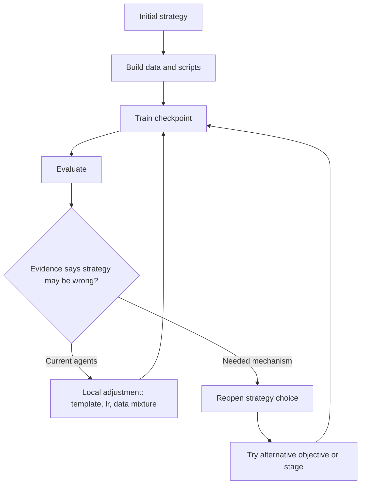

# AI 后训练 Agent 缺的不是执行力，而是中途重估策略的机制

| 项目 | 内容 |
|---|---|
| 论文 | What is Missing from AI Post-Training AI: An Empirical Analysis |
| 方向 | 大模型后训练；AI-for-AI；Agent 策略重估 |
| 官方日期 | arXiv v1：2026-08-19 16:17:39 UTC |
| 原文 | https://arxiv.org/abs/2608.19072 |
| HTML 正文 | https://arxiv.org/html/2608.19072v1 |
| 本文结论 | 论文的核心不是说 Agent 不会训练模型，而是把“会执行一条训练路线”和“会根据实验结果重估训练路线”切开：现有 Agent 能密集调参、修 bug、跑评测、提交 checkpoint，但一旦最初策略锁定，后续十小时预算大多消耗在同一策略里的局部搜索。 |

## TL;DR

- **问题**：AI-for-AI 叙事常把端到端 post-training 成功理解成闭环科研能力；论文指出这混淆了 execution-level capability 和 strategy-level capability。
- **方法**：作者分析 PostTrainBench 公开轨迹，并做受控干预；轨迹覆盖 1,338 条 agent post-training runs、7 个 benchmark、4 个 base model、20 个 agent 配置。
- **核心证据**：900 条轨迹至少启动一次模型更新，共有 5,111 次 verified training experiments；整体从 10.41% 提升到 23.0%，说明执行层面确有能力。
- **策略锁定证据**：Claude Code 轨迹中 80.7% 的可识别初始策略是 full SFT；Codex CLI 轨迹中 89.6% 是 PEFT；3,557 个相邻训练实验对里只有 74 个策略改变，比例 2.1%。
- **干预一：经验是否缺失**：实验日志、skill library、evaluator agent 能把 GSM8K 提升 +12.6 点、HumanEval 提升 +40.8 点，但 HumanEval 上 7/9 个评估周期建议 RL，主 Agent 仍只跑 14 个 SFT 变体。
- **干预二：人类指导是否缺失**：human-guided AIME run 能把初始策略从 SFT 改向 GRPO，best pass@8 到 13.33%；但训练开始后，策略又退化成 entropy/lr 等局部调整。
- **干预三：推理算力是否缺失**：experience-driven framework 消耗约 2-8 倍 token；AIME 上达到 7.9 倍 token，但一个额外题目的收益仍落在 30 题评测方差内。
- **局限**：大规模轨迹是观察性分析，不能把模型、prompt、IDE scaffold、任务差异完全随机化；受控实验每个配置 3 次独立 run，AIME 只有 30 题，作者也要求把小差异和轨迹证据一起解释。

## 研究问题：这篇论文真正切开的两个层级

### 为什么“能跑完整训练”还不等于“能做 AI R&D”？

- 作者把 LLM post-training 拆成两层：
  - **执行层**：在既定路线里做数据清洗、训练脚本、超参调整、reward shaping、checkpoint 选择、模板修复。
  - **策略层**：根据实验结果改变训练范式、数据来源或阶段结构，例如从 SFT 转到 RL，或从单阶段改成 warm-up + GRPO。
- 这一区分很关键：
  - 执行层可以靠更长上下文、日志、skill、evaluator 明显增强。
  - 策略层需要 agent 主动提出“当前路线可能错了”，并愿意把已投入的计算预算从旧路线转出来。

| 层级 | 典型动作 | 论文如何计数 | 失败后果 |
|---|---|---|---|
| Execution-level | 调学习率、改 chat template、修 dataloader、选择 checkpoint | 保持 `s=(k,d,g)` 不变 | 会在错误路线里越调越细 |
| Strategy-level | 换训练目标、换数据来源、增加/删除阶段 | `s_{i,t} != s_{i,t-1}` | 能否从失败证据中重新开题 |

### 作者反驳的默认叙事

- 默认叙事认为：
  - Agent 能写代码；
  - Agent 能启动训练；
  - Agent 能评测 checkpoint；
  - Agent 能把 base model 分数提高；
  - 所以 AI-for-AI 的闭环已经接近成立。
- 论文的反驳是：
  - 这些行为只说明 **pipeline can be executed**。
  - 它们没有证明 **strategy can be revised from evidence**。
  - 当前 agent 的闭环更像“执行修补循环”，不是“假设-实验-解释-改路线”的科研循环。

## 论文主张与论证路线

| Claim | Mechanism | Evidence | Boundary |
|---|---|---|---|
| Agent 已有后训练执行能力 | 能完成数据、训练、评测、提交 checkpoint | Table 1：1,338 条轨迹、5,111 次训练实验；整体 10.41% 到 23.0% | 分数提升不代表路线选择正确 |
| 初始策略主要反映 scaffold 默认偏好 | 不同 agent 在同一类任务上锁定不同训练范式 | Claude Code 80.7% full SFT；Codex CLI 89.6% PEFT | 观察性数据不能完全分离模型、prompt、接口影响 |
| 训练开始后策略很少改变 | 大量相邻实验仍在同一 `s=(k,d,g)` 内 | 3,557 个相邻对只有 74 个变化，2.1% | 低切换率不等于所有坚持都错 |
| 经验增强主要改善执行，不触发重估 | journal、skill、evaluator 提供证据但决定权仍在 main agent | GSM8K/HumanEval 分数上升，但 strategy suggestions 全部未形成非计划 revision | 说明缺的是 initiation，不是外部信息 |
| 人类能改变初始策略，但不能替代中途重估 | plan review 在训练前绑定策略；训练后无人继续介入 | AIME human-guided 早期达到 best，后续局部调参无法超过峰值 | 人类干预是最小计划阶段，不是持续专家控制 |
| 更多 token 有上限 | 计算花在更密集局部搜索上，而不是换路线 | AIME 7.9x tokens，约 66.7M tokens 换一个额外 solved problem | 小样本 AIME 方差大，需看轨迹行为 |

## 数据与标注：作者如何定义“策略改变”

### 轨迹语料

- 主体语料来自 PostTrainBench：
  - **1,338** 条公开 post-training 轨迹；
  - **7** 个 benchmark：AIME 2025、ArenaHardWriting、BFCL、GPQA Main、GSM8K、HealthBench、HumanEval；
  - **4** 个 base model：Gemma-3-4B-PT、Qwen3-1.7B-Base、Qwen3-4B-Base、SmolLM3-3B-Base；
  - **5** 类 agent interface：Claude Code、Codex CLI、GLM-X、OpenCode、Qwen3-Max；
  - **20** 个 agent-model 配置；
  - 每条轨迹在 **1 个 H100 80GB、10 小时预算**下产生。
- 作者强调：
  - 这是观察性语料；
  - agent、prompt、interface、benchmark 没有独立随机化；
  - 因此结论应理解为 recurring behavior，不应读成“某个模型因果导致某个策略”。

### 训练实验的计数规则

- 只有真正启动模型参数更新的命令，才算 verified training experiment。
- 不计入独立训练实验的动作：
  - 写训练脚本；
  - 准备数据；
  - 安装依赖；
  - 评测 checkpoint；
  - merge adapter；
  - 保存或导出 checkpoint。
- 这条规则让论文避免把“忙碌的工程动作”误当成训练策略搜索。

### 策略状态的公式

论文把第 `i` 条轨迹第 `t` 次训练的策略状态写成：

```math
s_{i,t}=(k_{i,t}, d_{i,t}, g_{i,t})
```

变量含义：

| 变量 | 含义 | 例子 |
|---|---|---|
| `k_{i,t}` | 训练目标或训练范式 | full SFT、PEFT、RL、DPO、distillation |
| `d_{i,t}` | 数据来源类型 | curated、self-generated、mixed |
| `g_{i,t}` | 阶段结构 | 单阶段、SFT warm-up + RL、从中间 checkpoint 新开阶段 |

训练目标可抽象为：

```math
J_{i,t}(\theta)=E_{z ~ D_{i,t}}[ l_{k_{i,t}}(\theta; z, lambda_{i,t}) ]
```

解释：

- `D_{i,t}` 是当前训练数据分布。
- `l_{k}` 是由训练策略 `k` 决定的损失函数。
- `lambda_{i,t}` 是学习率、batch size、reward 权重等其余超参。
- 如果只改 `lambda`，仍是执行层改变。
- 如果 `k/d/g` 任一维变化，才是策略层 revision。

## Figure 1：主证据图在讲什么


### 图的作用

- Figure 1 不是只展示分数曲线。
- 它把两个现象放在同一张图里：
  - agent 能完成一串 post-training pipeline；
  - 但训练策略很早收敛到少量固定选择，之后大多只在局部变体里移动。

### 这张图支撑的 claim

- 如果后续 iteration 真的在做开放式策略搜索，应该看到：
  - 路线被失败证据打断；
  - objective family 或 data regime 被替换；
  - early wrong choice 被系统性纠正。
- 但图中“星号附近快速平台化 + 同类策略密集重复”的形态更接近：
  - 初始策略决定上限；
  - 后续预算用于挤出局部收益；
  - 多数失败没有触发“另起炉灶”。

## 主结果一：Agent 是合格执行者

### Table 1 的执行层证据

| Benchmark | # Trajectory | # Training | # Final Checkpoint | Observed performance gain |
|---|---:|---:|---:|---|
| AIME 2025 | 191 | 646 | 163 | 0.0% -> 1.4% |
| ArenaHardWriting | 193 | 713 | 153 | 0.0% -> 2.6% |
| BFCL | 191 | 703 | 154 | 17.5% -> 42.5% |
| GPQA Main | 191 | 777 | 153 | 8.9% -> 17.5% |
| GSM8K | 191 | 817 | 163 | 24.5% -> 44.0% |
| HealthBench | 191 | 631 | 155 | 0.0% -> 11.6% |
| HumanEval | 190 | 824 | 163 | 22.0% -> 41.4% |
| Overall | 1,338 | 5,111 | 1,104 | 10.41% -> 23.0% |

### 这里不能被误读

- 表格证明的是：
  - agent 大量启动真实训练；
  - checkpoint 有效提交比例不低；
  - 多数 benchmark 能获得可观增益。
- 表格没有证明的是：
  - agent 能判断初始策略是否错误；
  - agent 能把失败证据转化成策略转换；
  - agent 已经具备自动科研闭环。

## 主结果二：策略锁定是 scaffold-specific 的

### Table 2 的默认策略对比

| Agent | 默认策略 | 策略改变 |
|---|---|---|
| Claude (463) | Full SFT：163/202，80.7% | 53/1,132，4.7% |
| Codex (369) | PEFT：268/299，89.6% | 15/943，1.6% |
| GLM-X (84) | PEFT：2/3，66.7% | 1/3，33.3% |
| OpenCode (394) | Full SFT：181/273，66.3% | 5/1,411，0.4% |
| Qwen3Max (28) | PEFT：5/6，83.3% | 0/68，0.0% |

### 为什么这不是“策略偏好合理”就能解释

- 如果策略来自 task evidence，应看到：
  - 同一个 benchmark 上，不同 agent 根据数据收敛到相近策略；
  - 同一个 agent 在不同 benchmark 上，根据任务切换策略。
- 论文观察到的是相反模式：
  - Claude Code 更常 full SFT；
  - Codex CLI 更常 PEFT；
  - 同一任务上的策略差异仍强烈随 interface/scaffold 变化。
- 因此作者把它解释为：
  - 初始策略更像 agent 先验；
  - 不是由训练中证据逐步选择出来。

## 干预一：给经验，为什么还是不够

### Experience-driven framework 的三件套


| 组件 | 提供什么 | 希望修复什么 |
|---|---|---|
| Experiment journal | append-only plans、observations、eval results、lessons | 防止长程上下文里忘掉早期失败 |
| Skill library | 从 verl、TRL、OpenRLHF、NeMo-RL、slime 等文档压缩出的训练经验 | 补足具体训练工程知识 |
| Evaluator agent | 独立评测 checkpoint，给诊断和下一步建议 | 把低信噪比评测输出转成决策建议 |

### 受控实验设置

- base model：Qwen3-1.7B-Base。
- benchmark：GSM8K、HumanEval、AIME 2025。
- autonomous baselines：
  - Claude Code + Opus 4.6；
  - Claude Code + GLM-5.2；
  - Codex CLI + GPT-5.2。
- 干预统一基于 Claude Code + Opus 4.6。
- 每个配置：
  - 3 次独立 run；
  - 10 小时预算；
  - 4 张 A800；
  - system prompt、base model、评测协议在比较内固定。

### 经验确实提高执行结果

| Setting | GSM8K | HumanEval | AIME 2025 |
|---|---:|---:|---:|
| Base model | 10.84% | 5.48% | 0.00% |
| Opus 4.6 autonomous | 64.70% ± 9.6 | 22.00% ± 10.4 | 3.33% ± 0.0 |
| Experience-driven Opus 4.6 | 77.30% ± 3.8 | 62.80% ± 6.1 | 5.56% ± 1.57 |

关键数字：

- GSM8K：experience-driven 比 Opus autonomous 高 **12.6** 点。
- HumanEval：高 **40.8** 点。
- AIME：从 3.33% 到 5.56%，但作者提示 AIME 30 题评测方差很大。

### 为什么策略层仍没动

- HumanEval：
  - evaluator 在 7/9 个 evaluation cycles 建议转向带 code-execution reward 的 RL；
  - main agent 写了 GRPO 脚本；
  - 但真实训练中仍启动 14 个 SFT variants，没有启动 RL。
- AIME 2025：
  - evaluator 多次建议做 SFT warm-up；
  - main agent 继续 GRPO-only。
- Skill library：
  - GSM8K 平均 consult 18 次；
  - HumanEval 平均 consult 20 次；
  - AIME 平均 consult 60 次；
  - 但没有任何 run 创建新 skill，即使存在 create-skill meta-skill。

### 机制判断

- 经验框架提升了 **information density**。
- 它让 agent 更清楚：
  - 哪个 checkpoint 坏；
  - 哪个格式错；
  - 哪个 SFT 已平台化；
  - 哪个 reward 需要修。
- 但它没有给 agent 一个强制机制去问：
  - “当前训练范式本身是否该废弃？”
  - “如果 evaluator 反复建议换 objective，我必须至少执行一次对照实验吗？”

## 干预二：给人类策略指导，为什么也只解决开局

### Human guidance 做了什么

- 任务：AIME 2025。
- 阶段：只在训练前做 plan review。
- 过程：
  - Agent 初始提出 SFT pipeline；
  - 人类要求修订：SFT 只能做 formatting warm-up，主预算应给 RL；
  - Agent 修订为小规模 warm-up + GRPO；
  - 训练开始后完全自主执行。

### 结果

- human-guided setting 的 best submitted checkpoint：
  - AIME pass@8 达到 **13.33%**。
- 这强于：
  - base model；
  - autonomous baseline；
  - experience-driven framework。
- 但作者强调：
  - AIME 只有 30 题；
  - 一个题目的差异就是 3.33 个百分点；
  - 因此更强证据不是单个分数，而是 agent 确实能理解和执行不同于默认路线的策略。

### 关键失败

- 训练开始后：
  - agent 很早达到 best intermediate checkpoint；
  - 后续版本大多退化到 0；
  - agent 没有恢复 best checkpoint；
  - 也没有把退化视为重新考虑训练策略的触发器。
- 这说明：
  - Agent 不是完全不会执行策略层计划；
  - 它缺的是在运行中主动重新打开策略选择的触发机制。

## 干预三：给更多 token，为什么上限明显

### Compute scaling 的实验证据

- Experience-driven framework 同时也是 compute-scaled condition：
  - 它有更多 evaluator 轮次；
  - 更长上下文；
  - 更高 token 消耗；
  - 更多诊断文本。
- 结果呈现任务差异：
  - GSM8K 和 HumanEval：更多诊断和评测能带来较大收益。
  - AIME：收益很快变平。

### AIME 的关键数字

- 在 AIME 2025 上：
  - experience-driven framework 消耗约 **7.9 倍** baseline tokens；
  - 约 **66.7M tokens** 才换来 best run 中一个额外 solved problem；
  - 这个差异仍在 30 题评测方差解释范围内。

### 解释

- 更多 token 不是没用。
- 它会带来：
  - 更细的错误诊断；
  - 更多 checkpoint 对比；
  - 更密集的超参尝试；
  - 更稳定的格式修复。
- 但如果当前任务真正需要换策略，更多 token 只会让 agent 在旧策略里搜索得更细。

## Figure 7：局部闭环与全局线性


### 这张图是全文的概念压缩

- 理想 AI R&D loop：
  - propose hypothesis；
  - run experiment；
  - interpret result；
  - revise approach；
  - try again。
- 论文观察到的 loop：
  - train；
  - eval；
  - debug；
  - tweak；
  - train again。
- 差别不在是否有循环。
- 差别在循环发生的位置：
  - execution loop 关闭；
  - strategy loop 打开。



## 失败案例与边界

### 失败不是“不知道”

- HumanEval 中：
  - evaluator 明确提出 RL with code-execution reward；
  - journal 记录 SFT plateau；
  - main agent 甚至写了 GRPO script；
  - 但实际训练仍不启动 RL。
- AIME 中：
  - evaluator 多次提 SFT warm-up；
  - agent 继续 GRPO-only；
  - entropy coefficient 和 learning rate 被反复局部搜索。

这类失败说明：

- 信息进入了系统。
- 工具也具备。
- 缺的是把信息转成 **必须测试替代策略** 的控制律。

## 方法细读：为什么作者坚持“执行”和“策略”要分开标注

### 如果不分层，会得到什么错误结论？

- 只看训练次数，会把 agent 判成很勤奋：
  - 它反复构造数据；
  - 反复启动训练；
  - 反复合并 adapter；
  - 反复跑小样本评测。
- 只看最终分数，会把 agent 判成有进步：
  - BFCL 从 17.5% 到 42.5%；
  - GSM8K 从 24.5% 到 44.0%；
  - HumanEval 从 22.0% 到 41.4%。
- 但这些指标都没有回答：
  - agent 是否知道为什么当前策略有效；
  - agent 是否在失败后比较过其他策略；
  - agent 是否把“训练路线”本身当成可修改对象。

### 作者的标注协议有什么研究价值？

- 它把一个长程 agent run 拆成三类证据：
  - **命令证据**：哪些 shell/training command 真正启动了参数更新；
  - **状态证据**：每次参数更新对应的 `k,d,g`；
  - **相邻转移证据**：两个训练实验之间是否改变了任何策略维度。
- 这比“agent 写了什么计划”更严格：
  - 计划里写 RL，不代表启动了 RL；
  - 写了 GRPO script，不代表训练过 GRPO；
  - evaluator 建议换目标，不代表 main agent 执行了换目标。
- 因此论文真正审计的是 **executed strategy**，不是 **stated intention**。

### 这对 agent 评测有什么影响？

| 常见评测信号 | 为什么不够 | 论文建议看的信号 |
|---|---|---|
| 最终分数 | 可能来自错误策略里的局部修补 | 失败证据后是否发生 `s` 的变化 |
| 训练次数 | 可能只是重复同一 objective | 相邻训练对的 strategy change rate |
| 工具调用数量 | 可能说明执行繁忙，不说明决策质量 | evaluator 建议是否转成 executed experiment |
| 长上下文记忆 | 可能只被读取，不被用于重估 | journal lesson 是否触发新策略 |
| 计划文本 | 可能和实际训练命令不一致 | 训练命令、loss、adapter/全参路径、checkpoint lineage |

## 受控实验的三层因果链

### 第一层：经验框架提升了 pipeline 质量

- GSM8K 和 HumanEval 的提升不是偶然的“多试几次”：
  - journal 保留先前失败；
  - skill library 提供训练工程常识；
  - evaluator 把评测输出压缩成下一步建议。
- 这些机制特别适合 execution-level failure：
  - prompt contract 不一致；
  - EOS 处理错误；
  - 训练数据格式不匹配；
  - 小样本评测高估 checkpoint；
  - checkpoint merge 或 export 出错。
- 所以 HumanEval 的大幅提升可以解释为：
  - coding benchmark 对格式和评测协议敏感；
  - evaluator 更容易发现“代码执行奖励”或模板问题；
  - execution fixes 直接影响 pass@1。

### 第二层：策略建议进入上下文，但没有获得行动优先级

- 论文里最关键的反常现象是：
  - evaluator 的 strategy-level 建议数量不为零；
  - main agent 对 execution-level 建议很愿意行动；
  - 但 strategy-level 建议几乎不变成 unplanned revision。
- 这说明 agent 的决策偏好可能有隐含 inertia：
  - 当前脚本已经写好；
  - 当前 checkpoint 已经产生；
  - 当前日志围绕同一目标展开；
  - 继续调参的短期成本低于切换路线。
- 因此，长程 agent 的“沉没成本”不一定是人类心理偏差，也可能是系统结构偏差：
  - 工具状态围绕当前路线堆积；
  - 上下文最新内容多是当前路线的错误；
  - task progress 叙事鼓励“继续完成”而非“推翻路线”。

### 第三层：策略重估需要被设计成显式决策点

- 论文结论可以被转写成一个控制问题：
  - 什么时候必须暂停执行；
  - 哪些证据足以触发策略 review；
  - review 后是否必须运行最小替代实验；
  - 替代实验的预算如何从总预算里预留。
- 如果没有这些机制，agent 会自然选择最便宜的局部动作：
  - 改 learning rate；
  - 改 data mixture；
  - 改 prompt template；
  - 重跑相邻 checkpoint。
- 这些动作并非无用。
- 问题是它们可能遮蔽真正需要回答的问题：
  - 当前 objective 是否错了？
  - 当前 data source 是否错了？
  - 当前 stage structure 是否缺一段 warm-up 或 RL？

## 伪代码：把论文发现写成一个 agent 控制器缺口

```text
Input:
  task T, budget B, base model M0
State:
  strategy s=(k,d,g)
  evidence log E
  checkpoints C
  evaluator suggestions Q

Loop until budget exhausted:
  run one execution-level experiment under s
  append metrics, failures, and evaluator suggestions into E

  if suggestion is execution-level:
      apply local repair or hyperparameter update
      continue

  if suggestion is strategy-level:
      current agents often:
          record suggestion
          continue local search under s

      needed mechanism:
          pause execution
          estimate switch cost and evidence strength
          allocate minimal counterfactual experiment for s'
          compare s and s' under same evaluation protocol
          either adopt s' or document why not

Output:
  final checkpoint, chosen strategy, rejected strategies, evidence trail
```

### 伪代码暴露的失败边界

- 失败不在 `run one experiment`。
- 失败也不在 `append evidence`。
- 失败在 `if suggestion is strategy-level` 之后：
  - 现有 agent 把它当普通文本；
  - 理想控制器应把它当 workflow state transition。
- 这就是论文说的 missing spontaneity：
  - 不缺能力执行替代策略；
  - 缺触发替代策略的行动制度。

## Figure 和 Table 的逐项证据定位

| 图表 | 支撑什么 | 不能证明什么 |
|---|---|---|
| Figure 1 | 策略早期锁定、分数平台化、后续局部搜索 | 不能单独说明锁定一定错误 |
| Table 1 | agent 有大量执行层能力和分数提升 | 不能说明 AI R&D 闭环已闭合 |
| Table 2 | 不同 agent 有稳定默认策略偏好 | 不能把偏好完全归因于模型本身 |
| Table 3 | experience-driven framework 提高 GSM8K/HumanEval | 不能证明经验会触发策略 revision |
| Figure 5 | human guidance 能改变初始路线 | AIME 小样本下不能只靠 13.33% 排序 |
| Figure 6 | 更多 token 对容易任务有效，对 AIME 收益有限 | 不能说明所有 compute scaling 都无用 |
| Figure 7 | 全局策略 loop 与局部执行 loop 的差异 | 是概念图，不是额外实验 |
| Table 10 | evaluator 给过策略建议，但 unplanned revision 为 0 | 只抽取代表性轨迹，不是全语料计数 |

## 更尖锐的研究问题

### 问题一：策略重估能否作为 reward 被学习？

- 可以把策略切换看成一个昂贵动作：
  - 成本：训练预算、工程切换、评测方差；
  - 收益：逃离错误 objective 或错误数据源；
  - 风险：切换到更差路线。
- 一个合理 reward 不能鼓励频繁切换。
- 它应该奖励：
  - 在负证据充分时提出替代；
  - 用小预算验证替代；
  - 在替代失败时明确保留原策略；
  - 在替代成功时及时迁移预算。

### 问题二：evaluator 建议何时应该 binding？

- 论文里的 evaluator 是 advisory：
  - 它能建议；
  - 不能暂停 main agent；
  - 不能强制开最小对照实验。
- 下一步系统可以引入 escalation：
  - evaluator 连续两次提出同类 strategy advice；
  - journal 记录同一策略 plateau；
  - 当前 checkpoint 多次退化；
  - 则 main agent 必须产出 strategy-review artifact。
- 这个 artifact 不应只是文字反思。
- 它至少要包含：
  - 当前策略；
  - 替代策略；
  - 最小实验预算；
  - 接受/拒绝标准；
  - 如果拒绝，明确证据。

### 问题三：长程上下文是否天然偏向局部执行？

- 长程 agent run 的上下文往往被近期日志淹没：
  - 当前脚本错误；
  - 当前 checkpoint 路径；
  - 当前 eval trace；
  - 当前 GPU job 状态。
- 这些信息会把模型注意力拉向“把眼前的东西修好”。
- 因此策略重估可能需要独立上下文：
  - 摘掉当前执行细节；
  - 只保留路线级 evidence；
  - 用对照表比较 `s` 与候选 `s'`；
  - 再把结论写回执行线程。

### 失败也不是“频繁切换才对”

- Appendix A.4 审计了 16 条 objective-family change 轨迹。
- 结果很谨慎：
  - 有些策略切换带来收益；
  - 有些切换导致退化；
  - 许多切换后来又回到 SFT。
- 因此论文不是主张“多切换一定好”。
- 论文主张的是：
  - agent 需要 evidence-based testing and selection；
  - 能判断何时值得支付切换成本；
  - 不能把初始选择默认当成不可重开的承诺。

## 相关工作位置：它接在 AutoTrainess 之后问了更尖的问题

### 与 PostTrainBench / AutoTrainess 的关系

- PostTrainBench 提供任务和公开轨迹基础。
- AutoTrainess 证明：
  - 更好的训练接口、日志、评测、数据处理模块能显著提升自主后训练可靠性。
- 本文继续追问：
  - 当接口和经验都增强后，agent 是否会改变策略？
  - 如果 evaluator 给出策略建议，main agent 是否会执行？
  - 如果人类改了初始计划，agent 是否能在中途继续重估？

### 与 memory/skill agent 的关系

- 论文把 memory、skill、reflection、evaluator 都当成可测试的外部经验机制。
- 结论不是否定这些机制。
- 更精确地说：
  - 它们能提高执行层质量；
  - 但如果没有把“策略重估”变成显式行动空间或奖励目标，它们不会自动产生策略层主动性。

## 研究者视角的结论与继续追问

### 最值得带走的判断

- **AI 后训练 Agent 的瓶颈不只是工具接口，而是承诺管理。**
- 一旦 agent 在早期选择了 full SFT、PEFT 或 GRPO，它会把大量后续证据解释成“如何把这条路跑好”。
- 对复杂后训练任务来说，真正稀缺的能力是：
  - 承认当前路线可能错；
  - 把替代策略变成真实训练实验；
  - 用成本、方差、失败风险来决定是否切换；
  - 在长程上下文中保留“全局路线选择”这个决策变量。

### 对后训练研究的启发

- 未来 benchmark 不应只问：
  - 是否提交了更好 checkpoint；
  - 是否跑通训练 pipeline；
  - 是否修复了评测脚本。
- 还应显式评测：
  - 是否在失败证据后提出替代 objective；
  - 是否执行最小对照训练；
  - 是否从 evaluator/human feedback 中区分 execution advice 和 strategy advice；
  - 是否能在成本受限时恢复早期 best checkpoint，而不是继续推进退化分支。

### 对 Agent 安全的延伸问题

- 策略锁定也可能是安全问题：
  - 如果 agent 早期选择了不安全的数据处理路线，它可能把后续 warnings 当作局部 bug 修复；
  - 如果 evaluator 建议更安全的训练范式，但 main agent 不触发切换，外部安全信号会被消化成无效文本；
  - 如果更多 token 只放大局部执行，安全审查不能只靠“让模型想更久”。
- 更合理的安全控制应包括：
  - 强制 strategy-review checkpoints；
  - evaluator 建议的 binding escalation；
  - 替代策略最小实验预算；
  - 对“拒绝重估”的行为日志审计。

### 证据边界

- 大规模部分是观察性分析：
  - 强在样本大、轨迹细、任务多；
  - 弱在不能随机分离模型、scaffold、prompt、接口。
- 受控实验部分：
  - 强在 base model、硬件、任务、系统 prompt 更可比；
  - 弱在每配置 3 次 run，AIME 小样本高方差。
- 写作时还要保留一个边界：
  - 这篇论文不是在否定自主后训练；
  - 它是在提醒研究者，不要把“会继续执行”误读成“会重新判断”。
- 因此最稳健的结论是机制性而非排行榜式：
  - 现有 agent 已能做大量后训练执行；
  - 但从证据中主动重开策略选择仍是未解决机制。
