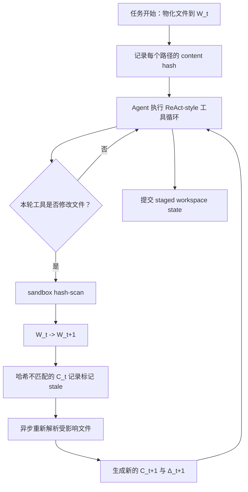

# StagedWorkspace：把知识工作 Agent 的“搜索、编辑、提交”绑到同一个工作区版本

## 元信息

| 字段 | 内容 |
| --- | --- |
| 论文 | StagedWorkspace: A Versioned Workspace for Knowledge-Work Agents |
| 作者 | Yining Hua, Hongbin Na, Yifan Zhou, Akshay Kalose, Cyrus Ayubcha, Levi Lian |
| 方向 | 大模型 Agent、知识工作 Agent、版本化工作区、artifact-state contract |
| 官方日期 | arXiv 显示 Submitted on 18 Aug 2026；submission history 为 v1 Tue, 18 Aug 2026 17:44:18 UTC |
| 原文 | https://arxiv.org/abs/2608.18050 |
| 正文与源码 | https://arxiv.org/html/2608.18050 ，https://arxiv.org/e-print/2608.18050 |

## TL;DR

- 这篇论文关心的不是“Agent 会不会调用更多工具”，而是一个更基础的问题：Agent 搜索到的解析文本、实际编辑的原生文件、最终审查的 diff、提交给评测器的成果，是否指向同一个工作区版本。
- 作者把这个问题定义为 **workspace-state contract**：每一种视图都必须显式绑定到不断演化的工作区状态，否则 Agent 可能在旧解析缓存中找证据，在新文件中编辑，又把另一份结果提交出去。
- StagedWorkspace 的机制由三部分组成：原生文件树 `W_t`、带路径和内容哈希的解析缓存 `C_t`、从初始状态到当前状态的审查 diff `Δ_t`；变更后通过哈希同步把 stale 解析结果标出来。
- 实验用两个知识工作 benchmark：OfficeQA Pro 覆盖约 697 个美国财政部公告 PDF、133 个问答；APEX-Agents 覆盖 33 个 professional worlds、480 个任务，本研究排除 28 个需要外部 EDGAR API 的任务后评测 452 个。
- 读轴消融显示 dual parsed/native access 在所有测试模型上取得最高点估计：OfficeQA 相对 artifact-only 提升 8.3 到 12.1 个 Pass@1 点；APEX 相对 parsed-only 提升 4.7 到 9.2 个 mean rubric-score 点。
- 完整系统对比中，SW-Agent 在 OfficeQA 上用 Gemini 3.1 Pro 得到 63.9%，而公开同模型 Full parsed row 为 29.3%；在 APEX 上用 GPT-5.4 Nano 得到 42.1 mean score，而公开同模型 row 为 25.5。
- review-axis 消融只在 APEX 的 57 个文件编辑任务上做，diff 可见让三个模型分数分别提高 2.5、8.5、3.8 点；这说明可审查变更是辅助机制，不是全部性能来源。
- 局限也很明确：公开 leaderboard 对比不是严格因果实验，parser/retriever 没有单独分离，APEX 仍有 188/452 个 all-arm-zero 任务，说明工作区同步不能替代规划、领域推理和任务验证。

## 研究问题：为什么“同一个文件”在 Agent 系统里会变成多个状态

### 1. 论文先把知识工作 Agent 的失败重新命名

- 许多 Agent benchmark 已经不再是纯文本问答：
  - coding agent 要修改代码仓库；
  - office agent 要读 PDF、表格、幻灯片；
  - workplace agent 要交付 memo、spreadsheet 或 deck；
  - research agent 要把证据、分析和最终报告连起来。
- 作者把这些任务统称为 **knowledge work**：
  - 目标不是一次性回答，而是生产或修改持久化 artifact；
  - 评分对象通常是最终 work product；
  - 中间过程包含检索、阅读、编辑、检查、提交。

### 2. 真正的问题不是缺工具，而是缺状态契约

- 如果一个系统只给 Agent 解析文本，Agent 会有搜索能力，但可能失去：
  - PDF 版式；
  - 表格合并单元格；
  - spreadsheet 公式；
  - slide 中的视觉层级；
  - notebook 或 office 文件的可执行性。
- 如果系统只给 Agent 原生文件，Agent 能执行和提交，但经常要：
  - 手动翻页；
  - 对 PDF 字节做低效 `grep`；
  - 在大文件夹中反复定位；
  - 把上下文预算浪费在不相关页面。
- 如果系统有可变工作区但没有版本化 review，Agent 又会遇到：
  - 覆盖、移动、删除文件后缺少可复查 diff；
  - 解析缓存仍指向旧内容；
  - 最终提交状态与推理证据不一致。

### 3. 论文的核心定义

> 简短说，StagedWorkspace 要求所有视图都能回答同一个问题：你看到的是工作区的哪一个版本？

用作者的形式化变量可以写成：

```text
W_t      = 当前原生工作区文件
C_t      = 带 source path 与 content hash 的解析记录
Δ_t      = 从初始工作区 W_0 到当前工作区 W_t 的变更 diff
```

它的论证重点是：

- `W_t` 是提交和执行的权威状态；
- `C_t` 是派生的搜索层，不是另一个独立文档副本；
- `Δ_t` 是审查层，用来回答“当前会交出去的东西相对初始状态改了什么”；
- 当 `W_t` 变化后，`C_t` 中哈希不匹配的记录必须被标记为 stale，直到重新解析完成。

## 论文主张与论证路线

| Claim | Mechanism | Evidence | Boundary |
| --- | --- | --- | --- |
| 知识工作 Agent 需要显式 workspace-state contract | 把原生文件、解析缓存、审查 diff 都绑定到同一版本化状态 | 论文从 OfficeQA、APEX、workspace-bench 等任务形态说明多格式 artifact 已成为 Agent 交付对象 | 这是系统抽象，不直接证明模型推理能力提升 |
| dual parsed/native access 比单一视图更稳 | 解析层负责定位证据，原生层负责版式、公式、执行和提交 | OfficeQA 中 dual 相对 artifact-only 提升 8.3 到 12.1 Pass@1 点；APEX 中 dual 相对 parsed-only 提升 4.7 到 9.2 mean-score 点 | parser 和 retriever 固定，尚未分离两者对结果的贡献 |
| 哈希同步能减少“旧证据，新提交”的状态漂移 | 每个解析记录带 source path 与 content hash，变更后只刷新受影响文件 | 论文用预算表单元格 B12 的例子说明旧解析值会被标 stale | 实验没有单独给出 stale 检测准确率，只通过端到端任务间接验证 |
| 可见 diff 是编辑任务的辅助机制 | `workspace_diff` 与 `workspace_file_diff` 显示当前提交状态的变更 | APEX 57 个文件编辑任务中，diff visible 比 hidden 高 2.5 到 8.5 分 | 子集只占约 12%，不能解释全部 benchmark 提升 |
| 工作区同步不能解决所有失败 | 同步只处理状态一致性，不替代规划、计算和领域判断 | APEX 仍有 188/452 个 all-arm-zero 任务 | 这些残差失败需要任务级验证器、领域工具或更强策略 |

## 方法机制：StagedWorkspace 到底把什么同步了

### 1. 三个视图的职责边界

| 视图 | 作用 | Agent 依赖它做什么 | 容易出错的地方 |
| --- | --- | --- | --- |
| `W_t` 原生工作区 | 权威文件树 | 打开 PDF、运行 spreadsheet、修改 deck、提交结果 | 如果没有搜索层，定位证据很慢 |
| `C_t` 解析缓存 | 搜索与证据定位 | `grep`、semantic search、页面级阅读、表格定位 | 如果不绑定哈希，就可能读到旧版本 |
| `Δ_t` 审查 diff | 变更解释与提交前检查 | 看哪些文件、单元格、幻灯片或文本行被改了 | 如果不可见，Agent 很难发现误改或漏改 |

### 2. 读写循环不是抽象口号，而是一个具体状态机



- 这里的关键不是“Agent 有 sandbox”，而是 sandbox 变更会推进工作区版本。
- 解析缓存不是一次性 ingest 后永远有效；它必须能解释自己来自哪个源文件哈希。
- diff 也不是额外日志；它是从 `W_0` 到当前 `W_t` 的可见审查面。

### 3. 同步公式的含义

论文给出的更新可以写成：

```text
W_t -> W_{t+1}
C_{t+1} = sync(C_t, W_{t+1})
Δ_{t+1} = δ(W_0, W_{t+1})
```

变量解释：

- `W_t -> W_{t+1}`：某个工具批次之后，原生文件状态发生变化。
- `sync(C_t, W_{t+1})`：检查解析缓存对应的 source hash 是否仍匹配新文件。
- `δ(W_0, W_{t+1})`：把初始文件树和当前文件树做差，形成 review surface。
- `stale`：如果解析记录的哈希和当前文件不一致，它不能再被当成当前证据。

这个公式的研究意义在于：

- 许多 Agent 论文把 retrieval、tool use、submission 分开描述；
- StagedWorkspace 把它们放回同一个状态演化过程；
- 因而可以把“工作区状态是否一致”变成可消融变量。

## 算法流程：从 artifact 进入 Agent 工具面

### 1. 可读伪代码

```text
Input:
  task prompt P
  initial files F_0
  parser R
  grader or reviewer G
  tool budget B

State:
  W_0 = materialize(F_0)
  C_0 = parse_and_index(W_0, R)
  Δ_0 = empty diff
  t = 0

Loop:
  while budget remains and no submission:
    hydrate sandbox from W_t
    agent observes parsed search, native files, and optional diff
    agent calls tools to read, compute, edit, or submit

    if tool batch mutates files:
      W_{t+1} = hash_scan_and_promote_changed_files()
      C_{t+1} = mark_stale_records(C_t, changed_hashes)
      C_{t+1} = refresh_changed_files_when_parser_finishes()
      Δ_{t+1} = diff(W_0, W_{t+1})
      t = t + 1

Output:
  final answer or materialized deliverable from W_t

Failure boundaries:
  if parser loses table semantics, C_t may point to weak evidence
  if task needs domain reasoning, synchronized state still may not solve it
  if diff is visible but semantic checks are absent, Agent can still approve wrong edits
```

### 2. 工具路由与三种消融 arm

| 工具/能力 | Dual | Artifact-only | Parsed-only |
| --- | --- | --- | --- |
| 文本 `view` | 解析页，带 freshness metadata | `pdftotext` 或 Office fallback | 解析页 |
| 视觉 `view` | 原生渲染 | 原生渲染 | 不可用 |
| `grep` / file search | 解析页定位符 | 原始路径，PDF 中经常弱 | 解析页定位符 |
| vector search | 页面 chunk embedding | 禁用 | 页面 chunk embedding |
| `python` / `bash` | 操作原生文件和交付物 | 操作原生文件和交付物 | 不能操作原生交付物 |
| diff review | 可见或在 review-axis 中隐藏 | 仍可跟踪文件，但读轴只改视图 | 仍依赖解析状态 |

这个表解释了为什么两个 benchmark 的结果方向不同：

- OfficeQA 主要是从大量 PDF 里找表格和数值，解析搜索是主负载；
- APEX 要在 mixed-format folder 中交付文件，原生执行是主负载；
- dual 不是简单加工具，而是让“找到的证据”和“被提交的文件”处在同一状态。

## 实验设置：两个 benchmark 对应两种知识工作负载

### 1. OfficeQA Pro

| 项目 | 设置 |
| --- | --- |
| 任务类型 | grounded numerical QA |
| 文件形态 | 美国财政部 Treasury Bulletin PDF |
| 规模 | 约 697 个 PDF，133 个问题，其中 104 个文档内问题、29 个需要 live web evidence |
| 主要指标 | exact-match Pass@1 |
| 关键压力 | 大规模 PDF 检索、表格定位、数值读取、来源选择 |

OfficeQA 的实验价值是：

- 它能把 parsed search 的作用放大；
- 它要求 Agent 找到正确来源，而不是只读给定文件；
- 它的主要失败通常来自“找错表”“读错表格区域”“算错数值”。

### 2. APEX-Agents

| 项目 | 设置 |
| --- | --- |
| 任务类型 | professional work deliverable |
| 领域 | Management Consulting、Investment Banking、Law |
| 规模 | 原 benchmark 480 个任务；本文排除 28 个需外部 EDGAR API 的任务后评测 452 个 |
| 文件形态 | 每个任务文件夹平均约 166 个 mixed-format files |
| 主要指标 | task pass rate 与 mean rubric score |
| 关键压力 | 多文件证据定位、spreadsheet/document/slide 执行、最终交付物评分 |

APEX 的实验价值是：

- 它能把 native execution 的作用放大；
- parsed-only 可以找到说明，但不能可靠操作最终文件；
- artifact-only 可以编辑文件，但常在大文件夹里定位不到证据。

### 3. 控制变量

作者强调机制消融固定了这些变量：

- 模型；
- prompt；
- parser；
- retriever；
- grader；
- file tracker；
- 250 次 tool-call budget；
- benchmark 任务池与评分协议。

因此 read-axis 消融更像“同一系统拿掉某个工作区视图”，而不是换一套 Agent。

## 主结果：dual view 的提升在哪里最大

### 1. OfficeQA Pro：dual 相对 artifact-only 的收益最大

| 模型 | Dual Pass@1 | Artifact-only | Parsed-only | Dual vs artifact-only | Dual vs parsed-only |
| --- | ---: | ---: | ---: | ---: | ---: |
| GPT-5.4 | 64.7 ± 8.3 | 52.6 ± 8.7 | 58.6 ± 8.3 | +12.1 | +6.1 |
| Gemini 3 Flash | 57.8 ± 8.6 | 47.7 ± 8.7 | 53.8 ± 8.5 | +10.1 | +4.0 |
| Gemini 3.1 Pro | 63.9 ± 7.9 | 55.6 ± 8.3 | 54.9 ± 8.3 | +8.3 | +9.0 |

解释：

- OfficeQA 的任务目标是“在大 PDF 档案中找到正确数值并回答”；
- artifact-only 虽然保留 PDF 原件，但 Agent 需要自己翻找；
- parsed-only 已经接近 dual，说明搜索层是主要机制；
- dual 仍有额外收益，因为部分页面、表格、版式和 fallback 仍需要原生视图。

### 2. APEX-Agents：dual 相对 parsed-only 的收益最大

| 模型 | Dual mean rubric | Artifact-only | Parsed-only | Dual vs artifact-only | Dual vs parsed-only |
| --- | ---: | ---: | ---: | ---: | ---: |
| Gemini 3 Flash High | 47.8 ± 2.4 | 43.8 ± 4.1 | 43.1 ± 4.4 | +4.0 | +4.7 |
| GPT-5.4 Mini xHigh | 44.3 ± 4.4 | 40.3 ± 4.4 | 38.8 ± 4.0 | +4.0 | +5.5 |
| GPT-5.4 Nano xHigh | 42.1 ± 4.1 | 41.1 ± 4.4 | 32.9 ± 5.2 | +1.0 | +9.2 |

解释：

- APEX 要求最终 deliverable 被评分；
- parsed-only 能读到说明，但不能可靠运行 workbook、修改 deck 或生成文件；
- artifact-only 与 dual 的差距较小，说明原生执行在 APEX 中非常重要；
- GPT-5.4 Nano 从 parsed-only 到 dual 的 +9.2 分尤其说明小模型更依赖工作区契约降低操作负担。

### 3. 公开 leaderboard 对比只能辅助定位

| Benchmark | 对比 | 公开行 | SW-Agent dual |
| --- | --- | ---: | ---: |
| OfficeQA Pro | Gemini 3.1 Pro Full parsed row | 29.3% | 63.9% |
| OfficeQA Pro | GPT-5.4 best Full row | 56.4% | 64.7% |
| APEX-Agents | GPT-5.4 Nano mean score | 25.5 | 42.1 |
| APEX-Agents | Gemini 3 Flash mean score | 39.5 | 47.8 |

这部分不能当作严格因果证据，因为公开行和 SW-Agent 的 harness、attempt budget、parser、retriever 都可能不同。论文的可靠论证来自上一节的 fixed-harness paired ablation。

## 消融与失败：哪些结论能站住，哪些不能

### 1. paired 显著性不是所有格子都强

| 场景 | 论文报告的信号 | 解读 |
| --- | --- | --- |
| OfficeQA dual vs artifact-only | GPT-5.4 与 Gemini 3 Flash 的 McNemar p 分别为 0.009、0.017；bootstrap 也低于 0.05 | 搜索层对读密集任务是强机制 |
| OfficeQA dual vs parsed-only | Gemini 3.1 Pro 的离散检查 p=0.029 | 原生视图在部分表格/版式任务中仍有价值 |
| APEX dual vs parsed-only | Gemini 3 Flash 与 GPT-5.4 Nano 的离散检查 p 分别为 0.046、0.029；bootstrap 对三个模型均低于 0.05 | 原生执行对交付型任务是强机制 |
| APEX dual vs artifact-only | p 值未低于 0.05 | 证据定位有帮助，但在这个任务池里未形成同等强度统计分离 |

### 2. review-axis 消融只证明“提交前审查有用”

| 模型 | Diffs hidden | Diffs visible | Lift |
| --- | ---: | ---: | ---: |
| Gemini 3 Flash High | 47.6 | 50.2 | +2.5 |
| GPT-5.4 Mini xHigh | 40.9 | 49.4 | +8.5 |
| GPT-5.4 Nano xHigh | 48.1 | 51.9 | +3.8 |

这个结果说明：

- diff 可见能帮助 Agent 在提交前发现不一致；
- GPT-5.4 Mini 的提升最大，可能因为中等能力模型最受益于紧凑审查面；
- 但任务数只有 57 个，且只覆盖文件编辑子集；
- diff 只能告诉模型“改了什么”，不能自动证明“改得对不对”。

### 3. 残差失败很大

| APEX 域 | 评测任务数 | all-arm-zero | 比例 |
| --- | ---: | ---: | ---: |
| 全部 | 452 | 188 | 41.6% |
| Investment Banking | 132 | 82 | 62.1% |
| Management Consulting | 160 | 55 | 34.4% |
| Law | 160 | 51 | 31.9% |

这张表很重要，因为它给 StagedWorkspace 的边界踩了刹车：

- 如果三个 arm 都失败，问题往往不是“是否有双视图”；
- 可能是金融模型、法律判断、rubric 遵循、计算链、外部 API 缺失或验证不足；
- 工作区状态契约减少 silent state drift，但不替代专业推理。

## Figure/Table 证据逐项解读

### 1. Figure 1：workspace-state contract 的视觉版

- 图中把 native artifacts、parsed views、review state、submission 放在同一个工作区演化链条上。
- 它支撑的 claim 是：知识工作 Agent 的输出可靠性必须考虑 artifact state，而不只是 prompt 或模型能力。
- 它不能证明的事情是：任何一个具体 parser、retriever 或 UI 实现就是最优的。

### 2. Figure 2：哈希同步与 stale parsed record

- 图中例子是修改 `budget.xlsx` 的 `Sheet1!B12`。
- 修改后：
  - 原生工作区已经是 `W_{t+1}`；
  - review view 比较 `W_0` 和 `W_{t+1}`；
  - 解析读可能仍返回旧值，但会被标记为 stale；
  - 重新解析后，只有哈希不匹配的文件需要刷新。
- 它支撑的 claim 是：解析缓存必须是 source-hash keyed derived state。
- 它不能证明的事情是：异步刷新在所有大规模仓库中都足够快。

### 3. Table 1：artifact-view arms

- Dual 同时暴露 originals 与 parsed search。
- Artifact-only 去掉 parsed search。
- Parsed-only 去掉 native inspection/execution。
- 这张表让消融具备解释力：每个 arm 都对应一个被拿掉的机制，而不是混合改变多个因素。

### 4. Table 2：结果主表

- OfficeQA panel 说明：
  - read-heavy corpus QA 最怕没有搜索层；
  - dual 对 artifact-only 的提升最稳定。
- APEX panel 说明：
  - deliverable-heavy 工作最怕没有原生执行；
  - dual 对 parsed-only 的提升更稳定。
- Review panel 说明：
  - diff 可见不是大一统答案，但能改善编辑任务的提交前检查。

### 5. HarFeast trace：为什么 parsed 与 native 必须指同一状态

- 论文用 APEX 中 HarFeast workforce task 做机制案例。
- dual arm 中：
  - parsed cache 找到 survey column guide；
  - native workbook 执行筛选；
  - 最终评分的 workbook 与证据来源处在同一 hydrated workspace。
- parsed-only 的失败是不能操作 workbook。
- artifact-only 的失败是能打开 workbook，但更容易误组装 filtering logic。

## 与相关工作的关系

### 1. 和 SWE-bench / SWE-agent 的关系

- 软件工程 Agent 已经天然有一部分 workspace contract：
  - repo checkout 是状态；
  - patch 是变更；
  - tests 是局部验证；
  - diff 是审查面。
- 但这一套默认条件来自代码：
  - 文本可行定位；
  - `grep` 有意义；
  - patch 可读；
  - test 可运行。
- PDF、spreadsheet、slide、notebook 不满足这些条件，所以需要新的 artifact-state 抽象。

### 2. 和 RAG / ReAct 的关系

- RAG 解决“怎么找上下文”。
- ReAct 解决“怎么交错推理与行动”。
- StagedWorkspace 解决“行动之后，你找到的上下文是否仍属于当前文件状态”。
- 因此它不是 RAG 的替代，而是给 RAG 和 tool use 加状态边界。

### 3. 和文档编辑/版本工具的关系

- 许多文档系统能做：
  - layout-aware QA；
  - localized editing；
  - anchored comments；
  - human-readable revision history；
  - dataset provenance。
- 但作者认为它们通常没有同时提供：
  - Agent 可搜索的解析缓存；
  - 原生文件的执行和提交；
  - 实时哈希同步；
  - 可审查 staged diff。

## 证据边界与可复现性

### 1. 公开比较行不是严格公平

- 论文自己承认 public leaderboard rows 只做定位。
- 这些行可能不同于 SW-Agent 的：
  - harness；
  - parser；
  - retriever；
  - attempt budget；
  - tool budget；
  - source setting。
- 因此最可信的是 fixed-harness 消融，不是 headline leaderboard gain。

### 2. parser/retriever 仍是未拆开的变量

- dual 与 parsed-only 都依赖解析缓存。
- artifact-only 禁用 parsed index。
- 实验固定 parser 和 retriever，所以能说 artifact view 有用，但不能说某个 parser 贡献多少。
- 作者提到 parser-sensitivity check 中 OfficeQA parsed-only 在两个 Treasury PDF exports 之间变化小于 2 个百分点，但这仍不是完全分离。

### 3. 结果是 benchmark 级，不是 checkpoint 级

- OfficeQA 和 APEX 主要评分最终答案或最终 deliverable。
- 它们没有系统性评分：
  - 是否打开正确文件；
  - 是否读到正确表格区域；
  - 是否进行了有效 staged edit；
  - stale 标记是否阻止了错误引用；
  - diff review 是否发现具体错误。
- 作者用 trajectory coding 补一部分解释，但这不是可执行 verifier。

### 4. 资源和成本口径要看清

- 论文报告的 cost 是 agent-run token spend。
- background parsing、Reducto credits、Mistral OCR pages、Daytona sandbox host CPU 不计入主表 cost。
- 所以 efficiency diagnostics 能比较 agent runtime，不等于部署总拥有成本。

## Detail inventory：把论文里的可复查细节摊开

### 1. 方法对象

| 细节 | 论文中的对应物 | 为什么重要 |
| --- | --- | --- |
| 状态变量 | `W_t`、`C_t`、`Δ_t` | 将工作区拆成权威文件、派生解析、审查 diff 三个可追踪面 |
| freshness | `current` 或 `stale` | 防止 Agent 把旧解析缓存当作当前文件证据 |
| hash key | source path 加 content hash | 让缓存失效针对变更文件，而不是全量重建或完全不检查 |
| staged journal | operation-level state | 支持变更审查、冲突检测、promotion 和 rollback |
| format-aware diff | text line、spreadsheet cell、slide level、binary preview | 让非代码 artifact 也有类似 patch review 的审查面 |

### 2. 数据与 benchmark

- OfficeQA Pro 的证据结构偏“找资料”：
  - 约 697 个 Treasury Bulletin PDF；
  - 133 个问题；
  - 指标是 exact-match Pass@1；
  - 读错页面或表格会直接导致最终答案错。
- APEX-Agents 的证据结构偏“做交付”：
  - 33 个 professional worlds；
  - 每个任务文件夹平均约 166 个混合格式文件；
  - 任务有 1 到 10 个 pass/fail criteria，平均 4.06 个；
  - task pass 需要所有 rubric criterion 都通过。
- 作者排除了 28 个 Investment Banking 任务，因为它们依赖未配置的 EDGAR 外部 API。

### 3. 模型与运行设置

- OfficeQA 消融覆盖 GPT-5.4、Gemini 3 Flash、Gemini 3.1 Pro。
- APEX 机制消融覆盖 Gemini 3 Flash High、GPT-5.4 Mini xHigh、GPT-5.4 Nano xHigh。
- Agent loop 是 ReAct-style，每个 attempt 最多 250 次 tool call。
- APEX 的 read/review 消融对 GPT-5.4 family 与 Gemini 3 Flash 使用三次独立 attempts。
- Gemini 3.1 Pro 与 Kimi K2.6 在部分完整系统比较中只是 context-only dual run，不能和三臂消融混为一谈。

### 4. 失败案例类型

| 失败类型 | 工作区同步能否解决 | 解释 |
| --- | --- | --- |
| 解析缓存旧于原生文件 | 能部分解决 | stale 标记和 hash refresh 直接针对这个问题 |
| 找不到正确 PDF 或表格 | 能部分解决 | parsed search 提高定位概率，但不保证选择正确 |
| 找到正确证据后算错 | 不能直接解决 | 需要数值推理、公式检查或独立 verifier |
| 修改 workbook 但漏掉约束 | 能部分缓解 | diff 可见有帮助，但语义正确性仍需检查 |
| 法律或金融任务要求领域判断 | 不能直接解决 | 需要领域知识、任务分解和专门验证工具 |
| 外部 API 不可用 | 不能解决 | 这属于环境配置或 benchmark 可达性问题 |

### 5. 为什么这不是“多一个缓存层”的论文

- 普通缓存强调速度；StagedWorkspace 强调证据版本。
- 普通检索强调 recall；StagedWorkspace 要求检索结果说明自己来自哪个 artifact hash。
- 普通文件系统记录最终文件；StagedWorkspace 还要记录 staged operation 与 review diff。
- 普通 benchmark 只看 pass/fail；作者希望未来 benchmark 评分状态转移本身。

这个区别让论文从工程实现上升到评测方法论：如果一个 Agent benchmark 不说明 workspace state，研究者就无法判断模型是在解决任务，还是在借助某个未声明的 artifact interface 获得优势。

也因此，本文更像系统评测论文，而不是单纯工具论文。

## 研究者视角：这篇文章真正改变了什么

### 1. 它把“工作区状态”从工程细节提升为实验变量

- 过去很多 Agent 论文会把工具面写成环境描述。
- StagedWorkspace 的强点是：
  - 把工具面拆成可消融的状态视图；
  - 用 benchmark 结果说明不同任务 regime 对视图的依赖不同；
  - 将 parser cache 的 freshness 变成显式状态，而不是隐含假设。

这对 Agent 研究有一个直接后果：

- 如果两个 agent 在不同 harness 下比较，分数差可能来自模型，也可能来自 artifact-state contract；
- 对知识工作任务来说，harness 不再是中性容器。

### 2. 它给“AI 安全里的 Agent containment”提供了另一个检查点

- 这篇论文不是安全论文，但它和 Agent 安全高度相关。
- 原因是许多安全事故不是模型直接生成恶意文本，而是：
  - 读了旧证据；
  - 写了错误文件；
  - 把未审查变更提交；
  - 在隐含状态漂移中完成高影响操作。
- 版本化工作区可以支持更细的 containment：
  - 哪个 artifact 被读；
  - 哪个 hash 版本被引用；
  - 哪个 staged edit 被提交；
  - 哪个 diff 在提交前可见；
  - 哪些 stale 记录仍被模型使用。

### 3. 它也提醒后训练研究不要只训练策略

- 如果一个 Agent RL 或 SFT 数据集没有记录工作区状态，它学到的可能是错误归因：
  - 成功来自模型策略；
  - 还是来自更好的 parsed index；
  - 还是来自 diff review；
  - 还是来自评测器只看最终答案，没惩罚过程漂移。
- 更好的轨迹数据应包含：
  - `W_t` hash；
  - `C_t` freshness；
  - tool-call 前后的文件变化；
  - review diff 是否被查看；
  - final artifact 与证据版本的对齐关系。

### 4. 最值得继续追问的问题

- 能否建立 checkpoint-level benchmark，分别评分 source selection、read-region correctness、edit validity、submission consistency？
- stale parsed record 是否能作为训练信号，让模型学会等待重新解析或转向原生文件？
- 人类审查者的 diff policy 应该如何进入 Agent loop，是强制 gate，还是模型自愿调用工具？
- 对 spreadsheet、slide、PDF、notebook 的 diff 粒度应该如何统一，哪些格式需要领域特定 verifier？
- 当 workspace contract 和权限系统结合时，是否可以阻止 prompt injection 诱导的跨文件误提交？

## 结论

- StagedWorkspace 的核心贡献是把知识工作 Agent 的 artifact 状态说清楚：
  - 搜索的解析文本来自哪个文件哈希；
  - 编辑操作改变了哪个原生工作区版本；
  - 提交前能看到哪些 diff；
  - 最终交付物来自哪个 staged state。
- 实验支持一个较窄但重要的结论：
  - read-heavy OfficeQA 需要解析搜索；
  - deliverable-heavy APEX 需要原生执行；
  - dual access 的价值来自二者同步，而不只是工具数量增加。
- 它的边界同样清楚：
  - 不能替代领域推理；
  - 不能自动保证 semantic correctness；
  - 不能从公开 leaderboard 对比中单独推出因果；
  - 还需要 checkpoint-level verifier 才能把状态契约变成更强的安全和可靠性评估。

最终，这篇论文给 Agent 系统研究提出了一个可检验要求：不要只报告模型、prompt 和工具列表，也要报告工作区状态如何版本化、解析缓存如何失效、diff 如何审查、最终 artifact 如何从当前状态提交。
