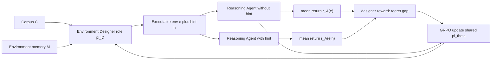

# SPADE：让同一个模型既写训练环境，也在环境里后训练

| 项目 | 内容 |
|---|---|
| 论文 | SPADE: Self-Play in Adaptive Synthetic Executable Environments |
| 方向 | 大模型后训练；Agent 自博弈；可执行环境生成 |
| 官方日期 | arXiv v1：2026-08-19 17:58:56 UTC；项目 README 记录 2026-08-20 发布论文、模型、数据 |
| 原文 | https://arxiv.org/abs/2608.19197 |
| 正文/项目/代码 | https://arxiv.org/html/2608.19197v1 ，https://spade-rl.github.io/ ，https://github.com/spade-rl/spade |
| 代码快照 | `spade-rl/spade@65421ccb15a6d501ad6217bd969816146da15e11` |
| 本文结论 | SPADE 的真正主张不是“再合成一批题”，而是把环境设计者本身放进 RL 循环：同一个 LLM 以 Environment Designer 角色生成可执行 Gym 式环境和 privileged hint，再以 Reasoning Agent 角色在这些环境中无 hint / 有 hint 地行动；两种回报差形成 hint-based regret，用来奖励能卡在当前能力边界上的环境。 |

## TL;DR

- **问题**：Agent 后训练越来越依赖带可验证奖励的交互环境，但人工环境池、静态合成环境池和 frozen verifier 环境池都会在模型学会之后失去训练梯度；环境供给变成 agentic RL 的新瓶颈。
- **方法**：SPADE 让同一个策略 `π_θ` 扮演两个角色：`π_D` 写完整 Python 环境 `e` 与 hint `h`，`π_A` 在同一个环境中分别无 hint 和有 hint 地 rollout；设计者奖励是 `r_D(e)=\bar r_A(e|h)-\bar r_A(e)`。
- **训练机制**：每轮生成 24 个环境，使用 Qwen3 4B、8B、30B-A3B 三个 backbone，主 recipe 训练 400 rollouts；环境是带 `reset()` / `step()` 的多轮 MDP，经过结构运行校验和 LLM 语义校验。
- **关键证据**：在 games 设置中，SPADE 相对各自 base 的平均提升从 4B 的 +5.2、8B 的 +5.7 增至 30B-A3B 的 +8.1；30B-A3B 的固定环境 GRPO 只有约 +1.2，固定 RLVE 约 +2.8。
- **工具使用证据**：tool-use 设置在 `τ²-bench`、BFCL v4 multi-turn、ACEBench-Agent 三类评测上迁移；摘要报告 30B-A3B 在 BFCL v4 multi-turn +5.7，在 ACEBench-Agent +13.9。
- **消融结论**：完整配置平均分 58.3；去掉 memory 为 53.2，去掉 corpus grounding 为 53.5，去掉 ED training 和 memory 为 40.5，固定 GPT-5.5 设计者为 53.0，说明“会训练的设计者 + 外部语料 + 环境记忆”缺一不可。
- **边界**：论文证据主要来自 Qwen3 系列与 released recipe；公开代码说明训练 launcher 依赖 8-GPU Ray/Slime、Megatron checkpoint、外部 AIME/BFCL 数据和自备 `CORPUS_FILE`，因此复现不是一条 `pip install` 命令能完成。
- **研究意义**：SPADE 把后训练问题从“找更多题”推进到“学习如何生成下一批刚好有学习价值的环境”，但它仍未解决生成环境的安全边界、奖励黑客、分布外验证和真实工具副作用控制。

## 研究问题：为什么固定环境池不够了

### 论文在反驳什么直觉？

- 常见直觉一：只要有足够多的人工题库，模型就能持续 RL。
- 常见直觉二：只要用强模型批量合成环境，就能替代人工环境工程。
- 常见直觉三：只要 verifier 固定可靠，后训练就主要是算力和优化问题。

SPADE 认为这三个直觉都漏掉了同一个动态变量：

| 训练资源 | 训练早期 | 模型变强以后 | SPADE 的批评 |
|---|---|---|---|
| 人工环境池 | 质量高、奖励清楚 | 扩展慢、成本高 | 不能随着 learner 的能力边界同步移动 |
| 静态合成池 | 批量快、覆盖宽 | 被模型逐步吃完 | generator 没有被训练，环境分布固定 |
| frozen verifier | 奖励稳定 | 只验证既定任务 | verifier 不等于新环境供给 |
| 推理时 harness | 能改善单任务行为 | 不更新权重 | 对新任务迁移有限 |

### 这篇论文把“环境”重新定义成什么？

- 不是一条数学题。
- 不是一个 prompt + answer。
- 不是只在终点给分的静态 benchmark。
- 而是一个**可执行 MDP**：
  - 状态 `S`：环境内部隐藏变量、任务进度、工具返回结果；
  - 动作 `A`：模型输出的命令、答案或工具调用；
  - 转移 `T(s'|s,a)`：`step()` 内部更新状态；
  - 奖励 `R(s,a)`：可验证的部分奖励与终局奖励；
  - 初始分布 `ρ_0`：`reset()` 产生初始任务实例。

这个定义很重要，因为它把 reasoning benchmark 和 tool-use benchmark 放进同一个接口：

```text
Environment e:
  reset() -> observation_0
  step(action_t) -> observation_{t+1}, reward_t, done, info

Reasoning Agent:
  observation_t -> action_t
```

## 论文主张与论证路线

| Claim | Mechanism | Evidence | Boundary |
|---|---|---|---|
| 环境设计可以成为可学习能力 | 同一策略分成 Designer 和 Agent 两个 prompt role，共享参数更新 | Figure 1 展示双角色闭环；代码 `SpadeOrchestrator` 统一处理环境轨迹和 actor 轨迹 | role switching 不等于真正的独立 proposer；共享参数可能带来耦合偏差 |
| 好环境应位于当前能力边界 | 有 hint 成功、无 hint 失败时 regret 高，设计者得到高奖励 | Figure 4 的两个例子显示 hint 改变 rollout 结果；公式用 `\bar r_A(e|h)-\bar r_A(e)` | hint 可能误导当前策略，小模型上 regret 估计会长时间为负 |
| 外部语料解决自博弈塌缩 | 每轮从 corpus 抽文档，设计者基于新材料写环境 | Table 8：有 corpus 的 Vendi/n 约 0.68-0.70，无 corpus 仅 0.04 | diversity 来自语料，不自动保证任务安全或真实世界相关性 |
| 环境记忆解决难度定位 | 记忆 high-regret 环境作为正例，too-easy/too-hard 作为反例 | Table 3：去掉 memory 后平均分从 58.3 降到 53.2 | memory 是启发式缓冲区，不是可证明的课程最优控制 |
| 自适应课程可迁移到 held-out 评测 | 在新生成环境训练，但评估数学、科学、代码、程序推理与 tool use | Table 1 与 Table 2 显示 games/tool-use 迁移 | 仍集中在 Qwen3 backbone 和论文的训练 recipe 上 |

## 方法机制：SPADE 的双角色循环

### 角色一：Environment Designer

- 输入：
  - 角色 prompt：要求它写环境，而不是解题；
  - 语料片段 `c ∈ C`：来自数学、科学、代码或 API 文档；
  - 环境记忆 `M`：历史高 regret 环境与低质量环境；
  - 技能标签：如 Logical Deduction、Spatial Reasoning、Optimization。
- 输出：
  - Python 环境代码 `e`；
  - privileged hint `h`；
  - 任务说明、动作格式、奖励结构、终止条件。

代码仓库中的结构与论文描述一致：

| 代码入口 | 作用 |
|---|---|
| `spade/core/orchestrator.py` | 调度双角色 rollout、hint、验证、奖励分配、超时黑名单 |
| `spade/core/game_generator.py` | 生成 synthetic language game，并解析 Python code block |
| `spade/core/env_validator.py` | 对生成环境做 LLM 语义校验，尤其检查 tool-use 环境是否可解 |
| `spade/core/env_memory.py` | 存储历史环境、regret、win rate、skill，并抽取高 regret seed |
| `spade/core/corpus.py` | 从 JSONL grounding corpus 均匀采样并截断文档 |

### 角色二：Reasoning Agent

- 输入：
  - 环境 observation；
  - 历史交互；
  - 可选 privileged hint。
- 输出：
  - 多轮命令、工具调用或最终答案。
- 奖励：
  - 无 hint rollout 得到 `r_A(y|e)`；
  - 有 hint rollout 得到 `r_A(y'|e,h)`；
  - 同一环境上平均后形成回报差。

### 为什么要同一个模型扮演两个角色？

- 参数共享让设计能力和求解能力一起移动：
  - 如果 Agent 变强，旧环境不再提供梯度；
  - 如果 Designer 被训练，它能继续生成更难、更交互的环境；
  - 如果 Designer 冻结，环境分布会逐渐跟不上 Agent。
- prompt role 切换让同一个 `π_θ` 在训练样本里出现两类 token：
  - Designer token：学习如何写环境；
  - Agent token：学习如何行动与解题。

这不是普通数据增强：



## 核心公式：hint-based regret 到底在奖励什么

SPADE 的环境设计者奖励可以写成：

```math
r_D(e)=\bar r_A(e\mid h)-\bar r_A(e)
```

变量含义：

| 符号 | 含义 | 为什么关键 |
|---|---|---|
| `e` | Designer 写出的可执行环境 | 训练目标不再是固定题目，而是环境代码 |
| `h` | Designer 同时写出的 privileged hint | 近似“知道关键策略时能不能解” |
| `\bar r_A(e)` | Agent 无 hint 的平均回报 | 表示当前策略直接解决该环境的能力 |
| `\bar r_A(e|h)` | Agent 有 hint 的平均回报 | 表示环境是否仍可解，而不是纯粹刁难 |
| `r_D(e)` | 设计者奖励 | 高值对应“有学习价值的边界环境” |

三种环境会得到不同信号：

| 环境类型 | 无 hint | 有 hint | 设计者信号 |
|---|---:|---:|---|
| 已掌握 | 高 | 高 | 低：太容易 |
| 能学会 | 低 | 高 | 高：位于能力边界 |
| 不可解 | 低 | 低 | 低：不是好课程 |

这比“解题率离历史均值多远”的 EMA learning-potential 更直接：

- EMA 需要历史积累，冷启动慢；
- EMA 对“已掌握”和“完全不可解”都可能给出不清晰信号；
- hint gap 在当前策略上即时比较同一环境的两个条件。

论文也承认边界：

- 在最优 best-response 条件下，额外信息不应降低期望回报；
- 但在当前有限策略上，hint 可能误导模型；
- Figure 12 显示 4B、8B 的 regret 估计会长时间低于 0，30B-A3B 才更稳定为正。

## 算法流程：从环境生成到 GRPO 更新

下面是按论文和代码抽象出的 SPADE 训练伪代码：

```text
Input:
  shared policy pi_theta
  grounding corpus C
  environment memory M
  skill schedule S
  regeneration interval k
  batch size B=24
  rollout count N=400

State:
  active environment pool P
  per-skill reward trackers
  delayed Designer trajectory buffer

For rollout t in 1..N:
  If t hits regeneration boundary:
    sample skill subset from S
    sample documents c from C
    sample high-regret and low-quality seeds from M
    pi_D generates B Python environments and hints
    run structural validation: reset(), step(), timeout checks
    run semantic validation for solvability and reward correctness
    replace P with accepted environments

  For each environment e in P:
    sample Agent trajectories without hint
    sample Agent trajectories with hint
    compute task rewards and normalized actor advantages
    estimate regret gap for Designer reward

  Update pi_theta with GRPO:
    Agent tokens learn from task reward
    Designer tokens learn from centered regret reward
    apply role-specific normalization and KL control

  Update M:
    store environment code, skill, win rate, regret
    keep high-regret seeds and too-easy/too-hard negatives

Output:
  trained policy checkpoints
  generated environment traces
  evaluation on held-out reasoning and tool-use suites
```

失败边界也要写进算法里：

- 生成代码可能无法 parse；
- `reset()` / `step()` 可能死循环，因此代码有线程池和 timeout；
- tool-use 环境可能要求无法由工具产生的状态，`env_validator.py` 专门追踪 success criteria；
- hint-based regret 可能为负，代码奖励分配中会 floor 掉负 regret；
- 环境过难、过易或重复会降低课程价值。

## 训练设置：不是小规模玩具实验

### Games 设置

| 维度 | 设置 |
|---|---|
| Backbone | Qwen3-4B-Instruct-2507、Qwen3-8B、Qwen3-30B-A3B-Instruct-2507 |
| 主模型 | Qwen3-30B-A3B-Instruct-2507 |
| 训练算法 | GRPO |
| 训练长度 | 400 rollouts |
| 每轮环境数 | 24 |
| 环境类型 | cognitive games，多轮可执行 Python 环境 |
| 语料 | 10k 数学 + 5k 科学文档，来自 DCLM / MegaScience 等来源 |
| Held-out 评测 | AIME 2025/2026、GPQA-Diamond、LiveCodeBench-v6、Reasoning-Gym 四类技能 |

### Tool-use 设置

| 维度 | 设置 |
|---|---|
| 环境材料 | 15k Nemotron pretraining code corpus 文档 |
| 训练对象 | 多轮 tool-use environment |
| 评测 | `τ²-bench`、BFCL v4 multi-turn、ACEBench-Agent |
| 公开代码入口 | `cmd/tool_use/train_spade_{4b,8b,30b}.sh` |
| 关键校验 | tool-use validator 逐项检查 success criteria 是否有工具路径可达 |

### 复现门槛

公开 README 和 `cmd/README.md` 明确提示训练 launcher 并不自包含：

- 需要 Ray head 和 8 GPU node；
- Slime 后端依赖 Megatron-LM 环境；
- 需要把 HF checkpoint 转成 Megatron `_torch_dist`；
- AIME、BFCL 等外部评测数据不随仓库打包；
- adaptive games 和 tool-use 训练需要用户自备 `CORPUS_FILE`；
- W&B key、workspace 路径、模型路径都要在环境变量中配置。

所以本文把 SPADE 视为**研究系统与 released recipe**，而不是“下载后即可复现论文全表”的轻量库。

## 主结果：固定环境基线为什么被拉开

### Table 1：games setting 的八项 held-out 评测

SPADE 在三个 backbone 上都超过固定环境基线，尤其越大模型越吃自适应环境：

| Backbone | Base Avg | Fixed-env GRPO Avg | Fixed-env RLVE Avg | SPADE Avg | SPADE vs Base |
|---|---:|---:|---:|---:|---:|
| Qwen3-4B-Instruct | 38.9 | 39.9 | 42.5 | 44.1 | +5.2 |
| Qwen3-8B | 49.8 | 51.0 | 53.8 | 55.5 | +5.7 |
| Qwen3-30B-A3B-Instruct | 50.2 | 51.4 | 53.0 | 58.3 | +8.1 |

30B-A3B 的细项很说明问题：

| Benchmark | Base | SPADE | 增益 |
|---|---:|---:|---:|
| AIME 2025 | 61.5 | 62.8 | +1.3 |
| AIME 2026 | 73.5 | 74.4 | +0.9 |
| GPQA-Diamond | 70.4 | 75.8 | +5.4 |
| LiveCodeBench-v6 | 43.2 | 47.3 | +4.1 |
| RG-Math | 45.0 | 63.3 | +18.3 |
| RG-Algorithmic | 18.0 | 32.1 | +14.1 |
| RG-Cognition | 23.0 | 37.7 | +14.7 |
| RG-Logic | 67.0 | 72.8 | +5.8 |

解读：

- AIME 增益较小，说明训练没有主要靠数学竞赛题刷榜；
- Reasoning-Gym 的过程技能增益最大，符合“多轮环境训练”预期；
- GPQA 和 LCB 也提升，说明环境训练迁移到科学推理与代码生成；
- 固定环境 RLVE 强于固定 GRPO，但仍低于 SPADE，支持“环境分布自适应”而不只是“有 RL”。

### Table 2：tool-use setting 的迁移

论文摘要给出两个关键数字：

- BFCL v4 multi-turn：30B-A3B 提升 +5.7，4B 提升 +10.3；
- ACEBench-Agent：30B-A3B 提升 +13.9；
- `τ²-bench` 也有正向提升，摘要写为 +3.6。

这部分的价值在于：

- tool-use 任务不是普通数学题；
- 环境必须有 API 状态、工具调用路径和终止条件；
- 如果 Designer 只会写“题目”，无法覆盖这种训练形态；
- SPADE 把 code-as-environment 扩展到了多轮工具操作。

## 消融：三件事分别贡献什么

### Table 3：完整配置与部分配置

| Setting | Designer 是否训练 | Corpus | Memory | Avg |
|---|---:|---:|---:|---:|
| Base | 否 | 否 | 否 | 50.2 |
| SPADE full | 是 | 是 | 是 | 58.3 |
| w/o memory | 是 | 是 | 否 | 53.2 |
| w/o corpus grounding | 是 | 否 | 是 | 53.5 |
| w/o ED training and memory | 否 | 是 | 否 | 40.5 |
| Fixed Designer GPT-5.5 | 否 | 是 | 是 | 53.0 |

可以拆成三个判断：

- **Corpus 决定广度**：
  - 没有外部语料，Designer 容易在自己熟悉的结构里打转；
  - Table 8 中无 corpus 的 Vendi/n 只有 0.04。
- **Memory 决定难度定位**：
  - 有历史高 regret seed，Designer 更容易沿着“刚好难”的环境变体推进；
  - 去掉 memory 后平均分从 58.3 掉到 53.2。
- **ED training 决定课程随 Agent 移动**：
  - 固定 GPT-5.5 设计者仍能给环境，但平均分只有 53.0；
  - 去掉 ED training 和 memory 甚至低到 40.5，说明静态强模型并不自动提供有效课程。

### Reward 消融的含义

论文把 hint-based regret 与 EMA learning-potential 做对比：

- EMA 关注“当前表现与历史均线的差距”；
- regret 关注“同一环境上，提示是否把失败变成成功”；
- 前者像滞后仪表，后者像当前边界探针。

这也是 SPADE 在 agent 后训练里的关键转向：

- 环境难度不再由人给等级；
- 环境价值不再由静态题库决定；
- 环境是否值得训练，由当前 learner 对这个环境的无提示/有提示差异来定义。

## Figure 与附录证据逐项解读

### Figure 1：整篇论文的一张机制图

- 左侧：同一 `π_θ` 先写 `e,h`，再分别无 hint / 有 hint 地解；
- 中间：30B games 设置中，SPADE 的相对提升曲线超过 Fixed-env GRPO 和 Fixed-env RLVE；
- 右侧：tool-use 三项评测均显示迁移，而不是只在自生成环境上自嗨。

这张图支持的 claim 是：

- 双角色机制确实形成闭环；
- 自适应环境优于静态环境；
- code-as-environment 可跨 reasoning 和 tool-use 两类设置。

它不能证明的是：

- 这种闭环在真实浏览器、真实支付、真实系统权限里安全；
- 设计者不会学会制造 verifier 漏洞；
- 结果可直接推广到闭源 frontier 模型。

### Figure 4：hint 为什么是“边界探针”

Figure 4 选了两个正 regret 例子：

- 无 hint 的 Agent 在环境反馈里多次试错，可能达到部分奖励；
- 有 hint 的 Agent 更快定位关键模式，最终拿到更高回报；
- 单个展示 pair 不是最终奖励，最终 `r_D` 用多次 rollout 的均值差。

这张图不是为了证明 benchmark 分数，而是解释 reward shaping：

- 如果 hint 只是泄露答案，环境会变成作弊训练；
- 如果 hint 给的是策略或关键观察，它能近似“环境是否可学”；
- Designer 因此被鼓励写那些有结构、有线索、但当前 Agent 尚未掌握的环境。

### Figure 5：为什么说它不是只提升程序推理

Figure 5 在 30B games 设置下展示八项 held-out 曲线：

- AIME 2025/2026 基本保持或小幅提升；
- GPQA-Diamond 和 LiveCodeBench-v6 有可见提升；
- Reasoning-Gym 四项提升更大；
- 虚线 base 说明训练没有以牺牲通用能力换来单项环境适配。

研究上更值得关注的是：

- 程序化交互环境对 procedural reasoning 最有效；
- 科学与代码任务能受益，可能因为环境里有状态、公式、约束、操作序列；
- 竞赛数学的增益较小，说明并非所有 reasoning 能力都同等受益。

### Figure 6/7 与 Table 8：多样性不是训练出来的，是语料撑住的

附录的多样性证据很关键：

| Run | Sample | Vendi/n | Mean pairwise distance | 解读 |
|---|---:|---:|---:|---|
| SPADE full | 3,310 | 0.68 | 0.94 | 多样 |
| w/o memory | 3,746 | 0.69 | 0.94 | 多样性仍在 |
| w/o ED training, w/o memory | 4,929 | 0.70 | 0.94 | 多样性仍在 |
| w/o corpus | 866 | 0.04 | 0.34 | 塌缩 |

这里有一个反直觉结论：

- 训练 Designer 会提高难度；
- memory 会帮助难度定位；
- 但**多样性主要来自 corpus grounding**。

论文还给出 no-corpus 的失败例子：

- 在 steps 290-312，环境生成连续 41 次转向迷宫；
- 这说明没有外部材料时，RL 优化会放大 Designer 已经会写的模式；
- 多样性奖励如果被直接优化，也可能被 reward hacking。

### Table 7：环境质量是否靠偷懒得来？

附录 Table 7 把环境质量拆得比较细：

| 指标 | Early | Mid | Late | 含义 |
|---|---:|---:|---:|---|
| Learnable-band fraction | 0.16 | 0.16 | 0.31 | 位于可学习区间的环境变多 |
| Agent win-rate | 0.30 | 0.46 | 0.62 | Agent 在训练环境中变强 |
| Well-posed | 0.98 | 0.97 | 0.97 | 题目表述质量未明显下降 |
| Verifiable terminal answer | 0.90 | 0.91 | 0.93 | 可验证性保持 |
| Turns / episode | 8.8 | 8.2 | 9.8 | 交互深度未塌缩 |
| Lines of code | 316 | 333 | 321 | 环境规模稳定 |
| Hidden state variables | 13.0 | 13.3 | 13.4 | 状态复杂度稳定 |

这张表支撑一个更具体的 claim：

- Designer 没有靠写更短、更简单的程序刷奖励；
- 学习价值提升来自难度定位更准；
- 但 executability 的原始通过率并非 100%，论文报告 raw code 需要 sanitizer / filter 才能进入训练。

## 代码读法：论文机制在仓库里如何落地

### Orchestrator：把双角色当成同一训练流

`SpadeOrchestrator` 的职责不是单纯跑游戏：

- 管理环境生成；
- 管理 actor rollout；
- 管理 hint generator；
- 管理环境 validator；
- 管理超时和 hung game blacklist；
- 管理 role-specific chat template；
- 调用 reward assignment，把 Designer 和 Agent 的轨迹都变成训练样本。

关键工程细节：

- `ENV_STEP_TIMEOUT = 30`：环境 step 可能卡死；
- `VALIDATE_GAME_TIMEOUT = 60`：验证 replay 也必须有边界；
- `_ENV_STEP_EXECUTOR` 使用线程池隔离生成代码的执行风险；
- `env_reward_variant` 可选 `regret_based`、`learning_potential`、`micro_lp`。

### Env Validator：安全边界不是抽象担忧

tool-use validator 的 prompt 特别长，原因很现实：

- success criteria 可能要求某个状态值；
- 但没有任何工具会产生这个状态；
- 或工具返回类型与 criterion 比较类型不一致；
- 或随机值从未暴露给 Agent；
- 或任务一开始就已经满足成功条件。

这些失败都说明：

- 自动写环境不只是生成代码；
- 可训练环境必须同时满足可执行、可解、可验证、非平凡；
- 否则 RL 会学到环境漏洞，而不是能力。

### Memory：不是聊天记忆，而是课程控制器

`EnvironmentMemory` 记录：

- `game_file`；
- `skill`；
- `code_snippet`；
- `actor_win_rate`；
- `regret`；
- `rollout_id`。

采样逻辑也很明确：

- high-regret seeds：偏向 0.15 到 0.85 win rate 的环境；
- low-quality examples：过易 `>0.9` 或过难 `<0.1`；
- prompt 注入时让 Designer 参考或避开这些环境。

所以这里的 memory 不是为了让 Agent 记住答案，而是为了让 Designer 记住“哪些环境仍有学习价值”。

## 相关工作位置：SPADE 和几条线的关系

| 相关线索 | 代表问题 | SPADE 的位置 |
|---|---|---|
| RLVR / GRPO | 如何用可验证奖励训练推理模型 | SPADE 沿用 GRPO，但把环境生成也纳入训练 |
| RLVE | 如何在可执行语言环境中做 RL | SPADE 把固定环境扩展为自适应生成环境 |
| Self-play / proposer-solver | 如何让系统自己提出挑战 | SPADE 用同一 LLM 的两种 role 实现 proposer-solver |
| Corpus-grounded self-play | 如何避免自博弈塌缩 | SPADE 继承 corpus grounding，并从 task 生成扩展到环境生成 |
| Agent memory | 如何利用历史经验 | SPADE 的 memory 服务于 Designer 的课程设计，而非推理时检索 |
| Tool-use benchmark | 如何评价多轮工具调用 | SPADE 让生成环境覆盖 tool-use 状态机和 API 约束 |

它的新意在交叉点：

- 不是单纯 self-play；
- 不是单纯 synthetic data；
- 不是单纯 agent harness；
- 而是把**可执行环境本身**作为后训练中的可学习对象。

## 证据边界与可复现性

### 已经比较扎实的部分

- 论文公开了 73 页 PDF、HTML、TeX、项目页、代码、HF 模型与数据入口；
- 主表覆盖三个模型尺度；
- 消融区分了 corpus、memory、ED training 和 fixed Designer；
- 附录给出环境质量、多样性、reward granularity、generated environment gallery；
- 代码公开了核心 orchestrator、validator、memory、corpus loader、训练 launcher 和 eval 入口。

### 仍需谨慎的部分

- 复现依赖复杂 GPU/Slime/Megatron/Ray 环境；
- adaptive grounding corpus 的权威公开快照和重分发记录并不完全由仓库内保证；
- 公开 README 写明 AIME/BFCL 外部数据不随仓库打包；
- raw generated code 有 executability 缺陷，需要 sanitizer 和 filter；
- hint-based regret 的有效性依赖 hint 质量和当前策略响应 hint 的能力；
- tool-use 环境仍是模拟工具，不等于真实浏览器、真实文件系统或真实 SaaS 权限。

### 安全研究视角的额外问题

- 如果 Designer 被奖励“让 hint 有帮助”，它是否会学会写对无 hint Agent 不公平、但对 hint Agent 过拟合的环境？
- 如果环境代码本身可执行，训练系统如何沙箱化任意生成程序？
- 如果 tool-use 环境扩展到真实工具，success criteria 会不会鼓励规避权限、绕过确认或滥用 side effect？
- 如果 corpus 带有错误、偏见或恶意文档，Designer 是否会把这些模式固化为训练环境？
- 如果后训练持续运行，谁来审计环境分布是否偏离预期能力目标？

## 研究延伸：下一步应该怎样读 SPADE

### 1. 把“环境生成”当成独立能力评估

SPADE 暗示一个新的评测对象：

- 不只问模型能不能解题；
- 还要问模型能不能写出适合训练别人的题；
- 更进一步，要问它能不能写出可执行、可验证、可控难度、不会诱发危险行为的交互环境。

这会改变 agent 评测的单位：

| 旧单位 | 新单位 | 评测问题 |
|---|---|---|
| 单条回答 | 一段交互轨迹 | 是否能根据反馈修正行动 |
| 静态题目 | 可执行环境 | 奖励是否真的对应目标行为 |
| 题库覆盖 | 环境分布演化 | learner 变强后，课程是否继续有效 |
| 正确率 | 学习价值 | 这个环境是否提供新梯度，而不是只证明已会或不会 |

如果这条线成立，未来论文可能需要报告两类指标：

- **solver 指标**：模型在 held-out benchmark 上变强多少；
- **designer 指标**：生成环境的可解率、可验证率、重复率、危险操作率、课程前沿命中率。

### 2. 安全问题不在“模型会不会自我提升”，而在“它怎样定义训练世界”

SPADE 的安全含义比“模型自己训练自己”更细：

- Designer 选择哪些状态可见；
- Designer 决定哪些动作有奖励；
- Designer 编写 verifier；
- Designer 选择 hint 的信息量；
- Designer 通过 memory 继承历史环境偏好。

这些环节都可能形成偏差：

- 如果奖励函数漏掉副作用，Agent 会学会只优化终局；
- 如果 hint 太强，Agent 学到的是依赖提示，而不是独立探索；
- 如果 validator 太宽松，环境漏洞会进入训练池；
- 如果 corpus 来源不受控，环境主题会向语料噪声和污染倾斜；
- 如果 memory 只保留高 regret，系统可能过度追逐“看起来有差距”的异常环境。

因此更安全的 SPADE 类系统需要额外日志：

```text
For each generated environment:
  record source corpus document ids
  record code hash and sandbox verdict
  record solvability validator trace
  record reward criteria and reachable state proof
  record no-hint / hint trajectories
  record rejected variants and rejection reasons
  record whether environment contains real-world side effects
```

这不是工程洁癖，而是审计闭环的最低条件；否则后训练系统会知道自己在某些评测上变强，却不知道训练世界是否已经偏离研究者原本想要的能力边界。

### 3. 与真实工具 Agent 的距离

SPADE 的 tool-use 结果值得重视，但不能直接等同于真实生产 Agent：

- 论文环境是模拟 API 与状态机；
- 真实浏览器、文件系统、邮件、支付、云资源都有不可逆副作用；
- 真实权限边界还涉及认证、授权、用户确认、审计日志和速率限制；
- 真实任务的奖励常常不是单一终局布尔值，而是人类偏好、合规要求和长期后果。

所以从 SPADE 到真实工具后训练，中间至少还差三层：

| 层次 | 需要解决的问题 |
|---|---|
| 沙箱层 | 任意生成环境代码不能逃逸、联网、读写敏感文件 |
| 权限层 | 工具动作要有 capability scope、确认门槛和回滚策略 |
| 评价层 | 奖励函数要覆盖副作用、违规行为和未授权路径 |

SPADE 提供的是“自适应课程生成”的核心机制，不是完整的安全部署方案。

### 4. 对后训练研究的真正启发

这篇论文最值得继续追问的不是“SPADE 分数能不能再高几分”，而是：

- 环境设计者是否会形成可迁移的 curriculum design 能力？
- 不同 backbone 是否需要不同环境分布，还是存在通用课程？
- hint-based regret 能否替换成更稳健的 causal credit signal？
- 能否把 environment verifier 从 LLM prompt 升级为静态分析、符号执行或属性测试？
- 能否在不泄露答案的情况下构造更可靠的 hint？
- 当 Designer 和 Agent 共享参数时，是否会出现互相迁就的封闭生态？

这些问题决定 SPADE 是一次有趣实验，还是 agentic post-training 的长期路线。

## 结论：SPADE 的研究价值在哪里

- SPADE 最重要的贡献是把“训练环境供给”从数据工程问题改写成可学习问题。
- 它提出了一个具体闭环：
  - 环境由模型写；
  - 环境必须可执行；
  - hint gap 定义能力边界；
  - corpus 维持多样性；
  - memory 维持难度定位；
  - GRPO 同时更新 Designer 与 Agent。
- 它的实验说明固定环境池会饱和，而自适应环境在 30B-A3B 上更能放大模型尺度收益。
- 它也暴露了下一阶段 agentic post-training 的硬问题：
  - 环境生成的安全沙箱；
  - reward hacking 与不可解环境过滤；
  - corpus provenance；
  - 真实工具副作用；
  - 自动课程是否会偏离人类想训练的能力边界。

一句话总结：

> SPADE 不是又造了一个 benchmark，而是在问：如果后训练的瓶颈是环境，那么模型能否学会持续发明下一批能训练自己的环境？

这个问题一旦成立，Agent 后训练的核心对象就不再只是 policy，而是 policy、环境生成器、验证器和记忆系统共同构成的闭环。
