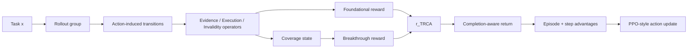

# TRCA：把长程 Agent 后训练的 credit assignment 从“终局成败”拉回到每一步状态变化

原文：<https://arxiv.org/abs/2608.16156>

HTML：<https://arxiv.org/html/2608.16156>

## 元信息与 TL;DR

| 字段 | 内容 |
| --- | --- |
| 论文 | TRCA: Transition-wise Rubric Credit Assignment for Long-horizon LLM Agents |
| 作者 | Huan Zhang, Mingju Chen, Dongxu Zhou, Can Lv, Heng Chang, Sen Cui, Faguo Wu, Shiji Zhou |
| 官方日期 | arXiv v1：2026-08-17 06:19:12 UTC；arXiv 页面显示 Submitted on 17 Aug 2026 |
| 方向 | 大模型后训练 / 长程 LLM Agent 强化学习 |
| 核心对象 | ALFWorld、WebShop、SearchQA 这类多步交互任务中的稀疏终局奖励 |
| 主张 | 失败轨迹仍然含有可验证的 transition-level 信号；不必等成功轨迹出现，也不必在线调用 PRM/LLM judge 才能给中间动作分配信用 |

### 先给结论

- **问题**：长程 LLM Agent 的后训练常把整条轨迹的终局成败传播给所有动作；在早期探索阶段，成功轨迹很少，基于成功 anchor 的方法无法稳定告诉模型“哪一步是有用的”。
- **方法**：TRCA 为每个 action-induced transition 构造三类 deterministic rubric：`Evidence`、`Execution`、`Invalidity`，再合成两个奖励：`Foundational Rubric Reward` 给当前 transition 的局部正负反馈，`Breakthrough Rubric Reward` 只奖励新覆盖的 Evidence/Execution 条件。
- **训练信号**：TRCA 将 transition-level reward 与原始 sparse terminal reward 组合成 completion-aware return，再在相似决策上下文内归一化出 step advantage，最后与 episode-relative advantage 相加，进入 PPO-style clipped objective。
- **关键数字**：诊断实验中，Qwen2.5-1.5B-Instruct 早期训练 rollouts 有 **96.5%** 失败，**85.6%** 的 task-conditioned rollout group 没有成功轨迹，但失败轨迹里 **72.2%** 的动作仍含有 Evidence、Execution 或 Validity 信号。
- **主结果**：在 Qwen2.5-1.5B-Instruct 上，TRCA 的 ALFWorld overall success 为 **92.0%**，WebShop score/success 为 **90.5%/78.4%**；在 Qwen2.5-7B-Instruct 上分别为 **94.5%** 与 **92.9%/83.8%**。
- **SearchQA**：Qwen2.5-3B-Instruct 平均 EM 为 **45.4%**，Qwen2.5-7B-Instruct 平均 EM 为 **48.4%**，覆盖 NQ、TriviaQA、PopQA、HotpotQA、2Wiki、MuSiQue、Bamboogle 七个数据集。
- **消融与样本效率**：去掉 Foundational 或 Breakthrough 都会退化；Breakthrough 的缺失更伤，因为“新覆盖条件”才是长程任务里稀缺的关键进展。相同预算下，TRCA 在 ALFWorld/WebShop 上相对 GRPO 的 sample-efficiency 增益最高达 **19.5/18.8** 个百分点。
- **边界**：rubric operator 是离线构造并 deterministic binding 的；论文没有开源代码仓库证据，也没有证明它是 unbiased optimal advantage estimator。它更像一种结构化 reward shaping/credit assignment recipe，而不是通用 Agent RL 定理。

## 研究问题：为什么“失败轨迹”不该被整条扔掉？

### 稀疏奖励的问题不是只有“奖励少”

- 长程 Agent 任务不是单轮问答：
  - ALFWorld 需要多步观察、找物体、拿取、加热、冷却、放置。
  - WebShop 需要页面导航、属性过滤、选择商品、购买。
  - SearchQA 需要发起检索、积累证据、判断何时回答。
- 如果只给终局奖励：
  - 一条失败轨迹里所有动作都容易被当成失败的同类证据。
  - 一条成功轨迹里也难区分“真正推进任务”的动作和“刚好没拖后腿”的动作。
  - 当 rollout group 全失败时，GRPO/RLOO 类相对优势会出现零方差或低信息量状态。

### 作者真正抓住的断点

| 断点 | 传统处理 | TRCA 的切入 |
| --- | --- | --- |
| 成功轨迹很少 | 等成功 anchor 或成功状态图出现 | 直接读 action 前后的环境变化 |
| PRM 成本高 | 训练/调用 process evaluator | 用 deterministic rubric operator，不在线调用 judge |
| 失败轨迹被低估 | 终局失败导致整条轨迹信用低 | 从失败轨迹中抽 Evidence/Execution/Validity |
| 重复探索浪费 | 多次观察同一事实仍可能拿类似分 | Breakthrough 只奖“新覆盖”的正向条件 |

### 诊断实验的意义

- 作者没有一开始就声称“rubric 一定更好”，而是先证明 success-scarce regime 真实存在：
  - 诊断对象：ALFWorld 与 WebShop。
  - 模型：Qwen2.5-1.5B-Instruct。
  - 每个 diagnostic batch：16 个 task instance，每个任务 rollout group size 为 8，因此一个 batch 有 128 条 rollout。
  - 人类标注与 GPT-4o judge 只用于诊断，不用于训练时 reward construction。
- 三个比例分别有不同分母：
  - `FailureRate = N_fail / N_rollout`，得到 96.5%。
  - `SuccessFreeGroupRate = N_sf_group / N_group`，得到 85.6%。
  - `UsefulTransitionRate = N_useful_fail / N_action_fail`，得到 72.2%。

这组数字的研究价值在于：它把“失败轨迹有没有可学习信号”从直觉变成了可测对象。TRCA 后面的设计都围绕这个现象展开，而不是简单把一个更复杂的 reward model 塞进 PPO。

## 方法主张：从 transition 读信用，而不是从成功轨迹回推

### 核心对象怎么定义？

论文把一次 transition 写成：

```text
xi_{i,t} = (s_{i,t}, a_{i,t}, s_{i,t+1})
```

变量含义：

| 变量 | 含义 |
| --- | --- |
| `x` | 具体任务指令或 query |
| `tau_i` | 第 i 条 rollout |
| `s_{i,t}` | 第 i 条 rollout 第 t 步前的环境状态/观察 |
| `a_{i,t}` | Agent 在该步发出的可执行 action |
| `s_{i,t+1}` | action 后的可观察环境反馈 |
| `R(tau_i)` | 整条轨迹的终局结果 |

### 三类 rubric 是什么？

| Rubric | 正负方向 | 它读什么 | 例子 |
| --- | --- | --- | --- |
| Evidence | 正向 | transition 是否揭示任务相关信息 | 找到物体位置、看到商品属性、检索到支持事实 |
| Execution | 正向 | transition 是否完成任务需要的操作或中间条件 | 拿起目标物、选中正确规格、提交有效查询 |
| Invalidity | 负向 | action 是否 malformed、不可执行、重复无效或被环境拒绝 | 命令格式错误、页面操作不可用、重复撞墙 |

重要边界：

- 这些 rubric 是 benchmark-level operator library，再按 task deterministic binding。
- 训练时不调用在线 LLM judge。
- operator 只读任务指令、action-induced transition 和环境可观察字段。
- terminal outcome、未来状态、ground-truth answer 不参与中间 transition 判断。

## 奖励机制：Foundational 与 Breakthrough 各自解决什么问题？

### Foundational Rubric Reward：给当前 transition 局部打分

Foundational 的任务是回答：

- 这一步有没有获得新信息？
- 这一步有没有执行有效操作？
- 这一步有没有明显无效或退化？

公式可以概括为：

```text
q^i_{t,j} =
  + r^c / M_c,  if rubric item j in Evidence/Execution is activated
  - |r^c| / M_c, if rubric item j in Invalidity is activated
  0, otherwise

r^F_{i,t} = sum_{j in R(x)} q^i_{t,j}
```

解释：

- `M_c = |R^c(x)|` 是某类 rubric item 的数量。
- 除以 `M_c` 的作用是避免 rubric list 越长，奖励尺度就机械变大。
- Evidence/Execution 给正分，Invalidity 给负分。
- 如果一个 transition 没有可观察证据支持某个 item，该 item 输出 0，而不是猜测。

### Breakthrough Rubric Reward：只奖励“第一次覆盖”的正向进展

Foundational 有一个自然缺陷：

- 如果同一条 Evidence 被重复观察，局部分数可能反复出现。
- 这会稀释真正关键的任务进展。

Breakthrough 用覆盖状态 `C_{i,t,j}` 解决这个问题：

```text
C_{i,t,j} = max_{u <= t} O_{i,u,j}

Phi_{i,t} =
  sum_{c in {Evidence, Execution}}
  (r^c / M_c) * sum_{j in R^c(x)} C_{i,t,j}

r^B_{i,t} = Phi_{i,t} - Phi_{i,t-1}
```

机制含义：

- 只把 Evidence 和 Execution 放进正向 potential。
- Invalidity 不进入 coverage potential，因为它是 transition-local 的负面行为，已经由 Foundational 惩罚。
- 同一 Evidence/Execution item 第二次出现时，`Phi` 不再增加，`r^B` 为 0。
- 因为它是 potential difference，所以累计 Breakthrough reward 受正向预算上界控制，不会随轨迹长度无限积累。

### 最终 transition reward

论文把两者做凸组合：

```text
r^TRCA_{i,t} = (1 - lambda) * r^F_{i,t} + lambda * r^B_{i,t}
lambda in [0, 1]
```

经验设置：

- 默认 `lambda = 0.8`。
- `lambda = 0` 只用 Foundational，强调局部广覆盖监督。
- `lambda = 1` 只用 Breakthrough，强调新覆盖条件。
- ALFWorld 的敏感性实验显示，`lambda = 0.8` 在 broad supervision 与 breakthrough credit 之间最好；升到 `1.0` 会让 overall success 从 92.0% 降到 88.3%。

## Policy Optimization：TRCA 如何进入 PPO-style 训练？

### 先把 sparse terminal reward 与 transition reward 合成 return

论文定义 completion-aware return：

```text
R_{i,t} = sum_{k=t}^{T_i} gamma^{k-t} * (r_{i,k} + r^TRCA_{i,k})
```

设置：

- `gamma = 0.95`。
- `r_{i,k}` 保留环境原始奖励，通常非终局为 0，终局为 `R(tau_i)`。
- `r^TRCA_{i,k}` 是 transition-level rubric signal。
- 这不是复制 terminal reward，而是把终局信号和可观察 transition evidence 合并后再做相对优势。

### 再构造两个 advantage

| Advantage | 比较范围 | 作用 |
| --- | --- | --- |
| Episode-relative `A^E(tau_i)` | 同一 task 的 rollout group | 判断整条轨迹相对其他 rollout 好坏 |
| Step-relative `A^S(a_{i,t})` | 相似决策上下文的 transition group | 判断同类状态下某个 action 的局部长期效用 |

最终：

```text
A^TRCA_{i,t} = A^E(tau_i) + A^S(a_{i,t})
```

相似上下文不是 embedding 聚类，而是环境结构字段：

| Benchmark | context grouping 字段 |
| --- | --- |
| ALFWorld | task predicates、object state、inventory、object location、interaction stage |
| WebShop | page type、product identity、selected options、product attributes、navigation stage |
| SearchQA | tool type、retrieval stage、query state、evidence stage、answer-submission stage |

如果 context group 太小或 completion-aware return 零方差，step advantage 设为 0。这个处理很关键：TRCA 没有硬凑一个虚假的局部比较，而是在不可比较时退回不加 step 信号。

### 训练伪代码

```text
Input:
  policy pi_theta, old policy pi_old
  task distribution p(X)
  benchmark operator libraries T_b
  deterministic task binders B_{b,m}
  benchmark adapters g_b
  rollout group size N, discount gamma, mix lambda

State:
  rubric set R(x)
  coverage C_{i,t,j}
  terminal outcomes R(tau_i)
  transition rewards r^F, r^B, r^TRCA

Loop each training iteration:
  1. sample task batch x ~ p(X)
  2. bind benchmark-level operators to each task, constructing R(x)
  3. sample N trajectories per task with pi_old
  4. collect terminal outcomes
  5. initialize positive Evidence/Execution coverage C_{i,0,j}=0
  6. for each transition:
       a. extract observable facts g_b(s_t, a_t, s_{t+1})
       b. evaluate deterministic rubric outputs O_{i,t,j}
       c. compute Foundational reward
       d. update coverage
       e. compute Breakthrough reward
       f. combine into r^TRCA
  7. build comparable context groups
  8. compute completion-aware returns
  9. compute episode-relative and step-relative advantages
  10. optimize PPO-style clipped objective on executable action tokens

Failure boundary:
  - if context group has fewer than two comparable transitions, step advantage is zero
  - if context return variance is zero, step advantage is zero
  - prompt tokens, observations, retrieval text, padding and other steps are excluded from the action-level update
```

## 实验设置：作者怎样证明它不是只在一个环境上有效？

### Benchmark 与指标

| 任务族 | 数据/环境 | 指标 | 任务性质 |
| --- | --- | --- | --- |
| Embodied text interaction | ALFWorld | 五类子任务与 overall success | 家居多步操作 |
| Web navigation | WebShop | task score 与 success rate | 商品搜索与购买 |
| Search-augmented QA | NQ、TriviaQA、PopQA、HotpotQA、2Wiki、MuSiQue、Bamboogle | strict binary normalized EM | 检索增强问答 |

### Baseline

- 闭源 prompting：GPT-4o、Gemini-2.5-Pro。
- Prompting agent：Qwen2.5、ReAct、Reflexion。
- ALFWorld/WebShop RL：PPO、RLOO、GRPO、GiGPO、HCAPO、GraphGPO。
- SearchQA RL：R1-Instruct、Search-R1、ZeroSearch、StepSearch、GiGPO、HCAPO、IGPO。

### 实现细节

- ALFWorld/WebShop policy model：Qwen2.5-1.5B-Instruct 与 Qwen2.5-7B-Instruct。
- SearchQA policy model：Qwen2.5-3B-Instruct 与 Qwen2.5-7B-Instruct。
- group-based methods 的 rollout group size：8。
- Agent 输出约定：reasoning 在 `<think>`，可执行 action 在 `<action>`。
- ALFWorld 最大交互步数：25。
- rollout temperature：1.0。
- 最大 response length：512 tokens。
- 实验硬件：四张 NVIDIA A800 80GB。

## 主结果：TRCA 在哪里赢？

### Table 1：ALFWorld 与 WebShop

| Base model | Method | ALFWorld overall | WebShop score | WebShop success |
| --- | --- | ---: | ---: | ---: |
| Qwen2.5-1.5B | GRPO | 77.9 | 84.7 | 71.4 |
| Qwen2.5-1.5B | GiGPO | 86.7 | 83.1 | 65.0 |
| Qwen2.5-1.5B | GraphGPO | 91.7 | 86.7 | 75.5 |
| Qwen2.5-1.5B | TRCA | **92.0** | **90.5** | **78.4** |
| Qwen2.5-7B | GRPO | 83.3 | 84.3 | 75.0 |
| Qwen2.5-7B | GiGPO | 90.8 | 84.4 | 72.8 |
| Qwen2.5-7B | GraphGPO | 93.3 | 86.9 | 80.3 |
| Qwen2.5-7B | TRCA | **94.5** | **92.9** | **83.8** |

读法：

- 1.5B 上，TRCA 相比 GiGPO 的 ALFWorld overall、WebShop score、WebShop success 分别提升 5.3、7.4、13.4 个百分点。
- 7B 上，TRCA 相比 GiGPO 的对应提升为 3.7、8.5、11.0 个百分点。
- 相比最强整体 prior baseline GraphGPO，1.5B 设置下 ALFWorld overall 提升 0.3，WebShop score 提升 3.8，success 提升 2.9；7B 设置下分别提升 1.2、6.0、3.5。
- 这说明 TRCA 的收益不是只来自更强 base model，而是在相同 base model 下改变了中间动作 credit 的可用性。

### Table 2：SearchQA

| Base model | Method | Avg. EM | 备注 |
| --- | --- | ---: | --- |
| Qwen2.5-3B | GiGPO | 42.1 | 强 group-relative baseline |
| Qwen2.5-3B | HCAPO | 43.5 | hindsight credit baseline |
| Qwen2.5-3B | TRCA | **45.4** | 七个数据集均最好 |
| Qwen2.5-7B | GiGPO | 47.2 | 7B strong baseline |
| Qwen2.5-7B | HCAPO | 47.3 | 7B strong baseline |
| Qwen2.5-7B | TRCA | **48.4** | 平均最好，Bamboogle 70.4 |

SearchQA 的证据边界更细：

- NQ 与 HotpotQA 被当作 in-domain。
- TriviaQA、PopQA、2Wiki、MuSiQue、Bamboogle 作为 out-of-domain generalization。
- 指标是 strict normalized EM，因此它不奖励“差不多答对”。
- 3B 设置下，TRCA 在七个 individual dataset 上都最高；7B 设置下平均最高，但个别列并非全都压倒所有 baseline，例如 2Wiki 上与 GiGPO 同为 43.6。

## 消融、样本效率与 Figure 证据

### Figure 1：失败轨迹不是无信号轨迹

- Figure 1(A) 支撑动机：
  - 失败 rollout 超过 95%。
  - 失败动作中超过 70% 有 rubric-grounded transition signal。
  - 这解释了为什么 terminal-only 或 success-anchor 方法在早期训练浪费样本。
- Figure 1(B) 支撑机制：
  - transition rubric 被拆成 Foundational 与 Breakthrough。
  - 它不是把每个失败动作都变成正样本，而是区分“获得证据、执行任务、无效动作”。

### Figure 2：TRCA 的数据流



### Figure 3：两个 reward 都必要

- 去掉 Foundational：模型失去广覆盖的局部正负反馈，尤其会弱化 Invalidity 的负面约束。
- 去掉 Breakthrough：退化更明显，因为任务关键进展通常不是“又看了一遍同一信息”，而是第一次满足新的 Evidence/Execution 条件。
- 这支持两者互补：
  - Foundational 管当前 transition 是否好。
  - Breakthrough 管当前 transition 是否带来新进展。

### Figure 4 / Figure 7：样本效率

| 对比 | 结果 |
| --- | --- |
| 1.92K sampled trajectories，ALFWorld Pick_two | TRCA 把 success 从 GRPO 的 11.5% 拉到 34.6% |
| 1.92K sampled trajectories，ALFWorld Pick_cool | TRCA 把 success 从 15.0% 拉到 24.0% |
| 3.84K sampled trajectories，Pick_two | TRCA 达到 69.2%，超过 GRPO 6.40K 的 46.7% |
| 3.84K sampled trajectories，Pick_cool | TRCA 达到 53.8%，接近 GRPO 6.40K 的 57.7% |
| Aggregate Figure 7 | ALFWorld / WebShop 相对 GRPO 最高增益 19.5 / 18.8 个百分点 |

这个证据点很重要：如果 TRCA 只是在同样样本上最后多涨一点，贡献会更像 reward tweaking；但作者强调它在早期就利用了失败轨迹里的 transition signal，因此 sample efficiency 是方法主张的直接检验。

## 理论性质：这些公式能证明什么，不能证明什么？

### 能证明的四件事

| 性质 | 含义 |
| --- | --- |
| Boundedness | reward 被 category budget 约束，不会因 rubric list 变长或 rollout 变长无限放大 |
| Non-accumulation | Breakthrough 的累计奖励由 final coverage potential 控制，重复满足同一 item 不重复拿分 |
| Novel-coverage preference | immediate rubric evidence 相同的两个 transition，首次覆盖新条件者得更高 reward |
| Zero-success non-degeneracy | 即使 rollout group 全失败，只要 context-level completion-aware return 有差异，TRCA advantage 仍可非零 |

### 不能证明的部分

- 它没有证明 `r^TRCA` 是某个未知最优 advantage 的 unbiased estimator。
- 它没有证明完整 policy-gradient estimator 一定全局低方差。
- Proposition 4 的 variance statement 是 local transition feedback 在给定 observable transition 与 prior coverage state 后的条件方差，而不是整个归一化 advantage 的方差。
- 它依赖 deterministic operator 是否能真实读出环境任务结构；如果 benchmark 的 observable state 本身不可靠，TRCA 不会自动修好感知层。

## 相关工作位置：TRCA 在后训练谱系里站在哪里？

### 与 PPO/GRPO/RLOO 的关系

- PPO/GRPO/RLOO 是优化骨架，能处理相对优势和 clipped update。
- 但它们本身不回答长程 Agent 的中间动作 credit 来源。
- TRCA 更像插入这些骨架前的 credit construction layer：
  - 先从 transition 生成 step-level reward。
  - 再构造 completion-aware return。
  - 最后才进入 action-level PPO-style objective。

### 与 PRM / AgentPRM 的关系

- PRM 的优势是可以对中间过程给细粒度判断。
- 代价是标注、训练或在线推理成本高。
- TRCA 的取舍是：
  - 离线用 LLM 构造 benchmark-level operator library。
  - 训练时只做 deterministic binding 和 rule-based transition evaluation。
  - 牺牲一部分开放语义弹性，换取可复现、低推理成本和不依赖成功 anchor。

### 与 hindsight / success-anchor 方法的关系

- HCAPO、AgentHER、GiGPO、GraphGPO 等都试图把成功、近成功或状态结构用于 credit。
- TRCA 的不同点是：失败轨迹也可以提供一阶 transition evidence。
- 这使它特别适合早期探索阶段，因为此时“成功 anchor 不够”本身就是训练瓶颈。

## 局限与失败边界

### Rubric 质量是方法上限

- 如果 operator library 没覆盖关键任务条件，TRCA 就不会凭空奖励那些条件。
- 如果环境 observable facts 过粗，Evidence/Execution/Invalidity 也会变粗。
- 如果某些任务的有效动作必须依赖长期不可见状态，transition-local rubric 可能低估其价值。

### Benchmark 结构化程度较高

- ALFWorld、WebShop、SearchQA 都能提供可解析的环境字段。
- 真实浏览器、代码仓库维护、开放式工具调用环境通常更脏：
  - 状态字段不稳定。
  - action 后果可能延迟。
  - 同一目标有多条等价路径。
  - invalid action 未必被环境明确拒绝。
- 因此 TRCA 迁移到真实 Agent 系统时，最难的部分可能不是 PPO，而是构造可靠的 `g_b` adapter 与 operator library。

### 代码与复现材料不足

- 本轮搜索词包括：
  - `"TRCA" "Transition-wise Rubric Credit Assignment"`
  - `"2608.16156" "TRCA"`
  - `"Transition-wise Rubric Credit Assignment" "GitHub"`
- 截至本轮采集，只找到 arXiv 官方页、arXiv 列表、论文镜像和自动摘要页，没有发现作者博客、官方代码仓库或独立复现实验。
- 因此本文对训练细节的复现判断主要来自论文附录，而不是可运行代码审计。

## 研究者视角：这篇论文真正值得带走什么？

### 对 Agent 后训练的启发

- 长程 Agent RL 不应只问“最后成功了吗”，还要问“每一步是否改变了可学习状态”。
- 失败轨迹并不等价于负样本；它可能包含：
  - 可复用的信息获取步骤。
  - 合法但未完成任务的中间操作。
  - 明确应该惩罚的无效动作。
- 如果训练系统能把三者分开，早期探索样本的利用率会明显提高。

### 对安全与评测的启发

- TRCA 的 rubric operator 也可被看成一种审计接口：
  - 它要求我们显式定义什么叫 Evidence。
  - 显式定义什么叫 Execution。
  - 显式定义什么叫 Invalidity。
- 这比单纯用终局成功率更适合发现长程 Agent 的 failure mode：
  - Agent 是否一直观察但不执行？
  - 是否执行了任务无关操作？
  - 是否重复撞同一个环境限制？
  - 是否在无成功轨迹时仍有可训练的局部进展？

### 下一步问题

- 能否自动发现 rubric blind spot，而不是只依赖离线生成的 operator library？
- 当环境反馈延迟很多步时，Breakthrough coverage 是否会错误地奖励前一步而非真正因果动作？
- 对代码 Agent、浏览器 Agent、具身机器人，`g_b` adapter 应该读结构化 trace、DOM、文件 diff，还是工具调用日志？
- 如果攻击者能污染环境状态文本，TRCA 的 Evidence/Execution operator 会不会把恶意状态当成正向 transition？
- 是否可以把 TRCA 与安全约束式 RL 结合，让 Invalidity 不只是负 reward，而是 hard constraint 或 risk budget？

## 机制细读：为什么 TRCA 不是“给失败轨迹硬塞正分”？

### 它先区分三种失败

长程 Agent 的失败至少有三种不同含义：

| 失败类型 | 轨迹终局 | 中间 transition | 训练时该怎么处理 |
| --- | --- | --- | --- |
| 探索失败 | 最后没完成任务 | 曾经发现关键对象、属性或证据 | 不能整条当作无价值，需要保留 Evidence credit |
| 执行失败 | 最后没完成任务 | 曾经完成局部子目标，但后续计划错误 | 需要给局部 Execution credit，同时让后续错误承担负面影响 |
| 无效失败 | 最后没完成任务 | 多次 malformed、不可执行、重复无效 | 需要明确负 reward 或低 advantage，避免模型重复该模式 |

TRCA 的重要性在这里：它没有把失败轨迹整体翻转成“好样本”，而是把失败轨迹拆成 transition 后再判断。这样能避免两个常见错误：

- **错误一**：只因整条轨迹失败，就把寻找线索、打开正确页面、拿到中间物体等动作都压成负样本。
- **错误二**：只因某一步看似“有效”，就忽略它是否重复覆盖旧信息，导致模型学会刷观察而不是推进任务。

### Foundational 解决“当前步有没有信号”

Foundational 的价值是建立一个 transition-local 的最小监督单元：

- 它让 Evidence 与 Execution 可以在失败轨迹里被看见。
- 它让 Invalidity 不必等到终局才被惩罚。
- 它把不同 rubric category 的总量用 `M_c` 做归一，避免一个 benchmark 因为 rubric 项更多而天然奖励更大。

这一步对应论文的 claim：

- 失败不等于没有监督。
- 监督不必来自成功轨迹。
- 环境变化本身已经携带一部分可验证信号。

但 Foundational 也会留下一个问题：如果 Agent 反复查询同一信息，它每次都可能触发类似 Evidence。长程任务里，这会鼓励“看起来有用但不推进”的行为。

### Breakthrough 解决“这一步是不是新进展”

Breakthrough 的 coverage state 是论文中更接近长程规划的部分：

- 它维护每条 rollout 已覆盖的 Evidence/Execution 条件。
- 它只在某个正向 item 从未覆盖变成已覆盖时给奖励。
- 它不把 Invalidity 纳入 positive potential，避免“第一次犯错”也被当成覆盖事件。

这个设计让 reward 更接近任务进展：

```text
如果 action A 和 action B 都观察到同一对象位置：
  - Foundational 可能都给 Evidence credit
  - Breakthrough 只给第一次发现者额外 credit

如果 action C 第一次完成子目标：
  - Foundational 给 Execution credit
  - Breakthrough 也给新覆盖 credit

如果 action D malformed：
  - Foundational 给 Invalidity negative credit
  - Breakthrough 不记录它的 coverage
```

因此，TRCA 实际上把长程任务拆成两条监督轴：

- **局部轴**：每一步是否有可观察的正负信号。
- **进展轴**：这一步是否让任务状态覆盖了新的必要条件。

### 为什么要和 terminal reward 合并，而不是替代它？

如果只用 rubric reward，会出现另一个风险：

- Agent 可能学会最大化局部 Evidence，而不完成任务。
- Agent 可能为获得 Execution item 而走不必要的长路径。
- Rubric operator 的 blind spot 会被策略利用。

论文保留 terminal reward 的作用：

- 终局成功仍然定义任务目标。
- transition reward 负责把终局目标分解到中间动作。
- 两者合成 completion-aware return 后，再在 rollout/context group 内做相对比较。

这使 TRCA 更像“终局奖励的可观察中间证据分解”，而不是一个完全替代环境任务的手写 reward。

## Table 1 的细读：不是所有子任务都同样受益

### ALFWorld 上的子任务差异

Qwen2.5-1.5B-Instruct 设置下，TRCA 的五类 ALFWorld 子任务为：

| 子任务 | TRCA | 读法 |
| --- | ---: | --- |
| Clean | 92.5 | 已接近 GiGPO/HCAPO，收益不主要来自简单任务 |
| Pick | 95.9 | 对需要定位和拿取的任务稳定 |
| Cool | 96.6 | 明显超过 GraphGPO 的 91.3 |
| Heat | 97.8 | 对多步状态改变特别强 |
| Pick2 | 86.8 | 仍是较难项，但高于 GraphGPO 的 86.6 |

这说明 TRCA 并不是只在一个简单子任务上拉高 overall。它在 Cool/Heat 这种需要明确中间状态变化的任务上特别自然，因为“冷却/加热完成”本身就是可观察的 Execution condition。

7B 设置下有另一种现象：

- GraphGPO 在 Pick 上有 98.0，TRCA 为 97.7，二者接近。
- TRCA 在 Cool 达到 100.0，Heat 达到 93.3，Pick2 达到 94.1。
- overall 94.5 高于 GraphGPO 93.3。

这提示一个边界：当强 baseline 已能在某些单一子任务上接近饱和，TRCA 的主要收益会转向更需要状态覆盖管理的子任务，而不是每列都大幅压倒。

### WebShop 上 score 与 success 的差异

WebShop 同时报告 score 和 success：

- score 衡量属性匹配的部分满足。
- success 衡量是否精确完成购买任务。

TRCA 的结果有两个层次：

| Base | Score 提升 | Success 提升 | 含义 |
| --- | --- | --- | --- |
| 1.5B 相比 GraphGPO | 90.5 vs 86.7 | 78.4 vs 75.5 | 不只更会凑属性，也更能完成精确购买 |
| 7B 相比 GraphGPO | 92.9 vs 86.9 | 83.8 vs 80.3 | 大模型上仍保留 credit assignment 收益 |

如果只看 score，可能误以为 TRCA 只是提升了商品属性筛选；但 success 也上升，说明它对页面导航、选择选项、提交购买这类 Execution transition 也有帮助。

## Table 2 的细读：SearchQA 为什么更能检验“Evidence”？

### SearchQA 的 transition 信号更偏信息获取

SearchQA 与 ALFWorld/WebShop 的差别是：

- 它没有物体状态变化那样直观的 embodied transition。
- 它的关键中间步骤常是“检索到了有用证据”“query 进入下一阶段”“证据足够提交答案”。
- 因此 Evidence rubric 的质量会更直接影响结果。

七个数据集的分布也有意义：

| 类型 | 数据集 | 检验点 |
| --- | --- | --- |
| In-domain | NQ、HotpotQA | 训练/评估协议中的近域效果 |
| Out-of-domain | TriviaQA、PopQA、2Wiki、MuSiQue、Bamboogle | rubric 是否只记住了训练分布 |

3B 设置下，TRCA 在每个数据集都最高：

- NQ：46.7。
- TriviaQA：62.4。
- PopQA：45.7。
- HotpotQA：40.5。
- 2Wiki：40.0。
- MuSiQue：18.0。
- Bamboogle：64.8。

7B 设置下，TRCA 平均 48.4 最高，但 2Wiki 与 GiGPO 同为 43.6。这一点值得保留，因为它说明 TRCA 不是神奇地支配每个任务；它的主要证据是 aggregate robustness 与多数列提升。

### MuSiQue 低分提醒了什么？

MuSiQue 在两种 base model 下都是低分列：

- 3B TRCA：18.0。
- 7B TRCA：20.9。

可能原因不应被正文夸大成论文结论，但可以作为边界理解：

- 多跳组合问题对 evidence chaining 要求更高。
- deterministic rubric 也许能识别单步 evidence，却未必能充分表达跨多条证据的组合依赖。
- strict EM 会惩罚格式、别名和最终答案微差。

所以，TRCA 解决的是 credit assignment，而不是检索、证据融合和答案规范化的全部问题。

## 迁移到真实 Agent 系统时，哪些部分最容易坏？

### 1. `g_b` adapter 不是小工具，而是安全边界

论文里的 `g_b(s_t, a_t, s_{t+1})` 负责把环境 transition 转成 canonical observable facts。真实系统里，这一步会遇到更多风险：

- 浏览器 Agent：
  - DOM 变化可能来自广告、异步加载、弹窗或防爬逻辑。
  - 页面可见状态与 accessibility tree 不一致。
  - “点击成功”不等于任务状态推进。
- 代码 Agent：
  - 文件 diff、测试输出、lint 输出、CI 日志都可能是 transition evidence。
  - 但一次编辑的真正后果可能要到后续测试才可见。
  - 同一个失败测试可能由多个早前 action 共同造成。
- 具身 Agent：
  - 传感器状态可能有噪声。
  - 物体状态和 planner text state 可能不一致。
  - 如果 state producer 被污染，rubric 会读到错误 Evidence。

因此，把 TRCA 用在真实 Agent 后训练时，最应先审计 adapter，而不是直接调 `lambda`。

### 2. Rubric operator 可能被策略 exploit

任何 reward shaping 都可能被 exploit，TRCA 也不例外：

| 潜在 exploit | 表现 | 缓解方向 |
| --- | --- | --- |
| Evidence farming | Agent 反复制造可观察但无任务价值的信息 | Breakthrough 已部分缓解，但 operator 还需识别任务相关性 |
| Invalidity hiding | Agent 用看似合法但语义无效的 action 绕过 negative rubric | 增加环境拒绝、无状态变化、重复循环检测 |
| Premature answer | SearchQA 中过早提交答案以减少无效步骤 | terminal reward 与 answer-submission stage 共同约束 |
| State poisoning | 恶意状态让 Evidence operator 误判 | 需要状态 provenance、可信 observation、cross-check |

这也是为什么作者强调训练时 rubric 是 deterministic、observable、grounded，而不是一个自由生成的在线 judge。deterministic 不等于不会错，但至少让错在哪里更可审计。

### 3. “无在线 judge”降低成本，但提高前期设计负担

TRCA 避免了训练过程中的额外 LLM judge 推理，这对规模化很重要：

- rollout 阶段已经昂贵。
- 如果每个 transition 都再调用 judge，长程任务成本会很高。
- deterministic operator 可以让同一 transition 的 reward 可复现。

代价是：

- benchmark-level operator library 需要先构造。
- task binder 需要可靠填充实体、属性、关系、约束。
- 新任务类型迁移时不能直接复用全部 rubric。

所以它更适合“任务族明确、环境结构可读、可接受离线 rubric 工程”的 Agent 后训练，而不是完全开放世界的即时学习。

## 本文的最终判断

### 可以确信的结论

- TRCA 把长程 Agent RL 的 credit assignment 问题具体化为 transition-level rubric 判断。
- 它在 success-scarce 早期训练里有清晰动机：失败 rollout 多，但失败动作中仍有大量可诊断信号。
- 它的两类 reward 有互补分工：Foundational 管局部正负反馈，Breakthrough 管新覆盖进展。
- 它在 ALFWorld、WebShop 和 SearchQA 上相对多个 RL baseline 有一致提升，且 sample efficiency 证据较强。

### 需要谨慎的结论

- 这不是“失败轨迹都值得奖励”，而是“失败轨迹里的部分 transition 值得被细分”。
- 这不是“自动通用 PRM 替代品”，而是“结构化环境里可复现的 rubric credit assignment”。
- 这不是“真实 Agent 系统一装就能用”，因为真实系统最难的是 adapter、状态可信度和 rubric blind spot。
- 这不是“安全保证”，因为被污染的状态、reward hacking 和 delayed effect 仍可能破坏 transition 判断。

## 参考链接

1. 官方论文页：<https://arxiv.org/abs/2608.16156>
2. 官方 HTML 正文：<https://arxiv.org/html/2608.16156>
3. arXiv cs.AI new listing：<https://arxiv.org/list/cs.AI/new>
4. 第三方搜索结果主要为镜像和自动摘要页；未找到作者博客、代码仓库或独立复现。
