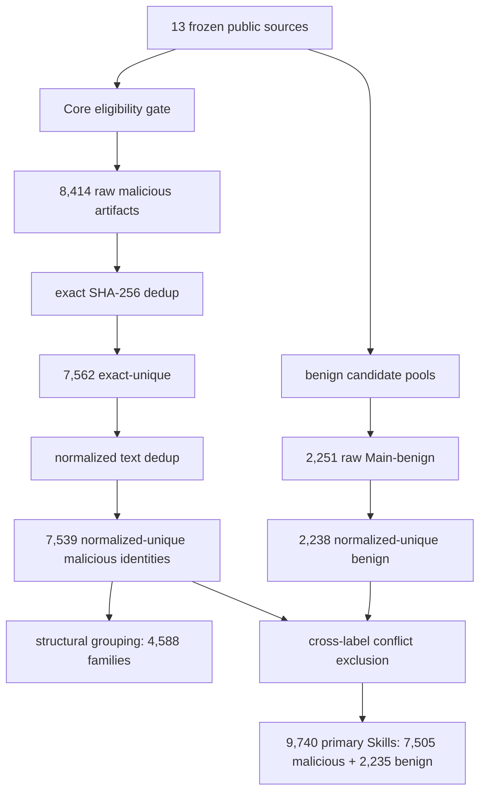

# MaliciousSkillBench：Agent Skill 恶意检测不能只看随机切分高分

### 元信息

| 项目 | 内容 |
|---|---|
| 论文 | MaliciousSkillBench: A Comprehensive Benchmark for Malicious Agent Skill Detection |
| 链接 | https://arxiv.org/abs/2608.19901 |
| 版本 | arXiv:2608.19901v1 |
| 时间 | arXiv API 标记 published/updated 为 2026-08-20T11:13:00Z |
| 项目页 | https://protectskills.github.io/MaliciousSkillBench/ |
| 主题 | AI 安全、Agent Skill 供应链、恶意 Skill 检测、source-disjoint evaluation |

### TL;DR

1. 这篇论文研究 Agent Skill 安装前的恶意检测：Skill 不只是提示词，还可能包含脚本、资源和服务配置，因此一旦被 Agent 当作可复用能力，就会成为新的供应链入口。
2. 作者不是简单拼接已有数据集，而是冻结 13 个公开来源，保守筛出 11 个 Core malicious 贡献源，把 8,414 条 raw malicious artifacts 规整成 7,539 个 normalized-unique malicious identities 和 4,588 个结构族。
3. 经过 benign pool 构建和跨标签冲突排除，主 benchmark 包含 9,740 个 normalized-unique Skills：7,505 个 malicious、2,235 个 Main-benign。
4. 论文把 4,983 个恶意身份映射到 11 类攻击；最大类是 Execution / Code Delivery，3,320 个，占 mapped subset 的 66.6%，其次是 Instruction / Goal Manipulation，1,671 个，占 33.5%。
5. 随机切分会高估检测器：三个 learned text detectors 的 Random Macro-F1 是 0.882-0.932，但 Source-Disjoint 只有 0.653-0.665；最强 word TF-IDF SVM 在 Source-Disjoint 下恶意召回 95.6%，但 benign FPR 高达 62.4%。
6. 三个 off-the-shelf scanner 也没有解决 trade-off：Cisco-local 误报低但恶意召回只有 2.5%，SkillFortify 召回 25.3% 但 benign FPR 49.9%，SkillSpector 在 Source-Disjoint 下恶意召回为 0.0%。
7. 论文最重要的边界是：恶意 Skill 检测不能只报告 malicious recall 或随机切分 F1，必须同时报告 source shift、结构复用、benign over-flagging 和标签证据强度。
8. 本文深读只讨论静态 benchmark 与检测评估，不复现恶意 Skill 的 payload、命令、端点或可执行细节；论文自己也声明 benchmark construction/evaluation 不执行 Skill 指令、helper code、installers、URLs 或 payloads。

### 1. 研究问题：Skill 为什么是新的 Agent 供应链边界？

Agent Skill 的安全问题不同于普通提示词注入。

1. **Skill 是可安装能力包。**
   - 它通常包含自然语言指令。
   - 也可能包含脚本、模板、资源、配置和服务连接信息。
   - 安装后会被 Agent 当作“可复用 procedural authority”。

2. **恶意 Skill 的威胁发生在安装前。**
   - 如果检测器放过恶意包，Agent 后续会把其中的流程当作可信能力。
   - 恶意行为可以表现为凭据窃取、行为操纵、触发式后门、隐藏副作用。
   - 这和单次工具响应里的间接提示注入不同，它更像能力供应链污染。

3. **已有数据资源不能直接相加。**
   - 不同来源发布的单位不同：完整 Skill、任务对、漏洞记录、marketplace 观察、scanner 信号。
   - 标签证据不同：人工/运行时、构造、静态、scanner silver。
   - benign coverage 极不均匀。
   - 同一或近似 Skill 会跨来源重复出现。

论文因此提出的核心问题是：

```text
如何构造一个既覆盖多来源恶意 Skill，又能真实评估检测器跨来源泛化和 benign 误报的 benchmark？
```

这不是单纯数据清洗问题，而是 benchmark validity 问题。

### 2. 论文主张：consolidate, not concatenate

论文的 claim → mechanism → evidence → boundary 可以写成：

| 层次 | 内容 |
|---|---|
| Claim | 恶意 Skill 检测需要综合多来源 benchmark，但不能把来源直接拼接成行。 |
| Mechanism | 冻结公开 source registry，保留 source-native 语义，做 canonicalization、deduplication、structural grouping、benign curation、conflict filtering。 |
| Evidence | 9,740-unit 主 benchmark 暴露随机切分与 source-disjoint 的巨大差距，尤其是 benign over-flagging。 |
| Boundary | benchmark 仍是静态检测；source shift 同时混合了来源、标签、格式、攻击构造和 benign 分布，不能解释成单一因果因素。 |

这句话里最重要的是“不拼接”。如果直接把已有 malicious rows 合并：

1. 重复内容会夸大规模。
2. 结构相近的变体可能同时出现在 train/test。
3. benign 例子不足会让“全判恶意”的模型看起来很强。
4. source style 会变成捷径，随机切分无法暴露部署问题。

### 3. Benchmark 构造：从 13 个来源到 9,740 个主单元

构造流程可以用 Mermaid 表示：



#### 3.1 Source eligibility：广泛收集，保守入 Core

论文冻结 13 个公开来源，但只有 11 个贡献 Core malicious artifacts。Core 条件包括：

1. 能恢复实际 Skill artifact。
2. 能保留 source-native malicious claim 和支持证据。
3. artifact 可以作为静态检测输入，且保持 inert。
4. 能追溯到 frozen source revision。

这导致一些安全相关材料只进入 Auxiliary：

| 情况 | 为什么不进 Core |
|---|---|
| task pair | 发布单位不是恶意 Skill artifact |
| vulnerability-only row | 说明弱点，但不等于 intentional malicious Skill |
| scanner verdict | silver 信号，不足以作为强 ground truth |
| MCP/OpenClaw config | 当前 benchmark Core 限定 Skill artifact |
| environment fixture | 攻击在环境里，不在 Skill package 里 |

这个设计避免把“可疑、脆弱、scanner 阳性、双用任务”统统折叠成 malicious。

#### 3.2 Canonicalization：不抹掉来源语义

论文的 canonical schema 保留多组字段：

| 字段组 | 作用 |
|---|---|
| Identity | 记录 canonical_id、source_id、source_record_id |
| Source snapshot | 记录 repository commit、dataset snapshot、paper version |
| Artifact / role | 区分 skill_package、skill_md、task_pair、mcp_config、fixture |
| Semantic labels | 保留 source_label、intent、provenance、ground_truth_strength、evidence_level |
| Content identity | 记录 skill_sha256 和 normalized_skill_sha256 |
| Lineage | 只保留来源支持的 parent/family 关系，不从相似性推断 |
| Release / safety | 记录 license、redistribution status、static content reference |

这里的原则是：

1. 统一格式不等于统一语义。
2. source-native label 要保留。
3. confidence 和 evidence level 要分开。
4. similarity 不能自动变成 lineage。

### 4. 去重与结构复用：三个概念不能混用

论文明确区分三类 relatedness。

| 概念 | 定义 | 作用 |
|---|---|---|
| Exact identity | acquired Skill content 的 SHA-256 完全相同 | 去掉 byte-identical 重复 |
| Normalized identity | 保守文本规范化后的 hash 相同 | 去掉格式等价内容 |
| Structural family | 静态相似度阈值 0.68 下的操作性结构族 | 做结构复用审计和 structural-disjoint split |

关键数字是：

1. 8,414 raw Core malicious artifacts。
2. 7,562 exact-unique。
3. 7,539 normalized-unique malicious identities。
4. 4,588 operational structural families。
5. 34 个 normalized identities 出现 malicious/benign 跨标签冲突。

这个处理支持一个重要判断：

```text
数据量、唯一内容、结构模板、攻击语义是四件不同的事。
```

如果不区分这些概念，评测会出现两类错觉：

1. 以为样本数很多，但其实重复或变体很多。
2. 以为模型跨任务泛化，其实只是见过相似 scaffold。

### 5. Benign pool：检测质量是双边的

恶意检测 benchmark 不能只有恶意样本。论文把 48,217 个 benign candidates 分成 Main 与 Auxiliary。

Main-benign 需要：

1. 有可检查的 Agent Skill artifact。
2. source semantics 支持 benign。
3. label strength 是 strong 或 moderate。
4. 有静态 primary Skill content。
5. 可追溯到 frozen source revision。

不进入 Main 的包括：

1. marketplace-unflagged。
2. scanner-clean。
3. silver 或 weak negative。
4. metadata-only。
5. non-Skill negative records。

最终 benign 路径是：

| 阶段 | 数量 |
|---|---:|
| raw Main-benign artifacts | 2,251 |
| exact-unique | 2,238 |
| normalized-unique | 2,238 |
| after conflict exclusion | 2,235 |

为什么这很关键？

1. 如果 benign 太弱，检测器学不到“正常 Skill 长什么样”。
2. 如果 benign 来源太窄，source-disjoint 时会把陌生 benign 全判恶意。
3. 如果只看 malicious recall，永远判恶意也会显得“很安全”。

### 6. 威胁版图：覆盖广，但来源差异很大

作者只对有 direct 或 strong-semantic source-native mappings 的 4,983 个 malicious identities 做 attack taxonomy 映射，不从 Skill 文本里推断缺失标签。

11 类攻击中，主要类别如下：

| Attack category | Count | Share of mapped subset |
|---|---:|---:|
| Execution / Code Delivery | 3,320 | 66.6% |
| Instruction / Goal Manipulation | 1,671 | 33.5% |
| Privilege / Tool Abuse | 1,013 | 20.3% |
| Data Exfiltration | 355 | 7.1% |
| Resource / Availability | 330 | 6.6% |
| Credential Access | 303 | 6.1% |
| Persistence / Control | 249 | 5.0% |
| Supply-Chain Abuse | 167 | 3.4% |
| Integrity / Output Manipulation | 97 | 1.9% |
| Defense Evasion | 34 | 0.7% |
| Discovery | 15 | 0.3% |

这张表要注意两个边界：

1. 分母是 4,983 个 attack-mapped units，不是全部 7,505 malicious。
2. 类别是 multi-label，所以百分比不能相加成 100%。

来源差异也很强：

1. SkillTrustBench 提供大量 Execution / Code Delivery 与 Instruction / Goal Manipulation。
2. MalSkillBench 覆盖更多混合来源。
3. 某些小源虽然数量少，但在 backdoor、wild 或 runtime evidence 上有独特价值。

因此，benchmark 的“comprehensive”不是每类攻击都均匀，而是尽量把来源异质性暴露出来。

### 7. Evaluation protocols：为什么 Source-Disjoint 是关键？

论文比较四种协议：

| Protocol | 想测试什么 |
|---|---|
| Random | 常规随机切分，作为 in-distribution 参考 |
| Source-Balanced Random | 控制来源比例的随机视角 |
| Malicious-Structural-Disjoint | 恶意侧结构族不跨 train/test |
| Source-Disjoint | 整个 held-out source 不进训练，测试来源迁移 |

Source-Disjoint 最接近部署压力，因为真实部署里新 Skill 来源往往同时改变：

1. 文档格式。
2. 攻击构造方式。
3. 标签标准。
4. benign 组织方式。
5. artifact packaging 风格。

但它也不能被过度解释成“单一 source effect”：

1. held-out source 混合了多个因素。
2. label distribution 与 benign/malicious 比例也变了。
3. 它测的是 source-conditioned stress，不是干净因果实验。

### 8. Learned detectors：随机高分掩盖了跨来源误报

三种 learned detectors 只使用 inert primary Skill instruction text：

1. Word TF-IDF + Logistic Regression。
2. Word TF-IDF + Linear SVM。
3. Char TF-IDF + Linear SVM。

主结果如下：

| Model | Random Macro-F1 | M-Struct Macro-F1 | Source-Disjoint Macro-F1 | Random benign FPR | Source benign FPR |
|---|---:|---:|---:|---:|---:|
| Word TF-IDF + LR | 0.882 | 0.860 | 0.661 | 0.105 | 0.620 |
| Word TF-IDF + SVM | 0.932 | 0.916 | 0.665 | 0.094 | 0.624 |
| Char TF-IDF + SVM | 0.921 | 0.883 | 0.653 | 0.098 | 0.644 |

最强 word-SVM 的变化很说明问题：

1. Random Macro-F1 是 0.932。
2. Malicious-Structural-Disjoint 仍有 0.916，说明结构族控制只带来有限下降。
3. Source-Disjoint 掉到 0.665。
4. Source-Disjoint 下恶意召回仍是 95.6%。
5. 但 benign FPR 是 62.4%，也就是大量 held-out benign 被判成恶意。

这说明模型不是“检测不到恶意”，而是“见到陌生来源就倾向于报恶意”。

### 9. Off-the-shelf scanners：低误报和高召回没有同时出现

论文还评估了三个固定 scanner：

1. Cisco-local-behavioral。
2. SkillFortify-offline。
3. SkillSpector-static。

Source-Disjoint operational comparison：

| Detector | Setting | Malicious recall | Benign FPR | Macro-F1 |
|---|---|---:|---:|---:|
| Word TF-IDF + SVM | learned | 0.956 | 0.624 | 0.665 |
| Cisco-local-behavioral | fixed scanner | 0.025 | 0.011 | 0.308 |
| SkillFortify-offline | fixed scanner | 0.253 | 0.499 | 0.349 |
| SkillSpector-static | fixed scanner | 0.000 | 0.006 | 0.281 |

可以看到三种操作点：

1. learned SVM：高召回，高误报。
2. Cisco/SkillSpector：低误报，但几乎漏掉恶意。
3. SkillFortify：召回略高，但误报仍接近 50%。

这就是论文最核心的 detector gap：

```text
没有一个已测方法能在 source shift 下同时做到高 malicious recall 和低 benign FPR。
```

对真实平台来说，这比随机 F1 更重要：

1. 误报高会阻断正常 Skill 生态。
2. 召回低会放过供应链攻击。
3. 只优化其中一边都会导致不可部署。

### 10. 混淆矩阵：62.4% benign FPR 是怎么来的？

Source-Disjoint word-SVM 的测试集包含：

1. malicious 839。
2. benign 545。
3. TP 802。
4. FP 340。
5. TN 205。
6. FN 37。

由此：

```text
malicious recall = TP / (TP + FN) = 802 / 839 ≈ 95.6%
benign FPR = FP / (FP + TN) = 340 / 545 ≈ 62.4%
```

这个例子非常适合解释为什么 security benchmark 不能只报 recall：

1. 如果只看 95.6% recall，检测器看起来很强。
2. 如果加入 62.4% benign FPR，就会发现它几乎把 held-out benign source 当成恶意 source。
3. 这意味着模型可能学到了来源、风格、模板，而不是稳定的恶意语义。

### 11. 论文的安全边界：静态、不执行、最小化有害内容

这篇论文处理的是双用安全数据，所以它的安全边界很值得注意。

作者明确：

1. benchmark construction 和 detector experiments 不执行 Skill instructions。
2. 不执行 helper code。
3. 不执行 embedded commands。
4. 不访问 payload URLs。
5. 不运行 installers、evaluators 或 test harnesses。
6. 五个包含敏感 credential material 的 malicious records 不公开 exact frozen text，只发布 sanitized representation。

本文也遵循同一边界：

1. 不复现恶意 Skill payload。
2. 不写具体命令、端点或 helper code。
3. 只讨论 benchmark schema、统计、协议和检测器表现。

这对 Agent 安全研究很重要：可复现不应等于可操作化攻击。

### 12. 局限与威胁到有效性

论文自己的局限可以拆成五类。

#### 12.1 Coverage 不是完整世界

MaliciousSkillBench 覆盖 13 个公开来源，但不代表所有 Skill 生态。

1. 私有 marketplace、企业内部 Skill、闭源插件不在范围内。
2. 某些来源只提供 metadata 或 partial artifacts。
3. Full package redistribution 受 upstream license 和安全策略限制。

#### 12.2 静态检测不能覆盖运行时行为

benchmark 用 static Skill text 作为主要输入。

1. 触发式后门可能需要运行环境。
2. 外部服务交互可能依赖网络状态。
3. 恶意行为可能隐藏在 installer、dependency 或远程资源里。

因此，MaliciousSkillBench 更适合作为安装前静态检测基准，不是完整 runtime assurance。

#### 12.3 Source-Disjoint 不是纯因果实验

Source held-out 同时改变很多变量：

1. attack construction。
2. benign composition。
3. 文档格式。
4. source labeling policy。
5. artifact availability。

所以它能测部署压力，但不能精确说明模型到底被哪个因素击穿。

#### 12.4 Benign 仍然稀缺

最终主 benchmark 里 benign 是 2,235，明显少于 7,505 malicious。

1. 这比没有 benign 好很多。
2. 但 benign source 的多样性仍不足。
3. 未来需要更多高置信 benign Skill，尤其是不同生态和不同格式下的 benign。

#### 12.5 Detector 范围有限

论文评估 classical text detectors 和三类 scanner。

1. 没有系统评估大型模型审计器。
2. 没有把 dynamic probing、sandbox execution、policy verifier 纳入主比较。
3. 没有解决多模态、远程资源、安装脚本和权限请求的联合检测。

### 13. 对 Agent 安全研究的意义

这篇论文给 Agent 安全带来三个明确启发。

#### 13.1 Skill 安全是供应链问题，不只是 prompt 问题

Skill 一旦安装，就成为 Agent 后续规划和执行的一部分。因此安全检查点应该前移：

1. 安装前审计 Skill package。
2. 记录 source provenance。
3. 标记权限与外部服务依赖。
4. 检查静态指令和 helper artifacts。
5. 在运行时继续做 policy enforcement。

#### 13.2 Benchmark 必须保留来源和证据语义

安全数据集经常把 label 简化成 malicious/benign，但这会丢失关键上下文。

| 维度 | 为什么重要 |
|---|---|
| provenance | wild、synthetic、injected、backdoored 的泛化难度不同 |
| evidence level | scanner silver 与 human+runtime 不能等价 |
| artifact unit | Skill package 与 task pair 不是同一种检测输入 |
| lineage | 来源支持的 parent/variant 关系不能由相似度自动推断 |
| redistribution | 可公开文本不等于可公开完整 package |

#### 13.3 误报也是安全风险

很多安全系统只强调“别漏恶意”。但在 Agent Skill 生态里，高误报会导致：

1. 正常 Skill 被拒绝。
2. 开发者绕过 scanner。
3. 平台形成不可用的审核瓶颈。
4. 用户转向非官方分发渠道。

因此，检测器应该同时优化：

```text
Utility = high malicious recall + low benign FPR + source-disjoint robustness
```

### 14. 结论

MaliciousSkillBench 的核心贡献不是“又收集了一个更大的恶意 Skill 数据集”，而是把 Agent Skill 检测 benchmark 的有效性问题拆开了。

它证明：

1. 多来源数据必须先 canonicalize、deduplicate、structural group 和 conflict filter。
2. malicious 与 benign 的证据强度必须分开处理。
3. 随机切分高分不能代表部署稳健性。
4. Source-Disjoint 会暴露 learned detectors 的 benign over-flagging。
5. off-the-shelf scanners 目前也没有同时满足高召回和低误报。

最值得带走的一句话是：

```text
Agent Skill 恶意检测的难点，不只是找到恶意；
还要在陌生来源下不把大量正常 Skill 当成恶意。
```

这让 MaliciousSkillBench 成为 AI 安全和 Agent 供应链研究的一个实用基准：它把攻击覆盖、来源异质性、benign ground truth、结构复用和检测 trade-off 放在同一张表里讨论。

### 15. Detail inventory：哪些细节支撑了论文主张？

把论文可核验细节列出来，可以看到它的强项和缺口。

| 维度 | 论文给出的细节 | 仍要谨慎的地方 |
|---|---|---|
| source registry | 13 个 frozen public sources、182,699 canonical registry records | public source 不等于完整生态，私有 Skill 分发没有覆盖 |
| Core malicious | 11 个来源贡献 Core malicious，8,414 raw artifacts | 某些来源需要历史 research snapshot 恢复 artifact |
| identity control | 7,562 exact-unique、7,539 normalized-unique | normalized 只处理保守文本等价，不处理语义等价 |
| structural control | 阈值 0.68 下 4,588 structural families，72 对 blind positive validation 全部同模板 | structural family 没有 campaign、actor、attack class 语义 |
| benign data | 2,251 raw Main-benign，冲突排除后 2,235 | benign 来源更少，source composition 仍偏 |
| conflicts | 34 个 normalized malicious/benign 跨标签冲突，主评测排除 | 排除避免自动裁判，但也减少了复杂边界案例 |
| attack taxonomy | 4,983 个 malicious identities 映射到 11 类攻击 | 只覆盖 66.4% primary malicious，不从文本推断缺失标签 |
| detector suite | 3 个 learned text detectors，3 个 off-the-shelf scanners | 没覆盖大型 LLM 审计器、动态沙箱和权限 verifier |
| release safety | 静态文本、hash、split、audit 公开；五个敏感 credential case 做 sanitized representation | 9,735 exact text 与 5 个 sanitized case 的复现实验输入不完全相同 |

这张表说明：

1. 论文最强的是 benchmark 方法论，不是某个检测器模型。
2. 数字链条从 raw artifact 到 final benchmark 可追踪。
3. 作者持续区分“用于描述全体 registry 的字段”和“用于主评测的 ground truth”。
4. 局限主要来自静态输入、公开来源覆盖和跨来源因果解释。

### 16. 标签语义：intent、provenance、strength、evidence 为什么要拆开？

很多安全 benchmark 会把所有样本压成二分类标签，但这篇论文拒绝这么做。它把四类语义分开：

| 轴 | 问题 | 例子 |
|---|---|---|
| intent | 这个 record 声称是什么？ | malicious、vulnerable、benign、uncertain、harmful_or_dual_use |
| provenance | artifact 怎么来的？ | wild、synthetic、injected、backdoored、test_fixture |
| ground-truth strength | 这个标签有多可依赖？ | strong、moderate、silver、weak |
| evidence level | 标签依据来自什么机制？ | human+runtime、runtime、static、scanner、constructed |

拆开以后，有几个容易混淆的判断会变清楚：

1. **scanner-positive 不等于 malicious Core。**
   - scanner verdict 是 evidence mechanism。
   - 如果没有更强 ground truth，它只能留在 Auxiliary 或 uncertain。

2. **vulnerable 不等于 intentional malicious。**
   - 一个 Skill 有漏洞，不代表它本身是恶意包。
   - 把 vulnerability row 当恶意会污染训练目标。

3. **synthetic 不等于弱标签。**
   - 受控构造的攻击可以有 strong/constructed evidence。
   - wild artifact 也可能只有 silver 或 moderate evidence。

4. **benign 也需要证据。**
   - “没有被 scanner 标记”不是高置信 benign。
   - Main-benign 必须有 artifact、source semantics、traceability 和 strong/moderate evidence。

这个标签设计对后续模型很重要。一个检测器如果只学 `malicious/benign`，可能会把 source 风格当标签；一个更好的系统应该把 provenance、evidence 和 artifact unit 当成不确定性来源，而不是把它们全部隐去。

### 17. 结构相似公式：0.68 阈值到底在控制什么？

论文附录给出 structural similarity 的组合形式，核心是多个静态特征的加权：

```text
sim = 0.36 * J_3gram
    + 0.28 * C_tfidf
    + 0.14 * J_struct
    + 0.12 * J_behavior
    + 0.10 * containment
```

变量含义可以这样理解：

| 变量 | 直观含义 |
|---|---|
| J_3gram | 文本 3-gram 的 Jaccard 相似 |
| C_tfidf | TF-IDF 余弦相似 |
| J_struct | 结构 token 或段落框架相似 |
| J_behavior | 行为/动作描述相似 |
| containment | 一个 artifact 是否大体包含另一个 |

阈值 0.68 下得到 4,588 个 operational structural families。这里要特别注意：

1. 它是 operational grouping，不是攻击家族归因。
2. 它不能说明两个 Skill 来自同一作者、同一 campaign 或同一恶意 payload。
3. 它的用途是防止结构复用让 train/test 太相似。
4. blinded validation 只验证“同模板”一致性，不验证恶意语义一致性。

这对 benchmark 很关键，因为 Skill 生态很容易出现模板化生成。随机切分如果把同模板变体分到 train/test 两边，模型会显得能泛化，实际只是记住了 scaffold。

### 18. 四种评测协议的统计口径

论文的 compact benchmark card 给了四种协议的规模：

| Protocol | train/dev/test | 用途 |
|---|---:|---|
| Random | 6,818 / 974 / 1,948 | in-distribution 参考 |
| Source-Balanced Random | 6,817 / 973 / 1,950 | source composition 诊断 |
| Malicious-Structural-Disjoint | 6,818 / 974 / 1,948 | 控制恶意结构族跨 partition 泄漏 |
| Source-Disjoint | 7,513 / 835 / 1,384 | held-out source 部署压力测试 |

Source-Disjoint 还有 8 个 cross-boundary exclusions，因为跨边界 multi-source normalized identities 被保守排除。这个细节说明：

1. 如果一个 normalized identity 同时属于多个 source，强行放进 held-out source 会破坏 disjointness。
2. 排除比手工归并更保守。
3. benchmark 的 split invariant 比保留所有样本更重要。

这种协议设计值得借鉴到其他 Agent 安全评测：

1. 工具投毒评测应有 tool-source-disjoint split。
2. memory poisoning 评测应有 scenario-family-disjoint split。
3. prompt injection 评测应有 app/workflow-disjoint split。
4. 只做 random split 很容易把模板和来源风格泄漏到测试集。

### 19. 为什么 source shift 下主要问题是 benign over-flagging？

论文的 Finding 2 可以拆成一个因果链。

```text
source-held-out
  -> benign style becomes unfamiliar
  -> text detector treats unfamiliar source conventions as suspicious
  -> malicious recall remains high
  -> benign FPR explodes
```

以 word-SVM 为例：

| Split | malicious recall | benign FPR | Macro-F1 |
|---|---:|---:|---:|
| Random | 0.965 左右恶意 F1 较高 | 0.094 | 0.932 |
| Source-Disjoint | 0.956 recall | 0.624 | 0.665 |

这说明 source shift 的主要错误不是漏掉恶意，而是误伤 benign。论文还给出 source-wise error：

1. SRC011 在 Source-Disjoint 中 benign 455 个，FP 293，FPR 0.644。
2. SRC012 在 Source-Disjoint 中 benign 90 个，FP 47，FPR 0.522。
3. 同一来源在 Random test 中的 benign FPR 明显低很多，因为训练已经暴露过该来源风格。

这对部署很现实：

1. 新 marketplace 或新 Skill 格式上线时，检测器可能把它们全部判成危险。
2. 安全团队会面对大量误报，最后可能调低阈值。
3. 调低阈值又会牺牲真实恶意召回。

### 20. Scanner trade-off：三种失败形态

off-the-shelf scanner 的结果可以按失败形态分类。

| 失败形态 | 代表 | 表现 | 部署后果 |
|---|---|---|---|
| 保守漏报 | Cisco-local、SkillSpector | benign FPR 低，但 malicious recall 很低 | 平台看起来误报少，但放过大量恶意 Skill |
| 宽松误报 | SkillFortify | recall 高一些，但 benign FPR 接近 50% | 正常生态被阻断，人工审核压力大 |
| 学习式过拟合来源 | word-SVM | source-disjoint recall 高但 FPR 62.4% | 见到陌生来源就广泛报警 |

这三种形态都不满足 Agent Skill 平台需求。更合理的检测栈可能需要分层：

1. 静态快速筛查，用于低成本初筛。
2. provenance 与 license/redistribution 检查，用于供应链风险。
3. 权限和外部服务分析，用于识别高危能力。
4. 沙箱或模拟运行，用于触发式和远程依赖。
5. LLM/verifier 审计，用于解释性风险判断。
6. 人工复核，只处理高风险不确定样本。

### 21. 与 MCP/插件生态的关系

虽然论文聚焦 Agent Skills，但它对 MCP 和插件生态同样有启发。

共同点：

1. 都是给 Agent 添加外部能力。
2. 都可能包含自然语言说明和结构化接口。
3. 都会成为模型规划时引用的“可信工具描述”。
4. 都可能通过供应链传播恶意行为。

差异点：

1. MCP server 更强调运行时 tool interface 和服务连接。
2. Skill 更像可安装 instruction package，可能携带脚本和资源。
3. 插件市场还会引入权限授权、用户账户和第三方 API。

因此 MaliciousSkillBench 的方法可以迁移，但不能直接等价使用：

| 对象 | 需要新增的 benchmark 字段 |
|---|---|
| MCP server | server manifest、tool schema、transport、auth scope、response trust boundary |
| browser/plugin extension | permission manifest、content script、background worker、update channel |
| coding agent skill | filesystem/network/shell 权限、repo write scope、secret access |
| enterprise agent app | tenant boundary、OAuth scopes、audit logs、admin approval |

这个延伸说明，Agent 供应链安全需要的不只是一个 scanner，而是一套 artifact-aware benchmark 方法。

### 22. 复现与治理：为什么 release contract 也属于论文贡献？

论文附录 L 给出 release layer 和 maintenance contract，这不是边角料。

发布层包括：

1. canonical registry。
2. identity and audit metadata。
3. primary static Skill text。
4. evaluation split assignments。
5. detector configurations。
6. redistributable artifacts。
7. restricted-source reconstruction adapters。

维护原则包括：

1. paper snapshot immutable。
2. 文档或引用澄清不改变 data bytes、labels、hashes、splits。
3. label/content/conflict correction 需要新 release。
4. source addition/removal 或 upstream revision 更新需要新 release。
5. 新 detector 或 leaderboard entry 不要求 benchmark-data version change，但必须记录模型、输入、配置、协议和 class-aware metrics。

这对安全 benchmark 很重要：

1. 恶意样本随时间会被下架、重写、修复或隐藏。
2. license 和 redistribution policy 会影响公开材料。
3. 如果不冻结 snapshot，论文数字很快不可复现。
4. 如果不版本化修正，旧结果和新数据会混在一起。

### 23. 后续研究问题

基于这篇论文，值得继续追问的问题有五个。

1. **动态检测如何和静态 benchmark 对接？**
   - 哪些 Skill 必须在沙箱里运行才能发现问题？
   - 如何防止 benchmark 变成可操作攻击集合？

2. **LLM 审计器能否降低 benign FPR？**
   - 大模型可能理解语义，但也可能被恶意文本诱导。
   - 需要 source-disjoint、attack-disjoint、benign-rich 的评测。

3. **权限模型如何进入数据标签？**
   - 仅标 malicious/benign 不够。
   - 应标读写执行、网络、凭据、外部账户和敏感数据流。

4. **source-disjoint 是否可以拆成更细的 causal factors？**
   - 可以做 artifact-format-disjoint。
   - 可以做 provenance-disjoint。
   - 可以做 attack-category-disjoint。
   - 可以做 benign-source-only shift。

5. **如何构建高置信 benign 生态？**
   - benign 不能只来自“未被举报”。
   - 需要人工、运行时、来源维护者和安全审计共同支撑。

这些问题说明 MaliciousSkillBench 更像起点：它把错误显性化，但没有把检测问题一次解决。

### 24. 使用这个 benchmark 时最容易犯的三个错误

#### 24.1 只看随机切分排行榜

如果一个新检测器只报告 Random Macro-F1，它很可能重复论文已经指出的问题：

1. 来源风格泄漏到测试集。
2. 结构相近样本跨 partition。
3. benign 误报没有被 source shift 放大。

更负责任的报告至少应包含：

| 必报指标 | 目的 |
|---|---|
| Random Macro-F1 | 作为 in-distribution 参考 |
| Source-Disjoint Macro-F1 | 测来源迁移压力 |
| malicious recall | 测漏报风险 |
| benign FPR | 测误报和可部署性 |
| class-wise confusion matrix | 防止一个总分掩盖类别失败 |

#### 24.2 把 structural family 当攻击家族

论文反复强调 structural family 只是 operational similarity。研究者如果把它当成攻击组织、campaign 或 malware family，会过度解释数据。

正确用法是：

1. 控制 train/test 结构复用。
2. 审计模板化生成。
3. 发现重复 scaffold。
4. 不做攻击归因。

#### 24.3 把静态检测结果当运行时安全保证

MaliciousSkillBench 的输入是静态 Skill text 或 sanitized representation。即使检测器在这个 benchmark 上表现好，也不能直接推出：

1. 安装脚本安全。
2. 网络请求安全。
3. OAuth scope 合理。
4. 运行时工具响应不会注入。
5. Agent 最终不会执行危险组合。

所以它更适合做安装前筛查基准，而不是完整 Agent 运行时安全认证。

### 25. 最小实践建议

如果要把这篇论文转成实际工程 checklist，可以从四步开始：

1. **入库前记录 provenance。**
   - Skill 来源、版本、hash、license、作者和更新渠道必须进入审计日志。

2. **扫描时区分风险类型。**
   - 代码执行、凭据访问、权限滥用、数据外传和目标操纵不应只有一个“恶意分”。

3. **评测时保留 benign 误报。**
   - 新来源下的 benign FPR 应作为发布门槛，而不是事后观察。

4. **部署时分层处置。**
   - 低风险正常放行。
   - 中风险进入人工或 LLM 解释审计。
   - 高风险需要沙箱、权限降级或拒绝安装。

这组建议与论文结论一致：可靠的 Skill 安全不是一次二分类，而是来源、证据、权限、结构和运行时行为共同约束的工程系统。
