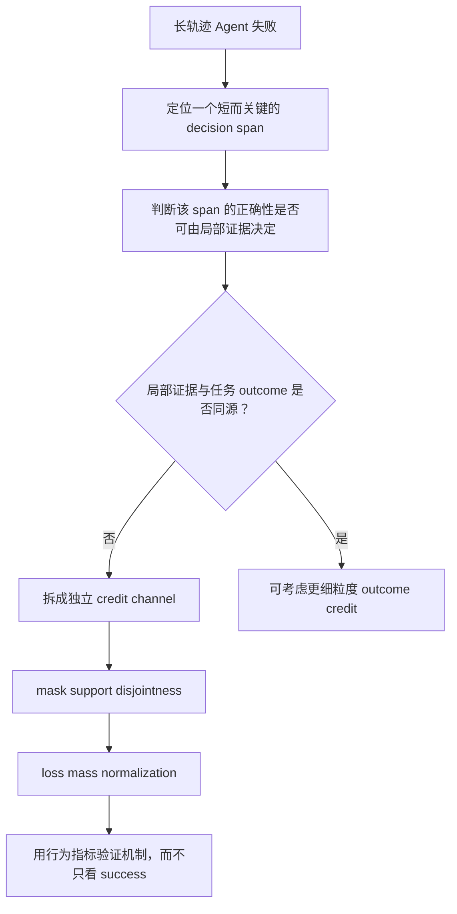

# SkillGate：把 Agent “读哪个技能”的几个 token 从长轨迹噪声里救出来

### 元信息与 TL;DR

| 字段 | 内容 |
|---|---|
| 论文 | SkillGate: Training In-Policy Skill Selection in Long-Horizon Agents |
| 作者 | Qingyao Li, Wenxiang Jiao, Shuai Shao, Kangning Zhang, Yuan Lu, Yi Guo, Weiwen Liu, Weinan Zhang, Yong Yu |
| 机构 | 上海交通大学；小红书 |
| 官方日期 | arXiv API 与提交历史均显示 v1 submitted on 2026-08-19 12:24:03 UTC；arXiv HTML 页面标记 Submitted on 19 Aug 2026 |
| 原文 | https://arxiv.org/abs/2608.18852 |
| 代码与模型 | 论文页指向 DeepExperience/SkillGate；GitHub API 显示该仓库是 SIMONLQY/SkillGate 的 fork。模型页为 simonlqy/SkillGate-9B，lastModified 2026-08-20T02:37:08Z |
| 分类 | 大模型后训练；Agent 技能选择；长轨迹 credit assignment |

**TL;DR**

1. **这篇论文研究的问题很窄，但很关键**：当 Agent 面前有 16 个 `SKILL.md` 候选时，策略必须在执行中途只根据 name 和 description 决定读哪个文件；现有 outcome-only RL 会把这几个选择 token 淹没在几万 token 的执行轨迹里。
2. **作者把失败命名为 selector credit starvation**：在 12,800 条 outcome-only 训练轨迹审计中，skill name tokens 的 median loss-weight share 只有 **0.14%**，并随轨迹长度约 **7 倍稀释**；约 **two in five** 的 oracle-read tokens 还继承负 advantage，因为后续执行失败。
3. **SkillGate 的核心不是新 reward，而是切分 token support**：task channel 删除整个 read call，只把 terminal outcome 的 GRPO advantage 给 execution tokens；selector channel 只给 skill identity tokens 一个 action-local advantage。
4. **selector utility 很严格**：只有整条轨迹恰好读一次、且读的是 oracle skill，utility 才是 1；读错、读多个、先读 oracle 后又读别的，都记为 0，并在同一 prompt group 的 read actions 上中心化。
5. **主实验使用 9B policy、491 个训练任务、8 rollouts/prompt、100 步 on-policy GRPO、16-candidate mixed slate**；评测是 5 个 agentic benchmarks 的 **385-trial protocol**。
6. **主结果是行为和任务同时改善**：SFT overall 40.8%，outcome-only SkillRL 47.0%，SkillGate 53.2%；oracle read 从 54.3% 升到 83.9%，misleading read 从 69.6% 降到 21.8%。
7. **消融说明“credit 落在哪里”比“有没有 selector 信号”更重要**：group-level regret 和 trajectory bonus 都没提升成功率；first-oracle action credit 能改善选择，但不惩罚多读；clean single-oracle 规则把 280-trial success 提到 50.0%，reads/trial 降到 1.11。
8. **边界也很清楚**：每个配置是 single run；bootstrap 只支持 pooled trial success 的区间排除 0，不支持 pass@4 显著性；方法需要训练集中知道正确 skill，且不能直接给“应该不读任何 skill”的 abstention 行为正 credit。

### 研究问题：为什么“给 Agent 一个技能库”仍然不够？

这篇论文的起点不是普通 RAG，而是 **progressive disclosure 的技能库**：

| 对象 | Agent 读前可见 | Agent 读后才知道 |
|---|---|---|
| skill name | 可见，是短 token span | 不变 |
| one-line description | 可见，用于路由判断 | 不变 |
| `SKILL.md` body | 不可见 | 读文件后进入 observation |
| candidate slate | 一次给 16 个候选 | 只有被打开的 body 进入上下文 |

作者关心的是一个中间决策：

1. Agent 不是先由外部 router 决定技能，再执行。
2. Agent 自己在 episode 中发出 read tool call。
3. read call 里真正决定“读哪个文件”的，是 path 里的 skill name。
4. 这个 skill name 通常只有几个 token，但它会决定后续所有执行信息。

换句话说，skill selection 在轨迹里的位置很尴尬：

- 它像 action selection，因为换一个名字就读到不同知识。
- 它又像 routing，因为判断依据只来自任务和候选描述。
- 它还会被普通 RL 当成长序列中的少量 assistant tokens。

论文要回答的问题是：

> 如果最终 reward 只来自任务成功，policy gradient 能不能自然学会读正确 skill？

作者的回答是否定的，而且给出一个结构性原因：

> 不是 reward 不够聪明，而是 reward 被广播到整条轨迹时，选择 skill 的几个 token 得到的信号太少、太晚、太常错符号。

### 论文主张与论证路线

作者的论证可以压缩成四段：

| Claim | Mechanism | Evidence | Boundary |
|---|---|---|---|
| outcome-only RL 学不会可靠 skill selection | sequence-level advantage 广播给全部 assistant tokens，skill identity span 只占极小比例 | 12,800 条训练轨迹审计显示 median share 0.14%，长度越长越稀释 | 这是 loss weight share，不等同于实际 gradient norm |
| 正确选择可能被负向更新 | oracle skill 被读对，但任务执行失败时，oracle identity tokens 也继承负 advantage | nearly two in five oracle reads 继承负 advantage，最长轨迹超过 coin-flip line | 这是 outcome-only run 的离线审计，不是随机干预 |
| 正确选择确实有价值 | 同 prompt group 中比较 read oracle 与 not read oracle 的成功差 | matched prompt groups 显示 +11.2 pp；oracle-only injection 对 frozen executor 也接近这个量级 | 组内条件比较不是完整因果实验，oracle-only injection 才是更接近干预的对照 |
| SkillGate 能隔离这个失败 | 把 execution tokens 和 skill identity tokens 放进两个不重叠 channel | 385-trial overall 53.2%，高于 outcome-only 47.0%；misleading exposure 大幅下降 | single run；需要 oracle skill 标注；不能给 abstention 正 credit |

这条路线的关键，是作者不把问题写成“更精细的 reward shaping”。他们反复强调：

- task 成败仍然来自 verifier 的 terminal reward；
- selector 信号不是给整条轨迹加 bonus；
- selector loss 只落在 policy 自己生成的 identity tokens；
- skill body 是 observation，不被训练。

这使 SkillGate 更像一种 **credit support partition**，而不是一个新的外部评测器。

### 方法机制：一个轨迹，两条互不重叠的 credit channel

论文的 Figure 2 给出整体机制。下面这张图已本地化，原图来自 arXiv HTML：


图中最重要的不是“蓝色模块多”，而是三个 mask 的关系：

| span | 训练归属 | 为什么这样分 |
|---|---|---|
| `C(a)` whole read call | 从 task loss 删除 | 避免任务成功/失败直接更新选择动作 |
| `I(a)` identity span | selector channel | 只让 skill name token 承担“选哪个 skill”的 credit |
| call wrapper | 两边都不训 | function markup 不是具体 skill 身份 |
| execution tokens | task channel | 任务 outcome 只评价执行质量 |
| observation 中的 skill body | 不训 | 它不是 assistant 生成 token |

#### 变量定义

| 变量 | 含义 |
|---|---|
| `tau` | 一条完整 agent trajectory |
| `G` | 同一 prompt/task 的 rollout group，论文训练中为 8 条 |
| `R(tau)` | terminal verifier 给出的 task score，范围 `[0,1]` |
| `A(tau)` | trajectory 中所有 attributed skill read actions |
| `C(a)` | read action 的整个 tool-call token span |
| `I(a)` | read action 里 skill name 的 identity token span |
| `s*` | 当前 task 的 oracle skill |
| `lambda` | selector loss 系数，论文 profile 固定为 0.20 |

#### Task channel

Task channel 使用普通 GRPO 的组内标准化 outcome advantage：

```text
A_task(tau) = (R(tau) - mean_G(R)) / (std_G(R) + epsilon)
```

但它不是广播到所有 assistant tokens，而是先做 mask：

```text
execution support = assistant tokens - union(read call spans)
```

这一步的含义很强：

1. 如果读对了 skill 但后面写代码失败，task loss 不会惩罚 skill name。
2. 如果读错了 skill 但后面靠模型能力完成任务，task loss 也不会奖励错误 skill name。
3. task channel 仍然训练执行、推理、其他工具调用和最终交付。

#### Selector channel

Selector channel 的 utility 更像一个局部分类信号，但它不是 teacher forcing：

```text
u(a) = 1, if trajectory tau_a has exactly one read action and a reads s*
u(a) = 0, otherwise

A_sel(a) = u(a) - mean_{a' in A(G)} u(a')
```

这个定义包含几个不容易替代的约束：

1. **按 action 中心化，不按 trajectory 中心化**：多读的 sibling 会贡献更多 read actions，也会拉低 baseline。
2. **读 oracle 后再读多个也不给 credit**：防止策略靠“读一堆”买到 selector 奖励。
3. **全组没有 clean oracle 或全是 clean oracle 时 channel 静默**：没有组内差异就不强推。
4. **off-slate read 不能借 outcome 洗成正信号**：它会从 task mask 删除，但没有 selector 正 credit。

#### Loss mass normalization

论文还处理了一个细节：如果只把 few identity tokens 加进 selector loss，它们又会因为 token 少而重新被饿死。

作者设置：

```text
N = batch 中原始 assistant-token loss mask 的总质量
N_task = 删除 read calls 后 task mask 的总质量
M = 有非零 selector advantage 的 read actions 数

w_task_t = (N / N_task) * m_task_t
w_sel_t = N / (M * |I(a)|), for t in I(a)
```

因此在有 selector action 时：

```text
sum_t w_task_t = N
sum_t w_sel_t = N
```

这不是说两个 loss 的数值或 gradient norm 一定相等；它只是保证：

- 删除 read calls 不会悄悄降低 task channel 学习率；
- 每个 credited read action 的总权重与轨迹长度无关；
- selector 相对强度由 `lambda=0.20` 显式控制。

最终目标函数可以写成：

```text
L(theta)
 = sum_t w_task_t * clip_GRPO(r_t(theta), A_task(tau_t))
 + lambda * sum_t w_sel_t * clip_GRPO(r_t(theta), A_sel(a_t))
 + beta * KL(theta || theta_ref)
```

这里的 `r_t(theta)` 是当前 policy 相对 rollout policy 的 token importance ratio，`beta` 在模型页和论文中为 `3e-5`。

### 代码证据：论文机制是否真的落到了实现里？

候选项目 README 和代码库给了几个可核验入口：

| 文件 | 证据点 |
|---|---|
| `Relax/examples/agent_bench/selector_clean_oracle_action_credit.py` | clean-oracle utility；group action baseline；alignment/parse/span mismatch fail closed |
| `Relax/examples/agent_bench/selector_action_credit.py` | skill path parser；identity token span attribution；task/selector weight 构造 |
| `Relax/examples/agent_bench/selector_action_grpo_loss.py` | 一个 forward pass 内执行 task PPO 与 selector PPO；检查 support overlap |
| `ops/workflows/rl_training/profiles/selector_clean_oracle_action_credit.sh` | 固定 slate16、491 train tasks、56 eval tasks、8 samples/prompt、global batch 128、100 rollouts、lr 1e-6、selector coef 0.20 |
| `docs/OPERATIONS_GUIDE.md` | 项目是多流水线系统：数据准备、轨迹采集、SFT、RL、eval；大体积输入通过 HF assets 恢复 |

实现中几个点值得注意：

1. `EXPECTED_GROUP_SIZE = 8`，`EXPECTED_SLATE_SIZE = 16`。
2. slate 要满足 1 个 oracle、5 个 misleading、5 个 relevant、5 个 irrelevant。
3. read action attribution 要匹配 parser、dispatch 和 tokenizer offsets。
4. 任何 `alignment_mismatch`、`parse_dispatch_mismatch`、`span_mismatch` 都会触发错误或过滤。
5. `build_train_fields` 会断言 task weights 与 selector weights 没有重叠。
6. custom loss 中如果 `task_weights > 0` 且 `selector_weights > 0` 同时出现，会直接 raise。
7. profile 禁用其他历史 reward/bonus/regret/pair 开关，避免把 SkillGate 效果和别的信号混起来。

这说明论文的关键主张在代码里不是“注释级别”存在，而是被做成了 profile gate 和 runtime assertion。

### 实验设置：为什么这些数字能说明问题？

#### 数据与任务

| 设置 | 数值或规则 |
|---|---|
| 候选 slate | `K=16` |
| oracle | 1 个，专为任务写且经验证可解 |
| misleading | 5 个，主题相近但功能错误 |
| relevant | 5 个，来自公共技能库 |
| irrelevant | 5 个，来自公共技能库 |
| public skill library | 2,045 community skills |
| 训练任务 | 491 tasks，不含 Claw-Eval |
| 训练 rollout | 8 rollouts/prompt |
| 训练步数 | 100 steps on-policy GRPO |
| 评测 budget | 30 turns；850 seconds |
| 模型起点 | Qwen3.5-9B SFT checkpoint |

#### 385-trial protocol

Appendix 说明主表不是单一 benchmark 的平均，而是两个部分拼接：

| 部分 | 组成 | trial 数 |
|---|---|---:|
| non-Claw | SkillsBench、SETA、SWE、Terminal-Bench 2.0 共 56 tasks，每个 4 repeats | 224 |
| Claw-Eval | 161 tasks，每个 1 trial；其中 147 个是 disjoint held-out | 161 |
| 合计 | trial-level success 汇总 | 385 |

这个设计有一个重要后果：

1. pooled overall 是 trial-level metric。
2. Claw 与非 Claw 的 repeat 结构不同。
3. 作者没有把它写成 task-level pass@R。

#### Baselines

作者分了四类 baseline：

| 类型 | 作用 |
|---|---|
| Qwen3.5-9B / 27B | 看不训练时的基础能力 |
| frontier references | DeepSeek-V4、GLM-5、Kimi、397B 等能力参考，不是受控 baseline |
| Selection BC / SelSkill-DPO | 专门训练“读 oracle”或偏好 oracle |
| Skill-free RL / outcome-only SkillRL / Skill1 / Task-mask only | 区分 task RL、读技能、mask read call 和 selector local credit |

最干净的对照是：

```text
SkillGate vs SkillRL(outcome only)
```

因为二者共享：

- base model；
- SFT init；
- data；
- steps；
- hyperparameters；
- mixed slate；
- evaluation protocol。

差异集中在：

```text
gradient reaches which tokens
```

### 主结果：任务成功率和读技能行为一起变了

| Method | Overall success | Oracle read | Misleading read | 解释 |
|---|---:|---:|---:|---|
| SFT (RL init) | 40.8 | 37.9 | 61.8 | 会读，但经常读错 |
| Selection BC | 44.7 | 71.4 | 31.4 | 选择更像 oracle，但执行提升有限 |
| SelSkill-DPO | 46.2 | 66.1 | 51.8 | preference 能提高 oracle，但误读仍高 |
| Skill-free RL | 46.0 | 35.4 | 55.0 | 没有 skill 训练也能靠任务 RL 提升 |
| SkillRL outcome-only | 47.0 | 54.3 | 69.6 | 更爱读，但 misleading 更高 |
| Task-mask only | 46.0 | 48.9 | 73.6 | 仅删除 read call task loss 不够 |
| **SkillGate** | **53.2** | **83.9** | **21.8** | 选择更准、读得更少、任务更好 |

主结果有三个层次：

1. **成功率层**：SkillGate 在 9B-scale rows 中总体最高，overall 53.2%，比 outcome-only 的 47.0% 高 6.2 pp。
2. **行为层**：oracle read 增加，misleading read 大幅下降；这不是单纯“读更多”的副作用。
3. **泛化层**：Claw-Eval 不在训练任务里，且 evaluation oracle identities 与训练 disjoint；Claw 97/161 成功，高于 outcome-only 92/161。

但也要避免过度解释：

- frontier rows 是能力 ceiling/reference，接口用 native function calling，不能当严格控制组。
- SkillGate 还没有超过最强 frontier reference 的 overall success。
- 单项 benchmark 的 bootstrap 区间宽，论文只对 pooled trial success 更有把握。

### 消融：为什么 clean single-oracle 规则是必要的？

论文的 credit-design ablation 用 280-trial protocol，对比五种 selector 信号落点：

| Design | Credit 落点 | Trial success | Clean single-oracle | Oracle | Misleading | Reads/trial |
|---|---|---:|---:|---:|---:|---:|
| SkillRL outcome-only | 没有 selector credit | 42.1 | 21.4 | 54.3 | 69.6 | 1.88 |
| Group-level regret | prompt group | 41.8 | 15.7 | 33.6 | 47.5 | 1.23 |
| Trajectory bonus | whole trajectory | 41.8 | 33.9 | 47.9 | 55.4 | 1.33 |
| Action credit | first oracle read | 45.0 | 64.6 | 80.0 | 32.5 | 1.26 |
| **SkillGate** | only read, if oracle | **50.0** | **75.4** | **83.9** | **21.8** | **1.11** |

这张表说明了三种常见替代方案为什么不够：

1. **Group-level regret**：信号没有落到 skill identity tokens，无法告诉哪个 action 选得好。
2. **Trajectory bonus**：会鼓励“多读”，oracle 和 misleading 可能一起上升。
3. **First-oracle action credit**：能训练名字，但不惩罚后续继续读多个候选。

SkillGate 的 clean single-oracle 规则把目标从“有没有读到 oracle”改成：

```text
exactly one attributed read AND that read is oracle
```

这很像把 selection 任务定义成：

1. 先判断应该读；
2. 再从 slate 中选一个；
3. 最后避免靠多读覆盖错误。

### Figure 5：为什么 outcome-only credit 的失败会随 horizon 变严重？

Figure 5 的 SVG 已本地化，原图来自 arXiv HTML：


这张图的作用不是展示 SkillGate 成绩，而是验证失败机制：

| Panel | 测什么 | 说明 |
|---|---|---|
| a | read call 与 skill name tokens 的 loss-weight share | 选择 token 的 share 很小，且随轨迹长度下降 |
| b | read-vs-not advantage gap 的 signal-to-noise | 长轨迹里组内信号变弱 |
| c | oracle reads 继承负 advantage 的比例 | 读对也可能因为后续执行失败被惩罚；SkillGate 中该项为 0 by construction |

这里最值得记住的是：

```text
选择 skill 的价值不随 token share 消失；
但 outcome-only loss 给它的权重会随执行轨迹变长而消失。
```

这也是为什么作者不满足于 per-turn reward 或 trajectory bonus：

- 如果 credit 仍由 terminal outcome 派生，oracle-read 但执行失败的问题仍存在。
- 如果 credit 不落到 identity span，policy 不知道具体哪个名字应该变得更可能。
- 如果 credit 不惩罚多读，策略可能把 slate 当成 cheap context loading。

### 外部 selector 是否足够？

论文还问了一个现实问题：

> 如果我们单独训练 router，是否比让 policy 自己学会读 skill 更简单？

280-trial protocol 的表给出结果：

| Setting | Trial success | Top-1 oracle | Oracle | Misleading | Reads/trial |
|---|---:|---:|---:|---:|---:|
| SFT standard mixed slate | 37.1 | - | 37.9 | 61.8 | 1.34 |
| SFT + read only one prompt | 35.0 | - | 41.4 | 59.3 | 1.35 |
| SFT-9B router -> SFT | 40.7 | 60.0 | 57.5 | 36.8 | 0.94 |
| Qwen3.5-27B router -> SFT | 36.8 | 68.6 | 68.2 | 24.3 | 0.95 |
| Qwen3 reranker top-1 -> SFT | 31.8 | 27.1 | 24.6 | 60.4 | 0.89 |
| **SkillGate, standard slate** | **50.0** | 78.9 | 83.9 | 21.8 | 1.11 |
| oracle-only -> SFT | 48.2 | 100.0 | 93.6 | 0.0 | 0.94 |
| oracle-only -> SkillGate | 52.9 | 100.0 | 93.6 | 0.0 | 0.94 |

这组实验的含义不是“router 没用”，而是：

1. **prompt 约束不够**：让 SFT “read only one” 没有修好行为。
2. **router top-1 准确率不是下游成功率**：27B router top-1 更高，但 downstream success 更低。
3. **执行能力和选择能力相互耦合**：SkillGate 从完整 slate 自己选，反而超过 oracle-only -> frozen SFT 的 48.2%。

因此，Agent 训练里“选择什么上下文”和“如何使用上下文”不能完全拆开看。

### 失败案例与机制细读：作者真正反对的是什么？

论文里最有解释力的案例，不是某个 benchmark 的总分，而是 README 中的 `lake-warming-attribution` episode。

| 对照 | 行为 | 结果含义 |
|---|---|---|
| SkillGate run | 在 6 个 lake/trend lookalikes 中读到 oracle；14 个 tool calls 后拿到 1.0 score | 说明策略不是简单少读，而是能在相似描述里挑出有用过程知识 |
| outcome-only baseline | 同 slate 读了 4 个 skills，没有一个是 oracle，最终失败 | 说明 outcome-only 可能学成“多翻资料”，而不是“先判断哪份资料最对” |

这个案例把论文的三层失败连起来：

1. **读前信息不足**：Agent 只看 name 和 one-line description，无法读取所有 body 后再决定。
2. **读后影响很大**：一旦读错，后续观察、推理和工具调用都会被错误过程知识带偏。
3. **终局 reward 太粗**：最终失败会惩罚整条轨迹，分不清“选择错”还是“选择对但执行错”。

因此作者真正反对的不是 RL，也不是 skill library，而是以下训练假设：

```text
只要最终任务 reward 足够多，
长轨迹中所有重要中间决策都会自然学好。
```

SkillGate 的实验恰好展示了相反情况：

- outcome-only SkillRL 的 success 从 SFT 40.8% 提到 47.0%，说明 task RL 有用。
- 但 misleading read 从 61.8% 升到 69.6%，说明它同时放大了错误读技能行为。
- Task-mask only 把 read call 从 task loss 中拿掉，success 回到 46.0%，misleading 还升到 73.6%，说明“停止错误惩罚”不等于“学会正确选择”。
- SkillGate 既给正负 selector 信号，又把多读作为 0 utility，才把行为推到 oracle 83.9%、misleading 21.8%。

### Figure 与 Table 逐项证据解读

#### Figure 1：诊断图，而不是方法图

Figure 1 的作用是证明“选择 token 被饿死”不是直觉：

| 组件 | 论文想让读者相信什么 | 不能证明什么 |
|---|---|---|
| top schematic | 一个 broadcast advantage 同时更新 read call 和 execution tokens | 不能说明所有 task 都同等受害 |
| Share | skill name tokens 的 loss share 极低，长度越长越低 | 不能直接推出 gradient norm 一定同等比例缩小 |
| Sign | oracle read 也常拿到负 advantage | 不能说明所有负 advantage 都是错误标签；它只说明 credit 与局部选择错位 |
| Value | 组内 oracle read 与成功率有 +11.2 pp 关系 | 这是条件比较，不是完整随机干预 |

#### Figure 2：方法图的关键是“剪刀”

Figure 2 里 task channel 前面的剪刀，是整篇论文的机制核心：

1. 剪掉 `C(a)`，意味着 execution loss 不再接触选择动作。
2. 只保留 `I(a)` 给 selector，意味着 wrapper、function name、path 其他部分都不被误训。
3. 两个 channel 都在同一个 GRPO update 里，所以训练不是先训 router 再训 executor。
4. 图右侧的 `m_task * m_sel = 0`，在代码里对应 support overlap assertion。

#### Table 1：主结果要同时看 success 和 exposure

只看 overall success，会低估论文贡献；因为 53.2% 对 47.0% 是 6.2 pp。

但把行为列一起看，差异更大：

```text
oracle read:      54.3 -> 83.9
misleading read:  69.6 -> 21.8
overall success:  47.0 -> 53.2
```

这说明 SkillGate 的主要收益不是“模型突然会做所有任务”，而是：

- 它更常把正确过程知识加载进上下文；
- 它更少把 hard negative skill 当作上下文；
- 它没有靠增加 reads/trial 来换成功率。

#### Table 2：ablation 解释了为什么不能只加 bonus

Table 2 的顺序像一个逐步排错实验：

1. Group-level regret 失败，说明 credit 不到 action token 就没法学具体名字。
2. Trajectory bonus 失败，说明整条轨迹 bonus 会把“读”本身和“读对”混在一起。
3. Action credit 成功一半，说明 identity-token local credit 是必要条件。
4. Clean single-oracle 最好，说明“读一次且读对”才是任务定义。

这类消融比单纯换 baseline 更有价值，因为它把机制拆成可反驳的最小部件。

### 训练协议中的几个容易误读点

#### `clean oracle` 不是“oracle-only prompt”

SkillGate 训练时，Agent 仍然看到完整 16-candidate slate：

| 项 | SkillGate 训练 | oracle-only ceiling |
|---|---|---|
| 候选数量 | 16 |
| 是否知道答案 | 不知道 |
| selector 信号 | 训练后通过 identity tokens 学到 |
| oracle-only 注入 | 否 |
| 作用 | 正常方法 |

oracle-only row 是诊断上界：

- 它告诉我们“如果 frozen executor 被明确给到正确 skill，能提升多少”。
- 它不代表可部署方法，因为需要事先知道答案。

#### `single read` 不是简单的 prompt 约束

论文对比了 `SFT + "read only one" prompt`，success 反而是 35.0%，没有修好问题。

这说明 single-read 行为不是自然 instruction following：

1. 模型可能读多个，因为不确定哪个 skill 对。
2. 模型可能读错后再补读，因为第一个 observation 没解决问题。
3. outcome-only reward 可能奖励这种 trial-and-error。

SkillGate 的 single-read 规则不同：

- 它不是推理时硬禁止多读。
- 它是在训练 credit 中规定多读没有 selector utility。
- 因此它塑造的是策略的选择分布，而不是靠外部 runtime 阻断。

#### `misleading exposure` 不是越低越好那么简单

未训练 Qwen3.5-9B 的 misleading exposure 只有 8.9%，看似比 SkillGate 更低。

但这是因为它几乎不读：

| Method | Any read | Oracle | Misleading | 解释 |
|---|---:|---:|---:|---|
| Qwen3.5-9B | 15.0 | 5.7 | 8.9 | 低 misleading 主要来自 abstention |
| SkillGate | 98.2 | 83.9 | 21.8 | 高读取率下仍能压低 misleading |

所以读行为要同时看：

```text
Any read
Oracle exposure
Misleading exposure
P(oracle | read)
Reads/trial
```

单独拿 misleading exposure 做安全指标，会把“不用技能”和“安全选择技能”混为一谈。

### 对 AI 安全与 Agent 工程的有限启发

这篇论文不是安全 benchmark，但它对安全训练很有参考意义。

#### 环境注入与 misleading skill 的共同结构

两者都包含一个相似结构：

| 训练对象 | 正常信息 | 干扰信息 | 风险 |
|---|---|---|---|
| SkillGate slate | oracle skill | misleading hard negatives | Agent 读错过程知识 |
| 环境注入 | 用户目标、可信上下文 | 页面、文件、消息里的 adversarial instruction | Agent 执行非用户意图 |

共同点是：

1. 错误信息常常看起来相关。
2. 错误选择发生在执行早期。
3. 后续执行成功与否不能干净解释这个早期选择是否正确。

如果把最终任务成功当作唯一 reward，模型可能学到：

- 多读更多上下文；
- 在危险上下文里试错；
- 偶然成功时奖励了不该奖励的暴露行为。

#### 但不能把 SkillGate 直接说成防御

边界必须写清：

1. SkillGate 的 oracle/misleading 标签来自 benchmark 构造。
2. 真实环境注入没有天然 oracle skill。
3. 它没有评测 adversarial instruction following、data exfiltration 或 policy compliance。
4. 它优化的是选择正确技能，不是识别恶意文本。

更合理的研究延伸是：

```text
把“是否读取不可信 artifact”或“是否调用高风险 tool”
定义成可定位的 action span，
再寻找比最终任务成功更局部、更可信的 utility。
```

这才是 SkillGate 对安全后训练的真正启发。

### 与相关工作的关系

这篇论文处在三个方向的交叉处：

| 方向 | 代表问题 | SkillGate 的位置 |
|---|---|---|
| skill retrieval / routing | 候选描述怎样写、如何检索、如何 rerank | 不改候选表示，不加外部 router，而是训练 policy 自己的 read action |
| long-horizon credit assignment | terminal reward 如何分配到多轮 tool-use 轨迹 | 只切一个关键 decision span，不尝试给所有步骤细分 reward |
| skill-oriented RL | 技能如何生成、内化、共同进化 | 不生成 skill，不训练 skill body，而是训练从 slate 中选择哪个 body |

与 Agent Lightning、turn-level credit、process reward 等工作相比，SkillGate 的特殊性在于：

- 它不是把 trajectory 切成很多 transition。
- 它只对一个可定位的 action identity span 动手。
- 它的 selector utility 不来自最终 outcome。
- 它保留同一个 policy 和同一个 rollout，不引入额外 inference scaffold。

这使它适合一个很具体的场景：

```text
Agent 已经有技能库；
技能通过 progressive disclosure 暴露；
每个训练任务知道 oracle skill；
错误主要来自“选错或多读”，不是 skill body 本身不可用。
```

### 证据边界与可复现性

#### 作者已经承认的边界

| 边界 | 为什么重要 |
|---|---|
| 每个配置是 single run | 训练成本高，缺 seed replication；小差异不能过度解释 |
| 需要 oracle skill | 如果训练任务不知道正确 skill，clean-oracle utility 无法定义 |
| 不能 credit abstention | 当正确行为是不读任何 skill 时，当前 action-local 方案没有正例 |
| frontier rows 不是 controlled baseline | native function calling 与接口适配不同 |
| pass@4 bootstrap 不排除 0 | trial-level pooled improvement 更稳，task pass@4 证据弱 |
| assets 与完整 rollout 不全在 Git | 仓库是精简发布版，大体积输入和证据通过 HF assets 恢复 |

#### 还有几个需要读者自己保持警惕的点

1. **oracle skill 的构造成本**：论文需要每个训练 task 有一个已验证 oracle，真实企业技能库可能没有这个标签。
2. **misleading skills 的分布**：5 个 hard negatives 是否代表真实技能库中的混淆模式，会影响方法收益。
3. **single-read 规则的偏置**：它适合“一个任务一个关键 skill”的设置；复杂任务可能需要组合多个 skills。
4. **能力与选择的耦合**：SkillGate 提高 selection 后，执行失败仍然会限制任务成功；它不是通用 agent RL 解法。
5. **安全侧含义有限但重要**：减少 misleading read 可能降低错误上下文暴露，但论文没有把它评成 prompt injection 防御。

### 研究者视角：这篇论文为什么值得跟踪？

这篇论文的价值在于提出一个可复用的分析模板：



这个模板可以迁移到其他 Agent 决策：

| 场景 | 可能的 identity span | 局部 utility 可能来自哪里 |
|---|---|---|
| tool selection | tool name | tool schema 与 task intent 是否匹配 |
| memory retrieval | memory key / query | oracle memory 或 human-labeled relevant memory |
| browser action | clicked element id | DOM target 与 task goal 匹配 |
| code-edit file choice | path token | ground-truth touched file 或 issue-linked file |
| security guard action | policy/rule id | violation taxonomy 或 sandbox event label |

但迁移时要满足一个前提：

> 局部 utility 必须比 final outcome 更接近该 action 本身，否则只是把噪声换个位置广播。

对后训练研究而言，SkillGate 提醒我们不要只问“reward 是什么”，还要问：

1. reward 最终落到哪些 tokens？
2. 这些 tokens 是否真的承载被评价的决策？
3. 该决策是否被更长的后续执行稀释？
4. 负 advantage 是否在惩罚正确的中间选择？
5. 行为指标是否按预期改变，而不是只看 overall passrate？

对 Agent 安全而言，它也提出一个实际警告：

- 如果恶意或 misleading artifact 与正确 skill 在 name/description 上接近，outcome-only RL 可能学到“多读、多试”。
- 多读会增加 untrusted context 暴露面。
- 仅靠最终任务成功奖励，可能奖励了从危险上下文中侥幸成功的轨迹。

因此，SkillGate 的安全意义不是“已经防住环境注入”，而是给出一种更细的训练接口：

```text
把高风险选择动作从最终成功率里剥离出来，
单独检查它是否选择了正确、最小、可解释的上下文。
```

### 结论

SkillGate 的贡献可以用一句话概括：

> 当一个长轨迹 Agent 把关键决策压缩进几个 token 时，不能指望 terminal reward 自动把 credit 精准送回去；应该先定位这些 token，再让合适的局部证据只训练它们。

这篇论文不是最大模型或最强 benchmark 数字的故事，而是一个后训练机制故事：

1. 它把失败测出来：0.14% loss share、7x dilution、two in five wrong-signed oracle reads。
2. 它把 credit 切开：execution 用 outcome，selection 用 action-local clean oracle。
3. 它把行为测出来：oracle read 上升，misleading read 下降，reads/trial 下降。
4. 它把边界写出来：single run、需要 oracle skill、不能 credit abstention。

如果后续工作能把这种 token-local、support-disjoint 的 credit 思路推广到 tool、memory、browser、代码路径和安全策略选择，Agent 后训练会更接近“训练具体决策”，而不是继续把所有成功和失败都摊到整条轨迹上。
