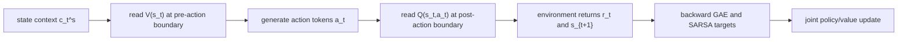

# SAPO：把 Agent 后训练里的 critic 放回同一个自回归模型

- **论文**：[SAPO: Single-Rollout Autoregressive Policy Optimization for Agentic Reinforcement Learning](https://arxiv.org/abs/2608.19842v1)
- **作者**：Dayang Liang、Lang Feng、Bo An、Yunlong Liu
- **机构**：Xiamen University；Nanyang Technological University
- **发布日期**：2026-08-20T09:43:47Z
- **方向**：大模型后训练；Agentic RL；长程交互 credit assignment
- **本地判断**：这是 7 月 SAO 之后的另一个“single-rollout”方向，但问题不相同。SAO 主要解决异步采样和 policy lag；SAPO 主要解决 PPO 的独立 critic 开销与 GRPO 的组采样依赖，把 policy、state value、action value 放进同一个 causal LM。

### TL;DR

- **它要解决什么**：长程 LLM Agent 的后训练通常卡在三角矛盾里：PPO 有显式 value 和 GAE，但要维护接近 policy 规模的 critic；GRPO 少一个 critic，却要为同一 prompt 采多条 rollout，并且在稀疏奖励或全失败组里容易 advantage collapse；单条长轨迹的每一步又很难被终局奖励细分信用。
- **它怎么做**：SAPO 观察到自回归模型天然有两个 causal boundary：动作生成前的 state prefix，以及动作生成后的 state-action prefix。论文预留两个词表 token `w+` 和 `w-`，用它们的 logit 差读出有界标量，在前一个边界读 `V(s_t)`，在后一个边界读 `Q(s_t,a_t)`，同时把这两个 token 排除在动作 softmax 外。
- **训练机制是什么**：每个任务只采一条 trajectory；用 old actor 读出旧的 token logprob、`V_old`、`Q_old`；沿轨迹倒序算 TD residual、lambda-return GAE、SARSA-style `Q` target；再用一个联合 loss 同时更新 token-level PPO policy loss、clipped `V` loss、clipped `Q` loss、KL 和 entropy。
- **实验给了什么证据**：论文在 ALFWorld 与 WebShop 上用 Qwen2.5-1.5B/7B 训练，报告 SAPO 相比 PPO 和 GRPO 的平均提升分别为 **+15.1** 与 **+12.1** 个百分点；Qwen2.5-1.5B 在 ALFWorld aggregate success 到 **90.1%**，Qwen2.5-7B 到 **94.0%**；WebShop 7B score/success 为 **88.6/82.4%**。
- **效率证据是什么**：在 ALFWorld + Qwen2.5-1.5B 的 runtime breakdown 中，PPO 每 iteration 为 **451.2s**，SAPO 为 **301.4s**，减少 **33.2%**；关键不是“value 免费”，而是移除了独立 value inference 和 critic update 路径。
- **边界在哪里**：论文主表强，但消融表和 OOD 表在 TeX 中被注释掉，公开正文没有作为正式结果呈现；实验集中在 ALFWorld/WebShop、Qwen2.5-1.5B/7B、150 training steps，尚未证明更大模型、更复杂工具链、多智能体环境或真实在线安全场景中的稳定性。

### 研究问题：为什么不是继续用 PPO 或 GRPO？

- **PPO 的价值**：
  - 它有 learned critic，可以把终局奖励通过 `V(s_t)` 和 GAE 分摊到不同 token 或 turn。
  - 对长程 Agent 来说，这比只看整条轨迹成功/失败更自然，因为错误常常发生在某个早期导航、检索或工具调用决策上。

- **PPO 的成本**：
  - 论文强调传统 LLM PPO 往往同时保留 policy、critic、reference、rollout 等路径。
  - 当 critic 接近 policy 规模时，显存、optimizer state、value forward/backward 都不是小开销。

- **GRPO 的动机**：
  - GRPO 用同一 prompt 的多条 rollout 做组内归一化，省掉 learned critic。
  - 它适合 verifier reward 明确、组内成功率有差异的场景。

- **GRPO 在长程 Agent 上的问题**：
  - 如果一组 rollout 全部失败，或者奖励几乎相同，归一化 advantage 会接近消失。
  - 如果只把整条轨迹 advantage 广播给所有 token，就很难区分“关键错误 turn”和“无关但很长的推理文本”。
  - 如果增大 group size 来稳定估计，长程交互会把 rollout 成本和同步等待一起放大。

| 方法 | 保留显式 value | 需要多条同 prompt rollout | 主要代价 | SAPO 对它的回应 |
|---|---:|---:|---|---|
| PPO | 是 | 否 | 独立 critic 与 value 更新路径 | 仍保留 `V/Q`，但读自同一个 causal LM |
| GRPO | 否 | 是 | 组采样成本与 advantage collapse | 每个任务一条 rollout，用轨迹内 GAE 传递信用 |
| RLOO/ReMax | 否 | 变体依赖额外基线 | 信用粒度仍粗 | 让 value 能跨 state 泛化 |
| VinePPO | 用 MC continuation 估值 | 需要额外生成 | rollout 成本高 | 避免为中间 value 重新分支生成 |
| SAPO | 是 | 否 | 可能有 policy-value 干扰 | 用 causal boundary、mask 和 clipped value loss 降低干扰 |

### 核心主张：自回归顺序本身就是 actor-critic 的边界

- **作者的关键观察**：
  - 在第 `t` 个交互 turn，Agent 先看到状态上下文 `c_t^s`。
  - 然后生成文本动作 `a_t = (a_{t,1}, ..., a_{t,M_t})`。
  - 动作完成后，状态与动作拼接成 `c_t^{sa} = [c_t^s; a_t]`。

- **这对应 actor-critic 的两个问题**：
  - `V(s_t)` 应该只看动作前状态，不能偷看将要生成的动作。
  - `Q(s_t,a_t)` 可以看完整动作，但不能看下一步环境反馈。

- **SAPO 的表示方式**：
  - 在动作前的 causal boundary 读出 `V_theta(s_t)`。
  - 在动作后的 causal boundary 读出 `Q_theta(s_t,a_t)`。
  - 中间仍由同一个模型按普通 autoregressive policy 生成动作 token。



- **为什么这个边界重要**：
  - 如果 value head 直接读隐藏层，容易变成另一个“外接 critic”。
  - 如果 `Q` 在生成前读出，它不知道动作内容。
  - 如果 `V` 在生成后读出，它会看到动作，变成信息泄漏的 state value。
  - SAPO 用 causal mask 自然保证这两个 readout 的信息范围不同。

### 两 token value basis：value 从哪里来？

- **论文不用新增 value head，而是预留两个已有词表项**：
  - `w+`：正向 value evidence。
  - `w-`：负向 value evidence。
  - 它们不被采样、不被 append 到上下文、不暴露给环境。

- **value readout 公式**：

```text
p_theta(c) = clip((z_{theta,w+}(c) - z_{theta,w-}(c)) / tau_v, -1, 1)
V_theta(s_t) = R_max * p_theta(c_t^s)
Q_theta(s_t,a_t) = R_max * p_theta(c_t^{sa})
```

- **变量解释**：
  - `z_{theta,w+}(c)`、`z_{theta,w-}(c)` 是 causal LM 在上下文 `c` 后对两个保留 token 的 logits。
  - `tau_v` 是 value temperature，控制 logit 差映射到标量的尺度。
  - `R_max` 是任务 return 的范围上界，用于把 `[-1,1]` 的归一化 readout 放回奖励尺度。

- **这个设计解决两个细节**：
  - **共同 logit shift 不敏感**：只看两个 logits 的差，不看绝对 logit。
  - **动作空间隔离**：动作 softmax 在 `W_act = W \ {w+, w-}` 上归一化，避免模型把 value token 当作环境动作来生成。

### 单 rollout advantage：它如何从终局奖励回传到每个 turn？

- **采样阶段**：
  - 对 batch 中每个任务只采一条 trajectory。
  - old policy `pi_{theta_old}` 生成交互轨迹。
  - old actor 在已采样 state-action 序列上读出旧 token logprob、`V_old`、`Q_old`。

- **倒序计算 TD residual 与 GAE**：

```text
delta_t = r_t + gamma * (1 - d_t) * V_old_{t+1} - V_old_t
A_GAE_t = delta_t + gamma * lambda * (1 - d_t) * A_GAE_{t+1}
A_GAE_{T+1} = 0
```

- **这一步的意义**：
  - 即便环境只在终止时给 sparse outcome reward，`A_GAE_t` 也能给不同 turn 不同学习信号。
  - `lambda` 仍承担经典 bias-variance tradeoff。
  - horizon 截断被当作有限终止，最后 bootstrap value 为零，避免越界假设。

- **`V` 和 `Q` 的训练 target 分开**：

```text
y^V_t = V_old_t + A_GAE_t
y^Q_t = r_t + gamma * (1 - d_t) * Q_old_{t+1}
```

- **作者为什么不用 `Q - V` 直接当 policy advantage**：
  - 早期 `Q` 估计很可能不准。
  - 如果马上把 `Q - V` 的误差注入 policy，policy 会被错误 action-value 牵引。
  - SAPO 因此用 GAE 构造 policy advantage，同时用 `Q` loss 训练动作条件 value 表示。

### Batch-normalized turn advantage：避免长文本动作支配训练

- **turn 层归一化公式**：

```text
tilde_A_t = A_GAE_t - c_inv * m_inv_t
hat_A_t = (tilde_A_t - mu_B) / (sigma_B + epsilon_adv)
```

- **适用细节**：
  - 如果环境有 invalid-action indicator，就用 `m_inv_t` 加一个惩罚项。
  - 如果没有 invalid-action 信号，`c_inv = 0`。
  - 归一化统计在当前 batch 的有效 turn 上算，而不是在 token 上算。

- **为什么先 turn 后 token**：
  - 一个动作可能包含很长的 `<think>` 与 `<action>` 文本。
  - 如果先把 advantage 广播到 token 再统计，长回复会在分布中占更大权重。
  - SAPO 先得到 turn-level `hat_A_t`，再广播给该 turn 的有效 action tokens，使每个环境决策先拥有同等统计地位。

### 联合优化：policy、V、Q 怎么同时更新？

- **token-level policy loss 保留 PPO clipped surrogate**：

```text
rho_{t,j}(theta) = exp(ell_{t,j}(theta) - ell_old_{t,j})
L_pol(theta) =
  - E_{t,j} [
      min(
        rho_{t,j}(theta) * hat_A_t,
        clip(rho_{t,j}(theta), 1-epsilon, 1+epsilon) * hat_A_t
      )
    ]
```

- **value loss 在归一化概率空间里做 clipped regression**：

```text
p^X_t = X_theta(...) / R_max,  X in {V, Q}
p_clip^X_t = p_old^X_t + clip(p^X_t - p_old^X_t, -epsilon_X, epsilon_X)
L_X(theta) = 1/2 * E_t [
  max(
    (p^X_t - y_bar^X_t)^2,
    (p_clip^X_t - y_bar^X_t)^2
  )
]
```

- **总目标函数**：

```text
L_SAPO(theta) =
  L_pol
  + c_V * L_V
  + c_Q * L_Q
  + beta * L_KL
  - c_H * H(pi_theta)
```

- **训练伪代码**：

```text
Input:
  policy pi_theta, reference policy pi_ref, task batch B, gamma, lambda

State:
  theta_old, one sampled trajectory per task, old logprobs, V_old, Q_old

Loop:
  1. set theta_old <- theta
  2. sample one trajectory per task with pi_theta_old
  3. evaluate sampled state-action sequences with old actor
  4. traverse each trajectory backward to compute delta, A_GAE, y_V, y_Q
  5. normalize turn-level advantages over valid turns in the batch
  6. broadcast each turn advantage to valid action tokens
  7. run one joint actor forward for current policy, V, Q
  8. minimize L_SAPO with separate policy/value masks

Output:
  updated shared autoregressive model

Failure boundary:
  if batching or shuffling loses trajectory id and turn index,
  backward GAE can connect the wrong temporal neighbors.
```

### 实验设置：论文真正测了什么？

- **Benchmark**：
  - ALFWorld：长程文本化 embodied household tasks，共 **3,827** 个任务，六类子任务包括 Pick、Look、Clean、Heat、Cool、Pick2。
  - WebShop：交互式购物环境，约 **1.1 million** products 与 **12,000** user instructions。

- **模型**：
  - Qwen2.5-1.5B-Instruct。
  - Qwen2.5-7B-Instruct。

- **baseline 分组**：
  - Proprietary prompting：GPT-4o、Gemini-2.5-Pro。
  - Training-free prompting：ReAct、Reflexion。
  - RL training：PPO、RLOO、GRPO、EMPG、GiGPO。

- **训练细节**：
  - learning rate：`1e-6`。
  - KL coefficient：`0.01`。
  - ALFWorld maximum turns：`50`。
  - WebShop maximum turns：`15`。
  - total training steps：`150`。
  - 硬件：4 NVIDIA H200s 与 8 NVIDIA A40s。

### 主结果：Table 1 支持了哪些结论？

| 设置 | 方法 | ALFWorld All | WebShop Score | WebShop Success |
|---|---:|---:|---:|---:|
| Qwen2.5-1.5B | PPO | 54.4 ± 3.1 | 73.8 ± 3.0 | 51.5 ± 2.9 |
| Qwen2.5-1.5B | GRPO | 72.8 ± 3.6 | 75.8 ± 3.5 | 56.8 ± 3.8 |
| Qwen2.5-1.5B | SAPO | **90.1 ± 2.3** | 82.2 | 63.7 |
| Qwen2.5-7B | PPO | 80.4 ± 2.7 | 81.4 ± 3.1 | 68.7 ± 5.1 |
| Qwen2.5-7B | GRPO | 77.6 ± 5.2 | 79.3 ± 2.8 | 66.1 ± 3.7 |
| Qwen2.5-7B | SAPO | **94.0 ± 1.7** | **88.6 ± 1.8** | **82.4 ± 2.0** |

- **1.5B 的信号**：
  - ALFWorld aggregate 从 PPO 的 54.4 到 SAPO 的 90.1，差 **35.7** 点。
  - 相比 GRPO 的 72.8，差 **17.3** 点。
  - Clean 和 Heat 两类达到 **100.0%**，说明收益不只来自 WebShop score 这样的软指标。

- **7B 的信号**：
  - ALFWorld aggregate 为 **94.0%**，高于 PPO 的 80.4 与 GRPO 的 77.6。
  - WebShop score/success 分别为 **88.6/82.4%**，也高于 PPO 与 GRPO。
  - Pick、Clean、Heat、Pick2 等子类多处领先，但 Cool 上 7B SAPO 为 79.7，低于 GiGPO w/ std 的 89.3；这说明 SAPO 并非每个细分任务都统治。

- **和 GiGPO 的关系**：
  - 1.5B 的 WebShop 上 GiGPO w/o std 的 score/success 为 83.5/67.4，高于 SAPO 的 82.2/63.7。
  - 但 SAPO 在 1.5B ALFWorld aggregate 为 90.1，高于 GiGPO 的 86.x。
  - 7B 上 SAPO 在 ALFWorld All、WebShop score、WebShop success 三个 aggregate 都最高。

### Figure 2：效率提升具体来自哪里？

| 模块 | PPO | SAPO | 解释 |
|---|---:|---:|---|
| Total per iteration | 451.2s | 301.4s | SAPO 减少 **33.2%** |
| Trajectory generation | 306.4s | 221.4s | 单 rollout 和共享路径降低绝对耗时 |
| Value inference + critic optimization | 61.4s | N/A | SAPO 不维护独立 critic pathway |
| Old-policy logprob | 14.3s | 14.2s | 基本持平 |
| Reference-model eval | 13.3s | 12.3s | 基本持平 |
| Actor update | 54.2s | 52.6s | value readout 并未显著拖慢 actor-side update |

- **最关键的解释**：
  - SAPO 不是声称 value 估计没有成本。
  - 它仍然要在 actor forward 中读两个 reserved logits。
  - 但它删除了独立 value model 的 forward/backward、optimizer state 和 critic update。

- **对 Agent 后训练的意义**：
  - 长程环境中的 rollout 本身已经很贵。
  - 如果再用多 rollout GRPO 或独立 critic PPO，训练预算会被采样与模型副本吞掉。
  - SAPO 的价值在于把显式 credit assignment 和较低 rollout/model 成本放在同一个设计里。

### 消融与失败边界：公开正文没有完全交代的部分

- **TeX 中存在但被注释的消融表**：
  - TeX 源里有 `-\mathcal{L}_Q` 的 ablation 草稿。
  - 公开正文没有把它作为正式 subsection 展开。
  - 因此不能把“`Q` loss 必然带来多少提升”当作已发布结论。

- **同样被注释的 OOD 表**：
  - TeX 源中有 ALFWorld in-distribution / out-of-distribution 的表格草稿。
  - 正文未正式发布这些数据。
  - 本文只把它作为“作者可能考虑过泛化评测”的线索，不把具体 OOD 数字当成主证据。

- **可能失败的机制点**：
  - `w+ / w-` readout 会和语言模型 head 共享参数，仍可能出现 policy-value interference。
  - value token 虽然从 action softmax 排除，但其 logits 仍由共享 backbone 产生，`c_V` 与 `c_Q` 的权重需要调。
  - 单 rollout 依赖 learned value 质量；如果早期 value 完全不稳定，GAE target 和 clipped regression 也只能降低风险，不能保证不会漂。
  - 论文没有给出大规模真实网页、代码执行、多工具权限、多人协作 Agent 的安全失败案例。

### 与已发布 SAO 旧文的区别

| 维度 | SAO | SAPO |
|---|---|---|
| 主要问题 | 异步 single-rollout 训练、policy lag、吞吐与样本利用 | 单模型 actor-critic 表示、去掉独立 critic 与多 rollout |
| value 来源 | 仍依赖 separately pretrained critic，并可更频繁更新 | 从同一个 causal LM 的两个边界读 `V/Q` |
| 重点机制 | 异步 rollout、importance sampling、policy-lag 修正 | 两 token value basis、trajectory GAE、SARSA target、联合 loss |
| 适合讨论 | 系统调度与异步训练有效性 | credit assignment 与模型结构复用 |
| 本轮定位 | 背景参照 | 选中深读对象 |

- **为什么仍值得发布**：
  - 两篇都用 single-rollout，但 single-rollout 只是采样约束。
  - SAPO 的核心贡献在表示和目标函数：它把 value learning 嵌入自回归 causal 边界，而不是主要改变 rollout pipeline。
  - 对后训练研究者来说，这提供了一个更接近“语言模型自身同时当 actor 与 critic”的路线。

### 相关工作位置：它站在三条线交叉处

- **GRPO/DAPO/GSPO/GVPO 线**：
  - 这条线把 RLHF/RLAIF 后训练推向 critic-free、group-relative。
  - 它的优势是内存低、实现相对简单。
  - 它的弱点是多 rollout 与组内 reward 差异依赖。

- **PPO/VC-PPO/VAPO/Open-Reasoner-Zero 线**：
  - 这条线强调 value model 对长程 reasoning 和 credit assignment 的价值。
  - 它的弱点是 critic 训练成本与 critic-policy 协调。

- **Hydra-PPO/POISE/SAO 线**：
  - 这条线尝试共享参数、复用 hidden states 或改造 rollout 执行。
  - SAPO 比它们更激进，因为没有外置 value head 或独立 critic backbone，而是直接使用 LM logits 作为 value basis。

### 原文论证路线逐段细读

- **Introduction 第一层：把 Agent RL 放进后训练阶段**：
  - 作者不是从普通 RLHF 开始，而是从“LLM 正在变成能搜索、用工具、写代码、与环境多轮交互的 Agent”开始。
  - 这个开头很关键，因为如果任务仍是单轮数学答案，整条 response 的 reward 已经能支撑不少优化。
  - 只有当 response 变成交互轨迹，credit assignment 才从“答案好坏”变成“哪一步动作导致失败”。

- **Introduction 第二层：把 PPO 与 GRPO 的优缺点并列**：
  - PPO 的强项是 critic 与 GAE，能把延迟奖励分摊到更早状态。
  - GRPO 的强项是省掉 critic，用组内 reward 统计估计 advantage。
  - 论文真正想解决的不是“PPO 过时”或“GRPO 不好”，而是二者各自牺牲了一个关键维度。

- **Introduction 第三层：把问题收束到三个失败点**：
  - 一是缺少显式 value generalization，组统计不能跨 state 学到可迁移的价值判断。
  - 二是 advantage collapse，稀疏奖励和长程失败会让同组 rollout 几乎没有可区分信号。
  - 三是采样预算与性能的冲突，更多 rollout 可以改善统计，却会放大长程交互的壁钟时间。

- **Method 第一层：不是新增 head，而是读 causal boundary**：
  - 作者没有引入一个传统 value head，也没有复制一个 value model。
  - 他们把状态前缀和状态动作前缀视为两个自然观测点。
  - 这让 value 监督可以进入同一个语言模型头，但又不破坏动作生成的因果顺序。

- **Method 第二层：用 `V` 和 `Q` 拆开两个语义**：
  - `V(s_t)` 回答“在当前状态还没行动时，这个状态多有希望”。
  - `Q(s_t,a_t)` 回答“采取这段文本动作之后，这个 state-action pair 多有希望”。
  - 两个值都来自同一套参数，但读出时机不同，因此不是简单的共享标量。

- **Method 第三层：policy advantage 不直接相信 `Q - V`**：
  - 这点是论文里容易被忽略的保守设计。
  - 如果一开始 `Q` 学歪了，`Q - V` 会把错误信用直接反馈给 policy。
  - 作者改用 old value 推出的 GAE 做 policy advantage，用 `Q` loss 辅助塑造 action-conditioned representation。

- **Experiment 第一层：主表证明 aggregate，而不是每个子类绝对最好**：
  - SAPO 在 7B 的 aggregate 指标非常强，但 1.5B WebShop 仍低于 GiGPO w/o std。
  - 这说明论文证据更适合支持“总体上有效且高效”，不适合支持“全面替代所有 group-relative 方法”。
  - 正文应该保留这个边界，否则会把方法贡献写得过满。

- **Experiment 第二层：runtime 图证明结构性节省**：
  - 451.2s 到 301.4s 的下降不是一个微小工程优化。
  - 价值在于训练图里少了一条独立 critic 分支，同时 rollout 侧也更轻。
  - 但这不是“同一个模型做三件事完全无额外成本”，因为 actor forward 仍要产生 logits 和 value readout。

### Detail inventory：本轮深读抽取到的可核验证据

| 类型 | 具体内容 | 证据位置 | 解读 |
|---|---|---|---|
| 方法名 | Single-Rollout Autoregressive Policy Optimization | 标题、摘要、Algorithm 1 | 方法把 single-rollout 与 autoregressive actor-critic 绑定 |
| value 表示 | `w+ / w-` 两个保留 token 的 logit difference | Eq. 1-2 | 用语言模型头输出有界标量 |
| 动作隔离 | `W_act = W \ {w+, w-}` | Eq. 3 | 避免 value basis 变成可执行动作 |
| credit assignment | TD residual 与 GAE 递推 | Eq. 4-5 | 从终局或稀疏奖励向早期 turn 传递信号 |
| value target | lambda-return `y^V` 与 SARSA `y^Q` | Eq. 6 | 分别监督 pre-action state 与 post-action action-value |
| policy loss | token-level clipped PPO surrogate | Eq. 8-9 | 保留 PPO trust-region 形式 |
| value loss | clipped regression over normalized `V/Q` | Eq. 10-11 | 限制 value 更新幅度 |
| total loss | `L_pol + c_V L_V + c_Q L_Q + beta L_KL - c_H H` | Eq. 12 | 同一 backbone 上做多目标更新 |
| benchmark | ALFWorld、WebShop | Section 5.1 | 一个 embodied text 环境，一个 shopping 环境 |
| 模型 | Qwen2.5-1.5B/7B | Section 5.1 | 两个开源基座尺度 |
| 训练 | lr `1e-6`、KL `0.01`、150 steps | Section 5.1 | 与已有 RL framework 对齐 |
| 硬件 | 4 H200 + 8 A40 | Section 5.1 | 成本不低，复现门槛需注意 |
| 主结果 | +15.1 vs PPO，+12.1 vs GRPO | 摘要、Section 6 | 作者按平均百分点汇总 |
| 效率 | 451.2s 到 301.4s | Figure 2 | 移除 critic 路径后减少 33.2% |

### 更细的机制拆分：为什么 `V` 和 `Q` 都要存在？

- **只用 `V` 会缺什么**：
  - `V(s_t)` 能判断状态好坏，但它不直接评价刚生成的动作。
  - 对 Agent 来说，很多错误不是状态本身坏，而是从好状态采取了坏动作。
  - 例如 WebShop 中已经找到正确商品，却点击了错误变体；状态仍接近成功，动作却破坏结果。

- **只用 `Q` 会缺什么**：
  - `Q(s_t,a_t)` 能评价动作后缀，但没有独立状态 baseline 时，policy advantage 容易混入 state difficulty。
  - 不同任务本身难度差异很大，直接比较 action-value 可能把简单任务动作误判为更优。
  - `V` 提供了前动作状态的参照，让延迟奖励有更清楚的归因基线。

- **为什么 `Q` target 用 SARSA 风格**：
  - SARSA target `r_t + gamma Q_old_{t+1}` 仍沿着实际采样轨迹更新。
  - 它不需要从当前 policy 搜索最佳动作，也不需要对未执行动作估值。
  - 这符合论文的单 rollout 约束：只用已经发生的 state-action-reward 序列构造监督。

- **为什么 value loss 按 turn 而不是 token 平均**：
  - 环境状态转移发生在 turn 层。
  - 一段动作可能有几十或几百 token，但它在环境中仍只触发一次动作结果。
  - 如果 value loss 按 token 权重，长思考文本会比短动作拥有更多训练权重，偏离环境决策粒度。

### 对 Table 1 的谨慎读法

- **ALFWorld 的强信号在 1.5B 更明显**：
  - PPO 1.5B 的 All success 只有 54.4，说明传统 critic 训练在这个设置下并没有天然占优。
  - GRPO 升到 72.8，证明 group-relative 对 embodied text task 有效。
  - SAPO 到 90.1，说明显式 value 加单 rollout 表示可能比单纯组统计更能处理长程信用。

- **ALFWorld 的 7B 结果说明 scaling 后仍有效**：
  - PPO 7B 已经到 80.4，基线不再很弱。
  - GRPO 7B 为 77.6，低于 PPO，可能体现 group estimator 在长程任务上的不稳定。
  - SAPO 7B 到 94.0，表明它不是只在小模型上弥补能力不足。

- **WebShop 的解读要更克制**：
  - WebShop 同时有 score 和 success，score 更像连续质量，success 更像任务完成。
  - 1.5B SAPO 的 WebShop score 为 82.2，success 为 63.7，不如 GiGPO w/o std 的 83.5/67.4。
  - 7B SAPO 才在 score 与 success 上同时最高，说明方法收益可能依赖模型容量或任务分布。

- **标准差信息也重要**：
  - 多数 RL 行报告三 seeds 的 mean/std。
  - SAPO 7B WebShop success 为 82.4 ± 2.0，波动相对可控。
  - 但 1.5B 的部分 SAPO WebShop 条目在 TeX 里缺少 `±` 格式，只写了 subscript 数字，可能是排版疏漏，不能过度解读。

### 对 Agent 安全与后训练的延伸

- **与 AI 安全的连接点**：
  - 安全失败常常不是整条轨迹都恶意，而是某个中间工具调用、权限请求或数据读取步骤越界。
  - 如果训练只看终局 reward，危险步骤可能被成功结果掩盖。
  - SAPO 的 turn-level credit assignment 提供了一个机制入口：把安全惩罚定位到更具体的交互边界。

- **与权限控制的连接点**：
  - `V(s_t)` 可以表达“当前状态是否已经接近危险上下文”。
  - `Q(s_t,a_t)` 可以表达“这个工具调用或文本动作是否把状态推向危险”。
  - 未来如果把 permission monitor、secret leakage detector 或 policy violation checker 作为 reward source，SAPO 比纯 outcome GRPO 更有可能学习到动作级约束。

- **与后训练数据效率的连接点**：
  - 多 rollout 方法把数据效率问题转化为“同一 prompt 多试几次”。
  - SAPO 转而要求 value function 从单条轨迹中泛化。
  - 这会把压力放到 value readout 的稳定性和 batch 内 turn distribution 上，而不是放到 rollout group size 上。

- **与可复现性的连接点**：
  - 论文没有给代码，只有 arXiv TeX、PDF 和图表。
  - ALFWorld 与 WebShop 虽是公开环境，但训练 wrapper、reward shaping、invalid action 标记、trajectory truncation 细节会影响结果。
  - 因此复现时要优先核对环境接口，而不是只照搬 loss 公式。

### 复现时最容易踩错的检查清单

- **检查一：value token 是否真的从动作词表移除**：
  - 如果 `w+ / w-` 仍参与 action softmax，模型可能把它们当成普通 token 学习。
  - 这会让 value supervision 与 action likelihood 互相污染，甚至把 readout token 生成到环境动作里。
  - 复现代码必须在 rollout、logprob evaluation、entropy 三处同时排除这两个 token。

- **检查二：`V` 与 `Q` 的边界不能混用**：
  - `V` 必须读动作前最后一个 state-context 位置。
  - `Q` 必须读动作后最后一个 valid action 位置。
  - 如果 padding、截断或 batch pack 改变了位置索引，模型可能在错误 token 上读 value。

- **检查三：old prediction 与 current prediction 要分清**：
  - GAE target 应该由 rollout-time old actor 的 `V_old/Q_old` 构造。
  - 当前 actor 的 `V/Q` 只用于回归这些 target。
  - 如果用当前预测生成当前 target，会形成自我追逐，尤其在早期 value 不稳时会放大偏差。

- **检查四：turn id 与 trajectory id 不能在 shuffle 后丢失**：
  - SAPO 的倒序递推依赖同一轨迹内的相邻 turn。
  - 分布式训练若只保留 token 序列，不保留轨迹结构，就会把不同任务的 turn 接错。
  - 这不是实现细节，而是方法是否仍然成立的前提。

- **检查五：invalid action penalty 不是普适常数**：
  - ALFWorld 或 WebShop 的无效动作语义不同。
  - `c_inv` 如果设得过强，模型可能过度保守；设得过弱，又难以惩罚死循环或无效点击。
  - 因此安全环境里应把 invalid action、policy violation、secret exposure 分成不同 reward channel，而不是混成一个失败位。

### 图表取舍：为什么正文没有搬运图片？

- **Figure 1 是框架图**：
  - 它说明 state context、action generation、value readout 与环境反馈的顺序。
  - 这些信息已经被上面的 Mermaid 和公式拆开，读者不看原图也能理解因果边界。

- **Figure 2 是 runtime breakdown**：
  - 关键数字是 451.2s、301.4s、33.2% 与 critic 路径的消失。
  - 这些数字已经在表格中重写，直接引用图片不会增加新的证据。

- **Table 1 是主证据**：
  - 本文保留了 aggregate 指标和必要 baseline，而不是复制全部六类 ALFWorld 子表。
  - 这样能突出 SAPO 的证据边界：aggregate 强，但个别子类和 1.5B WebShop 并非处处第一。
  - 这种写法也避免把排版图像误当作额外发现，保证分析焦点始终留在方法、实验和可复现边界上。

### 研究者应该带走什么？

- **第一，single-rollout 不等于 critic-free**：
  - SAPO 说明单条 rollout 仍然可以保留显式 value。
  - 关键是 value target 要来自 old policy 与环境奖励，而不是当前模型自举自己的预测。

- **第二，LLM token logits 可以承载非语言监督**：
  - `w+ / w-` 不是新概念 token，而是被约束为数值 readout。
  - 这让 LM head 同时服务于动作分布和 value estimation。
  - 但这也提出一个后续问题：value basis 是否会污染语言空间，或者在更大词表/多语言模型上呈现不同稳定性？

- **第三，Agent 后训练的信用分配正在从“整条答案”转向“交互 turn”**：
  - 数学题后训练常常能把整段 response 作为一个 episode。
  - ALFWorld、WebShop、网页浏览、代码执行等任务里，一个 episode 由多个可执行动作组成。
  - SAPO 的 turn-level GAE 与 token-level PPO loss 正是在连接“环境动作粒度”和“语言 token 粒度”。

- **第四，论文还缺少更强的 failure analysis**：
  - 没有系统展示 value readout 崩溃、reserved token 选择敏感性、`tau_v` 敏感性、`c_V/c_Q` 权衡。
  - 没有把 SAPO 放到更危险的工具调用或安全约束环境中测试。
  - 没有公开代码仓库，复现实验需要等实现、训练配置和环境 wrapper 进一步释放。

### 结论与边界

- **论文的强结论**：
  - 在两个公开长程交互 benchmark 和两个 Qwen2.5 尺度上，SAPO 能用一条 rollout、一个 shared autoregressive backbone，同时获得较好的任务成功率和 runtime。
  - 它把 PPO 的显式 value 学习和 GRPO 的低采样/低内存动机放到同一个框架里。

- **论文不能证明的事**：
  - 不能证明 SAPO 在所有 Agent 环境上都优于 GRPO 系列。
  - 不能证明 two-token value basis 是唯一或最优的 value readout。
  - 不能证明更大模型、真实浏览器/代码执行、权限隔离、多 Agent 协作下也有同等稳定性。

- **后续最值得追问**：
  - `w+ / w-` 是否需要固定，还是可以学习一组 value basis tokens？
  - `Q` target 的 SARSA 递推在 sparse reward 与 invalid action 密集场景中是否会过慢或过乐观？
  - value readout 与 language modeling head 共享时，是否会改变模型对罕见 token 的概率校准？
  - 如果 Agent 环境加入安全约束，例如工具权限、数据泄露惩罚或 policy monitor，SAPO 的 turn-level credit 是否能比 GRPO 更早定位危险步骤？
