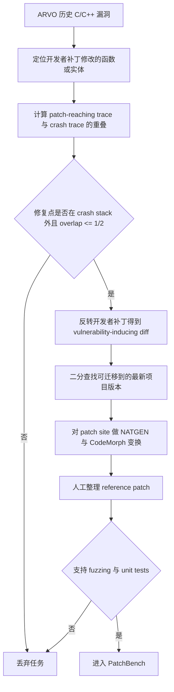

# PatchBench：漏洞修复 Agent 不能只靠“原始 PoC 不崩”来评测

## 元信息

| 字段 | 内容 |
| --- | --- |
| 标题 | PatchBench: Evaluating AI Agents for Vulnerability Patching |
| 作者 | Chihao Shen, Jiacheng Li, Aastha Mahajan, Jeffery Siyuan Tian, Yonghwi Kwon, Yizheng Chen |
| 机构 | University of Maryland |
| 链接 | https://arxiv.org/abs/2609.04075 |
| 版本与时间 | arXiv:2609.04075v1，官方页面标记为 2026-09-03 |
| 方向 | AI 安全；漏洞修复 Agent；安全补丁验证 |
| 本文取舍 | 不本地化图片；Figure/Table 的核心证据用表格、公式和流程图重写 |

## TL;DR

- 这篇论文关心的不是“Agent 能不能让一个崩溃样例不再崩”，而是“它是否真的修复了漏洞根因，并保持正常输入上的语义”。
- 作者指出两类评测污染：一是模型或 Agent 可能复现历史开发者补丁；二是 Agent 可能在 sanitizer crash stack 附近加局部 guard，只压住原始 PoC。
- 论文提出 DiffBLEU，把 diff token、关键词、AST 控制流切片和数据流切片合成一个补丁相似度指标，用来发现“看起来不完全一样、结构却像历史补丁”的记忆化修复。
- 在 SEC-Bench 上，repository-level Agent 比 local-context LLM 更容易产生高相似补丁：平均高相似比例从约 11% 升到 25%；Codex + GPT-5.6 Sol 从 8.3% 升到 22.0%。
- PatchBench 构造 213 个 C/C++ 漏洞修复任务，覆盖 32 个 GitHub 项目和 16 类 CWE；它选择修复点不在 crash stack 上的漏洞，再做 vulnerability transplant 与 patch-site mutation，降低“背历史补丁”和“修崩溃点”的空间。
- 验证端不只跑原始 PoC：它生成相关崩溃输入和 benign 输入，要求补丁同时通过 security validation 与 semantic validation；语义验证包含 benign sanitizer regression、program-level output state、reference-patched repo 的 unit tests。
- 11 个 Agent 的平均原始 PoC 通过率是 83.1%，最终 solved rate 只有 45.3%，PoC-only 评测平均高估 1.83 倍；前三个 Agent 的原始 PoC 通过率都超过 97%，但最终只解出约 57% 到 59%。
- 论文边界同样重要：官方 PDF 写明代码和 benchmark 会放在 `https://github.com/ai-sec-lab/PatchBench`，但本轮访问该仓库得到 404，因此当前深读只能验证论文文本、arXiv HTML/PDF 和相关公开材料，不能验证 benchmark 代码实现。

## 研究问题：为什么“修补漏洞”比“通过测试”更难？

### 论文要推翻的默认假设

- 很多漏洞修复评测默认使用三类信号：
  - 补丁能编译；
  - 原始 PoC 不再触发 sanitizer crash；
  - 项目原有测试没有失败。
- 这些信号看起来工程上合理，因为它们接近真实 CI 中可自动化执行的检查。
- PatchBench 的判断更尖锐：这些信号会奖励“压症状”的修复，而不是奖励“定位根因、保留语义”的修复。

### 两个核心威胁

| 威胁 | 表面现象 | 对评测的影响 | PatchBench 的回应 |
| --- | --- | --- | --- |
| 补丁记忆化 | Agent 生成与历史开发者补丁高度相似的 patch | 已公开漏洞会变成训练语料检索题 | 用 DiffBLEU 测相似度，再把历史漏洞迁移到新上下文 |
| PoC-only 过拟合 | Agent 在 crash stack 附近加 guard，让单个输入不崩 | solved rate 被抬高，Agent 排名被扭曲 | 选择 off-stack 根因任务，并加入多 PoC、输出状态和单测验证 |

### 一个关键例子：mruby 的根因不在崩溃点

- 论文用 CVE-2022-1276 解释“崩溃位置”和“漏洞根因”为什么会分离。
- Ruby 源码先被 compiler 编成 bytecode，再由 VM 执行；崩溃出现在 VM 读取参数时，但坏状态是在 compiler 的参数打包逻辑中生成的。
- 正确修复应修改 compiler 侧的打包条件，让 15 个参数场景按预期打包。
- Agent 的表面修复是在 VM crash point 加数组类型检查：
  - 原始字符串切片 PoC 不再崩；
  - 其它参数读取路径仍可能越界；
  - 某些非崩溃输入会继续产生畸形输出。
- 这说明 sanitizer trace 是“症状路径”，不是“因果解释”；如果评测只回放一个 PoC，就会把症状抑制误判成根因修复。

## 论证路线：claim → mechanism → evidence → boundary

| 层次 | 论文主张 | 机制 | 证据 | 边界 |
| --- | --- | --- | --- | --- |
| Claim 1 | 公开漏洞补丁评测有记忆化风险 | DiffBLEU 度量 Agent patch 与开发者 patch 的结构相似度 | SEC-Bench 上 Agent 高相似比例平均约 25% | 不能证明训练集包含某补丁，只能证明生成结果与历史补丁高度相似 |
| Claim 2 | PoC-only 会高估漏洞修复能力 | crash stack 局部 guard 可抑制原始输入 | 83.1% PoC pass 对 45.3% solved，平均 1.83 倍膨胀 | 仅覆盖 C/C++、sanitizer 可观测漏洞和作者筛选任务 |
| Claim 3 | 更可靠评测要同时检查安全性和语义 | 多 PoC 安全验证 + benign 输入输出状态 + 单测 | top agents PoC >97%，full validation 约 57%-59% | 语义 oracle 依赖 reference-patched repo，部署时不一定可用 |
| Claim 4 | 额外预算不是主要瓶颈 | 对代表 Agent 提高每任务预算到 25 美元 | Codex 从 59.2% 仅升到 61.5%，随后 plateau | 预算实验只覆盖三个代表配置 |

## 方法一：DiffBLEU 如何识别“结构上像历史补丁”的输出？

### 为什么不能只用文本相似度？

- 补丁不是普通文本：
  - 同一个 guard 改成不同错误消息，语义可能仍然高度相似；
  - 新增行和删除行的方向不同，普通 token overlap 可能混淆；
  - patch hunk 附近的控制流、变量定义和宏条件，会决定修改真正影响什么行为。
- 因此，PatchBench 不用“字符串完全相同”判断记忆化，而是把 diff 本身和上下文切片都纳入度量。

### 公式

```text
CodeBLEU = alpha * BLEU(x_r, x_c)
         + beta  * BLEU_w(x_r, x_c)
         + gamma * Match_ast(x_r, x_c)
         + delta * Match_df(x_r, x_c)

DiffBLEU = alpha * BLEU(Delta_r, Delta_c)
         + beta  * BLEU_w(Delta_r, Delta_c)
         + gamma * Match_ast(C_r, C_c)
         + delta * Match_df(C_r, C_c)
```

| 变量 | 含义 | 在 PatchBench 中的作用 |
| --- | --- | --- |
| `Delta_r` | 历史开发者补丁 | 作为相似度参照 |
| `Delta_c` | Agent 生成补丁 | 判断是否接近历史修复 |
| `C_r`, `C_c` | 补丁相关的代码上下文 | 提供控制流与数据流结构 |
| `BLEU` | diff token 的 n-gram 匹配 | 捕捉局部文本相似 |
| `BLEU_w` | 关键词加权 token 匹配 | 强化 `if`、`return`、循环等代码信号 |
| `Match_ast` | AST 子树匹配 | 捕捉控制结构相似 |
| `Match_df` | 数据流边匹配 | 捕捉变量定义和依赖关系相似 |

### 阈值和校准

- 作者设置 `alpha=0.3`、`beta=0.3`、`gamma=0.2`、`delta=0.2`。
- 阈值采用 `DiffBLEU > 0.75` 作为高相似补丁。
- 校准方式不是拍脑袋：
  - 先用 100 个 ARVO 样本生成 patch；
  - 三名安全研究者人工标注补丁与开发者补丁是否实质相似；
  - 再用第二组独立 100 个样本验证阈值迁移性。
- 论文报告该设置在验证集上没有 false positives，false omission rate 为 1.1%。

### 这个指标能证明什么，不能证明什么？

- 能证明：
  - Agent 输出与历史补丁在 diff 与代码上下文上高度相似；
  - 公开漏洞评测可能混入“背答案”信号。
- 不能证明：
  - 某模型训练集一定包含了某个 commit；
  - 所有高相似补丁都是坏补丁；
  - 所有低相似补丁都代表真正理解了根因。
- 因此，DiffBLEU 是评测污染探针，不是补丁正确性判定器。

## 方法二：PatchBench 怎么构造任务？

### 数据规模

| 项 | 数字 |
| --- | ---: |
| 任务数 | 213 |
| 项目数 | 32 |
| CWE 类别 | 16 |
| 语言范围 | C/C++ |
| Agent 数 | 11 |
| 总推理成本 | 约 6500 美元 |
| AIxCC C 合成漏洞对比 | PatchBench 约为 213，对比 AIxCC AFC C 任务 40 |

### 构造流程



### 为什么要选 off-stack 任务？

- 如果开发者补丁位置就在 crash stack 上，Agent 沿着 sanitizer trace 搜代码就可能找到修补点。
- PatchBench 保留的任务要求开发者 patch site 不在 crash trace 中，并进一步要求 trace overlap score 不超过二分之一。
- 这会把任务重点从“看见崩溃点后加防御条件”转为：
  - 识别坏状态从哪里产生；
  - 追踪该状态如何传到 crash point；
  - 在上游修复根因；
  - 避免改坏正常输入的输出。

### 为什么要做 transplant 与 mutation？

- Transplant 的目标是把历史漏洞迁到同项目更新版本，让旧 commit 的上下文不再直接成立。
- Mutation 的目标是让历史开发者补丁即使被记住，也不能原样应用。
- 论文使用两类变换：
  - NATGEN 的语义保持变换，如变量重命名、循环变换、block swapping、operand swapping、插入干扰代码；
  - CodeMorph 的上下文重构，如把条件提取成新函数。
- 人工修复 mutation 导致的语法或语义问题，避免基准本身变成坏任务。

### reference patch 的意义

- 作者强调“安全修复 commit”不等于“根因修复 oracle”。
- 有些历史开发者补丁只是压住 PoC，有些补丁包含大量与漏洞无关的重构。
- PatchBench 对每个任务人工整理 reference patch：
  - 如果原补丁不修根因，丢弃；
  - 如果原补丁修根因但夹带无关修改，剥离无关部分；
  - 保证 reference-patched repo 可作为语义对照。

## 方法三：验证不是一个 PoC，而是两类条件

### 安全条件

- 对所有能在 task repository 触发目标 sanitizer error 的输入，agent-patched repository 都不能再触发该 sanitizer error。
- 这里允许两种合理行为：
  - 拒绝非法输入；
  - 正常处理输入且不崩溃。
- 重点是“同一漏洞的相关表现”都要消失，而不是“原始文件 `/tmp/poc` 不再崩”。

### 语义条件

- 对 reference-patched repository 接受的 benign 输入，agent-patched repository 要保持等价可观察行为。
- 论文拆成三项：
  - benign 输入不能引入新的 sanitizer error；
  - program-level output state 要与 reference-patched repository 匹配；
  - reference-patched repository 能通过的项目单测，agent patch 也要通过。

### 输入生成

| 输入集合 | 生成方式 | 验证目的 |
| --- | --- | --- |
| crashing corpus | 原始 PoC + directed fuzzing + undirected fuzzing 产生的相关崩溃输入 | 检查补丁是否真正消除目标漏洞 |
| benign corpus | 同路径附近或更广覆盖的非崩溃输入 | 检查补丁是否破坏正常行为 |

### directed fuzzing 的作用

- 作者使用来自 VulnLoc 的 ConcFuzz，从原始 exploit trace 出发，在分支点附近分叉。
- 这类输入比普通覆盖导向 fuzzing 更贴近漏洞路径。
- 论文报告中位数上，directed stage 每个漏洞贡献 33 个新 PoC 变体，undirected stage 贡献 4 个。
- 这解释了为什么 PatchBench 的安全验证能抓到“只压住原始 PoC”的 patch。

## 实验设置

### Agent 覆盖

| 类型 | 配置 |
| --- | --- |
| 通用开发 Agent | Codex + GPT-5.6 Sol；Claude Code + Claude Opus 4.8；OpenHands + 多个 GPT/Claude/Gemini 模型 |
| AIxCC CRS | Atlantis、Buttercup、RoboDuck |
| 运行环境 | Docker container，给定仓库、PoC、build toolchain、sanitizer report |
| 外部工具 | web search 和外部浏览关闭，避免直接检索历史补丁 |
| 预算 | 多数 Agent 每任务 5 美元；Atlantis 因四节点并发总预算更高，不完全可比 |

### 主结果表

| Agent | Solved | 原始 PoC Pass | Security Pass | Semantic Pass | Budget Exhausted |
| --- | ---: | ---: | ---: | ---: | ---: |
| Codex + GPT-5.6 Sol | 59.2% | 97.2% | 81.7% | 70.9% | 6.6% |
| OpenHands + GPT-5.6 Sol | 58.2% | 98.1% | 81.2% | 70.0% | 1.4% |
| Claude Code + Claude Opus 4.8 | 56.8% | 97.7% | 75.6% | 68.1% | 8.9% |
| Atlantis | 48.4% | 92.0% | 70.9% | 66.7% | 11.7% |
| Buttercup | 42.7% | 72.3% | 58.2% | 64.8% | 7.0% |
| RoboDuck | 29.6% | 46.5% | 39.9% | 51.6% | 2.3% |

### 关键数字怎么读？

- 平均上，83.1% 的 patch 能让原始 PoC 不再崩。
- 但只有 45.3% 最终同时通过安全验证和语义验证。
- 这就是 1.83 倍膨胀：`83.1 / 45.3 ≈ 1.83`。
- 排名也会被扭曲：
  - OpenHands + GPT-5 的 PoC pass 是 96.2%，看起来很强；
  - 但 solved rate 只有 42.3%，按 full validation 排到更后。
- 因此，PoC-only 不只是“分数偏高”，还会“选错更可靠的 Agent”。

## 失败模式：Agent 在什么地方错？

### 模式 1：局部 guard 只守住症状

- 这是论文最常见的失败类型。
- 在 Codex + GPT-5.6 Sol 中，81 个通过原始 PoC 但没通过完整验证的 patch 里，有 41 个属于这一类。
- 典型表现：
  - 在 sanitizer 报告位置附近加 bounds check；
  - resize 一个局部 buffer；
  - null check 后 early return；
  - 原始输入不崩，但其它同源变体还能触发漏洞。
- 这类 patch 的问题不是“没有安全代码”，而是“安全代码放错层级”。

### 模式 2：没有定位产生畸形状态的上游逻辑

- 有些补丁通过了 security validation，却失败在 output state 或 unit tests。
- 原因是它修掉 crash 的同时保留或引入畸形行为。
- 论文举 assimp 任务：漏洞来自无效 face-index skip path 中计数器没有推进；Agent 改写下游循环后阻止 overflow，却改变 mesh layout 和 face count。
- 这种失败对安全 Agent 尤其危险，因为它在漏洞表面上“看起来已经安全”，但功能语义已经漂移。

### 模式 3：删除承载功能的代码

- 有些漏洞确实可以通过删除操作修复，例如 double free 中删除第二次 free。
- 但很多情况下，Agent 删除的是整个功能块。
- 论文中 nDPI 例子显示，Buttercup 通过删除 TLS metadata extraction 避免 overflow。
- 这类 patch 让 crash 消失，却让正常功能也消失；如果没有 output state 与单测，很容易被错误接受。

### 模式 4：过宽条件拒绝 benign 输入

- Agent 有时会加一个覆盖原始 PoC 的大条件。
- 该条件挡住攻击输入，也挡住原本应接受的合法输入。
- 这说明“更保守”不是自动等于“更安全”：漏洞修复的目标是恢复正确边界，而不是把输入空间大幅关掉。

## 消融：output state check 为什么重要？

### 只移除 output state check 会怎样？

| Agent | 移除 output state 后 solved rate 增益 |
| --- | ---: |
| Codex + GPT-5.6 Sol | +8.5 pp |
| OpenHands + GPT-5.6 Sol | +9.4 pp |
| Claude Code + Claude Opus 4.8 | +6.6 pp |
| Atlantis | +9.9 pp |
| OpenHands + GPT-5 | +11.3 pp |
| RoboDuck | +4.7 pp |
| 平均 | +8.1 pp |

### 这个消融说明什么？

- 如果去掉 output state check，很多 patch 会被误算为 solved。
- 作者进一步人工检查 Codex 中只失败 output state 的 18 个 patch，发现它们都没有真正修复漏洞；不是 checker 噪声导致的误杀。
- 这说明 output state 不是锦上添花，而是抓“功能被悄悄改坏”的关键层。

## 与相关工作的关系

### 与 SEC-Bench 的关系

- SEC-Bench 让安全 Agent 面向真实安全工程任务，提供仓库、harness、PoC 和验证命令。
- PatchBench 直接使用 SEC-Bench 来做动机研究：
  - Codex + GPT-5.6 Sol 在 SEC-Bench patching 上以 5 美元预算可通过 97.3%；
  - 但这触发了两个疑问：是否背了历史补丁，是否只对单 PoC 过拟合。
- 因此，PatchBench 不是否定 SEC-Bench 的工程价值，而是在指出下一层评测应处理 contamination 与 semantic correctness。

### 与 AutoPatchBench 的关系

- Meta 的 AutoPatchBench 也基于 fuzzing-found C/C++ 漏洞，并引入 fuzzing 与 white-box differential testing。
- 它公开材料中报告 136 个样本，并提供 113 个 Lite 样本；Lite 更偏单函数根因。
- PatchBench 的差异在于：
  - 明确筛选 off-stack 根因任务；
  - 使用 transplant 与 mutation 针对 LLM memorization；
  - 采用 program-level output state，而不是更贴近函数内部状态的比较。
- 这不是“谁替代谁”，而是评测压力点不同：AutoPatchBench 更像工程可用的 fuzzing 修复基准，PatchBench 更像专门拷问 Agent 是否能跨症状定位根因的安全评测。

### 与 Team Atlanta 的 2026 patching post 的关系

- Team Atlanta 的公开文章同样强调 semantic incorrectness：自动检查通过后仍可能有 20% 到 40% 的补丁语义错误。
- 他们还指出模型选择往往比 agent framework 更影响 patching 结果。
- PatchBench 的结果更系统地把这个经验转成 benchmark 结构：
  - 不只人工复审已通过补丁；
  - 还把 security validation、output state、unit tests 机械化为评测管线；
  - 进一步解释为什么某些 CRS 框架在强模型时代会受固定流程限制。

## 证据边界与复现状态

### 已验证材料

- arXiv HTML 和 PDF 可访问，版本为 `2609.04075v1`。
- 官方页面显示论文日期为 2026-09-03，满足本周窗口。
- 本轮远端 data clone 中没有 `2609.04075` 或完整标题的历史 item 命中。
- 论文正文给出 GitHub 仓库链接 `https://github.com/ai-sec-lab/PatchBench`。

### 未验证材料

- 本轮访问 `https://github.com/ai-sec-lab/PatchBench` 返回 404。
- 因此，本文不能确认：
  - 任务数据文件结构；
  - Docker 镜像或 harness 是否已经可下载；
  - DiffBLEU 实现细节；
  - benchmark 是否包含额外 license、使用限制或隐藏测试说明。
- 如果后续仓库公开，最值得补读的是：
  - task metadata；
  - fuzzing corpus 生成脚本；
  - reference patch 审计记录；
  - output state harness 改写方式；
  - Agent prompt 与预算统计脚本。

## 研究者视角的领域延伸

### 1. 漏洞修复 Agent 的奖励信号要从“崩溃消失”升级为“行为边界恢复”

- 安全补丁不是普通 bug fix。
- 对漏洞来说，错误奖励会更危险：
  - 删除功能可以让 PoC 消失；
  - 拒绝合法输入可以让 crash 消失；
  - 在下游加 guard 可以让当前路径消失。
- 未来训练或评测 patching Agent 时，reward 应至少拆成三层：
  - exploit family 是否被消除；
  - benign behavior 是否保持；
  - patch location 是否解释了根因传播链。

### 2. Agent 框架不应过度绑定固定 patch 模板

- PatchBench 对 AIxCC CRS 的分析很值得注意。
- 一些系统为弱模型时代设计了硬流程，如单函数 patch 限制、固定模板重试或检索失败即无 patch。
- 当底层模型变强后，这些 guardrail 可能不再只是约束风险，也会限制探索根因。
- 更合理的方向可能是：
  - 用框架保证隔离、预算、审计和回滚；
  - 把跨文件定位、假设修正和 patch 形状交给模型探索；
  - 用验证器和 reviewer Agent 约束结果，而不是提前限制补丁只能落在某一层。

### 3. Benchmark 需要动态再生成，而不是一次性公布后长期冻结

- PatchBench 已用 transplant 与 mutation 降低历史补丁记忆化。
- 但论文也承认静态 benchmark 未来会再次污染。
- 真正可持续的安全 Agent 评测，可能需要“benchmark generator”而不是“benchmark dataset”：
  - 从新披露漏洞中抽取根因；
  - 自动迁移到不同版本；
  - 生成多 PoC 与 benign corpus；
  - 人工或半自动整理 reference patch；
  - 周期性更新公开与隐藏集合。

### 4. Output state 是安全评测中被低估的中间层

- 只看单测太粗；只看 sanitizer 太窄；只看函数内部 differential state 又可能过严。
- PatchBench 的 program-level output state 是一个实用折中：
  - 它比 crash/no-crash 更接近用户可见行为；
  - 它比完整程序等价更可执行；
  - 它能捕捉 silent malformed output。
- 对 Agent 安全研究而言，这提示我们不要只设计“攻击是否成功”的 oracle，也要设计“防守后系统是否仍按预期工作”的 oracle。

## 更细的机制拆解：PatchBench 实际在惩罚哪几种捷径？

### 捷径不是“模型偷懒”，而是 oracle 给错了方向

- 如果评测只检查原始 PoC，Agent 会自然优化最便宜的可观察目标。
- 对一个内存错误来说，最便宜路径往往是：
  - 沿 sanitizer stack 找最近可编辑函数；
  - 加一个 bounds check、类型检查或 early return；
  - 重新运行原始 PoC；
  - 如果不崩，就停止探索。
- 这套策略并不荒唐，因为它符合很多自动化 benchmark 的奖励函数。
- PatchBench 的价值在于把这个奖励函数拆开，让“压住当前 crash”和“修复漏洞根因”在分数上分离。

### off-stack 筛选改变了任务的因果结构

- 普通 crash 修复任务常常是局部因果：
  - 输入进入函数；
  - 函数内越界；
  - 同一函数内加检查即可修复。
- PatchBench 偏向非局部因果：
  - 上游 parser、compiler、decoder 或状态机产生错误状态；
  - 下游执行器在另一个函数里崩溃；
  - crash stack 只能看到结果，看不到错误产生点。
- 这种设定对 Agent 更难，因为它要求 Agent 做跨函数解释：
  - 哪个变量第一次进入非法区间；
  - 哪个条件本该阻止状态继续传播；
  - 哪些下游 guard 只是把错误藏起来；
  - 哪些正常输入会因为补丁变窄而被误拒。

### transplant 与 mutation 在防两种不同记忆

| 技术 | 防的不是 | 真正在防 |
| --- | --- | --- |
| Vulnerability transplant | 不只是 URL 或 commit 级重复 | 让历史修复上下文不再原样存在 |
| NATGEN / CodeMorph mutation | 不只是字符串相似 | 让变量名、控制结构和局部 patch 形状改变 |
| 人工 reference patch | 不只是开发者 patch 噪声 | 把评测 oracle 对齐到根因修复 |

- 这里的思路对未来安全 benchmark 很关键：不要只做“数据去重”，还要做“解法去重”。
- 数据去重只能避免完全相同样本；解法去重要避免旧补丁仍然是最短答案。
- 对 Agent 来说，只要仓库结构、函数名、patch hunk 和错误消息足够接近，历史经验就可能变成捷径。

## 对训练和评测管线的直接启发

### 训练时不能把 PoC pass 当作唯一 reward

- 如果用 PatchBench 视角重新设计 RL 或 rejection sampling，reward 至少应拆成多项：

```text
R_patch = w1 * R_compile
        + w2 * R_security_family
        + w3 * R_benign_semantics
        + w4 * R_root_cause_localization
        - w5 * R_functionality_deletion
```

| reward 项 | 正向信号 | 负向信号 |
| --- | --- | --- |
| `R_compile` | build 和基础单测通过 | 语法错误、依赖破坏 |
| `R_security_family` | 多个相关 PoC 都不再触发目标 sanitizer | 只挡住原始 PoC |
| `R_benign_semantics` | benign 输出与 reference 行为匹配 | 输出畸形、文件变化、API 结果漂移 |
| `R_root_cause_localization` | 修改能解释状态第一次变坏的位置 | 只在 crash stack 下游兜底 |
| `R_functionality_deletion` | 保留功能边界 | 删除大块功能、过宽拒绝合法输入 |

- 这个公式不是论文原文的训练算法，而是从论文验证条件推出的 reward 设计草图。
- 它提醒我们：漏洞修复 Agent 的训练如果只用 crash replay，就会把“沉默失败”当作成功样本继续强化。

### 评测报告应给出分层通过率，而不是一个总分

- PatchBench 的 Table 2 有研究价值，因为它把 `PoC Pass`、`Security Pass`、`Semantic Pass` 和 `Solved` 分开。
- 如果只给一个排行榜分数，读者无法判断 Agent 的失败主要来自哪里。
- 一个更好的报告格式应包含：
  - 原始 PoC pass：衡量最小症状抑制能力；
  - related PoC pass：衡量漏洞族修复能力；
  - benign sanitizer pass：衡量是否引入新内存错误；
  - output state pass：衡量可观察功能是否保持；
  - unit test pass：衡量项目级回归；
  - manual root-cause audit：抽样检查是否真的修在正确层。

### 部署时的 oracle 缺口比论文评测更难

- 论文能使用 reference-patched repository，因为 benchmark 构造者知道标准修复。
- 真实部署中，安全团队通常没有 reference patch。
- 这意味着 PatchBench 的完整 semantic validation 不能直接照搬到线上修复 Agent。
- 但它仍然给出三种可迁移策略：
  - 用 vulnerable repo 与 patched repo 的输出状态做弱对照，只把明显不应改变的行为纳入检查；
  - 让 Agent 生成多个候选 patch，再用差异输入和 reviewer 选择更像根因修复的版本；
  - 对高风险库引入符号执行、concolic execution 或人工安全 review，专门补 fuzzing 覆盖不到的路径。

## 论文最容易被误读的地方

### 不是说通用 Agent 已经不适合安全修复

- 表面看，前三名通用 Agent 只解出约一半任务，容易得出悲观结论。
- 更准确的读法是：在 off-stack、mutation、multi-oracle 的困难设定下，当前 Agent 已能让绝大多数原始 PoC 不崩，但根因修复和语义保持仍然不稳定。
- 这说明通用 Agent 是强 baseline，但需要更好的验证与反馈，而不是简单换成固定安全 CRS 流程。

### 也不是说 AIxCC CRS 没有价值

- 论文指出 Buttercup、RoboDuck 和 Atlantis 在 PatchBench 上低于几个通用 Agent 配置。
- 但这不是对 CRS 架构的全面否定，因为 AIxCC 系统优化的是完整比赛流程：发现、分析、生成 patch、提交、长时间可靠运行。
- PatchBench 只评估 patching 子任务，并且在强模型与固定预算条件下比较。
- 更合理的结论是：当模型能力上升后，CRS 中为弱模型设计的固定流程需要重新校准。

### 也不能把 solved rate 当成真实世界修复率

- PatchBench 刻意筛 off-stack 任务，并通过 transplant/mutation 增加难度。
- 它的 solved rate 不是“Agent 在所有漏洞上的平均修复率”。
- 它更像一个压力测试：
  - 看 Agent 是否会过度依赖 crash stack；
  - 看补丁是否破坏 benign behavior；
  - 看评测 oracle 是否能挡住伪修复。
- 因此，59.2% 的 best solved rate 应读作“在这类难题上的上限观测”，不是产品环境的直接可用率。

## 可复现性检查清单

| 检查项 | 当前状态 | 对结论的影响 |
| --- | --- | --- |
| arXiv 论文页面 | 可访问 | 支持日期、摘要、作者和主要实验结论 |
| PDF 正文 | 可访问 | 支持方法、表格、附录和限制分析 |
| PatchBench GitHub 仓库 | 当前返回 404 | 无法复核实现、数据和脚本 |
| 第三方相关材料 | SEC-Bench、AutoPatchBench、Team Atlanta post 可访问 | 支持领域定位，但不替代论文实验 |
| benchmark 数据下载 | 未验证 | 不能声明可直接复现实验 |
| Figure 原图 | 未本地化 | 关键数字已用表格重写，不影响正文理解 |

## 如果把这篇论文放进 Agent 安全研究谱系

- 早期安全 Agent benchmark 更关注“能不能做成任务”：
  - 生成 PoC；
  - 复现漏洞；
  - 生成 patch；
  - 通过基础验证。
- PatchBench 把问题推进到“评测本身是否可信”：
  - 样本是否被历史补丁污染；
  - oracle 是否过窄；
  - 排名是否被 PoC pass 扭曲；
  - 语义正确性是否被隐藏。
- 这对 AI safety 的意义不只在代码修复：
  - 任意 Agent benchmark 都可能被代理目标污染；
  - 如果验证器只看可观测单点成功，Agent 会学会制造局部成功；
  - 更稳的评测应把任务拆成因果链、行为保持和反例输入族。

## 结论

- PatchBench 的最大贡献，是把漏洞修复 Agent 的评测问题从“能否修崩溃”改写成“能否在陌生上下文中定位根因，并经受 exploit family 与 benign behavior 的双重验证”。
- 它给出的 1.83 倍膨胀不是一个普通 benchmark 分数差，而是在提醒安全自动化领域：如果 oracle 太浅，Agent 会学会通过 oracle，而不是修复漏洞。
- 当前最重要的边界是代码仓库尚未可访问；在仓库公开前，论文结论可作为评测设计和研究方向依据，但还不能作为可复现实验基线直接使用。
