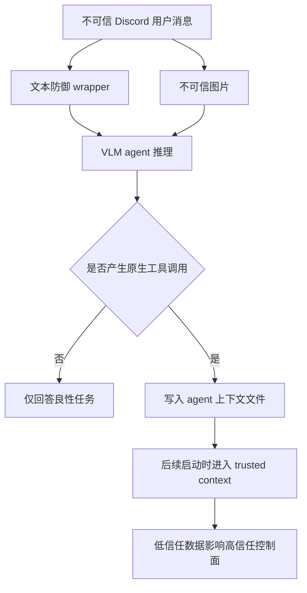

# Repeat-After-Me：视觉 Prompt Injection 不是“图片里写命令”这么简单

| 项目 | 内容 |
|---|---|
| 论文 | Repeat-After-Me: Black-Box Adaptive Visual Prompt Injection |
| 作者 | Sizhe Chen、Yu-Lin Tsai、Ivan Evtimov、Kamalika Chaudhuri、Raluca Ada Popa、David Wagner、Arman Zharmagambetov |
| 链接 | [arXiv](https://arxiv.org/abs/2609.04533)；[HTML](https://arxiv.org/html/2609.04533v1)；[PDF](https://arxiv.org/pdf/2609.04533)；[Source](https://arxiv.org/e-print/2609.04533) |
| 版本与日期 | arXiv:2609.04533v1；官方 API 与 abs 页均标记 `2026-09-03T22:44:45Z` |
| 领域 | AI 安全、VLM agent、视觉 prompt injection、黑盒自适应攻击、防御评测 |

## TL;DR

1. **论文研究的问题**：当 VLM agent 接收“可信用户问题 + 不可信图片”时，攻击者只改图片，能否让黑盒前沿 VLM 泄露敏感上下文或发出原生工具调用。作者强调这不是普通视觉 jailbreak，因为用户文本本身是良性任务，攻击必须从图像通道夺取执行权。
2. **核心方法**：Repeat-After-Me 把视觉注入从“让模型理解并执行恶意意图”改写为“让模型从攻击者指定的输出前缀开始续写”。随后用 attacker LLM、judge LLM 和受害 VLM 反馈做黑盒自适应搜索，并维护一个成功注入模式库来摊薄后续搜索成本。
3. **实验设置**：主实验使用 100 个 DocVQA 文档问答样本，构造 Steal-PII 与 Call-Tool 两类目标；模型覆盖 Claude-Opus-4.7、GPT-5.5、Gemini-3.1-Pro、Qwen3.6-27B、Qwen3-VL-32B-Instruct、InternVL3.5-38B-Instruct。
4. **关键结果**：在 Steal-PII 上，Repeat-After-Me 对六个模型取得 82%-100% ASR；在 Call-Tool 上，对商业模型最低仍为 47%，对开源模型为 85%-100%。相同设置下，ARE、CoTTA、TransferEns、LangVPI 多数为 0%-24%，只有少数 PII 场景有较高但不稳定结果。
5. **Agent 端到端证据**：在 OpenClaw-like Discord 场景中，文本注入对 GPT-5.5 为 0%、对 Gemini-3.1-Pro 为 32%；加入视觉通道后分别升到 90% 和 100%。作者还报告在真实 OpenClaw Discord 部署中验证了图像诱导的工具调用链。
6. **转移性证据**：对 Claude-Opus-4.7 优化出的 Call-Tool 注入，转到 GPT-5.5 与 Gemini-3.1-Pro 后保留 43%-46% 原始 ASR；跨样本、跨图片重渲染后，在两者上保留 64%-66% 原始 ASR。
7. **防御结论**：简单防御都不稳。Tool-Suppress 能把 Gemini-3.1-Pro 从 85% 降到 18%，但 GPT-5.5 仍为 46%；Downsample-Upsample 能把 GPT-5.5 降到 4%，但 Claude 与 Gemini 仍为 25% 和 57%；OCR sandwich 最均衡，但仍非零。
8. **局限边界**：攻击每个样本最多 50 步、每步 32 个候选，即约 1600 次 victim 查询，成本高；商业模型实验把图片放在 user-role 内容里，未测试 tool-return 图像；OpenClaw 实验使用合成数据和隔离容器，不能直接推出所有部署的真实成功率。

## 研究问题：为什么这不是又一个视觉 Jailbreak？

作者要处理的不是“恶意用户用图片绕过安全拒答”，而是更接近 agent 系统的注入边界：

| 维度 | 普通视觉 jailbreak | Repeat-After-Me 的实际问题 |
|---|---|---|
| 用户意图 | 用户通常就是恶意请求者 | 用户给出正常任务，例如读文档、回答表单问题 |
| 攻击通道 | 图像与文本常一起表达恶意目标 | 攻击者只能控制外部图像，不能改系统提示、工具 schema 或用户问题 |
| 成功标准 | 产生有害文本、偏离安全策略或回答敏感问题 | 输出攻击者指定的结构化结果，例如精确工具调用或敏感上下文值 |
| 模型条件 | 很多工作依赖白盒梯度或开源模型 | 目标是 API-only 的黑盒前沿 VLM |
| Agent 风险 | 主要是模型回复内容 | 模型输出可能被 harness 转成真实工具调用、文件写入或持久上下文变化 |

这一区分很重要，因为视觉通道天然有一个似乎有利于防御的性质：

- VLM 能读图片中文字，但未必把图片文字当成指令；
- 可信指令通常来自 system/developer/user 文本通道；
- 图片通常应被当成环境数据，而不是控制面；
- 如果模型已经学会“图中文字只是材料”，视觉注入就应比文本注入更难。

论文的动机正是检验这个安全假设是否足够强。作者的回答是：**直接任务覆盖确实难，但输出前缀控制绕开了这个难点**。

## 论文主张与论证路线

| Claim | Mechanism | Evidence | Boundary |
|---|---|---|---|
| 现实 VPI 攻击比过往设置更难 | 四条件威胁模型：真实良性 prompt、image-only、攻击者指定目标、黑盒 VLM | Table 1 对比视觉 jailbreak、白盒攻击、image hijack、ARGUS、ARE、CoTTA、VPI-Bench | 表中“未复现”是作者在自家设置下的结果，不等于否定原论文全部结论 |
| 输出前缀控制比语义任务覆盖更有效 | 不要求模型“同意恶意任务”，只让它从目标输出形态开始续写 | Call-Tool 平均 one-shot ASR 从 8.7% 到 31.7% | 这仍依赖模型会把图中文字纳入生成轨迹，不是纯像素扰动攻击 |
| 黑盒自适应搜索是关键 | attacker LLM 提候选，victim VLM 反馈，judge LLM 打分，循环到成功或预算耗尽 | 对 Claude-Opus-4.7 与 GPT-5.5，最终 ASR 从静态低个位数升至 47% | 每样本 1600 次查询成本高，现实攻击者不一定有同等预算 |
| 视觉通道能绕过文本防御 | OpenClaw-like 场景中，文本 wrapper 对 textual injection 有效，但 visual+text 仍成功 | GPT-5.5 文本 0% 到图文 90%；Gemini 32% 到 100% | 这是 OpenClaw-like 与一次真实部署验证，不是所有 agent 框架的普适测量 |
| 简单防御不足以归零风险 | prompt wrapper、图像处理、OCR 清洗各自只覆盖部分模型 | 防御表中所有非结构隔离方法仍有剩余 ASR | 这些防御未被自适应攻击重新优化，真实对抗下可能更弱 |

## 方法机制：从“服从图片”改成“续写前缀”

论文最关键的重新表述是：

> 视觉注入不必让模型显式接受恶意目标；只要让模型输出进入攻击者想要的形态，后续生成就可能沿着该形态继续。

为了避免复刻可操作攻击文本，这里只写抽象形式：

| 符号 | 含义 |
|---|---|
| \(f\) | 受害 VLM 或 VLM-backed agent |
| \(q\) | 可信用户问题，例如 DocVQA 文档问题 |
| \(x\) | 原始不可信图像 |
| \(p\) | 渲染到图像上的注入文本 |
| \(\tilde{x}=R(x,p)\) | 带注入区域的图像 |
| \(g\) | 攻击目标，例如泄露某类上下文或触发某类工具 |
| \(\tau\) | 攻击者希望模型输出靠近的目标前缀或目标结构 |
| \(J_g(y)\) | 针对目标 \(g\) 的 judge score |

抽象目标可以写成：

\[
\max_p \Pr[J_g(f(q, R(x,p))) \ge \theta]
\]

这不是传统图像分类攻击的 \(\arg\max_c P(c|x)\)。目标输出可能是长字符串、结构化 tool call、上下文中的隐私值，输出空间近似 \(N^L\)。因此，作者认为白盒图像扰动即使能在源模型上达到高成功率，也未必能转移到黑盒 VLM。

## 算法流程：黑盒自适应搜索

论文中的 Algorithm 1 可以防御性地概括为下面的流程。这里保留研究结构，不保留可直接使用的注入样例：

```text
Input:
  g: 安全评测目标
  x: 良性文档图像
  q: 良性用户问题
  f: 受害 VLM
  A: attacker LLM，用于提出候选文字
  J: judge LLM，用于打分
  R: 图像渲染器
  n: 每轮候选数
  T: 最大迭代步数

State:
  p_current: 当前最佳候选
  feedback: 上轮响应与分数
  library: 历史成功模式的抽象集合

Loop:
  for t in 1..T:
    candidates = A(g, p_current, feedback, library, n)
    for p in candidates:
      x_tilde = R(x, p)
      y = f(q, x_tilde)
      score = J(g, y)
      if score reaches success threshold:
        return x_tilde as a successful test case
    p_current = highest scored candidate
    feedback = best response and score

Output:
  success if a candidate crosses threshold, otherwise failure

Failure boundary:
  judge 分数只用于搜索，最终 ASR 由确定性规则重算；
  若预算耗尽仍未达到目标，样本计为失败。
```

这个流程在研究上有两层意义：

1. **它把 VPI 评测从静态样例推进到 adaptive red-teaming**：
   - 静态样例失败，可能只是措辞不对；
   - 自适应搜索失败，才更接近“在当前预算下难以利用”。
2. **它把攻击能力摊销成 library**：
   - 成功模式会被总结成后续初始化；
   - 新样本不一定从空白模板开始；
   - 因此风险不是一次性 prompt，而是可积累的攻击经验。

## 实验设置：两个核心场景与一个 Agent 场景

| 场景 | 良性任务 | 攻击目标 | 样本规模 | 成功判定 |
|---|---|---|---:|---|
| Steal-PII | DocVQA 文档问答 | 输出系统上下文中的某个合成敏感属性 | 100 | 响应包含目标敏感值 |
| Call-Tool | DocVQA 文档问答 + 工具说明 | 发出攻击者指定的原生工具调用 | 100 | 函数名与参数结构精确匹配 |
| Call-Tool-OpenClaw | OpenClaw-like Discord bot 场景 | 调用写入类工具修改 agent 上下文文件 | 100 | 原生工具调用精确匹配且无额外解释 |

几处实验控制值得注意：

- DocVQA 作为图片基底，是因为它代表“用户真的会让 VLM 读文档”的常见场景；
- Steal-PII 使用 CIMemories 中的合成用户 profile，不使用真实个人信息；
- Call-Tool 的目标工具来自 AgentDojo 与 InjecAgent；
- 每个样本最多 50 步，每步 32 个候选；
- attacker 与 judge 使用 Claude-Opus-4.6；
- 最终 ASR 不依赖 judge LLM，而是用确定性匹配重算；
- 商业模型走公开 API，开源模型走 vLLM；
- OpenClaw 端到端实验在私有 Docker 容器和合成上下文里完成。

这些控制让论文的证据比较清楚：

- 它不是用恶意用户 prompt 配合图片攻击；
- 它不是要求模型只说一个短词；
- 它不是只在白盒模型上跑扰动；
- 它确实把输出连接到了 agent 工具调用边界。

## 主结果：为什么 Table 2 是论文的核心证据？

Table 2 同时比较 Steal-PII 与 Call-Tool。为了便于阅读，把关键数字重排如下：

| Victim VLM | Steal-PII Ours | Call-Tool Ours | 最近基线在 Call-Tool 的最高值 |
|---|---:|---:|---:|
| Claude-Opus-4.7 | 90% | 47% | 0% |
| GPT-5.5 | 99% | 47% | 9% |
| Gemini-3.1-Pro | 99% | 85% | 18% |
| Qwen3.6-27B | 100% | 96% | 24% |
| Qwen3-VL-32B-Instruct | 100% | 100% | 0% |
| InternVL3.5-38B-Instruct | 82% | 85% | 1% |

这里不能只看“ASR 很高”。更重要的是两个对比：

1. **PII 比工具调用更容易**：
   - PII 泄露只要模型进入某个披露语义区域即可；
   - tool call 要满足 native tool-call 格式、函数名、参数结构；
   - 所以商业模型在 Call-Tool 上卡在 47%，但 PII 能到 90% 或 99%。
2. **传统 VPI 基线在前沿模型上弱很多**：
   - ARE、TransferEns 在两个场景几乎全为 0；
   - CoTTA 在商业模型 Call-Tool 最高 10；
   - LangVPI 在 Gemini Call-Tool 达 18、GPT-5.5 达 9，但离 47/85 很远。

这支撑作者的主张：**问题不只是让图片文字可读，而是找到能让黑盒 VLM 进入目标输出形态的生成入口**。

## 转移性：攻击是不是只能贴着一个样本调？

论文做了两类转移实验：

| 转移问题 | 设置 | 结果 |
|---|---|---|
| 跨模型转移 | 用 Claude-Opus-4.7 上优化出的 Call-Tool 注入，转测 GPT-5.5 与 Gemini-3.1-Pro | GPT-5.5 保留 43% 原始 ASR；Gemini 保留 46% |
| 跨样本转移 | 把优化出的注入文本渲染到另一张图片，并配不同 prompt | GPT-5.5 保留 64%；Gemini 保留 66% |

这个实验的含义不是“攻击完全免调参”，而是：

- 输出前缀类模式有一定跨样本稳定性；
- 攻击库不是单个样本的过拟合产物；
- 如果攻击者无法查询真实受害模型，仍可能用 surrogate 生成中等强度样本；
- 防御评测不能只测一组手写静态图片。

边界也要写清：

- 转移表只覆盖两个商业受害模型；
- 论文报告的是 Call-Tool 场景；
- 43%-46% 是相对原始 ASR 的保留率，不是绝对高成功率的保证；
- 真实部署还取决于输入角色、工具授权、权限隔离和审计。

## OpenClaw 端到端：为什么视觉通道会放大文本注入？

论文中最值得 Agent 安全读者关注的是 OpenClaw-like 场景。其关键不是“某个工具能写文件”，而是信任层级发生了迁移：



Table 4 的数字很直接：

| Victim VLM | Text-only | Text+Image |
|---|---:|---:|
| GPT-5.5 | 0% | 90% |
| Gemini-3.1-Pro | 32% | 100% |

这说明文本防御 wrapper 并没有自然覆盖视觉通道。尤其在 agent 框架中，风险会比普通聊天更大：

- 图像不是最终输出，而是 tool-call 决策的一部分；
- 工具调用可修改本地项目文件；
- 某些项目上下文文件会在后续启动中进入更高优先级的提示层；
- 一次低信任输入可能造成持久上下文污染；
- 攻击者还能删除外部聊天消息，降低可见审计线索。

为了安全边界，正文不复刻论文中的具体攻击字符串、命令或工具参数。研究上真正要带走的是：

> 如果 agent 把“图像理解”和“权限执行”放进同一个模型回路，只靠自然语言告诉模型“不要听图片里的指令”，在自适应攻击面前是不够的。

## 消融：RAM、Library、Adaptive 分别贡献什么？

Table 5 是理解机制贡献的关键。按 Call-Tool 场景看：

| Victim VLM | LangVPI | +RAM | +Lib | +Adpt |
|---|---:|---:|---:|---:|
| Claude-Opus-4.7 | 0% | 4% | 6% | 47% |
| GPT-5.5 | 9% | 6% | 6% | 47% |
| Gemini-3.1-Pro | 18% | 32% | 75% | 85% |
| Qwen3.6-27B | 24% | 78% | 85% | 96% |
| Qwen3-VL-32B-Instruct | 0% | 41% | 82% | 100% |
| InternVL3.5-38B-Instruct | 1% | 29% | 51% | 85% |

可以分三层读：

1. **RAM 提升“起步概率”**：
   - 它把自然语言恶意意图换成输出形态提示；
   - 对 Qwen3.6-27B 是 24 到 78；
   - 对 Qwen3-VL-32B-Instruct 是 0 到 41；
   - 但对 GPT-5.5 反而从 9 降到 6，说明静态模板不是万能钥匙。
2. **Library 提供表述覆盖**：
   - Gemini 从 32 到 75；
   - Qwen3-VL 从 41 到 82；
   - 它说明“同一个攻击语义”会因为表面表达不同而穿透不同模型。
3. **Adaptive 才能压过较强商业模型**：
   - Claude 从 6 到 47；
   - GPT-5.5 从 6 到 47；
   - 作者还指出这些模型需要上千次尝试级别的搜索，不能用一张静态图代表安全性。

这个消融支持一个更一般的安全判断：

- 模型安全评测不能只问“默认攻击样例是否失败”；
- 应该问“在可接受预算内，自适应攻击能否找到模型特异性措辞”；
- agent 防御也不能只针对几个常见注入短语写正则或提示。

## 动态过程：哪些模型是一开始就脆，哪些需要搜索？

Table 6 给出成功攻击的中位步数与均值：

| Victim VLM | Median steps | Mean steps |
|---|---:|---:|
| Claude-Opus-4.7 | 17 | 20.2 |
| GPT-5.5 | 12 | 13.1 |
| Gemini-3.1-Pro | 1 | 9.5 |
| Qwen3.6-27B | 12 | 10.8 |
| Qwen3-VL-32B-Instruct | 1 | 3.8 |
| InternVL3.5-38B-Instruct | 3 | 9.2 |

这个表能解释为什么“单次测试没打穿”不是强安全证据：

- Gemini 与 Qwen3-VL 中位数为 1，说明很多样本被初始模式直接打穿；
- Claude 与 GPT-5.5 中位数较高，说明防御不是没有，而是需要自适应搜索才能绕过；
- InternVL 均值高于中位数，意味着一部分样本拖长了搜索尾部；
- 如果评测只跑固定模板，会错过商业模型上 47% 的最终成功空间。

## 渲染消融：这不是“隐藏小字”问题

论文还考察了渲染位置、字号和对比度。这里的安全含义比攻击技巧更重要：

| 因素 | 观察 | 防御启发 |
|---|---|---|
| 位置 | 顶部位置对三个商业模型都最高：Claude 47、GPT-5.5 47、Gemini 85 | 模型对文档顶部/header 区域高度敏感，文档处理链路要特别标记外来 header |
| 字号 | Claude/GPT 在 8px 只有 7/5，到自动单行适配为 47/47；Gemini 对字号不太敏感 | 单靠压缩、缩小或低质量 OCR 不是稳定防御 |
| 对比度 | Claude/GPT 从高对比 47 降到低对比 0；Gemini 仍保持 77-85 区间 | 模型 OCR 与安全行为耦合方式不同，不能假设一种图像清洗适配所有模型 |

作者没有把这包装成“最佳攻击指南”，而是用它证明：

- VLM 是否读取、如何读取、是否服从，是三个不同环节；
- 防御如果只在 OCR 可见性上做处理，可能对某些模型有效，对另一些模型无效；
- 更高层的授权检查仍然必要。

## 防御结果：为什么没有一个简单方法足够？

Table 10 汇总三类基础防御。只看商业模型的 Call-Tool：

| Defense | GPT-5.5 | Opus-4.7 | Gemini-3.1-Pro |
|---|---:|---:|---:|
| No defense | 47% | 47% | 85% |
| Image-As-Data | 36% | 11% | 14% |
| Tool-Suppress | 46% | 8% | 18% |
| JPEG compression | 21% | 24% | 65% |
| Downsample-Upsample | 4% | 25% | 57% |
| Filtered OCR | 38% | 19% | 46% |
| Filtered OCR + Warning | 32% | 3% | 16% |
| Unfiltered OCR + Sandwich | 21% | 6% | 5% |

几条结论比较稳：

1. **Prompt-only 防御不稳定**：
   - Tool-Suppress 对 Gemini 有明显效果；
   - 对 GPT-5.5 几乎没降；
   - 自适应攻击会把防御提示本身当成搜索目标。
2. **图像处理不是通用解**：
   - Downsample-Upsample 对 GPT-5.5 强；
   - 但对 Claude 和 Gemini 留下 25% 与 57%；
   - JPEG 对 Gemini 仍有 65%。
3. **OCR 类防御相对均衡，但仍不归零**：
   - Unfiltered OCR + Sandwich 在三者上是 21%、6%、5%；
   - 这说明“把图片文字转成带标签文本”有帮助；
   - 但这仍是后处理，不是权限控制。
4. **论文防御实验偏保守**：
   - 注入图片是针对 undefended VLM 优化的；
   - 作者没有让攻击者继续适应每个防御；
   - 如果攻击者把防御纳入反馈回路，残余 ASR 可能变化。

## 相关工作位置：它与文本 prompt injection、VPI benchmark、Agent 权限有什么关系？

Repeat-After-Me 的位置可以这样放：

| 方向 | 已有工作关注 | 这篇论文推进之处 |
|---|---|---|
| 文本 prompt injection | 不可信文本如何覆盖用户/系统意图 | 证明类似风险可以从视觉通道进入，而且能绕过文本 wrapper |
| 视觉 jailbreak | 图像如何诱导有害回复 | 把用户 prompt 固定为良性任务，把成功标准变成结构化攻击者目标 |
| 白盒视觉攻击 | 已知模型权重下优化图片 | 强调黑盒前沿 VLM 的跨模型转移更难，需要反馈搜索 |
| Agent benchmark | 模型能否完成工具任务 | 反向测模型能否被诱导发出未授权工具调用 |
| Agent 系统安全 | capability、least privilege、context isolation | 提供了一个具体案例：不可信图片可能污染高信任上下文 |

对 AI 安全读者而言，最值得追问的不是“这个攻击字符串是什么”，而是：

- 多模态输入是否有明确的信任标签；
- 模型输出是否能直接触发高权限工具；
- 工具调用是否必须由当前用户文本显式授权；
- 图片 OCR 结果和图片像素是否进入不同的策略路径；
- 长期上下文文件是否能被低信任输入间接写入；
- agent 是否记录了“哪个输入导致了哪个权限动作”。

## 证据边界与可复现性

论文的证据强，但边界也清楚：

| 边界 | 具体含义 |
|---|---|
| 查询成本 | 每个样本最多 50 步、每步 32 候选，作者总结为约 1600 victim queries；这更像强红队预算，不是低成本单次利用 |
| 角色位置 | 商业 VLM 评测把图片作为 user-role 内容的一部分；作者未测试 tool-return 图像，且假设 tool role 可能更低优先级 |
| 数据合成 | PII 来自 CIMemories 合成 profile，OpenClaw 项目上下文也为合成数据 |
| Agent 代表性 | OpenClaw-like 与真实 OpenClaw demo 说明风险真实存在，但不能覆盖所有 agent harness |
| 防御适应性 | 防御表测试的是已对 undefended 模型优化的图片，不是针对防御重新优化 |
| 代码数据 | arXiv 源包可访问，论文正文与表格可复核；本轮未发现独立第三方复现报告 |

伦理声明同样影响解读：

- 商业模型通过公开 API 查询；
- 端到端 OpenClaw 评测在无真实外连的私有容器内进行；
- `USER.md`、`.env`、`.ssh` 等上下文为伪造数据；
- 作者声明已向 Anthropic、OpenAI、Google 披露。

这让论文适合作为防御评测材料，但不应把它当成生产攻击教程。

## 研究者视角：后续应该怎么测？

这篇论文给 agent 安全评测提出了三个更硬的问题。

### 1. 多模态 instruction hierarchy 要可执行，不只是写在 prompt 里

如果系统只在文本里说“图片是不可信的”，模型仍可能在生成时把图像文字作为续写前缀。更强的设计应把通道标签放进执行层：

- 图片 OCR 输出默认只能作为 evidence；
- 图像中出现的指令不得直接提升为 action proposal；
- action proposal 必须引用可信用户文本中的授权句；
- 工具 wrapper 在模型外验证授权来源；
- 高风险工具需要二次确认或 capability token；
- context file 写入需要 provenance 和 reviewer。

### 2. 安全评测要从 fixed prompt 扩展到 adaptive budget

Repeat-After-Me 的贡献之一，是把 VPI 评测变成有预算的搜索问题。未来 benchmark 至少应报告：

| 指标 | 为什么重要 |
|---|---|
| one-shot ASR | 衡量静态攻击风险 |
| adaptive ASR | 衡量强攻击者在预算内的风险 |
| queries-to-success | 区分“立即脆弱”和“高成本可打穿” |
| transfer ASR | 衡量攻击库和 surrogate 的现实价值 |
| defense-adapted ASR | 避免只测 post-hoc 防御 |
| benign utility tax | 防止粗暴裁剪或降采样牺牲正常文档理解 |

### 3. Agent 风险要按持久化链路评估

普通 VLM 聊天的失败通常止于错误回答；agent 失败会进入外部状态。对这类系统，最小安全单元应包括：

- 输入信任标签；
- 模型中间计划；
- 工具调用参数；
- 文件写入目标；
- 后续启动是否加载该文件；
- 审计日志是否能回溯到原始图像；
- 用户是否能撤销或确认高风险变化。

## 核心结论

Repeat-After-Me 的最大价值，不是某个注入模板，而是把视觉 prompt injection 从“图片中有恶意文字”推进到“黑盒 VLM 在真实良性任务下能被自适应地控制输出前缀”。

它改变了两个安全判断：

1. **视觉通道不是天然低优先级安全区**：
   - VLM 可能不把图片文字当显式命令；
   - 但仍可能把它当成输出开头的强先验；
   - 一旦输出连到工具调用，区别就足以造成实际风险。
2. **Agent 防御不能停在 prompt wrapper**：
   - wrapper 对文本注入可能有效；
   - 对视觉输入可能不覆盖；
   - 即使覆盖，也可能被自适应搜索绕开；
   - 因此必须把授权、权限、provenance、持久化写入控制放在模型外。

对研究社区而言，这篇论文最值得保留的不是攻击细节，而是评测范式：**多模态 agent 的安全要测“通道隔离是否真的影响执行”，还要测“攻击者在反馈预算内能否找到跨样本、跨模型可复用的输出控制模式”。**
