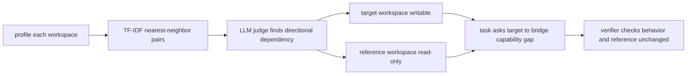

# Terminal-Universe：把 Agent 轨迹反向变成可复用终端环境

## 元信息

| 字段 | 内容 |
|---|---|
| 标题 | Terminal-Universe: Turning Agent Trajectories into Scalable Terminal Environments |
| 类型 | 论文 |
| 方向 | 大模型 Agent / 终端 Agent / 轨迹到环境 / SFT 数据构造 |
| 官方链接 | [arXiv:2609.04148](https://arxiv.org/abs/2609.04148) |
| 官方时间 | arXiv API 标记 published 与 updated 均为 2026-09-03T17:41:05Z |
| 作者 | Jie Wu, Zhenru Zhang, Beichen Zhang, Xuwu Wang, Yuhui Su, Mouxiang Chen, Peng Wang, Zhihai Wang, Que Shen, Hao Zhou, An Yang, Fei Huang, Yujiu Yang, Dayiheng Liu |

## TL;DR

- 这篇论文的问题不是“怎样再造一个终端 benchmark”，而是：公开 agent 轨迹已经很多，但 agent 后训练真正需要的是可反复查询、可执行、可验证的环境；一条轨迹只是一次冻结演示，训练价值会被原 agent 的能力、错误和任务单样本性限制。
- Terminal-Universe 的核心主张是把轨迹看成环境的观测日志：从文件读写、编辑和命令历史中恢复原始工作区，再用 completion agent 补齐缺失上下文，最后用 sufficiency judge 保留足够支持任务的工作区。
- 方法链分三层：先做 deterministic replay 得到部分工作区 `E_hat_0`，再做 agentic completion 得到 `E_hat`，再在 `E_hat` 上通过 Intent Recovery、Single-WS、Cross-WS、Multi-Round 四类 re-querying 生成新的训练任务。
- 数据规模上，论文从 359,593 条来源轨迹中重建 68,263 个环境；经过污染过滤、仓库级去重和任务充分性评估后，得到 37,273 个 task-sufficient environments，其中 terminal pool completion 后充分率达到 93.5%。
- 训练部分使用 Qwen3.7-Max 作为 teacher 生成 solution rollout 与 verifier，最终形成 31,977 条 verifier-filtered SFT demonstrations，约 1.42B tokens；student 是 Qwen3.5-27B，SFT 两个 epoch。
- 主结果显示，Terminal-Universe-27B 在 Terminal-Bench 2.1 Terminus2-XML 下从 base 的 46.2 提升到 58.1，增幅 11.9；在 EvoCode-Bench v2 上 MT@4 从 6.3 到 20.1，Case Score 从 67.8 到 76.1。
- 最关键的消融不是“数据越多越好”，而是“环境是否真实可解、任务是否重新求解、失败样本是否过滤”：source-trajectory SFT 平均只有 36.7，Intent Recovery 到 52.1；replay + completion 比 replay only 高 4.2；Cross-WS verifier filtering 在少一半数据时从 53.2 提到 55.4。
- 局限同样清楚：统一 Ubuntu 24.04 容器会牺牲某些仓库特定依赖的保真度；环境分布受公开轨迹覆盖限制；任务、解答和 verifier 都由同一个 teacher 家族生成，可能共享盲点。

## 研究问题：为什么从轨迹回到环境

### 论文真正反对的默认假设

- 常见做法把 agent 轨迹直接当成 SFT demonstration：
  - 用户请求是 prompt。
  - 原 agent 的工具调用和代码改动是 answer。
  - 训练目标是模仿这条过程。
- 论文指出这里有两个结构性浪费：
  - **轨迹只消费一次环境**：同一个仓库或终端状态，本来可以衍生多个任务、多个 verifier、多个多轮会话。
  - **轨迹继承原 agent 的局限**：如果来源轨迹质量差、路径绕、工具使用低效，SFT 会学习这些行为。

### 作者的重新定义

作者把关系倒过来：

| 传统视角 | Terminal-Universe 视角 |
|---|---|
| 环境生成轨迹 | 轨迹泄露环境结构 |
| 轨迹是训练样本 | 轨迹是环境观测日志 |
| 目标是模仿原轨迹 | 目标是在恢复环境中重新求解 |
| 数据扩展靠更多演示 | 数据扩展靠更多可查询环境 |

这个重定义很重要。它把 agent 后训练的数据单元从“消息序列”提升到“可执行上下文”。一旦恢复出工作区，研究者就可以问新的问题：

- 这个工作区还能支持哪些同仓库任务？
- 它能否和另一个相关仓库组成跨工作区任务？
- 初始任务解决后，能否继续追加需求、修 bug、处理需求冲突？
- 解答是否真的通过隐藏 verifier，而不是只看起来像完成了？

## 论文主张与论证路线

| Claim | Mechanism | Evidence | Boundary |
|---|---|---|---|
| 轨迹可以恢复出可复用环境 | deterministic replay 还原轨迹暴露的最早文件状态，agentic completion 补齐缺失文件与依赖 | 68,263 个 reconstructed environments；terminal pool completion 后充分率 93.5% | 只恢复轨迹暴露或可合理补齐的上下文，未访问的项目特定内容仍可能缺失 |
| 重新求解比模仿原轨迹更有效 | Intent Recovery 提取原始任务，再由强 teacher 在恢复环境中重新 roll out | Source trajectories 平均 36.7，Intent Recovery 平均 52.1 | Intent Recovery 不做 verifier filtering，因此它验证的是重求解价值，不验证所有任务质量 |
| verifier 过滤能提高困难任务质量 | Single-WS/Cross-WS 任务由 agent 写 pytest verifier，只保留全通过轨迹 | Cross-WS w/o verifier 53.2，w/ verifier 55.4，且数据从 7.1k 降到 3.5k | verifier 与 solution 同由 Qwen3.7-Max 生态生成，可能存在共享盲点 |
| breadth 与 depth 不是口号，而是不同训练压力 | Cross-WS 要跨仓库迁移能力，Multi-Round 要保持累计需求和修复失败 | Cross-WS median turns 23 vs Single-WS 14；Multi-Round 让 MT@4 从 18.4 到 21.0 | EvoCode-Bench v2 只有 26 tasks、227 rounds，深度泛化仍需更多评测 |
| 固定预算下增加环境比复用环境更有效 | 相同约 35k records 下比较 environment、query、solution 三种 expansion | environment expansion 56.0，query expansion 53.8，solution expansion 53.9 | 结论针对 Single-WS 与 Terminal-Bench 2.1 设置，不能直接推广到所有训练域 |

## 方法机制：从轨迹到四类 re-querying

### Stage 1：deterministic replay

Replay 的输入是一条轨迹 `tau`，里面包含文件读、写、编辑和命令执行。作者按时间顺序处理这些事件：

- 对被访问过的 path，记录最早可见内容。
- 对 agent 后来修改过的文件，取第一次修改前的版本。
- 对 agent 在解题过程中创建的新文件，不放回初始工作区。
- 对截断输出或只暴露片段的文件，只恢复可见部分。

因此 replay 产物 `E_hat_0` 是一个 partial workspace。它的价值是保守：不把 agent 解法当作环境初始状态，也不凭空假设没有证据的文件已经存在。

公式化地看：

```text
Input:
  tau = [(event_1, t_1), ..., (event_n, t_n)]

Replay:
  for each accessed path p:
    earliest[p] = first observable content before agent modification
    latest[p] = last observable content after agent modification

Output:
  E_hat_0 = {p: earliest[p] for p in observed pre-existing files}
  Delta_agent = {p: latest[p] - earliest[p] for modified files}
```

这里的关键不是恢复完整仓库，而是恢复一个不会泄漏答案的初始工作区。`Delta_agent` 可以用于理解或验证，但不能直接成为训练输入的答案。

### Stage 2：agentic completion

Replay 后的工作区通常太薄。论文给 completion agent 的任务是：

- 读取 recovered request、partial workspace 和 file inventory。
- 创建缺失但必要的项目文件。
- 补全 partial files。
- 配置能让任务可解的依赖和上下文。
- 明确不能实现用户任务，也不能泄漏解法应该改哪里。

这个阶段承担一个微妙边界：它要让环境足够像真实项目，但又不能把答案写进环境。论文在附录中报告，人工抽样 30 个 terminal completions，22 个只包含任务相关支撑文件，8 个引入了不必要的大文件或代码；样本里没有发现直接任务解法。

### Stage 3：environment filtering

Completion 之后，作者仍不默认接受环境。一个 read-only judge 会检查 `E_hat` 是否 task-sufficient：

- 是否有足够 source、configuration、data、structure。
- 是否能让有能力的 agent 开始处理 recovered task。
- 不要求所有依赖、cache、generated output 都预先存在。
- 评估重点是上下文充分性，而不是马上 build 成功。

论文给出的主表很直接：

| Pool | # Environments | Post-replay sufficient | Post-completion sufficient |
|---|---:|---:|---:|
| Terminal | 38,294 | 40.2% | 93.5% |
| SWE | 1,900 | 20.1% | 77.1% |

这张表解释了为什么 completion 不是装饰模块。仅靠 replay，terminal 轨迹还不到一半充分；SWE 更低。completion 后 terminal 达到 93.5%，SWE 达到 77.1%，下游任务合成才有可靠基础。

## 四类任务生成：同一个环境的四种用法

### Intent Recovery：恢复原任务，但不照抄原轨迹

Intent Recovery 将一条或多条源用户请求整理成自包含任务：

- 单轮轨迹：核心请求直接成为任务。
- 多轮轨迹：首个实质请求确定主题，后续请求只有在澄清、约束、扩展同一任务时才合并。
- agent actions 和文件证据只用于解释意图。
- 最终保留用户明确提出的需求，不把 agent 自己做过的实现细节伪装成需求。

这一点决定了消融的解释：Intent Recovery 不是“更干净地模仿旧轨迹”，而是把旧轨迹还原为任务，再让强 teacher 在恢复环境里重做。

### Single-WS：在单个恢复工作区里生成新任务

Single-WS 的 generator 会探索一个 workspace，并合成五个候选任务。约束包括：

- groundedness：任务必须基于现有文件、接口和行为。
- structural diversity：任务不能只是同质小修小补。
- verifiability：任务需要能被确定性本地命令验证。

作者随机选择一个 valid candidate 做 rollout 与 verifier。这避免一个环境只贡献原始任务，也避免把同一个工作区榨成大量高度相似样本。

### Cross-WS：让一个仓库向另一个仓库借能力

Cross-WS 是论文的 breadth expansion。流程可以写成：



它的关键在“方向性”。不是把两个相似仓库拼在一起，而是找出：

- reference 已经实现某个能力。
- target 缺少这个能力。
- 任务要求 target 实现可观测行为。
- prompt 只告诉 solver reference 的挂载路径，不展开内部答案。

附录 RSA 例子很典型：target 有 key generation、encryption、signing，却缺 decryption；reference 有完整 round trip。任务要求 solver 阅读 read-only reference，将 RSA decryption 能力迁移到 writable target，并保持 reference 不变。

### Multi-Round：从一次任务扩展到持续会话

Multi-Round 是 depth expansion。它不是简单让用户 agent 随机追加需求，而是维护一个 requirement tracker：

- active requirements：当前仍有效的需求。
- satisfied requirements：已经满足的需求。
- updated requirements：被修改或替代的需求。

每一轮开始前，user agent 更新规格；verifier 先写 acceptance tests；coding agent 完成后，测试 runner 同时检查新 criteria 和 active regression checks。重要边界是 solver 看不到测试脚本和 traceback，只收到 user agent 转写的自然语言反馈。

论文保留三种用户请求风格：

| 交互风格 | 占比 | 训练意义 |
|---|---:|---|
| Feature extension | 62.7% | 成功后追加新能力，训练持续开发 |
| Feature revision | 29.3% | 失败后要求修正，训练错误诊断与恢复 |
| Feature conflict | 8.0% | 主动替换旧需求，训练需求变更处理 |

保留后的 Multi-Round 记录有 3,079 条，平均 4.51 轮；其中 69.6% 包含一次失败并在后续被修复。这比“全成功演示”更接近真实 agent 开发，因为它保留了失败、反馈、修复之间的因果链。

## 数据构造与训练设置

### 来源轨迹与过滤

论文使用的来源包括 SWE-rebench、SWE-smith、CoderForge、SWE-Gym、LFM2-Terminal、LiteCoder-Terminal。总量为：

| 指标 | 数值 |
|---|---:|
| 来源轨迹 | 359,593 |
| reconstructed environments | 68,263 |
| task-sufficient environments | 37,273 |
| verifier-filtered SFT demonstrations | 31,977 |
| training tokens | 约 1.42B |

作者明确排除了 Terminal-Bench-derived sources，并对 Terminal-Bench tasks 做 13-gram contamination check。这一点支撑主结果的可信度：如果训练数据直接含有评测任务，Terminal-Bench 提升就很难解释为泛化。

### SFT 数据组成

最终 verifier-filtered corpus 包含三类新合成任务：

| 组件 | demonstrations | 作用 |
|---|---:|---|
| Single-WS | 25,386 | 学习在一个恢复工作区内解决新任务 |
| Cross-WS | 3,512 | 学习跨仓库读取、迁移和适配能力 |
| Multi-Round | 3,079 | 学习持续会话、回归检查和失败恢复 |
| 合计 | 31,977 | Full Mixture |

Intent Recovery 主要用于验证“重求解优于模仿”，不作为这里 verifier-filtered mixture 的全部主体来解释。

### Teacher 与 student

训练链路里有两个角色：

- Teacher：Qwen3.7-Max，xhigh effort，运行在 Claude Code scaffold 内。
- Student：Qwen3.5-27B，用 Terminal-Universe 生成数据做 SFT。

rollout 设置也被详细固定：

| 设置 | 数值 |
|---|---|
| temperature | 1.0 |
| top-p | 0.95 |
| context window | 256k tokens |
| per-turn cap | 65,536 tokens |
| summarization trigger | 176k tokens |
| max turns | 500 |
| terminal task timeout | 4 hours |
| EvoCode stateful task timeout | 10 hours |

这些细节说明论文比较的不是轻量 chat benchmark，而是长上下文、长工具链、容器化执行下的 agent 行为。

## 实验结果：提升来自哪里

### 主结果

| Model | Data size | Terminal-Bench 2.1 Terminus2 | EvoCode MT@4 | EvoCode Case Score |
|---|---:|---:|---:|---:|
| Qwen3.5-27B base | - | 46.2 | 6.3 | 67.8 |
| Terminal-Universe-27B | 32.0k | 58.1 | 20.1 | 76.1 |
| 增量 | - | +11.9 | +13.8 | +8.3 |

Terminal-Bench 2.1 的 +11.9 说明单轮终端任务能力提升；EvoCode 的 MT@4 从 6.3 到 20.1 则更重要，因为它衡量模型在持久工作区里连续通过多轮需求的能力。Case Score 提升较小但稳定，表示不是只靠少数长链路过关，部分 verifier cases 的通过率也提高了。

### 重求解 vs 模仿旧轨迹

| Variant | Data size | Claude Code | Terminus2-XML | Avg. |
|---|---:|---:|---:|---:|
| Qwen3.5-27B | - | 47.8 | 46.2 | 47.0 |
| Source trajectories | 35.8k | 33.0 | 40.3 | 36.7 |
| Intent Recovery | 35.8k | 51.3 | 52.9 | 52.1 |

这个表是全文最有解释力的证据之一。同样 35.8k 数据，直接学 source trajectories 不但没提升，平均还跌到 36.7；恢复 intent 后由强 teacher 在恢复环境中重新求解，平均到 52.1。

合理解释是：

- source trajectories 混合了不同 agent 的策略、错误和低效路径。
- recovered environment 给 teacher 重新探索的空间。
- SFT 学到的是更一致的工具调用和修复策略，而不是历史轨迹里的偶然路径。

### completion 的净贡献

| Variant | Records | Terminus2-XML |
|---|---:|---:|
| Qwen3.5-27B | - | 46.2 |
| Replay only | 35.8k | 48.7 |
| Replay + agentic completion | 35.8k | 52.9 |

completion 带来 4.2 点提升，并把方差从 ±3.5 降到 ±1.4。这里的机制解释很直接：replay-only 环境里，teacher 常常要先补环境再解题，SFT 中有一部分监督消耗在修环境；completion 后，示范更集中在任务本身。

### verifier filtering 的作用

| Variant | Records | Terminus2-XML |
|---|---:|---:|
| Single-WS w/o verifier | 35.1k | 56.0 |
| Single-WS w/ verifier | 25.4k | 56.4 |
| Cross-WS w/o verifier | 7.1k | 53.2 |
| Cross-WS w/ verifier | 3.5k | 55.4 |

Single-WS 中 verifier 过滤只带来 0.4 点，因为任务相对简单，teacher pass@1 也更高。Cross-WS 中，过滤后数据量少于一半却高 2.2 点，说明困难任务里失败轨迹的负迁移更强。

### breadth expansion 的真实难度

Cross-WS 不是简单多一个输入文件。论文报告：

| 指标 | Single-WS | Cross-WS | 变化 |
|---|---:|---:|---:|
| Median turns | 14 | 23 | 1.6x |
| Median tool calls | 20 | 38 | 1.9x |
| Median tokens / record | 30.4k | 46.5k | 1.5x |
| Teacher pass@1 | 72.3% | 49.2% | -23.1 点 |

这解释了为什么 Cross-WS 数据少但有价值。它迫使模型完成三个动作：

1. 在 reference 中定位能力。
2. 把能力抽象成 target 需要的行为。
3. 在 target 的结构和风格里重新实现，而不是复制粘贴。

### depth expansion 与多轮 verifier

| Variant | Data size | MT@4 | Case Score |
|---|---:|---:|---:|
| Single-WS | 25.4k | 18.4 | 71.9 |
| Single-WS + Multi-Round | 28.5k | 21.0 | 76.9 |
| Single-WS + Multi-Round w/o round verifier | 28.5k | 18.8 | 73.2 |

这里的结论不是“多轮越长越好”，而是“每轮都要有 grounded verifier”。去掉 round-level verifier 后，数据规模相同，MT@4 下降 2.2，Case Score 下降 3.7。没有 verifier 指向失败点，user continuation 会变成长但不精确的追加文本，训练价值降低。

### 固定数据预算怎么花

| Expansion axis | Envs | Queries / env | Solutions / query | Records | Terminus2-XML |
|---|---:|---:|---:|---:|---:|
| Base pool | 17,558 | 1 | 1 | 17.6k | 53.2 |
| Environment expansion | 35,116 | 1 | 1 | 35.1k | 56.0 |
| Query expansion | 17,558 | 2 | 1 | 35.1k | 53.8 |
| Solution expansion | 17,558 | 1 | 2 | 35.1k | 53.9 |

这张表对后训练很有启发：在 terminal-agent 任务里，新增环境比在同一环境上多问一个问题、或对同一问题多采一个解法更有效。原因是环境本身提供了新的文件结构、依赖、领域语义和错误模式。

## Figure/Table 证据逐项解读

### Figure 1 / framework

- 支持的 claim：轨迹和环境是一集交互的两种视图，存在从轨迹反推环境的路径。
- 机制意义：把 deterministic replay、agentic completion、task sufficiency、四类 re-querying 放在一条数据流水线上。
- 不能证明的事：图本身不证明恢复环境真实，只说明系统结构；真实性要靠 sufficiency 表、completion 消融和最终评测支撑。

### Table 1 / 方法定位

- 支持的 claim：Terminal-Universe 与既有方法的差异在于 trajectory reconstruction、37.3k envs、32.0k tasks、verifier、multi-round、cross-workspace 同时存在。
- 机制意义：它不是单一 benchmark，也不是纯合成任务，而是把公开轨迹转成可重用环境，再扩展任务空间。
- 边界：代表性方法对比不能覆盖所有私有数据生产 pipeline，尤其不能推断商业 coding-agent 训练栈。

### Table 2 / workspace sufficiency

- 支持的 claim：completion 让 replay 产物从“可观察片段”变成“任务充分环境”。
- 关键数字：Terminal 40.2% 到 93.5%，SWE 20.1% 到 77.1%。
- 边界：sufficiency judge 是 agentic judge，不等于人工逐仓库审计；它评估上下文是否足够，不保证所有系统依赖完全可复现。

### Table 3 / main results

- 支持的 claim：Full Mixture SFT 改善单轮终端任务和多轮持久任务。
- 关键数字：Terminal-Bench 2.1 58.1；EvoCode MT@4 20.1；Case Score 76.1。
- 边界：teacher Qwen3.7-Max 仍明显强于 student，Terminal-Universe-27B 不是追上 teacher，而是证明数据构造有效。

### Ablation tables

- Task Re-solving 表证明“不要学旧轨迹，要重求解”。
- Completion 表证明“环境补全不是可省模块”。
- Verifier 表证明“困难任务需要过滤失败轨迹”。
- Expansion-axis 表证明“数据预算优先买新环境”。

这些表共同形成论文的证据闭环：结构设计不是凭直觉堆模块，每个模块都有对应消融。

## 相关工作位置：它和其他 terminal-agent 数据路线的区别

作者把相关路线分成几类：

- 从真实开发历史恢复仓库状态：如 SWE-Gym、R2E-Gym。
- 从工作仓库出发制造 bug 或任务：如 SWE-smith、CLI-Gym。
- 从 specification 合成任务和执行环境：如一些 terminal task synthesis pipeline。
- 递归扩展已验证种子任务：如 RST。
- 多轮交互评测：如 InterCode、SWE-INTERACT、SWE-Together、ICAE-Bench、EvoCode-Bench v2。

Terminal-Universe 的位置是：

- 不从零写环境。
- 不只复用已有仓库 issue。
- 不把轨迹当最终监督。
- 把轨迹当环境证据，再用环境合成单仓库、跨仓库和多轮任务。

它更像一种“轨迹考古学”：公开 agent 运行日志越多，越可能从中恢复出更多可训练环境。但这个比喻有边界，因为恢复不是完全还原历史仓库，而是构造足够支持任务的 executable workspace。

## 证据边界与可复现性问题

### 细节库存：这篇论文实际提供了什么

| 维度 | 可提取细节 | 对论证的作用 |
|---|---|---|
| 方法名 | Terminal-Universe、Intent Recovery、Single-WS、Cross-WS、Multi-Round | 明确四条数据扩展路径不是同一个 prompt 模板的变体 |
| 输入 | terminal-style CLI 与 SWE 轨迹、文件读写编辑事件、用户请求、agent actions | 说明环境来自历史轨迹，而不是纯合成 specification |
| 中间状态 | `E_hat_0` partial workspace、`E_hat` completed workspace、requirement tracker、directional dependency edge | 让“轨迹到环境”的过程可以逐步审计 |
| 输出 | task-sufficient environments、agent-authored verifier、teacher rollout、SFT demonstrations | 连接数据构造和后训练目标 |
| benchmark | Terminal-Bench 2.0/2.1、EvoCode-Bench v2 | 分别覆盖单轮终端任务和多轮持久需求 |
| baselines | Qwen3.5-27B base、source trajectories、replay only、无 verifier、单一 expansion axis | 用消融把贡献拆到具体模块 |
| 关键指标 | pass rate、MT@4、Case Score、teacher pass@1、sufficiency rate、turn/tool/token statistics | 避免只看最终分数，能解释任务难度和数据质量 |
| 失败证据 | replay-only 环境不充分、无 verifier 的 Cross-WS 性能下降、completion 抽样中 8/30 有冗余文件 | 提醒 pipeline 不是无损恢复，也不是自动生成越多越好 |

### 伪代码：Terminal-Universe 的主循环

```text
Input:
  trajectories T
  teacher model M_teacher
  student model M_student

State:
  recovered_envs = []
  sft_records = []

for tau in T:
  if tau.end_state has fewer than 5 files or 100 lines:
    continue
  E0 = deterministic_replay(tau)
  q = recover_intent(tau)
  E = agentic_completion(E0, q)
  if not sufficiency_judge(E, q):
    continue
  recovered_envs.append((E, q))

for (E, q) in recovered_envs:
  candidates = [
    intent_recovery(q),
    single_workspace_task(E),
    cross_workspace_task(E, related_envs),
    multi_round_continuation(E, q)
  ]
  for task in candidates:
    verifier = build_verifier(E, task)
    rollout = solve_with_teacher(M_teacher, E, task)
    if verifier_passes(verifier, rollout):
      sft_records.append(format_for_sft(rollout))

Output:
  fine_tune(M_student, sft_records)
```

这段伪代码暴露出一个容易被摘要忽略的事实：Terminal-Universe 的中心不是单个模型调用，而是一条选择性很强的数据生产线。每一层都可能丢样本：

- seed selection 丢掉文件证据太少的轨迹。
- decontamination 丢掉评测污染风险。
- sufficiency judge 丢掉上下文不足的环境。
- verifier filtering 丢掉没有真正完成任务的 teacher rollout。
- Multi-Round 还会剪掉末尾连续失败的 suffix，只保留至少两个 verified passing rounds 的会话。

因此最终 31,977 条 SFT demonstrations 不是从 359,593 条轨迹线性扩增出来的“更多数据”，而是经过多级约束后的可训练子集。

### 容器保真度

论文统一使用 Ubuntu 24.04 container，并允许网络访问拉取缺失依赖。优点是部署简单、成本低、规模化容易；缺点是某些仓库可能依赖特殊系统包、特定 OS 镜像、私有服务或历史构建缓存。

因此结果应理解为：

- Terminal-Universe 能恢复并训练一大批通用 terminal/software workspaces。
- 它不保证每个原始环境的二进制级、服务级、镜像级复现。

### 数据分布受公开轨迹限制

来源轨迹决定了能恢复什么：

- 多文件编辑轨迹暴露更多项目结构。
- 命令型或 view-only 轨迹暴露较少文件内容。
- 高质量 agent 轨迹可能带来更复杂环境。
- 低质量轨迹可能只恢复出浅层任务。

论文讨论中提到，源轨迹越复杂，合成 rollout 也倾向更复杂；多个 session 在同一 workspace 上可聚合更多状态。这是未来扩展方向，但当前证据仍主要来自列出的公开 corpora。

### 单一 teacher 的共享盲点

Qwen3.7-Max 参与 completion、task generation、verifier construction 和 solution rollout。这样工程上统一，但会带来三个风险：

- 它不会生成自己想不到的任务类型。
- 它写的 verifier 可能漏掉自己解法里的错误。
- 它的风格可能被 student 过度吸收。

作者也承认未来可用多个 teacher，或者独立 verifier model。这一点对安全研究尤其关键：如果 verifier 与 solver 同源，评测更容易出现共谋式盲区，即双方都忽略相同边界条件。

### 失败案例的解释价值

论文附录的 Multi-Round sensor-ingestion 例子说明，失败并不是要被全部删掉。第一轮 incremental ingestion 后，计数正确但聚合值错误且不稳定；隐藏 verifier 抓住问题，user agent 把它转成自然语言抱怨，要求平均值、最小值、最大值使用真实读数，并在 fresh run、reset、no-op rerun 下保持确定。下一轮修复成功后，系统继续追加 alerting、append-only history、reporting、reconcile repair 等需求。

这类轨迹的价值在于：

- 它给 student 展示如何从用户可见症状定位实现错误。
- 它保留了 active requirements，防止修新 bug 时破坏旧行为。
- 它把需求冲突作为正常开发事件，而不是把所有变化都解释成失败。
- 它让 verifier 仍在幕后提供硬约束，避免用户反馈变成松散聊天。

从 agent 研究角度看，这比单轮“写代码并通过测试”的样本更接近真实软件维护。模型不只是学习一次性完成任务，还学习在状态持续、需求累积、失败可恢复的环境中工作。

### 不能从论文推出的结论

- 不能推出所有公开 agent 轨迹都适合恢复环境；论文已经过滤掉 view-only、unsupported action formats 和文件证据不足的样本。
- 不能推出 completion agent 总是安全可靠；抽样中已经出现不必要大文件或代码，只是没有发现直接任务解法。
- 不能推出 Cross-WS 一定优于 Single-WS；它更难、更贵、teacher pass@1 更低，价值来自补充 breadth，而不是替代同仓库任务。
- 不能推出 verifier 通过等于人工验收；verifier 是可执行约束的近似，仍可能漏掉规格外质量、性能、安全和许可证问题。
- 不能推出 Terminal-Universe-27B 已具备 teacher 级能力；Qwen3.7-Max 在 Terminal-Bench 2.1 仍达到 74.5，明显高于 student 的 58.1。

这些边界不削弱论文贡献，反而说明它的证据链比较克制：作者没有把数据构造 pipeline 包装成通用 agent 解决方案，而是在明确的终端环境、公开轨迹、可执行 verifier 和 SFT 设置中证明了一个可扩展方向。

## 研究者视角的领域延伸

### 对 Agent 后训练的直接启发

Terminal-Universe 支持一个更强的数据单位假设：

```text
better_agent_data = executable_environment
                  + grounded_task
                  + hidden_verifier
                  + teacher_rollout
                  + failure_recovery_trace
```

如果这个假设成立，后训练数据治理的重点会从“收集更多漂亮对话”转向：

- 环境是否可执行。
- verifier 是否独立可信。
- 任务是否覆盖不同工作区结构。
- 多轮历史是否保留失败与修复。
- 是否做了污染过滤和仓库级去重。

### 对安全与可靠性的进一步问题

这篇论文不是安全论文，但它暴露出几个安全问题：

- completion agent 补环境时，如何防止写入错误依赖、隐藏解法或不安全 fixture？
- Cross-WS 中 reference 是 read-only，但 solver 读取另一个仓库时是否可能引入许可证、秘密、恶意代码模式或 prompt injection？
- Multi-Round user agent 将 verifier 结果转成自然语言反馈，如何防止 feedback 泄漏隐藏测试？
- teacher 同时生成任务、测试和解答时，是否需要 adversarial verifier 或人类抽检来降低共享盲点？

这些问题决定了 Terminal-Universe 类 pipeline 能否进入更高风险的 agent training 场景。对于普通 coding-agent 能力训练，当前证据已经很强；对于安全敏感 agent，仍需要独立 verifier、数据 provenance、许可证审计和恶意样本过滤。

### 和当前 agent memory / skill 方向的关系

Repo-To-Skill 类工作强调从仓库抽取 operational knowledge；Terminal-Universe 则强调从轨迹恢复 executable context。两者可以互补：

- skill 提供可迁移操作知识。
- environment 提供可执行练习场。
- verifier 提供闭环反馈。
- multi-round continuation 提供需求变化和修复轨迹。

更进一步的问题是：能否把一次真实 agent 任务结束后的 workspace、memory、tool trace、用户反馈都转成下一轮训练环境？如果可以，agent 系统会从“记录日志”转向“把日志结构化为可训练世界”。

## 结论

- Terminal-Universe 的贡献不在某一个 benchmark 数字，而在把“轨迹 → 环境 → 任务 → verifier → 重求解 → SFT”的链路跑通，并用消融证明每个关键环节有贡献。
- 最值得带走的结论是：直接模仿公开 agent 轨迹可能学到坏策略；更好的做法是从轨迹恢复环境，让更强 teacher 在可验证任务中重新产生监督。
- 对大模型 Agent 后训练而言，环境多样性比同一环境上的重复 query 或重复 solution 更有价值；对多轮 agent 而言，失败、反馈、修复链路必须被 verifier 约束，不能只靠自然语言 continuation。
- 论文的主要边界是容器保真度、公开轨迹覆盖和单一 teacher 盲点。后续如果要把这类 pipeline 用在安全敏感 Agent，需要把 verifier 独立性、数据来源审计和跨仓库风险控制作为一等机制。
