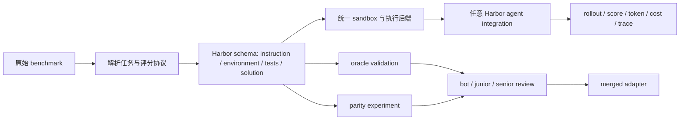
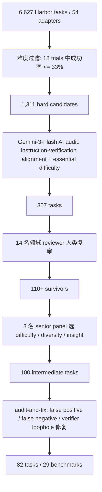

# Harbor Adapters 与 Harbor-Index：Agent 评测从“各跑各的榜”走向可审计基础设施

### 元信息与 TL;DR

- **论文**：[Harbor Adapters and Harbor-Index: Infrastructure and a Curated Meta-Dataset for Large-Scale Agentic Evaluation](https://arxiv.org/abs/2609.04298)
- **版本**：arXiv:2609.04298v1
- **原始时间证据**：arXiv API 记录 `published/updated = 2026-09-03T16:26:20Z`；arXiv `cs.AI/new` 在 2026-09-07 的新列表中列出该论文。
- **开源工件**：[harbor-framework/harbor](https://github.com/harbor-framework/harbor)、[harbor-framework/harbor-index](https://github.com/harbor-framework/harbor-index)、[Harbor-Index 网站](https://harbor-index.org)
- **主题归类**：大模型 Agent 评测基础设施、benchmark adapter、agent harness、困难任务索引。

**TL;DR：**

1. 这篇论文关心的不是“某个模型又刷高了哪个榜”，而是 <u>Agent 评测本身能不能被规模化、复现、横向比较</u>。
2. 作者提出 Harbor Adapters，把不同 benchmark 的任务、环境、测试和参考解统一到 Harbor schema，目标是把 `m` 个 benchmark 与 `n` 个 agent 的集成成本从 `O(mn)` 降到 `O(m+n)`。
3. 论文已把 80+ benchmark port 到 Harbor，并在 54 个 benchmark、6,627 个任务、16 个 model-harness 配置、三次重复下运行大规模评测，消耗约 226B 输入/输出 token 和 30 万美元以上计算成本。
4. 主实验发现：模型能力对分数的解释力强于 harness；benchmark 空间低秩且存在大量冗余；frontier 模型在中等难度任务上收益最大；未解决任务里相当一部分其实是任务/验证器设计缺陷。
5. Harbor-Index 是从 6,627 个候选任务中筛出的 82 个任务，覆盖 29 个 benchmark；筛选过程包括难度过滤、AI audit、人类 audit、false positive/false negative 修复循环。
6. Harbor-Index 1.0 的强约束是“难而不坏”：没有任何被评测的 model-harness 配置超过 30% pass rate，GPT-5.5 + Codex 最高为 28.0%。
7. 关键局限也很清楚：54 个 adapter 仍不是整个 Agent 评测生态，LLM-as-a-judge 有偏差，Harbor-Index 只是全量任务分布的 proxy，且 leaderboard 压力未来可能重新制造 reward hacking。
8. 对研究者来说，这篇论文最重要的贡献是把 Agent 评测从“benchmark 论文附属实验”提升为“可审计的测量基础设施问题”。

### 研究问题：为什么 Agent 评测不能只看榜单？

论文从一个很实际的断裂开始：

- Agent benchmark 越来越多，但每个 benchmark 往往自带：
  - 独立环境；
  - 独立动作空间；
  - 独立评分脚本；
  - 独立 prompt/harness 假设；
  - 独立 leaderboard 或论文报告方式。
- 模型和 agent scaffold 也越来越多，每个系统又有自己的：
  - tool interface；
  - sandbox；
  - token budget；
  - retry/verification loop；
  - 结果上传与轨迹记录格式。

如果有 `m` 个 benchmark 和 `n` 个 agent，朴素做法需要为每一对写一次 glue code：

```text
传统集成成本 = O(m * n)
Harbor 目标成本 = O(m + n)
```

这个公式不是算法复杂度炫技，而是在说明评测研究的基础设施瓶颈：

| 评测断裂 | 表面现象 | 论文真正关心的问题 |
|---|---|---|
| benchmark-harness 绑定 | 一个榜只能跑某些 agent | 分数到底测的是模型，还是测的是接入方式？ |
| 环境复现困难 | oracle solution 也可能跑不过 | 失败是 agent 不会做，还是任务/环境坏了？ |
| leaderboard 报告不一致 | 新模型只报告少数热门榜 | 进步是否跨 domain 泛化？ |
| 验证器不可靠 | agent 可以通过漏洞拿分 | pass rate 是否等于真实解决？ |

因此，作者要回答的不是单一 benchmark 的 SOTA 问题，而是四个更底层的问题：

1. **Benchmark 信号**：54 个 benchmark 真的提供 54 种独立能力测量吗？
2. **Harness 影响**：同一个模型换 harness 后，分数变化主要来自工具链还是模型能力？
3. **效率权衡**：frontier 模型昂贵，但是否用更少 token 抵消成本？
4. **失败归因**：未通过任务到底是模型失败、harness 失败，还是任务本身坏了？

### 论文主张与论证路线

作者的论证结构可以整理成 `claim -> mechanism -> evidence -> boundary`：

| Claim | Mechanism | Evidence | Boundary |
|---|---|---|---|
| Agent 评测需要统一基础设施 | Harbor task schema 把 instruction、environment、tests、solution 标准化 | 80+ benchmark adapters；22 agents；多 sandbox 后端 | adapter fidelity 仍依赖人工审查和 parity 实验 |
| 大规模横评能揭示榜单冗余 | 16 个 model-harness 配置跑 54 benchmarks 和 6,627 tasks | PCA、Spearman 相关、task subset ranking fidelity | 分析依赖当前模型集合和当前 benchmark 版本 |
| 模型能力比 harness 更重要 | 用 benchmark random intercept 的线性混合模型控制难度 | ICC=0.75；model effect range 是 harness effect range 的 5.2 倍 | harness 仍会改变行为、timeout 和工具效率 |
| 困难任务不等于好任务 | Harbor-Index 用 audit-and-fix 剔除 verifier mismatch、reward hack 和 broken task | 6,627 -> 1,311 -> 307 -> 100 -> 82 任务 | Harbor-Index 是 proxy，不是全量 benchmark 分布 |
| 当前 Agent 仍远未饱和 | Harbor-Index 1.0 pass rate 最高 28.0% | 9 模型 × 2 harness × 82 tasks = 1,476 rollouts | 低 pass rate 需要和任务质量 audit 一起解释 |

这条路线的关键在于：

- 论文没有把“难”当作天然优点；
- 它先证明“现有评测很碎”，再证明“统一后能更系统地看到冗余、成本和失败模式”；
- 最后用 Harbor-Index 说明“压缩评测集”不能只是抽样，而必须经过任务质量审计。

### 方法机制：Harbor Adapters 到底适配什么？

Harbor task schema 把每个 benchmark 任务压成四个核心面：

| 字段 | 含义 | 在 Agent 评测里的作用 |
|---|---|---|
| `instruction` | agent 接收到的任务说明 | 控制任务目标、可用信息、输出要求 |
| `environment` | sandbox、依赖、文件、服务、资源限制 | 决定任务是否可执行、是否可复现 |
| `tests` | verifier、unit tests、LLM judge、指标聚合 | 决定 pass/fail 或连续分数 |
| `solution` | oracle/reference solution 或已知正确轨迹 | 用来检查 benchmark 自身是否可信 |

Adapter 的意义不是“把数据转成另一个 JSON”，而是把每个 benchmark 的隐含实验协议显式化：

1. **解析与重构**：把原 benchmark 的样本、文件、gold answer、grader 解析到 Harbor schema。
2. **环境对齐**：重建 Docker image、依赖、网络策略、资源限制和执行入口。
3. **验证逻辑集成**：把 unit tests、exact match、LLM-as-a-judge 或连续指标接入统一 runner。
4. **oracle validation**：要求参考解能通过，不能通过时必须解释是数据、环境还是 verifier 问题。
5. **parity experiment**：在原 benchmark 与 Harbor adapter 之间用相同 agent、model、prompt、tool set、decoding 和执行配置对比均值与 SEM。
6. **三阶段 review**：bot 检查 schema/文档/oracle，人类 reviewer 检查语义和复现，team lead 审批非平凡设计。

用 Mermaid 表示，机制是：



这里最值得注意的是 `solution` 字段。

- 对静态 QA benchmark，gold label 通常只是答案；
- 对 Agent benchmark，solution 往往是可执行轨迹、patch、脚本或可重建状态；
- 如果 solution 自己不能稳定通过 tests，那么 agent 的失败就不能直接解释成能力不足。

论文附录给出大量这类例子：

| 问题类型 | 例子 | 为什么重要 |
|---|---|---|
| oracle 失败 | SWE-Bench Verified 有 4 个 oracle 因数据/基础设施错误失败；GSO oracle 因时间方差只达 87.3% | 评测下界被任务缺陷污染 |
| 隐式假设 | 某些 grader 依赖 newline、regex、隐式 import、固定 answer extraction | agent 可能因文档外格式要求失败 |
| 非确定 scoring | 网络调用、时间 seed、并行 race、平台差异 | 多次运行分数不可比 |
| reward hacking surface | 可访问公开 gold answer、容器挂载泄漏、agent 可篡改 verifier | pass rate 可能被静默抬高 |

### 大规模实验设置：为什么 6,627 个任务很关键？

论文的大规模横评规模如下：

| 维度 | 设置 |
|---|---|
| benchmark 数 | 54 |
| task 数 | 6,627 |
| 模型数 | 8 |
| harness 条件 | 每个模型两个：Terminus-2 + 对应 native harness |
| model-harness 配置 | 16 |
| 重复次数 | 每个设置 3 trials |
| 轨迹规模 | 约 0.3M trajectories |
| token 消耗 | 226B input/output tokens |
| 计算成本 | 超过 30 万美元 |
| 模型族 | Google、OpenAI、Anthropic |
| native harness | Gemini CLI、Claude Code、Codex |

这组设置的价值在于：

- 同一模型既在 cross-family Terminus-2 下跑，也在自己的 native harness 下跑；
- 同一 benchmark 被多个模型和 harness 共同覆盖；
- 因此能把“模型能力”“harness 设计”“benchmark 难度”拆开分析，而不只是报告一个榜单分数。

作者还明确区分了两类 benchmark：

1. **原生 Agent benchmark**：如 SWE-bench，本来就需要代码、环境、工具交互。
2. **被 Agent 化的非 Agent benchmark**：如 HLE，被改造成 agent 可以使用工具、写文件、在可执行环境中交互的形式。

这个设计会带来一个重要边界：

- 它能扩大横评范围；
- 但把非 Agent benchmark agent 化时，action space 和 tool policy 本身会影响分数；
- 所以作者必须依靠 parity experiment 和 adapter README 记录偏差，而不能假设 port 后语义天然等价。

### 结果一：benchmark 多，不等于信号多

论文在 54 个 benchmark 上看到一个核心现象：评测空间比 benchmark 数量低维得多。

作者用三种方式说明这一点：

| 分析层次 | 结论 | 解释 |
|---|---|---|
| benchmark level PCA | 大多数方差沿少数共享方向变化 | 许多 benchmark 同时测到通用能力，而不是独立能力 |
| greedy Spearman selection | 选出 12 个 benchmark 后，其余 benchmark 与已选 benchmark 的相关至少约 `rho >= 0.7` | 继续加榜单的边际独立信息下降 |
| within-benchmark subset | 每个 benchmark 选 3 个代表任务，平均可恢复完整任务排名 `rho ~= 0.923` | 同一 benchmark 内也有大量重复能力信号 |

但作者没有得出“benchmark 可以随便少跑”的简单结论。

更细的判断是：

- **难度和独特性不同**：困难 benchmark 不一定独立，容易 benchmark 也可能测特殊能力。
- **同质任务更可压缩**：WideSearch 这类任务内部相似度高，3 个任务可接近完整排名。
- **多样任务更难压缩**：CyberGym 这类任务类型多样，3 个任务只能达到约 `rho = 0.75`。

对 Agent 研究者来说，这意味着：

1. 评测集扩张不能只追求数量；
2. leaderboard 不能只用“新榜更难”来证明进步；
3. benchmark 设计应显式报告“它补充了哪条能力轴”，而不是只报告平均 pass rate。

### 结果二：模型比 harness 更解释分数，但 harness 仍改变行为

论文用线性混合模型控制 benchmark 难度：

```text
score ~ model_fixed_effect + harness_fixed_effect + benchmark_random_intercept
```

变量含义：

| 符号/项 | 含义 |
|---|---|
| `score` | 某个 model-harness 在某 benchmark 上的得分 |
| `model_fixed_effect` | 模型本身带来的平均能力差异 |
| `harness_fixed_effect` | Codex、Claude Code、Gemini CLI、Terminus-2 等执行框架差异 |
| `benchmark_random_intercept` | benchmark 自身难度造成的基线差异 |
| `ICC` | 总方差中由 benchmark 间差异解释的比例 |

结果是：

- benchmark difficulty 的 ICC 为 `0.75`，说明很多分数差异首先来自 benchmark 难度；
- 8 个模型里 6 个模型系数显著；
- 4 个 harness 里 2 个 harness 系数显著；
- model fixed-effect range 为 `0.451`；
- harness fixed-effect range 为 `0.087`；
- 模型效应范围约为 harness 效应范围的 `5.2x`。

这支持一个谨慎结论：

> 在这组实验里，harness 影响 performance，但不能替代 base model capability。

不过论文后面也指出，harness 会塑造行为：

| Harness 差异 | 观察到的影响 |
|---|---|
| native harness 有更开放的迭代与自我修正 | 更适合需要反复验证、修补、再提交的任务 |
| Terminus-2 是更线性的 Plan-Execute-Complete | 在需要交互式修正时容易吃亏 |
| Terminus-2 的 bash-only action space 缺少 native image/web tools | 不能把所有失败都归因于模型 |
| native harness 匹配任务后把 timeout rate 从 42% 降到 26% | harness 会改变失败类型和资源消耗 |

因此，最稳妥的解读是：

- 如果研究问题是“模型能力排序”，统一 harness 有价值；
- 如果研究问题是“可部署 Agent 系统表现”，native harness 也应被纳入变量；
- 分数报告最好同时给模型、harness、工具权限、token/cost 和失败类型。

### 结果三：frontier 模型的收益集中在中等难度任务

作者定义经验任务难度：

```text
empirical difficulty = 1 - mean_pass_rate_across_all_model_harness_runs
```

这个定义的优点是可操作，缺点是依赖当前被评测系统：

- 如果当前系统整体弱，任务会显得更难；
- 如果 verifier 有 bug，难度也会被污染；
- 如果 action space 不匹配，难度会混入 harness artifact。

在这个定义下，任务难度呈 U 形分布：

| 难度区间 | 任务占比/数量信号 | frontier 相对收益 |
|---|---|---|
| 0.0-0.1 | 最容易桶，约 22.0% | 其他模型已经能做，边际提升小 |
| 0.3-0.7 | 中等到偏难任务 | frontier 绝对提升最大 |
| 0.9-1.0 | 最难桶，约 14.6% | 所有模型都接近失败，边际提升也小 |

论文 Figure 3 的要点是：

- frontier 模型在所有难度层都更强；
- 但收益不是单调随难度上升；
- 最简单任务已接近饱和，最难任务仍超出当前模型能力；
- 中等难度任务才是“多花钱换能力”最明显的区间。

token/cost 结论也很具体：

| 观察 | 解释 |
|---|---|
| frontier 模型在所有难度层使用更少 token | 更少误解任务、更少重复 tool call、更少冗余验证 |
| 最容易桶中 frontier token 约为 weaker model 的 42% | 简单任务上强模型能快速收敛 |
| 难度更高时相对 token 优势下降到约 61%-86% | 难题需要更多探索，强模型也无法完全省掉搜索成本 |
| 其他模型每次 trial 仍便宜 2-3x | token savings 不足以抵消 per-token 价格 |
| 0.7-0.8 难度桶成本差可达每 trial 0.37 美元 | 中高难任务上成本差最大 |

这对评测设计有直接启发：

- 如果目标是筛模型，太容易和太难的任务都不经济；
- 如果目标是理解失败，最难任务仍有价值，但必须先审计任务质量；
- 如果目标是持续 leaderboard，成本曲线应该和 pass rate 一起报告。

### 结果四：Agent 失败不总是“模型不会”

论文对 hard-task 上 frontier model 的失败轨迹做了专门审计：

| 审计设置 | 数字 |
|---|---|
| 人类标注轨迹 | 200 条 |
| failure modes | 12 类 |
| pooled inter-rater kappa | 0.66 |
| 扩展 judge | 校准后的 Gemini 3.1 Pro |
| 扩展轨迹 | 6,028 条 |
| benchmark 覆盖 | 45 个 |
| 模型/系统 | 三个 frontier models × native/Terminus-2 |

主要失败模式包括：

| 失败模式 | 含义 | 研究意义 |
|---|---|---|
| wrong factual answer | 答案事实错误或知识判断错 | 说明工具可用不等于知识可靠 |
| algorithmic bug | 代码或算法设计错 | 说明执行环境不能弥补推理缺陷 |
| hidden-test regression | public/visible 测试过了，hidden 测试失败 | 说明 agent 仍可能过拟合表面反馈 |
| silent deliverable | 任务要求的文件、输出或提交物缺失 | 说明流程控制仍不稳 |
| environment block | 环境、依赖、权限或工具问题阻塞 | 需要和模型能力失败区分 |
| syntax/language error | 基础语法或语言使用错误 | 当前 agent 仍会犯低级执行错误 |

论文进一步观察到不同模型/系统的行为差异：

- GPT-5.4 更倾向简洁，难题上可能快速给出答案或放弃；
- Claude 系列 turn count 更稳定；
- Gemini 更依赖外部搜索，但可能因新信息覆盖原本正确假设，形成 information drift；
- native harness 的迭代能力在需要验证-修正循环的任务上更有利。

这里的关键判断是：

> Agent 失败分析必须同时看 task、model、harness、environment 和 verifier。只看最终 pass/fail 会把多种不同问题混在一起。

### Harbor-Index：如何从 6,627 个任务筛到 82 个？

Harbor-Index 的目标不是做一个“小 benchmark”，而是做一个可重复、可审计、足够难、足够多样的 meta-dataset。

筛选漏斗如下：



每个阶段剔除的对象不同：

| 阶段 | 保留什么 | 剔除什么 |
|---|---|---|
| 难度过滤 | 当前强模型也经常失败的任务 | 已接近饱和的任务 |
| AI audit | instruction 与 verifier 对齐、有真实推理难度的任务 | 表面难但验证器不合理的任务 |
| 人类 audit | 领域专家认为清楚、可做、可判分的任务 | 任务歧义、环境不稳、评分过窄 |
| senior panel | 难度、多样性、洞察力兼具的任务 | 重复能力轴或信息价值低的任务 |
| audit-and-fix | 修复后仍困难且可靠的任务 | false positive、false negative、reward hack、修复后过易任务 |

论文给出的 broken task 例子很重要：

- GAIA2 的 4 个任务进入 human review 后发现 adapter 没有触发 verifier 等待的 simulation events，导致无论 agent 怎么做都会 timeout。
- SWE-bench Pro 的某个任务要求 verifier 检查 instruction 没有规定的 `data-testid` 字符串和日志格式，正确方案也会被 clerical rule 拒绝。
- CRustBench 的 verifier 把转译结果绑定到固定手写 Rust interface，正确且 memory-safe 的解如果签名或 ownership annotation 不同，也会被拒绝。

这说明：

1. “低成功率”可能来自真实难度；
2. 也可能来自任务坏掉；
3. 如果不审计 verifier，leaderboard 会把坏任务误当能力边界。

### Harbor-Index 1.0 结果：最高 28%，但成本差异巨大

Harbor-Index 1.0 的评测设置：

| 维度 | 设置 |
|---|---|
| 任务 | 82 tasks |
| benchmark 覆盖 | 29 benchmarks |
| 模型 | 9 个 |
| harness | 每个模型 native harness + Terminus-2 |
| rollouts | `9 * 2 * 82 = 1,476` |
| scoring | 多数 binary；free-form 用 LLM-as-a-judge；连续指标用 SOTA-threshold |

Table 1 的关键结果可以压缩如下：

| 模型/Native agent | Native pass % / cost | Terminus-2 pass % / cost | 观察 |
|---|---:|---:|---|
| GPT-5.5 / Codex | 28.0% / $178 | 19.5% / $155 | 最高分，但仍不到 30% |
| Claude Opus 4.8 / Claude Code | 20.7% / $269 | 15.9% / $293 | native 更强但成本最高 |
| Gemini 3.1 Pro / Gemini CLI | 13.4% / $74 | 11.0% / $89 | 中等成本、中等表现 |
| GLM 5.2 / Claude Code | 8.5% / $205 | 9.8% / $52 | Terminus-2 成本优势明显 |
| Kimi K2.6 / Claude Code | 6.1% / $191 | 8.5% / $33 | open-weight + Terminus-2 在 Pareto 上有位置 |
| MiMo V2.5 Pro / Claude Code | 2.4% / $49 | 2.4% / $4 | 低成本但能力边界明显 |

这个表不能读成“某个 harness 永远更好”。

更准确的读法是：

- 最强闭源模型通常从 vendor-native harness 中受益；
- 一些 open-weight 模型在 Terminus-2 下用很低成本换取有限 pass rate；
- Claude Code 通过 OpenRouter 服务 open-weight 模型时，低 cache-hit rate 可能抬高成本；
- Harbor-Index 同时把 pass rate 和 per-run cost 放在同一张图里，避免只看得分。

失败统计也提供了边界：

| Harbor-Index 失败类型 | 数量/比例 |
|---|---|
| timeouts with no answer | 453 |
| near-miss solutions | 361 |
| far-off fundamentally wrong answers | 445 |
| 低分模型 timeout 率 | 36.7% |
| 高分模型 timeout 率 | 18.7% |
| native harness matched-task timeout | 26% |
| Terminus-2 matched-task timeout | 42% |

这些数字说明：

- Harbor-Index 的低 pass rate 确实包含能力差距；
- 但 timeout、action space 和工具可用性也参与塑造结果；
- 因此使用 Harbor-Index 做模型比较时，最好同时公开轨迹和配置，而不是只给单个总分。

### Figure/Table 证据逐项解读

| 图表 | 支持的 claim | 关键证据 | 不能证明什么 |
|---|---|---|---|
| Figure 1 | Harbor schema 能降低集成复杂度 | instruction/environment/tests/solution 把 benchmark 和 agent 解耦 | 不能证明每个 adapter 完全语义等价 |
| Figure 2 | 既有 benchmark 的进展不均衡 | 13/54 benchmark 基本饱和，软件工程内部差异大 | 不能说明所有 domain 都同等覆盖 |
| Figure 3 | frontier 模型收益与难度相关 | 中等难度收益最大；frontier token 更省但成本更高 | 难度是经验定义，不是任务本体难度 |
| Figure 4 | Agent 失败有可分类结构 | wrong factual、algorithmic bug、hidden-test regression 占主导 | judge 扩展标注仍有误差 |
| Figure 5 | Harbor-Index 追求多样性 | 82 tasks 跨 29 benchmarks | task 数少，仍是 proxy |
| Figure 6 / Table 1 | Harbor-Index 仍未饱和且成本可见 | 最高 28.0%，per-run 成本跨度很大 | 不能直接外推到真实生产 Agent |
| Table 10-12 | benchmark/task 层存在冗余 | 12 个 benchmark 后相关已高；3 个任务平均 `rho ~= 0.923` | 不代表所有 benchmark 都能用 3 题替代 |
| Table 13 | model effect 大于 harness effect | model range 是 harness range 的 5.2x | harness 对行为和 timeout 仍重要 |
| Table 19 | Index 任务目录透明 | 82 tasks / 29 benchmarks 公开 | leaderboard 压力下仍需维护更新 |

### 相关工作中的位置判断

这篇论文和普通 agent benchmark 论文的区别在于：

- 普通 benchmark 往往提出一组任务，再报告模型表现；
- Harbor 论文先把评测执行、任务质量、oracle validation、harness variance 当成研究对象；
- Harbor-Index 再从全量 adapter suite 中蒸馏一个更便宜的困难集合。

它与几类研究形成互补：

| 相关方向 | 典型问题 | Harbor 的位置 |
|---|---|---|
| SWE-bench / Terminal-Bench 类软件工程 benchmark | Agent 能否解决真实代码或终端任务？ | Harbor 把这些 benchmark 接入统一执行和横评 |
| HAL / AstaBench 等 scaffold-aware evaluation | 分数由模型、工具、scaffold 各贡献多少？ | Harbor 提供跨 54 benchmark 的更广实验面 |
| leaderboard validity / benchmark contamination | 榜单是否被标签错、泄漏、leaderboard pressure 污染？ | Harbor 把 oracle validation 与 reward-hack surface 作为 adapter 质量要求 |
| LLM-as-a-judge 研究 | 自动 judge 是否稳定、公平？ | Harbor 使用 judge 但承认 bias/variance，并结合 human audit |
| compact benchmark / subset selection | 能否用少量任务近似排名？ | Harbor-Index 加入 difficulty、diversity、quality 和 audit-and-fix，而不只是统计抽样 |

最有价值的研究位置是：

> Harbor 把 Agent evaluation 从“模型论文里的实验章节”变成“需要工程审计、统计分析和持续维护的基础设施层”。

### 证据边界与可复现性

这篇论文的证据很强，但不是没有边界。

| 边界 | 具体含义 |
|---|---|
| adapter 覆盖有限 | 大规模实验覆盖 54 个 adapter，不等于覆盖全部 Agent benchmark 生态 |
| 成本门槛高 | 全量评测消耗 226B token 和 $300K+，小团队难以完整复现 |
| Harbor-Index 是 proxy | 82 个任务降低成本，但不能替代全量 benchmark 分布 |
| LLM-as-a-judge 有系统误差 | free-form answer 依赖多模型 judge 聚合，仍可能有 bias、variance 或 provider-specific 偏差 |
| 当前模型集合会过时 | low-rank、difficulty、frontier cost tradeoff 都与 2026 年当前模型集合绑定 |
| leaderboard 压力会改变任务 | 一旦 Harbor-Index 被广泛优化，原本不可利用的 reward hack 可能变得可利用 |
| 非 Agent benchmark 的 agent 化有语义风险 | 工具、文件、sandbox 和 prompt 改造会改变任务边界 |

可复现性方面，论文释放了多层工件：

- Harbor framework 提供 agent evaluation 与 sandbox execution 框架；
- Harbor Adapters 释放 adapter、结果和分析；
- Harbor-Index 仓库提供任务、leaderboard 提交流程和维护说明；
- Harbor-Index 网站提供交互式 trajectories、scores 和 task-level audit artifacts；
- README 显示 Harbor-Index 提交要求每个任务至少 5 trials，并公开可读结果。

但要注意一个小差异：

- 论文正文称 Harbor-Index 1.0 是 82 tasks；
- Harbor-Index 仓库 README 开头写作 80-task benchmark；
- 这可能反映仓库文档与论文版本/后续 release 文案之间的同步差异。

因此，本文解读以 arXiv 论文的 82 tasks / 29 benchmarks 作为主数字，同时把仓库 README 的 80-task 表述作为工件文档当前状态的边界信号。

### 研究者视角：这篇论文改变了什么问题意识？

对 Agent 研究，Harbor 最值得带走的不是“最高分 28%”，而是三层问题意识。

**第一，Agent 评测必须报告测量条件。**

- 模型名称不够；
- harness、工具、sandbox、网络、token budget、retry loop、judge、oracle 都会影响分数；
- 如果这些不公开，leaderboard 只是在混合多个未知变量。

**第二，困难任务需要先验审计。**

一个任务低 pass rate 可能有三种解释：

```text
low pass rate =
  genuine capability gap
  + environment / dependency breakage
  + verifier false positive / false negative / reward hack
```

如果不拆开，研究者会把 broken benchmark 当成 frontier。

**第三，compact evaluation 不能只是随机抽样。**

Harbor-Index 的筛选逻辑说明：

- 要难，但不能只是当前模型不会；
- 要多样，但不能只是 benchmark 名称多；
- 要高质量，但不能只看 oracle pass；
- 要可维护，因为 leaderboard pressure 会持续改变安全边界。

### 继续追问

后续值得继续研究的问题包括：

1. **动态 Harbor-Index**：当模型在 82 个任务上接近饱和后，如何更新任务又保持历史分数可比？
2. **安全型 verifier isolation**：怎样把 agent runtime 与 verifier runtime 的隔离做成 benchmark 发布标准？
3. **跨 harness 公平性**：native harness 的工具优势应被视作部署能力，还是应在模型能力榜中被控制？
4. **成本约束下的 ranking fidelity**：能否给不同预算自动选择最有信息量的任务子集，而不是固定 82 题？
5. **judge bias 校正**：free-form tasks 的多模型 judge 聚合能否给出可校准置信区间，而不是单个 pass/fail？
6. **Agent 安全评测接入**：Harbor adapter 是否能把 prompt injection、权限泄漏、memory poisoning、sandbox escape 等安全任务统一到可审计 schema？

这篇论文的结论可以压缩成一句话：

> Agent 评测的下一步，不只是造更难的题，而是造能被复现、审计、压缩、维护，并能解释失败来源的测量基础设施。
