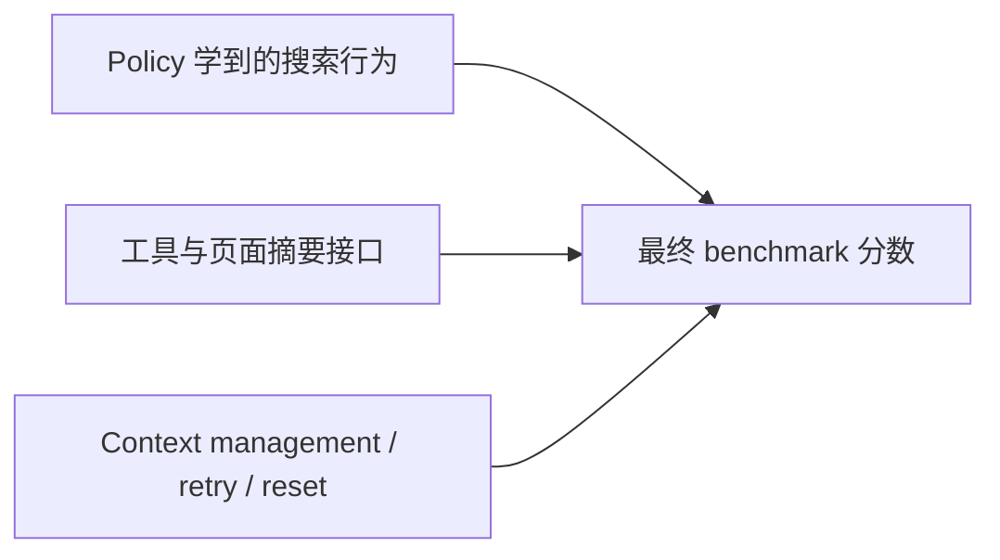

# Iris：搜索 Agent 的能力，不只在模型，也在训练闭环和上下文外壳里

### 元信息与 TL;DR

| 项目 | 内容 |
| --- | --- |
| 论文 | Iris: Climbing to the Search Frontier |
| 作者 | Ziyuan Liu, Hengqi Liu, Zichuan Wang, Yang Qin, Jiachen Liang, Xu Chu, Shaowei Chen, Yuantao Gu, Mu Chuan |
| 原始链接 | [arXiv](https://arxiv.org/abs/2609.04304)；[HTML](https://arxiv.org/html/2609.04304v1)；[TeX Source](https://arxiv.org/e-print/2609.04304)；[GitHub](https://github.com/AllSpark-Research/Iris)；[HF Daily Papers](https://huggingface.co/papers/2609.04304) |
| 日期证据 | arXiv v1 提交于 2026-09-03T17:51:01Z；Hugging Face Daily Papers 标记 `submittedOnDailyAt=2026-09-07T00:00:00Z` |
| 类型 | 大模型 Agent / 搜索 Agent / SFT-RL 后训练 |

### TL;DR

1. **Iris 研究的问题不是“能不能联网搜索”**，而是搜索 Agent 怎样被系统性训练：给定一个长程、多跳、不可直接字符串命中的问题，模型要决定搜什么、读什么、何时继续、何时收束证据。
2. **作者提出两级模型**：Iris-mini 从 Qwen3.6-35B-A3B 初始化，Iris-pro 从 Qwen3.5-397B-A17B 初始化；二者都是 MoE，公开 README 标注 256K context，目标是开放权重搜索 Agent。
3. **数据管线从网页图反推问题**：以 seed page 和 out-links 构建局部网页子图，再抽取实体关系图，沿多跳路径生成问题，并把非答案实体改写成描述性引用，避免直接搜到锚点。
4. **训练不是单次 SFT**：先由强 teacher 生成 ReAct 搜索轨迹，再做轨迹级过滤和 turn 级 loss mask；随后用 live search 做 RL，并把每轮 RL 中“难但已解、搜索步数较短”的成功轨迹回流到下一轮 SFT，这被称为 SFT-RL climbing。
5. **上下文管理是论文的关键对照变量**：作者分别报告 w/o CM、discard-all、retry、discard-all+retry，强调许多 benchmark 分数其实是 policy 加 inference harness 的合成结果。
6. **主结果很强但不能忽略外壳收益**：Iris-mini 在 discard-all 下 BrowseComp/BrowseComp-ZH/DeepSearchQA/HLE 为 82.2/84.8/86.9/52.3；Iris-pro 为 88.6/85.1/92.9/56.4。
7. **CM 带来的增益很大**：Iris-mini 的 BrowseComp 从 64.7 到 82.2，增加 17.5 分；discard-all+retry 到 85.9，增加 21.2 分。这说明长程搜索的瓶颈常常是上下文耗尽，而不只是推理能力。
8. **局限也清楚**：训练数据、完整 recipe 和权重按论文说法仍计划释放；评价依赖 LLM judge；benchmark 访问屏蔽只能降低泄漏风险；源码中部分图表模板仍残留旧命名，提示公开制品还需清理。

### 研究问题：搜索 Agent 为什么需要单独训练？

普通问答评测默认任务、上下文和预算都已经固定。搜索 Agent 面对的是另一个问题形态：

| 维度 | 普通闭卷问答 | 搜索 Agent |
| --- | --- | --- |
| 信息来源 | 参数记忆或给定上下文 | live web、检索页面、网页摘要 |
| 决策对象 | 主要是答案内容 | 查询、页面选择、证据整合、停止时机 |
| 失败形态 | 知识缺失、推理错误 | 搜错方向、读错页面、过早收束、上下文耗尽 |
| 训练难点 | 给出标准答案即可 | 必须监督长程轨迹和工具行为 |

作者的核心判断是：搜索不是一个简单工具开关，而是一种需要训练的原子能力。模型必须学会在不完整信息下持续缩小假设空间，这与数学题、代码题或一次性 RAG 的监督信号不同。

这也是 Iris 选题的实际价值。很多近期搜索 Agent 报告的是最终 benchmark 分数，但不同系统的 context management、retry、re-answer、verification、工具封装都不一样。作者认为如果不把 policy 本身和 inference-time harness 分开，研究者很难判断分数来自模型学到的搜索行为，还是来自外部恢复机制。

### 论文主张与论证路线

| Claim | Mechanism | Evidence | Boundary |
| --- | --- | --- | --- |
| 高质量搜索数据要难且可解 | 网页图反构、多跳路径、锚点抽象、双条件验证 | 数据管线用 closed-book failure 和 graph-supplied success 做交集过滤 | 难度相对参考模型定义，参考模型变化会改变数据边界 |
| SFT 数据要过滤轨迹而不是只看答案 | correctness gate、degeneracy detector、minimum tool turns、turn-level mask | 论文给出轨迹公式、zlib 压缩比检测和最多 10% assistant turns mask | turn judge 仍是 LLM 裁判，局部探索是否“冗余”有主观性 |
| RL 要面向 live search，但不能被长尾 rollout 拖垮 | request-level partial rollout、prefix reuse、truncated importance sampling | 训练章节解释过长会话中断并从 committed prefix 续跑 | 细节未完全开放，成本和稳定性还需要复现实验 |
| CM 必须作为显式变量报告 | w/o、retry、discard-all、discard-all+retry 同表对照 | Iris-mini BrowseComp +17.5，Iris-pro +16.0；多项 benchmark 都有明显提升 | CM 是外壳能力，不等于模型内在搜索能力 |
| 搜索能力可能迁移到 broader agent tasks | search data 和 search-specialized teachers 对 BFCL、tau-bench、OfficeQA、APEX 有正迁移 | 结论部分给出跨域正迁移观察 | 正迁移不是主表核心实验，缺少完整表格和可复现设置 |

这条论证线很紧：先定义搜索任务难在哪里，再说明怎么构造训练题，接着说明怎样把题变成轨迹监督，最后用 benchmark 和 CM 消融说明“训练得到的 policy”和“推理外壳”分别贡献了什么。

### 方法机制一：从网页图反向生成多跳问题

论文的数据管线可以理解为“先有答案，再构造必须搜索才能抵达答案的问题”。它不是从自然问题池里抽样，因为自然问题常常太容易、太短，或者可以直接用实体名搜索解决。

作者先把网页语料看成有向图：

```text
G = (V, E)
Out(v) = {u in V | (v, u) in E}
```

其中：

| 符号 | 含义 |
| --- | --- |
| `V` | 网页节点集合 |
| `E` | 超链接边集合 |
| `v0` | seed page，通常锚定目标答案实体 |
| `Out(v0)` | seed page 指向的外链页面 |
| `G_sub` | 由 seed page 和采样外链构成的局部子图 |

这个设计的重要性在于：问题不是凭空编出来的，而是由网页之间真实存在的链接结构约束。多跳路径来自实体和页面关系，答案也被 seed theme 固定，这降低了“LLM 自造冷门问题但答案不唯一”的风险。

接着，管线把局部网页子图压缩成实体关系图：

```text
G_e = (V_e, R_e) = f_ext(G_sub)
```

这里 `V_e` 是关键实体，`R_e` 是关系。作者强调抽取器只保留通向 seed theme 的多跳关系骨架。换句话说，数据生成不是把整页网页摘要丢给模型，而是先把“可以形成可验证推理链”的实体关系保留下来。

最关键的一步是 anchor abstraction。假设某条路径是：

```text
e1 --r1--> e2 --r2--> ... --> y
```

答案是 `y`，问题中不能直接出现 `y`，同时非答案实体 `e` 也不能保留名字或别名。抽象算子可以写成：

```text
A(e): name(e), alias(e) not in A(e)
      and A(e) uniquely identifies e
```

这一步解决的是搜索题的常见捷径：如果题面直接给出实体名，Agent 可以把名字复制进搜索框，绕过多跳推理。Iris 把非答案实体改写为描述性引用，使模型必须先消解描述、再沿关系继续查证。

### 方法机制二：双条件验证把“难”和“可解”同时卡住

作者保留问题时使用两个条件：

```text
c_diff(q) = 1[M_ref(q) != y]
c_solv(q) = 1[M_ref(q | G_e) = y]
D = {(q, y) | c_diff(q) * c_solv(q) = 1}
```

变量解释：

| 变量 | 作用 |
| --- | --- |
| `M_ref(q)` | 参考模型闭卷回答 |
| `M_ref(q | G_e)` | 参考模型拿到实体图后回答 |
| `c_diff` | 闭卷答不出，说明不能只靠参数记忆 |
| `c_solv` | 给足图证据能答出，说明问题本身可解 |
| `D` | 同时困难且可解的数据集 |

这个过滤有两个好处：

1. **丢掉太容易的题**：如果参考模型闭卷就会，训练搜索轨迹的价值很低。
2. **丢掉坏题**：如果给了实体图仍无法答对，说明答案可能不唯一、链路错误或问题表述失败。

边界也在这里：难度是相对于 `M_ref` 定义的。换一个更强或更弱的参考模型，哪些题算“闭卷不会”会变化。因此 Iris 的数据难度不是绝对概念，而是训练目标模型附近的相对难度。

### 方法机制三：SFT 不是只蒸馏最终答案，而是蒸馏可训练轨迹

Iris 的 SFT 起点是 teacher 搜索轨迹。轨迹包含：

```text
tau = (r1, a1, o1, ..., rT, aT, oT, rT+1, y_hat)
```

| 元素 | 含义 |
| --- | --- |
| `r_t` | 当前 reasoning |
| `a_t` | 工具调用，论文中是 search 和 scrape |
| `o_t` | 工具返回观察，由页面摘要器产生 |
| `y_hat` | 最终答案 |
| `T_tool` | 工具调用轮数 |

粗过滤首先要求答案正确。正确性不是字符串硬匹配，而是用 LLM judge 对 `y_hat` 和 reference answer 做语义判断。之后再排除退化轨迹，包括重复循环、失控工具调用、未结束思考块等。

论文给出的一个有意思检测器是滑动窗口压缩比：

```text
rho_cr(w) = |w| / |zlib(w)|
c_degen(tau) = 1[max_w rho_cr(w) >= tau_cr]
```

直觉很简单：重复文本压缩后会非常短，所以压缩比会异常高。这个检测比手写“连续重复 n 次”更稳，因为它不依赖具体周期，也不关心重复从哪里开始。

粗过滤之后还有 turn-level fine filtering。作者不是把整条正确轨迹全当黄金数据，而是让 judge 给每个 assistant turn 标记 keep 或 mask。被 mask 的 turn 仍保留在上下文里，但不参与 loss；同时每条轨迹最多 mask 10% assistant turns，避免过度清洗把必要探索删掉。

SFT objective 可以写成：

```text
L_SFT(theta) = - E_(q,tau) sum_t m_t log pi_theta(u_t | C_<t)
```

这里 `m_t` 是 turn-level mask，`u_t` 是 assistant 输出。这个目标的重要点是：模型不是学习“最终答案像什么”，而是学习在可回放上下文中，什么时候思考、什么时候搜、怎么读观察、怎么进入下一跳。

### 方法机制四：RL 用 live search，但通过 partial rollout 控制长尾

SFT 后，Iris 用 live search 做 RL。论文没有把完整 RL objective 全部作为主文最终公式展开，但核心工程机制说得很清楚：

1. **rollout 是长尾分布**：少数问题会跑很久，拖慢同步训练 step。
2. **不中途丢弃所有未完成轨迹**：过长会话在 request level 被中断。
3. **保留 committed prefix**：下一步从已经完成的前缀继续，而不是重头开始。
4. **用 truncated importance sampling 修正旧权重前缀**：因为一条轨迹可能由不同 policy 版本产生。

这套机制的意义不只是省钱。搜索 Agent 的训练失败常来自系统层：如果每个 RL step 都被最慢会话拖住，吞吐会崩；如果直接丢弃长会话，又会系统性忽略真正困难的问题。partial rollout 在二者之间找折中：允许同步训练继续推进，同时复用已经投入的搜索前缀。

奖励侧也值得注意。Iris 在训练集群内部署 Qwen3.5-397B-A17B FP8 engine，同时承担两个角色：

| 角色 | 功能 |
| --- | --- |
| GenRM | 对最终答案和 reference 做二元正确性判定 |
| Summarizer | 把 retrieved page 压缩成 query-relevant digest |

奖励公式可以概括为：

```text
R(q, tau) = 1[GenRM(q, y_hat_tau, y*) = A]
```

作者没有额外加格式奖励。空答案、截断答案或 mid-thought answer 会被抽取为空，自然得到 0 分。这个选择降低了 reward hacking 空间：模型不需要学会堆格式，只需要给出可判定的正确答案。

### 方法机制五：SFT-RL climbing 是自步课程，而不是一次性蒸馏

论文把 SFT 与 RL 交替进行，称为 climbing。每轮 RL 之后，作者从当前 policy 的 rollout 中回收一小批高质量轨迹，再做下一轮 SFT。

选择条件是：

```text
0 < pass_rate(q) <= 1/2
R(q, tau_i) = 1
T_tool(tau_i) >= K_rft
tau*_q = argmin_tau T_tool(tau)
```

这组条件表达了一个很明确的训练哲学：

1. **只选还不稳定的问题**：`pass_rate` 大于 0 但不超过 1/2，说明模型已经能偶尔解出，但还没有可靠掌握。
2. **只选成功轨迹**：失败轨迹不回流到 SFT。
3. **要求足够搜索深度**：过滤掉幸运直达或太浅的样本。
4. **选最短成功轨迹**：鼓励高效搜索，而不是把冗长探索当成优点。

随着 policy 变强，这个难度带会自动移动。早期能纳入的是较容易但不稳定的问题，后期留下的是更难的边界样本。因此 climbing 更像一种 self-paced curriculum：训练目标随模型能力上移，而不是固定数据集反复蒸馏。

### 实验设置：四个 benchmark 和两个上下文制度

作者评估四个搜索相关 benchmark：

| Benchmark | 评测重点 | 指标 |
| --- | --- | --- |
| BrowseComp | 长尾实体识别，多条间接线索约束 | Accuracy |
| BrowseComp-ZH | 中文来源上的同类搜索问题 | Accuracy |
| DeepSearchQA | 搜索答案的全面性和证据覆盖 | F1 |
| HLE text-only | 专家级跨学科推理，搜索作为补充 | Accuracy |

实现细节：

1. Iris-mini 和 Iris-pro 分别从 Qwen3.6-35B-A3B、Qwen3.5-397B-A17B 初始化。
2. SFT 训练两个 epoch，global batch size 为 64，maximum sequence length 为 262,144 tokens。
3. RL 使用开源 Relax 框架。
4. 为降低 benchmark 泄漏，系统屏蔽 Hugging Face datasets 和 spaces 中承载题目/答案的页面，屏蔽点包括搜索结果、scrape 拒绝和 tool manager 事后 guard。
5. 每道题 pass@1 单次 rollout，最终答案用各 benchmark 官方 prompt 的 LLM judge 评分。

这些设置显示作者非常关注 evaluation harness。特别是 benchmark 泄漏屏蔽：它不能证明完全无污染，因为模型参数记忆和外部镜像仍可能存在，但至少把最直接的数据集页面访问封住了。

### 主结果：Iris 在开放搜索 Agent 里很强

主表中的 headline setting 是 discard-all context management。

| 模型 | BrowseComp | BrowseComp-ZH | DeepSearchQA | HLE |
| --- | ---: | ---: | ---: | ---: |
| Iris-mini | 82.2 | 84.8 | 86.9 | 52.3 |
| Iris-pro | 88.6 | 85.1 | 92.9 | 56.4 |

在 30-35B 区间：

1. Iris-mini 在 BrowseComp 达到 82.2，比 XYZ-Aquila-mini 的 78.8 高 3.4 分。
2. BrowseComp-ZH 为 84.8，是同区间最高。
3. HLE 为 52.3，也是同区间最高。
4. DeepSearchQA 为 86.9，低于 XYZ-Aquila-mini 的 89.5。

在约 400B 区间：

1. Iris-pro BrowseComp 为 88.6，高于 XYZ-Aquila-pro 的 84.8。
2. DeepSearchQA 为 92.9，高于 XYZ-Aquila-pro 的 92.5。
3. HLE 为 56.4，高于 XYZ-Aquila-pro 的 53.3。
4. BrowseComp-ZH 为 85.1，与 XYZ-Aquila-pro 持平。

论文的谨慎点在于：作者没有声称 Iris 已经超过所有 frontier/heavy-compute 系统。主表里 GPT-5.6 Sol、Kimi-K3、Claude Fable 5、Apodex-1.0-H 仍在某些列更强。Iris 的定位更准确地说是：在相近参数规模的开放搜索 Agent 中，训练 recipe 带来了明显竞争力。

### Context Management：外壳收益不能被藏在最终分数里

这篇论文最值得保留的研究信号，是它把 context management 单独拆出来。

| 模型与设置 | BrowseComp | BrowseComp-ZH | DeepSearchQA | HLE |
| --- | ---: | ---: | ---: | ---: |
| Iris-mini w/o CM | 64.7 | 72.3 | 81.0 | 43.2 |
| Iris-mini discard-all | 82.2 | 84.8 | 86.9 | 52.3 |
| Iris-mini discard-all + retry | 85.9 | 85.1 | 89.9 | 52.4 |
| Iris-pro w/o CM | 72.6 | 76.8 | 86.4 | 50.8 |
| Iris-pro discard-all | 88.6 | 85.1 | 92.9 | 56.4 |
| Iris-pro discard-all + retry | 90.3 | 85.1 | 93.4 | 56.6 |

增益可以直接算：

| 模型 | Benchmark | discard-all 增益 |
| --- | --- | ---: |
| Iris-mini | BrowseComp | +17.5 |
| Iris-mini | BrowseComp-ZH | +12.5 |
| Iris-mini | DeepSearchQA | +5.9 |
| Iris-mini | HLE | +9.1 |
| Iris-pro | BrowseComp | +16.0 |
| Iris-pro | BrowseComp-ZH | +8.3 |
| Iris-pro | DeepSearchQA | +6.5 |
| Iris-pro | HLE | +5.6 |

作者的解释是：CM 的价值与“任务是否经常跑爆上下文”相关。BrowseComp 风格任务需要长时间检索、过滤、整合多条线索，所以上下文会成为约束；HLE 更依赖专家知识和推理，搜索只是补充，所以 CM 增益相对小。

这里的研究意义很大。一个搜索 Agent benchmark 分数至少由三部分组成：



如果论文只报启用 CM 的最高分，研究者就无法判断模型是否真的学会了更好的搜索策略。Iris 的 w/o CM 表虽然分数更低，但反而更有诊断价值。

### Figure/Table 证据逐项解读

| 图表 | 支撑的结论 | 不能证明的内容 |
| --- | --- | --- |
| Figure 1 / benchmark overview | Iris-mini/pro 在四个搜索 benchmark 上整体处于开放模型前列 | 图本身不能分离 policy 与 harness，必须结合 CM 表 |
| Table 1 / main results | 两个规模段内 Iris 的 headline 表现强，尤其 BrowseComp 和 HLE | baseline 的 harness 不完全一致，跨系统比较仍有残差 |
| Table 2 / CM ablation | discard-all 和 retry 对长程搜索有大幅收益 | CM 增益不等于模型内部能力提升 |
| Appendix case / BrowseComp-ZH ground-truth inconsistency | 作者指出 benchmark annotation 可能存在错误，示例中官方答案与可查事件不一致 | 单例不能推出整个 benchmark 大规模失真，只能提示上限受标注质量约束 |

源码还包含几张图表 TeX 和 PDF。值得注意的是 `benchmark-comparison.tex`、`training-dynamics.tex` 内有部分旧项目名模板残留，这对核心数值不构成直接反证，但说明公开制品尚未完全清理。对于后续复现者，这类痕迹意味着需要以正文、README 和最终表格为准，并等待完整训练数据与 pipeline 发布。

### 与相关工作的关系：Iris 把搜索训练、后训练和 Agent harness 放在同一张图里

Iris 站在几个研究线交叉处：

1. **ReAct / Toolformer / WebGPT 线**：强调模型交替生成思考、工具调用和观察。
2. **WebDancer / WebSailor / WebShaper 等数据线**：通过网页结构或知识图构造更难搜索题。
3. **Search-RL / live web RL 线**：把最终答案正确性变成强化学习奖励。
4. **DeepSeek-V3.2、MiroThinker 等 CM 线**：通过重置、总结或 retry 扩展有效搜索预算。

Iris 的区别不在某个单点技巧，而在把这些环节连成一个训练闭环：

```text
web graph -> abstracted multi-hop tasks -> teacher trajectories
          -> SFT filtering -> live-search RL
          -> successful hard rollouts -> next SFT climb
          -> evaluation with and without CM
```

这也是它对 Agent 研究的启发：Agent 后训练不能只讨论“RL 算法是否更强”，还要同时讨论数据构造、轨迹过滤、工具环境、摘要器、judge、上下文管理和 benchmark 泄漏控制。这些模块共同决定最终行为。

### 证据边界与可复现性

这篇论文强在系统完整，但边界也要写清：

1. **完整 recipe 尚未完全释放**：论文和 README 都表示模型权重、训练数据和关键 pipeline 组件计划释放或 coming soon。当前能复现的主要是 evaluation harness 方向，而不是完整训练。
2. **LLM judge 是核心依赖**：数据验证、轨迹 correctness、turn mask、最终 benchmark grading 都不同程度依赖 judge。judge 一致性、偏差和泄漏防护会影响结果解释。
3. **CM 是强外部机制**：headline 数字使用 discard-all。研究者若比较“模型自身搜索能力”，应优先看 w/o CM 行。
4. **benchmark 屏蔽不是污染免疫证明**：屏蔽 HF datasets/spaces 是必要控制，但不能证明模型没有从训练语料或网页镜像中见过题目。
5. **多跳问题的真实难度相对参考模型**：`c_diff` 和 `c_solv` 依赖 `M_ref`，因此数据难度会随参考模型变化。
6. **跨域迁移观察还不充分**：结论提到 BFCL、tau-bench、OfficeQA、APEX 正迁移，但主文没有像四个搜索 benchmark 那样给出完整对照表。
7. **制品清洁度需继续观察**：源码图表模板里的旧命名不影响 arXiv abs、正文和 README 的 Iris 主线，但会让复现者需要更仔细核对文件版本。

### 研究者视角：这篇文章真正改变了什么？

Iris 最重要的贡献不是“又有一个搜索 Agent 刷分”，而是把搜索 Agent 的能力拆成可研究的层次。

第一层是 **数据难度**。问题必须让模型闭卷答不出，但给足证据又能答出。这个定义比“人工觉得难”更可操作，也比随机网页问答更适合训练。

第二层是 **轨迹质量**。Agent 的训练样本不是输入输出对，而是一段带工具调用的程序执行史。正确答案中也可能夹杂坏 turn，因此 turn-level mask 比整条保留更细。

第三层是 **RL 工程**。live search RL 的问题不只是 reward，而是 rollout 长尾、外部 API、页面摘要、prefix reuse 和同步训练吞吐。Iris 把这些工程约束写进方法章节，说明搜索 Agent 后训练已经进入系统工程阶段。

第四层是 **评测外壳**。CM、retry 和 re-answer 可能比两个模型之间的差距还大。未来报告 Agent benchmark 时，至少应该同时报 policy-only 或 weak-harness 分数，以及完整 harness 分数。

对 AI 安全和 Agent 评测而言，Iris 还提出一个更广的问题：如果搜索是可迁移的原子能力，那么它也可能放大越权检索、证据选择偏差、上下文擦除后的状态混乱和 benchmark hacking。后续研究不能只问“搜索更强了吗”，还要问：

1. Agent 在长程搜索中如何记录不确定性，而不是把临时证据当结论？
2. CM 重置历史时，哪些安全约束、用户限制和已排除证据会被遗忘？
3. 搜索训练是否会提高模型绕过访问限制、寻找替代镜像或利用页面侧信号的能力？
4. 多跳问题生成是否能加入 provenance、权限、时效性和冲突证据，而不只追求难题？
5. RL judge 是否会奖励“看起来证据充分”的答案，而不是事实一致的答案？

### 进一步追问：把搜索当作 Agent 基础能力后，评测要如何变？

如果接受作者的判断，搜索不是垂直应用，而是 Agent 的基础能力，那么评测设计也要随之改变。一个真实 Agent 往往不是“搜索一次，然后回答”，而是在任务执行期间持续把外部信息写入自己的行动状态。搜索结果会影响文件编辑、工具调用、权限判断、用户沟通和后续自我修正。

这会带来三类新的实验问题：

| 问题 | 为什么 Iris 提供了切入口 | 还缺什么证据 |
| --- | --- | --- |
| 搜索轨迹是否可审计 | Iris 已经把轨迹作为训练对象，并区分 trajectory-level 与 turn-level 质量 | 还需要公开每一步 evidence provenance、judge prompt 和错误分类 |
| 上下文重置是否破坏安全状态 | CM 表证明 reset 能显著提分，也说明外壳在行为中占比很大 | 还需要测试 reset 后是否遗忘用户限制、拒答理由和已排除来源 |
| 搜索能力是否迁移到工具执行 | 结论提到 BFCL、tau-bench、OfficeQA、APEX 的正迁移 | 还需要统一 harness 下的跨任务消融，区分搜索数据、teacher 和 RL 的贡献 |

从安全角度看，Iris 的数据生成方式也可以扩展成更难的安全评测。当前 anchor abstraction 主要防止字符串捷径，未来可以加入更复杂的约束：

1. **权限约束**：某些页面可读但不可用于最终答案，测试 Agent 是否能区分可访问和可引用。
2. **时效约束**：网页之间存在版本冲突，要求 Agent 保留最新证据和旧证据的差异。
3. **来源约束**：同一实体在官方页面、论坛、镜像站和模型摘要中给出不同信息，要求 Agent 标注可信度。
4. **状态约束**：CM 或 retry 之后，Agent 必须记住哪些来源已经被判定为错误，而不能在下一轮重新采信。
5. **执行约束**：搜索结论会触发工具动作，评测不只看答案是否正确，还看动作是否越权、是否可回滚。

这类扩展会把搜索 Agent 从“找答案”推进到“在证据不完备的环境里安全行动”。Iris 已经给出训练闭环的骨架，但安全研究还需要在同一骨架上加入 provenance、policy memory、permission state 和 adversarial evidence。

### 结论：强搜索 Agent 需要同时报告模型和系统

这篇文章的结论可以压缩成一句：搜索 Agent 的能力不是一个模型参数表，而是一条从数据、轨迹、RL、上下文管理到评测协议的链。Iris 把这条链展示得足够完整，也把下一步需要审计的薄弱环节暴露出来。

对后续工作，最值得继承的是它的报告方式：

1. 把数据构造写成可检查的生成和过滤流程。
2. 把 SFT 轨迹的保留、丢弃和 loss mask 写清。
3. 把 RL rollout 的系统折中写进方法，而不是藏在实现里。
4. 把 w/o CM 和 with CM 同时报告，避免把 harness 增益误认为 policy 增益。
5. 把 benchmark 标注问题和公开制品残留作为边界，而不是只保留最漂亮的主表。

因此，Iris 对 Daily Report 读者的价值在于：它提供了一个判断未来搜索 Agent 论文的模板。以后看到更高的 BrowseComp 或 DeepSearchQA 分数，第一反应不应只是比较模型大小，而要追问数据是否可解、轨迹如何过滤、RL 是否 live、judge 是否稳定、上下文管理如何介入，以及这些机制在安全场景中会引入哪些新的失败模式。
