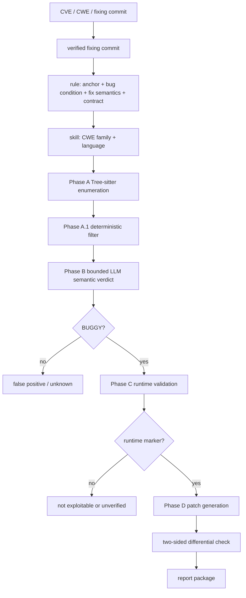

# The History Is the Detector：把 CVE 修复历史变成可执行漏洞检测器

## 元信息与 TL;DR

| 字段 | 内容 |
| --- | --- |
| 标题 | The History Is the Detector: Executing CVE Patch History, End-to-End |
| 方向 | AI 安全 / AI for Security / LLM Agent 漏洞分析 |
| 作者 | Qiushi Wu, Kevin Eykholt, Youngja Park, Xiaokui Shu, Dhilung Kirat, Douglas Lee Schales, Ian Molloy |
| 主链接 | https://arxiv.org/abs/2609.05335 |
| HTML 全文 | https://arxiv.org/html/2609.05335v1 |
| 日期证据 | arXiv API 显示 v1 published/updated 为 2026-09-04T16:40:22Z；arXiv cs.CR recent 官方列表在 Mon, 7 Sep 2026 分组列出该条。本轮采用 recent 列表作为当前周官方曝光证据，并保留原始提交时间。 |
| 本轮选题说明 | Scout 首选 CONTINUITY 已在最新 data 分支发布为 `itm_e0058b623cd392b3`，本篇是在同一 Scout 表内 pivot 的 AI-safety 备选。 |

### TL;DR

1. 论文的问题不是“LLM 能不能扫出漏洞”，而是：公开 CVE、CWE、修复 commit 已经记录了大量失败经验，为什么这些经验还不能自动变成下一次扫描的检测器。
2. 作者提出 **Bugstone-E2E**：先从 2022-2026 年 19,325 个高危 CVE 中恢复开源项目和修复 commit，再从修复前后代码抽取 scan anchor、漏洞条件、修复语义和验证契约。
3. 它把 2,710 个 verified fixing commits 压缩成 1,033 条 production rules，覆盖 56 个 CWE family，并打包为 172 个可部署的 bug detection skills。
4. 检测阶段是漏斗：Phase A 用 Tree-sitter 无构建枚举 call site；Phase A.1 用确定性过滤去掉明显良性候选；Phase B 让 LLM agent 对小批候选做语义判断；Phase C 构造运行时证据；Phase D 生成补丁并做双向差分验证。
5. 实验上，15 个目标中的确定性过滤把约 745K Phase A 候选降到 293K，减少 60.6%；14 个真实项目扫描中，Phase B 去重后有 2,933 个 findings，其中 644 个拿到运行时证据。
6. wolfSSL 回滚实验中，Bugstone-E2E + gpt-5-mini 命中 33/64 个后续披露 CVE；两种模型配置并集命中 35/64；Codex harness 命中 22/64；Anthropic harness 命中 15/64；VVAH 命中 3/64。
7. Pillow 重跑实验提醒我们不要把单次 LLM 判断当成稳定事实：十次相同 Phase B 输入的最终 finding 数在 125-147 之间，union 有 243 个位置，但十次都出现的只有 56 个。
8. 局限同样清楚：它主要覆盖“能在安全相关 API 附近锚定”的复现型漏洞模式，不覆盖一次性设计缺陷、配置错误、全局协议状态不变量；Phase D 的补丁验证也只是 PoC 级双向差分，不等价于维护者接受的完整修复。

## 研究问题：历史修复为什么还没有变成检测器

### 作者真正要拆的瓶颈

现有漏洞生态已经有三类结构化材料：

| 材料 | 人类如何使用 | 自动化难点 |
| --- | --- | --- |
| CVE 描述 | 了解受影响组件、攻击后果、严重性 | 描述常常短、含糊、缺仓库或缺 commit |
| CWE 标签 | 粗粒度定位 weakness family | 同一 CVE 可能有多个标签，标签不一定对应可扫描 API |
| 修复 commit | 看到 unsafe code 如何被改掉 | patch 可能混入重构，新增 guard 不等于漏洞 sink |

论文的切入点是：这些材料足够让人复盘“为什么坏”，却很少直接变成“下次在哪里找同类问题”。传统工具如 CodeQL、Semgrep 能高效执行规则，但规则编写仍依赖专家。纯 agent 扫描能做语义判断，却容易把预算花在无边界的仓库探索上，也不能把一次扫描学到的经验稳定复用到下一次。

### 论文的核心主张

作者把主张拆成一条证据链：

```text
CVE 修复历史
  -> verified fixing commits
  -> 可泛化的漏洞条件与 scan anchors
  -> CWE-family + language 级 detection skills
  -> 低成本候选枚举
  -> 小任务 LLM 语义验证
  -> 运行时证据
  -> PoC 约束的补丁差分验证
```

这条链的关键不是“模型更强”，而是“每一层只做自己适合的事”：

1. 历史 CVE 提供来源和弱点类别。
2. patch 前后代码提供漏洞 sink、修复语义和反例。
3. Tree-sitter 提供可规模化候选枚举。
4. LLM agent 只处理被规则锚定的小范围判断。
5. 运行时验证把模型 verdict 降级为候选，把 sanitizer、crash 或 controlled-sink signal 升级为证据。
6. 补丁验证要求原程序可复现、打补丁后不可复现、撤回补丁后再次复现，避免把环境坏掉误判为修好。

## 方法机制：CVE-to-skill 管线

### Table 2 的漏斗数字

| 阶段 | 产物 | 数量 | 说明 |
| --- | --- | ---: | --- |
| CVE survey | High-severity CVEs | 19,325 | 2022-2026 年高危 CVE 起点 |
| OSS enrichment | Open-source CVEs | 5,902 | 能关联到开源项目的记录 |
| Fix recovery | Verified fixing commits | 2,710 | 直接 commit URL 与仓库历史搜索共同恢复 |
| Case validation | Validated CVE cases | 2,662 | 修复证据可用于规则化的案例 |
| Rule synthesis | Pre-consolidation rules / CWEs | 1,757 / 266 | 合并前的细粒度规则 |
| Family consolidation | Production rules / CWE families | 1,033 / 56 | 合并冗余 CWE 与重叠规则 |
| Skill synthesis | Deployable bug detection skills | 172 | 按 CWE family 与语言打包 |

这个表的意义在于，它把“自动从 CVE 学检测器”的损耗展示出来：

1. 19,325 到 5,902：很多 CVE 不是可定位的开源项目问题。
2. 5,902 到 2,710：即使能定位仓库，也未必能可靠找出真正修复 commit。
3. 2,710 到 2,662：不是每个修复都能转成可泛化规则。
4. 1,757 到 1,033：一 CVE 一规则会造成重复扫描，需要合并到更稳定的 family 层。

### 规则不是复制 patch

作者特别强调：修复 commit 不是检测规则。原因有三类：

| patch 现象 | 直接复制的风险 | Bugstone-E2E 的处理 |
| --- | --- | --- |
| commit 同时做安全修复和重构 | 把项目风格变化误当漏洞条件 | 联合分析 CVE 描述、修复前后函数和上下文 |
| fix 新增 sanitizer 或 guard | 检测器会去找“已修好的代码” | scan anchor 必须指向修复前就存在的 unsafe operation |
| 单个项目有特殊封装 | 规则过拟合某个仓库 | 只推广可跨项目解释的漏洞条件 |

因此一条 skill 里要保留四种信息：

1. **scan_apis**：低成本枚举候选的位置，例如 shell API、反序列化入口、路径拼接、buffer write。
2. **buggy pattern**：什么数据流、guard 缺失或参数关系构成不安全。
3. **fixed pattern**：原修复如何消除该条件，用作验证方向而不是搜索目标。
4. **verification contract**：Phase B agent 判断时必须检查哪些 caller、taint、sanitizer、边界和证据字段。

### 一个跨语言动机例子

论文的 Table 1 展示了高复现模式：

| CWE | 语言 | 支持 CVE 数 | 代表 API |
| --- | --- | ---: | --- |
| CWE-79 | PHP | 27 | `echo` |
| CWE-502 | PHP | 16 | `unserialize` |
| CWE-78 | Python | 13 | `os.system` |
| CWE-79 | JavaScript | 9 | `innerHTML` |
| CWE-22 | Java | 5 | `getNextEntry` |
| CWE-122 | C/C++ | 4 + 4 | `memcpy` |
| CWE-78 | Ruby | 2 | `system` |

这个表支持一个研究判断：复现型漏洞不只是在同一代码库里复制粘贴。相同 weakness 可以跨语言出现，但 API 形式不同。CWE-78 在 Python 和 Ruby 都表现为外部输入进入 shell 执行；CWE-79 在 PHP、JavaScript、TypeScript 中都围绕未转义输出或 DOM sink 展开。规则库如果停在“文本相似”，会漏掉这类跨语言结构；如果完全依赖 LLM 自由探索，则难以规模化。

## 检测流程：从 745K 候选到运行时证据

### Phase A：确定性枚举

Phase A 的作用是把大仓库变成可处理的候选集合：

1. 用 Tree-sitter 解析源码，构建 call-site index。
2. 对每条 rule 的 scan anchors 做匹配。
3. 不调用 LLM，不要求目标项目可构建。
4. 输出候选位置、匹配规则、文件和局部结构。

这一步的边界也很明确：它只问“这里像不像值得看”，不问“这里是不是漏洞”。例如 `memcpy`、`os.system`、`unserialize` 这样的 anchor 命中很多，必须经过后续过滤。

### Phase A.1：保守过滤

Phase A.1 是成本控制层：

| 机制 | 作用 | 安全边界 |
| --- | --- | --- |
| 确定性 filter | 去掉常量参数、已验证包装、生成代码等明显良性模式 | 只删除确定良性候选，不改 rule 的漏洞条件 |
| Phase B feedback | 从早期语义判断中总结重复 false positive | BUGGY 和 UNKNOWN 样本必须被保护 |
| target-level dedupe | 同一 CWE family 的重叠规则命中同一位置时去重 | 只去重复任务，不合并根因判断 |

实验里，15 个目标的 Phase A 候选约 745K，过滤后约 293K，减少 60.6%。在 10 个高量 skills 的 filter synthesis 里，979 个样本中 814 个被 Phase B 标为 false positive；第一轮生成的保守 filter 覆盖 7 个 skills，去掉 261 个观察到的 false positive，占 32.1%。更重要的是，样本里 165 个 BUGGY 或 UNKNOWN 候选全部保留下来。

### Phase B：小批量 LLM agent 语义判断

Phase B 的设计是“窄任务”，不是“仓库级自由探索”：

1. 候选只按同一 rule、同一 source file 小批分组。
2. agent 收到具体 skill、候选位置和局部上下文。
3. 判断项包括 taint flow、caller、guard、sanitizer、参数约束和项目约定。
4. 输出必须是结构化 verdict：`BUGGY`、`FALSE_POSITIVE`、`UNKNOWN` 等，并附代码证据。

这个拆分降低了模型要求。论文默认 Phase B 使用 `gpt-5-mini`，受控实验还比较 GPT-5.5、GPT-5.6-sol、Claude Sonnet 4.6、Kimi-K2.5 等。作者的隐含判断是：安全 agent 不一定要先做端到端探索；更可控的路线是让确定性系统决定“看哪里”，让模型决定“这个具体位置是否满足规则语义”。

### Phase C：运行时验证

Phase B 的 `BUGGY` 仍然只是静态证据。Phase C 要把幸存候选移动到隔离执行环境中：

1. 重新 triage，避免把明显不完整的静态报告带入运行时阶段。
2. 构造 PoC、输入、fixture 或可触发路径。
3. 寻找运行时 marker，例如 sanitizer report、crash、controlled-sink signal。
4. 区分四种结果：有 runtime evidence、live PoC、confirmed exploitable、unverified/not exploitable。

这里最重要的边界是：没有运行时证据不等于良性。依赖缺失、构建复杂、平台不一致都可能让 Phase C 无法触发一个真实问题。论文把“not exploitable”和“could not be tested”分开，是比单一 false positive rate 更严谨的报告方式。

### Phase D：双向差分补丁验证

Phase D 的 oracle 可以写成：

```text
给定 finding f、PoC p、候选补丁 patch：

1. 在原始程序 P 上运行 p
   - 期望：观察到漏洞 marker
2. 应用 patch 得到 P'
   - 期望：同一 p 不再观察到漏洞 marker
3. 撤回 patch 回到 P
   - 期望：p 再次观察到漏洞 marker
4. 只有三步都成立，才把 patch 记为通过差分验证
```

这个设计避免了两个常见误判：

1. patched build 根本没跑起来，却被误判为“攻击失败”。
2. PoC 本身不稳定，偶然没触发，被误判为“补丁有效”。

但它仍不是完整补丁正确性证明：只说明当前 PoC 被阻断，不说明根因完全修复，也不说明回归测试、兼容性、维护者接受度都通过。

## 实验结果：证据强度分层看

### CVE 知识构建

| 观察 | 数字 | 含义 |
| --- | ---: | --- |
| 高危 CVE 起点 | 19,325 | 覆盖 2022-2026 年 |
| 能关联开源项目 | 5,902 | 需要结构化字段、描述、引用页和仓库信息共同解析 |
| 直接 commit URL 中验证成功 | 1,944 | 来自 2,439 条含直接 commit 指针的记录 |
| 仓库历史搜索额外恢复 | 766 | 占最终 verified fixes 的 28.3% |
| 未能验证修复 commit | 3,192 | 搜索窗口无可靠 commit 或候选太多 |
| validated CVE cases | 2,662 | 能支持规则合成 |

这说明 agent-assisted recovery 有价值，但不能替代明确 provenance。766 个额外修复 commit 来自历史搜索，扩大了证据基座；同时 3,192 个 resolved records 仍然失败，说明 CVE 数据质量和仓库历史不完整是结构性瓶颈。

### wolfSSL 回滚对比

作者选择 wolfSSL 5.8.4 的回滚 commit `0c4ca257a07a`，因为该项目有后续 vendor release notes 和独立 harness 结果。ground truth 从 5.9.0、5.9.1、5.9.2 的 release notes 中恢复：68 个 CVE 标识里，有 64 个能通过修复 pre-image 定位到回滚树。

| 系统 | 命中 64 个可定位 CVE | 召回率 | 报告量说明 |
| --- | ---: | ---: | --- |
| Bugstone-E2E + gpt-5-mini | 33 | 52% | Phase B `BUGGY` 输出 |
| Bugstone-E2E 两模型并集 | 35 | 55% | 两配置互补 |
| Codex security-scan harness | 22 | 34% | baseline |
| Anthropic defending-code harness | 15 | 23% | baseline |
| VVAH | 3 | 5% | baseline |
| 至少一个系统发现 | 43 | 67% | 说明没有单一 harness 覆盖全部 |

这个实验最值得注意的不是排名，而是未覆盖集合：

1. 64 个案例中 43 个被至少一个系统发现，Bugstone-E2E 两配置并集是 35 个，因此 baseline 贡献了 8 个 Bugstone-E2E 未命中的案例。
2. 21 个案例没有任何系统发现，其中部分位于手写汇编或未被解析的 header。
3. Mythos 集合里一个无人命中的 CVE-2026-5446 涉及 ARIA-GCM explicit-IV/nonce reuse；这是跨多次 record encryption 的状态性密码学不变量，不是单个危险 API 附近的 misuse。这个 miss 正好说明 Bugstone-E2E 的 API-anchor 范围边界。

### Pillow 重跑：LLM verdict 的稳定性

Pillow 实验把目标固定在 commit `d56032047d11`，用同一 runner、同一 gpt-5-mini、同一 174-skill snapshot 跑十次。确定性阶段完全一致：

| 阶段 | 数字 |
| --- | ---: |
| 原始 matches | 30,594 |
| Phase A.1 去除 | 21,584 |
| 剩余候选 | 9,010 |
| 去重后送入 Phase B | 8,115 |
| Phase B batches | 1,345 |

十次 Phase B 的结果并不一致：

| 指标 | 结果 |
| --- | ---: |
| 单次最终 findings 范围 | 125-147 |
| 十次 union | 243 个位置 |
| 十次都出现 | 56 个位置 |
| 只出现一次 | 55 个位置 |
| 所有候选中 verdict 完全一致 | 93.1% |
| BUGGY / FALSE_POSITIVE 翻转候选 | 509，占 6.3% |
| missing occurrences 中 BUGGY -> FALSE_POSITIVE | 1,061 / 1,087，97.6% |
| contested candidates 所在 batch | 153 个 |
| batch 内相关性 | phi = 0.71 |
| batch 间相关性 | phi = -0.001 |

这组数字支持两个判断：

1. 总数相对稳定，不代表具体 finding 稳定。安全报告不能只看“这次扫到 140 个左右”。
2. 不稳定集中在边界样本和 batch 级共同推理上。候选同文件同规则分组能节省上下文，但也会让一个错误判断影响同 batch 多个候选，因此 batch 不能无限做大。

### 模型成本与 finding 数

Table 4 给出同一 8,115 个 Pillow 候选上的单次 Phase B 成本：

| 模型 | tokens | findings | 成本 |
| --- | ---: | ---: | ---: |
| gpt-5-mini | 723M | 134 | $161 |
| gpt-5.6-luna | 479M | 125 | $71 |
| sonnet-4.6 | 166M | 8 | $330 |
| gemini-3.1-pro | 311M | 36 | $575 |
| gpt-5.6-sol | 311M | 121 | $869 |
| gpt-5.5 | 309M | 127 | $900 |
| qwen3-6-35b-a3b | 346M | 31 | free / local A100 |

这不是一个通用模型排行榜，因为 harness、提示、候选分布、价格和缓存都会影响结果。它更像是支持系统设计的证据：如果 deterministic anchors 已经把问题变成小而重复的判断，便宜模型可以承担大量 Phase B；真正昂贵且强证据的部分应留给 Phase C 的运行时验证。

## 真实项目扫描：644 个 runtime-evidenced findings 如何理解

论文扫描 14 个第三方项目，记录去重 findings。关键分层如下：

| 层级 | 数字 | 解释 |
| --- | ---: | --- |
| Phase B candidates after filter | 173,724 | 已经过 Phase A.1 的候选 |
| Phase B deduplicated findings | 2,933 | LLM agent 给出静态 `BUGGY` 证据 |
| Phase C adjudicated | 2,125 | 已进入运行时或复核阶段 |
| rejected as not bug / not exploitable | 1,099 | 明确负例 |
| static reachability but no runtime signal | 382 | 不能当作确认漏洞 |
| runtime evidence | 644 | sanitizer、crash 或 controlled-sink signal |
| never given runtime | 808 | backlog，不是良性结论 |

这组结果的报告方式比“发现 2,933 个漏洞”谨慎得多。更合理的读法是：

1. 2,933 是 Phase B 静态判断集合，适合衡量规则和 agent triage 的输出规模。
2. 644 是更强证据集合，适合衡量运行时可支持的发现。
3. 808 是未验证队列，其中 704 来自 FreeBSD，反映 Phase C 计算和环境成本。
4. 382 是静态可达但无 runtime signal，说明动态 oracle 不是所有 weakness 都容易构造。

按目标看，论文给出的几个例子也很有边界感：

| 目标 | 观察 |
| --- | --- |
| guava | 22 个 Phase B 反序列化候选进入 Phase C，但没有 runtime evidence |
| openssh | 3,441 个候选收敛到一个 Phase B finding：`setenv.c:183` 的 CWE-190 integer overflow，尚未动态验证 |
| PyTorch | RCE-class deserialization 集中，195 个 findings 进入 Phase C，95 个有 runtime observation |
| FreeBSD | 76,843 个候选、2,189 个 Phase B findings、459 个 runtime signal，另有最大 Phase C backlog |
| wxo-clients | CWE-22、CWE-77、CWE-78、CWE-918 多配置下有 runtime evidence |
| WordPress | CWE-79 XSS 是主要类别 |

## 公式化理解：为什么这是成本排序，而不是单点智能

可以把 Bugstone-E2E 的目标写成一个预算分配问题：

```text
候选集合 C0 = TreeSitterAnchors(repository, skills)
C1 = DeterministicFilter(C0)
C2 = LLMSemanticVerify(C1, rule_contract)
C3 = RuntimeValidate(C2)
C4 = DifferentialPatchVerify(C3)

目标：
  最大化 |C3_runtime_evidence|
约束：
  Cost(C0 -> C1) << Cost(C1 -> C2) << Cost(C2 -> C3) << Cost(C3 -> C4)
  每一层只能提升证据强度，不能把未验证结论包装成确认漏洞
```

这个公式化视角解释了论文为什么强调漏斗：

1. 如果没有 Phase A，LLM agent 的搜索空间太大。
2. 如果没有 Phase A.1，常见 API 会把 Phase B 成本放大。
3. 如果没有 Phase B，Phase C 会被大量明显良性候选淹没。
4. 如果没有 Phase C，Phase B 的语义判断仍缺少可执行证据。
5. 如果没有 Phase D 的撤回验证，补丁“阻断 PoC”可能只是环境损坏或 PoC 不稳定。

## 伪代码：一个 finding 如何被推进

```text
Input:
  R: CWE-family/language skills
  P: target repository
  H: CVE-derived provenance and fix semantics

State:
  candidates = []
  findings_static = []
  findings_runtime = []
  patches_verified = []

Procedure:
  index = TreeSitterIndex(P)

  for rule in R:
    for callsite in index.match(rule.scan_apis):
      candidates.append((rule, callsite))

  candidates = conservative_filter(candidates)
  candidates = dedupe_same_location_family(candidates)

  for batch in group_by_rule_and_file(candidates):
    verdict = LLM_agent_verify(batch.rule_contract, batch.local_context)
    if verdict == BUGGY:
      findings_static.append(verdict.with_code_evidence)
    elif verdict == UNKNOWN:
      keep_for_optional_review(verdict)

  for finding in findings_static:
    env = build_isolated_runtime(finding)
    marker = run_poc_or_controlled_signal(env, finding)
    if marker.observed:
      findings_runtime.append((finding, marker))
    else:
      mark_unverified_or_not_exploitable(finding)

  for finding, marker in findings_runtime:
    patch = generate_minimal_scope_checked_patch(finding)
    if exploit_reproduces_before_patch(finding) and
       exploit_fails_after_patch(patch) and
       exploit_reproduces_after_revert(patch):
      patches_verified.append(patch)

Output:
  structured report with provenance, static evidence, runtime evidence,
  patch candidate, and explicit unverified/backlog states
```

## Mermaid：三层证据路线



## 相关工作位置：它夹在静态规则和 agent 扫描之间

论文把自己放在四条线的交叉点：

| 相关方向 | 代表思路 | Bugstone-E2E 的区别 |
| --- | --- | --- |
| 静态分析 / query-based detection | CodeQL、Semgrep、Infer、CPG | 不假设专家提前手写每条规则，而是从 CVE patch 中合成 rule |
| 漏洞克隆与 patch signature | ReDeBug、VUDDY、MVP、MOVERY、V1SCAN、VMud | 不只做代码片段相似，而抽取 API misuse 和修复语义 |
| LLM vulnerability detection | VulRAG、IRIS、LLift、LLMxCPG | 不让模型从全仓库自由探索，而让模型处理规则锚定候选 |
| Agentic vulnerability workflows | AIxCC、Big Sleep、VVAH、security-scan harness | 强调历史知识复用、候选漏斗和运行时证据分层 |

从研究角度看，这篇文章的价值不在“提出另一个扫描器名字”，而在于把 agentic security 的几个争议拆开：

1. 模型判断可以有用，但不能作为最终证据。
2. 历史漏洞知识可以复用，但必须验证 patch 与漏洞条件的方向。
3. 高召回与高证据强度不是同一指标，应该分层报告。
4. 重跑能缓解 LLM stochastic tail，但不能补齐规则覆盖外的漏洞类别。

## 失败案例与边界

### 范围边界

Bugstone-E2E 的目标是“可在安全相关 API 或局部操作附近锚定的复现模式”。因此以下问题天然较难覆盖：

1. 一次性设计缺陷。
2. 配置错误。
3. 需要完整协议状态机理解的问题。
4. 跨多个执行步骤的密码学不变量。
5. 需要 whole-program symbolic reasoning 才能定位的 bug。
6. CVE 历史中没有足够 source fix 支撑的语义等价 API。

wolfSSL 中无人命中的 ARIA-GCM nonce reuse 就是典型边界：危险不在单个 API 调用，而在跨 record encryption 的状态关系。

### 运行时边界

Phase C 的 runtime evidence 依赖环境：

| 阻碍 | 影响 |
| --- | --- |
| 目标无法稳定构建 | 无法区分真实不可触发和环境失败 |
| 缺少输入或外部服务 | PoC 构造受限 |
| 平台相关行为 | 同一 finding 在不同机器上可能观测不到 marker |
| oracle 不适合该 weakness | command injection、path traversal、deserialization 之外的类别需要专门信号 |
| Phase C backlog 太大 | 未验证 finding 不能被解释成良性 |

这也是论文把 644 个 runtime-evidenced findings 当 headline，而没有把 2,933 个 Phase B findings 全部叫 confirmed vulnerabilities 的原因。

### Remediation 边界

Phase D 在 23 个 findings 上全部生成补丁并通过双向差分，median 8 changed lines，其中 21/23 只改一个文件。这个结果说明系统能把 runtime finding 推进到 candidate remediation，但它不能证明：

1. 补丁覆盖完整根因。
2. 项目所有 regression tests 通过。
3. maintainers 会接受改法。
4. 修复没有引入兼容性或性能问题。
5. LLM transcribed runtime output 没有记录误差。

因此 Phase D 更像“可验证候选修复生成器”，不是“自动合并级漏洞修复器”。

## 研究者视角的判断

### 值得带走的设计原则

1. **把历史失败变成可执行知识**：CVE 修复不是只给人读的 postmortem，也可以成为下一次扫描的规则来源。
2. **让确定性组件承担规模，让 LLM 承担语义**：Tree-sitter 和 filter 先减量，agent 再做局部判断，比 repository-wide prompt 更容易审计。
3. **把 finding 按证据强度分层**：static BUGGY、runtime evidence、live PoC、confirmed exploitable、patch differential pass 是不同等级。
4. **把 stochasticity 当系统属性处理**：重跑、batch 设计、within-run corroboration 都是安全 agent 评估必须显式考虑的工程问题。

### 对 AI 安全和 agent 安全的意义

这篇论文对 AI 安全的启发不是“模型终于能自动找漏洞”，而是“agentic workflow 需要外部化的证据和 contract”。一个安全 agent 如果只输出自然语言判断，复查成本会很高；如果每一步都绑定 rule provenance、代码位置、运行时 marker、补丁差分结果，结论就能被后续工具消费和审计。

它也提示我们评估安全 agent 时不能只问一次扫描发现多少。更合适的问题是：

1. 候选从哪里来，是否有历史证据或静态 anchor。
2. 模型判断是否被限定在小任务里。
3. finding 是否能复现，不能复现时标成什么状态。
4. 补丁是否做过“应用后失败、撤回后成功”的差分。
5. 重跑后同一位置是否稳定出现。
6. 未覆盖类别是否来自模型失败、解析器语言边界、规则库缺口，还是 runtime backlog。

### 后续值得追问

1. **规则审计**：1,033 条 production rules 的错误率、覆盖率和跨项目迁移失败原因需要独立审计。
2. **运行时 oracle 泛化**：非内存安全、非命令注入类漏洞如何设计 controlled-sink signal。
3. **披露流程**：644 个 runtime-evidenced findings 如何进入负责任披露、去重、维护者 triage。
4. **模型重跑策略**：什么时候用第二模型，什么时候用同模型多次，什么时候直接进入 Phase C。
5. **patch acceptance**：PoC 差分通过的补丁与 maintainer 接受补丁之间差多少。
6. **状态性漏洞**：nonce reuse 这类跨调用不变量能否通过 trace-level 或 protocol-level anchor 引入规则库。

### 为什么这篇文章适合谨慎引用

读这篇论文时，最容易误读的是把 `644 runtime-evidenced findings` 当成完整漏洞发现率。更准确的说法是：在作者愿意投入 Phase C 的那部分候选上，系统拿到了 644 个运行时证据；剩余 backlog、未构建环境、静态可达但无信号的 finding 都不应该被强行归入“真漏洞”或“假阳性”。这种报告方式对安全研究很重要，因为漏洞发现系统通常会在三个数字之间滑动：候选量、报告量、确认量。候选量越大，听起来覆盖越广；报告量越大，听起来模型越强；确认量越大，才真正接近可行动证据。Bugstone-E2E 的贡献是把这三者分开，并且承认每一层都有自己的漏检来源。

另一个值得谨慎的点是对“agent”角色的理解。论文里的 LLM agent 并不是万能研究员，而是被规则、候选位置和输出契约限制的局部审查员。这种设计降低了单次推理的不确定性，也让失败更容易定位：如果漏掉状态性密码学不变量，可能是规则库和 anchor 设计的问题；如果同一候选十次判断不一致，可能是 Phase B 语义边界的问题；如果 static finding 无法触发，可能是 Phase C 环境和 oracle 的问题。把失败拆到这些层级，才有可能持续改进系统，而不是笼统地说“模型没扫出来”。

## 结论

Bugstone-E2E 最强的地方，是把“漏洞历史、静态规则、LLM agent、动态验证、补丁验证”串成一条证据递进的流水线。它没有声称模型判断本身可靠，而是把模型放在候选漏斗中间，让前面有 CVE provenance 和确定性索引，后面有 runtime marker 和差分验证。

它的结果也必须按边界读：

1. 19,325 个高危 CVE 到 172 个 skills，证明历史修复可以规模化抽取，但也暴露了 CVE 元数据和 commit recovery 的损耗。
2. 2,933 个 Phase B findings 到 644 个 runtime-evidenced findings，证明语义判断需要动态证据收束。
3. Pillow 十次重跑的 stochastic tail，证明单次 agent verdict 不适合直接当稳定事实。
4. Phase D 的 23/23 差分通过，证明 PoC 级 candidate remediation 可行，但还不是完整维护者级修复评估。

对研究者来说，这篇文章最值得复用的是它的评价语法：不要把“扫描器说有问题”当终点，而要持续追问 evidence level、coverage boundary、runtime oracle、rerun stability 和 remediation proof。这个语法比单纯追求更强模型更接近可审计的 AI-for-security 系统。
