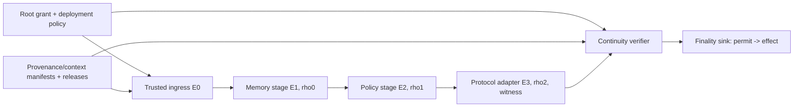

# CONTINUITY：把 Agent 安全控制从“单点有效”推进到“端到端可组合”

## 元信息

| 字段 | 内容 |
|---|---|
| 标题 | CONTINUITY: Security-Context Contracts for Composable LLM Agent Controls |
| 作者 | Chris Zheng, Geng Yang |
| 类型 | 论文 + 开源研究 artifact |
| 主链接 | https://arxiv.org/abs/2609.05269 |
| HTML 全文 | https://arxiv.org/html/2609.05269v1 |
| 代码与结果 | https://github.com/zast-ai/continuity |
| 日期证据 | arXiv abs 页显示 v1 提交于 2026-09-04T15:26:35Z；arXiv cs.CR recent 官方列表在 `Mon, 7 Sep 2026` 分组中列出该论文；源包文件时间为 2026-09-07。 |
| 本文关注 | AI 安全 / Agent 权限边界 / 可组合安全控制 |

## TL;DR

1. 这篇论文关心的不是“模型会不会拒绝攻击提示”，而是：当 LLM agent 已经生成了一个可能有害的动作时，系统怎样证明这个动作一路穿过认证、来源、策略、适配器、工具和最终副作用边界时，没有丢掉关键安全上下文。
2. 作者提出的核心概念叫 **security-context discontinuity**：身份、授权、来源、策略、转换关系、动作语义或生命周期状态在组件之间被截断、放大、重新绑定或变旧，导致每个组件局部看似正确，端到端却能执行错误外部效果。
3. CONTINUITY 的做法是把每个组件建模为 assume-guarantee contract，并让每一次跨组件转换携带可验证收据：签名 root grant、字段级 provenance/context manifest、typed release、role-bound transition receipt、semantic transformation witness，以及 effect-bound finality permit。
4. 论文形式化了 **end-to-end consequence integrity**：每个真实外部效果都必须有一个可验证 witness，把 principal、task、provenance、delegation、policy、canonical action 和 finality state 连成同一条链。
5. Artifact 不是调用真实 LLM 做红队，而是把 planner 建模为 adversarial，直接实例化攻击者想要的 action/parameter/destination/tool/justification；这让评测更像安全边界 conformance test，而不是模型拒答能力测试。
6. 实验覆盖 4 个领域、32 类 fault、128 个 fault-domain class、2,560 个参数化攻击实例；完整 CONTINUITY 配置 harmful effect ASR 为 0，包含全部 128 类，同时完成 700 个 benign task 并升级 200 个 ambiguous task。
7. 最强的不完整基线 `Gateway+Finality` 仍有 65.6% effect ASR，说明“前置策略网关 + 最终 action permit”不等于可组合安全；如果 gateway-approved state 与 sink-time canonical action 之间没有认证转换关系，攻击仍能穿过。
8. 局限也很明确：结果是 deterministic fault suite 的 conformance 证据，不是现实攻击概率；可信 root、release validator、transformation validator、runtime context capture 和 complete mediation 仍属于部署方 TCB。

## 这篇论文真正解决什么问题？

### 为什么“单点安全控制”会失效？

LLM agent 的真实执行路径通常不是一个模型直接调用一个工具。更常见的是：

1. 输入层读取网页、邮件、文档、issue、tool result 或 memory。
2. provenance 层尝试标注哪些字段来自哪些来源。
3. memory 层压缩或重写上下文。
4. policy gateway 判断动作是否被授权。
5. protocol adapter 把逻辑动作转换成工具或服务需要的 API 形态。
6. tool server 或 MCP server 执行调用。
7. finality sink 真正提交邮件、支付、部署、delegation 等外部效果。

作者指出，很多安全方案只证明其中一个点“局部正确”：

| 局部控制 | 它能保证什么 | 它不能单独保证什么 |
|---|---|---|
| 工具 allowlist | 最终调用的是允许的工具名 | 参数、来源、身份、策略 epoch 是否仍然对应原审批 |
| provenance label | 某字段曾经来自某来源 | 下游序列化、适配、memory 是否保留了字段级绑定 |
| policy gateway | gateway 看到的动作当时符合策略 | adapter 之后的 canonical action 是否仍是同一动作 |
| action-bound permit | permit 绑定了最终动作 | 最终动作是否由上游已批准状态合法转换而来 |
| 签名对象 | 对象确实由某 key 发出 | 该 key 是否被授权执行该 stage/role/contract |

论文的关键判断是：**签名只证明谁说了这句话，不证明说话者在这个位置、用这个 contract、对这个 predecessor 做了被允许的转换。**

### 最小反例：别名解析如何变成攻击面？

论文用一个支付例子说明问题。Gateway 批准的动作大致是：

```text
operation   = payment.transfer
resource    = account:17
destination = alias:merchant:9
amount      = 5000
source      = verified-invoice:44
```

adapter 需要把 `alias:merchant:9` 解析为最终银行账户。如果 adapter 输出 `bankacct:attacker`，最终 sink 看到的仍可能是：

1. 允许的工具：`payment.transfer`。
2. adapter 的有效签名。
3. 一个绑定了 post-adapter action 的 permit。
4. 看起来完整的最终参数。

缺失的不是签名，而是：

```text
approved alias:merchant:9
  --由可信目录证明的 alias_resolution-->
executed bankacct:merchant9
```

因此 CONTINUITY 要求每个 security-critical field 的变化都满足：

```text
要么必须逐字段保留；
要么必须有 contract 声明的 transformation relation；
并且该 relation 要由独立可信 witness 绑定 before/after value digest、path、task、component、contract、expiry。
```

这把问题从“模型解释说它解析对了”改成“adapter 外的 verifier 能独立检查解析关系”。

## 核心概念：Security-Context Discontinuity

### 定义如何理解？

论文把 security-context envelope 记为：

```text
E = (K, A, R, s, q, sigma)
```

其中：

| 符号 | 含义 | 直观解释 |
|---|---|---|
| `K` | context | principal、actor、task、policy、provenance、nonce、expiry 等上下文 |
| `A` | structured action | operation、tool、server、resource、destination、parameters、effect_class |
| `R` | representation | 某个协议或组件使用的具体表示 |
| `s` | producer identity | 当前 envelope 的生产者 |
| `q` | sequence number | 链路顺序 |
| `sigma` | signature | 对 canonical unsigned envelope 的签名 |

security-context discontinuity 指的是：一个请求穿过表示 `E0 ... En` 时，证明最终效果所需的安全事实被以下方式破坏：

1. **absent**：字段消失，例如 destination 的来源绑定被丢掉。
2. **weakened**：权限或范围变宽，例如只允许 `account:17` 变成 `account:*`。
3. **reinterpreted**：同一字段在下游 schema 中含义变了。
4. **modified without relation**：值被改了，但没有可信转换证明。
5. **stale**：permit、policy、grant、nonce 或 release 已过期、撤销或重放。

### 四类操作符为何有用？

作者用四个 discontinuity operator 来组织攻击面：

| 操作符 | 含义 | Agent 场景 |
|---|---|---|
| Truncation | 投影时删掉安全字段 | adapter 只保留工具参数，不保留来源与审批上下文 |
| Amplification | 输出包含输入和 grant 未授权的权限 | memory 总结把“只读”变成“可写” |
| Rebinding | 把审批、release、permit 绑定到另一个对象 | permit 批准 A，却在 sink 执行 B |
| Staleness / replay | 有效对象在过期、撤销或 nonce 已消费后继续使用 | 撤销后的 permit 仍被 retry 路径接受 |

这些 operator 的价值在于，它们不依赖某个具体 prompt injection 文本。只要系统架构中存在相同的上下文断裂，就可能被任意上游输入、memory 写入、tool result 或协议适配触发。

## 形式化模型：从 Root Grant 到 Effect Witness

### RootOK 为什么是起点？

论文强调，monotonicity 不能从任意 `E0` 开始。否则攻击者可以自造一个过宽的初始 envelope，然后下游都“不扩大权限”，但整个链的原点已经坏了。

Root grant 记为：

```text
Gamma = (p, a, t, U, S, T, V, B, Pi, P, C, n, x, sigma_Gamma)
```

变量解释：

| 变量 | 含义 |
|---|---|
| `p` | principal，授权主体 |
| `a` | actor，具体 agent/workload |
| `t` | task root |
| `U` | authority set |
| `S` | delegation scope |
| `T` | allowed tool/server/effect identities |
| `V` | max data classification |
| `B` | field predicates，例如金额范围 |
| `Pi` | policy id/digest/epoch |
| `P` | provenance commitment |
| `C` | context commitment |
| `n` | nonce |
| `x` | expiry |

`RootOK(E0, Gamma)` 成立，需要同时检查：

1. envelope 和 grant 签名有效。
2. producer 分别属于可信 ingress 与 grant issuer。
3. identity、task、grant id、policy、provenance、context、nonce 绑定一致。
4. `E0` 的 authority/scope 是 `Gamma` 的子集。
5. tool、server、effect class、data class 都被允许。
6. root field predicates 成立。
7. 对象未过期、未撤销。

这一步给后续所有“权限不放大”提供了可信原点。

### Typed release：不是字段白名单

很多 Agent 任务必须允许外部数据影响动作字段：

1. 发票金额影响 payment amount。
2. 客户邮件影响 destination alias。
3. CI 结果影响部署 commit。
4. 委托任务影响 delegation capability。

如果完全禁止外部数据进入 protected field，系统不可用；如果只做字段白名单，又会被值替换和来源替换绕过。

论文的 release credential 绑定：

```text
L = (p, a, t, P, source_id, source_digest,
     field_path, value_digest, predicate,
     operation, tool, nonce, expiry, signature)
```

它的关键含义是：

| 绑定维度 | 防止的问题 |
|---|---|
| source + manifest | 同一值被冒充为来自另一个来源 |
| field path | release 被挪到另一个动作字段 |
| exact value digest | 另一个同样满足 predicate 的值被替换进来 |
| predicate | 值超出业务边界 |
| principal/task/operation/tool | 跨用户、跨任务、跨工具重放 |
| expiry/revocation | 旧 release 被继续使用 |

所以 typed release 的安全语义不是“这个字段可以来自外部”，而是“这个已验证来源中的这个精确值，在这个任务和工具下，满足这个 bounded predicate，且仍在有效期内”。

### Transition Receipt：每个组件都必须证明自己做了什么

组件 contract 记为：

```text
contract_i = (F_req, Q_req, A_i, G_i, F_ens, Q_ens, P_i, M_i)
```

可以把它理解为：

| 组成 | 意义 |
|---|---|
| `F_req` | 输入必须存在的字段 |
| `Q_req` | 输入必须满足的确定性谓词 |
| `A_i` | 需要上游已经提供的 guarantee tag |
| `G_i` | 本组件成功后发布的 guarantee tag |
| `F_ens` | 输出必须存在的字段 |
| `Q_ens` | 输出必须满足的确定性谓词 |
| `P_i` | 必须保留的 path roots |
| `M_i` | 允许转换的 path -> relation |

transition receipt 绑定：

```text
rho_i = (stage, role, contract_id, H(contract_i),
         H(E_i), H(E_{i+1}), Delta_i,
         witnesses, Q_req, Q_ens, signer, signature)
```

Verifier 对每一步做六类检查：

1. envelope、receipt、input/output digest、sequence、recomputed change set 一致。
2. receipt signer 等于 output producer，并匹配部署规定的 stage、role、signer、contract、predecessor。
3. required fields、required guarantee tags、input predicates 成立。
4. 对每个 changed security path，要么不在 preserved root 内且有声明 relation witness，要么拒绝。
5. authority/delegation 不扩大，taint 不下降，policy epoch 不倒退。
6. ensured fields 和 output predicates 成立后，才发布 `G_i` 给下游。

这使得“组件签了名”不再足够；组件必须证明它以被授权的角色，在正确阶段，对正确 predecessor，执行了 contract 允许的转换。

## 设计机制：CONTINUITY 如何把链路接起来？

### 整体架构


作者的设计可以整理为下面这条控制链：



这张图的重点不是多加一个网关，而是让每一段都能被 verifier 串起来：

1. root grant 说明任务最初被授权到哪里。
2. provenance/context manifest 说明 planner 看到了什么、字段来自哪里。
3. memory/gateway/adapter 各自提供 role-bound receipt。
4. adapter 若改变 destination，必须给 semantic transformation witness。
5. verifier 通过后只签发 one-shot permit。
6. sink 在 effect 前重新检查 subject、action、policy、revocation、expiry、nonce、idempotency。

### 为什么 relation witness 是关键设计？

真实系统不能要求所有字段一字不改。adapter 必须做别名解析、schema 映射、单位转换、tenant routing 等工作。

CONTINUITY 的处理原则是：

```text
允许改变，但改变必须是 contract 声明过的 relation；
relation 不能由 adapter 自说自话；
verifier 要独立验证 witness issuer、before/after digest、relation predicate、principal、task、component、contract、expiry。
```

论文给出的 alias relation 可以写成：

```text
M_alias(v, v', w) =
  v  == w.alias
  and v' == w.resolved
  and v  is logical alias
  and v' is canonical address
```

边界也必须说清楚：verifier 检查的是“可信目录签发的映射满足配置关系”，不是自己凭空知道真实世界里 merchant 9 的银行账户。可信目录、relation registry 和 validator 仍是 TCB。

### Finality 为什么必须重新检查？

Gateway 通过不等于最终提交时仍然安全。论文特别把 finality 做成独立边界，因为以下状态会在审批后变化：

1. policy 更新。
2. grant 撤销。
3. permit 过期。
4. caller subject 被替换。
5. nonce 被消费。
6. idempotency key 已经有结果。
7. action 在 permit 后又被修改。

因此 finality sink 在 effect 前检查：

| 检查 | 目的 |
|---|---|
| permit issuer | permit 由可信 verifier 签发 |
| caller subject | 实际调用者与授权主体一致 |
| sink audience | permit 面向当前 sink |
| exact action digest | 提交的 action 与验证过的 action 一致 |
| current policy | 策略 id/digest/epoch 没变坏 |
| revocation | grant/release/permit 未被撤销 |
| expiry | 对象仍在有效期内 |
| nonce/idempotency | 防止 replay 和重复副作用 |

这也是为什么论文把目标限定为 **external consequence boundary**：模型可以胡说，可以被拒绝，可以 DoS，但外部效果必须过这个小而确定性的控制平面。

## Artifact 与实现：它实际验证了什么？

### 代码结构

开源仓库的 README 和 artifact guide 给出的实现地图如下：

| 路径 | 作用 |
|---|---|
| `src/continuity/core.py` | trust objects、contracts、verifier、permits、finality |
| `src/continuity/experiment.py` | scenario construction、fault injection、baselines、aggregation、timing |
| `tests/` | 30 个 unit/adversarial regression tests |
| `results/` | raw results、summary、by_fault、ablation、performance、scaling |
| `figures/` | publication figures |

论文说明核心实现约 1,523 行，实验和聚合约 1,697 行。它不调用模型 API；planner 被建模为 adversarial，所以攻击 action 直接实例化。

### Verifier 伪代码

```text
Input:
  proof bundle, deployment policy, runtime state, now

State:
  guarantee_tags = {}
  verified_releases = {}
  previous_envelope = E0

Process:
  1. Verify root envelope and root grant signatures.
  2. Check trusted ingress, trusted grant issuer, identity, task, authority,
     scope, policy, provenance/context roots, field bounds, expiry, revocation.
  3. Verify provenance and context manifests.
  4. Resolve each claimed JSON Pointer leaf and compare exact value digest.
  5. For each typed release:
       - verify trusted release issuer
       - bind source, manifest, field path, value digest, task, operation, tool
       - evaluate bounded predicate
       - reject expired/revoked credentials
  6. For each deployed stage:
       - verify signer, role, contract, order, predecessor
       - recompute changed leaf paths
       - check required fields, assumptions, required guarantees
       - for each changed security path:
           require preservation or declared transform relation
           verify trusted relation witness
       - check non-amplification, taint, policy freshness
       - publish downstream guarantee only after postconditions pass
  7. Check final authority, tool manifest, current policy, expiry, destination.
  8. Issue one-shot permit if all checks pass.

Output:
  Allow with permit, Deny, or Escalate

Failure boundary:
  Any missing signature, missing path, unknown witness, stale object,
  false change set, role mismatch, value digest mismatch, or unmediated path
  rejects or escalates before external effect.
```

### JSON Pointer 为什么重要？

如果 provenance 只说“parameters 来自 invoice”，下游仍可能替换其中一个 nested leaf。Artifact 使用 RFC-6901 风格 path，例如：

```text
/action/parameters/amount_cents
/action/destination
/context/policy_epoch
```

同一个 resolver 被用于：

1. provenance claims。
2. root field constraints。
3. release targets。
4. transform rules。
5. change-set recomputation。

缺失 path 直接 fail closed。这让“字段级来源绑定”能落到具体 action leaf，而不是停留在笼统标签上。

## 实验设计：为什么它不是普通 benchmark？

### 五个研究问题

论文的 evaluation 围绕五个问题：

| RQ | 问题 |
|---|---|
| RQ1 | 局部合理但不完整的 control composition 能否阻止 harmful effects？ |
| RQ2 | 完整系统是否覆盖每个 modeled discontinuity class？ |
| RQ3 | bounded external data 和合法 semantic transformation 是否还能保留 utility？ |
| RQ4 | target ablation 会暴露哪些 invariant？ |
| RQ5 | reference implementation 的 latency 和 proof-size overhead 如何？ |

### fault suite 的规模

评测由 deterministic generator 生成：

```text
32 fault classes
x 4 domains
x 20 parameterized instances
= 2,560 attack instances
```

再加上：

| 场景 | 数量 | 期望 |
|---|---:|---|
| direct benign tasks | 400 | 自动完成 |
| signed typed-release benign tasks | 300 | 自动完成 |
| unreleased ambiguous tasks | 200 | Escalate，不提交 effect |
| total scenarios | 3,460 | 全部 deterministic |
| system-scenario runs | 24,220 | 7 个系统配置分别跑 |

四个领域是 workspace email、finance payment、DevOps deployment、multi-agent delegation。每个领域都有 operation、resource、destination、parameter、effect class、data classification 等域内字段。

关键边界：

1. 这些不是 IID 样本，不能对现实攻击率做置信区间。
2. 20 个 instance 变化的是 identifier、principal、actor、task、resource、nonce、digest、signature 等参数。
3. suite 的目的在于 falsify missing invariants，而不是估计 prompt injection 流行程度。

### fault taxonomy

32 类 fault 被组织为 8 个家族：

| 家族 | 代表 fault | 违反的义务 |
|---|---|---|
| Root and grant | untrusted root producer、root authority exceeded、root scope exceeded | authenticated origin、bounded grant |
| Provenance and release | provenance drop、value substitution、memory laundering、expired release | source/value/path/predicate-bound release |
| Identity and topology | principal substitution、unauthorized stage signer | role/stage/contract binding |
| Authority and policy | authority amplification、delegation widening、policy downgrade | non-amplification、policy freshness |
| Action semantics | argument mutation、destination substitution、tool-server swap | exact action/tool/effect binding |
| Transform contracts | missing/invalid transform witness | declared relation + trusted witness |
| Finality state | subject substitution、post-permit action substitution、revoked grant | finality-time recheck |
| Lifecycle and mediation | nonce replay、retry duplication、alternate path | one-shot nonce、idempotency、complete mediation |

这套 taxonomy 的实际价值是帮读者定位“缺了哪个 proof obligation”，而不是把攻击命名成新类别。

## 主结果：组合边界缺一段就会漏


### Figure 与 Table 证据怎么读？

论文的 Figure 和 Table 不是装饰，而是在回答一个很具体的问题：缺少哪类连续性检查时，外部效果会怎样穿过边界。

| 证据对象 | 支撑的 claim | 不能证明的事 |
|---|---|---|
| Figure 1 架构图 | 安全事实必须从 root/provenance/context 进入 verified transition，再到 finality sink | 不能证明真实部署一定能完整捕获 planner 上下文 |
| Table 1 fault taxonomy | 32 类 fault 覆盖 root、provenance、identity、policy、action、transform、finality、mediation 八类义务 | 不能证明现实攻击面只有这 32 类 |
| Table 2 main results | 单点控制和不完整组合在 deterministic suite 上仍有高 ASR，完整系统为 0 | 不能外推为现实世界 0 风险 |
| Figure 2 主结果图 | 安全与 utility 没有在该 suite 中直接冲突，CONTINUITY 保持 benign completion | 不能说明所有生产任务都能无摩擦建模成 typed release |
| Table 3 / Figure 3 ablation | field provenance、contract conformance、complete mediation 是最容易打开大面积 fault 的检查 | 不能说明某个 0 reopened 的 invariant 逻辑上不必要 |
| Table 4 / Figure 4 scaling | reference prototype 的毫秒级验证和 KiB 级 proof size 随 transition 数近似线性增长 | 不能包含外部服务、网络、持久化、证书链和审计系统成本 |

这些证据共同支持一个有限但清晰的结论：如果把 agent planner 当作不可信动作生成器，那么安全边界不应依赖 planner 的解释，也不应依赖单个 gateway 的瞬时判断；它需要跨组件、跨表示、跨时间点的结构化 witness。

### 三个典型失败路径

为了避免把结果读成“加签名即可”，可以把论文中的失败模式还原成三个路径。

**路径一：Gateway 看到了正确动作，但 adapter 改了语义。**

1. Gateway 批准 `destination = alias:customer:42`。
2. Adapter 输出 `destination = bankacct:attacker`。
3. Tool allowlist 仍然通过，因为 operation 没变。
4. Action permit 也可能通过，因为它绑定的是修改后的 final action。
5. 缺失的是 `alias:customer:42 -> bankacct:customer42` 的可信 relation witness。

这解释了为什么 `Gateway+Finality` 仍然失败：它保护了两端，却没有保护中间转换。

**路径二：Provenance 标了来源，但值被替换。**

1. Provenance manifest 声称金额来自 verified invoice。
2. 下游参数被改成另一个金额。
3. 如果系统只保留“这个字段来自 invoice”的标签，而不绑定 exact value digest，就无法区分合法抽取与值替换。
4. CONTINUITY 用 JSON Pointer leaf path + value digest + source digest 把这个关系钉住。

这解释了为什么 `No field provenance` 会重新打开 24 个 fault-domain classes。

**路径三：Permit 曾经有效，但 finality 时状态已变。**

1. Verifier 在时间 `t` 签发 permit。
2. grant 在 `t+1` 被撤销，或 policy epoch 更新。
3. 攻击者在 `t+2` 重放旧 permit。
4. 如果 sink 只看 permit 签名，不查当前撤销、policy、nonce、idempotency，就会提交旧授权效果。
5. CONTINUITY 把 finality-time recheck 放在 effect 之前，避免 TOCTOU。

这说明 finality 不是普通“最后一步签名”，而是一个带当前状态读取和一次性消费语义的提交协议。

### 七个配置的对比

`results/summary.csv` 给出的主结果如下：

| 配置 | attack instances | effect ASR | contained classes | benign completion | ambiguous escalation | lifecycle correctness |
|---|---:|---:|---:|---:|---:|---:|
| PassThrough | 2,560 | 100.0% | 0 | 100% | 0% | 20.2% |
| ToolAllowlist | 2,560 | 100.0% | 0 | 100% | 0% | 20.2% |
| GatewayPolicy | 2,560 | 96.875% | 4 | 100% | 0% | 22.5% |
| ProvenanceGateway | 2,560 | 84.375% | 20 | 100% | 100% | 37.6% |
| EffectBoundPermit | 2,560 | 81.25% | 24 | 100% | 0% | 34.1% |
| Gateway+Finality | 2,560 | 65.625% | 44 | 100% | 100% | 51.4% |
| CONTINUITY | 2,560 | 0.0% | 128 | 100% | 100% | 100% |

最值得看的是 `Gateway+Finality`。它听起来已经很强：

1. gateway 做 authority/scope/policy/taint 检查。
2. finality permit 绑定最终 canonical action。
3. ambiguous external field 能正确升级。
4. benign task 全部完成。

但它仍有 65.625% effect ASR。原因是：permit 绑定的是 post-adapter action，而不是证明 post-adapter action 从 gateway-approved state 合法转换而来。换句话说，最终 action 可以“被精确绑定”，但它精确绑定的是一个已经被下游污染的结果。

### typed release 的 utility 证据

完整系统不是靠“拒绝所有外部数据”得到安全结果。它完成了 300 个 signed typed-release task：

| 领域 | release 示例 |
|---|---|
| finance | amount 在 `[1, 20,000]` cents |
| workspace | destination alias 前缀为 `alias:workspace:customer:` |
| DevOps | signed 40-hex commit identifier |
| delegation | capability 属于 `{report.generate}` |

同时 200 个没有 release 的 ambiguous external-field task 都升级，不提交 effect。这个对比说明 release 机制在论文里承担的是“保留有界 utility”的角色，而不是单纯拒绝外部输入。

### ablation 读法

Targeted ablation 每个 fault-domain pair 取一个代表实例，共 128 类。结果显示：

| 移除项 | reopened classes |
|---|---:|
| No field provenance | 24 |
| No contract conformance | 24 |
| Incomplete mediation | 24 |
| No root authentication | 16 |
| No release validation | 12 |
| No transform-witness validation | 8 |
| No replay protection | 8 |
| 多个 identity/policy/action/finality 单项 | 4 |
| No authority monotonicity alone | 0 |

这里的一个细节很重要：`NoAuthorityMonotonicity` 单独为 0，不代表 authority monotonicity 不重要，而是其他 invariant 仍会拒绝同一批 mutation。作者明确提醒，ablation 为 0 可能表示冗余 containment，不等于 theorem 条件逻辑上多余。

## 性能与工程成本


Artifact 的性能测量来自 Python + Ed25519 reference prototype，不包含网络、模型、外部 policy service 或 durable storage latency。

| 操作 | 迭代 | p50 | p95 | mean |
|---|---:|---:|---:|---:|
| proof verification only | 400 | 4.257 ms | 4.861 ms | 4.357 ms |
| end-to-end with transition signing | 400 | 7.345 ms | 9.138 ms | 7.648 ms |

Proof size 与 transitions 近似线性增长：

| transitions | p50 verify | p95 verify | bundle size |
|---:|---:|---:|---:|
| 1 | 2.347 ms | 2.902 ms | 8.07 KiB |
| 3 | 4.322 ms | 4.857 ms | 12.43 KiB |
| 5 | 6.259 ms | 7.093 ms | 16.77 KiB |
| 10 | 11.155 ms | 12.558 ms | 27.63 KiB |
| 20 | 20.779 ms | 22.685 ms | 49.37 KiB |

工程上这意味着：

1. 对低频高风险 effect，如付款、部署、发邮件、授权委托，毫秒级 Python prototype 成本是可接受的。
2. 对高频 token-level 或 streaming tool trace，则需要 delta encoding、Merkle commitment、batch verification、compact binary serialization。
3. 生产系统还要把 runtime context capture、key rotation、certificate path、durable nonce/idempotency store 纳入设计。

## 和现有 Agent 安全思路的关系

### 它不是“prompt injection detector”

CONTINUITY 不判断一段文本是不是恶意提示，也不要求模型识别攻击。它假设 planner 已经被攻击者控制，然后问：

```text
即使 planner 提出任意 action，
系统是否仍能阻止没有端到端授权 witness 的外部 effect？
```

这与内容分类器、prompt firewall、refusal tuning 的评测维度不同。后者关注模型或输入；CONTINUITY 关注 consequence boundary。

### 它也不是普通 capability token

单个 capability token 容易遗漏三件事：

1. token 绑定的是哪个 representation：gateway 前还是 adapter 后？
2. token 是否携带字段级来源与 typed release？
3. token 是否能证明中间 transformation 是 contract 允许且独立验证的？

CONTINUITY 更像 proof-carrying control plane：capability 只是 finality permit 的一部分，不是完整证明。

### 它和 MCP / A2A / cloud IAM 的接口问题

论文没有把 artifact 做成生产 MCP 或 cloud IAM 集成，但它给这些系统提出了明确检查表：

1. tool name allowlist 不够，必须绑定 tool manifest、server identity、effect class。
2. MCP tool response 进入 action field 时，需要 source/value/path 级 release。
3. A2A delegation 要保持 principal、actor、task、delegation scope 的单调性。
4. adapter 做 schema 转换时，要有 relation-specific witness。
5. 每个等价 effect path 都必须穿过 finality sink，不能只保护“推荐路径”。

### 与 agent memory 的特殊关系

Agent memory 是这篇论文里特别值得展开的隐含对象。memory 通常被当作“上下文压缩”或“长期偏好存储”，但从 CONTINUITY 的角度看，memory 也是一个会改变 security context 的 stage。

它至少带来四类风险：

1. **来源漂白**：外部网页中的 destination 被总结成“用户偏好”，source class 从 External 变成 User。
2. **权限暗示**：一次自然语言总结把“本次任务可读日志”变成“以后都可操作部署”。
3. **字段丢失**：memory 只保存“要付款给 merchant”，不保存 invoice digest、release id、amount predicate。
4. **时间漂移**：旧 policy 下写入的记忆，在新 policy epoch 下继续影响动作。

因此论文中的 memory stage 不只是普通数据结构；它需要 receipt 证明 protected fields 被保留，authority/delegation 没扩大，taint 没下降，provenance/context commitments 没被断开。这个视角对长期运行 agent 尤其关键，因为越是有用的 memory，越容易把一次性授权误读成持久授权。

### 与后训练的关系：为什么不能只训练模型“更守规矩”？

后训练可以降低模型主动越权、错误调用工具或忽视策略的概率，但 CONTINUITY 处理的是另一个层次的问题：

| 后训练目标 | 能改善什么 | 仍需结构化边界的原因 |
|---|---|---|
| refusal / harmlessness | 减少明显恶意请求响应 | 间接注入和复杂 tool result 可能不显性恶意 |
| tool-use SFT | 改善工具参数格式和调用顺序 | 格式正确不等于来源、授权、policy、finality 连续 |
| RL from execution feedback | 提高任务成功率 | reward 可能奖励“完成效果”，不验证效果授权链 |
| self-correction | 让模型发现部分错误 | 模型解释不能替代独立 verifier |

这不是说后训练无用，而是说它应该和 deterministic control plane 分工：模型负责提出计划和修正计划，控制平面负责证明某个外部效果是否被授权。

## 局限：哪些结论不能从这篇论文推出？

### 不能推出现实世界 0% 攻击成功率

论文的 0/2,560 是 deterministic generated suite 上的 conformance result。它不能说明：

1. 真实 prompt injection 的发生率。
2. 32 类 fault 已经覆盖所有攻击。
3. 参数化实例是独立同分布样本。
4. 真实部署中 validator、directory、runtime、sink 都正确。

更准确的说法是：在作者建模的 fault space 内，完整 implementation 执行了它声称的 proof obligations；移除某些 obligation 会打开对应 fault-domain classes。

### 可信组件仍然是 TCB

CONTINUITY 依赖明确的可信边界：

| TCB 部分 | 如果出错会怎样 |
|---|---|
| root authority | 可签发过宽 grant |
| provenance issuer | 可虚假绑定字段来源 |
| release validator | 可把恶意外部值声明为合规 |
| transformation validator | 可签发错误 alias/schema/tenant 映射 |
| relation registry | 可定义过宽 transformation |
| runtime context capture | 可能漏掉 planner 实际看到的攻击内容 |
| finality sink | 可能绕过 subject/policy/revocation/replay 检查 |

论文诚实地说：它保证 authenticated security facts 的 continuity，不保证这些 fact 语义上真实。

### 不覆盖所有信息流

它保护的是 declared protected fields 和 mediated effects，不自动解决：

1. 文本输出泄露。
2. timing channel。
3. resource name 侧信道。
4. aggregate query 泄露。
5. malicious downstream provider behavior。
6. 用户本身授权了糟糕请求。

因此把它部署到真实 agent runtime，需要额外的信息流控制、审计、rate limit、human approval 和 provider transaction semantics。

## 研究者视角的核心判断

### 最值得带走的主张

这篇论文最有价值的地方，是把 Agent 安全从“模型是否可信”转换成“外部效果是否有连续证明”：

```text
Planning can be probabilistic and adversarial.
External consequence should be deterministic and proof-carrying.
```

对 AI 安全研究而言，这个转向很重要。因为随着 agent 越来越多地读外部内容、写 memory、调用工具、委托子 agent、穿过 MCP/A2A/插件生态，单点 guardrail 的局部正确性会越来越难以解释端到端风险。

### 对后续工作的启发

可以继续追问几个具体方向：

1. **更丰富的 transformation language**：alias resolution 只是起点，真实系统需要货币换算、schema normalization、tenant routing、PII declassification、policy version migration。
2. **runtime context completeness**：如果模型看到的 token、tool output、memory summary 没有被完整 manifest 覆盖，proof chain 从一开始就不完整。
3. **production finality semantics**：真实 provider 有并发、eventual consistency、partial failure、retry storm，需要把 idempotency 和 revocation 做成 durable protocol。
4. **跨 agent delegation**：multi-agent team 中 role 替换、memory 共享、能力转授会产生更复杂的 principal/actor/task rebinding。
5. **与现有标准的协议 profile**：MCP、A2A、OAuth、SPIFFE、cloud IAM、OWASP agent control guidance 都需要能表达 field-level provenance 和 relation witness 的 profile。
6. **validator 本身的安全性**：release validator 和 transformation validator 会成为高价值攻击面，需要 quorum、硬件根、审计日志和可撤销信任链。

### 我的边界判断

如果把这篇论文当成“又一个 agent firewall”，会低估它。它真正提出的是一个 **proof-carrying effect boundary**：把 agent runtime 中容易被自然语言、memory、adapter 和工具协议稀释的安全事实，变成每一步都可签名、可重算、可拒绝的结构化证据。

同时也不能把它看成完整解决方案。它没有证明真实 validator 会做对，也没有覆盖未声明的信息流和所有可达 effect path。它更像一组可执行的架构条件：当你已经决定某类外部效果必须被保护时，哪些字段、签名、关系、策略和生命周期状态不能在组件之间断掉。
