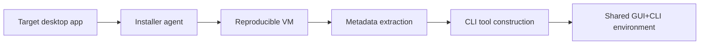
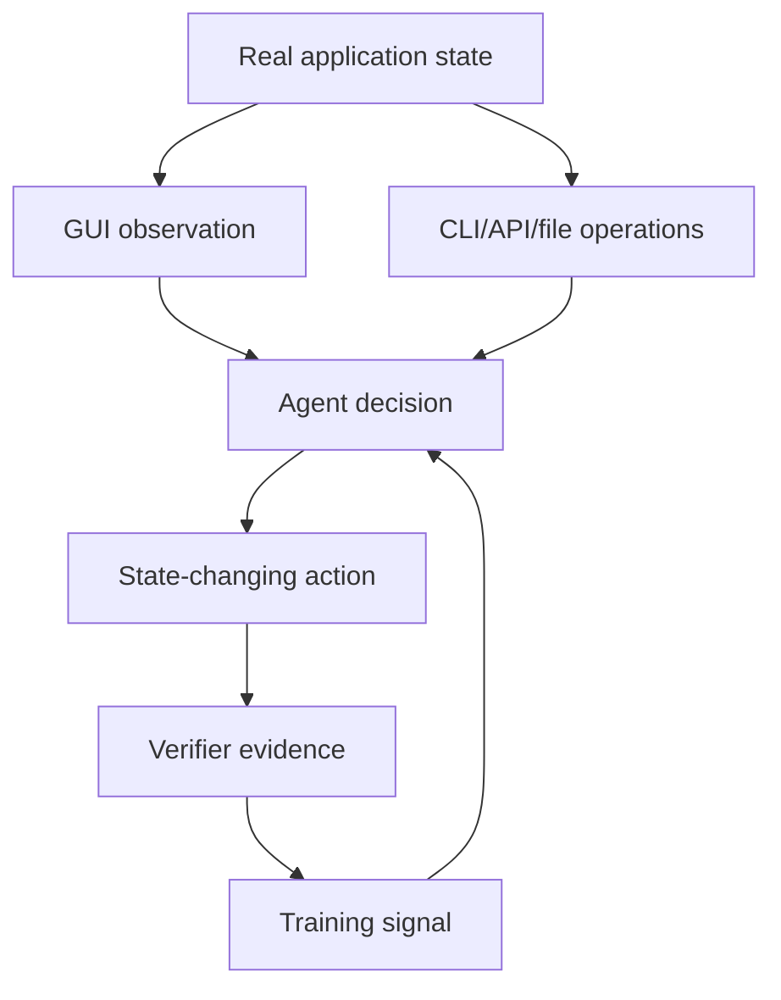

# CUA-Universe：把 computer-use agent 从“会点屏幕”推进到“会选择界面”

### 元信息

| 字段 | 内容 |
|---|---|
| 论文 | CUA-Universe: A Scalable and Dynamic Environment for Hybrid GUI+CLI Agents |
| 作者 | Haoting Shi、Wenhao Wang、Weicheng Fang、Yaozhong Liang、Tian Jin、Pengxiang Zhao、Guangyi Liu、Siheng Chen、Yanfeng Wang |
| 链接 | [arXiv](https://arxiv.org/abs/2609.05374)；[HTML](https://arxiv.org/html/2609.05374v1)；[PDF](https://arxiv.org/pdf/2609.05374)；[Source](https://arxiv.org/src/2609.05374) |
| 当前窗口证据 | arXiv `cs.AI/recent` 官方列表把该论文列在 `Mon, 7 Sep 2026` new submissions 中 |
| 原始提交证据 | arXiv abs submission history 显示 v1 为 `Fri, 4 Sep 2026 17:26:18 UTC` |
| 方向 | 大模型 Agent；computer-use agent；GUI+CLI hybrid environment；agent post-training |
| 本文立场 | 采用官方当前列表作为本周窗口证据，同时保留原始 v1 时间；不把两种日期证据混写成同一个发布时间 |

### TL;DR

1. **这篇论文问的不是“GUI agent 能不能更强”**，而是 computer-use agent 是否应当被训练成同时理解 GUI 状态、CLI 工具、文件系统和应用内部状态的混合执行者。

2. **作者提出 CUA-Universe**：一条环境到数据的闭环管线，把真实桌面软件转成共享状态的 GUI+CLI agent 环境，再从这些环境里合成任务、收集轨迹、做监督微调。

3. **三段机制很清楚**：App-Forge 负责安装和适配应用，暴露可复现 VM 与 CLI surface；Task-Weave 从真实 seed 文件和操作链合成任务；Path-Steer 在 rollout 时给出轻量界面选择先验，引导 agent 少走 GUI 重复点击或 CLI 脆弱脚本。

4. **规模证据**：系统覆盖 16 个真实桌面应用，约 404 个 agent-visible commands，生成 4,923 条通过 VLM judge 的 episodes，约 235K step-level records；CUA-Verse benchmark 有 8 个应用、160 个 held-out hybrid tasks。

5. **训练证据**：作者用 Kimi K2.5 生成 Path-Steer 轨迹，用 GPT-5.4 VLM judge 过滤，保留 score >= 0.75 的轨迹；再用 LoRA 微调 Qwen3.5-9B，训练 3 epochs，8x A100 约两天。

6. **结果证据**：9B 模型在 CUA-Verse 上比同 backbone base 提升 Score +39.3 points、步骤减少 37%、token 减少 60%；在 OSWorld 上 GUI+CLI 相比 GUI-only 提升 +16.8 success-rate points；在 OSWorld-MCP 上 Score 比 base 提升 +7.84 points。

7. **关键边界**：任务仍是单应用任务；训练只用 SFT，不是 RL；成功评分依赖 VLM judge；应用适配假设软件足够开放、可脚本化，并且当前环境主要是 desktop Linux。

8. **最值得带走的判断**：computer-use agent 的训练对象不应只是“动作序列”，而应是 `环境状态 + 工具 surface + 界面选择策略 + 可验证轨迹` 的组合。

### 研究问题：真实电脑任务为什么不是 GUI-only？

论文从一个直接的失败模式切入：

- GUI agent 在 OSWorld、AndroidWorld 等 benchmark 上已经能完成不少桌面或移动任务；
- 但它们仍主要通过鼠标、键盘和截图逐步操作；
- 一旦任务包含批量修改、精确写文件、导出、检查配置或处理大量对象，GUI 轨迹会变长、变脆、成本变高；
- 反过来，CLI agent 虽然能写脚本和批处理，却缺少视觉状态、布局关系和界面上下文。

作者把这个矛盾重新定义成一个 orchestration 问题：

| 旧问题 | 新问题 |
|---|---|
| agent 能不能看懂屏幕并点击？ | agent 能不能判断何时用 GUI、何时用 CLI？ |
| benchmark 是否覆盖更多网页或应用？ | 环境是否让 GUI 与 CLI 操作同一个持久状态？ |
| 轨迹是否完成任务？ | 轨迹是否以更短、更稳定、更可验证的方式完成任务？ |
| 训练是否复制人类演示？ | 训练是否包含跨界面选择和失败恢复信号？ |

这个问题对 Agent 研究有两个意义：

1. **能力边界被移动了**：真正的 computer-use 不等于视觉点击，真实用户也会在 GUI、shell、脚本、API 和配置文件之间切换。

2. **训练数据形态被移动了**：如果环境只允许 GUI，数据永远学不到“何时离开 GUI”；如果环境只允许 CLI，数据又学不到视觉 grounding。

### 论文主张与论证路线

| Claim | Mechanism | Evidence | Boundary |
|---|---|---|---|
| GUI-only 环境不能产生混合界面能力 | 每个应用都暴露 GUI 与应用特定 CLI，并共享持久状态 | 16 个真实桌面应用，约 404 个 agent-visible commands | 仍依赖可脚本化或开源程度较高的软件 |
| 混合任务可以规模化合成 | Task-Weave 从真实 seed、操作抽象、操作链和 verifier 生成任务包 | 4,923 verified episodes，约 235K steps | seed 和任务质量仍受生成模型与 verifier 约束 |
| 轨迹质量不只是能否完成任务，还包括界面选择 | Path-Steer 从操作链派生 hybrid execution prior，引导 CLI/GUI 分工 | Kimi K2.5 accept rate 0.44 -> 0.51，mean score 0.63 -> 0.71 | Path-Steer 只在数据生成时使用，评测时不提供解法提示 |
| 小模型能学到跨界面 orchestration | 用高分轨迹对 Qwen3.5-9B 做 LoRA SFT | CUA-Verse 0.189 -> 0.582；OSWorld GUI-only 23.4% -> GUI+CLI 40.2% | 只是 SFT，policy 仍受 teacher 上界约束 |
| 能力可以迁移到未见工具接口 | 在 OSWorld-MCP 上测试 unseen MCP action space | Score 21.67 -> 29.51，TIR 10.66 -> 23.36 | 仍未达到 GPT-5.5/Kimi K2.5 的全部能力水平 |

作者的说服方式不是单点 benchmark 刷榜，而是四层证据链：

1. **环境层**：证明真实软件可以被转成共享状态的 GUI+CLI 环境。

2. **任务层**：证明这些环境可以不断生成有 seed、有 verifier、有操作链的任务。

3. **轨迹层**：证明界面选择先验能提高 rollout 质量和效率。

4. **模型层**：证明用这些轨迹微调 9B 模型后，能力能跨 benchmark 和工具接口迁移。

### 方法机制一：把任务写成共享状态 POMDP

论文把 hybrid computer-use task 写成一个部分可观测决策过程。每一步 agent 看到的是：

```text
o_t = screenshot_t + optional_cli_returns_t
a_t in A_gui union A_cli
s_t = shared persistent application state
tau = (instr, s_0, V)
V(zeta) in [0, 1]
```

变量含义如下：

| 变量 | 含义 | 为什么重要 |
|---|---|---|
| `o_t` | 当前观察，包含截图和可选 CLI 返回 | 把视觉界面与命令输出放入同一决策上下文 |
| `A_gui` | 鼠标、键盘、等待、终止等 GUI 动作 | 处理布局、视觉选择、界面导航 |
| `A_cli` | 应用特定命令、脚本 API、文件操作等 CLI 动作 | 处理批量、精确、可验证操作 |
| `s_t` | GUI 与 CLI 共同读写的应用状态 | 避免 GUI 和 CLI 各自操作孤立副本 |
| `V` | 对轨迹打分的 verifier，论文中主要是 VLM judge | 让任务合成和数据过滤有统一验收口径 |
| `zeta` | 完整执行轨迹 | 用于训练 step-level 和 trajectory-level records |

这里的关键不是公式本身，而是状态建模：

- 如果 CLI 修改文件后 GUI 不刷新，agent 可能重复确认或误以为失败；
- 如果 GUI 选中了目标对象但 CLI 不知道当前文件路径，CLI 操作可能写错对象；
- 如果 verifier 只看最终截图，文件导出、配置修改、数据库写入等任务会被误判；
- 因此共享状态、命令返回、截图、轨迹和 exported artifact evidence 必须进入同一个任务定义。

### 方法机制二：App-Forge 怎样把应用转成环境？

App-Forge 解决两个工程瓶颈：

1. **环境适配**：不同桌面软件安装方式、依赖、配置、启动流程都不同，手工为每个应用写环境会拖慢规模化。

2. **工具构造**：不同应用的 CLI 能力差异很大，有的自带命令行，有的只有脚本 API，有的需要为 agent 生成受限命令层。

论文给出的做法是 agent-driven construction：



CLI surface 来自三类来源：

| 来源 | 示例 | 作用 |
|---|---|---|
| 发现 native CLI | `blender --python-expr`、`cvlc` | 直接利用软件已有自动化入口 |
| 包装 scripting API | `bpy`、LibreOffice UNO、GIMP Script-Fu | 把复杂脚本接口变成 agent 可调用命令 |
| 生成 agent-native CLI | 受 CLI-Anything 启发的 bounded harness | 当原生接口不足时提供受限、可审计的命令词表 |

论文覆盖的 16 个应用分成两组：

| 来源 | 应用 |
|---|---|
| OSWorld applications | Chrome、GIMP、LibreOffice Calc、LibreOffice Impress、LibreOffice Writer、Thunderbird、VLC、VS Code |
| CUA-Universe extensions | Audacity、Blender、Draw.io、Godot、Kdenlive、OBS Studio、QGIS、Zotero |

这个设计的研究意义在于：

- 环境不再只是“浏览器页面”或“模拟网站”；
- 每个应用都有真实文件、项目状态、导出物和 GUI 视图；
- CLI command count 不按目标数硬凑，而是随应用真实 capability surface 变化；
- agent 的动作空间从单一鼠标键盘变成可组合的应用操作 vocabulary。

### 方法机制三：Task-Weave 怎样合成任务？

Task-Weave 的目标不是随便写自然语言指令，而是从真实 seed 文件和可执行操作链中生成任务包。

作者把 seed 定义成已经打开在原生应用里的具体状态：

- Blender 的 `.blend` 场景；
- LibreOffice Calc 的 `.ods` 工作簿；
- VLC 的媒体文件；
- GIMP 的设计文件；
- Impress 的 `.odp` deck；
- Draw.io 的 `.drawio` 图。

任务合成流程可以拆成四步：

```text
Input:
  application adapter
  seed files and metadata
  operation inventory
  mapped CLI tools

Loop:
  1. explore seed and collect candidate operations
  2. compose operation chains
  3. score whether the chain is meaningful for this seed
  4. synthesize a natural user instruction and verifier

Output:
  task package = instruction + s_0 + verifier + guidance
Failure boundary:
  discard hallucinated targets, impossible chains, or tasks not supported by seed state
```

这一步的关键是“grounding”：

| 组件 | 防止的问题 |
|---|---|
| 真实 seed | 防止任务要求操作不存在的对象 |
| metadata | 让合成器知道哪些对象、文件、轨道、图层、条目可用 |
| operation chain | 保证任务不是一段空泛指令，而是可分解成可执行操作 |
| verifier | 保证最终状态可以被评分 |
| guidance | 为 Path-Steer 生成界面选择先验，而不是泄露低层动作 |

这里与普通 synthetic task 的差别很大：

- 普通任务合成容易生成“看起来合理但环境里不存在”的目标；
- Task-Weave 把指令压回 seed 和操作链，因此更容易检查可执行性；
- 难度由 chain length 和 composition 控制，从单操作编辑到多步 hybrid workflow。

### 方法机制四：Path-Steer 为什么不是给答案？

Path-Steer 只在数据生成 rollout 中使用，评测时 `path-hint` 为空。它提供的是 modality-level prior，而不是低层动作脚本。

可以把它理解为下面的策略：

```text
Input:
  task package
  operation chain
  GUI action space
  CLI registry
  fresh VM instances

For each rollout attempt:
  derive hybrid execution prior:
    if operation is batch, precise, high-throughput:
      prefer CLI
    if operation depends on visual layout or interface state:
      prefer GUI
  run agent with GUI+CLI interface
  parse CLI calls against registry
  execute command in VM
  feed rc, stdout, stderr into next observation
  score trajectory with V(zeta)
  keep trajectory if score >= 0.75

Output:
  verified step-level and trajectory-level records
```

这个设计回应了两个常见误区：

| 误区 | 论文给出的反证 |
|---|---|
| 只要开放 CLI，agent 自然会变强 | 多个 baseline 获得 CLI 后提升很小，说明工具 access 不等于工具 use |
| CLI 用得越多越好 | GPT-5.5 在 CUA-Verse 记录中 CLI share 为 100%，但 Score 仍不是满分；视觉 grounding 仍必要 |
| GUI-only 更安全稳定 | GUI-only 在 VS Code 设置修改案例里耗尽 60 步仍失败，CLI+GUI 用 5 次 CLI 和 12 个 GUI actions 完成 |
| Path-Steer 是评测作弊 | Path-Steer 只用于数据生成，评测 actor prompt 不带 solution guidance |

附录里的 VLC 案例也说明 Path-Steer 不一定让每一步都更顺。它可能先尝试无效 VLC CLI 参数，但能转向 `ffmpeg` 这类可行方案，并最终完成导出和 GUI 面板操作；没有 Path-Steer 的轨迹则容易卡在 GUI filter 配置里。

### 训练设置：SFT 数据从哪里来？

论文训练部分可以压缩成一条数据链：

| 阶段 | 实体 | 关键设置 |
|---|---|---|
| 环境和工具构造 | App-Forge | Codex coding agent，论文写为 GPT-5.6 |
| 操作抽象和任务合成 | Task-Weave | Kimi K2.5 |
| 成功评分 | VLM judge | GPT-5.4，score threshold 0.75 |
| rollout backbone | Path-Steer rollout | Kimi K2.5 |
| 微调模型 | Qwen3.5-9B | LoRA SFT，3 epochs，ms-swift |
| 训练资源 | GPU | 8x A100，约两天 |

训练数据规模如下：

| 数据池 | Episodes | Steps | 说明 |
|---|---:|---:|---|
| CUA-Verse pool | 2,526 | 140,088 | Audacity、Blender、draw.io、Godot、Kdenlive、OBS、QGIS、Zotero |
| OSWorld pool | 2,397 | 95,320 | Writer、Calc、Impress、VS Code、VLC、Thunderbird、GIMP、Chrome |
| 合计 | 4,923 | 235K 左右 | 全部来自 score >= 0.75 的 verified trajectories |

LoRA 细节也值得注意：

| 参数 | 值 |
|---|---|
| base model | Qwen3.5-9B |
| precision | bfloat16 |
| trainable part | language-model linear modules |
| frozen part | base weights、vision tower、multimodal aligner |
| LoRA rank | 8 |
| LoRA alpha | 32 |
| LoRA dropout | 0.05 |
| bias | none |

这意味着论文不是训练一个全新的 foundation GUI model，而是验证：

- 如果给 9B VLM 一个足够结构化的 hybrid trajectory 数据集；
- 即使只做 LoRA SFT；
- 它也能学到比 base 更有效的 GUI+CLI orchestration。

### 实验一：CUA-Verse 证明什么？

CUA-Verse 是作者自己构造的 held-out benchmark：

- 8 个应用；
- 每个应用 20 个任务；
- 共 160 个 hybrid GUI+CLI tasks；
- evaluation tasks 与训练数据 disjoint；
- 应用本身是 in-domain，因为 benchmark 目标就是测 pipeline 覆盖的软件上的混合能力。

主结果如下：

| Model | CUA-Verse Score | Steps | Token(K) |
|---|---:|---:|---:|
| Kimi K2.5 | 0.522 | 21.1 | 275 |
| Seed2.1 Pro | 0.599 | 40.1 | 449 |
| GPT-5.5 | 0.768 | 23.1 | 193 |
| Qwen3.5-9B | 0.189 | 56.2 | 643 |
| EvoCUA-8B | 0.330 | 41.7 | 377 |
| Ours | 0.582 | 35.2 | 255 |

这个表支持三个判断：

1. **同 backbone 提升非常大**：Qwen3.5-9B 从 0.189 到 0.582，接近 3 倍。

2. **效率不是牺牲成功率换来的**：Ours 同时把 steps 从 56.2 降到 35.2，把 token 从 643K 降到 255K。

3. **能力有应用结构差异**：作者报告 Ours 在 Audacity 0.815、OBS 0.605 上较强，在 Blender 0.398、Godot 0.460 上较弱，说明 3D/spatial interaction 仍是短板。

Action-modality 附录更能说明问题：

| Model | Steps | CLI % | Score |
|---|---:|---:|---:|
| Kimi K2.5 | 21.1 | 30.3 | 0.522 |
| Seed2.1 Pro | 40.1 | 49.2 | 0.599 |
| GPT-5.5 | 23.1 | 100.0 | 0.768 |
| Qwen3.5-9B | 56.2 | 0.0 | 0.189 |
| EvoCUA-8B | 41.7 | 3.0 | 0.330 |
| Ours | 35.2 | 25.3 | 0.582 |

这张表的重点不是“CLI 越多越好”：

- Qwen3.5-9B 不用 CLI，分数最低；
- EvoCUA-8B 几乎不用 CLI，也明显落后；
- Ours 用 25.3% CLI，就足以把 score 拉到 0.582；
- GPT-5.5 的 CLI share 是 100%，但仍不能满分，说明视觉任务不能被纯命令行完全吞掉。

所以 CUA-Verse 真正测的是：

> agent 是否能按任务需要选择界面，而不是偏执地最大化某一种动作类型。

### 实验二：OSWorld 迁移说明什么？

OSWorld 评测采用 244-task controlled protocol，排除 `os` 和 multi-app splits，并使用 official verifier。作者比较 GUI-only 与 GUI+CLI 两种接口。

核心结果如下：

| Model | GUI SR | GUI+CLI SR | 净提升 |
|---|---:|---:|---:|
| Kimi K2.5 | 53.7 | 54.5 | +0.8 |
| Seed2.1 Pro | 55.7 | 59.0 | +3.3 |
| GPT-5.5 | 66.8 | 68.0 | +1.2 |
| Qwen3.5-9B | 21.7 | 24.6 | +2.9 |
| EvoCUA-8B | 40.6 | 43.3 | +2.7 |
| Ours | 23.4 | 40.2 | +16.8 |

这组数字最重要的结论是：

- 给强模型加 CLI，收益通常只有几个点；
- Ours 的收益集中来自它学过 hybrid data，因此 GUI+CLI 接口打开后能转化成真实成功率；
- 论文说这个差值相当于把 41 个之前失败的 GUI-only 任务转成成功。

效率指标同样关键：

| Model | GUI+CLI Steps | GUI+CLI Token(K) | Step Gain | Token Gain |
|---|---:|---:|---:|---:|
| Qwen3.5-9B | 54.1 | 596.1 | 2.63 | 2.03 |
| EvoCUA-8B | 42.1 | 408.0 | 1.58 | 1.35 |
| Ours | 28.6 | 286.5 | 2.35 | 1.79 |

论文的 VS Code 示例把这种迁移讲得很具体：

- 任务是修改 debug 设置，使断点时焦点不回到 editor；
- GUI+CLI 轨迹先用 GUI 定位设置，再用 CLI 写入 `settings.json` 并验证持久化；
- 该轨迹用 5 次 CLI 和 12 个 GUI actions 完成，reward 为 1；
- GUI-only 轨迹反复搜索和点击设置 UI，耗尽 60-action budget，reward 为 0。

这个例子说明：

1. GUI 的作用是定位、观察、确认上下文；

2. CLI 的作用是精确写入、导出、批处理、验证；

3. 两者结合不是工具数量叠加，而是状态和证据链协同。

### 实验三：OSWorld-MCP 证明工具接口可迁移吗？

OSWorld-MCP 和训练时的应用 CLI 不同：

- 它给 OSWorld 加了 158 个 MCP tools；
- agent 可以组合 GUI actions 与 tool calls；
- 作者排除 `os` 和 `multi_apps` 后用 244 tasks；
- 指标包括 Score、Strict SR、TIR、ACS 和 tokens。

结果如下：

| Model | Score | Strict SR | TIR | ACS | Tokens(M) |
|---|---:|---:|---:|---:|---:|
| Kimi K2.5 | 36.05 | 35.25 | 30.33 | 27.52 | 85.21 |
| Seed2.1 Pro | 27.03 | 26.23 | 22.54 | 40.62 | 99.30 |
| GPT-5.5 | 30.73 | 29.92 | 25.00 | 27.06 | 54.62 |
| Qwen3.5-9B | 21.67 | 20.90 | 10.66 | 37.22 | 125.68 |
| Ours | 29.51 | 28.69 | 23.36 | 27.25 | 87.95 |

这支持一个更强但仍有限的主张：

- 模型没有见过 MCP action space；
- 但它学过“工具该何时介入 GUI 工作流”；
- 因而 Score 从 21.67 到 29.51；
- TIR 从 10.66 到 23.36，说明 tool-use decision 本身变好；
- ACS 从 37.22 降到 27.25，tokens 从 125.68M 降到 87.95M。

边界同样明显：

- Ours 超过 Seed2.1 Pro 的 Score，但没超过 Kimi K2.5；
- GPT-5.5 token 更低；
- 这不是“9B 模型全面超过闭源 agent”，而是“混合轨迹 SFT 能把一部分工具选择能力迁移到未见接口”。

### 实验四：Path-Steer 的消融价值

Path-Steer 的消融是在 320 个 synthesized tasks 上比较 `w/ Path-Steer` 与 `w/o Path-Steer`，保持 GUI+CLI interface 不变。

| Backbone | Setting | Accept Rate >= 0.75 | Mean score | Avg steps | Avg tokens | Avg cost |
|---|---|---:|---:|---:|---:|---:|
| Kimi K2.5 | w/ Path-Steer | 0.51 | 0.71 | 22.75 | 331,988 | $0.26 |
| Kimi K2.5 | w/o Path-Steer | 0.44 | 0.63 | 26.68 | 385,107 | $0.31 |
| Seed2.1 Pro | w/ Path-Steer | 0.54 | 0.75 | 25.53 | 263,500 | $0.29 |
| Seed2.1 Pro | w/o Path-Steer | 0.45 | 0.67 | 28.78 | 303,653 | $0.33 |

这个消融隔离了一个关键变量：

- 两组都有 CLI access；
- 差异是 rollout 是否得到界面选择先验；
- 因而提升不能简单归因于“开放了 CLI 工具”；
- 它更像是证明“生成轨迹时的路径结构”会影响后续 SFT 数据质量。

研究者应当特别关注这一点：

1. 许多 agent 训练论文只报告成功轨迹数量；

2. CUA-Universe 强调轨迹是不是 efficient hybrid path；

3. 如果数据里充满 GUI 重复点击或 CLI 脆弱脚本，SFT 会复制这些坏习惯；

4. Path-Steer 的价值在于改善被蒸馏的数据分布，而不只是改善一次 rollout 分数。

### Judge 与验证：这篇论文的证据是否可靠？

CUA-Universe 的 headline Score 和数据过滤都依赖 VLM judge，所以作者在附录做了人工一致性检查。

设置如下：

- 16 个应用；
- 每个应用抽 30 条 judge accepted trajectories；
- 每个应用抽 30 条 judge rejected trajectories；
- 三名 annotators 独立重评；
- annotators 不知道 judge score；
- 人类标签分为 fully success、partial success、failure；
- 二分类时只把 fully success 当 positive。

结果如下：

| 指标 | 数值 | 解释 |
|---|---:|---|
| acceptance precision | 99.0% | 480 条 accepted 中 475 条为人类 fully success |
| accepted hard failures | 0 | accepted 里的 5 个缺陷都是 partial success，不是 failure |
| rejection false-negative rate | 5.2% | 25 条 fully successful trajectories 被 judge 拒绝 |
| reweighted agreement | 97.0% | 按真实 acceptance rate 重加权 |
| Cohen's kappa | 0.94 | 作者称接近 almost perfect agreement |

这组验证能支持两个结论：

1. **训练数据污染被压低**：accepted set 里没有人类判定的硬失败，partial success 上界约 1%。

2. **数据产量会损失**：rejected set 里有少量成功轨迹被丢掉，这更像降低 recall，不像把失败样本混入正例。

但它不能证明：

- VLM judge 在所有未来应用中同样可靠；
- judge 不会偏好某些视觉风格或轨迹表达；
- Score 可以替代每个任务的程序化验收；
- 训练 judge 与报告 judge 的共享假设不会放大系统性偏差。

### 和近期工作的位置关系

论文把自己放在三个相邻方向之间：

| 方向 | 代表问题 | CUA-Universe 的差异 |
|---|---|---|
| GUI benchmark / environment synthesis | 如何合成网页或桌面任务？ | 不只合成 GUI，而是每个应用有共享状态 GUI+CLI |
| CLI / terminal agents | 如何完成命令行任务？ | CLI 不是孤立终端，而是和 GUI 操作同一个应用状态 |
| hybrid GUI+CLI agents | 如何把视觉动作与工具调用结合？ | 不只给固定工具集，而是提出构造环境、任务、轨迹的 pipeline |

它与 WeaveBench、Qwen-UI-Agent、Echoverse、OSReward 等近期 computer-use 研究形成连续线索：

- WeaveBench 更像 benchmark，强调长程真实混合接口评测；
- Qwen-UI-Agent 更像跨平台真实设备 GUI Agent 技术报告；
- Echoverse 更强调可修复 world 与 grounded verifier；
- OSReward 聚焦 reward model 和 judge 可靠性；
- CUA-Universe 则把重点放在“真实桌面应用如何转成 hybrid training environments”。

因此，这篇论文的贡献不是单纯又发布一个 agent 榜单，而是把可训练环境本身变成研究对象。

### 证据边界与局限

论文自己列出的限制很重要，不能忽略：

1. **任务是单应用任务**  
   每个任务都 grounded in one application's shared GUI+CLI state。跨应用 workflow 还没有覆盖，例如浏览器下载资料、写入文档、发送邮件、同步日历这类多应用状态传递。

2. **训练只做 supervised fine-tuning**  
   作者用 harvested trajectories 做 SFT，而不是直接用 verifier 做 RL。因此 policy 仍受 data-generation backbone 的上界约束，不能证明已经超越 teacher 的所有能力。

3. **成功评分依赖 VLM judge**  
   人工验证显示 accepted set 较可靠，但 verifier 仍不是程序化真值。尤其在复杂视觉布局、隐藏状态、外部文件或长程副作用里，VLM judge 仍可能漏判。

4. **应用适配有前提**  
   当前方法更适合 open-source、可脚本化、有文件格式或命令接口的桌面 Linux 软件。闭源软件、移动端、云端 SaaS、多用户权限系统仍需要新的 adapter 和安全策略。

5. **公开状态有限**  
   arXiv 论文写明 will release code and data，但本轮未在 arXiv abs、HTML、source 或 Hugging Face paper page 找到可用代码仓库链接；这限制了立即复现。

6. **日期证据需要区分**  
   官方 recent 列表把该条列入 2026-09-07，但 abs submission history 是 2026-09-04T17:26:18Z。Daily Report 采集采用当前列表 marker 作为窗口证据；研究引用时应同时保留原始提交时间。

### 失败模式与安全含义

CUA-Universe 的主线是能力训练，但它自然触到 Agent 安全问题。GUI+CLI agent 一旦可用，就不再只是“点错按钮”的风险，而是会同时影响文件、配置、导出物、应用缓存和可见界面。

| 风险点 | 在 hybrid agent 中为什么更突出 | 需要的研究补丁 |
|---|---|---|
| 权限扩大 | CLI 可以绕过 GUI 里的确认、预览和撤销流程 | per-command permission、risk tier、human confirmation |
| 状态漂移 | CLI 修改后 GUI 可能仍显示旧状态，agent 可能基于 stale view 决策 | adapter-level refresh、state digest、post-action consistency check |
| 证据偏置 | stdout 成功不代表用户目标完成，截图正确也不代表文件已保存 | 多源 verifier：截图、文件 diff、数据库、日志、导出物 |
| 工具捷径 | agent-native CLI 可能提供真实软件中不存在的 shortcut | 区分 training helper、real deployment tool、benchmark-only tool |
| 轨迹污染 | 高分轨迹可能包含不必要的权限使用或不可解释脚本 | trajectory lint、least-privilege scoring、unsafe action filtering |

因此，论文里的 hybrid orchestration 不能只被理解成效率优化。它还意味着安全评估对象必须从单步动作扩展到一整条状态变更链：

1. **动作前**：agent 是否知道这条 CLI 命令会改哪些文件、配置或外部状态？

2. **动作中**：命令是否在受限目录、受限参数和可记录环境里执行？

3. **动作后**：GUI、CLI output、文件内容和 verifier 是否对同一个最终状态达成一致？

4. **训练时**：高分轨迹是否因为使用过强工具而学到不可部署的捷径？

5. **部署时**：真实用户是否能理解 agent 为什么从 GUI 切到 CLI，以及该切换带来的权限含义？

这个角度也解释了为什么作者强调 shared persistent state。没有共享状态，GUI 和 CLI 只是两个并排工具；有了共享状态，它们才会形成同一条可审计行动链。问题是，同一条行动链越强，越需要可回滚、可解释、可最小授权的执行边界。

### 研究者视角：后续最值得追问什么？

这篇论文把 computer-use agent 的训练问题推进到更接近真实系统的层面，但也留下了几条清晰的研究线。

| 后续问题 | 为什么重要 |
|---|---|
| 多应用状态如何建模？ | 真实办公任务常跨浏览器、文档、邮件、表格和文件系统；单应用 verifier 不够 |
| CLI tool registry 如何做权限控制？ | 一旦 agent 能写文件、导出、执行脚本，安全边界比 GUI-only 更复杂 |
| verifier 能否从 VLM judge 转向 hybrid oracle？ | 文件 diff、数据库状态、截图、日志和 CLI output 应该组合成更可审计的验收 |
| RL 是否能突破 teacher 上界？ | 当前 SFT 学的是 teacher 的高分轨迹，per-task verifier 可自然转成 RL reward |
| agent-native CLI 会不会引入 benchmark-specific shortcut？ | 生成的 bounded CLI 可能让任务更可解，但也可能偏离真实软件用户接口 |
| UI refresh 与状态同步如何标准化？ | CLI 修改后 GUI 视图可能 stale，adapter 的同步策略会影响 agent 观察和安全 |

我认为最关键的后续不是再加更多应用，而是把下面这个闭环做严：



这个闭环里的每一条边都可能失败：

- GUI observation 可能看不到隐藏状态；
- CLI/API 操作可能绕过用户预期；
- agent decision 可能把 batch 操作误判成视觉任务；
- verifier evidence 可能过度相信截图或过度相信 stdout；
- training signal 可能复制高分但不安全的捷径。

### 核心判断

CUA-Universe 的最大价值，是把 computer-use agent 的训练单位从“屏幕动作”提升到“共享状态环境中的界面选择”。

更具体地说：

1. 它提醒我们，未来的 Agent benchmark 不应只问 agent 是否能完成任务，也要问它用哪种界面完成、成本多少、轨迹是否可审计。

2. 它证明了 hybrid GUI+CLI 数据可以让 9B 模型学到明显的工具选择能力，而不是只能靠更大的闭源模型自发涌现。

3. 它也暴露了新的安全问题：当 agent 能通过 CLI 精确修改状态时，权限、确认、回滚、日志、verifier 和 UI 同步必须一起设计。

4. 它还没有解决跨应用、强权限和完全程序化验收，但它给出了一个可扩展的研究框架：先把真实软件转成可复现、可验证、可训练的 hybrid environment，再让模型在其中学习何时看、何时点、何时写、何时停。

对 Agent 研究而言，这篇论文最值得记住的一句话可以概括为：

> computer-use agent 的关键能力不是“拥有 GUI 或 CLI”，而是在共享状态中选择正确界面、保留证据并完成可验证动作。
