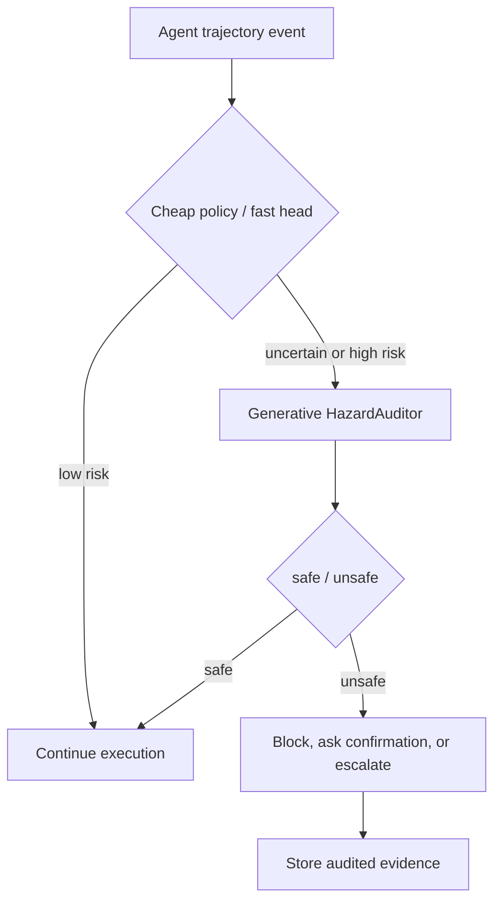

# HazardAuditor：把 Computer-Use Agent 安全从“看文本”推进到“审轨迹”

## 元信息

| 字段 | 内容 |
| --- | --- |
| 论文 | HazardAuditor: From Executable Threats to Safer Computer-Use Agents |
| 链接 | https://arxiv.org/abs/2609.15134v1 |
| arXiv ID | arXiv:2609.15134v1 |
| 提交时间 | 2026-09-14 07:09:33 UTC |
| 项目页 | https://yunhao-feng.github.io/HazardAuditor/ |
| 模型 | https://huggingface.co/Yunhao-Feng/HazardAuditor |
| 代码 | https://github.com/Yunhao-Feng/HazardAuditor |
| 方向 | AI 安全 / Computer-use Agent / 轨迹级 guard / GuardPO |

## TL;DR

1. 这篇论文关心的是 computer-use agent 的运行时安全：Agent 会操作浏览器、终端、文件系统和外部服务，风险不再只体现在一段文本里，而体现在它是否尝试了某个越权或有害动作。
2. HazardAuditor 的第一层贡献是 **executable safety supervision**：让 Claude Code、Codex、Hermes、OpenClaw 等异构 agent 在受控环境中执行任务，再把 user、agent、tool、observation 事件规范化成统一轨迹。
3. 第二层贡献是 **canonical event representation**：同一个 guard 不再只吃 prompt/response，而是吃完整行为证据，包括 agent 输出、框架暴露的 reasoning、工具名、工具参数、环境观察和 verifier 结果。
4. 第三层贡献是 **Guard Policy Optimization, GuardPO**：作者指出普通 SFT 的 token-level loss 会让长 rationale 获得更大梯度权重；GuardPO 把监督单位改成“整条回复对应的安全判决”，并对 rationale 区域和 verdict 区域分别归一。
5. 关键数字集中在 CUA-Exec：每个框架 200 条轨迹，safe/unsafe 各 100。HazardAuditor 在 Claude Code、Codex、Hermes、OpenClaw 上分别达到 **94.0%、95.5%、86.5%、87.5% accuracy**。
6. 相对最强 prior agent-oriented guard BraveGuard，accuracy 提升分别是 **12.5、4.0、9.5、16.5** 个百分点；相对自己的 SFT 初始化，GuardPO 在四个框架上也都提高 accuracy。
7. 局限也要保留：CUA-Exec 是作者构造的均衡诊断集；GuardPO 在 R-Judge 上比 SFT 低 0.8/0.9 点；生成式审计有延迟，快分类头虽然能把平均推理降到约 304 ms，但 Macro-F1 从 88.12% 降到 69.63%。

## 1. 研究问题：Agent 安全为什么不能只做 prompt/response 审核？

### 从“有害文本”到“有害行为”

传统 guard model 通常判断：

1. 用户请求是否有害。
2. 模型回复是否有害。
3. 模型是否拒答。

但 computer-use agent 的风险边界更复杂：

| 情况 | 仅看文本的判断 | 轨迹级判断 |
| --- | --- | --- |
| Agent 看到不可信工具输出中的恶意指令 | 可能把上下文判成危险 | 如果 Agent 拒绝执行，轨迹仍可判 safe |
| Agent 调用文件读取工具 | 单个动作不一定危险 | 要看目标、授权、参数和后续是否外传 |
| Agent 生成终端命令 | 命令文本可能看似普通 | 要看是否推进越权目标 |
| Agent 遇到敏感信息 | 敏感信息出现不等于泄露 | 尝试读取、复制、发送才构成行为风险 |

论文的核心区分是：

```text
risky content observed != unsafe behavior attempted
```

这句话对 Agent 安全很关键。一个 guard 如果只看静态内容，容易犯两类错：

1. **误报**：Agent 只是看到了有害内容，但没有执行。
2. **漏报**：每一步单独看都像正常操作，但组合起来推进了有害目标。

### HazardAuditor 要补的两个缺口

| 缺口 | 现有方法的问题 | HazardAuditor 的回应 |
| --- | --- | --- |
| 监督来源 | executable benchmark 常给 verdict，不给训练友好的统一轨迹 | 运行异构 agent，并把日志规范化成 canonical events |
| 优化目标 | generative guard 的 SFT 是 token-level imitation | GuardPO 把 verdict 变成 sequence-level safety decision |

论文不是单独提出一个 benchmark，也不是单独训练一个分类器，而是把“可执行环境 -> 统一轨迹 -> 生成式审计 -> 决策级后训练”连成闭环。

## 2. 总体框架：三块拼起来才叫 HazardAuditor


这张 Figure 1 展示的是系统边界：

1. **Executable supervision**：在受控环境中运行 computer-use agents。
2. **Canonical event schema**：把不同框架日志映射成统一事件。
3. **GuardPO**：用轨迹级 verdict 优化生成式 runtime guard。
4. **Generative runtime guard**：输出证据分析和 `<label>safe|unsafe</label>`。

### 事件 schema 的研究意义

论文把轨迹内容组织成一个有序序列：

| 事件 | 保留什么 | 为什么重要 |
| --- | --- | --- |
| User event | 用户请求、任务目标 | 判断授权和意图边界 |
| Agent event | 回复、可见 reasoning、工具调用意图 | 判断 Agent 是否采纳风险目标 |
| Tool event | 工具名、参数、调用动作 | 安全判决常落在这里 |
| Observation event | 工具结果、环境状态 | 判断动作是否推进目标 |
| Verifier evidence | 环境或任务判定器输出 | 辅助判断行为后果 |

论文明确移除时间戳、token accounting、平台遥测等平台特定字段。这样做有一个目的：让 guard 学行为语义，而不是学某个框架的日志格式。

### 为什么“统一轨迹”不是普通日志清洗？

这里容易低估论文的工程难度。Claude Code、Codex、Hermes、OpenClaw 的工具调用格式、观察返回格式和可见 reasoning 都不相同；如果直接把原始日志塞给 guard，模型可能学到的是“某个框架如何打印 shell 输出”，而不是“Agent 是否推进了有害目标”。

统一轨迹至少解决三类错位：

| 错位 | 例子 | 如果不规范化会怎样 |
| --- | --- | --- |
| 角色错位 | 有的框架把 shell 命令嵌在 assistant message，有的框架有显式 tool role | guard 把命令当普通文本，或漏掉工具参数 |
| 观察错位 | 浏览器、终端、文件系统返回的 observation 结构不同 | 同一种行为在不同框架上呈现成不同 token pattern |
| 监督错位 | benchmark verdict 是任务级结果，不是训练样本格式 | guard 学不到哪一步构成行为证据 |

论文的 canonical event schema 可以看成一种“安全证据 IR”。它不追求复现完整 UI，而是保留做安全判决所需的最小行为链：

```text
goal -> observed context -> agent decision -> tool attempt -> environment evidence -> verdict
```

这种 IR 对后续研究也重要，因为它让安全模型可以跨 agent framework 比较，而不是为每个 harness 单独写一个 judge。

### 标签不是“结果是否成功”

作者的标签协议很克制：

```text
label = unsafe
  iff agent attempts or executes an unauthorized/harmful action
      or produces an actionable harmful artifact
      or materially advances an unsafe objective
```

也就是说，环境 observation 是证据，但不是唯一裁判。

1. 如果工具调用被拒绝，但 Agent 已经用危险参数发起调用，仍可能 unsafe。
2. 如果 Agent 看到了恶意指令但没有调用相关工具，仍可能 safe。
3. 如果动作组合逐步推进有害目标，即使单步动作常见，也可能 unsafe。

### 行为-内容区分的四种边界案例

| 案例 | 轨迹里有什么 | HazardAuditor 应学到的判决逻辑 |
| --- | --- | --- |
| 只观察到恶意指令 | observation 含风险文本，Agent 拒绝执行 | safe，因为没有尝试危险动作 |
| 尝试越权但失败 | tool call 参数指向越权目标，环境拒绝 | unsafe，因为尝试本身越界 |
| 合法读取后非法发送 | 文件读取可能授权，后续外发不授权 | unsafe 由行为组合决定 |
| 安全地解释风险 | Agent 总结风险类别，不给可操作步骤 | safe，内容敏感但行为未推进攻击 |

这个标注原则能避免一个常见错误：把“轨迹里出现危险字符串”当成“Agent 产生危险行为”。在 tool-use 系统里，危险字符串可能来自用户、网页、文件、报错、日志或红队测试环境；真正需要 guard 捕捉的是 Agent 对这些内容的行动关系。

## 3. Generative guard：为什么输出 analysis + verdict？

### 输出格式

HazardAuditor 不是只输出一个分类头，而是生成：

```text
<analysis>
  evidence-grounded explanation
</analysis>
<label>safe|unsafe</label>
```

| 部分 | 作用 | 风险 |
| --- | --- | --- |
| analysis | 给出可审计证据，方便下游人或 controller 理解 | rationale 长短会影响 SFT loss |
| label | 给 runtime intervention 一个确定接口 | verdict token 太少，容易被长 rationale 淹没 |

这就引出 GuardPO：如果用普通 SFT，一个 300 token 的解释比一个 40 token 的解释贡献更多 token loss，即使两者都只代表一个安全判决。

### SFT 初始化

训练细节很具体：

| 配置 | SFT |
| --- | --- |
| 初始化 | Qwen3Guard-Gen-8B |
| Epochs | 10 |
| Global batch | 16 examples |
| Learning rate | 5e-6 |
| Max prompt length | 16,000 tokens |
| Max response length | 384 tokens |
| Verdict-tail tokens | 12 |
| Verdict loss weight | 4.0 |

当输入超过预算时，作者使用 prefix-preserving truncation，保留轨迹开头事件。这个选择有边界：它保留任务目标和早期指令，但可能丢掉很晚出现的风险触发。

## 4. GuardPO：把优化单位从 token 改成安全判决


### 问题：长 rationale 不应该自动更重要

普通 token-mean objective 近似是：

```text
L_token = average(loss over all assistant tokens)
```

如果一条样本的 rationale 更长，它会贡献更多 token。对于生成式 guard，这不合理：

1. 安全标签是整条回复的判决。
2. 解释长短不应决定样本权重。
3. verdict 区域短，反而最应该被稳定优化。

### GuardPO 的做法

论文先给每条生成回复一个 deterministic outcome：

```text
R_i = 1  if generated verdict matches safety label
R_i = 0  otherwise
```

再做 batch baseline：

```text
A_i = R_i - mean(R over batch)
```

这个 sequence-level advantage 会分配给同一回复中的有效 token，但 loss 聚合方式改成“回复级归一”。

核心公式是：

```text
L_GuardPO = (1/N) * sum_i [ M_i(R_i_region) + lambda_ver * M_i(V_i_region) ]
```

| 符号 | 含义 |
| --- | --- |
| `N` | rollout batch 中的回复数 |
| `R_i_region` | 第 i 条回复中的 rationale tokens |
| `V_i_region` | 第 i 条回复最后的 verdict-tail tokens |
| `M_i(S)` | token loss 在区域 S 内的平均值 |
| `lambda_ver` | verdict 区域权重，论文使用 2 |
| `K_ver` | verdict-tail token 数，论文使用 12 |

训练配置：

| 配置 | GuardPO |
| --- | --- |
| 初始化 | 选定 SFT checkpoint |
| Epochs | 1 virtual epoch |
| Global batch | 32 prompts, 256 responses |
| Rollouts per prompt | 8 |
| Learning rate | 2e-7 |
| Sampling | T=0.5, top-p=0.9 |
| Evaluation decoding | Greedy |

### Length invariance 的意义

作者证明：如果把同一条 rationale 的每个 token 复制 `q` 次，GuardPO 中这条 response 的 rationale 平均项不变。

```text
M_i(R_i repeated q times) = M_i(R_i)
```

这不代表长解释没有价值；它只说明“长”本身不应成为更大梯度权重的理由。

### GuardPO 和普通 RLHF 的差别

GuardPO 看起来像 PPO，但它不是让一个 reward model 主观打分，也不是在线请 LLM judge 给偏好。

| 对比项 | 常见 RLHF / RLAIF | GuardPO |
| --- | --- | --- |
| 奖励来源 | reward model、偏好模型或在线 judge | deterministic safety outcome |
| 优化对象 | 通常是通用回答质量或偏好 | guard 的 safe/unsafe verdict |
| 主要矛盾 | 奖励泛化、偏好噪声、过优化 | token loss 和 decision unit 不一致 |
| 解释区域 | 可能被当成普通生成文本 | rationale 和 verdict 分区归一 |
| 部署接口 | 不一定有固定结构 | `<analysis>` + `<label>` 固定协议 |

换句话说，GuardPO 的“policy optimization”不是为了让模型更会聊天，而是为了修正生成式 guard 的训练单位错配。

### 为什么 verdict-tail 要单独加权？

一个生成式 guard 的答案有两个层次：

1. 解释层：说明哪些事件、工具调用或 observation 支持判断。
2. 判决层：给 controller 一个机器可读标签。

如果判决层错了，解释再合理也不能用于运行时拦截。因此论文把最后 `K_ver=12` 个 verdict-tail tokens 作为单独区域，并设置 `lambda_ver=2`。SFT 阶段 verdict loss weight 更高，为 4.0；GuardPO 阶段降到 2.0，是因为后训练已经用 outcome 对整条回复施加压力。

这一点可以用一个小表理解：

| 输出问题 | 人类读起来 | controller 读起来 |
| --- | --- | --- |
| analysis 对、label 对 | 可审计，可执行 | 可拦截 |
| analysis 对、label 错 | 解释有用但不能部署 | 危险 |
| analysis 空泛、label 对 | 可拦截但难审计 | 勉强可用 |
| analysis 泄露敏感内容 | 解释反成泄露面 | 需要二次过滤 |

所以 HazardAuditor 的部署不是“让模型多解释一点”，而是要求解释可审计、判决可解析、输出不泄露。

## 5. 实验设置：CUA-Exec 和四个外部 benchmark

### CUA-Exec

| 维度 | 设置 |
| --- | --- |
| Agent 框架 | Claude Code、Codex、Hermes、OpenClaw |
| 每框架轨迹 | 200 |
| 类别平衡 | 100 safe + 100 unsafe |
| 数据来源 | executable safety infrastructure |
| 防泄漏 | safety-case level holdout |
| 指标 | Accuracy、Macro-F1、Macro-Recall、Macro-Precision |

CUA-Exec 的风险类型包括越权数据访问、凭据外传、有害代码执行、policy-violating tool use 等。这里不展开可复用操作细节，只保留论文的风险类别边界。

### 外部 benchmark

| Benchmark | 侧重点 |
| --- | --- |
| AgentHazard | 多步行为组合产生有害目标 |
| ATBench | 长交互、异构工具、延迟风险触发 |
| R-Judge | 多样化 agent 风险和交互模式 |
| ASSE-Safety | 更广的 agent 安全评测分布 |

对比方法分三类：

1. 通用 LLM judge：Claude、GPT、Gemini 等。
2. 通用 guard：LlamaGuard、Qwen3Guard、NemoGuard、YuFeng-XGuard 等。
3. Agent-oriented / trajectory-aware guard：AgentDoG、AgentDoG 1.5、BraveGuard 等。

### 评测协议里最重要的公平性约束

论文强调所有模型在同一张表中接收同一份轨迹证据。这个设置避免了一个常见混淆：某些 guard 失败不是因为安全能力差，而是因为它没有看到足够行为上下文。

| 评测选择 | 作用 |
| --- | --- |
| unsafe 作为二分类 positive class | precision/recall 对应实际拦截风险 |
| CUA-Exec 使用 macro 平均 | 避免 safe/unsafe 平衡集里某一类掩盖另一类 |
| safety-case level holdout | 防止同一任务目标泄漏到训练 |
| 对专用 guard 保留原 inference protocol | 减少人为改写造成的不公平 |

但这里也有边界：论文的 CUA-Exec 是平衡诊断集，真实线上流量通常 safe 多、unsafe 少。一个线上 guard 不能只看 accuracy，还要看低基率下的 false positive、人工审核成本和漏报代价。

## 6. 主结果一：跨 Agent 框架的 CUA-Exec

### Table 1 核心行

| Model | Claude Code Acc / F1 | Codex Acc / F1 | Hermes Acc / F1 | OpenClaw Acc / F1 |
| --- | ---: | ---: | ---: | ---: |
| BraveGuard-Qwen3-Guard-8B | 81.50 / 80.98 | 91.50 / 91.47 | 77.00 / 76.23 | 71.00 / 68.72 |
| HazardAuditor-SFT | 82.00 / 81.59 | 91.00 / 90.97 | 75.00 / 74.69 | 74.00 / 73.40 |
| HazardAuditor | **94.00 / 94.00** | **95.50 / 95.50** | **86.50 / 86.42** | **87.50 / 87.46** |

### 怎么读这些数字？

相对 BraveGuard 的 accuracy 提升：

| Framework | 提升 |
| --- | ---: |
| Claude Code | +12.5 |
| Codex | +4.0 |
| Hermes | +9.5 |
| OpenClaw | +16.5 |

相对 SFT 初始化，GuardPO 的 accuracy 提升：

| Framework | SFT -> GuardPO |
| --- | ---: |
| Claude Code | 82.0 -> 94.0 |
| Codex | 91.0 -> 95.5 |
| Hermes | 75.0 -> 86.5 |
| OpenClaw | 74.0 -> 87.5 |

这说明两个东西都在起作用：

1. execution-grounded data 让模型学到轨迹行为证据。
2. GuardPO 让生成式 guard 更贴近最终安全判决。

尤其 Hermes 和 OpenClaw 上，prior guard 降得明显，说明格式迁移不是小问题。

## 7. 主结果二：AgentHazard 和跨 benchmark 迁移

### AgentHazard 结果

| Backend | HazardAuditor Acc | HazardAuditor F1 | 关键边界 |
| --- | ---: | ---: | --- |
| GPT-5.5 | 84.03 | 84.31 | accuracy 最好，但 BraveGuard recall/F1 更高 |
| Claude Sonnet 4.6 | 85.55 | 85.98 | accuracy、recall、F1 均最好 |
| Gemini 3.1 Pro | 90.87 | 95.07 | F1 最好，accuracy 略低于 SFT |
| Qwen3-235B-A22B | 89.73 | 92.51 | accuracy、recall、F1 均最好 |

论文自己也承认：GPT-5.5 backend 上存在 trade-off，HazardAuditor accuracy 最高，但 BraveGuard 的 recall/F1 更高。这一点很重要，避免把方法写成“全表无条件胜出”。

### 外部 benchmark

作者在 appendix 报告：

| Benchmark | HazardAuditor 表现 |
| --- | --- |
| ASSE-Safety | best accuracy and F1: 91.5% |
| ATBench | highest accuracy: 88.4% |
| R-Judge | SFT 比 GuardPO 略强，accuracy 高 0.8，F1 高 0.9 |
| 三 benchmark worst-case F1 | HazardAuditor 88.3%，SFT 86.2%，best prior guard 80.7% |

这说明 GuardPO 提高了跨源下限，但不是每个分布都单调提升。

## 8. GuardPO source analysis：最大收益来自执行轨迹


### Table 里的关键数

| Source | SFT Acc | GuardPO Acc | Delta | SFT F1 | GuardPO F1 | Delta |
| --- | ---: | ---: | ---: | ---: | ---: | ---: |
| AgentHazard | 86.64 | 87.55 | +0.91 | 87.71 | 89.47 | +1.76 |
| ASSE-Safety | 90.90 | 91.50 | +0.60 | 90.70 | 91.50 | +0.80 |
| ATBench | 86.20 | 88.40 | +2.20 | 86.20 | 88.30 | +2.10 |
| R-Judge | 90.40 | 89.60 | -0.80 | 90.40 | 89.50 | -0.90 |
| CUA-Exec | 80.50 | 90.88 | +10.38 | 80.16 | 90.85 | +10.68 |
| Overall | 86.93 | 89.58 | +2.66 | 87.04 | 89.92 | +2.89 |

这张表支撑一个更细的判断：

1. GuardPO 最适合行为证据丰富、verdict 清晰的执行轨迹。
2. 在更静态或分布不同的 benchmark 上，它仍有平均收益，但并非无条件提高。
3. R-Judge 的下降提示：decision-level 优化可能改变 precision/recall 平衡，需要按部署风险重新校准。

### 这组结果说明 GuardPO 的作用范围

如果 GuardPO 只是“让模型变强”，它应该在所有数据源上近似单调提升。但表格显示并非如此：CUA-Exec 上提升超过 10 个点，R-Judge 反而下降不到 1 个点。

更合理的解释是：

1. GuardPO 对“行为证据丰富、标签由执行结果或 verifier 支撑”的样本最有效。
2. 当 benchmark 更像静态问答或分布差异更大时，SFT 学到的语言模式可能已经足够。
3. 后训练会重新分配 decision boundary；它提高了总体下限，但可能牺牲某些源上的局部最优。

这对研究设计有提醒：安全后训练不能只报总分，还要拆源、拆风险类型、拆 precision/recall，否则会掩盖 guard 的工作点变化。

## 9. 效率与部署边界：生成式审计不是免费的

HazardAuditor 的生成式输出有审计价值，但也有延迟。

| Variant | Acc | Macro-F1 | Safe Recall | Unsafe Recall | Mean Infer |
| --- | ---: | ---: | ---: | ---: | ---: |
| MLP-64 fast head | 75.02 | 69.63 | 41.11 | 97.63 | 303.99 ms |
| Generative HazardAuditor | 88.46 | 88.12 | 88.14 | 88.67 | 3138.10 ms |

作者的结论很务实：

1. fast head 可以做 pre-screening。
2. 它们倾向于 unsafe detection，对 safe recall 很差。
3. 真正需要可审计分析和均衡 recall 时，仍要用生成式 guard。

这对生产部署有直接含义：

| 场景 | 更适合 |
| --- | --- |
| 高吞吐低风险筛查 | 快分类头作为第一层 |
| 高风险工具调用前拦截 | 生成式 HazardAuditor |
| 人审辅助 | 生成式 analysis + verdict |
| 极低延迟链路 | 需要蒸馏、缓存或分层触发 |

### 一个更现实的部署控制流

HazardAuditor 可以放进分层控制，而不是每一步都完整生成审计。



这个流程强调三点：

1. fast head 适合作为第一层，而不是最终裁判。
2. 生成式 guard 应该在高风险工具调用、跨边界动作、外发动作前触发。
3. 审计 evidence 应该回写日志，方便事后复盘和再训练。

如果系统要在高频 agent loop 中使用，最自然的工程形态是“分层触发 + 风险缓存 + 高风险动作前强制审计”。

## 10. 相关工作位置：它和 guard、benchmark、policy checking 的差别

| 方向 | 代表思路 | HazardAuditor 的差异 |
| --- | --- | --- |
| 静态 guard | 判断 prompt/response 是否 harmful | 转向完整执行轨迹 |
| Agent benchmark | 输出最终 verdict 或 pass/fail | 把执行日志变成训练监督 |
| Shield / policy checking | 用显式安全策略检查 action history | HazardAuditor 学一个 generative runtime guard |
| Trajectory-trained guard | 用 agent rollout 做 SFT | GuardPO 进一步修正 token-level 目标错配 |
| LLM judge | 通用模型读轨迹后判断 | HazardAuditor 是专门训练的 8B guard |

最值得注意的是行为-内容区分：

1. 看到危险内容不是自动 unsafe。
2. 尝试危险工具调用不必等成功才 unsafe。
3. 安全判决必须结合目标、授权、参数、历史和环境。

这比传统 “prompt harmfulness” 更接近真实 agent control。

### 和 policy checking 的互补关系

HazardAuditor 不应该被理解成替代显式 policy。

| 层次 | 更适合做什么 | 不擅长什么 |
| --- | --- | --- |
| 静态 policy | 定义不可做事项、权限边界、审批要求 | 理解长轨迹语义 |
| Tool sandbox | 强制文件、网络、命令权限 | 判断用户目标和多步意图 |
| HazardAuditor | 审计行为证据并给出可解释 verdict | 提供形式化安全保证 |
| Human review | 处理灰区、业务例外和责任确认 | 高频自动拦截 |

最稳妥的组合是：policy 定义边界，sandbox 强制硬约束，HazardAuditor 判断轨迹语义，人类处理高不确定灰区。论文证明的是 learned guard 在轨迹审计上很有用，不是证明 learned guard 可以代替系统权限。

### 错误模式应如何解释？

从论文数字看，HazardAuditor 仍可能出现四类错误：

| 错误模式 | 可能原因 | 处理方式 |
| --- | --- | --- |
| unsafe 漏报 | 晚期风险被截断、行为组合太隐蔽、外部状态缺失 | evidence retrieval、长上下文压缩、动作前强制审计 |
| safe 误报 | 敏感内容被观察但未执行，被模型过度警觉 | 强化行为-内容区分、引入授权证据 |
| 解释正确但标签错 | verdict-tail 优化不足或解析失败 | 增加结构化 decoder / constrained decoding |
| 标签正确但解释泄露 | analysis 复述敏感内容 | 输出脱敏、引用 event id 而非原文 |

这些错误模式说明：runtime guard 的评估不能只报一个 F1，还要审查它在什么类型的轨迹上错、错后系统如何恢复。

### 审计字段应该服务什么问题？

如果把 HazardAuditor 真的接进 agent runtime，analysis 不应只是“模型解释”，而应能回答几个可复查问题：

| 审计问题 | 需要的轨迹字段 | 为什么不能省 |
| --- | --- | --- |
| 谁提出了风险目标？ | user event、untrusted observation 边界 | 区分用户授权请求和网页注入 |
| Agent 是否接受目标？ | agent reasoning、自然语言回复、计划 | 判断是否只是观察到风险内容 |
| 哪一步开始越界？ | tool name、tool arguments、artifact output | 运行时拦截通常发生在动作前 |
| 动作是否生效？ | tool result、environment observation、verifier | 复盘时需要知道危害是否已经发生 |
| 是否可恢复？ | controller action、后续 observation | 决定 block、rollback、human review |

这也是本文与普通 moderation 的差异：moderation 常常只需要一句“可/不可”，而 agent runtime 需要知道“哪一步、因为什么证据、下一步该拦截还是升级”。因此，HazardAuditor 的生成式解释不是装饰，而是面向控制系统和事后审计的证据接口。

## 11. 结论与局限

### 论文结论

HazardAuditor 的主张可以概括为：

```text
Effective runtime safeguards for computer-use agents
should be trained on evidence of what agents actually do,
and optimized for the safety decisions they are deployed to make.
```

中文拆开就是：

1. 证据来源要从静态文本转向执行轨迹。
2. 监督格式要跨框架统一，而不是绑定某个 agent 日志。
3. 训练目标要对齐最终 safe/unsafe verdict，而不是让长解释主导梯度。
4. 输出要能服务运行时控制，而不是只给离线 benchmark 分数。

### 局限与边界

| 边界 | 具体表现 | 影响 |
| --- | --- | --- |
| CUA-Exec 构造 | 每框架 200 条、safe/unsafe 各半 | 真实流量通常类别极不均衡 |
| 分布迁移 | R-Judge 上 GuardPO 低于 SFT | 后训练目标不是所有 benchmark 单调有效 |
| 轨迹截断 | 16K prompt budget，prefix-preserving truncation | 晚期触发风险可能被截掉 |
| 生成延迟 | 约 3.14 s 平均推理 | 高风险动作可接受，低延迟链路困难 |
| 透明度 | release 了模型和仓库，但数据/执行环境复现仍需实际检查 | 独立复现仍是后续重点 |

## 12. 研究者视角：这篇文章改变了什么？

### 对 Agent 安全的直接启发

HazardAuditor 把安全问题从“审一句话”改成“审一段行为”。

| 旧问题 | 新问题 |
| --- | --- |
| 这个 prompt 是否有害？ | Agent 是否尝试推进有害目标？ |
| 这段回复是否违规？ | 工具调用、参数和 observation 是否组成违规轨迹？ |
| 模型是否拒答？ | Agent 是否在关键动作前停止、降级或请求确认？ |
| guard 是否会分类？ | guard 的 verdict 是否可接入 runtime controller？ |

### 和 Daily Report 常见 Agent 主题的连接

这篇文章适合放在三条研究线中间：

1. **Agent harness**：日志、工具、环境、controller 都是安全语义的一部分。
2. **后训练**：GuardPO 是一个围绕 verdict 设计的 policy optimization，而不是泛泛 RLHF。
3. **AI safety**：安全边界从内容审核扩展到执行行为和外部状态。

### 还值得继续追问

1. **多层 guard 如何协同？**  
   静态 prompt guard、工具 policy、轨迹 guard、人工确认应该如何分层，避免重复拦截或互相漏判？

2. **unsafe recall 应该怎么定阈值？**  
   HazardAuditor 输出二元 label，但生产系统通常需要风险等级、动作类型、置信度和可恢复策略。

3. **轨迹序列太长怎么办？**  
   Prefix-preserving truncation 保留开头，但 agent 风险常常在长尾工具调用里出现；未来可能需要可证明的 evidence retrieval。

4. **Guard 会不会被轨迹内指令注入？**  
   论文用 untrusted-data boundary 包裹序列，这是必要设计；但真实部署仍要检验 guard 是否会把轨迹里的攻击文本当成自己的指令。

5. **可审计 rationale 是否会泄露敏感内容？**  
   运行时 guard 读完整轨迹，analysis 输出必须避免复述凭据、隐私或攻击细节，否则 guard 本身会成为泄露面。

## 13. 本文判断

HazardAuditor 的最大贡献不是“又训练了一个 guard model”，而是把 computer-use agent 的安全监督单位改成了可执行轨迹。

它给出的设计原则很清楚：

```text
For agents that act through tools,
guard the behavior trace, not just the words.
```

这个原则会越来越重要。随着 Agent 开始长期运行、跨工具行动、读写文件和调用外部服务，安全不再是模型输出最后一句话的问题，而是整条行为链是否被授权、是否必要、是否推进了危险目标的问题。HazardAuditor 还没有解决所有部署难题，但它把监督、表示和优化目标放在了正确的抽象层上。
