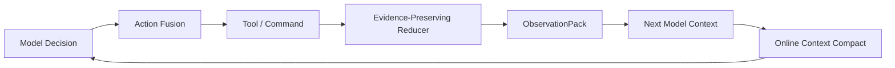

# SoL-Pi：把 Agent 自改进先落在 harness 的 token 经济学上

## 元信息

| 字段 | 内容 |
| --- | --- |
| 论文 | SoL-Pi: Recursively Scaling Auto-Research Loops for Efficient Agent Harness |
| 链接 | https://arxiv.org/abs/2609.20519v1 |
| arXiv ID | arXiv:2609.20519v1 |
| 提交时间 | 2026-09-17 14:58:29 UTC |
| 项目页 | https://nvlabs.github.io/SoL-Pi/ |
| 代码 | https://github.com/NVlabs/SoL-Pi |
| 方向 | 大模型 Agent / coding agent harness / recursive self-improvement / token efficiency |

## TL;DR

1. 这篇论文关心的不是“换一个更强模型”，而是 **coding agent 的 harness 是否能被自动研究循环优化**：同样的模型和任务，如果工具调用、上下文、观察结果、日志阅读方式不同，token 和成本会大幅变化。
2. 作者把问题定义成 capability-constrained efficiency：候选机制必须先保住任务能力，再降低 token traffic、API cost 或 turns；省钱不能靠提前退出、跳过验证或隐藏证据。
3. SoL-Pi 的搜索规模是 **152 个机制方向、535 个可执行训练环境、3000+ 次运行、60000+ 次 agent-environment interactions**；EdgeBench 保持隔离，只在机制冻结后做 held-out 验证。
4. 最终留下四个机制：**Action Fusion** 合并编辑和验证命令，**Online Context Compact** 在计划边界做经济门控压缩，**ObservationPack** 把大观察变成本地句柄，**Evidence-Preserving Reducer** 用低成本模型压缩诊断日志并做确定性校验。
5. 在 EdgeBench 51 个公开任务上，完整四机制 SoL-Pi Efficiency 相对 Pi 把总 token 从 **2.1538B 降到 1.0990B**，token cost 从 **1339 美元降到 894 美元**，平均分从 **44.833 降到 42.003**，保留约 **93.7%** 分数。
6. 同一套机制不重新搜索迁移到 Opus 5 时，完整栈相对 Pi 保留 **94.3%** 平均分，同时减少 **44.7%** token traffic 和 **33.5%** API cost；这是跨 backend 迁移的初步证据，不是任意模型上都成立的保证。
7. 论文也给出反例边界：Terminal-Bench 4 上 SoL-Pi 只解出 **15/63**，Codex 和 Pi 都是 **18/63**；它节省总成本和单题成本，但牺牲了解题数，说明“效率机制”不能替代能力评测。
8. 研究意义在于：RSI 不一定先发生在模型权重里，也可以发生在 agent harness 的工程层；但本文证明的是 EdgeBench 等公开基准上的 harness efficiency transfer，不应外推成“coding agent 已能无限递归自改进”。

## 1. 研究问题：长程 Agent 的瓶颈为什么变成 token 经济学？

### 从补全代码到无人值守轨迹

coding agent 的工作单元已经变了：

| 阶段 | 典型输入输出 | 主要成本 |
| --- | --- | --- |
| 代码补全 | 单个文件片段 -> 若干行代码 | 单次推理成本 |
| issue 修复 | repo 状态 -> patch + test | 多轮工具调用 |
| 长程探索 | 多任务、多 workspace、多日志、多验证 | 历史上下文和观察重放 |
| 自动研究循环 | agent 改进 harness，再评测 harness | 失败实验和搜索成本 |

论文的出发点是：

```text
long-horizon agent cost
= model inference
+ repeated context replay
+ large observation replay
+ redundant action/verification turns
+ diagnostic-log reading
+ failed search loops
```

这个公式不是作者显式给出的目标函数，而是本文机制的合并解释。它把“模型成本”拆成 harness 可以控制的几类流量。

### 作者真正重定义的问题

以往降低成本有几条路：

1. 更便宜的模型。
2. 更快的 serving。
3. 更短的上下文。
4. 更小的任务预算。

SoL-Pi 选择的是第五条：

> 在不改模型权重的情况下，让 harness 少制造无用 token。

它的研究问题可以写成：

```text
给定基础 harness H、任务分布 D、能力指标 Q、成本指标 C，
寻找机制 m，使 H+m 在 Q 上不低于容忍线，
同时让 C(H+m, D) < C(H, D)。
```

变量解释：

| 符号 | 含义 | SoL-Pi 对应物 |
| --- | --- | --- |
| H | 基础 agent harness | Pi |
| m | 可复用机制 | 四个 retained mechanisms |
| D | 任务分布 | 535 搜索环境 + held-out EdgeBench |
| Q | 能力指标 | task score、pass、solved tasks |
| C | 成本指标 | token traffic、API cost、turns |
| 容忍线 | 能力地板 | predeclared capability tolerance |

关键是最后一列：机制不能只在一个任务上省 token，而要能在未见任务上保持质量。

## 2. 论证路线：claim -> mechanism -> evidence -> boundary

### 论文主张拆解

| 层级 | 主张 | 机制 | 证据 | 边界 |
| --- | --- | --- | --- | --- |
| 问题层 | 长程 agent 的 token 效率是系统问题 | 把 harness 当作优化对象 | Pi、Codex、Claude Code 在 EdgeBench 上成本差异大 | 成本按 2026-08-17 API 价格计算 |
| 搜索层 | AI 可以自动发现 harness 机制 | 152 方向 -> broad-to-deep search | 535 环境、3000+ runs、60000+ interactions | 搜索 backend 主要是 GPT-5.6 Sol |
| 机制层 | 四个机制能组合降低冗余 | Action Fusion、OCC、ObservationPack、EPR | EdgeBench token 从 2.1538B 到 1.0990B | 平均分略降，且机制触发依赖任务 |
| 迁移层 | 机制可跨 backend 初步迁移 | frozen mechanisms 直接用到 Opus 5 | Opus 5 token 降 44.7%、cost 降 33.5% | 作者称 preliminary evidence |

### Figure 1：漏斗不是装饰，而是筛选证据


这张图承担两个证据功能：

1. **左侧漏斗**：说明 SoL-Pi 不是人工挑四个技巧，而是从 auto-research pool 里筛出机制。
2. **右侧条形图**：把 native harness、Pi、SoL-Pi 的 score 和 API cost 放在同一图里，强调“性能接近但成本下降”。

要注意它不能证明：

1. 搜索一定找到了最优 harness。
2. 四个机制对所有 agent 框架都适用。
3. token 减少必然带来安全性提升。

它证明的是：在作者设定的搜索和验证协议下，四个机制能在 held-out EdgeBench 上形成可观效率收益。

## 3. 方法：把 harness 当成可训练系统

### Broad-to-Deep Harness Search

作者把搜索拆成两层：

| 层 | 输入 | 操作 | 输出 |
| --- | --- | --- | --- |
| 外层 broad search | 152 个候选方向 | Oracle Analysis 先看历史轨迹里的可避免工作 | 选出值得 rollout 的方向 |
| 内层 deep loop | 某个候选方向 | propose -> implement -> review -> validate | 保留或拒绝机制 |
| 最终冻结 | 候选机制 + 接受规则 | 冻结源码、配置、指标、容忍线 | EdgeBench held-out 评测 |

伪代码可以写成：

```text
Input: idea_pool, search_envs, heldout_eval
State: retained_mechanisms = []

for idea in broad_screen(idea_pool):
    lineage = initialize_loop(idea)
    while budget remains:
        trajectories = rollout(base_or_candidate_harness, search_envs)
        evidence = map_reduce(trajectories)
        proposal = propose_mechanism(evidence)
        patch = implement(proposal)
        review = reviewer_check(patch)
        if review fails:
            continue
        result = in_trajectory_validate(patch)
        if passes capability_floor and improves efficiency:
            lineage.retain(patch)

frozen = freeze(best(lineages))
Output: heldout_eval(frozen) without feeding results back into search
```

这个流程里最重要的边界是最后一行：held-out 结果不能回流到搜索循环。否则 harness 会逐渐变成 EdgeBench 定制器，而不是可迁移机制。

### 搜索环境：535 个环境为什么重要？

论文使用两类训练环境：

| 环境类型 | 数量 | 构造方式 | 作用 |
| --- | ---: | --- | --- |
| repository-derived | 495 | 从 GitHub issue-PR pair 还原 pre-fix repo，隐藏 PR 和 regression test | 给出真实软件修复轨迹和可验证通过条件 |
| verifier-driven | 40 | 先生成 executable verifier，再构造开放式任务 | 覆盖没有单一参考补丁的探索场景 |
| EdgeBench | 51 个公开任务用于评估 | 搜索阶段隔离 | 冻结后验证 generalization |

作者还强调：EdgeBench 的 task、verifier、feedback 不进入环境合成。这个设置使最终分数更像迁移评测，而不是训练集回放。

## 4. 四个机制：每个都在减少一种“重复劳动”


### Action Fusion：把可预期的验证合并进同一轮

常见 coding agent 轨迹是：

```text
model -> edit file
tool -> edit result
model -> run test
tool -> test result
model -> inspect/fix/finish
```

Action Fusion 改成：

```text
model -> edit file + follow-up command
tool -> edit result + command result
model -> inspect/fix/finish
```

它减少的是中间那次“模型看完编辑成功，再决定运行测试”的轮次。

边界也很清楚：

1. 如果下一步命令依赖编辑结果内容，不能盲目 fusion。
2. 如果 follow-up command 可能有破坏性，harness 需要维持原有权限和 shell 规则。
3. 机制收益依赖任务中“编辑后马上验证”的频率。

### Online Context Compact：压缩要算经济账

普通压缩容易犯两个错：

| 错误 | 后果 |
| --- | --- |
| 过早压缩 | 损失 prompt cache prefix，反而增加 cache write 成本 |
| 过晚压缩 | 大量旧上下文反复进入输入，浪费 cache read |

Online Context Compact 的门控逻辑是：

```text
projected_savings
= expected_future_requests * removable_context_tokens * cache_read_price

rewrite_cost
= current_context_tokens * cache_write_price
+ unrecovered_previous_compaction_debt

if projected_savings > rewrite_cost * margin:
    compact_at_plan_boundary()
```

它利用 `update_plan` 的完成边界，估计剩余请求数和上下文增长速度。论文特别指出：完整栈在 GPT-5.6 Sol 上让 cache read 从 **2.1326B** 降到 **1.0605B**，但 cache write 从 **0.0141B** 升到 **0.0316B**。所以作者不是宣称“cache 越多越好”，而是看整段任务的总成本。

### ObservationPack：大观察先给全量，之后给句柄

ObservationPack 针对的是大工具输出重复进入上下文：

| 规则 | 设计含义 |
| --- | --- |
| 超过 10 KiB 的结果进入本地 archive | 原始证据不丢 |
| 前两次 provider request 仍发送全量 | 给模型第一次理解和回看机会 |
| 第三次起替换为 stable handle + 原始大小 + 1 KB head/tail excerpt | 减少长期重放 |
| agent 可通过 handle 精确分页召回 | 保留可审计路径 |

这个机制的研究意义在于：上下文压缩不一定要改写整段历史，也可以把“观察对象”变成可寻址的本地证据。

### Evidence-Preserving Reducer：让低成本模型读日志，但要可验证

EPR 只处理特定诊断日志：

1. build/test log 至少 4 KiB。
2. 文件读取和搜索结果跳过 reducer。
3. 原始输出先归档。
4. 低成本模型提取 compact receipt。
5. deterministic verifier 检查 schema、source hash、exit status、精确引用和 size。
6. 任一失败就回退原日志。

这个设计把“让另一个模型帮忙读日志”的风险压到可检验边界内。项目 SECURITY 文档也提醒：EPR 不是 sandbox；疑似 secret detector 只是防线之一，不能把它当完整 secret scanner。

## 5. 实验主结果：效率点和性能点要分开看

### EdgeBench 51 题公开集

论文给出两个 SoL-Pi operating points：

| 配置 | 含义 | Avg. Score | Total Tokens | Token Cost | Token Eff. |
| --- | --- | ---: | ---: | ---: | ---: |
| Pi baseline, GPT-5.6 Sol | 基础 harness | 44.833 | 2.1538B | $1339 | 0.5855 |
| SoL-Pi Efficiency | 四机制完整栈 | 42.003 | 1.0990B | $894 | 0.4174 |
| SoL-Pi Performance | 单机制最高分，Sol 上是 ObservationPack | 47.208 | 2.0224B | $1271 | 0.5280 |

这张表最容易误读，所以要拆开：

1. **Efficiency 点**：牺牲一部分平均分，换来约一半 token traffic 和三分之一成本下降。
2. **Performance 点**：不是四机制完整栈，而是单机制最高分配置；它提高分数 5.3%，token 也降 6.1%。
3. **完整栈不是最高分配置**：作者把它定位成效率导向，而不是 score leaderboard 方案。

### 跨 backend 迁移

在 Opus 5 上，作者没有重新搜索机制：

| 配置 | Avg. Score | Total Tokens | Token Cost | 相对 Pi 的解释 |
| --- | ---: | ---: | ---: | --- |
| Pi, Opus 5 | 44.756 | 2.3697B | $1741 | baseline |
| SoL-Pi Efficiency, Opus 5 | 42.224 | 1.3101B | $1158 | 保留 94.3% 分数，token 降 44.7%，cost 降 33.5% |
| SoL-Pi Performance, Opus 5 | 50.482 | 2.1016B | $1605 | 最高分单机制，对应 Action Fusion |

这里的证据边界是：

1. 搜索主要来自 GPT-5.6 Sol 轨迹。
2. Opus 5 上触发率和触发强度更低。
3. 但触发任务上的 token efficiency 仍改善。

所以结论应写成“初步跨 backend 迁移”，不能写成“backend-independent optimal harness”。

## 6. 消融、失败和反例：省钱不是免费午餐

### 单机制消融

单机制表有两个重要信息：

| backend | 最高分单机制 | 最低成本完整栈 | 说明 |
| --- | --- | --- | --- |
| GPT-5.6 Sol | ObservationPack，47.208 分 | SoL-Pi Efficiency，$894 | 大观察句柄有时改善质量，但完整栈偏效率 |
| Opus 5 | Action Fusion，50.482 分 | SoL-Pi Efficiency，$1158 | 不同 backend 的机制触发模式不同 |

这支持一个更细的判断：

```text
机制是否有用 != 机制是否该全开
```

完整栈的价值是组合效率；单机制的价值可能是性能或局部成本改善。部署时需要按任务类型和 backend 做策略选择。

### Terminal-Bench 4 和 IMO 2026

| Benchmark | Codex | Pi | SoL-Pi | 应该怎么读 |
| --- | ---: | ---: | ---: | --- |
| Terminal-Bench 4 solved / 63 | 18 | 18 | 15 | SoL-Pi 成本最低，但解题数下降 |
| Terminal-Bench 4 total cost | $272.35 | $286.45 | $211.12 | 相对 Pi 总成本降 26.3% |
| IMO 2026 pass / 6 | 5 | 3 | 3 | SoL-Pi 没超过 Codex 的通过数 |
| IMO 2026 cost / passed | $22.89 | $25.32 | $20.90 | 单个通过问题成本最低 |

这组结果是论文里最有价值的“反夸张”证据：

1. SoL-Pi 的强项是成本效率。
2. 在某些 benchmark 上，它会少完成任务。
3. 如果目标是最大通过数，不应只看 cost / solved。

### Action Fusion 的发现过程


Action Fusion 不是一次性写出来的规则。论文说它经历 **27 个记录迭代、四个阶段**，其中第 03 阶段有 **18 次 prompt-optimization explorations**。

这个图的价值在于展示：

1. Oracle analysis 先发现相邻动作重复。
2. prompt-only 触发不可靠。
3. agent 最后扩展 tool schema，把 fused action 变成稳定接口。
4. 搜索过程中引入 trigger rate 作为中间接受指标。

这说明 auto-research 不只是调 prompt，也会把“该观测什么指标”纳入机制演化。

## 7. 与相关工作的位置：不是 context compression 的单点方案

### SoL-Pi 和三类工作相邻

| 相邻方向 | 代表问题 | SoL-Pi 的不同点 |
| --- | --- | --- |
| harness optimization | 如何自动改 agent loop | 强调多环境搜索和 held-out 隔离 |
| context/token-efficient agents | 如何少传历史和观察 | 同时覆盖 action、context、observation、delegated reading |
| recursive self-improvement | AI 如何改进 AI 系统 | 先在 harness 层做 efficiency RSI |

它不像单一 context compression 论文，因为四个机制分布在不同边界：



这个 Mermaid 图概括了论文的系统观：token 浪费不只发生在 context，而是发生在 model、tool、observation、plan boundary 的循环里。

## 8. 局限：本文证明了什么，又没有证明什么？

### 已证明或有强证据支持

1. 在作者的搜索环境和 EdgeBench 公开集上，四机制完整栈能明显降低 token traffic 和 API cost。
2. 在 GPT-5.6 Sol 与 Opus 5 两个 backend 上，完整栈都能维持相近平均分并改善 token efficiency。
3. harness 搜索可以发现不止一个点状技巧，并把它们组合成可发布的 Pi extension。
4. 本地归档、deterministic verifier、fallback path 对保留证据很重要。

### 不能直接外推的结论

| 不应外推 | 原因 |
| --- | --- |
| 任意 coding agent 都会省 45% token | 机制依赖 Pi extension API、任务结构和触发率 |
| 完整栈一定提高任务分数 | GPT-5.6 Sol Efficiency 平均分低于 Pi |
| EPR 可以安全处理所有日志 | SECURITY 明确说 SoL-Pi 不是 sandbox，secret detector 不完整 |
| RSI 已经形成自我加速闭环 | recursive efficient improvement 是未来方向，不是当前实验证明 |
| EdgeBench 结果等于生产环境收益 | EdgeBench 是公开任务集，真实 repo、权限和日志敏感性更复杂 |

### 作者自己的未来方向

论文最后提出四条：

1. **Pre-Training the Harness**：像预训练模型一样，用更多任务暴露 harness。
2. **Multi-Backend Training**：不要只从单一 LLM backend 轨迹学习。
3. **Recursive Efficient Improvement**：更便宜的 harness 可降低下一轮 auto-research 成本。
4. **Search Coverage and Cost**：系统研究搜索广度、深度和预算的 scaling law。

最值得继续追问的是第三条：如果 SoL-Pi 让 auto-research 每轮更便宜，那么下一代 harness 搜索能否在同样预算下覆盖更多环境，并找到更强机制？本文只给出方向，没有给出递归收益曲线。

## 9. 机制账本：四个 retained mechanisms 分别在守什么边界？

### 机制不是“省 token 插件”，而是带有拒绝条件的决策器

如果只把四个机制理解成插件开关，就会漏掉论文最重要的工程约束。每个机制都有：

1. 触发条件。
2. 能力保护条件。
3. 失败回退路径。
4. 对后续上下文的影响。

| 机制 | 触发点 | 省掉什么 | 必须保留什么 | 失败时怎么退 |
| --- | --- | --- | --- | --- |
| Action Fusion | 文件 mutation 工具准备执行时 | 一次中间 model turn | mutation 结果和验证命令结果 | 不融合，仍走原工具调用 |
| Online Context Compact | `update_plan` 标记子任务完成，或窗口接近上限 | 未来重复 cache read | 足够的任务状态和计划重建信息 | 不压缩，继续原上下文 |
| ObservationPack | 大工具输出超过阈值且进入后续请求 | 大观察的重复全文输入 | 本地 archive、句柄、可分页召回 | 小输出不变，大输出可召回原文 |
| Evidence-Preserving Reducer | build/test 类日志达到阈值 | 长日志全文重放和主模型读日志成本 | 原日志 hash、exit status、精确引用 | verifier 失败就返回原日志 |

这个账本说明：SoL-Pi 的设计不是“尽量摘要”，而是“只有能证明摘要没有破坏证据时才摘要”。这对 agent 系统尤其重要，因为很多失败不是模型不会推理，而是它被 harness 喂了错误、残缺或不可追溯的状态。

### 为什么四个机制会互相影响？

四个机制不是独立相加。它们在同一条轨迹里顺序发生：

1. Action Fusion 先减少 agent 和工具之间的往返。
2. 工具返回后，EPR 可能把日志压成 receipt。
3. ObservationPack 再决定大观察是否用句柄投影。
4. Online Context Compact 在计划边界决定是否重写历史。

这种顺序带来两个相互作用：

| 相互作用 | 可能收益 | 可能风险 |
| --- | --- | --- |
| EPR -> ObservationPack | 已验证 receipt 不再被 ObservationPack 二次打包，避免丢证据 | 如果 reducer 过度摘要，主模型可能少看错误线索 |
| ObservationPack -> Online Compact | 大观察不再反复撑大上下文，压缩门控更少被迫触发 | 句柄召回需要模型知道何时查原文 |
| Action Fusion -> cost accounting | 少一次模型回合，后续上下文增长也变慢 | 过度融合会让 command 时机变得不透明 |
| Online Compact -> prompt cache | 减少后续输入，但会制造 cache write | 压缩过早会损失稳定前缀 |

论文的消融表正是在告诉读者：这些相互作用不能用单机制直觉替代。比如 ObservationPack 在 GPT-5.6 Sol 上单独最高分，但完整栈选择的是效率点；Online Context Compact 单独能大幅降 cache read，但完整栈里还要看 EPR 和 ObservationPack 是否已经削掉观察负担。

## 10. 评测读法：三个数字要一起看

### 不能只看平均分

EdgeBench 表格里至少有三种读法：

1. **任务质量**：平均分越高越好。
2. **绝对成本**：总 token cost 越低越好。
3. **单位质量成本**：cost / score 越低越好。

如果只看平均分，会选 GPT-5.6 Sol 的 SoL-Pi Performance，47.208 分。如果只看绝对成本，会选 SoL-Pi Efficiency，894 美元。如果看单位质量成本，Efficiency 也是 0.4174 美元每分，明显低于 Pi 的 0.5855。

这说明生产部署需要先回答：

| 部署目标 | 更接近的选择 | 理由 |
| --- | --- | --- |
| 批量跑大量中等难度任务 | SoL-Pi Efficiency | 成本节省会累积，轻微分数下降可接受 |
| 单个高价值任务必须尽量解出 | Performance 或 baseline | 不能为省钱牺牲完成率 |
| 探索不同模型 backend | 需要重新量化触发率 | Opus 5 触发模式不同 |
| 合规或敏感日志环境 | 先关闭 EPR 或只本地机制 | remote reducer 有数据边界 |

### Terminal-Bench 4 的“失败”其实很有信息量

Terminal-Bench 4 上 SoL-Pi 比 Pi 少解 3 题。这不是论文的瑕疵，而是恰好让结果更可信：

1. 作者没有只挑 SoL-Pi 赢的指标。
2. 成本下降和能力下降被同时报告。
3. GPU-dependent task 被排除，实验边界写在表注里。
4. 每个 IMO 问题有 150 分钟上限，避免无效循环无限烧钱。

这类报告方式对后续 agent benchmark 很重要。只报告“节省百分比”会掩盖能力损失；只报告“通过数”又会忽略单位成本。SoL-Pi 的表格强迫读者同时看两边。

### Swarm 实验说明了什么？

论文还做了 kernel-optimization swarm：

| 配置 | 两小时结果 | 成本 | 读法 |
| --- | ---: | ---: | --- |
| single Codex agent | 1333 cycles | $39.20 | 最便宜，但不是 swarm |
| Codex coordinator + 20 Pi workers | 1366 cycles | $82.12 | swarm 成本高，结果反而较差 |
| Codex coordinator + 20 SoL-Pi workers | 1127 cycles | $60.11 | 比 Pi swarm 成本低 26.8%，结果更好 |

这个实验不能证明 SoL-Pi 对所有多 agent 系统都有效，但它说明一个机制：worker harness 更省 token 时，协调器可以把固定预算用于更多有效探索，而不是让 worker 重复读日志、重复跑中间轮次。

## 11. 安全与发布边界：为什么 README/SECURITY 也要读？

### 开源版本的默认姿态很保守

项目 README 给出几个部署事实：

1. SoL-Pi 是 Pi 的 standalone extension，不 vendor Pi source。
2. 四个机制都是 opt-in，默认关闭。
3. 配置文件是单一有效配置，不做 project/global 合并。
4. 官方 Pi 下查找 `.pi/sol-pi.json` 或 `~/.pi/agent/sol-pi.json`。
5. conservative 示例只开启 Action Fusion 和 ObservationPack。

这和论文里的研究 harness 不完全等价。论文评测完整栈，开源部署默认却是关闭全部机制；这是正确的安全姿态，因为真实项目的 shell、日志、凭据、权限边界都比 benchmark 更复杂。

### EPR 是最需要谨慎启用的机制

SECURITY 文档给出的风险点很直接：

| 风险 | 文档边界 | 实践建议 |
| --- | --- | --- |
| SoL-Pi 权限 | 与加载它的 Pi 进程权限相同，不是 sandbox | 不要把 extension 当隔离层 |
| 远程日志压缩 | EPR 可能通过配置模型发送诊断日志 | 敏感日志场景禁用 remote reduction |
| secret 检测 | likely-secret detector 不是完整扫描器 | 不能替代 secret-scan |
| 项目级配置 | `.pi/sol-pi.json` 可启用 mutation、shell、archive、remote reduction | 只信任可信 repo |
| 本地 archive | ObservationPack 和 EPR 在 session 目录存档 | 会话目录也要按敏感数据管理 |

这部分和论文的研究问题紧密相关：如果一个 harness 为了省 token 而把敏感日志交给另一个模型，那它可能把“成本优化”变成“数据暴露”。SoL-Pi 的设计通过 opt-in、verifier 和 fallback 降低风险，但没有把风险消灭。

## 12. 对 Agent 研究的延伸问题

### 后续可以怎么检验？

我会把后续研究拆成四个可检验问题：

| 问题 | 需要的实验 |
| --- | --- |
| 多 backend 训练是否更稳？ | 用 GPT-5.6 Sol、Opus 5、较小模型共同生成训练轨迹，再比较触发率 |
| 机制组合是否存在负相互作用？ | 做 all-subsets ablation，而不只 add-one |
| 成本节省是否来自少做验证？ | 对每个失败任务审计 verifier 调用、测试覆盖和 final claim |
| 自动研究循环是否真能递归降本？ | 用 SoL-Pi 作为下一轮 base harness，比较同预算覆盖的环境数和 retained mechanisms |

### 对“AI for AI research”的启发

这篇论文给 AI for AI research 一个更务实的路线：

1. 不必一开始就让 AI 改模型权重。
2. 可以先让 AI 改实验 harness、评测 harness、日志 harness。
3. 每个改动必须有 held-out 评测和能力地板。
4. 自动研究输出的不是论文段落，而是能被打开、配置、运行和回退的机制。

这让“递归自改进”从一个宏大概念变成了较小但可审计的工程命题：AI 是否能降低下一轮 AI 实验的边际成本？

### 最小可复现实验应固定哪些变量？

如果后续团队想复现 SoL-Pi 的结论，最小实验不能只写“开启四个机制再跑 benchmark”。至少要固定：

| 变量 | 为什么要固定 |
| --- | --- |
| 模型 backend 和 reasoning level | 机制触发率随 backend 改变 |
| API 价格日期 | 论文成本使用 2026-08-17 价格 |
| EdgeBench 任务子集 | 论文使用 51 个公开任务 |
| capability tolerance | 决定省钱候选是否被拒绝 |
| 是否允许 remote reducer | 影响安全边界和日志成本 |
| 原始轨迹归档策略 | 决定摘要后能否审计 |

换句话说，SoL-Pi 的可复现性不是“同样命令跑一遍”，而是“同样 harness、同样价格表、同样任务切分、同样接受规则”一起成立。

## 13. 研究者结论

### 为什么这篇值得本周读？

1. 它把 Agent 研究从“模型是否更聪明”拉回到“harness 是否浪费工作”。
2. 它没有只给 demo，而是给出搜索协议、环境隔离、消融和失败边界。
3. 它给了一个具体数字锚点：完整栈在 EdgeBench 上把 Pi 的总 token 从 **2.1538B** 降到 **1.0990B**。
4. 它提醒我们：agentic systems 的效率、可靠性和安全性都可能取决于 harness 层，而不是只取决于模型层。

### 我会怎样使用这篇论文的结论？

如果把它放进自己的 agent 研究框架，我会采用三个原则：

| 原则 | 实践含义 |
| --- | --- |
| 先定义能力地板 | 任何省 token 机制都必须证明没有靠少做事取胜 |
| 保留原始证据 | 压缩、摘要、reducer 都要有可召回原文 |
| 分开评测效率点和性能点 | 最高分配置和最低成本配置可能不是同一个 |

最后的判断是：SoL-Pi 最强的贡献不是四个机制本身，而是把“harness 也可以被自动研究循环改进”这件事做成了可评测、可发布、可审计的系统实验。
